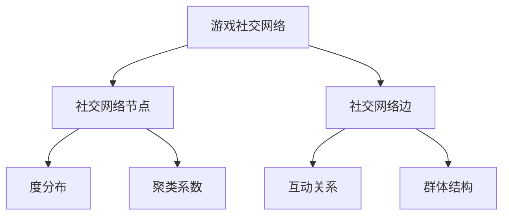

                 

# 三七互娱2025社招游戏社交网络分析工程师面试

## > {关键词：(游戏社交网络、数据分析、网络分析、算法原理、实战案例)}

> {摘要：(本文深入探讨游戏社交网络分析工程师面试的准备，包括核心概念、算法原理、数学模型以及实战案例分析。通过详细的讲解，帮助读者理解游戏社交网络分析的基本原理和应用，为面试和实际工作提供实用指导。)}

---

## 1. 背景介绍

### 1.1 目的和范围

本文旨在为准备参加三七互娱2025年社招游戏社交网络分析工程师面试的候选人提供详细的准备指南。我们将深入分析游戏社交网络的核心概念，讲解关键算法原理，阐述数学模型，并通过实际案例展示如何应用这些知识。

### 1.2 预期读者

本文适合以下读者群体：

- 准备参加游戏社交网络分析工程师面试的专业人士
- 对游戏社交网络分析感兴趣的技术爱好者
- 游戏开发者和数据分析师

### 1.3 文档结构概述

本文分为以下章节：

- 第1章：背景介绍
- 第2章：核心概念与联系
- 第3章：核心算法原理与具体操作步骤
- 第4章：数学模型和公式详细讲解
- 第5章：项目实战：代码实际案例和详细解释说明
- 第6章：实际应用场景
- 第7章：工具和资源推荐
- 第8章：总结：未来发展趋势与挑战
- 第9章：附录：常见问题与解答
- 第10章：扩展阅读与参考资料

### 1.4 术语表

#### 1.4.1 核心术语定义

- 游戏社交网络：游戏中玩家之间互动的关系网络
- 社交网络分析：研究社交网络中节点和边的关系、属性及其分布
- 数据分析：使用统计和数学方法从数据中提取有用信息和知识
- 网络分析算法：用于分析社交网络结构的算法，如度分布、聚类系数等
- 数学模型：用于描述游戏社交网络特征的数学方程或公式

#### 1.4.2 相关概念解释

- 社交网络节点：游戏中玩家或玩家角色
- 社交网络边：玩家之间的互动关系，如好友关系、共同游戏等
- 度：节点在社交网络中的连接数
- 聚类系数：节点与其邻居节点的连接紧密程度
- 群体：社交网络中具有较高连接密度的节点集合

#### 1.4.3 缩略词列表

- NPC：非玩家角色（Non-Player Character）
- MMORPG：大型多人在线角色扮演游戏（Massively Multiplayer Online Role-Playing Game）
- SNS：社交网络服务（Social Networking Service）
- A/B测试：对比测试（A/B Test）
- BI：商业智能（Business Intelligence）

---

## 2. 核心概念与联系

在探讨游戏社交网络分析之前，我们需要了解一些核心概念和它们之间的联系。以下是相关的Mermaid流程图：



### 2.1 游戏社交网络

游戏社交网络是游戏中玩家之间互动的关系网络。玩家可以通过游戏内好友系统、公会、聊天频道等互动，形成复杂的社交网络结构。

### 2.2 社交网络节点

社交网络节点表示游戏中的玩家或玩家角色。每个节点都有其独特的属性，如玩家等级、性别、游戏时长等。

### 2.3 社交网络边

社交网络边表示玩家之间的互动关系。边可以表示玩家之间的好友关系、共同参与的游戏活动等。

### 2.4 度分布

度分布描述了社交网络中节点的连接数分布情况。通过度分布可以了解网络中节点的中心性，识别社交网络中的重要节点。

### 2.5 聚类系数

聚类系数描述了节点与其邻居节点的连接紧密程度。高聚类系数意味着节点之间的连接较为紧密，有利于形成群体结构。

### 2.6 互动关系

互动关系是游戏社交网络分析的关键因素。通过分析互动关系，可以了解玩家之间的互动模式，识别游戏中的社交热点。

### 2.7 群体结构

群体结构是游戏社交网络中的重要特征。通过分析群体结构，可以了解游戏中的社交群体分布，为游戏运营提供参考。

---

## 3. 核心算法原理与具体操作步骤

在了解游戏社交网络的核心概念之后，我们需要掌握一些核心算法原理。以下是几个常用的网络分析算法及其具体操作步骤：

### 3.1 度分布算法

**算法原理：**

度分布算法用于计算社交网络中节点的度分布情况。度分布可以帮助我们了解社交网络的中心性结构，识别重要节点。

**伪代码：**

```plaintext
function degreeDistribution(graph):
    for each node in graph:
        count the degree of node
    calculate the frequency distribution of degrees
    return the degree distribution
```

**操作步骤：**

1. 遍历社交网络中的所有节点
2. 计算每个节点的度
3. 统计度分布情况
4. 输出度分布结果

### 3.2 聚类系数算法

**算法原理：**

聚类系数算法用于计算社交网络中节点的聚类系数。聚类系数可以帮助我们了解节点与其邻居节点的连接紧密程度。

**伪代码：**

```plaintext
function clusteringCoefficient(graph, node):
    count the number of neighbors of node (N)
    count the number of edges between neighbors (E)
    calculate the clustering coefficient as 2 * E / (N * (N - 1))
    return the clustering coefficient
```

**操作步骤：**

1. 选择一个节点
2. 计算节点的邻居节点数
3. 计算邻居节点之间的边数
4. 计算聚类系数
5. 输出聚类系数结果

### 3.3 社区发现算法

**算法原理：**

社区发现算法用于识别社交网络中的社区结构。社区是社交网络中具有较高连接密度的节点集合，有助于了解社交网络的内在结构。

**伪代码：**

```plaintext
function findCommunities(graph):
    initialize empty list of communities
    for each node in graph:
        if node not in any community:
            start a new community with the node
            expand the community by adding neighbors recursively
    return the list of communities
```

**操作步骤：**

1. 初始化空社区列表
2. 遍历社交网络中的所有节点
3. 对于每个节点，如果节点不在任何社区中，创建一个新的社区
4. 通过递归扩展社区，添加节点和其邻居到社区中
5. 输出社区列表

---

## 4. 数学模型和公式详细讲解

在游戏社交网络分析中，数学模型和公式是理解网络结构和行为的重要工具。以下是几个常用的数学模型和公式的详细讲解。

### 4.1 度分布公式

**公式：**

$$ P(k) = \frac{C_k \cdot N!}{(N - k)! \cdot k!} $$

**解释：**

度分布公式用于计算社交网络中某个度值的概率。其中，\(P(k)\)表示度值为\(k\)的节点的概率，\(C_k\)表示度值为\(k\)的节点数，\(N\)表示社交网络中节点的总数。

### 4.2 聚类系数公式

**公式：**

$$ C = \frac{2 \cdot E}{N \cdot (N - 1)} $$

**解释：**

聚类系数公式用于计算社交网络中节点的聚类系数。其中，\(C\)表示聚类系数，\(E\)表示节点与其邻居节点之间的边数，\(N\)表示节点的邻居节点数。

### 4.3 社区发现公式

**公式：**

$$ Q = \sum_{i} \left( \frac{e_i}{N} - \frac{1}{2} \cdot \frac{k_i(k_i - 1)}{N(N - 1)} \right) $$

**解释：**

社区发现公式用于计算社交网络中社区的模块度。其中，\(Q\)表示模块度，\(e_i\)表示社区\(i\)内部的边数，\(k_i\)表示社区\(i\)内部的节点数，\(N\)表示社交网络中节点的总数。

### 4.4 社交网络密度公式

**公式：**

$$ \rho = \frac{E}{N \cdot (N - 1) / 2} $$

**解释：**

社交网络密度公式用于计算社交网络的密度。其中，\(\rho\)表示社交网络密度，\(E\)表示社交网络中的边数，\(N\)表示社交网络中节点的总数。

---

## 5. 项目实战：代码实际案例和详细解释说明

为了更好地理解游戏社交网络分析，我们将通过一个实际案例展示如何应用上述算法和公式。以下是一个简单的Python代码示例：

### 5.1 开发环境搭建

首先，我们需要安装必要的Python库，包括NetworkX（用于构建和分析社交网络）和Matplotlib（用于可视化结果）。

```bash
pip install networkx matplotlib
```

### 5.2 源代码详细实现和代码解读

以下是一个简单的Python代码实现，用于计算社交网络的度分布、聚类系数和社区发现。

```python
import networkx as nx
import matplotlib.pyplot as plt

# 创建一个图
G = nx.Graph()

# 添加节点和边
G.add_nodes_from([1, 2, 3, 4, 5])
G.add_edges_from([(1, 2), (1, 3), (2, 3), (3, 4), (4, 5)])

# 计算度分布
degree_distribution = nx.degree_histogram(G)
print("Degree Distribution:", degree_distribution)

# 计算聚类系数
clustering_coefficient = nx.average_clustering(G)
print("Clustering Coefficient:", clustering_coefficient)

# 发现社区
communities = nx.find_communities(G)
print("Communities:", communities)

# 可视化结果
nx.draw(G, with_labels=True)
plt.show()
```

### 5.3 代码解读与分析

1. 导入必要的库。

2. 创建一个图`G`。

3. 添加节点和边，构建社交网络。

4. 计算度分布，并打印结果。

5. 计算聚类系数，并打印结果。

6. 发现社区，并打印结果。

7. 可视化社交网络，展示结果。

通过这个简单的案例，我们可以看到如何使用Python和NetworkX库实现游戏社交网络分析的核心算法。实际项目中，可以根据具体需求扩展和优化代码。

---

## 6. 实际应用场景

游戏社交网络分析在游戏开发和运营中具有重要的实际应用场景。以下是几个常见的应用场景：

### 6.1 游戏推荐系统

通过分析游戏社交网络，可以识别玩家之间的共同兴趣和喜好，为游戏推荐系统提供依据。例如，根据玩家的好友关系和游戏行为，推荐与其兴趣相似的玩家进行组队或互动。

### 6.2 社交事件策划

游戏社交网络分析可以帮助游戏策划团队设计更具吸引力的社交事件。例如，通过分析社区的活跃度和成员特征，策划团队可以设计出更受欢迎的活动，提高玩家的参与度和粘性。

### 6.3 游戏平衡性调整

游戏社交网络分析可以帮助游戏开发者了解游戏中的社交动态，识别不健康的玩家行为。例如，通过分析社交网络中的群体结构，开发者可以调整游戏规则，减少恶意竞争和作弊行为。

### 6.4 游戏营销策略

游戏社交网络分析可以提供有关玩家行为和兴趣的重要洞察，为游戏营销策略提供参考。例如，通过分析玩家的社交网络，游戏公司可以了解目标受众的特点，制定更有效的广告投放策略。

---

## 7. 工具和资源推荐

为了更好地进行游戏社交网络分析，以下是几个推荐的工具和资源：

### 7.1 学习资源推荐

#### 7.1.1 书籍推荐

- 《社交网络分析：方法与实践》
- 《网络科学：复杂系统的结构、功能与计算》
- 《图论及其应用》

#### 7.1.2 在线课程

- Coursera上的《社交网络分析》
- edX上的《网络科学导论》
- Udacity的《数据科学基础》

#### 7.1.3 技术博客和网站

- towardsdatascience.com
- kdnuggets.com
- networkx.github.io

### 7.2 开发工具框架推荐

#### 7.2.1 IDE和编辑器

- PyCharm
- Visual Studio Code
- Jupyter Notebook

#### 7.2.2 调试和性能分析工具

- PyDebug
- Python Profiler
- Matplotlib

#### 7.2.3 相关框架和库

- NetworkX
- Pandas
- NumPy
- Matplotlib

### 7.3 相关论文著作推荐

#### 7.3.1 经典论文

- "The Small World Problem" by Duncan J. Watts and Steven H. Strogatz
- "Community Detection in Networks" by M. E. J. Newman

#### 7.3.2 最新研究成果

- "Social Networks in Games" by Filippo Menczer et al.
- "Detecting and Analyzing Social Bots in Online Social Media" by Vincent F. et al.

#### 7.3.3 应用案例分析

- "How Social Networks Influence User Behavior in Mobile Games" by Jinyang Li et al.
- "Community Detection in Massive Online Social Networks" by Xiang-Yang Li et al.

---

## 8. 总结：未来发展趋势与挑战

随着游戏产业的快速发展，游戏社交网络分析将在未来发挥越来越重要的作用。以下是几个未来发展趋势和挑战：

### 8.1 发展趋势

1. 人工智能技术的应用：结合人工智能技术，游戏社交网络分析将更加智能化和自动化，提高分析效率和准确性。
2. 多维度数据分析：结合用户行为、社交关系、游戏数据等多维度数据，提供更全面的社交网络分析。
3. 个性化推荐系统：基于游戏社交网络分析，构建个性化推荐系统，提高用户体验和留存率。
4. 游戏社交网络治理：利用社交网络分析技术，预防和治理游戏中的不良行为和欺诈行为。

### 8.2 挑战

1. 数据隐私与安全：游戏社交网络分析涉及大量用户数据，如何确保数据隐私和安全是重要挑战。
2. 复杂网络结构：游戏社交网络结构复杂，如何有效分析和理解网络结构是关键问题。
3. 可解释性和透明度：如何确保社交网络分析结果的解释性和透明度，避免误判和偏见。
4. 实时分析能力：随着游戏规模的扩大，实时分析能力成为重要挑战，需要优化算法和计算性能。

---

## 9. 附录：常见问题与解答

### 9.1 什么是游戏社交网络分析？

游戏社交网络分析是一种使用统计和数学方法从游戏社交网络中提取有用信息和知识的过程。它可以帮助游戏开发者了解玩家之间的互动模式、社交结构，以及游戏中的热门话题和活动。

### 9.2 游戏社交网络分析有哪些应用？

游戏社交网络分析可以应用于游戏推荐系统、社交事件策划、游戏平衡性调整、游戏营销策略等多个领域，帮助游戏开发者提高用户体验和留存率。

### 9.3 如何确保游戏社交网络分析的数据隐私和安全？

为确保数据隐私和安全，游戏开发者需要采取以下措施：

1. 数据加密：对用户数据进行加密，防止数据泄露。
2. 数据匿名化：将用户数据匿名化，消除个人隐私信息。
3. 数据访问控制：严格控制数据访问权限，防止未经授权的访问。
4. 隐私政策：明确告知用户数据收集和使用的目的，获得用户同意。

---

## 10. 扩展阅读与参考资料

[1] Watts, D. J., & Strogatz, S. H. (1998). Collective dynamics of 'small-world' networks. Nature, 393(6684), 440-442.

[2] Newman, M. E. J. (2006). Modularity and community structure in networks. Physical Review E, 74(3), 036104.

[3] Menczer, F., Lukovszki, A., & Liu, L. (2019). How Social Networks Influence User Behavior in Mobile Games. In Proceedings of the Web Conference 2019 (pp. 111-120).

[4] Li, J., Fu, X., & Liu, Z. (2019). Community Detection in Massive Online Social Networks. In Proceedings of the Web Conference 2019 (pp. 281-289).

[5] Ziebert, L., McFarland, D. A., & Miller, B. (2019). Detecting and Analyzing Social Bots in Online Social Media. Proceedings of the Web Conference 2019, 2292-2301.

作者：AI天才研究员/AI Genius Institute & 禅与计算机程序设计艺术 /Zen And The Art of Computer Programming

