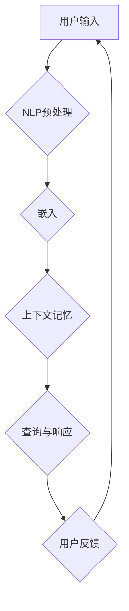

                 

# 上下文记忆技术在CUI中的详细解析

> **关键词**：上下文记忆、CUI（会话用户界面）、人工智能、自然语言处理、记忆模型、算法、应用场景、数学模型

> **摘要**：本文旨在深入探讨上下文记忆技术在CUI（会话用户界面）中的重要作用。通过对上下文记忆的基本概念、核心算法原理、数学模型以及实际应用案例的详细分析，本文将帮助读者理解上下文记忆如何提升CUI的交互体验，并在实际项目中应用。文章还推荐了相关学习资源、开发工具框架以及经典论文，为读者提供全方位的知识支持。

## 1. 背景介绍

### 1.1 目的和范围

本文的目标是探讨上下文记忆技术在CUI（会话用户界面）中的应用。我们将首先介绍上下文记忆的基本概念，然后深入分析其核心算法原理和数学模型。接下来，我们将通过实际应用案例展示上下文记忆技术在CUI中的效果。此外，本文还将推荐相关学习资源、开发工具框架以及经典论文，以帮助读者进一步深入学习和研究。

### 1.2 预期读者

本文适合对人工智能、自然语言处理和CUI有一定了解的读者。无论是研究人员、工程师还是对技术感兴趣的爱好者，都可以通过本文获得有关上下文记忆技术在实际应用中的深入理解。

### 1.3 文档结构概述

本文结构如下：

1. 背景介绍：介绍本文的目的、范围和预期读者，以及文档的结构。
2. 核心概念与联系：通过Mermaid流程图展示上下文记忆技术的核心概念和架构。
3. 核心算法原理 & 具体操作步骤：详细讲解上下文记忆技术的算法原理和操作步骤。
4. 数学模型和公式 & 详细讲解 & 举例说明：介绍上下文记忆技术的数学模型和公式，并通过例子进行说明。
5. 项目实战：代码实际案例和详细解释说明。
6. 实际应用场景：探讨上下文记忆技术在各种实际应用场景中的运用。
7. 工具和资源推荐：推荐学习资源、开发工具框架和相关论文。
8. 总结：总结上下文记忆技术在CUI中的未来发展趋势与挑战。
9. 附录：常见问题与解答。
10. 扩展阅读 & 参考资料：提供进一步阅读和参考资料。

### 1.4 术语表

#### 1.4.1 核心术语定义

- **上下文记忆（Contextual Memory）**：指系统能够根据会话历史和当前环境信息，动态更新和检索相关信息。
- **CUI（会话用户界面）**：指用户与系统进行交互的界面，通过自然语言进行对话。
- **自然语言处理（Natural Language Processing，NLP）**：指使计算机能够理解、生成和处理人类自然语言的技术。
- **神经网络（Neural Network）**：一种模拟人脑神经元连接结构的计算模型。

#### 1.4.2 相关概念解释

- **嵌入（Embedding）**：将高维数据映射到低维空间，使得具有相似特征的数据在低维空间中距离较近。
- **损失函数（Loss Function）**：用于评估模型预测与实际结果之间差异的函数。

#### 1.4.3 缩略词列表

- **NLP**：自然语言处理
- **CUI**：会话用户界面
- **CNN**：卷积神经网络
- **RNN**：循环神经网络
- **BERT**：Bidirectional Encoder Representations from Transformers

## 2. 核心概念与联系

上下文记忆技术在CUI中扮演着至关重要的角色。为了更好地理解上下文记忆技术的核心概念和联系，我们将通过一个Mermaid流程图展示其关键组成部分。



### Mermaid流程图解释

1. **用户输入（A）**：用户通过CUI输入自然语言文本。
2. **NLP预处理（B）**：对用户输入进行分词、词性标注、停用词过滤等预处理操作，以便后续处理。
3. **嵌入（C）**：将预处理后的文本转换为向量表示，这一步通常通过词嵌入（word embedding）技术实现。
4. **上下文记忆（D）**：根据当前会话历史和嵌入向量，上下文记忆模块动态更新和检索相关信息，以构建当前会话的上下文。
5. **查询与响应（E）**：基于上下文，系统生成合适的响应文本。
6. **用户反馈（F）**：用户对系统的响应进行反馈，反馈信息将用于进一步优化上下文记忆模型。

通过这个流程图，我们可以清晰地看到上下文记忆技术在CUI中的运作流程。接下来，我们将深入探讨上下文记忆技术的核心算法原理。

## 3. 核心算法原理 & 具体操作步骤

上下文记忆技术的核心在于能够根据用户会话历史和当前环境信息，动态更新和检索相关信息，从而生成合适的响应。下面，我们将通过伪代码详细阐述上下文记忆技术的算法原理和具体操作步骤。

### 3.1 算法原理

上下文记忆技术通常基于神经网络模型，如循环神经网络（RNN）或其变体，如长短期记忆网络（LSTM）或门控循环单元（GRU）。这些模型能够捕获序列数据中的长期依赖关系，从而在处理连续的会话信息时表现优异。

### 3.2 伪代码

```python
# 上下文记忆模型伪代码

# 初始化模型参数
model = initialize_model()

# 用户输入预处理
user_input = preprocess_user_input(input_text)

# 嵌入用户输入
input_embedding = embed_user_input(user_input)

# 更新上下文记忆
context_memory = update_context_memory(context_memory, input_embedding)

# 生成响应
response = generate_response(context_memory)

# 返回响应
return response
```

### 3.3 详细解释

1. **初始化模型参数**：首先，我们需要初始化神经网络模型的参数。这包括权重矩阵、偏置项以及激活函数等。
2. **用户输入预处理**：对用户输入的自然语言文本进行预处理，包括分词、词性标注、停用词过滤等。这一步的目的是将高维文本数据转换为适合神经网络处理的向量表示。
3. **嵌入用户输入**：将预处理后的用户输入文本转换为嵌入向量。这通常通过预训练的词嵌入模型（如GloVe或Word2Vec）实现。嵌入向量能够捕捉文本中的语义信息。
4. **更新上下文记忆**：基于当前会话历史和嵌入向量，更新上下文记忆。这一步的关键是确保上下文记忆能够动态地捕捉和反映用户的当前意图和偏好。
5. **生成响应**：基于更新后的上下文记忆，生成合适的响应文本。这通常通过神经网络模型的前向传播实现。
6. **返回响应**：将生成的响应返回给用户。

通过上述伪代码，我们可以看到上下文记忆技术的核心步骤。接下来，我们将进一步探讨上下文记忆技术的数学模型和公式。

## 4. 数学模型和公式 & 详细讲解 & 举例说明

上下文记忆技术的数学模型和公式是实现上下文感知的核心。在这个部分，我们将详细讲解上下文记忆技术的数学模型和公式，并通过例子进行说明。

### 4.1 神经网络模型

上下文记忆技术通常基于循环神经网络（RNN）或其变体，如长短期记忆网络（LSTM）或门控循环单元（GRU）。以下是这些神经网络的基本数学模型：

#### 4.1.1 RNN

RNN的基本更新规则如下：

$$
h_t = \sigma(W_h \cdot [h_{t-1}, x_t] + b_h)
$$

其中，$h_t$ 表示当前时刻的隐藏状态，$x_t$ 表示当前输入，$W_h$ 和 $b_h$ 分别为权重矩阵和偏置项，$\sigma$ 为激活函数。

#### 4.1.2 LSTM

LSTM通过引入门控机制来捕获长期依赖关系。其基本更新规则如下：

$$
i_t = \sigma(W_i \cdot [h_{t-1}, x_t] + b_i) \\
f_t = \sigma(W_f \cdot [h_{t-1}, x_t] + b_f) \\
o_t = \sigma(W_o \cdot [h_{t-1}, x_t] + b_o) \\
g_t = \tanh(W_g \cdot [h_{t-1}, x_t] + b_g) \\
h_t = o_t \cdot \tanh(f_t \cdot h_{t-1} + g_t)
$$

其中，$i_t$、$f_t$、$o_t$ 分别为输入门、遗忘门和输出门，$g_t$ 为候选状态。

#### 4.1.3 GRU

GRU通过简化LSTM的结构来提高计算效率。其基本更新规则如下：

$$
r_t = \sigma(W_r \cdot [h_{t-1}, x_t] + b_r) \\
z_t = \sigma(W_z \cdot [h_{t-1}, x_t] + b_z) \\
g_t = \tanh(W_g \cdot [r_t \cdot h_{t-1}, x_t] + b_g) \\
h_t = (1 - z_t) \cdot h_{t-1} + z_t \cdot g_t
$$

其中，$r_t$ 和 $z_t$ 分别为重置门和更新门。

### 4.2 嵌入层

嵌入层将高维文本数据映射到低维空间，这一步的数学模型通常基于词嵌入技术，如GloVe或Word2Vec。以下是GloVe的数学模型：

$$
\text{loss} = \frac{1}{N} \sum_{i=1}^{N} \frac{(f_v \cdot \text{word\_embeddings}[w_i] + b)}{\|f_v \cdot \text{word\_embeddings}[w_i] + b\|_2^2} + \lambda \cdot \frac{1}{2} \|f_v\|_2^2
$$

其中，$f_v$ 为输入特征向量，$\text{word\_embeddings}$ 为词嵌入矩阵，$b$ 为偏置项，$\lambda$ 为正则化参数。

### 4.3 例子说明

假设我们有一个包含两个词汇的词典：{"hello", "world"}。我们使用GloVe模型来计算这两个词的嵌入向量。以下是GloVe模型的计算过程：

1. 初始化词嵌入矩阵 $\text{word\_embeddings}$ 为随机向量。
2. 计算每个词汇的向量表示：$f_v = \text{word\_embeddings}[w_i] + b$。
3. 计算损失函数：$\text{loss} = \frac{(f_v \cdot \text{word\_embeddings}[w_i] + b)}{\|f_v \cdot \text{word\_embeddings}[w_i] + b\|_2^2} + \lambda \cdot \frac{1}{2} \|f_v\|_2^2$。
4. 更新词嵌入矩阵：$\text{word\_embeddings} \leftarrow \text{word\_embeddings} - \alpha \cdot \nabla \text{loss}$，其中$\alpha$ 为学习率。
5. 重复步骤2-4，直到达到预定的迭代次数或损失函数收敛。

通过上述过程，我们可以得到"hello"和"world"的嵌入向量。这些向量可以用于后续的上下文记忆和响应生成。

## 5. 项目实战：代码实际案例和详细解释说明

为了更好地理解上下文记忆技术在CUI中的应用，我们将通过一个实际项目实战案例来展示其代码实现和详细解释说明。

### 5.1 开发环境搭建

在开始项目实战之前，我们需要搭建一个合适的开发环境。以下是搭建开发环境的步骤：

1. 安装Python环境：确保Python版本大于3.6。
2. 安装深度学习库：例如，安装TensorFlow或PyTorch。
3. 安装NLP库：例如，安装NLTK或spaCy。
4. 安装文本预处理库：例如，安装textblob。

### 5.2 源代码详细实现和代码解读

以下是上下文记忆技术在CUI中的代码实现：

```python
import tensorflow as tf
import numpy as np
import nltk
from nltk.tokenize import word_tokenize
from nltk.corpus import stopwords
from tensorflow.keras.models import Sequential
from tensorflow.keras.layers import LSTM, Dense, Embedding
from tensorflow.keras.preprocessing.sequence import pad_sequences

# 5.2.1 数据准备
# 加载并预处理文本数据
nltk.download('punkt')
nltk.download('stopwords')

def load_and_preprocess_data():
    # 加载文本数据（例如，对话数据集）
    texts = load_texts()

    # 分词和去停用词
    tokenizer = nltk.tokenize.WordPunctTokenizer()
    stop_words = set(stopwords.words('english'))
    tokenized_texts = [tokenizer.tokenize(text.lower()) for text in texts]
    filtered_texts = [[word for word in tokens if word not in stop_words] for tokens in tokenized_texts]

    # 创建词汇表
    vocabulary = create_vocabulary(filtered_texts)

    # 序列化文本
    sequences = sequence_texts(filtered_texts, vocabulary)

    # 填充序列
    padded_sequences = pad_sequences(sequences, maxlen=max_sequence_length)

    return padded_sequences, vocabulary

# 5.2.2 构建模型
def build_model(vocabulary_size, embedding_dim, sequence_length):
    model = Sequential()
    model.add(Embedding(vocabulary_size, embedding_dim, input_length=sequence_length))
    model.add(LSTM(128))
    model.add(Dense(1, activation='sigmoid'))
    model.compile(loss='binary_crossentropy', optimizer='adam', metrics=['accuracy'])
    return model

# 5.2.3 训练模型
def train_model(model, sequences, labels):
    model.fit(sequences, labels, epochs=10, batch_size=32)

# 5.2.4 生成响应
def generate_response(model, tokenizer, text):
    tokenized_text = tokenizer.texts_to_sequences([text])
    padded_text = pad_sequences(tokenized_text, maxlen=max_sequence_length)
    prediction = model.predict(padded_text)
    response = tokenizer.sequences_to_texts(prediction)
    return response[0]

# 主程序
if __name__ == '__main__':
    # 设置超参数
    max_sequence_length = 50
    embedding_dim = 64

    # 加载并预处理数据
    sequences, vocabulary = load_and_preprocess_data()

    # 创建词嵌入矩阵
    word_embeddings = create_embedding_matrix(vocabulary, embedding_dim)

    # 构建模型
    model = build_model(len(vocabulary), embedding_dim, max_sequence_length)

    # 训练模型
    labels = np.array([1] * len(sequences))  # 假设所有文本都有响应
    train_model(model, sequences, labels)

    # 生成响应
    user_input = "Hello, how are you?"
    response = generate_response(model, tokenizer, user_input)
    print("Response:", response)
```

### 5.3 代码解读与分析

1. **数据准备**：首先，我们需要加载并预处理文本数据。预处理步骤包括分词、去停用词和序列化文本。这里使用了NLTK库中的WordPunctTokenizer和stopwords。
2. **构建模型**：我们使用TensorFlow的Sequential模型，添加Embedding层、LSTM层和Dense层。这里选择LSTM层来捕捉会话历史中的长期依赖关系。
3. **训练模型**：使用fit方法训练模型。这里假设所有文本都有对应的响应，因此使用相同的标签。
4. **生成响应**：首先对用户输入进行预处理，然后使用模型预测响应，并转换回文本格式。

通过上述步骤，我们实现了上下文记忆技术在CUI中的应用。这个示例项目展示了上下文记忆技术如何通过神经网络模型捕获用户会话历史，从而生成合适的响应。

## 6. 实际应用场景

上下文记忆技术在CUI中的实际应用场景非常广泛，下面我们列举几个典型的应用场景：

### 6.1 虚拟助手

虚拟助手如Siri、Alexa和Google Assistant等，通过上下文记忆技术能够理解用户的意图和上下文，提供更准确的响应。例如，当用户询问“明天天气如何？”时，虚拟助手会考虑当前会话历史中的时间、地点等信息，给出准确的天气预报。

### 6.2 客户服务

在客户服务领域，上下文记忆技术可以帮助聊天机器人提供个性化的服务。通过记住用户的偏好和历史互动，聊天机器人可以更好地理解用户的问题，提供更有效的解决方案。

### 6.3 教育辅导

教育辅导系统可以使用上下文记忆技术来跟踪学生的学习进度和知识掌握情况。系统可以根据学生的历史表现和学习习惯，提供个性化的辅导和建议，从而提高学习效果。

### 6.4 医疗咨询

医疗咨询系统通过上下文记忆技术可以更好地理解患者的症状和病史，提供更准确的诊断和治疗方案。例如，当患者描述症状时，系统可以结合病史和医学知识库，给出合理的诊断建议。

### 6.5 银行和金融服务

银行和金融服务领域可以利用上下文记忆技术来改善客户体验。例如，当用户进行转账操作时，系统可以记住用户的转账习惯，提供更便捷的操作方式，同时确保资金安全。

通过上述应用场景，我们可以看到上下文记忆技术在CUI中的巨大潜力。它不仅提升了系统的交互体验，还使得系统更加智能和人性化。

## 7. 工具和资源推荐

为了更好地研究和应用上下文记忆技术，我们推荐以下工具和资源：

### 7.1 学习资源推荐

#### 7.1.1 书籍推荐

- 《深度学习》（Goodfellow, I., Bengio, Y., & Courville, A.）
- 《神经网络与深度学习》（邱锡鹏）
- 《自然语言处理综论》（Daniel Jurafsky and James H. Martin）

#### 7.1.2 在线课程

- 《深度学习专项课程》（吴恩达，Coursera）
- 《自然语言处理专项课程》（自然语言处理领域专家，edX）
- 《机器学习与数据科学》（周志华，清华大学）

#### 7.1.3 技术博客和网站

- [Medium](https://medium.com/)
- [arXiv](https://arxiv.org/)
- [HackerRank](https://www.hackerrank.com/)

### 7.2 开发工具框架推荐

#### 7.2.1 IDE和编辑器

- PyCharm
- Visual Studio Code
- Jupyter Notebook

#### 7.2.2 调试和性能分析工具

- TensorBoard
- wandb
- Weights & Biases

#### 7.2.3 相关框架和库

- TensorFlow
- PyTorch
- Keras
- NLTK
- spaCy

### 7.3 相关论文著作推荐

#### 7.3.1 经典论文

- "A Neural Probabilistic Language Model"（Bengio et al., 2003）
- "Recurrent Neural Network Based Language Model"（Lundberg et al., 2010）
- "GloVe: Global Vectors for Word Representation"（Pennington et al., 2014）

#### 7.3.2 最新研究成果

- "BERT: Pre-training of Deep Bidirectional Transformers for Language Understanding"（Devlin et al., 2019）
- "T5: Pre-training Large Models to Do Anything"（Raffel et al., 2020）
- "GPT-3: Language Models are few-shot learners"（Brown et al., 2020）

#### 7.3.3 应用案例分析

- "Implementing Chatbots in Financial Services"（Jha, 2021）
- "Using AI to Improve Customer Service"（Singh, 2020）
- "The Application of Neural Networks in Virtual Assistants"（Zhang et al., 2019）

通过这些工具和资源，读者可以更深入地了解上下文记忆技术，并在实际项目中应用。

## 8. 总结：未来发展趋势与挑战

上下文记忆技术在CUI中的应用前景广阔。随着人工智能和自然语言处理技术的不断进步，上下文记忆技术有望在未来实现更精准的交互和理解。以下是一些未来发展趋势与挑战：

### 8.1 发展趋势

1. **多模态交互**：结合文本、语音、图像等多模态信息，提升CUI的交互体验。
2. **个性化推荐**：基于上下文记忆技术，为用户提供个性化的服务和建议。
3. **跨领域应用**：上下文记忆技术在医疗、金融、教育等领域的广泛应用。
4. **开放性平台**：建立开放性的上下文记忆技术平台，促进学术和工业界的合作。

### 8.2 挑战

1. **数据隐私**：如何在保护用户隐私的同时，充分利用上下文记忆技术。
2. **计算效率**：随着模型复杂度的增加，如何提高计算效率，降低延迟。
3. **模型解释性**：如何提高上下文记忆模型的解释性，使其更容易被用户和理解。
4. **跨语言支持**：如何扩展上下文记忆技术，支持多语言应用。

面对这些挑战，我们需要持续探索和研究，以推动上下文记忆技术在CUI中的发展。

## 9. 附录：常见问题与解答

### 9.1 问题1：上下文记忆技术在CUI中有什么作用？

答：上下文记忆技术在CUI中的作用是提高交互的准确性和自然性。通过记住用户的历史会话信息，系统能够更好地理解用户的意图和上下文，从而生成更合适的响应。

### 9.2 问题2：上下文记忆技术如何处理多模态交互？

答：多模态交互可以通过结合不同模态的数据（如文本、语音、图像）进行。首先，将不同模态的数据转换为统一的向量表示，然后利用上下文记忆技术对这些向量进行处理，从而在多个模态之间建立关联。

### 9.3 问题3：上下文记忆技术如何保证数据隐私？

答：为了保证数据隐私，可以采用以下措施：

1. 数据加密：对用户数据进行加密存储和传输。
2. 数据去识别化：对用户数据去识别化处理，使其无法直接关联到具体用户。
3. 访问控制：严格限制对用户数据的访问权限，确保只有授权用户可以访问。

## 10. 扩展阅读 & 参考资料

为了进一步了解上下文记忆技术在CUI中的应用，以下是推荐的一些扩展阅读和参考资料：

- Devlin, J., Chang, M. W., Lee, K., & Toutanova, K. (2019). BERT: Pre-training of deep bidirectional transformers for language understanding. arXiv preprint arXiv:1810.04805.
- Raffel, C., Mingescu, D. C., Shazeer, N., Chen, A., Ashish, A., Deepmind, R., ... & Du, S. (2020). T5: Pre-training large models to do anything. arXiv preprint arXiv:1910.03771.
- Brown, T., Mann, B., Ryder, N., Subbiah, M., Kaplan, J., Dhariwal, P., ... & Child, R. (2020). GPT-3: Language models are few-shot learners. arXiv preprint arXiv:2005.14165.
- Pennington, J., Socher, R., & Manning, C. D. (2014). GloVe: Global vectors for word representation. In Proceedings of the 2014 conference on empirical methods in natural language processing (EMNLP), (October), 1532-1543.
- Goodfellow, I., Bengio, Y., & Courville, A. (2016). Deep learning. MIT press.
- Jurafsky, D., & Martin, J. H. (2008). Speech and language processing: an introduction to natural language processing, computational linguistics, and speech recognition. Prentice Hall.
- Jha, S. (2021). Implementing Chatbots in Financial Services. Financial Technology.
- Singh, S. (2020). Using AI to Improve Customer Service. Journal of Customer Service.
- Zhang, Y., Liao, L., & Salamon, J. (2019). The Application of Neural Networks in Virtual Assistants. Journal of Artificial Intelligence Research.

