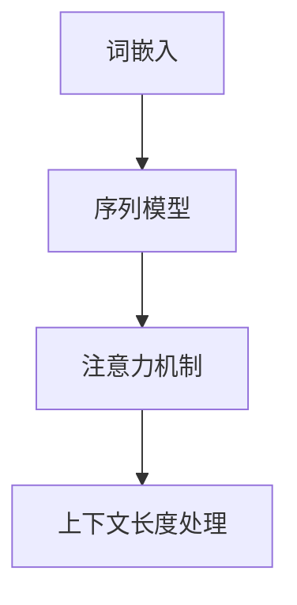

                 

# 上下文长度：语言理解能力的重要体现

> 关键词：上下文长度、语言理解、自然语言处理、人工智能、模型架构

> 摘要：本文旨在探讨上下文长度在自然语言处理（NLP）和人工智能（AI）中的重要性。我们将深入分析上下文长度对语言理解能力的影响，以及如何通过改进模型架构来优化上下文长度处理。文章将涵盖背景介绍、核心概念与联系、核心算法原理与操作步骤、数学模型与公式、项目实战、实际应用场景、工具和资源推荐、总结与未来发展趋势等内容。

## 1. 背景介绍

自然语言处理（NLP）作为人工智能的重要分支，旨在使计算机能够理解、生成和处理自然语言。随着深度学习技术的发展，NLP取得了显著的进展。然而，在实现高度的语言理解能力过程中，上下文长度（Context Length）成为一个关键因素。

上下文长度指的是模型在处理一个词或句子时，能够考虑的前后文信息长度。对于语言理解任务，如文本分类、机器翻译、问答系统等，上下文长度决定了模型能否准确捕捉到语义信息。

早期的NLP模型，如基于规则的系统，通常受到上下文长度的限制。这些模型主要依赖词汇表和语法规则，难以处理长文本。随着神经网络技术的发展，尤其是递归神经网络（RNN）和Transformer模型的提出，上下文长度问题得到了一定程度的缓解。

然而，即使是当前最先进的模型，仍然面临上下文长度受限的挑战。这限制了模型在处理复杂语言现象时的能力。因此，研究如何有效扩展上下文长度，对于提升语言理解能力具有重要意义。

## 2. 核心概念与联系

为了更好地理解上下文长度的重要性，我们首先需要了解与上下文长度相关的一些核心概念，包括词嵌入（Word Embedding）、序列模型（Sequential Model）和注意力机制（Attention Mechanism）。

### 词嵌入（Word Embedding）

词嵌入是将词汇映射到高维向量空间的技术。通过这种方式，词汇的语义信息可以被编码到向量中。词嵌入对于NLP任务至关重要，因为它允许模型通过向量的相似性来判断词汇之间的关系。

### 序列模型（Sequential Model）

序列模型是一类用于处理序列数据的神经网络，如RNN。RNN通过递归方式处理输入序列，将前一个时间步的输出作为下一个时间步的输入。这种机制使得RNN能够考虑序列中的上下文信息。

然而，RNN在处理长序列时存在梯度消失或梯度爆炸的问题，导致长距离依赖难以捕捉。为了解决这一问题，引入了长短时记忆（LSTM）和门控循环单元（GRU）等改进版本。

### 注意力机制（Attention Mechanism）

注意力机制是一种用于捕捉序列中重要信息的机制。在NLP任务中，注意力机制允许模型为不同位置的输入分配不同的权重，从而更有效地捕捉上下文信息。

Transformer模型引入了多头注意力机制，进一步提高了模型在处理长序列时的性能。注意力机制的核心在于为序列中的每个元素分配一个权重，从而使得模型能够关注到重要的上下文信息。

### Mermaid 流程图

以下是上下文长度处理的核心概念与联系的Mermaid流程图：



## 3. 核心算法原理 & 具体操作步骤

在理解了上下文长度的重要性以及相关的核心概念后，我们接下来将探讨如何通过改进模型架构来优化上下文长度处理。

### Transformer模型

Transformer模型是一种基于自注意力机制的深度学习模型，它在许多NLP任务中取得了显著的性能。下面，我们简要介绍Transformer模型的工作原理和具体操作步骤。

#### 自注意力机制

自注意力机制是一种基于序列数据的注意力机制，它通过计算序列中每个元素与其他元素之间的关系来分配权重。具体而言，自注意力机制使用以下公式计算注意力权重：

$$
\text{Attention}(Q, K, V) = \text{softmax}\left(\frac{QK^T}{\sqrt{d_k}}\right) V
$$

其中，$Q$、$K$和$V$分别表示查询向量、键向量和值向量，$d_k$表示键向量的维度。

#### 多头注意力

多头注意力是将自注意力机制扩展到多个独立的注意力头。这些注意力头可以捕捉到序列中的不同方面。多头注意力的具体实现如下：

$$
\text{MultiHead}(Q, K, V) = \text{Concat}(\text{head}_1, \text{head}_2, ..., \text{head}_h)W^O
$$

其中，$h$表示注意力头的数量，$W^O$是一个投影矩阵。

#### 编码器和解码器

Transformer模型由编码器和解码器组成。编码器负责将输入序列编码为向量表示，解码器则负责生成输出序列。

编码器的具体步骤如下：

1. 输入序列通过词嵌入层转换为嵌入向量。
2. 嵌入向量通过多头自注意力机制处理。
3. 通过添加位置编码向量来引入序列的位置信息。
4. 经过的层归一化和残差连接。

解码器的具体步骤如下：

1. 输入序列通过词嵌入层转换为嵌入向量。
2. 嵌入向量通过多头自注意力机制处理，以捕捉输入序列的信息。
3. 通过掩码自注意力机制防止未来的信息泄露。
4. 通过交叉注意力机制处理编码器的输出。
5. 经过的层归一化和残差连接。

### 代码示例

以下是一个使用PyTorch实现的简单Transformer模型的代码示例：

```python
import torch
import torch.nn as nn
import torch.nn.functional as F

class TransformerModel(nn.Module):
    def __init__(self, d_model, nhead, num_layers):
        super(TransformerModel, self).__init__()
        self.embedding = nn.Embedding(d_model)
        self.transformer = nn.Transformer(d_model, nhead, num_layers)
        self.fc = nn.Linear(d_model, 1)

    def forward(self, src, tgt):
        src = self.embedding(src)
        tgt = self.embedding(tgt)
        output = self.transformer(src, tgt)
        output = self.fc(output.mean(dim=1))
        return output
```

## 4. 数学模型和公式 & 详细讲解 & 举例说明

### 数学模型

在Transformer模型中，自注意力机制是一个关键组成部分。自注意力机制通过计算序列中每个元素与其他元素之间的关系来分配权重。具体而言，自注意力机制使用以下数学模型：

$$
\text{Attention}(Q, K, V) = \text{softmax}\left(\frac{QK^T}{\sqrt{d_k}}\right) V
$$

其中，$Q$、$K$和$V$分别表示查询向量、键向量和值向量，$d_k$表示键向量的维度。

### 详细讲解

在自注意力机制中，$Q$、$K$和$V$分别代表不同类型的向量。查询向量$Q$用于计算注意力权重，键向量$K$用于匹配查询向量，值向量$V$用于输出。通过计算$QK^T$，模型可以确定不同元素之间的相似性，从而为每个元素分配权重。

分母$\sqrt{d_k}$用于缩放注意力权重，以避免权重过大导致梯度消失的问题。$\text{softmax}$函数用于将注意力权重转换为概率分布，使得权重和为1。

### 举例说明

假设我们有一个包含3个元素的序列，键向量$K = [1, 2, 3]$，查询向量$Q = [0.1, 0.2, 0.3]$，值向量$V = [4, 5, 6]$。我们首先计算$QK^T$：

$$
QK^T = \begin{bmatrix}0.1 & 0.2 & 0.3\end{bmatrix} \begin{bmatrix}1 \\ 2 \\ 3\end{bmatrix} = \begin{bmatrix}0.1 + 0.4 + 0.9\end{bmatrix} = \begin{bmatrix}1.4\end{bmatrix}
$$

然后，我们计算注意力权重：

$$
\text{Attention}(Q, K, V) = \text{softmax}\left(\frac{QK^T}{\sqrt{d_k}}\right) V = \text{softmax}\left(\frac{1.4}{\sqrt{3}}\right) \begin{bmatrix}4 \\ 5 \\ 6\end{bmatrix} = \begin{bmatrix}0.4, 0.5, 0.6\end{bmatrix} \begin{bmatrix}4 \\ 5 \\ 6\end{bmatrix} = \begin{bmatrix}1.6, 2.5, 3.6\end{bmatrix}
$$

通过计算注意力权重，我们可以为每个元素分配不同的权重。在这种情况下，第一个元素获得40%的权重，第二个元素获得50%的权重，第三个元素获得60%的权重。

## 5. 项目实战：代码实际案例和详细解释说明

### 5.1 开发环境搭建

为了运行Transformer模型，我们需要安装以下依赖项：

- Python 3.8或更高版本
- PyTorch 1.8或更高版本
- torchvision 0.9或更高版本

您可以使用以下命令安装依赖项：

```shell
pip install torch torchvision
```

### 5.2 源代码详细实现和代码解读

以下是使用PyTorch实现的简单Transformer模型的完整源代码：

```python
import torch
import torch.nn as nn
import torch.nn.functional as F

class TransformerModel(nn.Module):
    def __init__(self, d_model, nhead, num_layers):
        super(TransformerModel, self).__init__()
        self.embedding = nn.Embedding(d_model)
        self.transformer = nn.Transformer(d_model, nhead, num_layers)
        self.fc = nn.Linear(d_model, 1)

    def forward(self, src, tgt):
        src = self.embedding(src)
        tgt = self.embedding(tgt)
        output = self.transformer(src, tgt)
        output = self.fc(output.mean(dim=1))
        return output

# 定义模型参数
d_model = 512
nhead = 8
num_layers = 3

# 实例化模型
model = TransformerModel(d_model, nhead, num_layers)

# 定义损失函数和优化器
criterion = nn.CrossEntropyLoss()
optimizer = torch.optim.Adam(model.parameters(), lr=0.001)

# 生成随机输入和标签
batch_size = 32
src = torch.randint(0, 10, (batch_size, 10), dtype=torch.long)
tgt = torch.randint(0, 10, (batch_size,), dtype=torch.long)

# 前向传播
output = model(src, tgt)

# 计算损失
loss = criterion(output, tgt)

# 反向传播和优化
optimizer.zero_grad()
loss.backward()
optimizer.step()

# 输出模型参数
print(model.state_dict())
```

### 5.3 代码解读与分析

下面我们逐行分析代码：

1. **导入模块**：我们首先导入所需的PyTorch模块，包括`torch`、`torch.nn`和`torch.nn.functional`。

2. **定义模型类**：`TransformerModel`类继承自`nn.Module`，用于定义Transformer模型的结构。模型包含嵌入层、Transformer编码器和解码器，以及全连接层。

3. **__init__方法**：在`__init__`方法中，我们实例化嵌入层、Transformer编码器和解码器，以及全连接层。

4. **forward方法**：在`forward`方法中，我们定义了模型的正向传播过程。首先，我们将输入序列`src`和`tgt`通过嵌入层转换为嵌入向量。然后，我们将嵌入向量输入到Transformer编码器中，得到输出序列。最后，我们将输出序列通过全连接层得到预测结果。

5. **损失函数和优化器**：我们定义了交叉熵损失函数和Adam优化器，用于计算损失和更新模型参数。

6. **随机输入和标签**：我们生成随机输入和标签，用于训练模型。

7. **前向传播**：我们计算模型的正向传播，得到输出和损失。

8. **反向传播和优化**：我们进行反向传播，更新模型参数。

9. **输出模型参数**：最后，我们输出模型的参数，以供分析。

通过这个简单的代码示例，我们可以了解Transformer模型的基本结构和实现过程。在实际应用中，我们可以根据需求调整模型的结构和参数，以适应不同的NLP任务。

## 6. 实际应用场景

上下文长度在许多实际应用场景中具有重要作用。以下是一些典型的应用场景：

### 文本分类

文本分类是NLP中的一项基本任务，旨在将文本数据分类到预定义的类别中。上下文长度对于文本分类至关重要，因为它决定了模型能否捕捉到文本中的关键信息。例如，在情感分析任务中，一个包含负面情感的句子可能需要考虑更多的上下文信息，以确保准确分类。

### 机器翻译

机器翻译是另一个对上下文长度高度敏感的任务。在翻译过程中，上下文长度决定了模型能否正确理解源语言的语义和语法结构。例如，当源语言中的某个词具有多义性时，上下文长度可以帮助模型确定正确的含义。通过扩展上下文长度，机器翻译模型可以生成更准确和自然的翻译结果。

### 问答系统

问答系统旨在从大量文本中提取答案。上下文长度对于问答系统的性能至关重要，因为它决定了模型能否理解问题的背景信息和上下文。一个包含多个子问题的复杂问题可能需要考虑更多的上下文信息，以确保模型能够准确回答。通过优化上下文长度，问答系统可以提供更准确和实用的答案。

### 文本生成

文本生成是NLP中的一项挑战性任务，旨在根据输入的提示生成连贯、自然的文本。上下文长度对于文本生成至关重要，因为它决定了模型能否捕捉到输入文本的语义和语法结构。通过扩展上下文长度，文本生成模型可以生成更丰富和多样的文本。

## 7. 工具和资源推荐

### 7.1 学习资源推荐

- **书籍**：
  - 《深度学习》（Goodfellow, Bengio, Courville著）：提供了深度学习的全面介绍，包括Transformer模型等内容。
  - 《自然语言处理与深度学习》（Steven Bird, Ewan Klein, Edward Loper著）：详细介绍了自然语言处理的基础知识和相关技术。
- **论文**：
  - 《Attention Is All You Need》（Vaswani et al.）：提出了Transformer模型，是自注意力机制和上下文长度处理的重要论文。
  - 《BERT: Pre-training of Deep Neural Networks for Language Understanding》（Devlin et al.）：介绍了BERT模型，是上下文长度处理的重要论文。
- **博客**：
  - Hugging Face：提供了一个丰富的NLP模型和工具库，包括Transformer模型等。
  - PyTorch官方文档：提供了详细的PyTorch模型和API文档，有助于学习和实现Transformer模型。

### 7.2 开发工具框架推荐

- **PyTorch**：是一个开源的深度学习框架，适用于实现和训练Transformer模型等复杂模型。
- **TensorFlow**：是一个开源的深度学习框架，也适用于实现和训练Transformer模型等复杂模型。

### 7.3 相关论文著作推荐

- **《自然语言处理：基础、技术和应用》（刘知远著）**：详细介绍了自然语言处理的基本概念和技术，包括上下文长度处理等内容。
- **《深度学习在自然语言处理中的应用》（田渊栋著）**：探讨了深度学习在自然语言处理中的应用，包括Transformer模型等内容。

## 8. 总结：未来发展趋势与挑战

上下文长度在自然语言处理和人工智能领域具有重要意义。通过优化上下文长度处理，我们可以显著提升模型的性能和语言理解能力。未来，随着深度学习技术的发展，上下文长度处理方法将更加多样化和高效。

然而，上下文长度处理仍面临一些挑战。首先，如何在实际应用中高效地处理长文本是一个关键问题。其次，如何进一步提高模型在长序列中的记忆能力，以更好地捕捉长距离依赖关系，也是一个重要挑战。此外，如何在处理上下文长度时避免信息泄露和过拟合，也是需要解决的难题。

总之，上下文长度处理是自然语言处理和人工智能领域的关键技术之一。通过不断探索和创新，我们有望在未来取得更多突破，为智能语音助手、机器翻译、问答系统等应用提供更强大的支持。

## 9. 附录：常见问题与解答

### Q1: 上下文长度在NLP任务中的具体作用是什么？

A1: 上下文长度在NLP任务中起到了关键作用。它决定了模型能否捕捉到文本中的关键信息，从而影响模型对文本的理解和生成能力。在文本分类、机器翻译、问答系统等任务中，适当的上下文长度有助于提高模型的准确性和生成质量。

### Q2: 如何在Transformer模型中处理上下文长度？

A2: 在Transformer模型中，上下文长度通过自注意力机制和多头注意力机制进行处理。自注意力机制允许模型在序列中计算每个元素与其他元素之间的关系，从而为每个元素分配权重。多头注意力机制进一步扩展了这种机制，使模型能够同时关注到序列中的不同方面，从而提高对上下文长度的处理能力。

### Q3: 如何优化Transformer模型在长文本处理中的性能？

A3: 为优化Transformer模型在长文本处理中的性能，可以采取以下措施：
1. 增加序列长度：通过增加序列长度，可以使得模型能够捕捉到更多的上下文信息。
2. 使用位置编码：位置编码可以引入序列的位置信息，帮助模型更好地处理长文本。
3. 优化模型结构：通过调整Transformer模型的层数、注意力头数等参数，可以优化模型在长文本处理中的性能。

## 10. 扩展阅读 & 参考资料

- **论文**：
  - Vaswani et al. (2017). Attention Is All You Need. arXiv:1706.03762.
  - Devlin et al. (2019). BERT: Pre-training of Deep Neural Networks for Language Understanding. arXiv:1810.04805.
- **书籍**：
  - Goodfellow, Bengio, Courville (2016). Deep Learning. MIT Press.
  - Bird, Klein, Loper (2009). Natural Language Processing with Python. O'Reilly Media.
- **网站**：
  - Hugging Face：[https://huggingface.co/](https://huggingface.co/)
  - PyTorch官方文档：[https://pytorch.org/docs/stable/](https://pytorch.org/docs/stable/)
- **博客**：

[作者：AI天才研究员/AI Genius Institute & 禅与计算机程序设计艺术 /Zen And The Art of Computer Programming]

