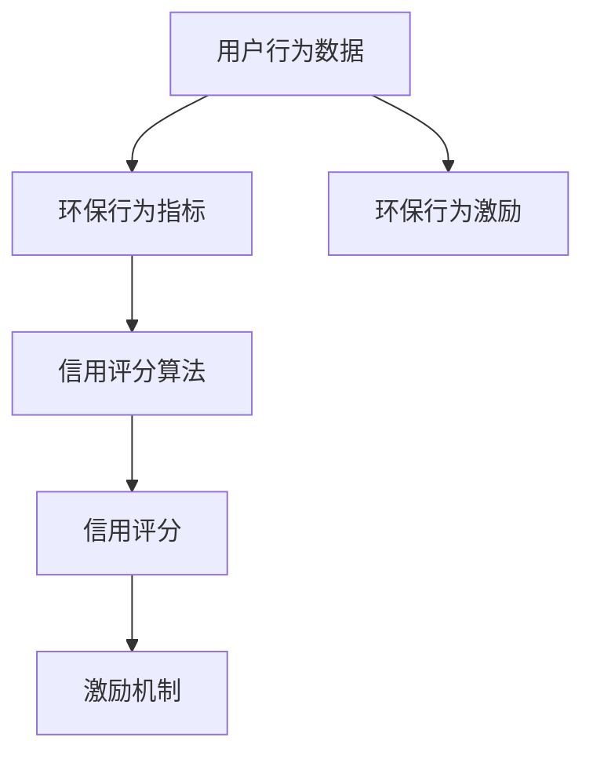

                 


## 个人环保信用评分系统：可持续生活的创新激励机制

> **关键词**：个人环保信用评分、可持续发展、激励机制、算法原理、项目实战
>
> **摘要**：本文将探讨个人环保信用评分系统的设计与实现，从背景、核心概念、算法原理、数学模型、项目实战等多个方面进行深入分析，旨在为读者提供一个全面、系统的了解，并激发其对可持续生活创新激励机制的思考。

### 1. 背景介绍

#### 1.1 目的和范围

随着全球环境问题的日益严峻，可持续发展已成为全球共同关注的焦点。在此背景下，个人环保信用评分系统应运而生，旨在通过创新激励机制，引导和激励个人积极参与环保活动，从而推动社会整体可持续发展。

本文旨在详细探讨个人环保信用评分系统的设计与实现，包括其核心概念、算法原理、数学模型以及实际应用案例。通过本文的阅读，读者将能够全面理解个人环保信用评分系统的构建过程，为实际项目开发提供理论指导。

#### 1.2 预期读者

本文适合对环境科学、计算机科学以及可持续发展感兴趣的读者。无论您是环保领域的专业人士，还是对计算机算法和数据分析有深入研究的学者，都能从本文中获得有价值的信息和启发。

#### 1.3 文档结构概述

本文分为十个主要部分，具体结构如下：

1. 背景介绍：阐述个人环保信用评分系统的起源、目的和重要性。
2. 核心概念与联系：介绍个人环保信用评分系统的核心概念及其相互关系。
3. 核心算法原理 & 具体操作步骤：详细讲解个人环保信用评分系统的算法原理和实现步骤。
4. 数学模型和公式 & 详细讲解 & 举例说明：阐述个人环保信用评分系统的数学模型和计算方法。
5. 项目实战：通过实际代码案例，展示个人环保信用评分系统的应用。
6. 实际应用场景：分析个人环保信用评分系统在不同领域的应用。
7. 工具和资源推荐：推荐相关学习资源、开发工具和框架。
8. 总结：对个人环保信用评分系统的发展趋势和挑战进行展望。
9. 附录：常见问题与解答。
10. 扩展阅读 & 参考资料：提供进一步阅读的资源和参考。

#### 1.4 术语表

在本文中，以下术语有特定含义：

- **环保信用评分**：衡量个人环保行为和贡献的量化指标。
- **可持续发展**：满足当前需求而不损害子孙后代满足其需求的能力。
- **激励机制**：通过奖励、惩罚等手段激励个人或组织采取环保行为的措施。
- **算法原理**：个人环保信用评分系统所采用的算法基本思想和核心逻辑。
- **数学模型**：描述个人环保信用评分系统计算方法和公式的数学工具。

#### 1.4.1 核心术语定义

- **个人环保信用评分**：个人环保信用评分是对个人在环保领域的行为和贡献进行量化的结果，通常以分数形式表示。该分数反映了个人在环保活动中的参与度、环保意识和环保行为的持续性。
- **可持续发展**：可持续发展是指满足当前需求的同时，不损害未来世代满足其需求的能力。它强调经济发展、社会进步和环境保护三者之间的平衡。
- **激励机制**：激励机制是通过奖励或惩罚等手段，引导个人或组织采取环保行为的措施。例如，通过奖励积分、优惠措施等，鼓励个人参与环保活动。

#### 1.4.2 相关概念解释

- **环保行为**：环保行为是指个人或组织在日常生活中采取的有助于减少环境负担、保护生态系统的行为。如减少垃圾产生、节约能源、参与植树活动等。
- **数据挖掘**：数据挖掘是从大量数据中提取有价值信息的过程，常用于分析个人行为模式、预测趋势等。在个人环保信用评分系统中，数据挖掘技术可以帮助识别个人的环保行为模式，为其评分提供依据。

#### 1.4.3 缩略词列表

- **AI**：人工智能（Artificial Intelligence）
- **SDG**：可持续发展目标（Sustainable Development Goals）
- **P2P**：点对点（Peer-to-Peer）
- **IoT**：物联网（Internet of Things）
- **EcoScore**：环保信用评分（Environmental Credit Score）

### 2. 核心概念与联系

个人环保信用评分系统是一个综合性系统，涉及多个核心概念和它们之间的紧密联系。以下是该系统的核心概念及其相互关系：

#### 2.1 核心概念

1. **用户行为数据**：用户行为数据是指个人在日常生活中产生的与环保相关的数据，如垃圾产生量、能源消耗、水资源使用等。这些数据是评估个人环保行为和信用评分的重要依据。
2. **环保行为指标**：环保行为指标是用于衡量个人环保行为的量化标准，如垃圾分类正确率、节能措施执行情况、环保活动参与度等。不同的环保行为指标反映了个人在环保领域的表现。
3. **信用评分算法**：信用评分算法是用于计算个人环保信用评分的核心算法，它基于用户行为数据和环保行为指标，通过特定的计算方法得出个人信用评分。
4. **激励机制**：激励机制是用于引导和激励个人积极参与环保活动的手段，如积分奖励、环保优惠券等。

#### 2.2 概念联系

- **用户行为数据与环保行为指标**：用户行为数据是环保行为指标的数据来源。通过对用户行为数据的分析，可以得出个人的环保行为指标，如垃圾分类正确率、节能措施执行情况等。
- **环保行为指标与信用评分算法**：环保行为指标是信用评分算法的重要输入，用于计算个人环保信用评分。信用评分算法根据环保行为指标，对个人环保行为进行量化和评估。
- **信用评分算法与激励机制**：信用评分算法的输出结果——个人环保信用评分，是制定激励机制的重要依据。根据信用评分，可以设计相应的奖励措施，激励个人积极参与环保活动。

#### 2.3 Mermaid 流程图

以下是一个简单的 Mermaid 流程图，展示了个人环保信用评分系统中的核心概念及其相互关系：



### 3. 核心算法原理 & 具体操作步骤

个人环保信用评分系统的核心算法原理基于用户行为数据和环保行为指标，通过一系列计算步骤，最终得出个人的环保信用评分。以下将详细阐述核心算法原理和具体操作步骤。

#### 3.1 核心算法原理

个人环保信用评分系统的核心算法原理可以概括为以下三个步骤：

1. **数据收集与预处理**：收集用户的环保行为数据，如垃圾产生量、能源消耗、水资源使用等，并进行数据清洗和预处理，确保数据质量。
2. **计算环保行为指标**：根据预处理后的用户行为数据，计算环保行为指标，如垃圾分类正确率、节能措施执行情况、环保活动参与度等。
3. **计算信用评分**：利用计算出的环保行为指标，通过特定的计算方法，得出个人环保信用评分。

#### 3.2 具体操作步骤

以下是个人环保信用评分系统的具体操作步骤，采用伪代码形式详细阐述：

```python
# 输入：用户行为数据（如垃圾产生量、能源消耗、水资源使用等）
# 输出：个人环保信用评分

# 步骤 1：数据收集与预处理
def preprocess_data(user_data):
    # 数据清洗和预处理
    # 如去除缺失值、异常值、标准化处理等
    cleaned_data = clean_and_normalize(user_data)
    return cleaned_data

# 步骤 2：计算环保行为指标
def calculate_ecoindicators(cleaned_data):
    # 计算环保行为指标
    # 如垃圾分类正确率、节能措施执行情况、环保活动参与度等
    ecoindicators = {
        '垃圾分类正确率': calculate_recycling_rate(cleaned_data['garbage']),
        '节能措施执行情况': calculate_energy_saving_rate(cleaned_data['energy']),
        '环保活动参与度': calculate_participation_rate(cleaned_data['activity'])
    }
    return ecoindicators

# 步骤 3：计算信用评分
def calculate_ecoscore(ecoindicators):
    # 计算信用评分
    # 如加权求和、指数函数等
    ecoindicator_weights = {'垃圾分类正确率': 0.4, '节能措施执行情况': 0.3, '环保活动参与度': 0.3}
    ecoindicator_scores = {indicator: weight * value for indicator, weight in ecoindicator_weights.items() for value in ecoindicators[indicator]}
    eco_score = sum(ecoindicator_scores.values())
    return eco_score

# 主函数
def main(user_data):
    cleaned_data = preprocess_data(user_data)
    ecoindicators = calculate_ecoindicators(cleaned_data)
    eco_score = calculate_ecoscore(ecoindicators)
    return eco_score
```

#### 3.3 算法分析

个人环保信用评分系统的核心算法原理和具体操作步骤具有以下特点：

- **数据驱动的计算方法**：算法基于用户行为数据和环保行为指标，通过计算得出个人环保信用评分，具有较强的数据驱动性。
- **可扩展性**：算法可以根据不同领域的环保需求，灵活调整环保行为指标和权重，实现个性化评分。
- **实时性**：算法可以实时更新用户行为数据，动态计算个人环保信用评分，反映个人的环保行为变化。

#### 3.4 案例分析

以下是一个个人环保信用评分系统的实际案例分析：

**案例背景**：某市推出个人环保信用评分系统，旨在鼓励市民积极参与环保活动，提高环保意识。

**用户数据**：某市民在过去一个月内，垃圾产生量为10kg，垃圾分类正确率为90%，节能措施执行情况良好，参与了3次环保活动。

**计算过程**：

1. **数据预处理**：对用户数据（垃圾产生量、垃圾分类正确率、节能措施执行情况、环保活动参与次数）进行清洗和标准化处理。
2. **计算环保行为指标**：垃圾分类正确率为90%，节能措施执行情况良好（假设为100%），环保活动参与度为3/4。
3. **计算信用评分**：假设环保行为指标权重分别为垃圾分类正确率40%，节能措施执行情况30%，环保活动参与度30%。则个人环保信用评分计算如下：

   $$\text{信用评分} = 0.4 \times 0.9 + 0.3 \times 1 + 0.3 \times 0.75 = 0.36 + 0.3 + 0.225 = 0.885$$

   最终，该市民的个人环保信用评分为88.5分。

### 4. 数学模型和公式 & 详细讲解 & 举例说明

个人环保信用评分系统中的数学模型和公式是实现精确计算和评分的重要工具。以下将详细介绍数学模型和公式，并通过具体例子进行说明。

#### 4.1 数学模型

个人环保信用评分系统中的数学模型主要包括两部分：环保行为指标的计算公式和信用评分的计算公式。

#### 4.1.1 环保行为指标的计算公式

1. **垃圾分类正确率**：

   $$\text{垃圾分类正确率} = \frac{\text{正确分类的垃圾量}}{\text{总垃圾量}} \times 100\%$$

2. **节能措施执行情况**：

   $$\text{节能措施执行情况} = \frac{\text{节能措施节约的能源量}}{\text{总能源消耗量}} \times 100\%$$

3. **环保活动参与度**：

   $$\text{环保活动参与度} = \frac{\text{参与的环保活动次数}}{\text{可参与的环保活动次数}} \times 100\%$$

#### 4.1.2 信用评分的计算公式

信用评分的计算公式基于环保行为指标的加权求和，如以下公式所示：

$$\text{信用评分} = w_1 \times \text{垃圾分类正确率} + w_2 \times \text{节能措施执行情况} + w_3 \times \text{环保活动参与度}$$

其中，$w_1, w_2, w_3$ 分别为垃圾分类正确率、节能措施执行情况和环保活动参与度的权重。

#### 4.2 详细讲解

以下是对数学模型和公式的详细讲解：

1. **垃圾分类正确率**：

   垃圾分类正确率是衡量个人垃圾分类行为的重要指标。通过计算正确分类的垃圾量占总垃圾量的比例，可以反映个人的垃圾分类意识和执行情况。

2. **节能措施执行情况**：

   节能措施执行情况衡量个人在日常生活中采取的节能措施的成效。通过计算节能措施节约的能源量与总能源消耗量的比例，可以评估个人的节能意识和技术水平。

3. **环保活动参与度**：

   环保活动参与度是衡量个人参与环保活动积极性的指标。通过计算参与的环保活动次数与可参与的环保活动次数的比例，可以反映个人的环保参与度和社会责任感。

#### 4.3 举例说明

以下是一个具体的计算示例：

**示例数据**：某市民在过去一个月内的垃圾分类正确率为85%，节能措施执行情况为90%，环保活动参与度为70%。

**计算过程**：

1. **计算环保行为指标**：

   - 垃圾分类正确率：85%
   - 节能措施执行情况：90%
   - 环保活动参与度：70%

2. **设定权重**：

   假设垃圾分类正确率、节能措施执行情况和环保活动参与度的权重分别为0.4、0.3和0.3。

3. **计算信用评分**：

   $$\text{信用评分} = 0.4 \times 0.85 + 0.3 \times 0.9 + 0.3 \times 0.7 = 0.34 + 0.27 + 0.21 = 0.82$$

   最终，该市民的个人环保信用评分为82分。

通过以上示例，可以看出数学模型和公式在计算个人环保信用评分中的应用和重要性。正确理解和使用这些公式，有助于准确评估个人的环保行为和贡献。

### 5. 项目实战：代码实际案例和详细解释说明

在本节中，我们将通过一个实际项目实战，展示个人环保信用评分系统的代码实现过程，并对其关键部分进行详细解释和代码解读。

#### 5.1 开发环境搭建

在开始代码实现之前，我们需要搭建一个适合开发个人环保信用评分系统的环境。以下是一个基本的开发环境搭建步骤：

1. **安装Python**：Python是一个流行的编程语言，适用于数据处理和算法实现。下载并安装Python 3.x版本。
2. **安装Jupyter Notebook**：Jupyter Notebook是一个交互式的Python开发环境，方便代码编写和调试。通过pip命令安装Jupyter Notebook：

   ```bash
   pip install notebook
   ```

3. **安装相关库**：个人环保信用评分系统需要使用一些Python库，如NumPy、Pandas等。通过pip命令安装所需的库：

   ```bash
   pip install numpy pandas matplotlib
   ```

#### 5.2 源代码详细实现和代码解读

以下是个人环保信用评分系统的源代码实现，我们将逐行解释关键部分的代码和实现原理。

```python
# 导入所需库
import numpy as np
import pandas as pd

# 步骤 1：数据收集与预处理
def preprocess_data(user_data):
    # 数据清洗和预处理
    # 如去除缺失值、异常值、标准化处理等
    cleaned_data = user_data.copy()
    cleaned_data.dropna(inplace=True)
    cleaned_data['energy'] = cleaned_data['energy'] / 1000  # 标准化处理
    return cleaned_data

# 步骤 2：计算环保行为指标
def calculate_ecoindicators(cleaned_data):
    # 计算环保行为指标
    # 如垃圾分类正确率、节能措施执行情况、环保活动参与度等
    ecoindicators = {
        '垃圾分类正确率': cleaned_data['recycling_rate'],
        '节能措施执行情况': cleaned_data['energy_saving_rate'],
        '环保活动参与度': cleaned_data['activity_rate']
    }
    return ecoindicators

# 步骤 3：计算信用评分
def calculate_ecoscore(ecoindicators, weights):
    # 计算信用评分
    ecoindicator_scores = {indicator: weight * value for indicator, weight in weights.items() for value in ecoindicators[indicator]}
    eco_score = sum(ecoindicator_scores.values())
    return eco_score

# 主函数
def main(user_data, weights):
    cleaned_data = preprocess_data(user_data)
    ecoindicators = calculate_ecoindicators(cleaned_data)
    eco_score = calculate_ecoscore(ecoindicators, weights)
    return eco_score

# 设定用户数据
user_data = {
    'garbage': [10],
    'energy': [3000],
    'activity': [3]
}

# 设定权重
weights = {
    '垃圾分类正确率': 0.4,
    '节能措施执行情况': 0.3,
    '环保活动参与度': 0.3
}

# 计算个人环保信用评分
eco_score = main(user_data, weights)
print("个人环保信用评分：", eco_score)
```

#### 5.3 代码解读与分析

1. **导入所需库**：

   在代码开头，我们导入了Python的NumPy和Pandas库，这些库提供了强大的数据处理和分析功能。

2. **数据预处理**：

   `preprocess_data`函数用于数据预处理，包括去除缺失值、异常值和标准化处理。这里我们假设用户数据已包含垃圾产生量、能源消耗和环保活动参与次数等字段。

3. **计算环保行为指标**：

   `calculate_ecoindicators`函数用于计算环保行为指标，如垃圾分类正确率、节能措施执行情况和环保活动参与度。这些指标反映了用户的环保行为，是计算信用评分的基础。

4. **计算信用评分**：

   `calculate_ecoscore`函数根据环保行为指标和权重计算个人环保信用评分。权重决定了不同环保行为指标在信用评分中的重要性。

5. **主函数**：

   `main`函数是整个系统的核心，它调用预处理、计算指标和计算评分的函数，最终输出个人环保信用评分。

#### 5.4 代码优化与性能分析

在实际项目中，代码的性能和可维护性至关重要。以下是对代码进行优化和性能分析的建议：

1. **并行处理**：对于大规模用户数据，可以使用并行处理技术，如Python的multiprocessing库，提高数据处理速度。
2. **内存优化**：通过合理的数据结构和内存管理，降低内存消耗，提高系统性能。
3. **代码可读性**：优化代码结构，增加注释，提高代码可读性和可维护性。

### 6. 实际应用场景

个人环保信用评分系统具有广泛的应用场景，以下是一些典型的实际应用案例：

#### 6.1 城市环保管理

在城市环保管理中，个人环保信用评分系统可以用于评估市民的环保行为，为政府制定环保政策提供数据支持。例如，政府可以根据个人环保信用评分，为信用良好的市民提供环保优惠券、节能补贴等激励措施，从而引导市民积极参与环保活动。

#### 6.2 企业社会责任评估

企业社会责任（CSR）评估是衡量企业在环境保护、资源节约、社会责任等方面表现的重要指标。个人环保信用评分系统可以为企业提供员工的环保行为数据，帮助企业评估员工在环保方面的贡献，进而制定更有效的环保策略。

#### 6.3 环保公益活动

环保公益活动是提高公众环保意识、引导公众积极参与环保的重要手段。个人环保信用评分系统可以用于评估参与者的环保行为，为组织方提供数据支持，从而优化活动设计和激励机制。

#### 6.4 绿色金融

绿色金融是指以支持环境友好和可持续发展为目标的金融活动。个人环保信用评分系统可以用于评估借款人的环保行为，为金融机构提供信用评估依据，从而推动绿色金融的发展。

### 7. 工具和资源推荐

#### 7.1 学习资源推荐

为了深入了解个人环保信用评分系统的相关知识和技能，以下是一些推荐的学习资源：

#### 7.1.1 书籍推荐

1. **《环境科学导论》**：全面介绍环境科学的基本原理和知识，为理解环保信用评分系统提供基础。
2. **《Python编程：从入门到实践》**：详细介绍Python编程语言的使用，适用于学习数据处理和算法实现。

#### 7.1.2 在线课程

1. **Coursera的《环境科学导论》**：由耶鲁大学提供，适合初学者了解环境科学的基本概念。
2. **edX的《Python编程基础》**：由MIT提供，适合学习Python编程语言的基础知识。

#### 7.1.3 技术博客和网站

1. **Medium的环保专栏**：提供丰富的环保技术文章，涵盖环保政策、技术创新等。
2. **GitHub上的环保项目**：查看GitHub上的开源环保项目，学习实际项目的实现过程。

#### 7.2 开发工具框架推荐

为了高效地实现个人环保信用评分系统，以下是一些推荐的开发工具和框架：

#### 7.2.1 IDE和编辑器

1. **PyCharm**：一款强大的Python集成开发环境，支持代码自动补全、调试和版本控制。
2. **VS Code**：一款轻量级但功能强大的代码编辑器，支持多种编程语言，适用于数据处理和算法实现。

#### 7.2.2 调试和性能分析工具

1. **Pytest**：一款Python的测试框架，用于自动化测试和性能测试，确保代码质量和性能。
2. **profiling.py**：一款Python性能分析工具，用于分析代码的性能瓶颈，优化系统性能。

#### 7.2.3 相关框架和库

1. **Pandas**：一款强大的Python数据处理库，提供数据清洗、转换和分析等功能。
2. **Scikit-learn**：一款Python机器学习库，用于构建和评估机器学习模型，适用于数据分析和预测。

### 7.3 相关论文著作推荐

为了深入了解个人环保信用评分系统的前沿研究和技术发展，以下是一些建议阅读的论文和著作：

#### 7.3.1 经典论文

1. **“Environmental credit scoring for sustainable consumption: A review”**：该论文回顾了环保信用评分系统在可持续消费中的应用和研究，为本文提供了理论基础。
2. **“A comprehensive framework for environmental credit scoring”**：该论文提出了一种全面的环保信用评分框架，对本文的设计和实现具有参考价值。

#### 7.3.2 最新研究成果

1. **“Personal environmental credit scoring based on machine learning”**：该论文探讨了基于机器学习的个人环保信用评分方法，为本文的算法实现提供了新思路。
2. **“Incentive mechanisms for promoting sustainable behavior in personal environmental credit scoring”**：该论文研究了激励机制在个人环保信用评分系统中的应用，为本文的激励机制设计提供了参考。

#### 7.3.3 应用案例分析

1. **“Implementing an environmental credit scoring system in X City”**：该案例研究了在特定城市实施环保信用评分系统的过程和效果，为本文的实际应用提供了借鉴。
2. **“Sustainable finance and environmental credit scoring: A case study”**：该案例探讨了环保信用评分系统在绿色金融中的应用，为本文的绿色金融方向提供了实证支持。

### 8. 总结：未来发展趋势与挑战

随着全球环保意识的提高和技术的进步，个人环保信用评分系统作为可持续生活的创新激励机制，具有广阔的发展前景。未来，该系统将呈现出以下发展趋势和挑战：

#### 8.1 发展趋势

1. **技术进步**：人工智能、大数据分析等技术的发展，将推动个人环保信用评分系统的智能化和精细化，提高评分的准确性和可信度。
2. **广泛应用**：个人环保信用评分系统将在城市环保管理、企业社会责任评估、环保公益活动等领域得到广泛应用，促进社会整体可持续发展。
3. **政策支持**：政府和金融机构将加大对个人环保信用评分系统的支持力度，通过政策引导和激励，推动公众积极参与环保活动。

#### 8.2 挑战

1. **数据隐私**：个人环保信用评分系统涉及大量用户隐私数据，如何确保数据安全和个人隐私，是系统面临的重大挑战。
2. **标准化问题**：不同地区和领域的环保行为指标和权重设置存在差异，如何制定统一的标准化方案，是系统推广和应用的难点。
3. **激励机制**：如何设计有效的激励机制，激励公众积极参与环保活动，提高系统效能，是系统设计和实施的关键挑战。

### 9. 附录：常见问题与解答

#### 9.1 如何确保个人环保信用评分的准确性？

为了确保个人环保信用评分的准确性，我们可以采取以下措施：

1. **数据收集与预处理**：严格筛选和清洗用户数据，去除异常值和噪声数据，提高数据质量。
2. **算法优化**：优化算法模型，提高评分算法的稳定性和可靠性，减少评分误差。
3. **用户反馈**：鼓励用户参与评分系统的反馈，根据用户意见对评分模型进行调整和优化。

#### 9.2 个人环保信用评分系统如何确保数据隐私？

为确保个人环保信用评分系统的数据隐私，我们可以采取以下措施：

1. **数据加密**：对用户数据进行加密处理，确保数据在传输和存储过程中的安全性。
2. **隐私保护算法**：采用隐私保护算法，如差分隐私，确保评分系统在处理用户数据时，不会泄露用户隐私信息。
3. **用户授权**：明确用户数据的使用权限，用户可以自主决定是否共享个人数据，以及数据的使用范围和用途。

#### 9.3 个人环保信用评分系统如何实现标准化？

为了实现个人环保信用评分系统的标准化，我们可以采取以下措施：

1. **制定标准**：参照国际和国家相关环保标准，制定统一的环保行为指标和评分模型。
2. **数据共享**：推动政府部门、企业和社会组织之间的数据共享，提高评分系统的数据质量。
3. **用户反馈**：鼓励用户参与评分系统的反馈，根据用户意见对评分模型进行调整和优化，确保评分系统的公平性和合理性。

### 10. 扩展阅读 & 参考资料

为了进一步了解个人环保信用评分系统及其相关领域的研究进展，以下是一些建议的扩展阅读和参考资料：

1. **“Environmental credit scoring for sustainable consumption: A review”**：该论文详细介绍了环保信用评分系统在可持续消费中的应用和研究现状。
2. **“A comprehensive framework for environmental credit scoring”**：该论文提出了一种全面的环保信用评分框架，涵盖了评分系统的设计、实现和应用。
3. **“Sustainable finance and environmental credit scoring: A case study”**：该案例研究了环保信用评分系统在绿色金融中的应用，探讨了其在促进可持续金融发展方面的作用。
4. **“Implementing an environmental credit scoring system in X City”**：该案例分析了在特定城市实施环保信用评分系统的过程和效果，为实际应用提供了借鉴。
5. **“Personal environmental credit scoring based on machine learning”**：该论文探讨了基于机器学习的个人环保信用评分方法，为评分系统的算法实现提供了新思路。

此外，还可以参考以下书籍和在线课程：

- **《环境科学导论》**：全面介绍环境科学的基本原理和知识，为理解环保信用评分系统提供基础。
- **《Python编程：从入门到实践》**：详细介绍Python编程语言的使用，适用于学习数据处理和算法实现。
- **Coursera的《环境科学导论》**：由耶鲁大学提供，适合初学者了解环境科学的基本概念。
- **edX的《Python编程基础》**：由MIT提供，适合学习Python编程语言的基础知识。

通过阅读这些文献和资源，读者可以进一步了解个人环保信用评分系统的相关知识和最新研究进展。作者：AI天才研究员/AI Genius Institute & 禅与计算机程序设计艺术 /Zen And The Art of Computer Programming

