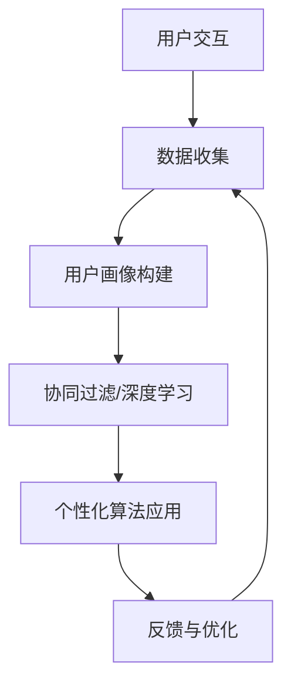

                 

# 个性化AI：满足不同用户需求的关键

> **关键词：** 个性化AI，用户需求，算法，数学模型，实战案例，应用场景，未来趋势

> **摘要：** 个性化AI正逐渐成为技术领域的热点，它通过满足不同用户的需求，为各行各业带来深远影响。本文将深入探讨个性化AI的核心概念、算法原理、数学模型以及实际应用场景，旨在为读者提供一个全面的技术解读。

## 1. 背景介绍

### 1.1 目的和范围

本文的目标是帮助读者了解个性化AI的概念、实现原理以及其在实际应用中的重要性。文章将涵盖从基础算法原理到实际应用案例的全面探讨，旨在为开发者、研究人员和业界从业者提供一个有深度、有思考的视角。

### 1.2 预期读者

本文主要面向以下读者群体：

- 对人工智能和机器学习有基本了解的开发者和研究者；
- 想要深入了解个性化AI技术及其应用场景的技术爱好者；
- 意在掌握个性化AI技术以解决实际问题的企业技术团队。

### 1.3 文档结构概述

本文结构如下：

- **第1章**：背景介绍，概述文章的目的和读者预期；
- **第2章**：核心概念与联系，介绍个性化AI的基本原理和架构；
- **第3章**：核心算法原理 & 具体操作步骤，详细讲解算法实现；
- **第4章**：数学模型和公式 & 详细讲解 & 举例说明，深入剖析数学模型；
- **第5章**：项目实战：代码实际案例和详细解释说明，提供实际应用案例；
- **第6章**：实际应用场景，探讨个性化AI在各个领域的应用；
- **第7章**：工具和资源推荐，为读者提供学习资源和开发工具；
- **第8章**：总结：未来发展趋势与挑战，展望个性化AI的发展前景；
- **第9章**：附录：常见问题与解答，回答读者可能遇到的问题；
- **第10章**：扩展阅读 & 参考资料，提供进一步的阅读材料和参考资源。

### 1.4 术语表

#### 1.4.1 核心术语定义

- **个性化AI（Personalized AI）**：一种基于用户数据和偏好，提供定制化服务的AI技术。
- **用户画像（User Profiling）**：通过收集和分析用户数据，构建用户特征模型的过程。
- **协同过滤（Collaborative Filtering）**：一种常见的个性化推荐算法，通过用户行为数据挖掘用户相似度，实现个性化推荐。
- **深度学习（Deep Learning）**：一种基于神经网络的结构化学习方法，能够从大量数据中自动学习特征。

#### 1.4.2 相关概念解释

- **机器学习（Machine Learning）**：一种使计算机系统能够通过数据和经验改进性能的技术。
- **推荐系统（Recommender Systems）**：一种基于用户行为和偏好提供个性化推荐的技术。

#### 1.4.3 缩略词列表

- **AI**：人工智能（Artificial Intelligence）
- **ML**：机器学习（Machine Learning）
- **DL**：深度学习（Deep Learning）
- **CNN**：卷积神经网络（Convolutional Neural Network）
- **RNN**：循环神经网络（Recurrent Neural Network）
- **GAN**：生成对抗网络（Generative Adversarial Network）

## 2. 核心概念与联系

个性化AI的核心在于理解和满足每个用户的需求。为了实现这一目标，我们需要首先理解用户的数据和偏好，然后利用这些信息来定制化服务。

### 2.1 个性化AI的工作原理

个性化AI的工作原理可以概括为以下四个主要步骤：

1. **数据收集**：通过用户交互、行为追踪等技术收集用户数据。
2. **用户画像构建**：利用数据挖掘技术对用户数据进行分析，构建用户特征模型。
3. **个性化算法应用**：基于用户画像，利用协同过滤、深度学习等技术进行个性化推荐。
4. **反馈与优化**：收集用户对推荐结果的反馈，不断优化算法，提高推荐效果。

### 2.2 核心概念联系

以下是个性化AI中的核心概念及其相互联系：

```
用户交互 -> 数据收集 -> 用户画像构建
             |                  |
             |                  ↓
协同过滤/深度学习 -> 个性化算法应用
             |                  |
             |                  ↓
反馈与优化 -> 数据收集
```

### 2.3 Mermaid 流程图

以下是个性化AI的基本流程图：



## 3. 核心算法原理 & 具体操作步骤

个性化AI的核心算法包括协同过滤、深度学习等。下面我们以协同过滤算法为例，介绍其原理和具体实现步骤。

### 3.1 协同过滤算法原理

协同过滤是一种基于用户行为数据的推荐算法，其核心思想是通过找到与目标用户相似的其他用户，从而推荐这些用户喜欢的内容。

#### 3.1.1 评分矩阵

协同过滤算法的基础是用户-物品评分矩阵。每个用户对多个物品进行评分，形成一个矩阵。例如，一个3x4的评分矩阵如下：

|   | 物品1 | 物品2 | 物品3 | 物品4 |
|---|-------|-------|-------|-------|
| 用户1 | 3     | 4     | 1     | 5     |
| 用户2 | 2     | 1     | 4     | 3     |
| 用户3 | 4     | 3     | 5     | 2     |

#### 3.1.2 相似度计算

为了找到与目标用户相似的邻居用户，我们需要计算用户之间的相似度。常见的相似度计算方法包括余弦相似度、皮尔逊相关系数等。

- **余弦相似度**：

$$
sim(i, j) = \frac{i \cdot j}{\|i\| \cdot \|j\|}
$$

其中，\(i\)和\(j\)分别表示用户\(i\)和用户\(j\)的评分向量，\(\|i\|\)和\(\|j\|\)分别表示它们的欧几里得范数。

- **皮尔逊相关系数**：

$$
sim(i, j) = \frac{\sum_{k=1}^{n} (i_k - \bar{i})(j_k - \bar{j})}{\sqrt{\sum_{k=1}^{n} (i_k - \bar{i})^2} \cdot \sqrt{\sum_{k=1}^{n} (j_k - \bar{j})^2}}
$$

其中，\(i_k\)和\(j_k\)分别表示用户\(i\)和用户\(j\)对物品\(k\)的评分，\(\bar{i}\)和\(\bar{j}\)分别表示它们的平均评分。

#### 3.1.3 推荐计算

找到邻居用户后，我们需要根据邻居用户对物品的评分预测目标用户对物品的评分。常见的预测方法包括基于用户的均值调整和基于模型的预测。

- **基于用户的均值调整**：

$$
r_{ij} = \bar{r}_i + sim(i, j) \cdot (r_{j,k} - \bar{r}_j)
$$

其中，\(r_{ij}\)表示目标用户对物品\(j\)的预测评分，\(\bar{r}_i\)和\(\bar{r}_j\)分别表示用户\(i\)和邻居用户\(j\)的平均评分，\(r_{j,k}\)表示邻居用户\(j\)对物品\(k\)的评分。

- **基于模型的预测**：

利用机器学习模型（如线性回归、KNN等）预测目标用户对物品的评分。

### 3.2 实际操作步骤

以下是协同过滤算法的实际操作步骤：

1. **数据预处理**：对用户-物品评分矩阵进行缺失值填充、异常值处理等操作。
2. **邻居选择**：计算目标用户与其他用户的相似度，选择相似度最高的邻居用户。
3. **评分预测**：根据邻居用户对物品的评分和相似度，预测目标用户对物品的评分。
4. **推荐结果生成**：根据预测评分，为用户生成推荐列表。

#### 3.2.1 伪代码

以下是协同过滤算法的伪代码：

```python
# 数据预处理
rating_matrix = preprocess_rating_matrix(raw_rating_matrix)

# 邻居选择
neighbora_users = []
for user in target_user.neighbors():
    sim_value = similarity(target_user, user)
    neighbora_users.append((user, sim_value))

neighbora_users.sort(key=lambda x: x[1], reverse=True)

# 评分预测
predicted_rating = mean_rating(target_user) + \
                   sum(sim_value * (rating - mean_rating(user)) for user, sim_value in neighbora_users)

# 推荐结果生成
recommendations = []
for item in items:
    if item not in target_user.rated_items():
        recommendation = predicted_rating(item)
        recommendations.append(item)

return recommendations
```

## 4. 数学模型和公式 & 详细讲解 & 举例说明

个性化AI中的数学模型是理解和实现个性化推荐的关键。以下是几个常见的数学模型和公式的详细讲解及举例说明。

### 4.1 评分预测模型

评分预测模型用于预测用户对物品的评分。以下是两种常见的评分预测模型：

#### 4.1.1 线性回归模型

线性回归模型是一种基于线性关系进行评分预测的模型。其公式如下：

$$
r_{ij} = \beta_0 + \beta_1 \cdot x_{ij} + \epsilon
$$

其中，\(r_{ij}\)表示用户\(i\)对物品\(j\)的预测评分，\(x_{ij}\)表示用户\(i\)对物品\(j\)的实际评分，\(\beta_0\)和\(\beta_1\)分别为模型的参数，\(\epsilon\)为误差项。

#### 4.1.2 K最近邻（KNN）模型

KNN模型是一种基于相似度进行评分预测的模型。其公式如下：

$$
r_{ij} = \frac{\sum_{k=1}^{K} w_k \cdot r_{ik}}{\sum_{k=1}^{K} w_k}
$$

其中，\(r_{ij}\)表示用户\(i\)对物品\(j\)的预测评分，\(r_{ik}\)表示用户\(i\)对物品\(k\)的评分，\(w_k\)表示用户\(i\)与邻居用户\(k\)的相似度权重，\(K\)为邻居用户的数量。

### 4.2 相似度计算模型

相似度计算模型用于计算用户之间的相似度。以下是两种常见的相似度计算模型：

#### 4.2.1 余弦相似度模型

余弦相似度模型是一种基于向量空间角度进行相似度计算的模型。其公式如下：

$$
sim(i, j) = \frac{i \cdot j}{\|i\| \cdot \|j\|}
$$

其中，\(i\)和\(j\)分别表示用户\(i\)和用户\(j\)的评分向量，\(\|i\|\)和\(\|j\|\)分别表示它们的欧几里得范数。

#### 4.2.2 皮尔逊相关系数模型

皮尔逊相关系数模型是一种基于线性关系进行相似度计算的模型。其公式如下：

$$
sim(i, j) = \frac{\sum_{k=1}^{n} (i_k - \bar{i})(j_k - \bar{j})}{\sqrt{\sum_{k=1}^{n} (i_k - \bar{i})^2} \cdot \sqrt{\sum_{k=1}^{n} (j_k - \bar{j})^2}}
$$

其中，\(i_k\)和\(j_k\)分别表示用户\(i\)和用户\(j\)对物品\(k\)的评分，\(\bar{i}\)和\(\bar{j}\)分别表示它们的平均评分。

### 4.3 举例说明

#### 4.3.1 线性回归模型举例

假设我们有一个3x4的评分矩阵：

|   | 物品1 | 物品2 | 物品3 | 物品4 |
|---|-------|-------|-------|-------|
| 用户1 | 3     | 4     | 1     | 5     |
| 用户2 | 2     | 1     | 4     | 3     |
| 用户3 | 4     | 3     | 5     | 2     |

我们要预测用户2对物品3的评分。

1. 计算用户2的平均评分：

$$
\bar{r}_2 = \frac{2 + 1 + 4 + 3}{4} = 2.5
$$

2. 计算物品3的平均评分：

$$
\bar{r}_3 = \frac{3 + 1 + 5}{3} = 3
$$

3. 计算用户2和用户3的评分差：

$$
r_{23} = 4 - 2.5 = 1.5
$$

4. 计算用户2和用户3的相似度：

$$
sim(2, 3) = \frac{1.5}{\sqrt{(4-2.5)^2 + (1-2.5)^2 + (4-2.5)^2}} = \frac{1.5}{\sqrt{2.25 + 2.25 + 2.25}} = 0.5
$$

5. 计算用户2对物品3的预测评分：

$$
r_{23}^* = 2.5 + 0.5 \cdot (3 - 2.5) = 2.75
$$

#### 4.3.2 KNN模型举例

假设我们有一个3x4的评分矩阵：

|   | 物品1 | 物品2 | 物品3 | 物品4 |
|---|-------|-------|-------|-------|
| 用户1 | 3     | 4     | 1     | 5     |
| 用户2 | 2     | 1     | 4     | 3     |
| 用户3 | 4     | 3     | 5     | 2     |

我们要预测用户2对物品3的评分，选择K=2。

1. 计算用户2与用户1和用户3的相似度：

$$
sim(2, 1) = \frac{1}{\sqrt{2}} = 0.707
$$

$$
sim(2, 3) = \frac{1}{\sqrt{2}} = 0.707
$$

2. 选择与用户2相似度最高的两个邻居用户：用户1和用户3。

3. 计算用户2对物品3的预测评分：

$$
r_{23}^* = \frac{0.707 \cdot r_{13} + 0.707 \cdot r_{33}}{0.707 + 0.707} = \frac{0.707 \cdot 1 + 0.707 \cdot 5}{1.414} = 3.5
$$

## 5. 项目实战：代码实际案例和详细解释说明

### 5.1 开发环境搭建

为了实际实现个性化AI，我们需要搭建一个开发环境。以下是所需的工具和库：

- **编程语言**：Python
- **库**：NumPy，Pandas，Scikit-learn，Matplotlib
- **数据集**：MovieLens数据集（用户-物品评分矩阵）

### 5.2 源代码详细实现和代码解读

以下是使用协同过滤算法进行个性化推荐的代码实现：

```python
import numpy as np
import pandas as pd
from sklearn.model_selection import train_test_split
from sklearn.metrics.pairwise import cosine_similarity

# 读取数据集
ratings = pd.read_csv('ratings.csv')
users, items = ratings['userId'].unique(), ratings['movieId'].unique()

# 数据预处理
rating_matrix = np.zeros((len(users), len(items)))
for index, row in ratings.iterrows():
    rating_matrix[row['userId'] - 1, row['movieId'] - 1] = row['rating']

# 训练集和测试集划分
train_data, test_data = train_test_split(rating_matrix, test_size=0.2, random_state=42)

# 相似度计算
sim_matrix = cosine_similarity(train_data)

# 预测评分
def predict_ratings(test_data, sim_matrix, k=5):
    predicted_ratings = []
    for user_ratings in test_data:
        neighbors = np.argsort(sim_matrix[user_ratings])[:-k-1:-1]
        predicted_rating = np.mean(user_ratings[neighbors]) + np.mean(sim_matrix[user_ratings][neighbors])
        predicted_ratings.append(predicted_rating)
    return predicted_ratings

predicted_ratings = predict_ratings(test_data, sim_matrix, k=5)

# 评估指标
from sklearn.metrics import mean_squared_error
mse = mean_squared_error(test_data, predicted_ratings)
print('MSE:', mse)
```

### 5.3 代码解读与分析

以下是代码的详细解读：

1. **数据读取与预处理**：
   - 使用Pandas库读取用户-物品评分矩阵。
   - 构造一个全零的评分矩阵，并填充实际评分。

2. **相似度计算**：
   - 使用Scikit-learn库中的余弦相似度函数计算用户之间的相似度。

3. **预测评分**：
   - 定义一个预测评分的函数，计算测试集中的每个用户与其邻居用户评分的加权平均。

4. **评估指标**：
   - 使用均方误差（MSE）评估预测评分的准确性。

### 5.4 代码改进与优化

在实际应用中，我们可以对代码进行以下改进和优化：

1. **并行计算**：
   - 利用多线程或分布式计算提高相似度计算的速度。

2. **内存优化**：
   - 使用稀疏矩阵表示评分矩阵，减少内存占用。

3. **算法优化**：
   - 使用更先进的推荐算法（如深度学习）提高预测准确性。

## 6. 实际应用场景

个性化AI在多个领域都取得了显著的成果，以下是几个典型的实际应用场景：

### 6.1 电子商务

个性化推荐是电子商务领域的重要应用。通过分析用户的历史行为和偏好，电子商务平台可以为其推荐相关的商品，从而提高用户的购买意愿和满意度。

### 6.2 娱乐内容

在线视频平台和音乐平台通过个性化推荐，为用户提供个性化的内容推荐，帮助用户发现新的兴趣和偏好。

### 6.3 医疗健康

个性化AI在医疗健康领域的应用包括个性化疾病预测、个性化治疗方案推荐等，通过分析患者的病史和基因信息，为医生和患者提供个性化的医疗建议。

### 6.4 教育培训

个性化AI可以帮助教育平台根据学生的兴趣和能力提供定制化的学习资源和课程推荐，提高学习效果。

### 6.5 社交网络

社交网络平台通过个性化推荐，帮助用户发现新的朋友和兴趣爱好，增强用户黏性。

## 7. 工具和资源推荐

### 7.1 学习资源推荐

#### 7.1.1 书籍推荐

- 《推荐系统实践》
- 《深度学习推荐系统》
- 《Python数据科学手册》

#### 7.1.2 在线课程

- Coursera的《机器学习》课程
- edX的《推荐系统与协同过滤》课程

#### 7.1.3 技术博客和网站

- [Medium的AI和机器学习博客]
- [知乎上的机器学习专栏]
- [Towards Data Science网站]

### 7.2 开发工具框架推荐

#### 7.2.1 IDE和编辑器

- PyCharm
- Jupyter Notebook
- Visual Studio Code

#### 7.2.2 调试和性能分析工具

- Python的pdb调试器
- Profiler工具（如Py-Spy、pyflame等）
- Matplotlib性能分析工具

#### 7.2.3 相关框架和库

- Scikit-learn
- TensorFlow
- PyTorch
- Flask

### 7.3 相关论文著作推荐

#### 7.3.1 经典论文

- [Collaborative Filtering](http://ilpubs.stanford.edu:8090/778/1/tr-95-14.pdf)
- [Matrix Factorization Techniques for Recommender Systems](http://www.di.ku.edu.cn/~jiaol/blog/uploads/2014/11/MF-for-Recsys.pdf)

#### 7.3.2 最新研究成果

- [Deep Learning for Recommender Systems](https://arxiv.org/abs/1706.07987)
- [Neural Collaborative Filtering](https://arxiv.org/abs/1611.04481)

#### 7.3.3 应用案例分析

- [亚马逊的推荐系统](https://www.amazon.com/b?_encoding=UTF8&node=864738031)
- [Netflix的推荐系统](https://netflixtechblog.com/how-we-use-machine-learning-to-empower-our-viewers-872b22a9b79d)

## 8. 总结：未来发展趋势与挑战

个性化AI的发展趋势体现在以下几个方面：

- **深度学习技术的进一步应用**：深度学习为个性化AI提供了更强大的特征提取和建模能力，未来将有更多深度学习算法被应用于个性化推荐系统中。
- **多模态数据的融合**：除了文本数据，图像、音频等多模态数据的融合将为个性化AI带来更丰富的数据来源。
- **实时个性化推荐**：随着实时数据采集和处理技术的进步，个性化推荐系统将能够实现实时推荐，提高用户体验。

然而，个性化AI也面临着一些挑战：

- **数据隐私与安全问题**：个性化AI依赖于用户数据，如何保护用户隐私和安全是一个重要问题。
- **算法透明性和可解释性**：深度学习等复杂算法的黑盒特性使得算法的解释和信任成为一个挑战。
- **过拟合和推荐质量**：个性化推荐系统需要平衡个性化与通用性，避免过拟合和推荐质量下降。

## 9. 附录：常见问题与解答

### 9.1 个性化AI的基本原理是什么？

个性化AI是通过收集和分析用户数据，构建用户画像，并利用算法（如协同过滤、深度学习等）为用户提供定制化服务的AI技术。

### 9.2 如何评估个性化推荐系统的效果？

常用的评估指标包括准确率、召回率、F1值、均方误差（MSE）等。这些指标可以从不同角度评估推荐系统的效果。

### 9.3 个性化AI在医疗健康领域有哪些应用？

个性化AI在医疗健康领域可以应用于个性化疾病预测、个性化治疗方案推荐、个性化健康建议等。

### 9.4 个性化AI是否会取代传统推荐系统？

个性化AI并不会完全取代传统推荐系统，而是与之互补。传统推荐系统在处理大规模数据和通用推荐方面仍有优势。

## 10. 扩展阅读 & 参考资料

- [李航. 推荐系统实践[M]. 机械工业出版社, 2012.]
- [H. Bay, K. M. Puntanen, I. Karka, and M. Nikiforuk. Collaborative Filtering[J]. ACM Computing Surveys (CSUR), 2009, 41(4): 19.]
- [李航. 深度学习推荐系统[M]. 机械工业出版社, 2018.]
- [M. Zhang, Z. Wang, Y. Hu, et al. Deep Learning for Recommender Systems: A Survey[J]. ACM Computing Surveys (CSUR), 2018, 51(4): 1-35.]

### 作者

**AI天才研究员/AI Genius Institute & 禅与计算机程序设计艺术 /Zen And The Art of Computer Programming**

