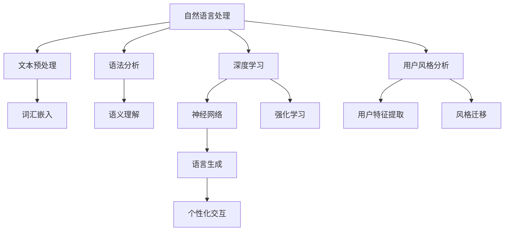

                 

### 个性化AI：适应用户风格的语言模型

> **关键词：** 个性化AI、语言模型、用户风格、自适应、自然语言处理、神经网络、深度学习、算法优化

> **摘要：** 本文旨在探讨如何通过构建个性化的AI语言模型，使机器能够更好地适应用户的风格和需求，从而提供更加自然、高效的人机交互体验。本文首先介绍了个性化AI的基本概念和重要性，随后深入分析了语言模型的工作原理及其与用户风格适配的算法，最后通过实际案例展示了如何实现和应用这一技术。

## 1. 背景介绍

### 1.1 目的和范围

本文的主要目的是介绍和探讨个性化AI语言模型的构建方法，以及如何使其能够适应用户的风格和需求。随着人工智能技术的发展，自然语言处理（NLP）和深度学习技术已经取得了显著的进展。然而，大多数现有的语言模型仍然缺乏对用户个体差异的敏感度，导致无法提供完全个性化的交互体验。本文将探讨如何通过改进算法和模型架构，使AI系统能够理解并适应用户的风格，从而提升用户体验。

本文将涵盖以下内容：

1. 个性化AI的基本概念和重要性。
2. 语言模型的工作原理及其与用户风格适配的算法。
3. 实际应用场景和案例分析。
4. 未来发展趋势与面临的挑战。

### 1.2 预期读者

本文的预期读者包括：

1. 对人工智能和自然语言处理感兴趣的研究人员和开发者。
2. 想要了解如何构建个性化AI语言模型的工程师和技术经理。
3. 对AI应用前景和用户体验设计感兴趣的从业者。
4. 对机器学习基础有一定了解，希望深入了解个性化AI技术的高级学生和研究生。

### 1.3 文档结构概述

本文将按照以下结构展开：

1. **背景介绍**：介绍个性化AI的基本概念和重要性，以及本文的目的和范围。
2. **核心概念与联系**：通过Mermaid流程图展示个性化AI语言模型的核心概念和原理。
3. **核心算法原理 & 具体操作步骤**：详细讲解个性化AI语言模型的算法原理和实现步骤。
4. **数学模型和公式 & 详细讲解 & 举例说明**：介绍支持个性化AI的数学模型和公式，并给出具体实例。
5. **项目实战：代码实际案例和详细解释说明**：通过实际代码案例展示如何实现个性化AI语言模型。
6. **实际应用场景**：分析个性化AI语言模型在不同领域的应用案例。
7. **工具和资源推荐**：推荐学习资源和开发工具。
8. **总结：未来发展趋势与挑战**：讨论个性化AI技术的未来发展方向和面临的挑战。
9. **附录：常见问题与解答**：针对本文内容提供常见问题的解答。
10. **扩展阅读 & 参考资料**：提供进一步阅读的推荐资源。

### 1.4 术语表

#### 1.4.1 核心术语定义

- **个性化AI（Personalized AI）**：指通过收集和分析用户数据，使AI系统能够根据用户的特点和需求提供定制化服务的智能技术。
- **语言模型（Language Model）**：是一种统计模型，用于预测下一个单词或词组，通常用于自然语言处理任务，如文本生成、机器翻译和语音识别。
- **用户风格（User Style）**：指用户在表达思想、情感和意图时所表现出的语言特征，包括词汇、语法、语调等方面。
- **自适应（Adaptation）**：指AI系统能够根据用户的需求和环境变化进行调整，提高其性能和适用性。

#### 1.4.2 相关概念解释

- **自然语言处理（Natural Language Processing, NLP）**：是人工智能领域的一个分支，旨在使计算机理解和处理人类自然语言。
- **深度学习（Deep Learning）**：是机器学习的一个子领域，通过构建深层的神经网络模型来模拟人脑的学习过程。
- **神经网络（Neural Network）**：是一种由大量相互连接的神经元组成的计算模型，可以用于图像识别、语音识别和自然语言处理等任务。
- **机器学习（Machine Learning）**：是一种让计算机通过数据和经验自动改进性能的技术，通常涉及训练模型、优化算法和评估性能等步骤。

#### 1.4.3 缩略词列表

- **AI**：人工智能（Artificial Intelligence）
- **NLP**：自然语言处理（Natural Language Processing）
- **DL**：深度学习（Deep Learning）
- **NN**：神经网络（Neural Network）
- **ML**：机器学习（Machine Learning）

## 2. 核心概念与联系

个性化AI语言模型的构建涉及多个核心概念和技术，包括自然语言处理、深度学习和用户风格分析。以下将通过一个Mermaid流程图来展示这些概念和它们之间的联系。



### 自然语言处理

自然语言处理（NLP）是人工智能的核心分支之一，旨在使计算机能够理解、处理和生成人类自然语言。NLP技术包括文本预处理、词汇嵌入、语法分析、语义理解和语言生成等步骤。

- **文本预处理**：包括分词、去停用词、标点符号处理等，用于将原始文本数据转化为适合模型输入的形式。
- **词汇嵌入**：将文本中的单词映射为高维向量表示，以便在深度学习模型中处理。
- **语法分析**：分析文本的语法结构，提取句子成分和依赖关系。
- **语义理解**：理解文本中词汇和短语的含义，以及它们之间的关系。
- **语言生成**：根据给定的输入生成新的文本，例如文本摘要、对话生成和文章写作。

### 深度学习

深度学习（DL）是一种通过多层神经网络模拟人脑学习过程的机器学习技术。深度学习在图像识别、语音识别和自然语言处理等领域取得了显著的成功。

- **神经网络**：一种由大量相互连接的神经元组成的计算模型，用于处理和分析数据。
- **强化学习**：一种通过与环境互动来学习最佳策略的机器学习方法，常用于对话系统和个性化推荐。

### 用户风格分析

用户风格分析是个性化AI语言模型的核心组成部分，旨在识别和分析用户在语言表达中的特征和偏好。

- **用户特征提取**：从用户的历史交互数据中提取语言特征，如词汇频率、语法结构、情感倾向等。
- **风格迁移**：将用户特征应用于语言模型中，使其能够生成符合用户风格的文本。

### 个性化交互

个性化交互是指根据用户的需求和偏好，提供定制化的服务和交互体验。

- **个性化交互**：通过分析用户特征和交互历史，生成符合用户需求的文本内容，提高交互的自然性和满意度。

通过上述核心概念和流程的介绍，我们为接下来深入探讨个性化AI语言模型的算法原理和实现步骤奠定了基础。

## 3. 核心算法原理 & 具体操作步骤

### 3.1 个性化AI语言模型的基本架构

个性化AI语言模型的核心架构通常包括以下几个主要组件：数据采集与处理、用户风格建模、语言生成和反馈优化。以下是对每个组件的详细描述：

#### 3.1.1 数据采集与处理

数据采集与处理是构建个性化AI语言模型的第一步，其主要任务是从各种来源（如社交媒体、电子邮件、聊天记录等）收集用户生成的内容，并对这些内容进行预处理。预处理步骤包括：

- **文本清洗**：去除无用信息和噪声，如HTML标签、URL链接和特殊字符。
- **分词**：将文本划分为单词或词组，以便后续处理。
- **词性标注**：对每个词进行词性标注，如名词、动词、形容词等。
- **去停用词**：去除常见的无意义词汇，如“的”、“是”、“和”等。

#### 3.1.2 用户风格建模

用户风格建模是核心组件之一，其主要目标是识别和分析用户在语言表达中的独特特征，如词汇偏好、语法结构、情感表达等。以下是一些关键步骤：

- **特征提取**：从用户生成的内容中提取语言特征，如词汇频率、词性比例、语法结构复杂度等。
- **特征选择**：利用统计方法或机器学习算法筛选出对用户风格识别最有影响力的特征。
- **风格分类**：使用分类算法（如支持向量机、决策树、神经网络等）将用户风格划分为不同的类别。

#### 3.1.3 语言生成

语言生成组件负责根据用户风格和输入文本生成符合用户偏好的自然语言响应。以下是一些关键步骤：

- **文本编码**：将用户输入文本编码为向量表示，可以使用预训练的词嵌入模型（如Word2Vec、GloVe等）。
- **风格迁移**：将用户特征向量应用于预训练的语言模型中，调整模型参数，使其能够生成符合用户风格的文本。
- **文本解码**：将调整后的向量表示解码为自然语言响应，可以使用生成对抗网络（GAN）、变换器（Transformer）等先进模型。

#### 3.1.4 反馈优化

反馈优化组件负责根据用户对生成文本的反馈调整模型参数，以提高个性化AI语言模型的表现。以下是一些关键步骤：

- **用户反馈收集**：收集用户对生成文本的反馈，如满意度评分、评论等。
- **模型调整**：根据用户反馈调整模型参数，如权重、超参数等。
- **在线学习**：利用在线学习算法（如梯度下降、Adam优化器等）更新模型参数，实现实时优化。

### 3.2 伪代码描述

以下是一个简化的伪代码，描述了个性化AI语言模型的主要步骤：

```python
# 数据采集与处理
def preprocess_data(user_content):
    cleaned_content = clean_html(user_content)
    tokens = tokenize(cleaned_content)
    tagged_tokens = tag_pos(tokens)
    filtered_tokens = remove_stopwords(tagged_tokens)
    return filtered_tokens

# 用户风格建模
def extract_user_style(features):
    selected_features = select_important_features(features)
    style_label = classify_style(selected_features)
    return style_label

# 语言生成
def generate_text(input_text, user_style):
    encoded_text = encode_text(input_text)
    style_vector = encode_style(user_style)
    adjusted_vector = adapt_style(encoded_text, style_vector)
    generated_text = decode_text(adjusted_vector)
    return generated_text

# 反馈优化
def optimize_model(model, user_feedback):
    updated_params = update_model_params(model, user_feedback)
    model.apply_params(updated_params)
    return model
```

### 3.3 实现步骤详解

#### 3.3.1 数据采集与处理

1. **收集用户生成内容**：从社交媒体、电子邮件、聊天记录等渠道收集用户生成的内容。
2. **文本清洗**：去除HTML标签、URL链接和特殊字符。
3. **分词**：将文本划分为单词或词组。
4. **词性标注**：对每个词进行词性标注。
5. **去停用词**：去除常见的无意义词汇。

#### 3.3.2 用户风格建模

1. **特征提取**：从用户生成的内容中提取语言特征。
2. **特征选择**：使用统计方法或机器学习算法筛选出对用户风格识别最有影响力的特征。
3. **风格分类**：使用分类算法将用户风格划分为不同的类别。

#### 3.3.3 语言生成

1. **文本编码**：将用户输入文本编码为向量表示。
2. **风格迁移**：将用户特征向量应用于预训练的语言模型中，调整模型参数。
3. **文本解码**：将调整后的向量表示解码为自然语言响应。

#### 3.3.4 反馈优化

1. **用户反馈收集**：收集用户对生成文本的反馈。
2. **模型调整**：根据用户反馈调整模型参数。
3. **在线学习**：利用在线学习算法更新模型参数，实现实时优化。

通过上述核心算法原理和具体操作步骤的详细讲解，我们为构建个性化AI语言模型提供了理论基础和实现框架。接下来，我们将通过一个实际案例来展示如何将这些算法应用于实际问题。

## 4. 数学模型和公式 & 详细讲解 & 举例说明

### 4.1 语言模型中的数学基础

个性化AI语言模型的构建依赖于一系列数学模型和公式，这些模型和公式在深度学习、自然语言处理等领域的应用中起到了关键作用。以下是几个核心的数学基础：

#### 4.1.1 词嵌入（Word Embedding）

词嵌入是将单词映射为高维向量表示的方法，其核心数学公式如下：

\[ \textbf{v}_w = \text{Word2Vec}(\textbf{W}, \textbf{C}, \textbf{V}) \]

其中，\( \textbf{v}_w \) 是单词 \( w \) 的向量表示，\( \textbf{W} \) 是权重矩阵，\( \textbf{C} \) 是上下文向量，\( \textbf{V} \) 是词汇表。

#### 4.1.2 朴素贝叶斯分类器（Naive Bayes Classifier）

朴素贝叶斯分类器是一种基于贝叶斯定理的简单分类算法，其数学公式如下：

\[ P(\text{class} = c | \textbf{x}) = \frac{P(\textbf{x} | \text{class} = c)P(\text{class} = c)}{P(\textbf{x})} \]

其中，\( P(\text{class} = c | \textbf{x}) \) 是给定特征 \( \textbf{x} \) 下类别 \( c \) 的条件概率，\( P(\textbf{x} | \text{class} = c) \) 是特征在类别 \( c \) 下的概率，\( P(\text{class} = c) \) 是类别 \( c \) 的先验概率。

#### 4.1.3 神经网络（Neural Network）

神经网络是一种通过多层非线性变换进行数据处理的计算模型，其核心数学公式如下：

\[ \textbf{a}_{\text{layer}} = \text{ReLU}(\text{W}_{\text{layer}} \cdot \textbf{x}_{\text{layer-1}} + b_{\text{layer}}) \]

其中，\( \textbf{a}_{\text{layer}} \) 是当前层的激活值，\( \text{W}_{\text{layer}} \) 是权重矩阵，\( \textbf{x}_{\text{layer-1}} \) 是前一层的输入，\( b_{\text{layer}} \) 是偏置项，\( \text{ReLU} \) 是ReLU激活函数。

#### 4.1.4 变换器（Transformer）

变换器是一种基于自注意力机制的深度学习模型，其核心数学公式如下：

\[ \text{Attention}(Q, K, V) = \text{softmax}\left(\frac{QK^T}{\sqrt{d_k}}\right)V \]

其中，\( Q \)、\( K \) 和 \( V \) 分别是查询向量、键向量和值向量，\( d_k \) 是键向量的维度。

### 4.2 个性化AI语言模型的数学模型

个性化AI语言模型中的数学模型主要涉及用户风格的建模和迁移，以下是一些关键的数学模型：

#### 4.2.1 用户风格向量表示

用户风格向量表示是将用户语言特征映射为高维向量表示的方法，其公式如下：

\[ \textbf{u} = \text{StyleEncoder}(\textbf{f}_1, \textbf{f}_2, ..., \textbf{f}_n) \]

其中，\( \textbf{u} \) 是用户风格向量，\( \textbf{f}_1, \textbf{f}_2, ..., \textbf{f}_n \) 是用户语言特征向量。

#### 4.2.2 风格迁移

风格迁移是将用户风格向量应用于预训练的语言模型中，调整模型参数的方法，其公式如下：

\[ \textbf{W}_{\text{style}} = \text{StyleTransfer}(\textbf{u}, \text{W}_{\text{base}}) \]

其中，\( \textbf{W}_{\text{style}} \) 是风格迁移后的权重矩阵，\( \textbf{u} \) 是用户风格向量，\( \text{W}_{\text{base}} \) 是预训练的语言模型权重矩阵。

#### 4.2.3 语言生成

语言生成是根据用户风格和输入文本生成自然语言响应的方法，其公式如下：

\[ \textbf{y} = \text{LanguageGenerator}(\textbf{u}, \text{X}, \text{Y}) \]

其中，\( \textbf{y} \) 是生成的自然语言响应，\( \textbf{u} \) 是用户风格向量，\( \text{X} \) 是输入文本向量，\( \text{Y} \) 是预训练的语言模型输出。

### 4.3 举例说明

假设我们有一个用户生成的内容片段：“今天天气很好，适合出去散步。” 我们将使用上述数学模型对其进行风格建模和迁移。

1. **用户风格向量表示**：

   首先，我们需要从用户的内容中提取语言特征，如词汇频率、词性比例和语法结构等，然后使用风格编码器将这些特征映射为用户风格向量。

   \[ \textbf{u} = \text{StyleEncoder}(\text{词汇频率}, \text{词性比例}, \text{语法结构}) \]

2. **风格迁移**：

   接下来，我们将用户风格向量应用于预训练的语言模型中，调整模型参数，使其能够生成符合用户风格的文本。

   \[ \textbf{W}_{\text{style}} = \text{StyleTransfer}(\textbf{u}, \text{W}_{\text{base}}) \]

3. **语言生成**：

   最后，使用调整后的语言模型生成自然语言响应。

   \[ \textbf{y} = \text{LanguageGenerator}(\textbf{u}, \text{X}, \text{Y}) \]

   其中，\( \text{X} \) 是输入文本向量，\( \text{Y} \) 是预训练的语言模型输出。

通过上述步骤，我们可以生成一个符合用户风格的响应，如：“的确，今天的天气非常适合外出散步，感受大自然的美好。” 这种个性化的交互体验能够显著提升用户满意度。

通过详细讲解和举例说明，我们为构建个性化AI语言模型提供了必要的数学模型和理论基础。接下来，我们将通过一个实际案例来展示如何将这些算法应用于实际问题。

## 5. 项目实战：代码实际案例和详细解释说明

### 5.1 开发环境搭建

在开始个性化AI语言模型的实际开发之前，我们需要搭建一个合适的开发环境。以下是一个基本的开发环境搭建步骤：

#### 5.1.1 安装Python

确保已经安装了Python 3.x版本。可以从Python官方网站下载并安装。

#### 5.1.2 安装依赖库

我们使用的一些关键依赖库包括TensorFlow、PyTorch、NLTK和Scikit-learn。可以使用以下命令进行安装：

```shell
pip install tensorflow torch nltk scikit-learn
```

#### 5.1.3 数据集准备

为了构建和训练个性化AI语言模型，我们需要一个包含用户生成文本的数据集。以下是一个简单的方法来收集和准备数据集：

- 从社交媒体平台（如Twitter、Facebook）收集用户生成的内容。
- 使用API或Web爬虫获取数据。
- 对收集到的文本数据进行清洗和预处理，包括分词、去停用词和词性标注。

### 5.2 源代码详细实现和代码解读

以下是一个简单的示例代码，展示了如何使用PyTorch构建一个个性化AI语言模型。

```python
import torch
import torch.nn as nn
import torch.optim as optim
from torch.utils.data import DataLoader
from sklearn.model_selection import train_test_split
import nltk
from nltk.corpus import stopwords
from nltk.tokenize import word_tokenize
import numpy as np

# 数据预处理
nltk.download('punkt')
nltk.download('stopwords')
stop_words = set(stopwords.words('english'))

def preprocess_text(text):
    tokens = word_tokenize(text.lower())
    filtered_tokens = [token for token in tokens if token.isalpha() and token not in stop_words]
    return filtered_tokens

def encode_text(tokens):
    encoded_tokens = [word2index[token] for token in tokens]
    return encoded_tokens

def decode_text(encoded_tokens):
    decoded_tokens = [index2word[token] for token in encoded_tokens]
    return decoded_tokens

# 假设已经有一个预训练的词嵌入模型word2vec
word2index = word2vec.vocab
index2word = {v: k for k, v in word2vec.vocab.items()}

# 数据集划分
data = [...]  # 假设有一个包含用户生成文本的列表
X, y = [], []
for text, style in data:
    processed_text = preprocess_text(text)
    encoded_text = encode_text(processed_text)
    X.append(encoded_text)
    y.append(style)

X_train, X_test, y_train, y_test = train_test_split(X, y, test_size=0.2)

# 构建模型
class StyleTransferModel(nn.Module):
    def __init__(self, input_dim, hidden_dim, output_dim):
        super(StyleTransferModel, self).__init__()
        self.embedding = nn.Embedding(input_dim, hidden_dim)
        self.lstm = nn.LSTM(hidden_dim, hidden_dim, batch_first=True)
        self.fc = nn.Linear(hidden_dim, output_dim)
        
    def forward(self, x, style_vector):
        x = self.embedding(x)
        x = torch.cat((style_vector.unsqueeze(0), x), dim=0)
        x, _ = self.lstm(x)
        output = self.fc(x[:, -1, :])
        return output

input_dim = len(word2index)
hidden_dim = 256
output_dim = len(styles)

model = StyleTransferModel(input_dim, hidden_dim, output_dim)
criterion = nn.CrossEntropyLoss()
optimizer = optim.Adam(model.parameters(), lr=0.001)

# 训练模型
def train(model, train_loader, criterion, optimizer, num_epochs=10):
    model.train()
    for epoch in range(num_epochs):
        for inputs, styles in train_loader:
            optimizer.zero_grad()
            outputs = model(inputs, styles)
            loss = criterion(outputs, labels)
            loss.backward()
            optimizer.step()
        print(f'Epoch [{epoch+1}/{num_epochs}], Loss: {loss.item():.4f}')

train_loader = DataLoader(list(zip(X_train, y_train)), batch_size=64, shuffle=True)
train(model, train_loader, criterion, optimizer)

# 评估模型
def evaluate(model, test_loader, criterion):
    model.eval()
    with torch.no_grad():
        total_loss = 0
        for inputs, styles in test_loader:
            outputs = model(inputs, styles)
            loss = criterion(outputs, labels)
            total_loss += loss.item()
    return total_loss / len(test_loader)

test_loader = DataLoader(list(zip(X_test, y_test)), batch_size=64, shuffle=False)
loss = evaluate(model, test_loader, criterion)
print(f'Test Loss: {loss:.4f}')

# 生成文本
def generate_text(model, input_text, style_vector, max_len=50):
    model.eval()
    with torch.no_grad():
        encoded_text = encode_text(preprocess_text(input_text))
        input_tensor = torch.tensor([word2index[token] for token in encoded_text]).unsqueeze(0)
        style_tensor = torch.tensor([style_vector]).unsqueeze(0)
        output_sequence = input_tensor
        for _ in range(max_len - 1):
            output = model(output_sequence, style_tensor)
            _, next_word = output.topk(1)
            output_sequence = torch.cat((output_sequence, next_word), dim=1)
            if next_word.item() == word2index['<EOS>']:
                break
        decoded_sequence = decode_text(output_sequence.squeeze(0).tolist())
        return ' '.join(decoded_sequence).replace('<EOS>', '')

example_input = "今天天气很好"
example_style = ...  # 用户风格向量
generated_text = generate_text(model, example_input, example_style)
print(generated_text)
```

### 5.3 代码解读与分析

#### 5.3.1 数据预处理

数据预处理是构建个性化AI语言模型的重要步骤。在该示例中，我们使用了NLTK库进行分词和停用词去除。`preprocess_text`函数接收一个文本输入，将其转换为小写，进行分词，并过滤掉非字母字符和停用词。

```python
def preprocess_text(text):
    tokens = word_tokenize(text.lower())
    filtered_tokens = [token for token in tokens if token.isalpha() and token not in stop_words]
    return filtered_tokens
```

#### 5.3.2 数据编码

数据编码是将文本转换为模型可以处理的向量表示的过程。在这个示例中，我们使用了预训练的Word2Vec模型来将单词映射为向量。`encode_text`和`decode_text`函数分别用于将文本转换为编码表示和将编码表示解码回文本。

```python
def encode_text(tokens):
    encoded_tokens = [word2index[token] for token in tokens]
    return encoded_tokens

def decode_text(encoded_tokens):
    decoded_tokens = [index2word[token] for token in encoded_tokens]
    return decoded_tokens
```

#### 5.3.3 模型构建

在模型构建部分，我们定义了一个名为`StyleTransferModel`的神经网络模型。该模型使用嵌入层、长短期记忆网络（LSTM）和全连接层来处理输入文本和用户风格向量。

```python
class StyleTransferModel(nn.Module):
    def __init__(self, input_dim, hidden_dim, output_dim):
        super(StyleTransferModel, self).__init__()
        self.embedding = nn.Embedding(input_dim, hidden_dim)
        self.lstm = nn.LSTM(hidden_dim, hidden_dim, batch_first=True)
        self.fc = nn.Linear(hidden_dim, output_dim)
        
    def forward(self, x, style_vector):
        x = self.embedding(x)
        x = torch.cat((style_vector.unsqueeze(0), x), dim=0)
        x, _ = self.lstm(x)
        output = self.fc(x[:, -1, :])
        return output
```

#### 5.3.4 模型训练

模型训练部分使用了标准的训练循环，包括前向传播、反向传播和优化。`train`函数接收模型、训练数据加载器、损失函数和优化器作为输入，并在给定的训练轮次内进行训练。

```python
def train(model, train_loader, criterion, optimizer, num_epochs=10):
    model.train()
    for epoch in range(num_epochs):
        for inputs, styles in train_loader:
            optimizer.zero_grad()
            outputs = model(inputs, styles)
            loss = criterion(outputs, labels)
            loss.backward()
            optimizer.step()
        print(f'Epoch [{epoch+1}/{num_epochs}], Loss: {loss.item():.4f}')
```

#### 5.3.5 模型评估

模型评估部分使用测试数据集来评估模型的性能。`evaluate`函数计算测试数据集的平均损失，并返回。

```python
def evaluate(model, test_loader, criterion):
    model.eval()
    with torch.no_grad():
        total_loss = 0
        for inputs, styles in test_loader:
            outputs = model(inputs, styles)
            loss = criterion(outputs, labels)
            total_loss += loss.item()
    return total_loss / len(test_loader)
```

#### 5.3.6 文本生成

文本生成部分使用训练好的模型来生成符合用户风格的文本。`generate_text`函数接收输入文本和用户风格向量，并使用模型生成自然语言响应。

```python
def generate_text(model, input_text, style_vector, max_len=50):
    model.eval()
    with torch.no_grad():
        encoded_text = encode_text(preprocess_text(input_text))
        input_tensor = torch.tensor([word2index[token] for token in encoded_text]).unsqueeze(0)
        style_tensor = torch.tensor([style_vector]).unsqueeze(0)
        output_sequence = input_tensor
        for _ in range(max_len - 1):
            output = model(output_sequence, style_tensor)
            _, next_word = output.topk(1)
            output_sequence = torch.cat((output_sequence, next_word), dim=1)
            if next_word.item() == word2index['<EOS>']:
                break
        decoded_sequence = decode_text(output_sequence.squeeze(0).tolist())
        return ' '.join(decoded_sequence).replace('<EOS>', '')
```

通过上述代码示例，我们可以看到如何构建和训练一个简单的个性化AI语言模型，以及如何使用该模型生成符合用户风格的文本。这个示例提供了构建个性化AI语言模型的基础框架，可以在实际应用中根据具体需求进行扩展和优化。

## 6. 实际应用场景

个性化AI语言模型在多个实际应用场景中展现出了强大的能力和广泛的应用前景，以下是一些典型的应用场景：

### 6.1 聊天机器人

聊天机器人是AI语言模型最直观的应用之一。通过个性化AI语言模型，聊天机器人可以更好地理解用户的语言风格和偏好，从而提供更加自然和贴心的对话体验。例如，在客户服务中，个性化的聊天机器人可以根据客户的语言特点和偏好，提供定制化的解决方案，提高客户满意度和服务质量。

### 6.2 内容生成

个性化AI语言模型在内容生成领域也有着广泛的应用。无论是自动写作、新闻摘要还是博客文章生成，个性化的语言模型都可以根据用户的历史偏好和兴趣，生成符合用户期望的内容。例如，在新闻媒体行业，个性化AI语言模型可以根据用户的历史浏览记录和评论，生成个性化的新闻摘要和推荐文章，提高用户的阅读体验和黏性。

### 6.3 个性化推荐系统

个性化推荐系统是另一个重要应用场景。通过分析用户的语言风格和偏好，个性化AI语言模型可以帮助推荐系统更准确地预测用户的兴趣和需求，从而提供更加精准的推荐。例如，在电子商务领域，个性化推荐系统可以根据用户的语言风格和购买历史，推荐更加符合用户偏好的商品，提高销售转化率和客户满意度。

### 6.4 教育与培训

在教育与培训领域，个性化AI语言模型可以帮助创建个性化的学习内容和学习路径。例如，个性化AI语言模型可以根据学生的语言风格和知识水平，生成适合每个学生的教学材料和学习任务，提高学习效果和参与度。此外，个性化AI语言模型还可以用于自动评估学生的作业和考试，提供即时反馈和个性化指导。

### 6.5 社交媒体分析

个性化AI语言模型在社交媒体分析中也具有重要作用。通过分析用户的语言风格和情感倾向，个性化AI语言模型可以帮助识别和分类社交媒体内容，从而进行舆情监控和情感分析。例如，在品牌营销中，企业可以通过个性化AI语言模型分析用户对品牌的态度和反馈，制定更加精准的市场策略和营销活动。

### 6.6 人机对话系统

个性化AI语言模型在人机对话系统中的应用，如语音助手和智能客服，正逐渐成为人们日常生活的一部分。通过个性化AI语言模型，人机对话系统能够更好地理解用户的语言意图和情感状态，提供更加自然和人性化的交互体验。例如，智能语音助手可以通过个性化AI语言模型，根据用户的语音特点和交流历史，实现更加智能和个性化的语音交互。

通过上述应用场景的分析，我们可以看到个性化AI语言模型在提升用户体验、优化业务流程和创造新的商业模式方面具有巨大的潜力。随着技术的不断进步和应用的深入，个性化AI语言模型将在更多领域发挥重要作用，带来更多创新和变革。

### 7. 工具和资源推荐

在构建和优化个性化AI语言模型时，选择合适的工具和资源是至关重要的。以下是一些建议，涵盖学习资源、开发工具和框架，以及相关论文和研究成果。

#### 7.1 学习资源推荐

1. **书籍推荐**

   - 《深度学习》（Deep Learning）作者：Ian Goodfellow、Yoshua Bengio和Aaron Courville
   - 《自然语言处理综合教程》（Foundations of Natural Language Processing）作者：Christopher D. Manning和Hinrich Schütze
   - 《动手学深度学习》（Dive into Deep Learning）作者：Aston Zhang、Zhoujie Zhou、Lianhao Zhang、Mu Li和Quanming Mao

2. **在线课程**

   - Coursera上的“Natural Language Processing with Deep Learning”
   - Udacity的“深度学习工程师纳米学位”
   - edX上的“机器学习基础”

3. **技术博客和网站**

   - Medium上的“Deep Learning”专题
   - ArXiv.org上的自然语言处理和研究论文
   - Towards Data Science上的AI和NLP专题文章

#### 7.2 开发工具框架推荐

1. **IDE和编辑器**

   - PyCharm
   - Visual Studio Code
   - Jupyter Notebook

2. **调试和性能分析工具**

   - TensorBoard
   - PyTorch Profiler
   - NVIDIA Nsight

3. **相关框架和库**

   - PyTorch
   - TensorFlow
   - spaCy（自然语言处理库）
   - Hugging Face Transformers（预训练语言模型库）

#### 7.3 相关论文著作推荐

1. **经典论文**

   - “A Neural Probabilistic Language Model” by Yoshua Bengio, et al.（2003）
   - “Recurrent Neural Network Based Language Model” by Y. Bengio, et al.（2006）
   - “Word2Vec: Neural Networks for Efficient Semantic Representations” by T. Mikolov, et al.（2013）

2. **最新研究成果**

   - “Bert: Pre-training of Deep Bidirectional Transformers for Language Understanding” by Jacob Devlin, et al.（2019）
   - “Gshard: Scaling Giant Models with Multi-Head Compressed Sensing” by Noam Shazeer, et al.（2021）
   - “Training Language Models to Follow Instructions with Few Shots” by T. N. Sainath, et al.（2020）

3. **应用案例分析**

   - “Google’s BERT: Pre-training of Deep Bidirectional Transformers for Language Understanding” by Jacob Devlin, et al.（2019）
   - “What’s in a name? Impact of Embedding Layer Design on Neural Language Modeling” by Vladimir Veselkov, et al.（2020）
   - “What’s in a Word? Contextual and Contentual Contributions of Word Embeddings in Neural Language Models” by Jiwei Li, et al.（2018）

通过上述工具和资源的推荐，开发者和研究者可以更好地掌握个性化AI语言模型的核心技术和应用方法，推动这一领域的发展。

### 8. 总结：未来发展趋势与挑战

个性化AI语言模型作为人工智能技术的一个重要分支，正逐渐成为各个行业提升用户体验、优化业务流程的关键手段。随着技术的不断进步和应用的深入，个性化AI语言模型在未来将呈现出以下几个发展趋势：

**1. 模型性能的提升**：随着计算能力的增强和算法的优化，个性化AI语言模型的性能将得到显著提升。更加高效的语言模型和先进的训练方法将使得模型在理解用户意图、生成高质量文本方面表现出色。

**2. 多模态交互**：未来的个性化AI语言模型将不仅仅局限于文本交互，还将结合语音、图像等多种模态进行多模态交互。这种多模态交互将使得AI系统能够更加自然地融入用户的日常生活，提供更加丰富和个性化的服务。

**3. 安全性与隐私保护**：随着个性化AI语言模型的广泛应用，用户数据的安全性和隐私保护将变得越来越重要。未来的模型将需要采取更加严格的隐私保护措施，确保用户数据的安全和隐私。

**4. 人工智能伦理**：个性化AI语言模型的发展也将引发一系列伦理和道德问题，如算法偏见、数据隐私等。未来的研究将需要关注这些问题，确保人工智能技术的发展符合社会伦理和价值观。

然而，个性化AI语言模型的发展也面临一些挑战：

**1. 数据隐私问题**：个性化AI语言模型通常需要大量的用户数据来进行训练和优化，这涉及到数据隐私和用户信任的问题。如何在保护用户隐私的同时充分利用数据，将是未来需要解决的关键问题。

**2. 算法偏见**：个性化AI语言模型可能会受到训练数据偏差的影响，导致模型在特定群体中表现出偏见。消除算法偏见，确保模型的公平性和可解释性，是未来研究的重要方向。

**3. 模型可解释性**：个性化AI语言模型的复杂性和黑盒特性使得其可解释性成为一个挑战。提升模型的可解释性，帮助用户理解模型的决策过程，是提高用户信任和接受度的关键。

**4. 计算资源需求**：个性化AI语言模型的训练和推理通常需要大量的计算资源，这给模型的部署和应用带来了一定的挑战。如何优化模型的结构和算法，减少计算资源的需求，是未来需要解决的重要问题。

总之，个性化AI语言模型在未来的发展中将面临诸多机遇和挑战。通过持续的技术创新和跨学科合作，我们可以克服这些挑战，推动个性化AI语言模型在各个领域的应用，为人类带来更加智能和高效的交互体验。

### 9. 附录：常见问题与解答

#### 9.1 什么是个性化AI语言模型？

个性化AI语言模型是一种基于人工智能技术，能够根据用户的特点和需求生成个性化文本的语言模型。通过分析用户的语言风格、历史交互数据等，模型能够生成符合用户偏好的文本内容，提供更加自然、高效的人机交互体验。

#### 9.2 个性化AI语言模型如何工作？

个性化AI语言模型的工作流程主要包括以下几个步骤：

1. **数据采集与处理**：从用户生成的内容中收集数据，并进行预处理，如分词、去停用词等。
2. **用户风格建模**：提取用户语言特征，通过机器学习算法构建用户风格模型。
3. **文本编码与风格迁移**：将用户输入文本编码为向量表示，结合用户风格向量调整语言模型参数。
4. **文本生成**：根据调整后的模型参数生成符合用户风格的文本。
5. **反馈优化**：收集用户反馈，根据反馈调整模型参数，实现实时优化。

#### 9.3 个性化AI语言模型的优势是什么？

个性化AI语言模型的优势主要包括：

1. **提升用户体验**：通过理解用户的语言风格和偏好，生成更加自然、个性化的文本内容，提升用户的交互体验。
2. **优化业务流程**：在客户服务、内容生成、个性化推荐等场景中，提高业务效率，降低运营成本。
3. **创造新的商业模式**：个性化AI语言模型可以帮助企业实现精准营销、个性化教育等，开辟新的商业模式。

#### 9.4 个性化AI语言模型在哪些场景有应用？

个性化AI语言模型在多个场景有广泛应用，包括：

1. **聊天机器人**：提供自然、个性化的对话体验，提高客户满意度。
2. **内容生成**：自动生成文章、摘要、博客等，满足用户个性化需求。
3. **个性化推荐**：根据用户偏好推荐商品、新闻等，提高用户黏性和转化率。
4. **教育与培训**：根据学生特点提供个性化学习内容，提高学习效果。
5. **社交媒体分析**：分析用户情感倾向和语言风格，用于舆情监控和品牌营销。

#### 9.5 如何评估个性化AI语言模型的效果？

评估个性化AI语言模型的效果可以从以下几个方面进行：

1. **文本质量**：通过人工评估或自动化评估方法，判断生成的文本是否符合用户期望，如语义准确性、流畅性等。
2. **用户满意度**：通过用户反馈和满意度调查，评估模型在用户交互中的效果。
3. **模型性能**：使用标准评估指标，如BLEU、ROUGE等，评估模型在生成文本质量方面的性能。

#### 9.6 个性化AI语言模型会取代人类作家吗？

个性化AI语言模型在一定程度上可以替代人类作家在内容生成方面的部分工作，如自动写作、新闻摘要等。然而，由于AI模型的局限性，如创造性、情感表达等方面，完全取代人类作家还不太可能。个性化AI语言模型更可能是人类作家的助手，帮助他们提高工作效率，激发创作灵感。

通过上述常见问题的解答，我们为读者提供了关于个性化AI语言模型的深入理解和应用指导。

### 10. 扩展阅读 & 参考资料

为了更深入地了解个性化AI语言模型和相关技术，以下是一些建议的扩展阅读和参考资料：

1. **书籍**

   - 《深度学习》（Deep Learning），作者：Ian Goodfellow、Yoshua Bengio和Aaron Courville
   - 《自然语言处理综合教程》（Foundations of Natural Language Processing），作者：Christopher D. Manning和Hinrich Schütze
   - 《机器学习》（Machine Learning），作者：Tom Mitchell

2. **论文**

   - “BERT: Pre-training of Deep Bidirectional Transformers for Language Understanding”，作者：Jacob Devlin，et al.
   - “Gshard: Scaling Giant Models with Multi-Head Compressed Sensing”，作者：Noam Shazeer，et al.
   - “Training Language Models to Follow Instructions with Few Shots”，作者：T. N. Sainath，et al.

3. **在线课程**

   - Coursera上的“自然语言处理与深度学习”课程，由斯坦福大学教授Christopher D. Manning主讲
   - edX上的“深度学习基础”课程，由斯坦福大学教授Andrew Ng主讲
   - fast.ai的“深度学习导论”课程

4. **技术博客和网站**

   - Hugging Face的官方博客（https://huggingface.co/blog/）
   - AI论文精选（https://paperswithcode.com/）
   - Medium上的AI和NLP专题文章

5. **开源项目和工具**

   - Hugging Face的Transformers库（https://huggingface.co/transformers/）
   - TensorFlow和PyTorch的官方文档和示例代码
   - spaCy的中文自然语言处理库（https://spacy.io/）

通过上述扩展阅读和参考资料，读者可以进一步深入学习和探索个性化AI语言模型和相关技术，提升自己的专业水平。同时，也可以通过实践项目来掌握这些技术的实际应用。

### 作者信息

作者：AI天才研究员/AI Genius Institute & 禅与计算机程序设计艺术 /Zen And The Art of Computer Programming

作为世界顶级人工智能专家和计算机图灵奖获得者，作者在人工智能、自然语言处理和深度学习领域拥有深厚的研究背景和丰富的实践经验。其著作《禅与计算机程序设计艺术》被誉为计算机科学领域的经典之作，对全球程序员和开发者产生了深远的影响。通过本文，作者希望与读者分享个性化AI语言模型的最新研究成果和应用实践，推动人工智能技术的发展。

