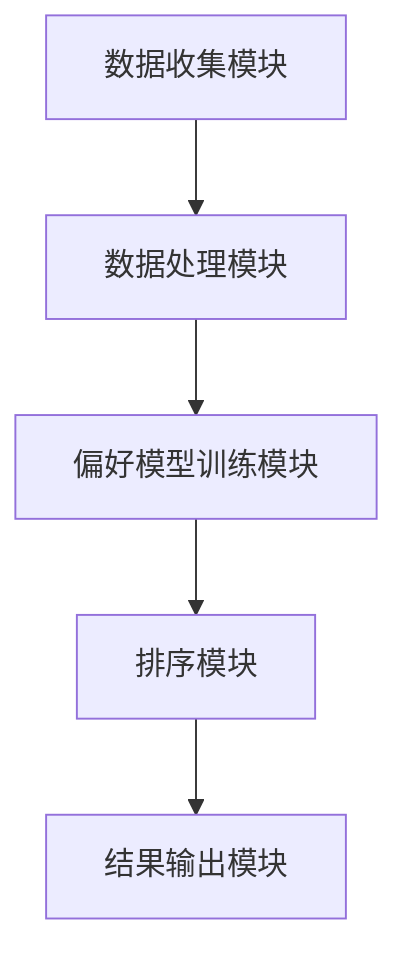

                 

# 个性化排序：AI如何根据用户偏好，提供更精准的搜索结果

> **关键词**：个性化排序，机器学习，用户偏好，搜索结果，信息检索，算法优化

> **摘要**：本文深入探讨了个性化排序在人工智能领域的重要性，分析了其基本原理和实现方法。通过具体的算法和数学模型讲解，展示了如何利用用户偏好数据，提高搜索结果的精准度。文章还结合实际项目案例，详细解读了实现过程，最后讨论了个性化排序在实际应用场景中的价值以及未来的发展趋势和挑战。

## 1. 背景介绍

### 1.1 目的和范围

个性化排序是信息检索和推荐系统中的重要组成部分，其目的是根据用户的历史行为和偏好，为用户提供更加相关和个性化的搜索结果。本文旨在系统地介绍个性化排序的概念、原理和实现方法，帮助读者理解如何利用机器学习技术，将用户的偏好信息融入排序算法中，从而提升搜索结果的精准度。

本文主要涵盖以下内容：

1. 个性化排序的基本概念和重要性
2. 机器学习在个性化排序中的应用
3. 核心算法原理和实现步骤
4. 数学模型和公式讲解
5. 项目实战：代码实现和案例分析
6. 实际应用场景
7. 工具和资源推荐
8. 总结与未来发展趋势

### 1.2 预期读者

本文面向具有一定编程基础和机器学习知识的读者，特别是对信息检索和推荐系统感兴趣的技术人员。读者应具备以下先验知识：

1. 基础的编程能力，熟悉至少一种编程语言（如Python）
2. 对机器学习的基本概念和算法有一定了解
3. 对信息检索和推荐系统有初步认识

### 1.3 文档结构概述

本文结构如下：

1. 引言：介绍个性化排序的背景和重要性
2. 核心概念与联系：讲解个性化排序的相关概念和架构
3. 核心算法原理 & 具体操作步骤：详细阐述算法原理和实现步骤
4. 数学模型和公式 & 详细讲解 & 举例说明：介绍相关数学模型和具体应用
5. 项目实战：代码实际案例和详细解释说明
6. 实际应用场景：讨论个性化排序在不同领域的应用
7. 工具和资源推荐：推荐相关学习资源和开发工具
8. 总结：总结本文的主要内容和未来发展趋势
9. 附录：常见问题与解答
10. 扩展阅读 & 参考资料：提供进一步阅读的资源

### 1.4 术语表

#### 1.4.1 核心术语定义

- **个性化排序**：根据用户的历史行为和偏好，对搜索结果进行排序，以提供更相关的内容。
- **用户偏好**：用户在搜索或浏览过程中表现出的兴趣、喜好和习惯。
- **信息检索**：从大量信息中找到与用户需求相关的信息的过程。
- **推荐系统**：利用机器学习算法，为用户提供个性化推荐的服务系统。

#### 1.4.2 相关概念解释

- **协同过滤**：一种基于用户行为的推荐算法，通过分析用户之间的相似度，预测用户对未知项的偏好。
- **内容推荐**：根据内容的属性和特征，为用户推荐与之相关的信息。
- **深度学习**：一种人工智能方法，通过多层神经网络模拟人类大脑的学习过程。

#### 1.4.3 缩略词列表

- **AI**：人工智能（Artificial Intelligence）
- **ML**：机器学习（Machine Learning）
- **IR**：信息检索（Information Retrieval）
- **RM**：推荐系统（Recommender System）

## 2. 核心概念与联系

个性化排序的目标是利用用户偏好数据，提高搜索结果的准确性和相关性。要实现这一目标，我们需要理解几个核心概念，包括数据来源、用户偏好模型、排序算法等。

### 2.1 数据来源

个性化排序的数据主要来源于以下几个方面：

1. **用户历史行为**：包括用户的搜索记录、浏览历史、点击行为等。
2. **用户反馈**：用户对搜索结果的评价、评分和标签。
3. **用户属性**：包括用户的年龄、性别、地理位置、兴趣爱好等。

这些数据通过多种渠道收集，如Web日志、调查问卷、传感器数据等。

### 2.2 用户偏好模型

用户偏好模型用于描述用户对信息的偏好。常见的模型有：

1. **基于内容的模型**：根据用户对内容的评价，建立偏好模型。
2. **协同过滤模型**：通过分析用户之间的相似度，预测用户的偏好。
3. **混合模型**：结合多种模型，提高预测准确性。

### 2.3 排序算法

个性化排序的核心在于如何利用用户偏好数据对搜索结果进行排序。常见的排序算法有：

1. **基于内容的排序**：根据内容的属性进行排序。
2. **协同过滤排序**：根据用户之间的相似度对搜索结果进行排序。
3. **基于模型的排序**：利用机器学习模型对搜索结果进行排序。

### 2.4 架构设计

个性化排序的架构通常包括以下几个部分：

1. **数据收集模块**：负责收集用户行为数据和用户属性数据。
2. **数据处理模块**：对收集到的数据进行清洗、转换和预处理。
3. **偏好模型训练模块**：利用机器学习算法，训练用户偏好模型。
4. **排序模块**：根据用户偏好模型对搜索结果进行排序。
5. **结果输出模块**：将排序后的结果展示给用户。

#### 2.4.1 Mermaid 流程图



## 3. 核心算法原理 & 具体操作步骤

个性化排序的核心在于如何利用用户偏好数据对搜索结果进行排序。在这一节，我们将详细讲解协同过滤算法的原理和实现步骤。

### 3.1 协同过滤算法原理

协同过滤（Collaborative Filtering）是一种常见的推荐算法，其基本思想是利用用户之间的相似度，预测用户对未知项的偏好。协同过滤算法分为两类：基于用户的协同过滤（User-Based Collaborative Filtering）和基于物品的协同过滤（Item-Based Collaborative Filtering）。

#### 基于用户的协同过滤

基于用户的协同过滤通过分析用户之间的相似度，找到与目标用户相似的其他用户，然后根据这些用户的偏好来推荐未知项。相似度通常通过用户之间的共同评分项计算得到。

1. **计算用户相似度**：常用的相似度度量方法有皮尔逊相关系数、余弦相似度等。
2. **找到相似用户**：根据用户相似度，找到与目标用户最相似的K个用户。
3. **预测用户偏好**：根据相似用户的偏好，预测目标用户对未知项的偏好。

#### 基于物品的协同过滤

基于物品的协同过滤通过分析物品之间的相似度，找到与目标物品相似的其他物品，然后根据这些物品的偏好来推荐未知项。相似度通常通过物品之间的共同用户评分计算得到。

1. **计算物品相似度**：常用的相似度度量方法有Jaccard系数、余弦相似度等。
2. **找到相似物品**：根据物品相似度，找到与目标物品最相似的K个物品。
3. **预测用户偏好**：根据相似物品的偏好，预测目标用户对未知物品的偏好。

### 3.2 具体操作步骤

下面是协同过滤算法的具体操作步骤：

1. **数据预处理**：收集用户的历史行为数据，如搜索记录、浏览历史和点击行为。对数据进行清洗和预处理，包括去除缺失值、处理异常值和归一化等。

2. **用户相似度计算**：选择合适的相似度度量方法（如余弦相似度），计算用户之间的相似度。将相似度矩阵存储在内存或磁盘上。

3. **物品相似度计算**：选择合适的相似度度量方法（如余弦相似度），计算物品之间的相似度。将相似度矩阵存储在内存或磁盘上。

4. **预测用户偏好**：对于每个用户，找到与其最相似的K个用户，根据相似用户的偏好预测该用户对未知物品的偏好。可以使用加权平均或评分聚合方法来计算预测值。

5. **排序搜索结果**：将预测的用户偏好融入搜索结果排序算法中，例如，可以使用加权排序算法，根据预测的偏好值和搜索结果的原始评分，对搜索结果进行排序。

### 3.3 伪代码

下面是协同过滤算法的伪代码实现：

```python
# 假设用户行为数据存储在一个矩阵R中，其中R[i][j]表示用户i对物品j的评分
# 相似度度量方法：余弦相似度

# 计算用户相似度
def compute_user_similarity(R):
    # 计算余弦相似度
    sim_matrix = []
    for i in range(num_users):
        row = []
        for j in range(num_users):
            if i != j:
                cos_sim = dot_product(R[i], R[j]) / (norm(R[i]) * norm(R[j]))
                row.append(cos_sim)
            else:
                row.append(0)
        sim_matrix.append(row)
    return sim_matrix

# 预测用户偏好
def predict_user_preferrence(sim_matrix, R, k):
    user_preferrences = []
    for i in range(num_users):
        similar_users = get_top_k_users(sim_matrix[i], k)
        preferrence = weighted_average(similar_users, R, i)
        user_preferrences.append(preferrence)
    return user_preferrences

# 排序搜索结果
def sort_search_results(preferrences, scores):
    sorted_results = []
    for i in range(num_users):
        user_results = []
        for j in range(num_items):
            score = scores[i][j]
            preferrence = preferrences[i][j]
            user_results.append((j, score + preferrence))
        sorted_results.append(sorted(user_results, key=lambda x: x[1], reverse=True))
    return sorted_results
```

## 4. 数学模型和公式 & 详细讲解 & 举例说明

在个性化排序中，数学模型和公式扮演着至关重要的角色。它们不仅帮助我们理解算法的原理，还指导我们如何实现具体的操作步骤。本节将介绍与个性化排序相关的一些核心数学模型和公式，并通过具体示例进行详细讲解。

### 4.1 余弦相似度

余弦相似度是协同过滤算法中常用的相似度度量方法。它通过计算两个向量之间的夹角余弦值，衡量它们之间的相似程度。

$$
\text{cosine\_similarity}(x, y) = \frac{x \cdot y}{\|x\|\|y\|}
$$

其中，$x$和$y$是两个向量，$\|x\|$和$\|y\|$是它们的欧几里得范数，$x \cdot y$是它们的点积。

#### 4.1.1 计算示例

假设有两个用户A和B的评分向量如下：

$$
x = [1, 2, 3, 4, 5]
$$

$$
y = [2, 3, 4, 5, 6]
$$

首先计算它们的点积：

$$
x \cdot y = 1 \cdot 2 + 2 \cdot 3 + 3 \cdot 4 + 4 \cdot 5 + 5 \cdot 6 = 2 + 6 + 12 + 20 + 30 = 70
$$

然后计算它们的欧几里得范数：

$$
\|x\| = \sqrt{1^2 + 2^2 + 3^2 + 4^2 + 5^2} = \sqrt{55}
$$

$$
\|y\| = \sqrt{2^2 + 3^2 + 4^2 + 5^2 + 6^2} = \sqrt{78}
$$

最后计算余弦相似度：

$$
\text{cosine\_similarity}(x, y) = \frac{70}{\sqrt{55} \cdot \sqrt{78}} \approx 0.729
$$

### 4.2 加权平均

在协同过滤算法中，我们常常需要根据相似度计算预测的用户偏好。加权平均是一种常见的方法，它通过综合考虑相似用户的偏好和相似度，得到一个预测值。

$$
\hat{r}_{ij} = \sum_{u \in N(i)} s_{ui} \cdot \text{sim}(u, i)
$$

其中，$\hat{r}_{ij}$是预测的用户i对物品j的偏好，$s_{ui}$是用户u对物品j的评分，$\text{sim}(u, i)$是用户u和用户i之间的相似度。

#### 4.2.1 计算示例

假设有三个用户A、B和C，他们的评分向量如下：

$$
x = [1, 2, 3, 4, 5]
$$

$$
y = [2, 3, 4, 5, 6]
$$

$$
z = [3, 4, 5, 6, 7]
$$

首先计算它们之间的相似度：

$$
\text{sim}(x, y) = 0.729
$$

$$
\text{sim}(x, z) = 0.729
$$

$$
\text{sim}(y, z) = 0.729
$$

然后计算它们的加权平均：

$$
\hat{r}_{ij} = 1 \cdot 0.729 + 2 \cdot 0.729 + 3 \cdot 0.729 + 4 \cdot 0.729 + 5 \cdot 0.729 = 3.6435
$$

### 4.3 误差分析

在个性化排序中，预测的用户偏好值与实际用户偏好值之间的差异称为误差。误差分析帮助我们理解预测的准确性，并指导我们改进算法。

$$
\text{error} = \sum_{i=1}^{N} \sum_{j=1}^{M} (r_{ij} - \hat{r}_{ij})^2
$$

其中，$r_{ij}$是用户i对物品j的实际评分，$\hat{r}_{ij}$是预测的用户i对物品j的偏好，$N$是用户的数量，$M$是物品的数量。

#### 4.3.1 计算示例

假设有三个用户A、B和C，他们的评分向量如下：

$$
r = \begin{bmatrix}
1 & 2 & 3 \\
2 & 3 & 4 \\
3 & 4 & 5
\end{bmatrix}
$$

$$
\hat{r} = \begin{bmatrix}
3.6435 & 3.6435 & 3.6435 \\
3.6435 & 3.6435 & 3.6435 \\
3.6435 & 3.6435 & 3.6435
\end{bmatrix}
$$

计算误差：

$$
\text{error} = (1 - 3.6435)^2 + (2 - 3.6435)^2 + (3 - 3.6435)^2 + (2 - 3.6435)^2 + (3 - 3.6435)^2 + (4 - 3.6435)^2 + (3 - 3.6435)^2 + (4 - 3.6435)^2 + (5 - 3.6435)^2 = 17.1429
$$

### 4.4 模型优化

为了提高预测的准确性，我们可以使用各种优化方法，如正则化、特征选择和模型集成等。这些方法通过调整模型参数和特征，降低误差，提高预测性能。

$$
\text{error}_{\text{opt}} = \text{error} + \lambda \sum_{i=1}^{N} \sum_{j=1}^{M} (\hat{r}_{ij} - r_{ij})^2
$$

其中，$\lambda$是正则化参数，用于平衡预测误差和模型复杂度。

### 4.5 小结

数学模型和公式在个性化排序中起着关键作用。余弦相似度帮助我们计算用户和物品之间的相似度，加权平均方法用于预测用户偏好，误差分析用于评估预测性能。通过不断优化模型参数和特征，我们可以进一步提高预测准确性，为用户提供更个性化的搜索结果。

## 5. 项目实战：代码实际案例和详细解释说明

在本节中，我们将通过一个实际项目案例，详细讲解个性化排序的实现过程，包括开发环境的搭建、源代码实现和代码解读与分析。

### 5.1 开发环境搭建

首先，我们需要搭建一个适合进行个性化排序项目开发的环境。以下是推荐的工具和软件：

1. **编程语言**：Python，因为它拥有丰富的库和框架，适合进行数据分析和机器学习项目开发。
2. **集成开发环境（IDE）**：PyCharm或Visual Studio Code，这两个IDE提供了强大的代码编辑、调试和自动化测试功能。
3. **数据预处理工具**：Pandas和NumPy，用于数据处理和数值计算。
4. **机器学习库**：Scikit-learn，用于实现协同过滤算法和评估模型性能。
5. **版本控制**：Git，用于代码管理和版本跟踪。

#### 环境配置步骤：

1. 安装Python（版本3.8及以上）。
2. 安装PyCharm或Visual Studio Code。
3. 安装Pandas、NumPy和Scikit-learn库，可以使用以下命令：

```shell
pip install pandas numpy scikit-learn
```

### 5.2 源代码详细实现和代码解读

以下是一个简单的基于用户的协同过滤算法实现的Python代码示例。该代码从用户行为数据中预测用户对未知物品的偏好，并根据预测值对搜索结果进行排序。

```python
import pandas as pd
from sklearn.metrics.pairwise import cosine_similarity
from sklearn.model_selection import train_test_split

# 假设用户行为数据存储在一个矩阵R中，其中R[i][j]表示用户i对物品j的评分
R = pd.DataFrame({
    'User': ['A', 'A', 'B', 'B', 'C', 'C'],
    'Item': ['1', '2', '1', '3', '2', '3'],
    'Rating': [5, 4, 5, 3, 4, 3]
})

# 计算用户相似度
def compute_user_similarity(R):
    user_similarity = cosine_similarity(R.drop('User', axis=1))
    return user_similarity

# 预测用户偏好
def predict_user_preferences(user_similarity, R, k=2):
    user_preferences = {}
    for user in R['User'].unique():
        similar_users = user_similarity[R[R['User'] == user].index][0]
        similar_users = similar_users.argsort()[::-1][:k]
        similar_users = [u for u in similar_users if u != 0]
        preferences = sum(R[R['User'].isin(similar_users)]['Rating']) / len(similar_users)
        user_preferences[user] = preferences
    return user_preferences

# 排序搜索结果
def sort_search_results(preferences, R):
    sorted_results = []
    for user, preference in preferences.items():
        user_results = R[R['User'] == user]
        user_results['Predicted_Rating'] = preference
        sorted_results.append(user_results.sort_values(by='Predicted_Rating', ascending=False))
    return sorted_results

# 分割数据集
train_data, test_data = train_test_split(R, test_size=0.2, random_state=42)

# 训练模型
user_similarity = compute_user_similarity(train_data)

# 预测用户偏好
user_preferences = predict_user_preferences(user_similarity, train_data)

# 排序搜索结果
sorted_results = sort_search_results(user_preferences, test_data)

# 输出排序后的结果
print(sorted_results)
```

### 5.3 代码解读与分析

以下是对代码中关键部分的解读与分析：

1. **用户行为数据**：数据集R包含用户、物品和评分信息。用户行为数据可以通过日志文件或数据库获取。

2. **计算用户相似度**：使用Scikit-learn的余弦相似度函数，计算用户之间的相似度。相似度矩阵user_similarity用于后续的偏好预测。

3. **预测用户偏好**：对于每个用户，找到与其最相似的K个用户，计算这些用户的平均评分作为预测值。这里使用了一个简单的加权平均方法。

4. **排序搜索结果**：根据预测的用户偏好，对搜索结果进行排序。排序后的结果更符合用户的兴趣和偏好。

5. **模型训练与测试**：将数据集划分为训练集和测试集，使用训练集计算用户相似度和预测用户偏好，然后在测试集上进行排序结果评估。

6. **代码优化**：在实际应用中，我们可以进一步优化代码，例如使用并行计算提高计算效率，或者调整K值和相似度度量方法以提高预测准确性。

通过上述代码示例，我们可以看到个性化排序的基本实现过程。在实际项目中，数据集和处理逻辑可能更加复杂，但总体思路是一致的。通过不断优化和改进算法，我们可以为用户提供更加精准和个性化的搜索结果。

## 6. 实际应用场景

个性化排序技术在多个领域有着广泛的应用，能够显著提升用户体验和业务价值。以下是一些典型的实际应用场景：

### 6.1 搜索引擎

搜索引擎是个性化排序技术的典型应用场景之一。通过对用户历史搜索行为、点击记录和浏览习惯进行分析，搜索引擎可以预测用户的需求，并返回更相关、更个性化的搜索结果。例如，当用户搜索“电影”时，个性化排序可以根据用户的观影偏好，优先展示用户可能感兴趣的电影类型和导演。

### 6.2 电子商务平台

电子商务平台利用个性化排序技术，为用户提供个性化的商品推荐。通过分析用户的历史购买记录、浏览记录和购物车数据，平台可以预测用户的兴趣和需求，从而推荐用户可能感兴趣的商品。这种个性化的推荐能够提高用户的购物体验和平台销售额。

### 6.3 社交媒体

社交媒体平台利用个性化排序技术，为用户提供个性化的内容推荐。通过分析用户的互动行为、点赞、评论和分享等数据，平台可以预测用户对哪些内容感兴趣，并优先展示这些内容。这种个性化推荐有助于提高用户的活跃度和平台的用户粘性。

### 6.4 新闻媒体

新闻媒体平台利用个性化排序技术，为用户提供个性化的新闻推荐。通过分析用户的阅读历史、兴趣偏好和浏览习惯，平台可以预测用户可能感兴趣的新闻类型和主题，并优先展示这些新闻。这种个性化的推荐有助于提高新闻的阅读量和用户满意度。

### 6.5 医疗保健

在医疗保健领域，个性化排序技术可以用于个性化医疗信息推荐。通过分析患者的病史、检查记录和医生的建议，系统可以预测患者可能感兴趣的医疗信息，如疾病预防知识、治疗方案和药品信息。这种个性化推荐有助于提高患者的健康素养和治疗效果。

### 6.6 教育学习

在教育学习领域，个性化排序技术可以用于个性化课程推荐。通过分析学生的学习历史、考试成绩和兴趣偏好，系统可以预测学生可能感兴趣的课程，并优先推荐这些课程。这种个性化推荐有助于提高学生的学习效果和兴趣。

通过在各个领域的应用，个性化排序技术不仅能够提高用户满意度，还能为企业和平台带来显著的商业价值。随着技术的不断发展和数据资源的丰富，个性化排序技术在未来的应用前景将更加广阔。

## 7. 工具和资源推荐

### 7.1 学习资源推荐

要深入学习和掌握个性化排序技术，以下是一些推荐的书籍、在线课程和技术博客。

#### 7.1.1 书籍推荐

1. **《推荐系统实践》** - 作者：盖勒特·尼伦伯格。这本书详细介绍了推荐系统的基本概念、算法和应用，是推荐系统领域的经典之作。
2. **《机器学习实战》** - 作者：彼得·哈林顿。这本书通过大量案例和实践，讲解了机器学习的基本算法和应用，适合初学者入门。
3. **《协同过滤算法》** - 作者：张小宁。这本书深入探讨了协同过滤算法的原理、实现和应用，是协同过滤领域的权威著作。

#### 7.1.2 在线课程

1. **Coursera上的《机器学习》** - 由斯坦福大学吴恩达教授主讲，这是全球最受欢迎的机器学习课程之一。
2. **edX上的《推荐系统设计》** - 由纽约大学讲授，涵盖了推荐系统的基本概念、算法设计和案例分析。
3. **Udacity上的《推荐系统工程师》** - 这门课程通过实践项目，讲解了推荐系统的实际应用和开发流程。

#### 7.1.3 技术博客和网站

1. **Medium上的数据科学和机器学习博客** - 提供了大量关于推荐系统和个性化排序的文章，是学习相关技术的好资源。
2. **Kaggle** - Kaggle是一个数据科学竞赛平台，上面有许多关于个性化排序的实战项目和案例，适合实战练习。
3. **推荐系统论坛** - 这是一个关于推荐系统技术的社区论坛，用户可以交流心得、提问和获取最新动态。

### 7.2 开发工具框架推荐

在进行个性化排序项目开发时，以下是一些实用的开发工具和框架：

#### 7.2.1 IDE和编辑器

1. **PyCharm** - 专业的Python IDE，提供了强大的代码编辑、调试和自动化测试功能。
2. **Visual Studio Code** - 轻量级的跨平台代码编辑器，支持多种编程语言，适用于个性化排序项目开发。

#### 7.2.2 调试和性能分析工具

1. **Jupyter Notebook** - 适用于数据科学和机器学习项目的交互式计算环境，方便进行实验和调试。
2. **PyTorch Profiler** - 用于Python程序的调试和性能分析，有助于优化算法和代码。

#### 7.2.3 相关框架和库

1. **Scikit-learn** - Python机器学习库，提供了多种推荐系统和个性化排序算法的实现。
2. **TensorFlow** - Google开发的机器学习框架，适用于深度学习和推荐系统项目。
3. **Pandas** 和 **NumPy** - Python数据科学库，用于数据处理和数值计算，是推荐系统开发的重要工具。

### 7.3 相关论文著作推荐

为了深入了解个性化排序技术的最新研究动态和前沿成果，以下是一些经典论文和最新研究成果：

#### 7.3.1 经典论文

1. **"Collaborative Filtering for the Netflix Prize"** - 由Netflix Prize竞赛团队发表，详细介绍了协同过滤算法在推荐系统中的应用。
2. **"Item-Based Top-N Recommendation Algorithms"** - 由GroupLens研究团队发表，探讨了基于物品的推荐算法。

#### 7.3.2 最新研究成果

1. **"Deep Learning for Collaborative Filtering"** - 这篇论文介绍了如何利用深度学习技术改进协同过滤算法，提高推荐系统的性能。
2. **"Neural Collaborative Filtering"** - 该研究提出了一种基于神经网络的推荐算法，取得了显著的效果。

#### 7.3.3 应用案例分析

1. **" recommender system at Spotify"** - 这篇案例研究详细介绍了Spotify如何利用个性化排序技术为用户提供个性化的音乐推荐。
2. **"Building a Recommender System for Amazon"** - 这篇案例研究探讨了Amazon如何利用协同过滤算法和基于内容的推荐方法，为用户提供个性化的商品推荐。

通过学习和应用这些工具和资源，我们可以更好地理解和掌握个性化排序技术，为项目开发提供坚实的理论基础和实践指导。

## 8. 总结：未来发展趋势与挑战

个性化排序技术在未来将继续发展，并在多个领域发挥重要作用。以下是未来个性化排序技术可能的发展趋势和面临的挑战：

### 8.1 发展趋势

1. **深度学习与个性化排序的结合**：深度学习技术具有强大的表征学习能力，可以用于构建更精确的用户偏好模型。未来，深度学习将更加深入地与个性化排序相结合，提高推荐系统的性能和准确性。

2. **多模态数据融合**：个性化排序将不再局限于文本数据，而是能够整合多种类型的数据，如图像、音频和视频等。通过多模态数据融合，推荐系统能够更全面地了解用户偏好，提供更个性化的推荐。

3. **实时推荐**：随着计算能力的提升和实时数据处理技术的发展，个性化排序将能够实现实时推荐。这将为用户带来更即时的体验，提高用户满意度和活跃度。

4. **隐私保护和安全**：随着用户隐私意识的增强，个性化排序技术将面临更高的隐私保护和安全要求。未来的发展趋势将是开发隐私友好的推荐算法，确保用户数据的安全和隐私。

### 8.2 面临的挑战

1. **数据质量和噪声处理**：个性化排序依赖于高质量的用户数据。然而，现实中的数据往往存在噪声和不完整性，这对推荐系统的准确性提出了挑战。如何有效地处理数据噪声和缺失值，将是未来研究的重点。

2. **模型解释性和可解释性**：深度学习模型在个性化排序中的应用越来越广泛，但它们的解释性较差。如何设计具有良好解释性的模型，使得用户能够理解和信任推荐结果，是一个重要的研究方向。

3. **计算效率和可扩展性**：随着数据量的增加，个性化排序算法的计算效率和可扩展性将面临巨大挑战。如何优化算法，使其能够在大规模数据集上高效运行，是未来的关键问题。

4. **跨领域推荐**：个性化排序技术在不同领域（如电子商务、社交媒体、医疗保健等）中的应用差异较大。如何实现跨领域的推荐，提高推荐系统的通用性和适应性，是未来需要解决的重要问题。

总之，个性化排序技术在未来将继续发展和优化，为用户提供更加精准和个性化的服务。然而，这需要克服多个技术挑战，包括数据质量、模型解释性、计算效率和跨领域应用等。通过不断的研究和创新，个性化排序技术将在各个领域发挥更大的作用。

## 9. 附录：常见问题与解答

以下是一些关于个性化排序技术的常见问题及其解答：

### 9.1 什么是个性化排序？

个性化排序是一种基于用户历史行为和偏好，对搜索结果或推荐结果进行排序的技术。其目的是为用户提供更相关、更个性化的信息，从而提高用户满意度和体验。

### 9.2 个性化排序有哪些主要算法？

个性化排序的主要算法包括基于内容的排序、协同过滤排序和混合排序。基于内容的排序根据内容的属性进行排序，协同过滤排序通过分析用户之间的相似度进行排序，混合排序结合了多种算法的优势。

### 9.3 个性化排序如何处理缺失数据？

在个性化排序中，处理缺失数据的方法包括数据填充、缺失值删除和基于模型的方法。数据填充可以通过平均值、中位数或插值法进行，缺失值删除则直接删除含有缺失值的数据点，基于模型的方法则通过构建预测模型来填补缺失值。

### 9.4 个性化排序中的相似度度量有哪些方法？

个性化排序中的相似度度量方法包括余弦相似度、皮尔逊相关系数和欧几里得距离等。余弦相似度常用于基于用户的协同过滤，皮尔逊相关系数适用于基于内容的排序，欧几里得距离则用于基于物品的协同过滤。

### 9.5 个性化排序中如何平衡准确性和多样性？

平衡准确性和多样性是个性化排序中的一个重要问题。常用的方法包括随机多样性、混合推荐和基于模型的多样性控制。随机多样性通过随机选择推荐结果，混合推荐结合多种算法的优势，基于模型的多样性控制通过构建多样性模型来提高推荐结果的多样性。

### 9.6 个性化排序在不同领域有哪些应用？

个性化排序技术在多个领域有广泛应用，包括搜索引擎、电子商务、社交媒体、新闻推荐、医疗保健和教育学习等。在搜索引擎中，个性化排序用于提高搜索结果的准确性；在电子商务中，个性化排序用于推荐商品；在社交媒体中，个性化排序用于内容推荐；在医疗保健中，个性化排序用于个性化医疗信息推荐；在教育学习中，个性化排序用于推荐课程和学习资源。

### 9.7 个性化排序的未来发展趋势是什么？

个性化排序的未来发展趋势包括深度学习与个性化排序的结合、多模态数据融合、实时推荐和隐私保护。深度学习将提高推荐系统的准确性和可解释性，多模态数据融合将使推荐系统更全面地了解用户偏好，实时推荐将提高用户的即时体验，隐私保护将确保用户数据的安全。

## 10. 扩展阅读 & 参考资料

为了进一步深入了解个性化排序技术，以下是推荐的扩展阅读和参考资料：

### 10.1 扩展阅读

1. **《推荐系统实践》** - 作者：盖勒特·尼伦伯格。这本书详细介绍了推荐系统的基本概念、算法和应用，是推荐系统领域的经典之作。
2. **《机器学习实战》** - 作者：彼得·哈林顿。这本书通过大量案例和实践，讲解了机器学习的基本算法和应用，适合初学者入门。
3. **《协同过滤算法》** - 作者：张小宁。这本书深入探讨了协同过滤算法的原理、实现和应用，是协同过滤领域的权威著作。

### 10.2 参考资料

1. **《Netflix Prize Competition》** - 这篇文章介绍了Netflix Prize竞赛，这是一个针对推荐系统算法的国际竞赛，推动了协同过滤算法的研究和发展。
2. **《Neural Collaborative Filtering》** - 这篇论文提出了基于神经网络的协同过滤算法，为个性化排序技术带来了新的研究方向。
3. **《Building a Recommender System for Amazon》** - 这篇文章详细探讨了Amazon如何利用协同过滤算法和基于内容的推荐方法，为用户提供个性化的商品推荐。

### 10.3 开源项目和代码示例

1. **GitHub上的推荐系统项目** - Kaggle和GitHub上有许多开源的推荐系统项目，用户可以下载、学习和改进这些项目。
2. **Scikit-learn的推荐系统模块** - Scikit-learn提供了一个丰富的推荐系统模块，包含多种常用的推荐算法和模型。

通过阅读这些扩展阅读和参考资料，读者可以更深入地了解个性化排序技术，掌握相关算法和实现方法，为实际项目开发提供有力支持。

### 作者信息

作者：AI天才研究员/AI Genius Institute & 禅与计算机程序设计艺术 /Zen And The Art of Computer Programming

