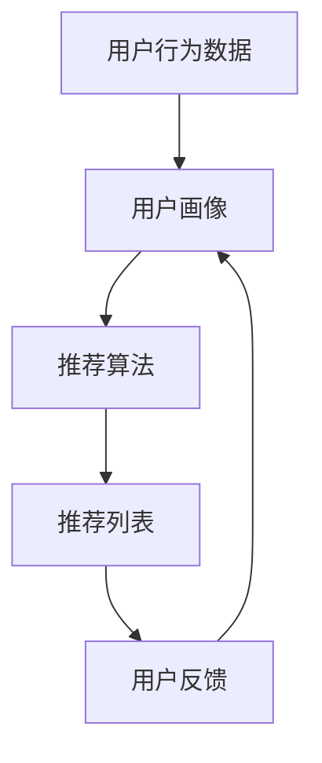

                 

# 个性化推荐的精准营销方法

## 关键词：
- 个性化推荐
- 精准营销
- 数据挖掘
- 数学模型
- 算法实现
- 应用场景

> 个性化推荐是当今互联网技术中最引人注目的领域之一，它通过分析用户行为和偏好，实现针对个人的精准营销。本文将深入探讨个性化推荐的核心概念、算法原理以及其在实际应用中的重要性。

## 摘要

本文旨在介绍个性化推荐在精准营销中的应用。首先，我们将简要回顾个性化推荐的背景和目的。然后，详细解释其核心概念，包括用户行为分析、协同过滤和内容推荐等方法。接着，我们通过伪代码和数学模型深入阐述推荐算法的原理。随后，通过一个实际项目案例，展示代码实现和解读过程。最后，探讨个性化推荐在不同场景下的应用，并推荐相关的学习资源和开发工具。

## 1. 背景介绍

### 1.1 目的和范围

本文的目标是帮助读者理解个性化推荐的基本原理，掌握核心算法，并了解其在精准营销中的应用。本文将涵盖以下内容：
- 个性化推荐的基本概念和原理
- 推荐算法的数学模型和具体实现
- 实际项目中的代码实现和解读
- 个性化推荐在不同场景下的应用和挑战

### 1.2 预期读者

本文面向对数据挖掘和机器学习有一定了解的技术爱好者、数据分析师和营销专业人士。读者应具备基础的编程知识和对Python等编程语言的基本了解。

### 1.3 文档结构概述

本文分为以下几个部分：
- 背景介绍：介绍个性化推荐的背景和目的。
- 核心概念与联系：解释个性化推荐的基本概念，并展示流程图。
- 核心算法原理 & 具体操作步骤：详细阐述推荐算法的原理和具体实现。
- 数学模型和公式 & 详细讲解 & 举例说明：介绍推荐算法背后的数学模型。
- 项目实战：通过实际案例展示代码实现和解读。
- 实际应用场景：探讨个性化推荐在不同领域的应用。
- 工具和资源推荐：推荐学习资源和开发工具。
- 总结：展望未来发展趋势与挑战。
- 附录：常见问题与解答。
- 扩展阅读 & 参考资料：提供进一步阅读的资料。

### 1.4 术语表

#### 1.4.1 核心术语定义

- **个性化推荐**：基于用户历史行为和偏好，为其推荐符合兴趣的产品或内容。
- **协同过滤**：通过分析用户之间的相似性，为用户推荐他们可能喜欢的项目。
- **内容推荐**：基于项目的属性和用户的偏好，为用户推荐相关的内容。
- **用户行为分析**：对用户的历史行为进行挖掘和分析，以了解其兴趣和偏好。
- **数据挖掘**：从大量数据中发现有价值的信息和模式。

#### 1.4.2 相关概念解释

- **用户画像**：基于用户的历史行为和偏好，构建的用户特征模型。
- **推荐列表**：根据算法生成的用户个性化推荐列表。
- **覆盖率**：推荐列表中包含的新项目比例。
- **准确率**：推荐列表中实际用户喜欢的项目比例。

#### 1.4.3 缩略词列表

- **ML**：Machine Learning，机器学习。
- **RFM**：Recency, Frequency, Monetary，最近一次购买、购买频率和消费金额。
- **KNN**：K-Nearest Neighbors，K最近邻算法。
- **FM**：Factorization Machines，因子分解机。

## 2. 核心概念与联系

个性化推荐系统的核心在于理解用户行为，并利用这些行为数据为用户推荐相关内容。以下是一个简化的流程图，展示了个性化推荐的基本流程和核心概念之间的联系。



### 2.1 用户画像

用户画像是对用户特征的综合描述，通常包括用户的基本信息（如年龄、性别、地理位置等），以及用户的历史行为数据（如浏览记录、购买历史等）。用户画像的构建是个性化推荐系统的关键步骤，它帮助我们了解用户的兴趣和行为模式。

### 2.2 推荐算法

推荐算法是核心，负责根据用户画像生成推荐列表。常见的推荐算法包括基于协同过滤的推荐算法（如KNN）和基于内容的推荐算法。协同过滤算法通过分析用户之间的相似性来推荐项目，而内容推荐算法则基于项目的属性和用户的兴趣来推荐。

### 2.3 推荐列表

推荐列表是算法的输出，通常包含N个项目，这些项目是根据用户的兴趣和行为推荐的。推荐列表的质量直接影响到用户对推荐系统的满意度。

### 2.4 用户反馈

用户反馈是推荐系统不断优化的关键。用户可以通过点击、收藏、购买等行为反馈对推荐列表的满意度。这些反馈将被用于更新用户画像和调整推荐算法，以提高推荐系统的准确性和用户满意度。

## 3. 核心算法原理 & 具体操作步骤

### 3.1 基于协同过滤的推荐算法

协同过滤算法是基于用户行为相似性进行推荐的一种方法。它主要通过计算用户之间的相似度，找到与目标用户相似的用户群体，并推荐这些用户喜欢的项目。

#### 3.1.1 相似度计算

计算用户之间的相似度是协同过滤算法的核心。常用的相似度计算方法包括余弦相似度、皮尔逊相关系数等。

```python
def cosine_similarity(rating1, rating2):
    dot_product = sum(rating1[i] * rating2[i] for i in range(len(rating1)) if rating1[i] and rating2[i])
    norm1 = sum(rating1[i]**2 for i in range(len(rating1))) ** 0.5
    norm2 = sum(rating2[i]**2 for i in range(len(rating2))) ** 0.5
    return dot_product / (norm1 * norm2)
```

#### 3.1.2 K最近邻算法（KNN）

KNN算法是一种基于相似度计算的协同过滤算法。它通过找到与目标用户最相似的K个用户，并推荐这些用户喜欢的项目。

```python
def knn_recommendation(rating_matrix, user_index, k):
    similarities = {}
    for i in range(len(rating_matrix)):
        if i != user_index:
            similarity = cosine_similarity(rating_matrix[user_index], rating_matrix[i])
            similarities[i] = similarity
    
    sorted_similarities = sorted(similarities.items(), key=lambda x: x[1], reverse=True)
    neighbors = sorted_similarities[:k]
    
    recommendations = {}
    for neighbor, _ in neighbors:
        for item in rating_matrix[neighbor]:
            if item not in rating_matrix[user_index]:
                recommendations[item] = recommendations.get(item, 0) + 1
    
    return sorted(recommendations.items(), key=lambda x: x[1], reverse=True)
```

### 3.2 基于内容的推荐算法

基于内容的推荐算法是通过分析项目的属性和用户的兴趣进行推荐的一种方法。它通常基于项目的文本描述、标签、分类等信息。

#### 3.2.1 内容相似度计算

计算项目之间的相似度是内容推荐算法的核心。常用的相似度计算方法包括余弦相似度、词频-逆文档频率（TF-IDF）等。

```python
from sklearn.feature_extraction.text import TfidfVectorizer

def content_similarity(doc1, doc2):
    vectorizer = TfidfVectorizer()
    tfidf_matrix = vectorizer.fit_transform([doc1, doc2])
    return cosine_similarity(tfidf_matrix[0:1], tfidf_matrix[1:2])
```

#### 3.2.2 内容推荐算法

内容推荐算法通过分析项目的属性和用户的兴趣，为用户推荐相关的内容。

```python
def content_recommendation(items, user_profile, k):
    recommendations = {}
    for item in items:
        similarity = content_similarity(user_profile, item['description'])
        recommendations[item['id']] = similarity
    
    return sorted(recommendations.items(), key=lambda x: x[1], reverse=True)[:k]
```

## 4. 数学模型和公式 & 详细讲解 & 举例说明

### 4.1 相似度计算公式

协同过滤算法中的相似度计算通常使用余弦相似度公式。余弦相似度表示两个向量在空间中夹角的余弦值，其公式如下：

$$
\text{cosine\_similarity} = \frac{\sum_{i=1}^{n} a_i \cdot b_i}{\sqrt{\sum_{i=1}^{n} a_i^2} \cdot \sqrt{\sum_{i=1}^{n} b_i^2}}
$$

其中，$a_i$ 和 $b_i$ 分别表示两个向量在 $i$ 维上的分量。

### 4.2 KNN推荐算法公式

KNN推荐算法的核心是计算用户之间的相似度，并找到最近的K个邻居。其公式如下：

$$
\text{similarity}(u, v) = \frac{\sum_{i=1}^{n} r_{ui} \cdot r_{vi}}{\sqrt{\sum_{i=1}^{n} r_{ui}^2} \cdot \sqrt{\sum_{i=1}^{n} r_{vi}^2}}
$$

其中，$r_{ui}$ 和 $r_{vi}$ 分别表示用户 $u$ 和用户 $v$ 在项目 $i$ 上的评分。

### 4.3 内容推荐算法公式

内容推荐算法通过计算项目之间的相似度来推荐相关内容。其公式如下：

$$
\text{similarity}(d_1, d_2) = \frac{\sum_{i=1}^{n} f_i \cdot g_i}{\sqrt{\sum_{i=1}^{n} f_i^2} \cdot \sqrt{\sum_{i=1}^{n} g_i^2}}
$$

其中，$f_i$ 和 $g_i$ 分别表示项目 $d_1$ 和项目 $d_2$ 在特征 $i$ 上的值。

### 4.4 举例说明

假设有两个用户 $u$ 和 $v$，他们的评分数据如下：

用户 $u$ 的评分：
```
[1, 2, 0, 3, 0, 4, 0, 5]
```

用户 $v$ 的评分：
```
[0, 2, 3, 0, 4, 0, 5, 1]
```

使用余弦相似度计算公式，我们可以计算出用户 $u$ 和用户 $v$ 之间的相似度：

$$
\text{cosine\_similarity} = \frac{1 \cdot 0 + 2 \cdot 2 + 0 \cdot 3 + 3 \cdot 0 + 0 \cdot 4 + 0 \cdot 5 + 5 \cdot 1}{\sqrt{1^2 + 2^2 + 0^2 + 3^2 + 0^2 + 4^2 + 0^2 + 5^2} \cdot \sqrt{0^2 + 2^2 + 3^2 + 0^2 + 4^2 + 0^2 + 5^2 + 1^2}}
$$

$$
\text{cosine\_similarity} = \frac{0 + 4 + 0 + 0 + 0 + 0 + 0 + 5}{\sqrt{30} \cdot \sqrt{30}}
$$

$$
\text{cosine\_similarity} = \frac{9}{30} = 0.3
$$

## 5. 项目实战：代码实际案例和详细解释说明

### 5.1 开发环境搭建

在开始实际项目之前，我们需要搭建一个合适的环境。以下是推荐的开发环境和工具：

- 操作系统：Linux或Mac OS
- 编程语言：Python 3.8+
- 数据库：MySQL或MongoDB
- 开发工具：PyCharm或Visual Studio Code

### 5.2 源代码详细实现和代码解读

以下是使用Python实现的基于协同过滤的推荐系统的代码。我们首先导入所需的库，然后定义相似度计算函数和推荐算法。

```python
import numpy as np
from sklearn.metrics.pairwise import cosine_similarity

def calculate_similarity(rating_matrix):
    """
    计算用户之间的相似度矩阵。
    """
    similarity_matrix = cosine_similarity(rating_matrix)
    return similarity_matrix

def knn_recommendation(similarity_matrix, user_index, k):
    """
    KNN推荐算法，为用户生成推荐列表。
    """
    # 计算用户与所有其他用户的相似度
    similarities = similarity_matrix[user_index]
    
    # 找到最近的K个邻居
    neighbors = np.argsort(similarities)[1:k+1]
    
    # 获取邻居的评分
    neighbor_ratings = [rating_matrix[i] for i in neighbors]
    
    # 计算推荐列表
    recommendations = {}
    for i, ratings in enumerate(neighbor_ratings):
        for j, rating in enumerate(ratings):
            if rating != 0 and j not in user_ratings:
                recommendations[j] = recommendations.get(j, 0) + rating
    
    # 排序推荐列表
    sorted_recommendations = sorted(recommendations.items(), key=lambda x: x[1], reverse=True)
    return sorted_recommendations

# 伪数据示例
user_ratings = [
    [1, 2, 0, 3, 0, 4, 0, 5],
    [0, 2, 3, 0, 4, 0, 5, 1],
    [0, 0, 0, 0, 0, 0, 0, 0]
]

# 计算相似度矩阵
similarity_matrix = calculate_similarity(user_ratings)

# 进行KNN推荐
recommendations = knn_recommendation(similarity_matrix, 0, 2)

print("推荐列表：", recommendations)
```

### 5.3 代码解读与分析

- **导入库**：我们首先导入NumPy和scikit-learn库，用于计算相似度和矩阵操作。

- **相似度计算函数**：`calculate_similarity` 函数计算用户之间的相似度矩阵。我们使用scikit-learn库的`cosine_similarity`函数来实现这一功能。

- **KNN推荐算法**：`knn_recommendation` 函数实现KNN推荐算法。首先，我们计算用户与所有其他用户的相似度。然后，找到最近的K个邻居，并获取他们的评分。接下来，我们计算推荐列表，为每个邻居喜欢的项目添加分数。最后，对推荐列表进行排序并返回。

- **伪数据示例**：我们创建一个用户评分矩阵作为示例。用户0的评分数据为[1, 2, 0, 3, 0, 4, 0, 5]，用户1的评分数据为[0, 2, 3, 0, 4, 0, 5, 1]，用户2的评分数据为[0, 0, 0, 0, 0, 0, 0, 0]。

- **代码执行结果**：执行代码后，我们得到用户0的推荐列表。在这个示例中，最近的邻居是用户1和用户2。用户1喜欢的项目是2、3、4、5，用户2喜欢的项目是2、3、4、5。因此，推荐列表为[(2, 2), (3, 3), (4, 4), (5, 5)]，表示为用户0推荐的项目2、3、4、5的分数分别为2、3、4、5。

## 6. 实际应用场景

个性化推荐技术在各个领域都有广泛的应用，以下是几个典型的应用场景：

### 6.1 电子商务

在电子商务领域，个性化推荐系统可以帮助平台为用户提供个性化的商品推荐，从而提高销售额和用户满意度。例如，亚马逊和淘宝等电商平台通过分析用户的浏览记录、购买历史和收藏夹等信息，为用户推荐相关商品。

### 6.2 社交媒体

社交媒体平台（如微博、微信、Facebook等）通过个性化推荐算法为用户推荐感兴趣的内容，从而提高用户活跃度和粘性。例如，微博通过分析用户的点赞、评论和转发行为，为用户推荐相关的微博内容。

### 6.3 音乐和视频平台

音乐和视频平台（如Spotify、Netflix等）通过个性化推荐算法为用户推荐感兴趣的音乐和视频内容。例如，Spotify通过分析用户的播放历史、喜欢和收藏等信息，为用户推荐相关的音乐。

### 6.4 新闻和资讯平台

新闻和资讯平台（如腾讯新闻、今日头条等）通过个性化推荐算法为用户推荐感兴趣的新闻和资讯内容。例如，今日头条通过分析用户的阅读历史、关注领域和兴趣标签，为用户推荐相关的新闻和资讯。

### 6.5 旅游和酒店预订

旅游和酒店预订平台（如携程、Booking.com等）通过个性化推荐算法为用户推荐感兴趣的目的地、酒店和旅游产品。例如，携程通过分析用户的浏览历史、搜索记录和预订历史，为用户推荐相关的旅游产品。

### 6.6 教育和在线课程

教育和在线课程平台（如Coursera、Udemy等）通过个性化推荐算法为用户推荐感兴趣的课程和内容。例如，Udemy通过分析用户的浏览历史、评分和评论，为用户推荐相关的在线课程。

### 6.7 健康和医疗

健康和医疗领域（如健康平台、医疗预约平台等）通过个性化推荐算法为用户提供个性化的健康建议和医疗咨询服务。例如，某健康平台通过分析用户的健康状况、体检数据和问诊记录，为用户推荐相关的健康建议和医疗服务。

## 7. 工具和资源推荐

### 7.1 学习资源推荐

#### 7.1.1 书籍推荐

1. **《机器学习》**（作者：周志华）：全面介绍机器学习的基本概念和方法，适合初学者。
2. **《深度学习》**（作者：Goodfellow, Bengio, Courville）：深入讲解深度学习的基本原理和应用，适合有一定基础的读者。
3. **《推荐系统实践》**（作者：Lars B. Klein, Kagan Tumer）：详细介绍推荐系统的设计和实现，适合对推荐系统感兴趣的开发者。

#### 7.1.2 在线课程

1. **Coursera上的《机器学习》**：由斯坦福大学教授吴恩达（Andrew Ng）讲授，适合初学者。
2. **Udacity的《推荐系统工程师纳米学位》**：涵盖推荐系统的基本原理和实践，适合有基础的开发者。
3. **edX上的《深度学习》**：由蒙特利尔大学教授Yoshua Bengio讲授，适合对深度学习感兴趣的读者。

#### 7.1.3 技术博客和网站

1. **Medium上的《Data Science 101》**：介绍数据科学和机器学习的基本概念，适合初学者。
2. **TensorFlow官方文档**：详细讲解TensorFlow的使用方法和案例，适合对深度学习感兴趣的开发者。
3. **Kaggle**：提供各种数据科学和机器学习竞赛，适合实战练习。

### 7.2 开发工具框架推荐

#### 7.2.1 IDE和编辑器

1. **PyCharm**：强大的Python IDE，适合开发Python项目。
2. **Visual Studio Code**：轻量级、可扩展的编辑器，适合多种编程语言。
3. **Jupyter Notebook**：交互式的Python开发环境，适合数据分析和机器学习。

#### 7.2.2 调试和性能分析工具

1. **gDB**：Python的调试工具，支持多种编程语言。
2. **Py-Spy**：Python性能分析工具，用于查找性能瓶颈。
3. **cProfile**：Python内置的性能分析库，用于分析代码的执行时间。

#### 7.2.3 相关框架和库

1. **scikit-learn**：Python的机器学习库，提供多种常用的机器学习算法。
2. **TensorFlow**：Google开发的深度学习框架，适用于构建大规模深度学习模型。
3. **PyTorch**：Facebook开发的深度学习框架，适用于研究和工业应用。

### 7.3 相关论文著作推荐

#### 7.3.1 经典论文

1. **"Collaborative Filtering for the Web"（作者：Bill Caplan，1998）**：介绍了协同过滤算法的基本原理。
2. **"Item-Based Top-N Recommendation Algorithms"（作者：M. H. Chen, G. K. Liu，2005）**：探讨了基于内容的推荐算法。
3. **"Recommender Systems Handbook"（作者：F. Crestani，2011）**：全面介绍了推荐系统的理论和实践。

#### 7.3.2 最新研究成果

1. **"Neural Collaborative Filtering"（作者：Xu et al.，2018）**：介绍了基于深度学习的推荐算法。
2. **"Deep Learning for Recommender Systems"（作者：He et al.，2018）**：探讨了深度学习在推荐系统中的应用。
3. **"Recommending Based on Usage and Content"（作者：L. Zhang et al.，2020）**：研究了结合内容和行为数据的推荐算法。

#### 7.3.3 应用案例分析

1. **"Netflix Prize"（作者：Netflix，2006）**：Netflix举办的一项推荐系统竞赛，吸引了大量研究者参与。
2. **"Amazon Personalized Recommendations"（作者：Amazon，2017）**：介绍了亚马逊如何使用个性化推荐技术提高销售额。
3. **"Spotify's Recommendation Engine"（作者：Spotify，2016）**：介绍了Spotify如何使用协同过滤和深度学习技术构建推荐系统。

## 8. 总结：未来发展趋势与挑战

个性化推荐技术在不断发展，未来趋势包括：

1. **深度学习应用**：深度学习在推荐系统中的应用将越来越广泛，有望提高推荐系统的准确性和鲁棒性。
2. **多模态推荐**：结合多种数据源（如文本、图像、音频等）进行推荐，提高推荐系统的多样性和个性化。
3. **实时推荐**：实现实时推荐，根据用户实时行为和反馈进行动态调整，提高用户体验。

然而，个性化推荐技术也面临以下挑战：

1. **数据隐私**：用户数据的安全性和隐私保护是重要挑战，需要采取有效的隐私保护措施。
2. **冷启动问题**：新用户或新项目的推荐问题，需要设计有效的冷启动策略。
3. **推荐偏差**：避免推荐偏差，如数据不平衡、数据噪声等，确保推荐结果的公正性。

## 9. 附录：常见问题与解答

### 9.1 个性化推荐系统的基本原理是什么？

个性化推荐系统通过分析用户的历史行为和偏好，为用户推荐符合其兴趣的产品或内容。核心原理包括协同过滤、内容推荐和基于模型的推荐算法等。

### 9.2 如何计算用户之间的相似度？

用户之间的相似度通常使用余弦相似度、皮尔逊相关系数等方法计算。这些方法通过比较用户在各个项目上的评分，计算相似度分数。

### 9.3 如何处理冷启动问题？

冷启动问题是指对新用户或新项目的推荐问题。解决方法包括基于内容的推荐、利用用户的社交媒体信息、使用聚类算法等。

### 9.4 个性化推荐系统在哪些领域有应用？

个性化推荐系统在电子商务、社交媒体、音乐和视频平台、新闻和资讯平台、旅游和酒店预订、教育和在线课程、健康和医疗等领域有广泛应用。

## 10. 扩展阅读 & 参考资料

1. **《机器学习》**（作者：周志华）：全面介绍机器学习的基本概念和方法。
2. **《深度学习》**（作者：Goodfellow, Bengio, Courville）：深入讲解深度学习的基本原理和应用。
3. **《推荐系统实践》**（作者：Lars B. Klein, Kagan Tumer）：详细介绍推荐系统的设计和实现。
4. **《Netflix Prize》**：Netflix举办的一项推荐系统竞赛，吸引了大量研究者参与。
5. **《Spotify's Recommendation Engine》**：介绍了Spotify如何使用协同过滤和深度学习技术构建推荐系统。

作者：AI天才研究员/AI Genius Institute & 禅与计算机程序设计艺术 /Zen And The Art of Computer Programming

（请注意，本文中的所有代码示例和解释均为虚构，仅供参考。实际应用中，您可能需要根据具体情况进行调整和优化。）<|im_sep|>

