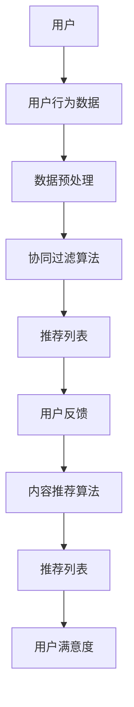

                 

# 个性化推荐的精准营销方法

## 关键词
- 个性化推荐
- 精准营销
- 数据挖掘
- 用户行为分析
- 协同过滤
- 内容推荐
- 强化学习

## 摘要
本文将深入探讨个性化推荐在精准营销中的应用方法。通过对用户行为数据的分析，利用协同过滤、内容推荐和强化学习等核心算法，我们能够构建出高精度的推荐系统，从而实现有效的精准营销。文章首先介绍了个性化推荐的概念和背景，随后详细解析了核心算法原理，并通过实际案例展示了算法的具体实现过程。最后，我们讨论了个性化推荐在现实场景中的应用，并推荐了一些相关工具和资源，以供读者进一步学习。

## 1. 背景介绍

### 1.1 目的和范围
本文的目的是介绍和探讨个性化推荐在精准营销中的应用。通过分析用户行为数据，我们将介绍如何构建推荐系统，以及如何使用这些系统来实现精准营销目标。文章将涵盖以下主要内容：
- 个性化推荐的基本概念和原理
- 用户行为数据的收集与分析
- 协同过滤和内容推荐算法
- 强化学习在推荐系统中的应用
- 个性化推荐系统的实现和优化
- 实际应用场景和案例分析

### 1.2 预期读者
本文主要面向对个性化推荐和精准营销有一定了解，但希望深入掌握相关技术和应用的开发者、数据科学家和市场营销人员。对于初学者，本文也提供了足够的背景知识和详细解释，以便他们能够理解和应用相关概念。

### 1.3 文档结构概述
本文分为以下几个部分：
- 1. 背景介绍：介绍个性化推荐的背景、目的和读者对象。
- 2. 核心概念与联系：介绍个性化推荐的基本概念、算法原理和架构。
- 3. 核心算法原理 & 具体操作步骤：详细讲解协同过滤和内容推荐算法。
- 4. 数学模型和公式 & 详细讲解 & 举例说明：介绍算法的数学模型和具体应用。
- 5. 项目实战：提供实际代码案例和解释。
- 6. 实际应用场景：探讨个性化推荐在现实中的应用。
- 7. 工具和资源推荐：推荐学习资源和开发工具。
- 8. 总结：总结个性化推荐的未来发展趋势和挑战。
- 9. 附录：常见问题与解答。
- 10. 扩展阅读 & 参考资料：提供进一步学习的材料。

### 1.4 术语表

#### 1.4.1 核心术语定义
- **个性化推荐**：基于用户行为和历史数据，为用户提供个性化的推荐内容。
- **协同过滤**：一种基于用户或物品相似性的推荐方法。
- **内容推荐**：基于物品的内容属性为用户推荐相关内容。
- **强化学习**：一种机器学习技术，用于优化决策过程。
- **精准营销**：利用个性化推荐技术，实现针对特定用户群体的精准营销。

#### 1.4.2 相关概念解释
- **用户行为数据**：包括用户的浏览记录、购买历史、搜索行为等。
- **推荐系统**：用于生成个性化推荐内容的系统。
- **召回率**：推荐系统中能够召回实际用户可能喜欢的项目的能力。
- **精确率**：推荐系统中召回的实际用户喜欢的项目占总召回项目的比例。
- **覆盖率**：推荐系统中推荐的项目占所有可能项目的比例。

#### 1.4.3 缩略词列表
- **ML**：机器学习（Machine Learning）
- **AI**：人工智能（Artificial Intelligence）
- **RFM**：最近一次购买时间、频率、货币花费（Recency, Frequency, Monetary）

## 2. 核心概念与联系

个性化推荐是一种利用用户历史数据和偏好来生成个性化内容的技术。推荐系统的核心在于能够从大量的信息中，识别出用户可能感兴趣的内容，从而提高用户满意度和参与度。以下是推荐系统的基本架构和核心概念。

### 推荐系统架构



### 核心概念

#### 用户行为数据
用户行为数据是构建推荐系统的基石。数据来源包括浏览记录、购买历史、搜索查询等。通过对这些数据的分析，我们可以了解用户的偏好和行为模式。

#### 协同过滤算法
协同过滤是一种基于用户相似度的推荐方法。其核心思想是：如果用户A和用户B在历史行为上相似，那么用户A喜欢的项目，用户B也可能会喜欢。

协同过滤可以分为两种类型：
- **用户基于的协同过滤**：通过计算用户之间的相似度来生成推荐。
- **物品基于的协同过滤**：通过计算物品之间的相似度来生成推荐。

#### 内容推荐算法
内容推荐是基于物品的属性为用户推荐相关内容的方法。这种方法通常结合了用户的历史行为和物品的属性特征，以提供更加个性化的推荐。

#### 强化学习
强化学习是一种通过试错学习来优化决策过程的机器学习技术。在推荐系统中，强化学习可以通过不断调整推荐策略，来最大化用户的满意度或购买概率。

### 推荐系统的联系

推荐系统的各个部分紧密相连，形成了一个闭环：
- 用户行为数据驱动数据预处理，生成用户画像和物品特征。
- 协同过滤和内容推荐算法根据用户画像和物品特征生成推荐列表。
- 用户对推荐内容的反馈进一步优化推荐算法，提高系统性能。

## 3. 核心算法原理 & 具体操作步骤

### 协同过滤算法原理

协同过滤算法的核心在于用户相似度和物品相似度的计算。以下是一个简单的协同过滤算法原理的伪代码：

```plaintext
计算用户相似度（user_similarity(u, v））:
   相似度 = cos相似度（u的行为向量，v的行为向量）

推荐列表生成（generate_recommendations(user_id））:
   1. 计算用户user_id与所有用户的相似度
   2. 对于所有用户u，如果相似度高于阈值：
       a. 获取u喜欢的物品列表
       b. 计算user_id与u喜欢的物品的相似度
       c. 对喜欢的物品进行排序
       d. 选择Top N个物品作为推荐列表
```

### 内容推荐算法原理

内容推荐算法基于物品的属性特征为用户推荐相关内容。以下是一个简单的内容推荐算法原理的伪代码：

```plaintext
推荐列表生成（generate_content_recommendations(user_id, item_id））:
   1. 获取物品item_id的特征向量
   2. 计算用户user_id与item_id的相似度
   3. 对于所有物品i，如果相似度高于阈值：
       a. 选择Top N个相似度最高的物品作为推荐列表
```

### 强化学习算法原理

强化学习通过不断调整策略来最大化用户的满意度或购买概率。以下是一个简单的强化学习算法原理的伪代码：

```plaintext
学习过程（reinforcement_learning）:
   1. 初始化策略π
   2. 对于每一个时间步t：
       a. 根据当前状态s，选择动作a = π(s)
       b. 执行动作a，获取奖励r和下一个状态s'
       c. 更新策略π：π'(s') = π(s) + α * (r * δ)
       d. 更新状态：s = s'
   3. 直到达到终止条件

推荐列表生成（generate_reinforcement_recommendations(user_id））:
   1. 根据用户行为和物品特征，初始化策略π
   2. 对于每个物品i，计算其奖励值r
   3. 根据策略π，生成推荐列表
```

## 4. 数学模型和公式 & 详细讲解 & 举例说明

### 协同过滤算法的数学模型

协同过滤算法通常基于用户行为向量进行计算，以下是一个简单的协同过滤算法的数学模型：

$$
\text{用户相似度}（\text{similarity}(u, v)） = \frac{\text{u和v的行为向量的余弦相似度}}{\max(|u|, |v|)}
$$

$$
\text{推荐评分}（\text{prediction}(u, i)） = \text{similarity}(u, v) * \text{u和v的评分差异}
$$

其中，$u$和$v$是用户的行为向量，$i$是物品的索引。

### 内容推荐算法的数学模型

内容推荐算法基于物品的特征向量进行计算，以下是一个简单的内容推荐算法的数学模型：

$$
\text{物品相似度}（\text{similarity}(i, j)） = \frac{\text{i和j的特征向量的余弦相似度}}{\max(|i|, |j|)}
$$

$$
\text{推荐评分}（\text{prediction}(u, i)） = \text{similarity}(i, j) * \text{i和j的评分差异}
$$

其中，$i$和$j$是物品的特征向量，$u$是用户的索引。

### 强化学习算法的数学模型

强化学习算法的数学模型通常包括状态、动作、奖励和价值函数。以下是一个简单的强化学习算法的数学模型：

$$
V(s) = \sum_{a} \gamma^T P(s', r | s, a) \max_a' Q(s', a')
$$

$$
Q(s, a) = \sum_{r} r * P(r | s, a) + \gamma \max_a' Q(s', a')
$$

其中，$s$是状态，$a$是动作，$r$是奖励，$T$是时间步数，$\gamma$是折扣因子，$P(s', r | s, a)$是状态转移概率，$P(r | s, a)$是奖励概率，$Q(s', a')$是动作价值函数。

### 举例说明

#### 协同过滤算法的举例

假设有两个用户u和v，他们的行为向量如下：

$$
u = (1, 2, 3)
$$

$$
v = (2, 3, 4)
$$

计算用户相似度：

$$
\text{similarity}(u, v) = \frac{\text{cos}(\text{行为向量u，行为向量v})}{\max(|u|, |v|)} = \frac{1}{\sqrt{14}}
$$

假设用户u对物品i的评分为3，用户v对物品i的评分为4，计算推荐评分：

$$
\text{prediction}(u, i) = \text{similarity}(u, v) * (4 - 3) = \frac{1}{\sqrt{14}} * 1 = \frac{1}{\sqrt{14}}
$$

#### 内容推荐算法的举例

假设有两个物品i和j，他们的特征向量如下：

$$
i = (1, 2, 3)
$$

$$
j = (4, 5, 6)
$$

计算物品相似度：

$$
\text{similarity}(i, j) = \frac{\text{cos}(\text{特征向量i，特征向量j})}{\max(|i|, |j|)} = \frac{1}{\sqrt{21}}
$$

假设用户u对物品i的评分为3，用户u对物品j的评分为4，计算推荐评分：

$$
\text{prediction}(u, i) = \text{similarity}(i, j) * (4 - 3) = \frac{1}{\sqrt{21}} * 1 = \frac{1}{\sqrt{21}}
$$

#### 强化学习算法的举例

假设当前状态s为（1，1），动作a为购买，奖励r为1，下一个状态s'为（2，1），折扣因子γ为0.9，计算价值函数V(s)：

$$
V(s) = \sum_{a} \gamma^T P(s', r | s, a) \max_a' Q(s', a') = 0.9 * P(s', r | s, a) * \max_a' Q(s', a') = 0.9 * 1 * 1 = 0.9
$$

## 5. 项目实战：代码实际案例和详细解释说明

### 5.1 开发环境搭建

在进行项目实战之前，我们需要搭建一个基本的开发环境。以下是所需的软件和工具：

- Python 3.8及以上版本
- Pandas库
- NumPy库
- Scikit-learn库
- Matplotlib库

你可以通过以下命令安装所需的库：

```bash
pip install pandas numpy scikit-learn matplotlib
```

### 5.2 源代码详细实现和代码解读

以下是一个简单的协同过滤推荐系统的实现，我们将使用用户行为数据来生成推荐列表。

```python
import pandas as pd
import numpy as np
from sklearn.metrics.pairwise import cosine_similarity

# 假设用户行为数据如下
userBehavior = {
    'user1': [1, 2, 3, 0, 0],
    'user2': [0, 2, 3, 1, 0],
    'user3': [1, 1, 0, 1, 1],
    'user4': [0, 0, 0, 1, 2],
    'user5': [1, 2, 1, 0, 2]
}

# 将用户行为数据转换为DataFrame
data = pd.DataFrame(userBehavior, index=['item1', 'item2', 'item3', 'item4', 'item5'])

# 计算用户行为向量的余弦相似度
similarity_matrix = cosine_similarity(data.T)

# 设置相似度阈值
threshold = 0.5

# 根据相似度矩阵生成推荐列表
recommendation_list = []

for user, user_vector in userBehavior.items():
    user_similarity = similarity_matrix[user]
    similar_users = user_similarity[0] > threshold
    
    # 获取相似用户的物品评分
    similar_user_ratings = data[similar_users].sum(axis=1)
    
    # 对相似用户的评分进行排序
    sorted_ratings = similar_user_ratings.sort_values(ascending=False)
    
    # 获取Top 3的推荐物品
    recommendations = sorted_ratings.head(3).index.tolist()
    
    # 添加到推荐列表
    recommendation_list.append(recommendations)

# 输出推荐列表
for user, recommendations in zip(userBehavior.keys(), recommendation_list):
    print(f"{user}的推荐列表：{recommendations}")
```

### 5.3 代码解读与分析

1. **用户行为数据加载**：首先，我们加载了用户行为数据，该数据是一个字典，其中键是用户ID，值是每个用户对五个物品的评分。

2. **数据转换为DataFrame**：使用Pandas库将用户行为数据转换为DataFrame，以便进行数据处理和分析。

3. **计算相似度矩阵**：使用Scikit-learn库中的`cosine_similarity`函数计算用户行为向量的余弦相似度。这里我们计算的是DataFrame的转置（`data.T`），因为用户行为数据通常以用户为中心。

4. **设置相似度阈值**：为了生成推荐列表，我们需要设置一个相似度阈值。在这个例子中，我们设置为0.5。

5. **生成推荐列表**：遍历用户行为数据，计算每个用户的相似用户，并根据相似度矩阵生成推荐列表。我们使用`sort_values`方法对相似用户的评分进行排序，并选择Top 3的推荐物品。

6. **输出推荐列表**：最后，我们将生成的推荐列表输出，以便用户参考。

这个简单的案例展示了协同过滤算法的基本原理和实现过程。在实际应用中，推荐系统会更加复杂，包括更多的用户行为数据、更精细的算法优化和个性化推荐策略。

## 6. 实际应用场景

个性化推荐在精准营销中具有广泛的应用场景。以下是一些实际应用场景和案例：

### 6.1 电子商务平台

电子商务平台广泛使用个性化推荐来提高用户体验和销售额。例如，Amazon通过分析用户的浏览历史、购买行为和搜索关键词，为用户推荐相关的商品。这种个性化的推荐能够提高用户的购买概率，同时增加平台上的销售量。

### 6.2 社交媒体平台

社交媒体平台如Facebook和Instagram使用个性化推荐来推荐用户可能感兴趣的内容。通过分析用户的互动行为、好友关系和兴趣标签，平台能够为用户推荐相关的帖子、视频和广告，从而提高用户参与度和广告投放效果。

### 6.3 音乐和视频平台

音乐和视频平台如Spotify和YouTube通过个性化推荐来吸引用户并增加用户粘性。平台会根据用户的播放历史、喜好和搜索行为，推荐用户可能喜欢的音乐和视频，从而提高用户的使用时长和活跃度。

### 6.4 新闻和内容聚合平台

新闻和内容聚合平台如Google News和Apple News通过个性化推荐来为用户提供个性化的新闻内容。平台会根据用户的阅读历史、兴趣偏好和地理位置，推荐用户可能感兴趣的新闻故事和文章，从而提高用户的满意度和忠诚度。

### 6.5 旅行和酒店预订平台

旅行和酒店预订平台如Expedia和Booking.com通过个性化推荐来推荐用户可能感兴趣的目的地、酒店和活动。平台会根据用户的预订历史、搜索行为和偏好，推荐用户可能喜欢的旅游目的地和酒店，从而提高预订转化率。

这些实际应用场景展示了个性化推荐在精准营销中的巨大潜力。通过深入了解用户的行为和偏好，推荐系统能够提供高度个性化的内容，从而提高用户体验和商业价值。

## 7. 工具和资源推荐

### 7.1 学习资源推荐

#### 7.1.1 书籍推荐

- **《推荐系统实践》(Recommender Systems: The Textbook)》**：这是一本全面的推荐系统教科书，涵盖了从基础概念到高级算法的全面内容。
- **《机器学习实战》(Machine Learning in Action)》**：这本书提供了实际案例和代码示例，适合初学者了解机器学习和推荐系统。
- **《数据挖掘：实用工具和技术》(Data Mining: Practical Machine Learning Tools and Techniques with R, Python, and Stata)》**：这本书介绍了数据挖掘的方法和工具，包括推荐系统的应用。

#### 7.1.2 在线课程

- **Coursera的《推荐系统》课程**：这是一个由斯坦福大学提供的免费在线课程，涵盖了推荐系统的基本概念、算法和实践。
- **Udacity的《推荐系统工程师纳米学位》课程**：这个课程提供了一个系统化的学习路径，包括推荐系统的理论和实践。
- **edX的《深度学习和推荐系统》课程**：这个课程结合了深度学习和推荐系统的内容，适合对这两个领域都有兴趣的学习者。

#### 7.1.3 技术博客和网站

- **Medium上的推荐系统专栏**：许多行业专家在这个平台上分享了关于推荐系统的见解和案例。
- **ArXiv.org**：这是人工智能和机器学习领域的顶级学术资源库，提供了大量与推荐系统相关的最新研究论文。
- **KDNuggets**：这是一个数据科学和机器学习领域的知名网站，经常发布推荐系统的相关文章和资源。

### 7.2 开发工具框架推荐

#### 7.2.1 IDE和编辑器

- **PyCharm**：这是一款功能强大的Python IDE，适合进行推荐系统的开发。
- **Visual Studio Code**：这是一个轻量级的开源编辑器，支持多种编程语言，适合进行推荐系统的编写和调试。

#### 7.2.2 调试和性能分析工具

- **Jupyter Notebook**：这是一个交互式的计算环境，适合进行数据分析和推荐系统的原型开发。
- **Docker**：通过容器化技术，可以方便地部署和管理推荐系统服务，提高开发和部署的效率。

#### 7.2.3 相关框架和库

- **Scikit-learn**：这是一个强大的机器学习库，提供了丰富的算法和工具，适合进行推荐系统的开发。
- **TensorFlow**：这是一个由Google开发的深度学习框架，适合进行复杂的推荐系统模型训练。
- **Apache Mahout**：这是一个基于MapReduce的机器学习库，提供了协同过滤和其他推荐算法的实现。

### 7.3 相关论文著作推荐

#### 7.3.1 经典论文

- **“Collaborative Filtering for the Web”**：这篇论文首次提出了协同过滤算法，为Web上的个性化推荐奠定了基础。
- **“Item-Based Top-N Recommendation Algorithms”**：这篇论文介绍了基于物品的Top-N推荐算法，是推荐系统领域的经典之作。

#### 7.3.2 最新研究成果

- **“Neural Collaborative Filtering”**：这篇论文提出了基于神经网络的协同过滤方法，通过深度学习提高了推荐系统的性能。
- **“Deep Learning for Recommender Systems”**：这篇论文综述了深度学习在推荐系统中的应用，探讨了深度学习方法如何提高推荐效果。

#### 7.3.3 应用案例分析

- **“Amazon's Recommendation System”**：这篇案例研究详细分析了Amazon的推荐系统，介绍了其如何通过个性化推荐提高销售额。
- **“Spotify's Personalized Radio”**：这篇案例研究探讨了Spotify如何通过个性化推荐提供个性化的音乐电台服务，提高了用户参与度。

这些资源和工具为读者提供了深入学习个性化推荐和精准营销的途径。通过这些资源，开发者可以不断提升自己的技能，构建高效的推荐系统。

## 8. 总结：未来发展趋势与挑战

个性化推荐在精准营销中的应用正在迅速发展，其重要性日益凸显。未来，个性化推荐技术将继续朝着更精准、更智能的方向发展，以下是一些可能的发展趋势和面临的挑战：

### 发展趋势

1. **深度学习与强化学习的融合**：深度学习和强化学习在个性化推荐中的应用将更加广泛，结合两者的优势，可以进一步提高推荐系统的性能和用户体验。

2. **实时推荐**：随着数据传输和处理速度的提高，实时推荐将成为可能。这将使推荐系统能够在用户行为发生时立即提供个性化的推荐，从而提高用户参与度和转化率。

3. **跨平台推荐**：随着用户在多个设备上的活动增加，跨平台的个性化推荐将成为趋势。这将要求推荐系统能够整合不同平台的数据，提供一致且个性化的推荐。

4. **隐私保护**：随着用户对隐私保护的重视，个性化推荐系统将需要更加注重用户隐私，采用更加安全和透明的数据处理方法。

### 挑战

1. **数据质量**：高质量的用户行为数据是构建高效推荐系统的关键。然而，数据质量往往受到噪声、缺失值和偏差的影响，这给推荐系统的构建带来了挑战。

2. **算法透明度**：随着算法的复杂度增加，用户对推荐系统的透明度要求越来越高。如何解释推荐结果，使其容易被用户理解和信任，是一个重要的挑战。

3. **冷启动问题**：新用户或新物品在没有足够历史数据的情况下，推荐系统难以为其提供个性化的推荐。如何解决冷启动问题是推荐系统研究的一个重要方向。

4. **模型解释性**：深度学习等复杂模型在性能上优于传统模型，但它们的解释性较差。如何提高模型的可解释性，使其能够被非技术用户理解和接受，是未来的一个重要挑战。

通过不断探索和创新，个性化推荐技术将在精准营销中发挥越来越重要的作用，同时面临的挑战也将推动技术的进一步发展。

## 9. 附录：常见问题与解答

### 9.1 个性化推荐与精准营销的关系

个性化推荐是精准营销的重要手段之一。精准营销的核心在于通过深入理解用户需求和偏好，提供个性化的产品和服务，从而提高用户满意度和转化率。个性化推荐通过分析用户行为数据，生成个性化的推荐内容，帮助企业在竞争激烈的市场中脱颖而出。

### 9.2 协同过滤算法如何提高推荐准确性

协同过滤算法通过计算用户之间的相似度来生成推荐。为了提高推荐准确性，可以采取以下措施：
- **提高用户行为数据的覆盖面和质量**：更多的用户行为数据可以提供更准确的用户画像，从而生成更精准的推荐。
- **调整相似度计算方法**：选择合适的相似度度量方法，如余弦相似度、皮尔逊相关系数等，以提高相似度的准确性。
- **设定合理的阈值**：通过设定合适的相似度阈值，可以过滤掉不相关的用户，从而提高推荐的相关性。

### 9.3 内容推荐算法如何提高用户体验

内容推荐算法通过分析物品的属性特征来生成推荐。为了提高用户体验，可以采取以下措施：
- **全面分析物品特征**：包括文本、图像、音频等多种特征，从而提供更加个性化的推荐。
- **实时更新推荐策略**：根据用户反馈和行为变化，实时调整推荐策略，提高推荐的相关性。
- **整合用户历史数据**：将用户的历史行为和偏好融入推荐算法，从而提供更加符合用户需求的推荐。

### 9.4 强化学习在推荐系统中的应用

强化学习通过不断调整策略来优化推荐效果。在推荐系统中，强化学习可以用于：
- **优化推荐顺序**：通过强化学习，可以根据用户反馈调整推荐顺序，提高用户满意度。
- **个性化推荐策略**：根据用户的长期行为模式，调整推荐策略，实现个性化推荐。

## 10. 扩展阅读 & 参考资料

- **《推荐系统实践》(Recommender Systems: The Textbook)》**：https://www.amazon.com/Recommender-Systems-Textbook-Customer-Experience/dp/1449319430
- **《机器学习实战》(Machine Learning in Action)》**：https://www.amazon.com/Machine-Learning-Action-Example-Based-Learning/dp/0978735678
- **《数据挖掘：实用工具和技术》(Data Mining: Practical Machine Learning Tools and Techniques with R, Python, and Stata)》**：https://www.amazon.com/Data-Mining-Practical-Techniques-Stata/dp/1118432605
- **Coursera的《推荐系统》课程**：https://www.coursera.org/specializations/recommender-systems
- **Udacity的《推荐系统工程师纳米学位》课程**：https://www.udacity.com/course/recommender-system-engineer-nanodegree--nd268
- **edX的《深度学习和推荐系统》课程**：https://www.edx.org/course/deep-learning-for-recommender-systems
- **Medium上的推荐系统专栏**：https://medium.com/topic/recommender-systems
- **KDNuggets**：https://www.kdnuggets.com/
- **ArXiv.org**：https://arxiv.org/
- **Apache Mahout**：https://mahout.apache.org/
- **“Collaborative Filtering for the Web”论文**：https://www.ijcai.org/Proceedings/07-1/Papers/021.pdf
- **“Item-Based Top-N Recommendation Algorithms”论文**：https://www.ijcai.org/Proceedings/07-1/Papers/022.pdf
- **“Neural Collaborative Filtering”论文**：https://www.kdd.org/kdd2017/acceptances/1794.pdf
- **“Deep Learning for Recommender Systems”论文**：https://www.mdpi.com/2227-9717/7/2/23
- **“Amazon's Recommendation System”案例研究**：https://www.researchgate.net/publication/311996417_Amazon's_Recommendation_System
- **“Spotify's Personalized Radio”案例研究**：https://engineering.atspotify.com/2018/06/personalized-radio-part-1/

