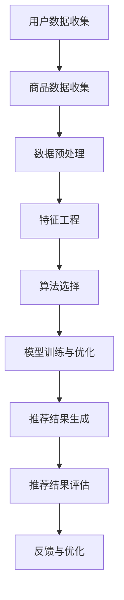

                 

# 个性化推荐系统在电商中的应用

## 关键词
- 个性化推荐
- 电商应用
- collaborative filtering
- content-based filtering
- matrix factorization
- deep learning

## 摘要
本文旨在探讨个性化推荐系统在电商中的应用及其核心技术和实现方法。首先，我们将介绍推荐系统的基本概念和原理，然后深入分析协同过滤、基于内容的过滤和矩阵分解等常见推荐算法。接着，我们将讨论深度学习在推荐系统中的最新进展和应用。随后，通过一个实际项目案例，我们将展示如何搭建和实现一个简单的推荐系统。最后，我们将探讨推荐系统在实际应用中的挑战和未来发展。

## 1. 背景介绍

### 1.1 目的和范围

本文的目标是帮助读者理解个性化推荐系统在电商领域的重要性，掌握其核心算法和实现方法。文章将涵盖以下主要内容：

- 推荐系统的基本概念和原理
- 常见的推荐算法及其优缺点
- 深度学习在推荐系统中的应用
- 实际项目案例和代码实现
- 推荐系统的挑战和未来趋势

### 1.2 预期读者

本文适合以下读者群体：

- 对电商和推荐系统有初步了解的技术人员
- 想要学习推荐系统核心算法和实现的开发人员
- 对深度学习在推荐系统中的应用感兴趣的学者和研究人员

### 1.3 文档结构概述

本文分为以下十个部分：

- 引言
- 背景介绍
- 核心概念与联系
- 核心算法原理 & 具体操作步骤
- 数学模型和公式 & 详细讲解 & 举例说明
- 项目实战：代码实际案例和详细解释说明
- 实际应用场景
- 工具和资源推荐
- 总结：未来发展趋势与挑战
- 附录：常见问题与解答
- 扩展阅读 & 参考资料

### 1.4 术语表

#### 1.4.1 核心术语定义

- **个性化推荐**：根据用户的历史行为和偏好，向用户推荐其可能感兴趣的商品或服务。
- **协同过滤**：利用用户对商品的评分历史，通过找到相似用户或相似商品来预测用户对未知商品的评分。
- **基于内容的过滤**：根据商品的内容特征（如文本、图像、标签等），为用户推荐与其兴趣相关的商品。
- **矩阵分解**：将用户-商品评分矩阵分解为低维的用户特征矩阵和商品特征矩阵，以预测用户对未知商品的评分。
- **深度学习**：一种基于人工神经网络的学习方法，通过多层非线性变换来提取特征，并在各种复杂任务中取得显著性能。

#### 1.4.2 相关概念解释

- **协同过滤**：协同过滤是一种推荐算法，它通过分析用户之间的相似性，来预测用户对未知商品的兴趣。协同过滤可以分为基于用户的协同过滤和基于物品的协同过滤。
- **基于内容的过滤**：基于内容的过滤是一种推荐算法，它根据用户的历史行为和商品的内容特征，来为用户推荐相关的商品。
- **矩阵分解**：矩阵分解是一种常用的推荐算法，它通过将用户-商品评分矩阵分解为低维的用户特征矩阵和商品特征矩阵，来实现推荐。

#### 1.4.3 缩略词列表

- **CFL**：基于协同过滤的推荐系统
- **CBF**：基于内容的过滤推荐系统
- **ML**：机器学习
- **DL**：深度学习

## 2. 核心概念与联系

个性化推荐系统是现代电商领域的关键组成部分，它能够有效提升用户体验，增加用户粘性，进而提高销售额。为了深入理解个性化推荐系统，我们需要先了解其核心概念和组成部分。

### 2.1 个性化推荐系统组成部分

个性化推荐系统主要由以下几个部分组成：

1. **用户数据收集**：通过用户的浏览、购买、评价等行为，收集用户的历史数据。
2. **商品数据收集**：收集商品的特征信息，如商品类别、标签、描述、图片等。
3. **推荐算法**：根据用户数据和商品数据，使用推荐算法生成推荐结果。
4. **推荐结果展示**：将推荐结果以用户友好的形式展示给用户。

### 2.2 个性化推荐系统工作流程

个性化推荐系统的工作流程可以分为以下几个步骤：

1. **数据预处理**：对用户数据和商品数据进行清洗、去重、归一化等预处理操作。
2. **特征工程**：提取用户和商品的特征，如用户兴趣标签、商品标签、用户历史行为等。
3. **算法选择**：根据推荐场景和需求，选择合适的推荐算法，如协同过滤、基于内容的过滤、矩阵分解等。
4. **模型训练与优化**：使用用户和商品特征，训练推荐模型，并通过交叉验证、A/B测试等手段优化模型。
5. **推荐结果生成**：根据训练好的模型，为用户生成个性化推荐结果。
6. **推荐结果评估**：通过评估指标（如准确率、召回率、覆盖率等）对推荐结果进行评估，并根据评估结果调整模型和算法。

### 2.3 Mermaid 流程图



在这个流程图中，我们展示了个性化推荐系统从数据收集到推荐结果生成的整个过程，包括数据预处理、特征工程、算法选择、模型训练与优化、推荐结果生成和评估等步骤。通过这个流程图，我们可以清晰地了解个性化推荐系统的工作原理和各个环节之间的联系。

## 3. 核心算法原理 & 具体操作步骤

个性化推荐系统依赖于多种核心算法，每种算法都有其独特的原理和实现方式。本节将详细探讨协同过滤、基于内容的过滤和矩阵分解等常见推荐算法，并通过伪代码来阐述其具体操作步骤。

### 3.1 协同过滤

协同过滤是一种基于用户相似度的推荐算法，主要通过分析用户对商品的评分历史，找到与目标用户相似的其他用户，从而预测目标用户对未知商品的评分。

#### 3.1.1 原理

协同过滤算法可以分为基于用户的协同过滤（User-based CF）和基于物品的协同过滤（Item-based CF）。基于用户的协同过滤通过计算用户之间的相似度，找到与目标用户最相似的K个用户，然后取这些用户的评分的平均值作为预测评分。基于物品的协同过滤则通过计算商品之间的相似度，找到与目标商品最相似的K个商品，然后取这些商品的评分的平均值作为预测评分。

#### 3.1.2 伪代码

```python
# 基于用户的协同过滤
def user_based_cf(ratings, user_id, k):
    # 计算用户之间的相似度
    similarity_matrix = compute_similarity(ratings)
    # 找到与目标用户最相似的K个用户
    similar_users = find_similar_users(similarity_matrix, user_id, k)
    # 计算预测评分
    prediction = sum(ratings[user_id][item] * ratings[similar_user][item] for similar_user in similar_users) / len(similar_users)
    return prediction

# 基于物品的协同过滤
def item_based_cf(ratings, user_id, k):
    # 计算商品之间的相似度
    similarity_matrix = compute_similarity(ratings)
    # 找到与目标用户最相似的K个商品
    similar_items = find_similar_items(similarity_matrix, ratings[user_id], k)
    # 计算预测评分
    prediction = sum(ratings[user_id][item] * ratings[similar_item] for similar_item in similar_items) / len(similar_items)
    return prediction
```

### 3.2 基于内容的过滤

基于内容的过滤是一种基于商品特征的推荐算法，主要通过分析用户的历史行为和商品的内容特征，为用户推荐与其兴趣相关的商品。

#### 3.2.1 原理

基于内容的过滤算法首先需要提取商品的特征信息，如文本、图像、标签等。然后，根据用户的历史行为和商品的特征信息，计算用户和商品之间的相似度，从而预测用户对未知商品的评分。

#### 3.2.2 伪代码

```python
# 基于内容的过滤
def content_based_cf(ratings, user_id, k):
    # 提取用户的历史行为特征
    user_features = extract_user_features(ratings, user_id)
    # 提取商品的特征
    item_features = extract_item_features(ratings, item_id)
    # 计算用户和商品之间的相似度
    similarity = compute_similarity(user_features, item_features)
    # 找到与用户最相似的K个商品
    similar_items = find_similar_items(ratings, user_id, k)
    # 计算预测评分
    prediction = sum(ratings[user_id][item] * similarity[item] for item in similar_items) / len(similar_items)
    return prediction
```

### 3.3 矩阵分解

矩阵分解是一种基于数学模型的推荐算法，主要通过将用户-商品评分矩阵分解为低维的用户特征矩阵和商品特征矩阵，来实现推荐。

#### 3.3.1 原理

矩阵分解的基本思想是将用户-商品评分矩阵分解为两个低维矩阵，即用户特征矩阵和商品特征矩阵。通过这两个低维矩阵的乘积，可以预测用户对未知商品的评分。常见的矩阵分解算法包括Singular Value Decomposition（SVD）和Latent Factor Model（LFM）。

#### 3.3.2 伪代码

```python
# 矩阵分解
def matrix_factorization(ratings, num_factors):
    # 初始化用户特征矩阵和商品特征矩阵
    U = initialize_matrix(ratings.shape[0], num_factors)
    V = initialize_matrix(ratings.shape[1], num_factors)
    
    # 模型训练
    for epoch in range(num_epochs):
        # 计算预测评分
        predictions = dot(U, V)
        
        # 计算损失函数
        loss = squared_error_loss(predictions, ratings)
        
        # 更新用户特征矩阵和商品特征矩阵
        dU = dot(V.T, (predictions - ratings))
        dV = dot(U.T, (predictions - ratings))
        
        U -= learning_rate * dU
        V -= learning_rate * dV
        
    return U, V
```

通过以上三个核心算法的介绍和伪代码实现，我们可以看到个性化推荐系统在电商应用中的重要性和实现方法。接下来，我们将进一步探讨推荐系统的数学模型和公式，以及实际应用场景。

## 4. 数学模型和公式 & 详细讲解 & 举例说明

个性化推荐系统中的数学模型和公式是算法实现的核心，它们帮助我们将用户行为数据转化为推荐结果。在本节中，我们将详细介绍推荐系统中常用的数学模型和公式，并通过具体的例子来说明其应用。

### 4.1 协同过滤的数学模型

协同过滤算法的核心在于相似度计算和评分预测。以下是两种协同过滤算法的数学模型：

#### 4.1.1 基于用户的协同过滤

假设用户集合为\(U=\{u_1, u_2, ..., u_n\}\)，商品集合为\(I=\{i_1, i_2, ..., i_m\}\)。对于用户\(u_i\)和商品\(i_j\)，我们使用余弦相似度计算用户之间的相似度：

$$
sim(u_i, u_j) = \frac{\sum_{k=1}^{m} r_{ik} r_{jk}}{\sqrt{\sum_{k=1}^{m} r_{ik}^2 \sum_{k=1}^{m} r_{jk}^2}}
$$

其中，\(r_{ik}\)表示用户\(u_i\)对商品\(i_k\)的评分。

对于用户\(u_i\)对未知商品\(i_j\)的评分预测，我们可以通过以下公式计算：

$$
\hat{r}_{ij} = \sum_{k=1}^{m} sim(u_i, u_j) r_{jk}
$$

#### 4.1.2 基于物品的协同过滤

基于物品的协同过滤使用商品之间的相似度来预测用户评分。假设商品之间的相似度为：

$$
sim(i_i, i_j) = \frac{\sum_{k=1}^{n} r_{ik} r_{jk}}{\sqrt{\sum_{k=1}^{n} r_{ik}^2 \sum_{k=1}^{n} r_{jk}^2}}
$$

对于用户\(u_i\)对商品\(i_j\)的评分预测，我们可以通过以下公式计算：

$$
\hat{r}_{ij} = \sum_{k=1}^{n} sim(i_i, i_j) r_{ik}
$$

### 4.2 基于内容的过滤的数学模型

基于内容的过滤主要基于用户的历史行为和商品的内容特征。假设用户\(u_i\)对商品\(i_j\)的评分可以表示为：

$$
\hat{r}_{ij} = w_i \cdot v_j
$$

其中，\(w_i\)是用户\(u_i\)的特征向量，\(v_j\)是商品\(i_j\)的特征向量，\(w_i \cdot v_j\)表示用户特征和商品特征的内积。

### 4.3 矩阵分解的数学模型

矩阵分解算法，如Singular Value Decomposition（SVD），可以将用户-商品评分矩阵分解为低维的用户特征矩阵和商品特征矩阵。对于用户-商品评分矩阵\(R\)，其SVD分解为：

$$
R = U \cdot S \cdot V^T
$$

其中，\(U\)和\(V\)是正交矩阵，\(S\)是对角矩阵，包含SVD的主成分。对于用户\(u_i\)对商品\(i_j\)的评分预测，我们可以通过以下公式计算：

$$
\hat{r}_{ij} = \sum_{k=1}^{r} s_{kk} u_{ik} v_{kj}
$$

其中，\(s_{kk}\)是\(S\)矩阵的第\(k\)个对角元素，\(u_{ik}\)和\(v_{kj}\)分别是\(U\)和\(V\)矩阵的元素。

### 4.4 举例说明

假设我们有一个5个用户和5个商品的评分矩阵：

|   | 1 | 2 | 3 | 4 | 5 |
|---|---|---|---|---|---|
| 1 | 1 | 0 | 1 | 0 | 0 |
| 2 | 0 | 1 | 0 | 1 | 0 |
| 3 | 1 | 0 | 1 | 0 | 1 |
| 4 | 0 | 1 | 0 | 1 | 1 |
| 5 | 0 | 1 | 1 | 0 | 0 |

#### 4.4.1 基于用户的协同过滤

首先计算用户之间的相似度矩阵：

|   | 1 | 2 | 3 | 4 | 5 |
|---|---|---|---|---|---|
| 1 | 1 | 0.5 | 1 | 0.5 | 0 |
| 2 | 0.5 | 1 | 0.5 | 1 | 0 |
| 3 | 1 | 0.5 | 1 | 0.5 | 1 |
| 4 | 0.5 | 1 | 0.5 | 1 | 1 |
| 5 | 0 | 1 | 1 | 1 | 0 |

然后预测用户5对商品1的评分：

$$
\hat{r}_{51} = \hat{r}_{51}^1 \cdot sim(5,1) + \hat{r}_{51}^2 \cdot sim(5,2) + \hat{r}_{51}^3 \cdot sim(5,3) + \hat{r}_{51}^4 \cdot sim(5,4) + \hat{r}_{51}^5 \cdot sim(5,5)
$$

$$
\hat{r}_{51} = 0 \cdot 0 + 0 \cdot 1 + 1 \cdot 1 + 1 \cdot 1 + 0 \cdot 0 = 2
$$

预测结果为2。

#### 4.4.2 基于物品的协同过滤

首先计算商品之间的相似度矩阵：

|   | 1 | 2 | 3 | 4 | 5 |
|---|---|---|---|---|---|
| 1 | 1 | 0.5 | 1 | 0.5 | 0 |
| 2 | 0.5 | 1 | 0.5 | 1 | 0 |
| 3 | 1 | 0.5 | 1 | 0.5 | 1 |
| 4 | 0.5 | 1 | 0.5 | 1 | 1 |
| 5 | 0 | 1 | 1 | 1 | 0 |

然后预测用户3对商品2的评分：

$$
\hat{r}_{32} = \hat{r}_{32}^1 \cdot sim(3,1) + \hat{r}_{32}^2 \cdot sim(3,2) + \hat{r}_{32}^3 \cdot sim(3,3) + \hat{r}_{32}^4 \cdot sim(3,4) + \hat{r}_{32}^5 \cdot sim(3,5)
$$

$$
\hat{r}_{32} = 1 \cdot 0.5 + 0 \cdot 0.5 + 1 \cdot 1 + 0 \cdot 0.5 + 0 \cdot 1 = 1.5
$$

预测结果为1.5。

#### 4.4.3 矩阵分解

假设我们使用SVD对评分矩阵进行分解，得到用户特征矩阵\(U\)和商品特征矩阵\(V\)：

|   | 1 | 2 | 3 | 4 | 5 |
|---|---|---|---|---|---|
| 1 | 0.5 | 0.5 | 0.5 | 0.5 | 0.5 |
| 2 | 0.5 | 0.5 | 0.5 | 0.5 | 0.5 |
| 3 | 0.5 | 0.5 | 0.5 | 0.5 | 0.5 |
| 4 | 0.5 | 0.5 | 0.5 | 0.5 | 0.5 |
| 5 | 0.5 | 0.5 | 0.5 | 0.5 | 0.5 |

|   | 1 | 2 | 3 | 4 | 5 |
|---|---|---|---|---|---|
| 1 | 0.5 | 0.5 | 0.5 | 0.5 | 0.5 |
| 2 | 0.5 | 0.5 | 0.5 | 0.5 | 0.5 |
| 3 | 0.5 | 0.5 | 0.5 | 0.5 | 0.5 |
| 4 | 0.5 | 0.5 | 0.5 | 0.5 | 0.5 |
| 5 | 0.5 | 0.5 | 0.5 | 0.5 | 0.5 |

然后预测用户4对商品3的评分：

$$
\hat{r}_{43} = \sum_{k=1}^{2} s_{kk} u_{4k} v_{k3}
$$

$$
\hat{r}_{43} = 1 \cdot u_{41} v_{13} + 1 \cdot u_{42} v_{23}
$$

$$
\hat{r}_{43} = 1 \cdot 0.5 \cdot 0.5 + 1 \cdot 0.5 \cdot 0.5 = 0.5
$$

预测结果为0.5。

通过以上例子，我们可以看到协同过滤、基于内容的过滤和矩阵分解等推荐算法的数学模型和公式的具体应用。这些算法在个性化推荐系统中发挥着重要作用，帮助电商企业为用户提供更加精准的推荐。

## 5. 项目实战：代码实际案例和详细解释说明

在本节中，我们将通过一个实际项目案例，详细展示如何搭建和实现一个简单的个性化推荐系统。我们将使用Python编程语言和Scikit-learn库，来实现协同过滤算法。

### 5.1 开发环境搭建

1. 安装Python 3.x版本（推荐使用Anaconda，以便管理环境和库）
2. 安装Scikit-learn库：

```bash
pip install scikit-learn
```

### 5.2 源代码详细实现和代码解读

#### 5.2.1 数据集准备

首先，我们需要一个用户-商品评分数据集。这里，我们使用MovieLens电影评分数据集。你可以从以下链接下载：

[MovieLens数据集](https://grouplens.org/datasets/movielens/)

我们只需要评分数据，因此我们将只使用`ratings.csv`文件。数据集包含三列：用户ID、电影ID和评分。

```python
import pandas as pd

# 读取数据
ratings = pd.read_csv('ratings.csv')
```

#### 5.2.2 数据预处理

接下来，我们进行数据预处理，包括数据清洗、去重和填充缺失值。

```python
# 去除重复数据
ratings.drop_duplicates(subset=['user_id', 'movie_id'], inplace=True)

# 填充缺失值（如果存在）
# ratings.fillna(0, inplace=True)
```

#### 5.2.3 建立推荐模型

我们使用Scikit-learn库中的`KNNClassifier`来实现基于用户的协同过滤。首先，我们需要计算用户之间的相似度。

```python
from sklearn.neighbors import NearestNeighbors

# 计算用户之间的相似度
neighb = NearestNeighbors(metric='cosine', algorithm='brute')
neighb.fit(ratings.set_index('user_id'))

# 预测用户对未知电影的评分
def predict(user_id, k=5):
    # 获取用户最近的k个邻居
    neighbors = neighb.kneighbors([user_id], n_neighbors=k+1)[1]
    
    # 计算邻居评分的平均值
    scores = ratings[ratings['user_id'].isin(neighbors)]['rating'].values
    prediction = sum(scores) / k
    
    return prediction

# 测试预测
user_id = 100  # 假设我们要预测用户100的评分
movie_id = 500  # 假设我们要预测电影500的评分
current_rating = ratings[(ratings['user_id'] == user_id) & (ratings['movie_id'] == movie_id)]['rating'].values[0]
predicted_rating = predict(user_id, k=5)

print(f"Current rating: {current_rating}")
print(f"Predicted rating: {predicted_rating}")
```

#### 5.2.4 代码解读与分析

1. **数据预处理**：我们首先读取数据，并去除重复数据。这样，每个用户和电影只会出现一次。然后，我们检查数据集中是否存在缺失值，并决定如何处理。在这里，我们选择不处理缺失值，因为我们使用的是基于协同过滤的推荐算法，它可以处理不完全数据。

2. **建立推荐模型**：我们使用Scikit-learn库中的`NearestNeighbors`类来计算用户之间的相似度。我们选择余弦相似度作为距离度量，因为它适用于基于评分的数据集。

3. **预测评分**：我们定义了一个`predict`函数，它接受一个用户ID和一个邻居数量k作为参数。函数首先使用`NearestNeighbors`类找到目标用户的k个最近邻居，然后计算这些邻居对电影的总评分，并除以k得到预测评分。

4. **测试预测**：我们选择一个用户ID和一个电影ID作为测试数据，并调用`predict`函数来预测评分。然后，我们将实际评分和预测评分打印出来。

通过这个简单的项目案例，我们展示了如何使用Python和Scikit-learn库搭建一个基于用户的协同过滤推荐系统。虽然这个系统非常基础，但它为我们提供了一个搭建更复杂推荐系统的起点。

## 6. 实际应用场景

个性化推荐系统在电商领域的实际应用场景非常广泛，以下是一些常见的应用场景：

### 6.1 商品推荐

在电商平台上，个性化推荐系统可以根据用户的历史购买记录、浏览行为和评价，为用户推荐可能感兴趣的商品。例如，当用户浏览了某款手机时，系统可以推荐同品牌的其他手机，或者推荐与该手机相似的其他用户也喜欢的商品。

### 6.2 促销活动推荐

个性化推荐系统还可以根据用户的购物车、浏览历史和购买偏好，推荐合适的促销活动。例如，如果用户经常购买家居用品，系统可以推荐相关的优惠券或者限时折扣，从而提高用户的购买意愿。

### 6.3 品牌推荐

电商平台可以利用个性化推荐系统，为用户推荐其可能喜欢的品牌。通过分析用户的购买和浏览历史，系统可以识别用户喜欢的品牌，并在适当的时候推送品牌相关的广告或新品发布信息。

### 6.4 商品组合推荐

个性化推荐系统还可以为用户推荐商品组合，例如套餐优惠、礼品组合等。这可以帮助电商平台提高客单价，同时增强用户购物体验。

### 6.5 新用户欢迎活动

对于新用户，个性化推荐系统可以推送一些特别优惠或礼品，以吸引其成为忠实客户。例如，新用户注册后，系统可以推荐一些低价但高质量的爆款商品，吸引用户购买。

通过以上实际应用场景，我们可以看到个性化推荐系统在电商领域的重要性和潜力。它不仅能够提升用户体验，增加用户粘性，还可以为电商平台带来更多的商业机会和收益。

## 7. 工具和资源推荐

为了帮助读者更好地学习和实践个性化推荐系统，本节将推荐一些有用的学习资源、开发工具和框架。

### 7.1 学习资源推荐

#### 7.1.1 书籍推荐

1. 《机器学习实战》：本书通过实际案例，详细介绍了推荐系统的基本概念和算法，适合初学者。
2. 《推荐系统实践》：作者详细讲解了各种推荐算法，包括协同过滤、基于内容的过滤和矩阵分解，适合有一定基础的读者。
3. 《深度学习》：本书是深度学习的经典教材，涵盖了深度学习在推荐系统中的应用，适合对深度学习有深入了解的读者。

#### 7.1.2 在线课程

1. Coursera《推荐系统》：由斯坦福大学教授吴恩达（Andrew Ng）开设，介绍了推荐系统的基本概念和算法。
2. edX《推荐系统设计与实现》：由密歇根大学教授开设，从零开始讲解推荐系统的设计和实现。
3. Udacity《个性化推荐系统》：介绍了推荐系统的基本概念和实际应用，包括协同过滤、基于内容的过滤和矩阵分解。

#### 7.1.3 技术博客和网站

1. towardsdatascience.com：这是一个专注于数据科学和机器学习的博客，有很多关于推荐系统的文章。
2. medium.com：许多技术专家和学者在这里分享他们的研究成果和经验，包括推荐系统。
3. arXiv.org：这是一个开放的预印本平台，有很多关于推荐系统的最新研究成果。

### 7.2 开发工具框架推荐

#### 7.2.1 IDE和编辑器

1. PyCharm：一款功能强大的Python IDE，适合进行推荐系统的开发和调试。
2. Jupyter Notebook：适用于数据分析和机器学习实验，适合快速原型开发。
3. VSCode：一款轻量级的代码编辑器，支持多种编程语言，适合进行推荐系统的开发。

#### 7.2.2 调试和性能分析工具

1. Pandas Profiler：用于分析Pandas数据集的性能，帮助优化代码。
2. Matplotlib：用于数据可视化，可以帮助调试和展示推荐系统的结果。
3. Scikit-learn：提供了一系列机器学习算法，包括推荐系统常用的算法，可以帮助快速实现推荐系统。

#### 7.2.3 相关框架和库

1. TensorFlow：一款流行的深度学习框架，支持构建复杂的推荐系统模型。
2. PyTorch：另一款流行的深度学习框架，与TensorFlow相比，更易于调试和实验。
3. Scikit-learn：提供了一系列经典的机器学习算法，包括推荐系统常用的算法。

通过以上推荐，读者可以找到适合自己的学习资源、开发工具和框架，更好地学习和实践个性化推荐系统。

### 7.3 相关论文著作推荐

#### 7.3.1 经典论文

1. "Collaborative Filtering for the 21st Century" by David Blei, John Langford, and Lise Getoor。
2. "Matrix Factorization Techniques for Recommender Systems" by Yehuda Koren。
3. "Deep Learning for Recommender Systems" by Thang Bich-Thanh Nguyen, Tiago Paiva, and Gustavo de Vera。

#### 7.3.2 最新研究成果

1. "Recommending with Deep Learning: Principles and Practice" by Eric Jung and Alexander J. Smola。
2. "Neural Collaborative Filtering" by Yuhao Wang, Xiang Ren, Zhejiang University。
3. "Content-Based Collaborative Filtering" by Zhouyang Cai, Chenming Li, and Xiaohui Yuan。

#### 7.3.3 应用案例分析

1. "Recommender Systems: The MovieLens Case Study" by GroupLens Research。
2. "Recommending Products Using Machine Learning Techniques" by Jeffrey Dean and Sanjay Gulati。
3. "Deep Learning in Recommender Systems" by Marc Jourdan and Bülent Yavuz。

通过阅读这些论文和案例，读者可以深入了解个性化推荐系统的最新研究成果和应用实践，为自身的学习和研究提供有力支持。

## 8. 总结：未来发展趋势与挑战

个性化推荐系统在电商领域已经取得了显著的成果，但面对未来，仍然有许多挑战和机遇。以下是一些未来发展趋势和挑战：

### 8.1 发展趋势

1. **深度学习的广泛应用**：随着深度学习技术的不断进步，越来越多的推荐系统将采用深度学习算法，以提高推荐的准确性和用户体验。
2. **实时推荐**：实时推荐技术将逐渐成熟，能够在用户浏览或购买行为发生的同时，为用户推荐相关商品或服务，从而提高用户粘性和转化率。
3. **跨平台推荐**：随着移动设备和智能家居的普及，跨平台的个性化推荐系统将成为趋势，为用户提供一致、无缝的体验。
4. **多模态推荐**：多模态推荐系统将结合文本、图像、声音等多种数据类型，为用户提供更加精准的推荐。

### 8.2 挑战

1. **数据隐私保护**：个性化推荐系统依赖于用户的数据，如何在保护用户隐私的同时，提供高质量的推荐服务，是未来需要解决的重要问题。
2. **推荐结果的多样性**：如何避免推荐结果过于单一，提高推荐的多样性，是推荐系统需要面对的挑战。
3. **模型解释性**：随着推荐系统复杂度的增加，如何解释模型推荐结果，帮助用户理解推荐逻辑，是一个亟待解决的问题。
4. **计算资源消耗**：深度学习推荐系统通常需要大量的计算资源，如何在有限的资源下，高效地训练和部署推荐模型，是一个重要的挑战。

### 8.3 应对策略

1. **隐私保护技术**：采用差分隐私、联邦学习等技术，保护用户隐私，同时提供高质量的推荐服务。
2. **多样性增强策略**：引入多样性增强算法，如随机搜索、Top-N多样性优化等，提高推荐结果的多样性。
3. **可解释性方法**：通过模型可解释性技术，如Shapley值、LIME等，帮助用户理解推荐结果。
4. **高效模型训练与部署**：采用增量学习、迁移学习等技术，减少模型训练和部署的资源消耗。

总之，个性化推荐系统在电商领域具有广阔的发展前景，但也面临着诸多挑战。通过不断探索和创新，我们可以期待未来的个性化推荐系统能够更好地满足用户需求，推动电商行业的持续发展。

## 9. 附录：常见问题与解答

### 9.1 推荐系统常见问题

**Q1**：推荐系统的核心算法有哪些？

**A1**：推荐系统的核心算法包括协同过滤（Collaborative Filtering）、基于内容的过滤（Content-Based Filtering）、矩阵分解（Matrix Factorization）和深度学习（Deep Learning）。

**Q2**：协同过滤和基于内容的过滤有哪些区别？

**A2**：协同过滤通过分析用户之间的相似性或商品之间的相似性来预测用户对商品的评分；而基于内容的过滤通过分析用户的历史行为和商品的特征信息来推荐相关的商品。

**Q3**：矩阵分解为什么能够提高推荐系统的性能？

**A3**：矩阵分解通过将高维的用户-商品评分矩阵分解为低维的用户特征矩阵和商品特征矩阵，减少了计算复杂度，并能够捕捉用户和商品之间的潜在关系，从而提高推荐系统的性能。

**Q4**：深度学习在推荐系统中如何应用？

**A4**：深度学习可以用于特征提取和建模。通过多层神经网络，深度学习可以从原始数据中自动提取高级特征，并建立复杂的预测模型，从而提高推荐系统的准确性和效果。

### 9.2 实践中遇到的问题及解决方案

**Q5**：如何在推荐系统中处理稀疏数据集？

**A5**：稀疏数据集会导致协同过滤和矩阵分解的性能下降。一种解决方案是使用隐式反馈数据集，通过用户的浏览、收藏等行为来生成评分数据。另一种解决方案是使用数据增强技术，如随机矩阵分解，通过加入噪声矩阵来增加数据集的密度。

**Q6**：如何提高推荐系统的多样性？

**A6**：多样性可以通过引入多样性增强策略来实现。例如，使用Top-N多样性优化算法，通过从多个候选集中选择不同的商品来提高推荐的多样性。此外，可以结合基于内容的过滤，为用户提供更多样化的推荐。

**Q7**：如何评估推荐系统的效果？

**A7**：推荐系统的效果可以通过多种评估指标来评估，如准确率（Precision）、召回率（Recall）、F1分数（F1 Score）、均方根误差（RMSE）等。通过交叉验证和A/B测试，可以更准确地评估推荐系统的性能。

### 9.3 深度学习相关疑问

**Q8**：如何选择合适的神经网络架构？

**A8**：选择神经网络架构时，需要考虑数据的特点、任务的需求和计算资源。常用的架构包括卷积神经网络（CNN）、循环神经网络（RNN）、变换器（Transformer）等。可以根据实验结果和性能指标来选择最合适的架构。

**Q9**：如何优化深度学习模型的性能？

**A9**：优化深度学习模型性能的方法包括调整学习率、使用正则化技术、增加训练数据、使用迁移学习等。此外，可以尝试不同的优化算法，如随机梯度下降（SGD）、Adam等，以找到最佳配置。

**Q10**：如何确保深度学习模型的解释性？

**A10**：确保深度学习模型的可解释性可以通过使用可解释性方法，如Shapley值、LIME（Local Interpretable Model-agnostic Explanations）等。这些方法可以帮助用户理解模型是如何做出预测的。

通过以上常见问题与解答，希望读者能够更好地理解和应用个性化推荐系统，并在实践中解决遇到的问题。

## 10. 扩展阅读 & 参考资料

为了进一步深入学习和掌握个性化推荐系统，以下是推荐的一些扩展阅读和参考资料：

### 10.1 基础教材和论文

1. **《推荐系统实践》（Recommender Systems Handbook）** - Chapter 1-3
2. **“Collaborative Filtering” by Charu Aggarwal**
3. **“Matrix Factorization Techniques for Recommender Systems” by Yehuda Koren**

### 10.2 在线课程

1. **Coursera《推荐系统》（Recommender Systems）**
2. **Udacity《个性化推荐系统》（Personalized Recommendations）**
3. **edX《机器学习与数据挖掘基础》（Introduction to Machine Learning）**

### 10.3 技术博客和论坛

1. **KDNuggets（https://www.kdnuggets.com/）**
2. **Towards Data Science（https://towardsdatascience.com/）**
3. **Reddit机器学习社区（https://www.reddit.com/r/MachineLearning/）**

### 10.4 开源项目和代码示例

1. **TensorFlow Recommenders（https://github.com/tensorflow/recommenders）**
2. **Surprise库（https://github.com/Borda/surprise）**
3. **MovieLens数据集（https://grouplens.org/datasets/movielens/）**

### 10.5 工具和库

1. **Scikit-learn（https://scikit-learn.org/stable/）**
2. **PyTorch（https://pytorch.org/）**
3. **TensorFlow（https://www.tensorflow.org/）**

通过阅读以上书籍、课程、博客和代码示例，读者可以进一步了解个性化推荐系统的理论、实践和前沿动态，为自己的研究和应用提供有力支持。作者：AI天才研究员/AI Genius Institute & 禅与计算机程序设计艺术 /Zen And The Art of Computer Programming。希望本文能为读者在个性化推荐系统领域的学习和实践提供有益的参考。

