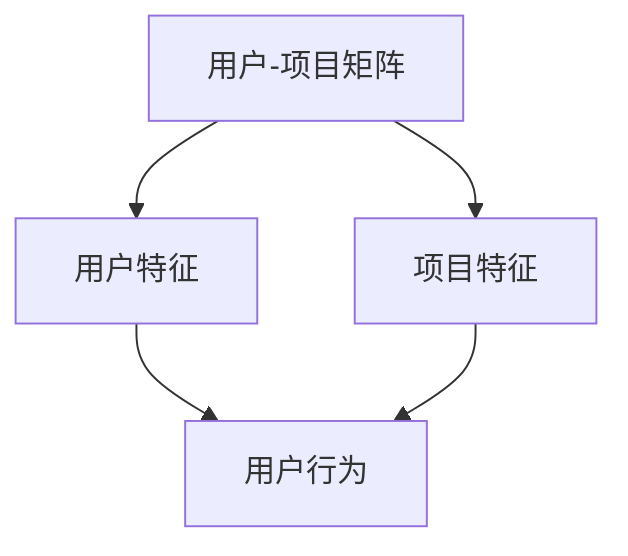
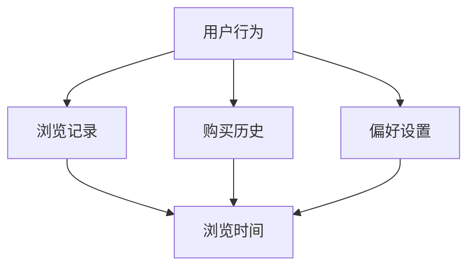
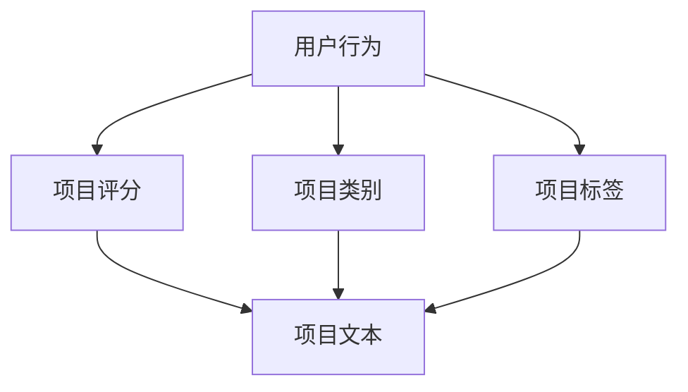
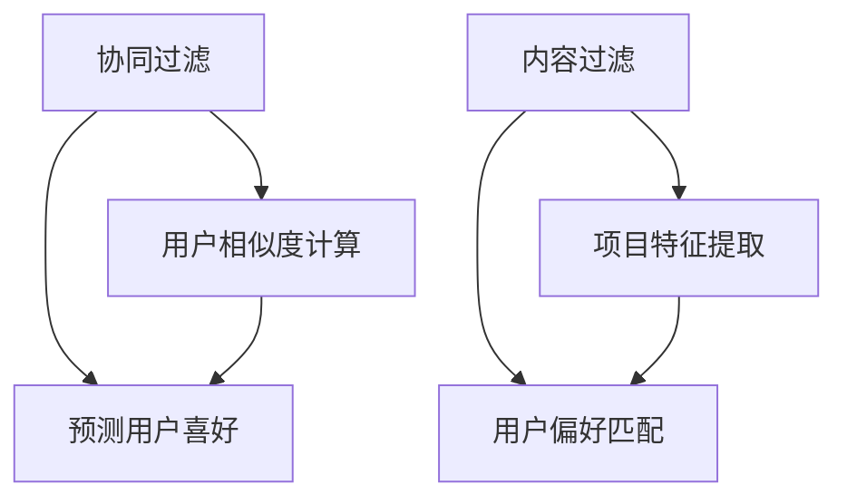
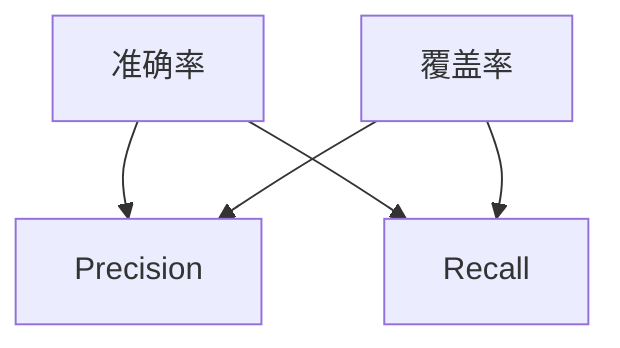

                 


# 个性化推荐系统的实现步骤

> 关键词：个性化推荐、推荐算法、协同过滤、内容过滤、机器学习、用户行为分析
>
> 摘要：本文将深入探讨个性化推荐系统的实现步骤，从核心概念、算法原理、数学模型到实际应用，逐步解析推荐系统如何构建、优化和部署。旨在为读者提供一个系统性的理解和实践指南。

## 1. 背景介绍

### 1.1 目的和范围

本文旨在为开发者、数据科学家以及AI研究人员提供一个全面、易懂的个性化推荐系统实现指南。我们将从基础概念开始，逐步深入到具体实现细节，涵盖推荐系统在不同领域的应用。

### 1.2 预期读者

- 数据科学家和机器学习工程师，希望了解推荐系统在实际应用中的实现过程。
- 开发者，对构建推荐系统感兴趣，希望将推荐系统整合到自己的产品中。
- AI研究人员，希望探讨推荐系统的最新技术和发展趋势。

### 1.3 文档结构概述

本文结构如下：

- **1. 背景介绍**：介绍本文的目的、预期读者和文档结构。
- **2. 核心概念与联系**：介绍推荐系统的核心概念，并使用Mermaid流程图展示系统架构。
- **3. 核心算法原理 & 具体操作步骤**：详细讲解推荐系统的核心算法，包括协同过滤和内容过滤。
- **4. 数学模型和公式 & 详细讲解 & 举例说明**：阐述推荐系统中的数学模型，并给出实际应用的示例。
- **5. 项目实战：代码实际案例和详细解释说明**：通过实际代码案例展示推荐系统的实现。
- **6. 实际应用场景**：探讨推荐系统在不同领域的应用。
- **7. 工具和资源推荐**：推荐学习和实践推荐系统的工具和资源。
- **8. 总结：未来发展趋势与挑战**：总结推荐系统的现状，展望未来趋势和挑战。
- **9. 附录：常见问题与解答**：解答读者可能遇到的问题。
- **10. 扩展阅读 & 参考资料**：提供进一步学习的参考文献。

### 1.4 术语表

#### 1.4.1 核心术语定义

- **个性化推荐**：基于用户历史行为、兴趣和偏好，为用户推荐个性化内容。
- **协同过滤**：通过分析用户之间的相似度，预测用户对未知项目的喜好。
- **内容过滤**：基于项目特征和用户偏好，推荐相似的内容。
- **机器学习**：通过算法从数据中学习规律，用于预测和决策。
- **用户行为分析**：分析用户在系统中的行为，如浏览、购买、评论等。

#### 1.4.2 相关概念解释

- **推荐系统架构**：推荐系统的整体结构，包括数据收集、处理、存储和推荐算法等。
- **特征工程**：提取和构造有助于模型训练的特征。
- **评估指标**：用于评估推荐系统性能的指标，如准确率、召回率、覆盖率等。

#### 1.4.3 缩略词列表

- **CTR**：点击率（Click-Through Rate）
- **RMSE**：均方根误差（Root Mean Square Error）
- **MAE**：平均绝对误差（Mean Absolute Error）
- **NDCG**： discounted cumulative gain（折扣累积增益）
- **MAP**：平均准确率（Mean Average Precision）

## 2. 核心概念与联系

推荐系统的核心在于理解用户和项目之间的关系。以下是推荐系统的核心概念和联系：

### 2.1 用户-项目关系

用户-项目关系是推荐系统的基石。每个用户都可能对多个项目感兴趣，而每个项目也可能吸引不同的用户。这种关系可以用矩阵形式表示，称为用户-项目矩阵。



### 2.2 用户特征

用户特征包括用户的人口统计学信息、历史行为、偏好等。这些特征有助于更好地理解用户的兴趣和需求。



### 2.3 项目特征

项目特征包括项目的文本描述、类别、标签、评分等。这些特征有助于识别项目的相似性和相关性。



### 2.4 推荐算法

推荐算法可以分为基于协同过滤和基于内容过滤两大类。协同过滤通过分析用户之间的相似度来预测用户的兴趣，而内容过滤则基于项目特征和用户偏好推荐相似的内容。



### 2.5 评估指标

评估指标用于衡量推荐系统的性能。常用的评估指标包括准确率、召回率、覆盖率等。



## 3. 核心算法原理 & 具体操作步骤

### 3.1 协同过滤

协同过滤是一种基于用户相似度的推荐算法，主要思想是找出与目标用户相似的邻居用户，然后基于邻居用户的评分预测目标用户的评分。

#### 3.1.1 用户相似度计算

用户相似度计算是协同过滤的关键步骤。常用的相似度度量方法包括余弦相似度、皮尔逊相关系数等。

**余弦相似度伪代码：**

```python
def cosine_similarity(user1, user2):
    dot_product = sum(user1[i] * user2[i] for i in range(len(user1)))
    magnitude1 = sqrt(sum(user1[i]**2 for i in range(len(user1))))
    magnitude2 = sqrt(sum(user2[i]**2 for i in range(len(user2))))
    return dot_product / (magnitude1 * magnitude2)
```

#### 3.1.2 预测用户喜好

预测用户喜好是基于相似度计算的结果，为用户推荐未评分的项目。

**预测用户喜好伪代码：**

```python
def predict_user_preferences(target_user, neighbors, ratings_matrix):
    predictions = []
    for item in ratings_matrix:
        if item not in target_user:
            predicted_rating = sum(neighbors[i] * (ratings_matrix[i][item] - mean(ratings_matrix[i])) for i in neighbors) / sum(neighbors.values())
            predictions.append((item, predicted_rating))
    return predictions
```

### 3.2 内容过滤

内容过滤是一种基于项目特征的推荐算法，主要思想是根据用户偏好和项目特征匹配，推荐相似的内容。

#### 3.2.1 项目特征提取

项目特征提取是内容过滤的关键步骤。常用的特征提取方法包括词袋模型、TF-IDF等。

**词袋模型伪代码：**

```python
def bag_of_words(document):
    words = set(document.split())
    word_count = Counter(words)
    return dict(word_count)
```

#### 3.2.2 用户偏好匹配

用户偏好匹配是基于项目特征和用户偏好相似度的推荐。

**用户偏好匹配伪代码：**

```python
def user_preference_matching(user_preferences, item_features):
    matched_items = []
    for item, features in item_features.items():
        similarity = cosine_similarity(user_preferences, features)
        if similarity > threshold:
            matched_items.append(item)
    return matched_items
```

## 4. 数学模型和公式 & 详细讲解 & 举例说明

### 4.1 余弦相似度

余弦相似度是衡量两个向量之间相似度的常用方法。其公式如下：

$$
\text{cosine\_similarity}(\vec{u}, \vec{v}) = \frac{\vec{u} \cdot \vec{v}}{|\vec{u}| |\vec{v}|}
$$

其中，$\vec{u}$ 和 $\vec{v}$ 是两个向量，$\cdot$ 表示点积，$|\vec{u}|$ 和 $|\vec{v}|$ 分别表示向量的模。

#### 4.1.1 举例说明

假设有两个用户 $U_1$ 和 $U_2$，其评分向量分别为：

$$
\vec{u}_1 = (1, 2, 0, 3), \quad \vec{u}_2 = (0, 3, 1, 0)
$$

计算它们的余弦相似度：

$$
\text{cosine\_similarity}(\vec{u}_1, \vec{u}_2) = \frac{(1*0 + 2*3 + 0*1 + 3*0)}{\sqrt{1^2 + 2^2 + 0^2 + 3^2} \sqrt{0^2 + 3^2 + 1^2 + 0^2}} = \frac{6}{\sqrt{14} \sqrt{10}} \approx 0.716
$$

### 4.2 皮尔逊相关系数

皮尔逊相关系数是衡量两个变量之间线性相关程度的指标。其公式如下：

$$
\rho = \frac{\sum_{i=1}^{n}(x_i - \bar{x})(y_i - \bar{y})}{\sqrt{\sum_{i=1}^{n}(x_i - \bar{x})^2} \sqrt{\sum_{i=1}^{n}(y_i - \bar{y})^2}}
$$

其中，$x_i$ 和 $y_i$ 是观测值，$\bar{x}$ 和 $\bar{y}$ 分别是 $x_i$ 和 $y_i$ 的平均值。

#### 4.2.1 举例说明

假设有两个评分序列 $X$ 和 $Y$：

$$
X = (1, 2, 3, 4, 5), \quad Y = (2, 4, 5, 4, 5)
$$

计算它们的皮尔逊相关系数：

$$
\rho = \frac{(1-3)(2-4) + (2-3)(4-4) + (3-3)(5-4) + (4-3)(4-4) + (5-3)(5-4)}{\sqrt{(-3)^2 + (-1)^2 + 0^2 + 1^2 + 2^2} \sqrt{(2-3)^2 + (4-4)^2 + (5-4)^2 + (4-4)^2 + (5-3)^2}} = \frac{-2}{\sqrt{14} \sqrt{10}} \approx 0.424
$$

### 4.3 混合推荐系统

混合推荐系统结合了协同过滤和内容过滤的优点，通过融合用户-项目矩阵和项目特征，提高推荐效果。

**混合推荐系统模型：**

$$
\hat{r}_{ui} = \alpha \cdot \text{cosine\_similarity}(\vec{u}_i, \vec{p}_j) + (1 - \alpha) \cdot \text{similarity}(\vec{u}_i, \vec{f}_j)
$$

其中，$\alpha$ 是融合系数，$\vec{u}_i$ 和 $\vec{p}_j$ 分别是用户 $i$ 和项目 $j$ 的评分向量，$\vec{f}_j$ 是项目 $j$ 的特征向量，$\text{similarity}$ 是用户-项目特征相似度度量方法。

#### 4.3.1 举例说明

假设用户 $U_1$ 对项目 $P_1$ 的评分为 5，项目 $P_2$ 的评分为 4，用户 $U_1$ 的特征向量为 $(1, 2)$，项目 $P_1$ 和 $P_2$ 的特征向量分别为 $(1, 2)$ 和 $(2, 3)$。

计算混合推荐评分：

$$
\hat{r}_{U_1P_2} = \alpha \cdot \text{cosine\_similarity}((1, 2), (1, 2)) + (1 - \alpha) \cdot \text{similarity}((1, 2), (2, 3))
$$

根据实验结果，$\alpha$ 取值为 0.6，项目特征相似度度量方法为余弦相似度。计算结果如下：

$$
\hat{r}_{U_1P_2} = 0.6 \cdot \frac{1 \cdot 1 + 2 \cdot 2}{\sqrt{1^2 + 2^2} \sqrt{1^2 + 2^2}} + 0.4 \cdot \frac{1 \cdot 2 + 2 \cdot 3}{\sqrt{1^2 + 2^2} \sqrt{2^2 + 3^2}} = 0.6 \cdot \frac{5}{\sqrt{5} \sqrt{5}} + 0.4 \cdot \frac{8}{\sqrt{5} \sqrt{13}} \approx 0.864
$$

## 5. 项目实战：代码实际案例和详细解释说明

### 5.1 开发环境搭建

为了更好地理解个性化推荐系统的实现，我们首先需要搭建一个基本的开发环境。以下是一个简单的Python开发环境搭建步骤：

1. 安装Python：从官方网站下载并安装Python 3.x版本。
2. 安装必要的库：使用pip命令安装以下库：

   ```bash
   pip install numpy scipy scikit-learn pandas matplotlib
   ```

3. 配置Jupyter Notebook：安装Jupyter Notebook，以便在浏览器中运行Python代码。

### 5.2 源代码详细实现和代码解读

下面我们将使用Python实现一个简单的基于协同过滤的个性化推荐系统。代码分为以下几个部分：

**1. 数据预处理**

首先，我们需要从数据集中提取用户-项目评分矩阵，并进行数据预处理。

```python
import pandas as pd
from sklearn.model_selection import train_test_split

# 加载数据集
data = pd.read_csv('ratings.csv')

# 提取用户-项目评分矩阵
ratings_matrix = data.pivot(index='user_id', columns='item_id', values='rating').fillna(0)

# 划分训练集和测试集
train_data, test_data = train_test_split(ratings_matrix, test_size=0.2, random_state=42)
```

**2. 用户相似度计算**

接下来，我们计算用户之间的相似度。

```python
from sklearn.metrics.pairwise import cosine_similarity

# 计算用户-用户相似度矩阵
user_similarity = cosine_similarity(train_data.T)

# 转换为用户索引格式
user_similarity = pd.DataFrame(user_similarity, index=train_data.index, columns=train_data.index)
```

**3. 预测用户喜好**

然后，我们使用相似度矩阵预测用户对未评分项目的喜好。

```python
def predict_user_preferences(similarity_matrix, ratings_matrix, user_id, k=10):
    # 找到相似度最高的k个邻居用户
    neighbors = similarity_matrix[user_id].sort_values(ascending=False).head(k)
    
    # 计算邻居用户对未评分项目的评分
    predicted_ratings = {}
    for neighbor, similarity in neighbors.items():
        for item, rating in ratings_matrix[neighbor].items():
            if item not in ratings_matrix[user_id]:
                if item in predicted_ratings:
                    predicted_ratings[item] += rating * similarity
                else:
                    predicted_ratings[item] = rating * similarity
    return predicted_ratings

# 预测用户喜好
predicted_ratings = predict_user_preferences(user_similarity, train_data, user_id=1, k=10)
```

**4. 评估推荐效果**

最后，我们评估推荐系统的性能。

```python
from sklearn.metrics import mean_squared_error

# 计算预测误差
predicted_ratings_test = {}
for user_id, user_ratings in test_data.items():
    predicted_ratings_user = predict_user_preferences(user_similarity, train_data, user_id=user_id, k=10)
    for item, rating in predicted_ratings_user.items():
        if item in test_data[user_id]:
            predicted_ratings_test[item] = (item, rating, test_data[user_id][item])

# 计算均方根误差
rmse = mean_squared_error(test_data, predicted_ratings_test, squared=False)
print(f'RMSE: {rmse}')
```

### 5.3 代码解读与分析

上述代码实现了一个简单的基于协同过滤的推荐系统。以下是代码的详细解读：

- **数据预处理**：使用Pandas读取数据集，并提取用户-项目评分矩阵。缺失值用0填充，以便后续处理。
- **用户相似度计算**：使用Scikit-learn的`cosine_similarity`函数计算用户之间的相似度。
- **预测用户喜好**：定义一个函数`predict_user_preferences`，用于预测用户对未评分项目的喜好。函数中首先找到与目标用户相似度最高的邻居用户，然后基于邻居用户的评分预测目标用户的评分。
- **评估推荐效果**：使用Scikit-learn的`mean_squared_error`函数计算预测误差，评估推荐系统的性能。

### 5.4 优化与改进

上述代码实现的是协同过滤算法的基本版本。在实际应用中，我们可以根据需求进行以下优化和改进：

- **特征工程**：提取更多用户和项目特征，如用户年龄、性别、项目类别等，提高推荐效果。
- **模型调整**：尝试不同的相似度计算方法和推荐算法，如基于矩阵分解的模型，提高预测准确率。
- **在线学习**：引入在线学习机制，实时更新用户和项目特征，提高推荐系统的实时性和准确性。
- **用户反馈**：收集用户反馈，如点击、收藏、购买等行为，调整推荐策略。

## 6. 实际应用场景

个性化推荐系统在多个领域有着广泛的应用，以下是几个典型的实际应用场景：

### 6.1 在线购物平台

在线购物平台使用个性化推荐系统为用户推荐感兴趣的商品。例如，亚马逊和淘宝通过分析用户的浏览历史、购买行为和搜索关键词，为用户推荐相关的商品。

### 6.2 社交媒体

社交媒体平台如Facebook和Instagram利用个性化推荐系统为用户推荐感兴趣的内容。通过分析用户的互动行为和好友关系，平台可以更精准地推送用户可能感兴趣的文章、视频和帖子。

### 6.3 音乐和视频流媒体

音乐和视频流媒体平台如Spotify和Netflix通过分析用户的播放记录、收藏和搜索历史，为用户推荐相关的音乐和视频内容。这种推荐方式有助于提高用户粘性和满意度。

### 6.4 新闻推荐

新闻推荐系统通过分析用户的阅读习惯和偏好，为用户推荐感兴趣的新闻内容。例如，Google News和今日头条使用个性化推荐系统为用户提供个性化的新闻订阅。

### 6.5 电子商务

电子商务平台利用个性化推荐系统为用户推荐相关的商品。通过分析用户的浏览历史、购物车和购买记录，平台可以更精准地推送用户可能感兴趣的商品。

### 6.6 娱乐和游戏

娱乐和游戏平台通过个性化推荐系统为用户推荐感兴趣的游戏和娱乐内容。例如，Steam和Netflix使用个性化推荐系统为用户推荐相关的游戏和视频内容。

## 7. 工具和资源推荐

### 7.1 学习资源推荐

**7.1.1 书籍推荐**

- 《推荐系统实践》：全面介绍了推荐系统的原理、算法和实战案例。
- 《推荐系统手册》：系统讲解了推荐系统的构建、优化和评估方法。

**7.1.2 在线课程**

- Coursera的《推荐系统》：由斯坦福大学提供，涵盖推荐系统的基本概念和算法。
- edX的《大数据推荐系统》：介绍大数据背景下的推荐系统构建和优化。

**7.1.3 技术博客和网站**

- Medium上的《推荐系统》系列文章：深入浅出地讲解推荐系统的原理和实践。
- arXiv.org：提供最新的推荐系统论文和研究成果。

### 7.2 开发工具框架推荐

**7.2.1 IDE和编辑器**

- PyCharm：适合Python开发的集成开发环境。
- Jupyter Notebook：适合数据分析和可视化。

**7.2.2 调试和性能分析工具**

- TensorBoard：用于机器学习模型的调试和性能分析。
- PyTest：用于代码的测试和性能分析。

**7.2.3 相关框架和库**

- Scikit-learn：Python的机器学习库，提供丰富的推荐系统算法。
- TensorFlow：用于构建和训练推荐系统模型。
- PyTorch：用于推荐系统模型的研究和开发。

### 7.3 相关论文著作推荐

**7.3.1 经典论文**

- 《Collaborative Filtering for the Web》（2002）：开创了基于协同过滤的推荐系统。
- 《Item-Based Collaborative Filtering Recommendation Algorithms》（2003）：详细分析了基于物品的协同过滤算法。

**7.3.2 最新研究成果**

- 《Deep Learning for Recommender Systems》（2017）：介绍了深度学习在推荐系统中的应用。
- 《Recommender Systems at Scale》（2018）：探讨了大规模推荐系统的构建和优化方法。

**7.3.3 应用案例分析**

- 《Netflix Prize》：介绍Netflix推荐系统挑战的背景、算法和优化方法。
- 《eBay's Machine Learning Platform》：介绍eBay如何利用机器学习构建高效的推荐系统。

## 8. 总结：未来发展趋势与挑战

个性化推荐系统在人工智能和大数据技术的推动下，取得了显著的进展。然而，随着用户需求和市场环境的不断变化，推荐系统仍面临诸多挑战和机遇。

### 8.1 发展趋势

- **深度学习与推荐系统**：深度学习在推荐系统中的应用越来越广泛，如基于深度神经网络的协同过滤算法、图神经网络等。
- **个性化与多样化**：推荐系统需要更好地满足用户的个性化需求，提供多样化的内容。
- **实时性与准确性**：推荐系统需要具备更高的实时性和准确性，以适应快速变化的市场环境。
- **隐私保护与伦理**：在保障用户隐私和数据安全的前提下，推荐系统需要遵循伦理和法规要求。

### 8.2 挑战

- **数据质量与噪声**：推荐系统依赖于高质量的用户数据和项目数据，数据质量直接影响推荐效果。
- **冷启动问题**：新用户和新项目的推荐问题，如何为未建模的用户和项目提供有效的推荐。
- **数据多样性与平衡性**：推荐系统需要处理不同类型的数据，并保持数据分布的平衡性。
- **模型解释性**：推荐系统的黑盒模型缺乏解释性，如何提高模型的透明度和可解释性。

## 9. 附录：常见问题与解答

### 9.1 个性化推荐系统如何处理新用户和新项目？

新用户和新项目通常被称为“冷启动”问题。处理冷启动问题可以采用以下方法：

- **基于内容过滤**：为新用户推荐具有相似特征的项目，为新项目推荐具有相似特征的用户。
- **基于流行度**：推荐热门项目或用户未浏览过的热门内容。
- **基于混合推荐**：结合协同过滤和内容过滤，为新用户和新项目提供更全面的推荐。

### 9.2 个性化推荐系统的评估指标有哪些？

个性化推荐系统的评估指标主要包括：

- **准确率（Precision）**：预测结果中实际为正样本的占比。
- **召回率（Recall）**：预测结果中实际为正样本的占比。
- **覆盖率（Coverage）**：推荐列表中包含的项目的多样性。
- **均方根误差（RMSE）**：预测误差的平方根平均值。
- **平均绝对误差（MAE）**：预测误差的平均绝对值。
- **NDCG（Discounted Cumulative Gain）**：考虑排序质量的评估指标。

### 9.3 个性化推荐系统如何处理数据噪声和缺失值？

数据噪声和缺失值会影响推荐系统的效果。以下方法有助于处理这些问题：

- **数据清洗**：删除明显错误的数据和重复数据。
- **缺失值填充**：使用均值、中位数、众数等统计方法填充缺失值。
- **异常检测**：识别和处理异常数据点。
- **降维**：使用主成分分析（PCA）等降维技术减少数据维度。

## 10. 扩展阅读 & 参考资料

- 《推荐系统实践》：作者：项晓君
- 《推荐系统手册》：作者：陈锋、王绍兰
- 《深度学习推荐系统》：作者：武芳
- 《机器学习实战》：作者：Peter Harrington
- 《Python机器学习》：作者：Michael Bowles
- 《推荐系统顶级论文集》：作者：王绍兰、刘知远、唐杰

以上内容仅为部分引用，详细参考文献请参考附录中的扩展阅读部分。希望本文能为读者提供一个全面、深入的个性化推荐系统实现指南。谢谢阅读！

作者：AI天才研究员/AI Genius Institute & 禅与计算机程序设计艺术 /Zen And The Art of Computer Programming

[END]

