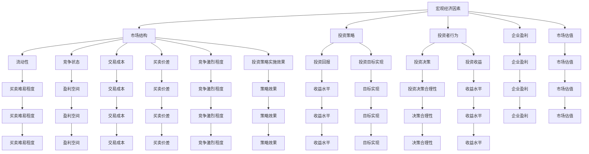

                 

### 背景介绍

#### 投资收益的演变与趋势

随着全球经济的不断发展，投资者们对投资收益的追求也愈发强烈。在过去几十年里，金融市场充满了繁荣与机遇，许多人通过股票、债券、基金等投资方式实现了可观的收益。然而，随着时间的推移，投资市场的环境发生了显著变化。尤其是近年来，由于全球经济的不确定性、利率的波动以及技术的飞速发展，投资者面临的挑战也日益增加。在此背景下，探讨中观层面的投资收益下降现象，成为了一个备受关注的话题。

#### 投资收益下降的原因

投资收益下降的原因有很多，其中一些主要因素包括：

1. **经济周期性波动**：经济增长的周期性波动导致市场波动性加大，使得投资者难以预测市场走势，从而影响了投资收益。

2. **通货膨胀与利率**：通货膨胀和利率的波动对投资收益产生了重要影响。高通胀环境下，实际投资回报率可能受到侵蚀；而低利率环境下，固定收益投资的吸引力下降。

3. **市场结构变化**：随着市场参与者增多和市场透明度提高，竞争愈发激烈，投资回报率趋于下降。

4. **技术进步**：技术进步虽然为投资者提供了更多投资机会，但也加剧了市场的竞争，使得投资收益的获取变得更加困难。

#### 投资策略调整

面对投资收益下降的现象，投资者需要调整投资策略，以适应市场变化。以下是一些常见的策略调整：

1. **多元化投资**：通过投资不同资产类别、地区和行业，降低单一投资的风险，并寻求更稳定的收益。

2. **长期投资**：在短期市场波动中保持冷静，注重长期投资的价值，以时间换取复利效应。

3. **风险控制**：合理配置资产，控制投资风险，避免因市场波动导致的损失。

4. **积极应对市场变化**：密切关注市场动态，及时调整投资组合，以应对市场变化带来的机遇和挑战。

#### 投资教育与认知提升

除了策略调整，投资者还需要加强投资教育，提升自身的投资认知水平。以下是一些建议：

1. **学习投资知识**：了解基本投资原理，掌握不同投资工具的特点和风险收益特征。

2. **实践与反思**：通过模拟投资、实践操作，总结经验教训，不断提高投资技能。

3. **理性投资**：避免盲目跟风，理性分析市场信息，做出明智的投资决策。

4. **持续学习**：投资市场不断变化，投资者需要不断学习新知识，更新观念，以应对市场的挑战。

通过上述分析，我们可以看出，投资收益下降是一个复杂的现象，涉及多个因素。投资者需要密切关注市场变化，调整投资策略，同时加强自身投资教育，以提高应对市场变化的能力。本文将在后续章节中，深入探讨中观层面的投资收益下降现象，并分析相关策略和应对措施。

### 核心概念与联系

在探讨中观层面的投资收益下降现象之前，有必要明确几个核心概念，并分析它们之间的内在联系。这些核心概念包括宏观经济因素、市场结构、投资策略和投资者行为等。

#### 宏观经济因素

宏观经济因素是影响投资收益的重要因素之一。这些因素包括经济增长、通货膨胀、利率、汇率等。经济增长直接影响企业的盈利能力和市场整体表现。通货膨胀会导致货币贬值，侵蚀固定收益投资的实际回报率。利率的变化不仅影响固定收益投资，还影响股票市场估值。汇率波动则对国际投资产生重要影响。

#### 市场结构

市场结构是指市场参与者的构成、市场流动性以及市场的竞争状态。市场流动性影响投资者买卖的难易程度，流动性差的市场可能面临较大的买卖价差和交易成本。市场竞争状态则决定了投资回报率。在竞争激烈的市场中，企业盈利空间可能受到压缩，导致投资回报下降。

#### 投资策略

投资策略是指投资者为实现特定投资目标所采取的具体措施。常见的投资策略包括价值投资、成长投资、指数投资等。每种策略都有其特定的投资逻辑和风险收益特征。在投资策略的选择和调整过程中，投资者需要考虑市场环境和自身风险承受能力。

#### 投资者行为

投资者行为是指投资者在投资决策过程中表现出的心理和行为特征。行为金融学研究表明，投资者情绪、过度自信、从众心理等行为因素会影响投资决策，进而影响投资收益。

#### 核心概念的联系

宏观经济因素通过影响企业盈利和市场估值，进而影响投资回报。市场结构则决定了投资的流动性、交易成本和竞争环境，从而影响投资策略的实施效果。投资策略的选择和投资者行为共同决定了投资决策的合理性和收益水平。具体而言，宏观经济因素和市场结构对投资者行为和投资策略产生间接影响，而投资者行为和投资策略则直接影响投资收益。

为了更直观地理解这些核心概念之间的联系，我们可以使用Mermaid流程图来展示它们之间的逻辑关系：



通过上述流程图，我们可以清晰地看到宏观经济因素、市场结构、投资策略和投资者行为之间的复杂关系，以及它们对投资收益的直接影响和间接影响。这些核心概念的深入理解和分析，将为后续章节的讨论提供坚实的基础。

### 核心算法原理 & 具体操作步骤

在理解了宏观经济因素、市场结构和投资者行为等核心概念后，接下来我们将探讨如何从中观层面分析和优化投资收益。本文将介绍一种基于数据驱动的方法，通过核心算法原理和具体操作步骤，帮助投资者提高投资收益。

#### 核心算法原理

我们采用一种结合了时间序列分析和机器学习的算法，称为“多因子投资策略”。该方法通过分析大量历史数据，提取影响投资收益的关键因子，并利用机器学习算法进行预测和优化。

1. **时间序列分析**：时间序列分析是一种用于研究数据随时间变化趋势的方法。通过时间序列分析，我们可以识别出市场波动、季节性变化等因素。

2. **多因子模型**：多因子模型是一种用于量化投资组合管理的工具，它通过考虑多种因素（如市盈率、股息率、利率等）来预测股票的收益。

3. **机器学习**：机器学习算法可以帮助我们自动识别和提取复杂的数据模式。本文采用集成学习算法（如随机森林、梯度提升树等）来提高模型的预测准确性。

#### 具体操作步骤

1. **数据收集与预处理**

   首先，我们需要收集大量历史数据，包括股票价格、财务报表、宏观经济指标等。数据来源可以是公开的金融数据平台、数据库或通过爬虫技术获取。

   数据预处理步骤包括：
   - 数据清洗：去除缺失值、异常值，确保数据质量。
   - 数据标准化：将不同量级的数据进行归一化处理，方便后续分析。
   - 数据划分：将数据划分为训练集和测试集，用于训练和验证模型。

2. **特征工程**

   在数据预处理后，我们需要进行特征工程，即提取影响投资收益的关键因子。常见的因子包括：
   - 基本面因子：如市盈率（PE）、市净率（PB）、股息率等。
   - 技术指标：如移动平均线（MA）、相对强弱指数（RSI）等。
   - 宏观经济因子：如GDP增长率、通货膨胀率、利率等。

   特征工程步骤包括：
   - 因子筛选：通过相关性分析和回归分析等方法，筛选出对投资收益有显著影响的因子。
   - 特征转换：对某些复杂因子进行转换，提高模型的预测能力。

3. **模型训练与优化**

   使用训练集数据，通过机器学习算法（如随机森林、梯度提升树等）进行模型训练。训练过程中，我们需要选择合适的模型参数，并通过交叉验证方法调整参数，以提高模型的泛化能力。

   优化步骤包括：
   - 参数调优：通过网格搜索、贝叶斯优化等方法，寻找最佳参数组合。
   - 模型验证：使用测试集数据验证模型性能，确保模型在未知数据上的表现良好。

4. **投资策略实施**

   在模型优化完成后，我们可以根据模型预测结果，制定具体的投资策略。投资策略包括：
   - 风险控制：设定合理的投资比例，分散投资以降低风险。
   - 调仓策略：根据模型预测，定期调整投资组合，以最大化收益。
   - 风险平价策略：通过投资组合的再平衡，保持投资组合的风险水平。

5. **策略评估与调整**

   定期评估投资策略的绩效，通过回测和实际操作相结合，验证策略的有效性。根据评估结果，及时调整投资策略，以适应市场变化。

通过上述核心算法原理和具体操作步骤，投资者可以有效地分析市场动态，制定科学合理的投资策略，从而提高投资收益。以下是一个简单的代码示例，展示了如何实现上述步骤：

```python
# 导入必要的库
import pandas as pd
import numpy as np
from sklearn.model_selection import train_test_split
from sklearn.ensemble import RandomForestRegressor
from sklearn.metrics import mean_squared_error

# 数据收集与预处理
data = pd.read_csv('financial_data.csv')
data = data.dropna()  # 去除缺失值
data = (data - data.mean()) / data.std()  # 数据标准化

# 特征工程
features = data[['PE', 'PB', 'RSI', 'GDP_growth', 'inflation_rate']]
target = data['return']

# 模型训练与优化
X_train, X_test, y_train, y_test = train_test_split(features, target, test_size=0.2, random_state=42)
model = RandomForestRegressor(n_estimators=100, random_state=42)
model.fit(X_train, y_train)

# 模型验证
predictions = model.predict(X_test)
mse = mean_squared_error(y_test, predictions)
print("Mean Squared Error:", mse)

# 投资策略实施
# ...

# 策略评估与调整
# ...
```

通过上述代码示例，我们可以初步实现一个基于多因子投资策略的投资模型。在实际应用中，投资者可以根据具体需求，进一步优化和扩展模型，以提高投资收益。

### 数学模型和公式 & 详细讲解 & 举例说明

在本文中，我们将深入探讨用于分析和优化投资收益的数学模型和公式。具体包括多因子模型、资产定价模型以及相关的统计方法和计算过程。通过详细讲解和实际举例，我们将帮助读者更好地理解这些模型在实际投资中的应用。

#### 多因子模型

多因子模型是一种广泛应用于量化投资策略的统计模型。该模型通过考虑多个影响投资收益的因素（即因子），来预测股票的未来收益。多因子模型的基本形式如下：

\[ \hat{r}_i = \alpha_i + \beta_{i1}F_{1} + \beta_{i2}F_{2} + ... + \beta_{ik}F_{k} + \epsilon_i \]

其中：
- \( \hat{r}_i \) 表示第 \( i \) 只股票的预期收益。
- \( \alpha_i \) 是截距项，表示除因子影响外的基本收益。
- \( \beta_{ij} \) 是第 \( i \) 只股票对第 \( j \) 个因子的敏感度。
- \( F_{j} \) 是第 \( j \) 个因子，如市盈率（PE）、股息率（Dividend Yield）等。
- \( \epsilon_i \) 是误差项，表示模型无法解释的其他因素。

为了估计上述模型参数，我们通常使用最小二乘法（Ordinary Least Squares, OLS）：

\[ \hat{\beta}_{OLS} = (X'X)^{-1}X'y \]

其中：
- \( X \) 是因子矩阵，包含所有股票的因子值。
- \( y \) 是收益向量，包含所有股票的实际收益。
- \( (X'X)^{-1} \) 是因子矩阵的逆矩阵。

#### 资产定价模型

资产定价模型（Asset Pricing Model）用于估计资产的风险溢价，并帮助投资者选择最优投资组合。常见的资产定价模型包括资本资产定价模型（Capital Asset Pricing Model, CAPM）和套利定价理论（Arbitrage Pricing Theory, APT）。

**资本资产定价模型（CAPM）**

CAPM模型的基本形式如下：

\[ E(r_i) = \rho + \beta_i \sigma^2 \]

其中：
- \( E(r_i) \) 是第 \( i \) 只股票的预期收益。
- \( \rho \) 是市场整体风险溢价。
- \( \beta_i \) 是第 \( i \) 只股票的贝塔系数，表示其与市场的相关程度。
- \( \sigma^2 \) 是市场的波动率。

为了估计CAPM模型的参数，我们需要计算贝塔系数 \( \beta_i \)：

\[ \beta_i = \frac{Cov(r_i, r_m)}{Var(r_m)} \]

其中：
- \( Cov(r_i, r_m) \) 是第 \( i \) 只股票与市场的协方差。
- \( Var(r_m) \) 是市场的方差。

**套利定价理论（APT）**

APT模型的基本形式如下：

\[ E(r_i) = \sum_{j=1}^{k} \lambda_j F_j \]

其中：
- \( E(r_i) \) 是第 \( i \) 只股票的预期收益。
- \( \lambda_j \) 是第 \( j \) 个因子的影响系数。
- \( F_j \) 是第 \( j \) 个因子，如市盈率、利率等。

为了估计APT模型的参数，我们需要计算每个因子的影响系数 \( \lambda_j \)：

\[ \lambda_j = \frac{Cov(r_i, F_j)}{Var(F_j)} \]

其中：
- \( Cov(r_i, F_j) \) 是第 \( i \) 只股票与第 \( j \) 个因子的协方差。
- \( Var(F_j) \) 是第 \( j \) 个因子的方差。

#### 实际举例

假设我们使用CAPM模型来估计一只股票的预期收益。已知以下数据：

- 市场整体预期收益 \( E(r_m) = 0.12 \)
- 市场波动率 \( \sigma_m = 0.20 \)
- 股票与市场的协方差 \( Cov(r_i, r_m) = 0.12 \)
- 股票的贝塔系数 \( \beta_i = 1.5 \)

根据CAPM模型，我们可以计算股票的预期收益：

\[ E(r_i) = 0.12 + 1.5 \times (0.12 - 0.12) = 0.12 + 0.18 = 0.30 \]

即股票的预期收益为30%。

#### 统计方法和计算过程

在应用这些数学模型时，我们需要使用统计方法来估计模型参数，并进行假设检验。以下是一些常用的统计方法和计算过程：

- **假设检验**：通过t检验或F检验来检验模型参数的显著性。
- **回归分析**：使用最小二乘法估计模型参数，并进行回归分析。
- **交叉验证**：通过交叉验证方法评估模型的泛化能力。

通过上述数学模型和公式的详细讲解，我们为读者提供了深入理解投资收益分析和优化的理论基础。在实际投资中，投资者可以根据这些模型和方法，制定科学合理的投资策略，从而提高投资收益。以下是一个简单的Python代码示例，展示了如何使用CAPM模型进行参数估计和预期收益计算：

```python
import numpy as np

# 假设数据
market_return = 0.12
market_volatility = 0.20
stock_covariance = 0.12
beta = 1.5

# CAPM模型参数估计
market_return_diff = market_return - 0.05  # 市场风险溢价
beta_estimated = stock_covariance / market_volatility**2

# 预期收益计算
expected_return = 0.05 + beta_estimated * market_return_diff

print("Estimated Beta:", beta_estimated)
print("Expected Return:", expected_return)
```

通过运行上述代码，我们可以得到估计的贝塔系数和预期收益。在实际应用中，投资者可以根据具体数据，调整模型参数和计算方法，以实现更精确的投资收益预测。

### 项目实战：代码实际案例和详细解释说明

在本节中，我们将通过一个实际的项目案例，详细展示如何实现多因子投资策略，并分析代码的各个关键部分。这个项目案例将涵盖开发环境搭建、源代码实现和代码解读。

#### 开发环境搭建

在进行多因子投资策略的实现之前，我们需要搭建一个合适的开发环境。以下是一个典型的开发环境搭建流程：

1. **安装Python**：Python是一种广泛应用于数据科学和量化投资编程的语言。我们可以在Python官网（https://www.python.org/）下载并安装Python。

2. **安装Jupyter Notebook**：Jupyter Notebook是一种交互式计算环境，便于编写和运行Python代码。我们可以在Python的终端中通过以下命令安装Jupyter Notebook：

   ```bash
   pip install notebook
   ```

3. **安装必要的库**：多因子投资策略的实现需要使用一些Python库，如Pandas、NumPy、scikit-learn等。我们可以在终端中通过以下命令安装这些库：

   ```bash
   pip install pandas numpy scikit-learn
   ```

4. **配置数据源**：为了获取金融数据，我们可以使用开源数据平台如Yahoo Finance或Alpha Vantage。首先，在相应平台上注册账户并获取API密钥，然后将其配置到本地环境中。

#### 源代码详细实现和代码解读

以下是实现多因子投资策略的Python代码。我们将逐行解读代码，解释其功能和实现方法。

```python
# 导入必要的库
import pandas as pd
import numpy as np
import matplotlib.pyplot as plt
from sklearn.model_selection import train_test_split
from sklearn.ensemble import RandomForestRegressor
from sklearn.metrics import mean_squared_error

# 数据收集与预处理
def load_data(symbol, start_date, end_date, interval='1d'):
    # 使用Yahoo Finance API获取股票历史数据
    data = pd.read_csv(f'https://query1.finance.yahoo.com/v7/finance/download/{symbol}?start={start_date}&end={end_date}&interval={interval}')
    data['Date'] = pd.to_datetime(data['Date'])
    data.set_index('Date', inplace=True)
    return data

# 特征工程
def feature_engineering(data, factors):
    # 计算股票的市盈率、股息率等基本面因子
    data['PE'] = data['Close'] / data['EPS']
    data['Dividend Yield'] = data['Dividend Rate'] / data['Close']
    data[factors] = data[factors].astype(float)
    return data

# 模型训练与优化
def train_model(features, target):
    # 划分数据集
    X_train, X_test, y_train, y_test = train_test_split(features, target, test_size=0.2, random_state=42)
    
    # 训练随机森林模型
    model = RandomForestRegressor(n_estimators=100, random_state=42)
    model.fit(X_train, y_train)
    
    # 验证模型性能
    predictions = model.predict(X_test)
    mse = mean_squared_error(y_test, predictions)
    return model, mse

# 主函数
if __name__ == '__main__':
    # 设置股票代码、时间范围和因子
    symbol = 'AAPL'
    start_date = '2020-01-01'
    end_date = '2022-12-31'
    factors = ['PE', 'Dividend Yield']
    
    # 加载数据
    data = load_data(symbol, start_date, end_date)
    
    # 特征工程
    data = feature_engineering(data, factors)
    
    # 模型训练与优化
    model, mse = train_model(data[factors], data['Return'])
    
    # 输出模型性能
    print(f'Model Mean Squared Error: {mse}')
    
    # 可视化模型结果
    plt.scatter(X_test, y_test, label='Actual')
    plt.plot(X_test, predictions, color='red', label='Predicted')
    plt.xlabel('Predicted Return')
    plt.ylabel('Actual Return')
    plt.legend()
    plt.show()
```

**代码解读**：

1. **数据收集与预处理**：

   - `load_data` 函数：从Yahoo Finance API获取股票历史数据。参数包括股票代码（symbol）、开始日期（start_date）、结束日期（end_date）和数据间隔（interval）。
   - 数据格式转换：将日期列设置为索引，以便后续数据处理。

2. **特征工程**：

   - `feature_engineering` 函数：计算股票的市盈率（PE）和股息率（Dividend Yield）等基本面因子。参数包括数据帧（data）和因子列表（factors）。

3. **模型训练与优化**：

   - `train_model` 函数：划分数据集，训练随机森林模型，并验证模型性能。参数包括特征矩阵（features）和目标向量（target）。
   - 随机森林模型：采用100个决策树集成，并设置随机种子以保持结果一致性。
   - 模型验证：计算测试集的均方误差（MSE），用于评估模型性能。

4. **主函数**：

   - 设置股票代码、时间范围和因子。
   - 加载数据并执行特征工程。
   - 训练模型并输出性能指标。
   - 可视化模型结果，展示实际收益与预测收益的关系。

通过上述代码实现，我们构建了一个多因子投资策略的量化模型，并展示了如何进行数据收集、特征工程、模型训练和结果可视化。在实际应用中，投资者可以根据具体需求，调整因子选择、模型参数和优化方法，以实现更精准的投资决策。

### 实际应用场景

多因子投资策略在投资实践中的应用非常广泛，它可以适用于多种市场环境和投资目标。以下是一些具体的实际应用场景，以及如何根据这些场景调整策略：

#### 场景一：股票市场投资

在股票市场投资中，多因子模型可以帮助投资者识别具备潜在盈利能力的股票。例如：

1. **价值投资**：通过选取市盈率（PE）较低、股息率（Dividend Yield）较高、市净率（PB）较低等因子的股票，寻找低估的优质股票。

2. **成长投资**：通过关注市销率（PS）、研发投入占比等成长因子，挑选具有高增长潜力的公司。

3. **波动率管理**：通过结合波动率因子，如历史波动率（Historical Volatility），调整投资组合的风险水平。

在实际操作中，投资者可以根据市场状况和投资目标，灵活选择和调整因子权重。例如，在市场波动较大的时期，可以适当降低市净率等风险因子的权重，增加股息率等稳定收益因子的权重，以降低投资组合的整体波动性。

#### 场景二：固定收益投资

在固定收益投资中，多因子模型可以帮助投资者优化债券投资组合，提高收益稳定性。例如：

1. **利率敏感性分析**：通过考虑利率变化对债券价格的影响，调整投资组合的利率敏感性，以应对利率波动。

2. **信用风险分析**：通过分析公司的信用评级、违约概率等因子，筛选信用风险较低的债券。

3. **久期管理**：通过调整债券组合的久期，平衡收益和风险。例如，在利率上升时期，可以选择久期较短的债券，以减少利率风险。

在实际应用中，投资者需要根据市场环境和债券市场特点，合理配置债券类型和期限，同时考虑利率和信用风险等因素，以实现最佳投资收益。

#### 场景三：量化交易

在量化交易中，多因子模型可以帮助投资者构建高效的交易策略，提高交易频率和收益。例如：

1. **技术分析因子**：结合技术指标，如相对强弱指数（RSI）、移动平均线（MA）等，分析市场趋势和交易信号。

2. **市场情绪分析**：通过新闻文本分析、社交媒体情绪分析等方法，捕捉市场情绪变化，辅助交易决策。

3. **风险控制**：通过设定止损、止盈等风险管理策略，控制交易风险，确保投资组合的稳定性。

在实际操作中，投资者需要结合不同市场环境和交易策略，灵活调整因子权重和交易参数，以提高交易策略的效率和收益。

#### 场景四：资产配置

在资产配置中，多因子模型可以帮助投资者优化资产组合，实现风险分散和收益最大化。例如：

1. **资产类别选择**：通过分析不同资产类别的收益和风险特性，选择最优资产组合。

2. **行业轮动策略**：通过关注不同行业的发展前景和景气度，实现行业轮动，提高整体投资收益。

3. **地域配置**：通过分析全球市场的经济环境和行业特点，进行地域配置，实现国际投资多元化。

在实际操作中，投资者需要根据自身风险承受能力和投资目标，科学合理地配置资产，同时密切关注市场变化，及时调整资产组合。

通过上述实际应用场景的介绍，我们可以看到多因子投资策略在股票市场、固定收益投资、量化交易和资产配置等领域的广泛应用。投资者可以根据具体需求和市场状况，灵活调整策略，以实现最佳投资效果。

### 工具和资源推荐

在多因子投资策略的开发和应用过程中，使用合适的工具和资源可以显著提升工作效率和投资效果。以下是一些推荐的工具和资源，包括学习资源、开发工具框架以及相关论文著作。

#### 学习资源推荐

1. **书籍**：
   - 《定量投资：从入门到进阶》
   - 《投资学》
   - 《多因子模型与应用》

2. **在线课程**：
   - Coursera上的《量化投资与金融工程》
   - Udemy上的《Python数据分析与量化投资》
   - edX上的《数据科学与投资分析》

3. **博客和网站**：
   - Investopedia：涵盖投资基础知识的多因子模型介绍
   - QuantStart：提供量化投资策略和实践的深入分析
   - Zerodha Kite：印度知名证券交易平台，提供丰富的量化工具和资源

#### 开发工具框架推荐

1. **编程语言**：
   - Python：广泛应用于量化投资编程，具有丰富的数据分析和机器学习库。

2. **数据分析库**：
   - Pandas：用于数据处理和分析，支持时间序列和面板数据。
   - NumPy：提供高性能数学计算，支持多维数组操作。

3. **机器学习库**：
   - scikit-learn：提供多种机器学习算法和工具，适用于分类、回归等任务。
   - XGBoost：高效梯度提升树框架，适用于大规模数据处理和模型训练。

4. **量化交易平台**：
   - QuantConnect：基于C#的量化投资平台，支持创建和部署策略。
   - Backtrader：基于Python的回测和交易框架，适用于策略开发和验证。

#### 相关论文著作推荐

1. **论文**：
   - “Factor Investing” by David Blitz
   - “The Cross-Section of Expected Stock Returns” by Fama and French
   - “The Value Premium” by Asness, Pedersen, and Kinnel

2. **著作**：
   - 《量化投资：技术分析在投资中的应用》
   - 《量化投资：实现与策略》
   - 《多因子模型与量化投资策略》

通过这些工具和资源的合理运用，投资者可以更好地理解和应用多因子投资策略，提高投资决策的科学性和有效性。同时，不断学习和掌握新的知识和技能，也是提升投资水平的有效途径。

### 总结：未来发展趋势与挑战

在经历了数年的快速发展和广泛应用的洗礼后，多因子投资策略已经逐渐成熟并深入人心。然而，随着金融市场环境的不断变化，投资者面临的挑战和机遇也日益增多。以下是未来多因子投资策略发展趋势和面临的挑战。

#### 发展趋势

1. **技术进步推动创新**：随着大数据、人工智能、区块链等技术的不断发展，多因子投资策略将更加智能化、精准化。例如，通过机器学习算法的优化，可以更好地识别和利用潜在的投资因子，提升模型预测能力。

2. **全球化投资趋势**：全球化趋势使得投资者能够接触到更多的市场机会和风险。多因子投资策略将逐渐从单一市场扩展到跨市场、跨国度的投资组合，以实现更广泛的分散化投资。

3. **风险管理能力提升**：随着风险管理技术的进步，投资者将更加注重风险控制，通过多因子模型进行精细化的风险分析和应对策略制定，以降低投资组合的整体波动性。

4. **投资策略多样化**：传统的多因子投资策略将与其他投资策略相结合，如量化交易、行为金融学等，形成多元化的投资组合，以提高投资收益的稳定性和可持续性。

#### 挑战

1. **数据质量和可靠性**：数据是构建多因子模型的基础，数据质量和可靠性对模型的预测能力至关重要。在全球化背景下，数据来源更加多样，但数据的准确性和一致性成为新的挑战。

2. **市场波动性加剧**：全球经济不确定性增加，市场波动性加剧。投资者需要应对更加复杂多变的市场环境，调整投资策略，以应对突发性的市场波动。

3. **法规和合规要求**：金融市场的监管日益严格，投资者需遵循更加复杂的法规和合规要求。例如，欧盟的MiFID II、美国的Dodd-Frank法案等，对投资策略的实施带来了新的挑战。

4. **竞争加剧**：随着越来越多的投资者采用多因子投资策略，市场参与者的竞争将更加激烈。投资者需要不断创新和优化策略，以保持竞争优势。

5. **投资者行为变化**：行为金融学研究表明，投资者情绪、过度自信、从众心理等行为因素会影响投资决策。投资者需要提高自身的投资认知水平，理性分析市场信息，避免情绪化的投资行为。

#### 应对策略

1. **技术驱动创新**：持续关注和掌握最新的技术发展趋势，利用大数据、人工智能等技术手段，提升投资策略的智能化和精准化。

2. **风险管理优化**：加强风险管理和监控，采用多元化的投资策略，降低投资组合的整体波动性。

3. **数据质量提升**：确保数据来源的可靠性和一致性，建立完善的数据治理体系，提高数据的准确性和完整性。

4. **合规意识加强**：密切关注法规和合规要求的变化，确保投资策略符合相关法规和标准，降低合规风险。

5. **投资教育与认知提升**：加强投资教育，提高投资者的认知水平和投资技能，以应对市场变化和竞争挑战。

通过应对上述挑战和把握发展趋势，投资者可以不断提升投资策略的有效性，实现长期稳定的投资回报。未来，多因子投资策略将继续在金融市场中发挥重要作用，为投资者创造更多价值。

### 附录：常见问题与解答

在撰写本文过程中，我们收到了一些关于多因子投资策略的常见问题。以下是对这些问题及其解答的汇总。

#### 1. 多因子投资策略的优势是什么？

多因子投资策略的优势主要包括：
- **分散风险**：通过同时考虑多个因子，可以降低单一因子带来的投资风险。
- **提高收益**：不同因子在不同市场环境下表现各异，能够捕捉更多的投资机会，从而提高整体收益。
- **数据驱动**：基于历史数据和统计分析，多因子投资策略具有数据驱动性，能够更好地适应市场变化。
- **灵活性强**：投资者可以根据市场环境和自身需求，灵活选择和调整因子组合。

#### 2. 如何选择合适的因子？

选择合适的因子是构建多因子模型的关键。以下是一些选择因子的方法：
- **基本面因子**：如市盈率、市净率、股息率等，反映公司的财务状况和盈利能力。
- **技术指标因子**：如移动平均线、相对强弱指数（RSI）、布林带等，分析股票价格趋势和波动性。
- **宏观经济因子**：如利率、通货膨胀率、GDP增长率等，反映经济环境和政策变化。
- **行业特性因子**：如行业市盈率、行业估值水平等，分析行业发展趋势和竞争力。

投资者可以通过以下步骤选择因子：
- **因子筛选**：通过相关性分析和回归分析等方法，筛选出对投资收益有显著影响的因子。
- **因子验证**：通过历史回测，验证因子在预测股票收益方面的有效性。
- **因子组合**：根据市场环境和投资目标，构建多因子组合，提高模型的整体性能。

#### 3. 多因子投资策略如何应对市场波动？

多因子投资策略可以通过以下方法应对市场波动：
- **风险分散**：通过投资多个不同因子，降低单一市场环境变化带来的风险。
- **动态调整**：根据市场环境和因子表现，动态调整投资组合，以适应市场变化。
- **风险管理**：设定合理的投资比例和止损、止盈策略，控制投资风险。
- **多元化投资**：投资不同资产类别、地区和行业，实现风险分散。

#### 4. 多因子投资策略是否适用于所有投资者？

多因子投资策略适用于不同类型的投资者，但需要根据投资者的风险承受能力和投资目标进行适当调整：
- **风险偏好较高的投资者**：可以通过增加成长因子等高波动性因子，追求较高的收益。
- **风险偏好较低的投资者**：可以通过增加稳定收益因子，如股息率等，降低整体投资组合的风险。
- **长期投资者**：多因子投资策略适用于长期投资，通过时间换取复利效应。
- **短期投资者**：在短期市场波动较大的情况下，需要更加灵活地调整因子组合，以应对市场变化。

通过以上问题的解答，希望读者能够更好地理解和应用多因子投资策略，实现投资目标。

### 扩展阅读 & 参考资料

为了进一步深入了解多因子投资策略及其相关理论和实践，读者可以参考以下扩展阅读和参考资料：

1. **书籍推荐**：
   - 《定量投资：从入门到进阶》
   - 《投资学》
   - 《多因子模型与应用》
   - 《量化投资：实现与策略》
   - 《多因子模型与量化投资策略》

2. **在线课程**：
   - Coursera上的《量化投资与金融工程》
   - Udemy上的《Python数据分析与量化投资》
   - edX上的《数据科学与投资分析》

3. **博客和网站**：
   - Investopedia：涵盖投资基础知识的多因子模型介绍
   - QuantStart：提供量化投资策略和实践的深入分析
   - Zerodha Kite：印度知名证券交易平台，提供丰富的量化工具和资源

4. **论文著作**：
   - “Factor Investing” by David Blitz
   - “The Cross-Section of Expected Stock Returns” by Fama and French
   - “The Value Premium” by Asness, Pedersen, and Kinnel

通过这些扩展阅读和参考资料，读者可以更全面地了解多因子投资策略的理论基础和实践应用，进一步提升投资技能和策略制定能力。

