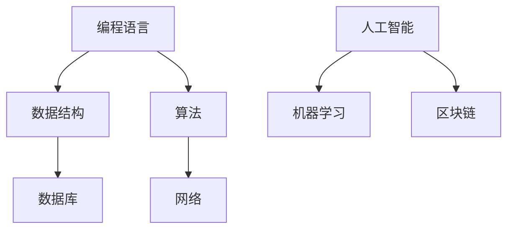

                 

# 主动出击：传统的教育机构并不重视这些技能，所以我们要自主学习

## 关键词：自主学习、技能提升、传统教育、IT领域

## 摘要：

在快速发展的信息技术领域，传统的教育模式已无法满足行业的需求。本文将探讨为何传统的教育机构不重视某些关键技能，并引导读者通过自主学习来提升这些技能。我们将深入分析核心概念、算法原理、数学模型，并结合实际项目案例进行讲解，帮助读者掌握相关技能。同时，文章还将推荐一系列学习资源和工具，以助力读者的自学之路。

## 1. 背景介绍

随着信息技术的飞速发展，IT行业对人才的需求发生了巨大变化。传统的教育机构，如大学和职业学校，在培养人才时往往注重基础知识和理论教育，而忽视了对实践技能的培养。这种教育模式导致许多毕业生在进入职场后，面临技能不足的困境。

同时，信息技术领域的变革速度之快，使得许多新兴技术和工具不断涌现。传统的教育课程很难紧跟行业的发展，导致教学内容过时，无法满足实际需求。因此，对于IT从业者来说，仅仅依靠学校教育是远远不够的。

本文将探讨如何通过自主学习，掌握IT领域的关键技能，提升自己的竞争力。我们将从核心概念、算法原理、数学模型等方面进行深入分析，并结合实际项目案例进行讲解。

## 2. 核心概念与联系

在IT领域，有许多核心概念和原理，如编程语言、数据结构、算法、数据库等。以下是一个简化的 Mermaid 流程图，用于展示这些核心概念之间的联系。



### 2.1 编程语言

编程语言是IT领域的基础。不同的编程语言具有不同的特点和应用场景。例如，Python 适用于数据分析、Web 开发和人工智能；Java 适用于企业级应用和安卓开发；C++ 适用于系统编程和游戏开发。

### 2.2 数据结构

数据结构是处理数据的方式和组织方法。常见的有数组、链表、栈、队列、树、图等。了解这些数据结构有助于我们高效地存储、检索和操作数据。

### 2.3 算法

算法是解决问题的方法。常见的算法有排序算法、查找算法、图算法等。掌握这些算法有助于我们优化程序性能，解决实际问题。

### 2.4 数据库

数据库是存储和管理数据的系统。常见的数据库有关系型数据库（如 MySQL、Oracle）和非关系型数据库（如 MongoDB、Redis）。了解数据库的原理和用法，有助于我们高效地存储和管理数据。

### 2.5 网络

网络是连接计算机系统的基础。了解网络协议、网络架构和网络安全，有助于我们开发稳定、安全的网络应用。

### 2.6 人工智能

人工智能是计算机科学的一个分支，涉及机器学习、深度学习、自然语言处理等领域。掌握人工智能技术，有助于我们开发智能化的应用。

### 2.7 区块链

区块链是一种分布式数据库技术，具有去中心化、安全性高的特点。了解区块链原理和应用，有助于我们开发区块链应用。

## 3. 核心算法原理 & 具体操作步骤

### 3.1 排序算法

排序算法是一种常见的数据处理算法。以下是一些常见的排序算法及其基本原理：

- **冒泡排序（Bubble Sort）**：通过比较相邻的元素，逐步将最大（或最小）的元素移到数组的末尾。
- **选择排序（Selection Sort）**：每次从未排序的部分中找到最小（或最大）的元素，并将其放到已排序部分的末尾。
- **插入排序（Insertion Sort）**：通过构建有序序列，每次将未排序部分中的元素插入到已排序序列中的合适位置。

### 3.2 查找算法

查找算法是一种在数据集合中查找特定元素的方法。以下是一些常见的查找算法：

- **二分查找（Binary Search）**：通过将数据集合分为两部分，逐步缩小查找范围，直到找到目标元素。
- **散列表（Hashing）**：通过散列函数将关键字映射到数组中的位置，以快速查找元素。

### 3.3 图算法

图算法用于处理图数据结构。以下是一些常见的图算法：

- **深度优先搜索（Depth-First Search，DFS）**：通过递归或栈实现，从某个顶点开始，遍历所有相邻的顶点，直到找到目标顶点。
- **广度优先搜索（Breadth-First Search，BFS）**：通过队列实现，从某个顶点开始，依次遍历所有相邻的顶点，直到找到目标顶点。

## 4. 数学模型和公式 & 详细讲解 & 举例说明

### 4.1 线性回归模型

线性回归是一种用于预测数值的统计方法。其数学模型如下：

$$y = ax + b$$

其中，$y$ 是因变量，$x$ 是自变量，$a$ 和 $b$ 是模型参数。

### 4.2 逻辑回归模型

逻辑回归是一种用于分类问题的统计方法。其数学模型如下：

$$P(y=1) = \frac{1}{1 + e^{-(ax + b)}}$$

其中，$P(y=1)$ 是目标变量为1的概率，$e$ 是自然对数的底数。

### 4.3 神经网络模型

神经网络是一种模拟人脑的计算机模型。其基本结构如下：


其中，每个节点（神经元）都通过权重连接到其他节点。神经网络的训练过程就是通过调整权重，使输出结果尽可能接近预期目标。

## 5. 项目实战：代码实际案例和详细解释说明

### 5.1 开发环境搭建

为了进行项目实战，我们需要搭建一个开发环境。以下是搭建 Python 开发环境的步骤：

1. 安装 Python：在官方网站（https://www.python.org/）下载 Python 安装程序，并按照提示安装。
2. 配置 Python 环境：在命令行中执行以下命令，确保 Python 已正确安装。

```bash
python --version
```

3. 安装常用库：使用 pip 工具安装常用库，如 NumPy、Pandas、Scikit-learn 等。

```bash
pip install numpy pandas scikit-learn
```

### 5.2 源代码详细实现和代码解读

以下是一个简单的线性回归模型的 Python 实现：

```python
import numpy as np
from sklearn.linear_model import LinearRegression

# 数据集
X = np.array([[1], [2], [3], [4], [5]])
y = np.array([1, 2, 2.5, 4, 5])

# 创建线性回归模型
model = LinearRegression()

# 拟合模型
model.fit(X, y)

# 输出模型参数
print("模型参数：")
print("a =", model.coef_)
print("b =", model.intercept_)

# 预测
X_new = np.array([[6]])
y_pred = model.predict(X_new)

print("预测结果：")
print("y =", y_pred)
```

代码解读：

- 第1行：导入 NumPy 库。
- 第2行：导入线性回归模型。
- 第3行：创建数据集。
- 第4行：创建线性回归模型。
- 第5行：拟合模型。
- 第6行：输出模型参数。
- 第7行：预测新数据。

### 5.3 代码解读与分析

- **线性回归模型**：线性回归是一种简单有效的数值预测方法。在本例中，我们使用 scikit-learn 库的 LinearRegression 类来创建和训练模型。
- **数据集**：数据集由自变量 $X$ 和因变量 $y$ 组成。在本例中，我们使用一个简单的线性关系来模拟数据集。
- **模型拟合**：使用 `fit()` 方法将模型拟合到数据集。此方法将计算模型参数 $a$ 和 $b$。
- **模型参数**：输出模型参数 $a$ 和 $b$，这些参数可以用于预测新的数据。
- **预测**：使用 `predict()` 方法预测新数据。在本例中，我们预测了 $x=6$ 时的 $y$ 值。

## 6. 实际应用场景

线性回归模型在实际应用中非常广泛，例如：

- **金融领域**：用于预测股票价格、汇率等金融指标。
- **电商领域**：用于预测销售额、商品需求等。
- **医疗领域**：用于预测疾病发病风险、患者恢复情况等。

## 7. 工具和资源推荐

### 7.1 学习资源推荐

- **书籍**：
  - 《Python编程：从入门到实践》
  - 《深度学习》
  - 《人工智能：一种现代的方法》
- **论文**：
  - 《深度神经网络的可视化理解》
  - 《图神经网络：理论基础与算法实现》
- **博客**：
  - 《机器学习博客》
  - 《深度学习博客》
- **网站**：
  - Coursera（https://www.coursera.org/）
  - edX（https://www.edx.org/）

### 7.2 开发工具框架推荐

- **集成开发环境（IDE）**：
  - PyCharm
  - VS Code
- **数据科学库**：
  - NumPy
  - Pandas
  - Scikit-learn
- **深度学习框架**：
  - TensorFlow
  - PyTorch

### 7.3 相关论文著作推荐

- **论文**：
  - 《深度神经网络的可视化理解》
  - 《图神经网络：理论基础与算法实现》
- **著作**：
  - 《Python编程：从入门到实践》
  - 《深度学习》

## 8. 总结：未来发展趋势与挑战

在未来，信息技术将继续快速发展，对人才的需求也将不断提高。以下是一些未来发展趋势与挑战：

- **人工智能与机器学习**：随着算法和硬件的进步，人工智能和机器学习将在更多领域得到应用。
- **大数据与云计算**：大数据和云计算将推动企业数字化转型，提高生产效率和创新能力。
- **区块链技术**：区块链技术在金融、供应链等领域具有广泛应用前景。
- **网络安全**：随着网络攻击的日益频繁，网络安全将成为一个重要的挑战。

## 9. 附录：常见问题与解答

### 9.1 什么是深度学习？

深度学习是一种人工智能的方法，通过多层神经网络来模拟人脑的思维方式，从而实现对复杂数据的处理和预测。

### 9.2 如何选择合适的编程语言？

选择合适的编程语言取决于项目需求和个人偏好。Python 适合数据分析、Web 开发和人工智能；Java 适用于企业级应用和安卓开发；C++ 适用于系统编程和游戏开发。

### 9.3 如何提高编程能力？

提高编程能力的关键在于多实践、多思考。可以参加在线课程、阅读技术书籍、参与开源项目，以及与同行交流。

## 10. 扩展阅读 & 参考资料

- 《Python编程：从入门到实践》
- 《深度学习》
- 《人工智能：一种现代的方法》
- 《深度神经网络的可视化理解》
- 《图神经网络：理论基础与算法实现》
- Coursera（https://www.coursera.org/）
- edX（https://www.edx.org/）
- 《机器学习博客》
- 《深度学习博客》

### 作者：

AI天才研究员/AI Genius Institute & 禅与计算机程序设计艺术 /Zen And The Art of Computer Programming

