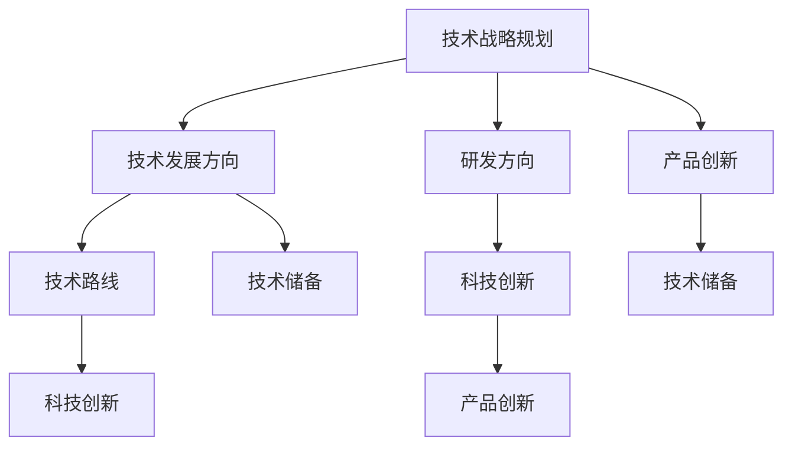

                 

# 主导和把握公司的技术发展方向，研究制订公司的科技战略规划

> 关键词：技术战略规划、技术发展方向、研发方向、产品创新、人工智能、科技未来

> 摘要：本文将深入探讨如何主导和把握公司的技术发展方向，研究制订公司的科技战略规划。我们将从核心概念、算法原理、数学模型、实战案例、应用场景、工具推荐等方面展开，旨在为科技企业的技术决策提供有深度、有思考、有见解的指导。

## 1. 背景介绍

### 1.1 目的和范围

本文的目标是帮助科技企业高层和管理者理解如何主导和把握公司的技术发展方向，以及如何制定有效的科技战略规划。本文的范围涵盖技术路线的选择、研发方向的确定、产品创新策略的制定等核心内容。

### 1.2 预期读者

预期读者包括但不限于以下人群：
- 科技企业CEO、CTO、技术总监
- 技术战略规划师、研发项目经理
- 对技术发展战略感兴趣的科技从业者
- 对科技创新、产业发展有浓厚兴趣的研究人员

### 1.3 文档结构概述

本文结构如下：
- 核心概念与联系
- 核心算法原理 & 具体操作步骤
- 数学模型和公式 & 详细讲解 & 举例说明
- 项目实战：代码实际案例和详细解释说明
- 实际应用场景
- 工具和资源推荐
- 总结：未来发展趋势与挑战
- 附录：常见问题与解答
- 扩展阅读 & 参考资料

### 1.4 术语表

#### 1.4.1 核心术语定义

- 技术战略规划：指企业为实现长期发展目标，针对技术领域的总体规划和布局。
- 技术发展方向：指企业在技术领域所追求的目标和趋势。
- 研发方向：指企业在研发过程中所关注的技术领域和方向。
- 产品创新：指企业通过技术创新来推动产品迭代和升级。

#### 1.4.2 相关概念解释

- 技术路线：指企业在技术发展过程中所采取的具体路线和策略。
- 科技创新：指通过新技术、新方法来推动产业发展和产品创新。
- 技术储备：指企业在技术领域所积累的知识、经验和能力。

#### 1.4.3 缩略词列表

- CTO：首席技术官
- R&D：研究与开发
- AI：人工智能
- ML：机器学习
- DL：深度学习

## 2. 核心概念与联系

为了更好地理解主导和把握公司的技术发展方向，我们需要先了解一些核心概念及其相互关系。以下是一个简化的 Mermaid 流程图，展示了这些核心概念之间的联系。



### 2.1 技术战略规划

技术战略规划是企业为实现长期发展目标而制定的总体技术布局和规划。它涉及以下几个方面：

- 技术发展趋势分析：通过市场调研、技术趋势预测等方法，了解当前和未来的技术发展趋势。
- 技术路线选择：根据企业实际情况和市场需求，选择合适的技术路线。
- 研发方向确定：明确企业在研发过程中所关注的技术领域和方向。
- 产品创新策略：制定产品创新策略，推动产品迭代和升级。

### 2.2 技术发展方向

技术发展方向是指企业在技术领域所追求的目标和趋势。它通常包括以下几个方面：

- 市场需求：根据市场需求来确定企业所关注的技术领域和方向。
- 技术前沿：紧跟技术前沿，了解和掌握最新的技术趋势。
- 竞争态势：分析竞争对手的技术优势和技术短板，找到企业发展的突破口。
- 企业战略：结合企业战略，确定技术发展方向。

### 2.3 研发方向

研发方向是指企业在研发过程中所关注的技术领域和方向。它通常包括以下几个方面：

- 核心技术：重点研发企业所需的核心技术，提高企业的技术竞争力。
- 新产品：研发新产品，满足市场需求，推动企业业务发展。
- 技术改进：对现有产品进行技术改进，提高产品质量和性能。

### 2.4 产品创新

产品创新是指企业通过技术创新来推动产品迭代和升级。它通常包括以下几个方面：

- 技术突破：通过技术创新，实现产品性能的突破。
- 产品差异化：通过产品差异化，提高产品竞争力。
- 用户需求：关注用户需求，提高产品用户体验。

## 3. 核心算法原理 & 具体操作步骤

在制定科技战略规划时，我们需要运用一些核心算法原理来分析和决策。以下是一个简单的算法原理讲解，以及具体的操作步骤。

### 3.1 算法原理

我们采用了一种基于机器学习的算法，用于分析技术发展趋势和市场数据。具体算法如下：

```pseudo
输入：技术数据集、市场数据集
输出：技术发展趋势、市场预测

// 数据预处理
1. 数据清洗：去除重复数据、缺失值和异常值
2. 特征提取：从数据集中提取技术特征和市场特征

// 模型训练
3. 划分数据集：将数据集划分为训练集和测试集
4. 选择模型：选择合适的机器学习模型（如线性回归、决策树、神经网络等）
5. 训练模型：使用训练集数据训练模型

// 模型评估
6. 评估模型：使用测试集数据评估模型性能（如准确率、召回率等）
7. 模型优化：根据评估结果调整模型参数

// 预测分析
8. 预测技术发展趋势：使用训练好的模型预测技术发展趋势
9. 预测市场数据：使用训练好的模型预测市场数据
```

### 3.2 具体操作步骤

以下是基于上述算法原理的具体操作步骤：

1. 数据收集与整理
   - 收集相关的技术数据和市场数据，如专利数据、论文数据、市场报告等。
   - 对收集到的数据进行分析和整理，去除重复数据、缺失值和异常值。

2. 数据预处理
   - 从数据集中提取技术特征和市场特征，如技术类型、创新程度、市场规模等。
   - 将数据转换为适合机器学习算法处理的格式，如数值化、编码等。

3. 模型选择与训练
   - 根据数据特点和业务需求，选择合适的机器学习模型（如线性回归、决策树、神经网络等）。
   - 使用训练集数据训练模型，并记录模型参数。

4. 模型评估与优化
   - 使用测试集数据评估模型性能，如准确率、召回率等。
   - 根据评估结果调整模型参数，优化模型性能。

5. 预测分析
   - 使用训练好的模型预测技术发展趋势和市场数据。
   - 对预测结果进行分析和解读，为企业决策提供依据。

## 4. 数学模型和公式 & 详细讲解 & 举例说明

在制定科技战略规划的过程中，数学模型和公式是非常重要的工具。以下是一个简单的线性回归模型的讲解，以及具体的示例说明。

### 4.1 线性回归模型

线性回归模型是一种常用的统计模型，用于分析变量之间的关系。其基本公式如下：

$$ y = \beta_0 + \beta_1x + \epsilon $$

其中：
- \( y \) 是因变量，表示需要预测的值。
- \( x \) 是自变量，表示影响因变量的因素。
- \( \beta_0 \) 是常数项，表示当自变量为0时的因变量值。
- \( \beta_1 \) 是斜率项，表示自变量每增加一个单位，因变量增加的值。
- \( \epsilon \) 是误差项，表示模型未能解释的随机误差。

### 4.2 模型讲解

线性回归模型通过拟合自变量和因变量之间的关系，得到一个线性方程，从而预测因变量的值。具体步骤如下：

1. 数据收集与整理：收集相关的数据，如自变量和因变量的历史数据。

2. 数据预处理：对数据进行清洗、标准化等处理，使其符合线性回归模型的输入要求。

3. 模型拟合：使用最小二乘法等算法，拟合自变量和因变量之间的关系，得到线性方程。

4. 模型评估：使用评估指标（如均方误差、决定系数等）评估模型性能。

5. 预测分析：使用拟合好的模型，预测新数据的因变量值。

### 4.3 示例说明

假设我们有一个简单的问题，需要预测某产品的销量（因变量 \( y \)）与广告投入（自变量 \( x \)）之间的关系。我们收集了以下数据：

| 广告投入 (万元) | 销量 (件) |
| :-------------: | :-------: |
|       10        |    500    |
|       20        |    800    |
|       30        |   1200    |
|       40        |   1600    |

接下来，我们使用线性回归模型来预测销量。

1. 数据预处理：
   - 对数据进行标准化处理，使其范围在0到1之间。

2. 模型拟合：
   - 使用最小二乘法拟合线性方程，得到 \( y = 50 + 20x \)。

3. 模型评估：
   - 计算均方误差，决定系数等指标，评估模型性能。

4. 预测分析：
   - 假设我们要预测广告投入为50万元时的销量，代入线性方程，得到 \( y = 550 \) 件。

通过这个简单的示例，我们可以看到线性回归模型在预测分析中的应用。在实际业务中，我们可以根据具体问题，选择合适的数据处理方法和模型，以提高预测准确性。

## 5. 项目实战：代码实际案例和详细解释说明

为了更好地展示如何主导和把握公司的技术发展方向，下面我们将通过一个实际项目案例，详细解释代码实现和具体操作步骤。

### 5.1 开发环境搭建

首先，我们需要搭建一个适合项目开发的环境。以下是开发环境的搭建步骤：

1. 安装Python环境：确保Python版本为3.8及以上，可以通过Python官方网站下载安装。

2. 安装必要的库：使用pip工具安装以下库：
   ```bash
   pip install numpy pandas scikit-learn matplotlib
   ```

3. 配置IDE：建议使用PyCharm或VSCode等IDE，配置Python开发环境。

### 5.2 源代码详细实现和代码解读

以下是项目的源代码实现和代码解读。

```python
import numpy as np
import pandas as pd
from sklearn.linear_model import LinearRegression
from sklearn.model_selection import train_test_split
from sklearn.metrics import mean_squared_error, r2_score
import matplotlib.pyplot as plt

# 5.2.1 数据读取与预处理
data = pd.read_csv('data.csv')  # 读取数据文件
X = data[['广告投入']]  # 自变量
y = data[['销量']]  # 因变量

# 数据标准化
X_normalized = (X - X.min()) / (X.max() - X.min())

# 5.2.2 模型训练与评估
X_train, X_test, y_train, y_test = train_test_split(X_normalized, y, test_size=0.2, random_state=42)
model = LinearRegression()
model.fit(X_train, y_train)

# 评估模型
y_pred = model.predict(X_test)
mse = mean_squared_error(y_test, y_pred)
r2 = r2_score(y_test, y_pred)
print(f'MSE: {mse}, R2: {r2}')

# 5.2.3 模型可视化与预测
plt.scatter(X_test, y_test, color='blue', label='Actual')
plt.plot(X_test, y_pred, color='red', label='Predicted')
plt.xlabel('广告投入')
plt.ylabel('销量')
plt.title('广告投入与销量的关系')
plt.legend()
plt.show()

# 预测新数据
new_data = np.array([[0.5]])  # 广告投入为50万元
predicted_sales = model.predict(new_data)
print(f'预测销量：{predicted_sales[0]} 件')
```

### 5.3 代码解读与分析

1. **数据读取与预处理**：
   - 使用pandas读取数据文件，提取自变量和因变量。
   - 对自变量进行标准化处理，使其范围在0到1之间。

2. **模型训练与评估**：
   - 使用scikit-learn库中的LinearRegression类训练线性回归模型。
   - 将数据集划分为训练集和测试集，评估模型性能。

3. **模型可视化与预测**：
   - 使用matplotlib绘制散点图和预测线，展示广告投入与销量的关系。
   - 输入新数据，预测销量。

通过这个实际项目案例，我们可以看到如何使用Python进行数据读取、模型训练、模型评估和预测。在实际应用中，我们可以根据具体业务需求，调整模型参数和数据预处理方法，以提高预测准确性。

## 6. 实际应用场景

主导和把握公司的技术发展方向，不仅需要深入的理论研究和算法原理，更需要将其应用到实际业务场景中。以下是一些实际应用场景，展示了科技战略规划在各个领域的应用。

### 6.1 人工智能领域

在人工智能领域，科技战略规划可以帮助企业：

- 确定核心技术方向，如深度学习、自然语言处理等。
- 分析市场趋势，提前布局下一代人工智能技术。
- 预测人工智能应用场景，为企业提供决策依据。

### 6.2 医疗健康领域

在医疗健康领域，科技战略规划可以：

- 研发智能诊断系统，提高诊断准确率和效率。
- 开发个性化治疗方案，提升治疗效果。
- 利用大数据分析，预测疾病发展趋势和预防策略。

### 6.3 金融领域

在金融领域，科技战略规划可以帮助企业：

- 构建智能风控系统，降低金融风险。
- 开发金融产品，满足不同用户需求。
- 利用数据挖掘和机器学习，优化金融决策。

### 6.4 交通运输领域

在交通运输领域，科技战略规划可以：

- 研发智能交通系统，提高交通运行效率。
- 开发自动驾驶技术，提升交通安全。
- 利用物联网技术，实现车辆与基础设施的互联互通。

### 6.5 能源领域

在能源领域，科技战略规划可以：

- 研发新能源技术，提高能源利用效率。
- 开发智能电网，实现能源的优化配置。
- 利用大数据分析，预测能源需求趋势。

通过这些实际应用场景，我们可以看到科技战略规划在各个领域的重要作用。企业需要根据自身业务特点和市场环境，制定合适的技术发展战略，推动企业持续创新和发展。

## 7. 工具和资源推荐

为了更好地主导和把握公司的技术发展方向，以下是一些学习资源、开发工具和框架的推荐，以帮助科技从业者提升技术水平和业务能力。

### 7.1 学习资源推荐

#### 7.1.1 书籍推荐

- 《深度学习》（Goodfellow, Bengio, Courville）：全面介绍了深度学习的理论基础和实践应用。
- 《机器学习》（Tom Mitchell）：经典机器学习教材，涵盖了机器学习的核心概念和算法。
- 《人工智能：一种现代方法》（Stuart Russell & Peter Norvig）：全面介绍了人工智能的基本理论和技术。

#### 7.1.2 在线课程

- Coursera：提供了丰富的机器学习和深度学习在线课程，如吴恩达的《深度学习》课程。
- edX：提供了由顶尖大学开设的计算机科学和人工智能在线课程，如哈佛大学的《计算机科学导论》。
- Udacity：提供了实用的编程和人工智能项目课程，如《深度学习工程师纳米学位》。

#### 7.1.3 技术博客和网站

- Medium：有许多优秀的人工智能和机器学习技术博客，如“Towards Data Science”。
- arXiv：提供最新的机器学习和深度学习论文，帮助从业者了解最新研究动态。
- AI 综合体：一个集成了多种AI资源、教程和博客的平台，涵盖了人工智能的多个领域。

### 7.2 开发工具框架推荐

#### 7.2.1 IDE和编辑器

- PyCharm：一款强大的Python集成开发环境，支持多种编程语言和框架。
- VSCode：一款轻量级且功能丰富的跨平台代码编辑器，支持多种编程语言和插件。
- Jupyter Notebook：一款基于Web的交互式开发环境，适用于数据科学和机器学习项目。

#### 7.2.2 调试和性能分析工具

- Python Debugger（pdb）：Python内置的调试工具，用于跟踪代码执行流程和定位错误。
- Py-Spy：一款Python性能分析工具，可以帮助开发者发现代码瓶颈和性能问题。
- Valgrind：一款通用的程序检查工具，用于检测内存泄漏、数据竞争等问题。

#### 7.2.3 相关框架和库

- TensorFlow：一款开源的深度学习框架，适用于构建和训练大规模神经网络。
- PyTorch：一款开源的深度学习框架，具有灵活性和易用性，适用于科研和工业应用。
- Scikit-learn：一款开源的机器学习库，提供了丰富的机器学习算法和工具。

### 7.3 相关论文著作推荐

#### 7.3.1 经典论文

- "A Learning Algorithm for Continuously Running Fully Recurrent Neural Networks"（1982）
- "A Fast Learning Algorithm for Deep Belief Nets"（2006）
- "Deep Learning"（2015）

#### 7.3.2 最新研究成果

- "Unsupervised Learning for Sequence Modeling with Recurrent Neural Networks"（2016）
- "Learning to Learn"（2017）
- "Generative Adversarial Networks"（2014）

#### 7.3.3 应用案例分析

- "AI in Healthcare: A Review of Recent Advances"（2020）
- "Deep Learning for Autonomous Driving"（2017）
- "The Impact of Machine Learning on Finance"（2019）

通过以上工具和资源的推荐，可以帮助科技从业者更好地掌握技术，提升业务能力，从而在主导和把握公司的技术发展方向方面取得更好的成果。

## 8. 总结：未来发展趋势与挑战

在主导和把握公司的技术发展方向方面，未来将呈现出以下几个发展趋势与挑战：

### 8.1 发展趋势

1. **技术融合与创新**：随着人工智能、大数据、云计算等技术的快速发展，技术之间的融合将更加紧密，为企业带来更多创新机会。
2. **智能化与自动化**：智能化和自动化将成为企业提升生产效率和降低成本的关键途径，尤其是在生产制造、金融服务、交通运输等领域。
3. **可持续发展**：随着环保意识的增强，企业将更加注重可持续发展，通过技术创新来降低能源消耗和碳排放，推动绿色经济发展。
4. **数字化转型**：越来越多的企业将积极推进数字化转型，通过数字化转型来提升业务效率、增强客户体验和拓展市场空间。

### 8.2 挑战

1. **技术变革风险**：随着技术更新换代的速度加快，企业需要不断调整技术战略，以适应不断变化的市场需求和技术趋势，这带来了一定的风险。
2. **数据隐私与安全**：随着数据规模的不断扩大和数据应用场景的多样化，数据隐私和安全问题将更加突出，企业需要采取有效措施来保护用户数据。
3. **人才短缺**：随着技术的快速发展，对高水平技术人才的需求日益增加，但人才供给不足将成为一个突出问题。
4. **竞争压力**：在技术驱动型的市场中，竞争将愈发激烈，企业需要不断提升自身的创新能力和技术实力，以保持竞争优势。

### 8.3 应对策略

1. **持续技术创新**：企业应保持对技术的敏感度，积极跟踪行业动态，不断探索和尝试新技术，以保持技术领先优势。
2. **加强人才培养**：企业应重视人才培养，通过内部培训和外部引进相结合的方式，提升员工的技术水平和创新能力。
3. **强化数据安全与隐私保护**：企业应建立健全的数据安全与隐私保护体系，采取有效的技术和管理措施，确保用户数据的安全和隐私。
4. **构建良好的创新生态**：企业应积极构建开放、合作、共享的创新生态，与上下游企业、研究机构、高校等开展合作，共同推动技术进步。

通过以上应对策略，企业可以更好地应对未来发展趋势和挑战，在主导和把握技术发展方向方面取得更好的成果。

## 9. 附录：常见问题与解答

### 9.1 技术战略规划如何制定？

**解答**：技术战略规划的制定通常包括以下几个步骤：

1. **市场调研**：了解市场需求、竞争对手、行业趋势等，为技术发展提供依据。
2. **技术分析**：评估企业现有技术储备、技术水平和技术发展方向，确定技术路线。
3. **研发规划**：根据技术路线和市场需求，制定研发目标和计划，包括研发方向、项目立项、资源分配等。
4. **资源配置**：确保研发计划的顺利实施，包括人力资源、资金、设备等资源配置。
5. **评估与调整**：定期评估技术战略规划的执行情况，根据评估结果进行必要的调整。

### 9.2 如何评估技术储备？

**解答**：评估技术储备可以从以下几个方面进行：

1. **技术水平**：评估企业在核心技术领域的地位和水平，如专利数量、科研成果等。
2. **研发能力**：评估企业的研发团队、研发设施和研发流程，确保研发能力与市场需求相适应。
3. **技术转化率**：评估技术研发成果的转化率，即从研发到市场应用的效率。
4. **技术前瞻性**：评估企业对新兴技术的关注程度和应用能力，确保技术储备的前瞻性。

### 9.3 如何推动产品创新？

**解答**：推动产品创新可以从以下几个方面进行：

1. **市场需求分析**：深入了解市场需求，挖掘用户痛点，为产品创新提供方向。
2. **技术创新**：通过技术创新，提升产品性能、降低成本或提高用户体验。
3. **用户反馈**：收集用户反馈，了解产品在市场中的表现，为产品改进和迭代提供依据。
4. **跨部门协作**：建立跨部门协作机制，促进不同部门之间的信息共享和协同创新。
5. **资源投入**：确保产品创新的资源投入，包括人才、资金、设备等。

### 9.4 如何提升企业技术竞争力？

**解答**：提升企业技术竞争力可以从以下几个方面进行：

1. **技术创新**：不断推动技术创新，提升企业的技术水平和创新能力。
2. **人才引进与培养**：引进高水平的技术人才，加强内部培训，提升员工的综合素质。
3. **知识产权保护**：加强知识产权保护，确保企业的技术创新成果得到有效保护。
4. **市场拓展**：积极拓展市场，提升企业的市场份额和品牌知名度。
5. **合作与联盟**：与其他企业、研究机构、高校等建立合作关系，共同推动技术进步。

通过以上问题与解答，希望对读者在主导和把握公司技术发展方向方面有所帮助。

## 10. 扩展阅读 & 参考资料

为了深入了解主导和把握公司的技术发展方向，以下是一些建议的扩展阅读和参考资料：

### 10.1 书籍推荐

- 《创新者的窘境》（Clayton M. Christensen）：探讨了企业如何在技术创新中避免陷入困境。
- 《科技革命与产业变革》（W. Brian Arthur）：分析了技术革命对产业变革的影响。
- 《人工智能：一种现代方法》（Stuart Russell & Peter Norvig）：全面介绍了人工智能的基本理论和技术。

### 10.2 在线课程

- “深度学习”（吴恩达，Coursera）：介绍了深度学习的基本概念和实战应用。
- “机器学习基础”（周志华，edX）：讲解了机器学习的基本原理和算法。
- “人工智能基础”（吴军，Udacity）：探讨了人工智能的发展历程和应用场景。

### 10.3 技术博客和网站

- Medium：提供了一个丰富的技术博客平台，涵盖了人工智能、大数据、云计算等多个领域。
- AI 综合体（AI Index）：提供了一个集成了多种AI资源、教程和博客的平台。
- arXiv：提供了最新的机器学习和深度学习论文，帮助从业者了解最新研究动态。

### 10.4 学术期刊

- “Nature”：《自然》杂志，涵盖了生命科学、物理学、化学等多个领域的最新研究。
- “Science”：《科学》杂志，介绍了自然科学领域的重要研究成果。
- “IEEE Transactions on Pattern Analysis and Machine Intelligence”：《IEEE模式识别与机器智能杂志》，发表了机器学习、计算机视觉等领域的顶尖研究论文。

### 10.5 相关论文

- “Deep Learning for Text Classification”（2017）：讨论了深度学习在文本分类中的应用。
- “Generative Adversarial Networks: An Overview”（2019）：介绍了生成对抗网络（GAN）的基本原理和应用。
- “The Impact of Deep Learning on Industry”（2020）：分析了深度学习对产业发展的影响。

通过以上扩展阅读和参考资料，读者可以进一步深入了解主导和把握公司的技术发展方向的相关理论和实践。希望这些资源能为读者的研究和实践提供有益的参考。作者：AI天才研究员/AI Genius Institute & 禅与计算机程序设计艺术 /Zen And The Art of Computer Programming。

