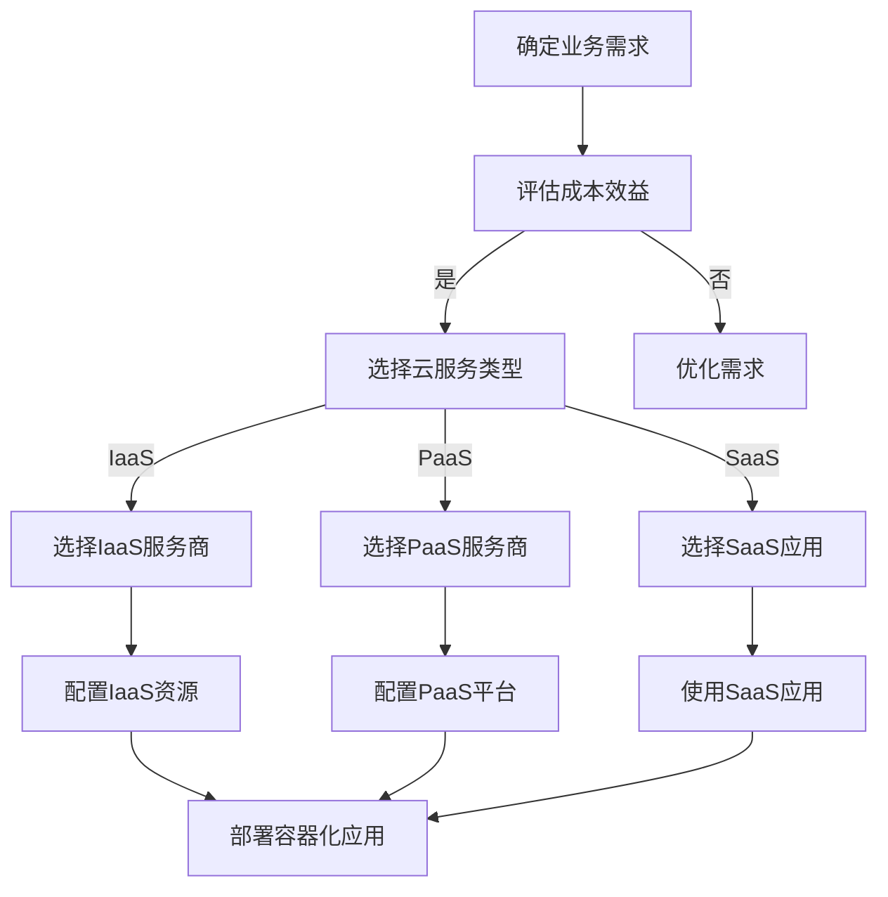

                 

# 云服务选择：创业公司的技术基础设施

> **关键词：** 云服务，创业公司，技术基础设施，成本效益，灵活性，可扩展性，安全性

> **摘要：** 本文旨在探讨创业公司在选择云服务时所需考虑的关键因素，包括成本效益、灵活性、可扩展性、安全性以及技术架构的设计原则。我们将通过一步一步的推理思考，详细分析不同云服务类型及其适用场景，为创业公司提供科学、全面的技术基础设施构建指南。

## 1. 背景介绍

### 1.1 目的和范围

本文的目标是为创业公司在选择云服务时提供决策指导，帮助它们在预算有限的情况下构建高效、可靠的技术基础设施。我们将从以下几个方面展开讨论：

- **云服务类型的介绍与比较**
- **成本效益分析**
- **灵活性、可扩展性和安全性要求**
- **技术架构设计原则**
- **实战案例与代码示例**
- **工具和资源推荐**

### 1.2 预期读者

- **创业公司技术团队**：需要了解云服务选择原则和最佳实践的工程师和架构师。
- **IT顾问与咨询师**：关注创业公司技术需求，希望为创业公司提供专业建议。
- **技术爱好者**：对云计算技术有兴趣，希望了解云服务应用场景的读者。

### 1.3 文档结构概述

本文分为十个主要部分：

1. **背景介绍**
2. **核心概念与联系**
3. **核心算法原理 & 具体操作步骤**
4. **数学模型和公式 & 详细讲解 & 举例说明**
5. **项目实战：代码实际案例和详细解释说明**
6. **实际应用场景**
7. **工具和资源推荐**
8. **总结：未来发展趋势与挑战**
9. **附录：常见问题与解答**
10. **扩展阅读 & 参考资料**

### 1.4 术语表

#### 1.4.1 核心术语定义

- **云服务（Cloud Service）**：基于互联网的服务，提供计算资源、存储、网络功能等。
- **IaaS（基础设施即服务）**：提供虚拟化基础设施资源，如虚拟机、存储和网络。
- **PaaS（平台即服务）**：提供开发、运行和管理应用的平台。
- **SaaS（软件即服务）**：提供软件应用，用户通过互联网访问和使用。
- **微服务（Microservices）**：一种架构风格，将应用程序拆分为一组小服务。
- **容器（Container）**：一种轻量级的应用打包方式，实现应用程序与环境的隔离。
- **Kubernetes**：一个开源的容器编排系统，用于自动化部署、扩展和管理容器化应用程序。
- **安全性（Security）**：确保数据和系统不受恶意攻击和未授权访问。

#### 1.4.2 相关概念解释

- **成本效益（Cost-Efficiency）**：在实现既定目标的前提下，选择成本最低的方案。
- **灵活性（Flexibility）**：系统能够适应需求变化和业务扩展的能力。
- **可扩展性（Scalability）**：系统能够处理增加的负载和数据量的能力。
- **安全性（Security）**：保护系统和数据免受恶意攻击和未授权访问的措施。

#### 1.4.3 缩略词列表

- **IaaS**：基础设施即服务
- **PaaS**：平台即服务
- **SaaS**：软件即服务
- **API**：应用程序编程接口
- **SDK**：软件开发工具包
- **CLI**：命令行界面
- **GUI**：图形用户界面
- **SLA**：服务级别协议
- **PCI**：支付卡行业安全标准
- **GDPR**：通用数据保护条例

## 2. 核心概念与联系

在探讨创业公司的云服务选择之前，我们需要了解一些核心概念和它们之间的联系。

### 2.1 云服务类型

创业公司根据业务需求和预算可以选择以下类型的云服务：

- **IaaS（基础设施即服务）**
- **PaaS（平台即服务）**
- **SaaS（软件即服务）**

#### IaaS（基础设施即服务）

IaaS 提供虚拟化基础设施资源，如虚拟机、存储、网络等。创业公司可以根据需求自定义操作系统、应用程序和运行环境。IaaS 具有高度灵活性，适合需要自定义基础设施的创业公司。

#### PaaS（平台即服务）

PaaS 提供开发、运行和管理应用的平台。创业公司可以使用 PaaS 提供的编程语言、数据库、Web 应用程序框架等工具，快速开发、测试和部署应用。PaaS 适合需要快速开发和部署应用的创业公司。

#### SaaS（软件即服务）

SaaS 提供软件应用，用户通过互联网访问和使用。创业公司无需购买、安装和维护软件，只需按需付费即可使用。SaaS 适合需要使用特定软件应用的创业公司。

### 2.2 容器与容器编排

容器是一种轻量级的应用打包方式，实现应用程序与环境的隔离。创业公司可以使用容器来部署、管理和扩展应用程序。

#### Kubernetes

Kubernetes 是一个开源的容器编排系统，用于自动化部署、扩展和管理容器化应用程序。创业公司可以使用 Kubernetes 简化容器化应用的部署和管理，提高系统的可靠性和可扩展性。

### 2.3 微服务架构

微服务是一种架构风格，将应用程序拆分为一组小服务。每个服务独立部署、运行和扩展，相互之间通过 API 进行通信。创业公司可以使用微服务架构提高系统的灵活性、可扩展性和可维护性。

### 2.4 Mermaid 流程图

以下是一个简化的 Mermaid 流程图，展示创业公司云服务选择的流程：



## 3. 核心算法原理 & 具体操作步骤

在选择云服务时，创业公司需要考虑多个因素，包括成本效益、灵活性、可扩展性和安全性。以下是核心算法原理和具体操作步骤：

### 3.1 成本效益分析

**算法原理：**

成本效益分析是一种评估不同云服务方案成本和效益的方法。算法步骤如下：

1. **确定业务需求：** 列出创业公司所需的计算资源、存储容量、网络带宽等。
2. **收集云服务提供商信息：** 获取不同云服务提供商的报价和性能指标。
3. **计算总成本：** 根据业务需求和报价，计算每种云服务方案的总成本。
4. **比较效益：** 比较不同云服务方案的成本和效益，选择最优方案。

**伪代码：**

```python
def cost_efficiency_analysis(业务需求，提供商信息):
    总成本 = 0
    最好方案 = None
    
    for 提供商 in 提供商信息:
        for 方案 in 提供商.方案:
            成本 = 计算成本(业务需求，方案)
            if 成本 < 总成本 or 最好方案 is None:
                总成本 = 成本
                最好方案 = 方案
                
    return 最好方案

def 计算成本(业务需求，方案):
    # 根据业务需求计算成本
    return 成本
```

### 3.2 灵活性分析

**算法原理：**

灵活性分析是一种评估云服务方案适应需求变化的能力。算法步骤如下：

1. **确定业务需求变化范围：** 列出创业公司预计的业务需求变化，如新增用户、数据增长等。
2. **评估云服务方案适应性：** 分析不同云服务方案在需求变化情况下的表现。
3. **选择最灵活方案：** 选择能够适应最大业务需求变化的云服务方案。

**伪代码：**

```python
def flexibility_analysis(业务需求变化，提供商信息):
    最灵活方案 = None
    
    for 提供商 in 提供商信息:
        for 方案 in 提供商.方案:
            适应性 = 评估适应性(业务需求变化，方案)
            if 适应性 > 最灵活方案 or 最灵活方案 is None:
                最灵活方案 = 方案
                
    return 最灵活方案

def 评估适应性(业务需求变化，方案):
    # 根据业务需求变化评估适应性
    return 适应性
```

### 3.3 可扩展性分析

**算法原理：**

可扩展性分析是一种评估云服务方案处理增加的负载和数据量的能力。算法步骤如下：

1. **确定业务需求增长范围：** 列出创业公司预计的业务需求增长，如新增用户、数据增长等。
2. **评估云服务方案可扩展性：** 分析不同云服务方案在需求增长情况下的表现。
3. **选择最可扩展方案：** 选择能够处理最大业务需求增长的云服务方案。

**伪代码：**

```python
def scalability_analysis(业务需求增长，提供商信息):
    最可扩展方案 = None
    
    for 提供商 in 提供商信息:
        for 方案 in 提供商.方案:
            可扩展性 = 评估可扩展性(业务需求增长，方案)
            if 可扩展性 > 最可扩展方案 or 最可扩展方案 is None:
                最可扩展方案 = 方案
                
    return 最可扩展方案

def 评估可扩展性(业务需求增长，方案):
    # 根据业务需求增长评估可扩展性
    return 可扩展性
```

### 3.4 安全性分析

**算法原理：**

安全性分析是一种评估云服务方案保护数据和系统安全的能力。算法步骤如下：

1. **确定安全需求：** 列出创业公司所需的安全保护措施，如数据加密、访问控制、防火墙等。
2. **评估云服务方案安全性：** 分析不同云服务方案的安全措施和性能。
3. **选择最安全方案：** 选择能够满足最大安全需求的云服务方案。

**伪代码：**

```python
def security_analysis(安全需求，提供商信息):
    最安全方案 = None
    
    for 提供商 in 提供商信息:
        for 方案 in 提供商.方案:
            安全性 = 评估安全性(安全需求，方案)
            if 安全性 > 最安全方案 or 最安全方案 is None:
                最安全方案 = 方案
                
    return 最安全方案

def 评估安全性(安全需求，方案):
    # 根据安全需求评估安全性
    return 安全性
```

## 4. 数学模型和公式 & 详细讲解 & 举例说明

在云服务选择过程中，数学模型和公式可以帮助创业公司进行成本效益分析、灵活性和可扩展性评估。以下是一些常用的数学模型和公式：

### 4.1 成本效益分析

**数学模型：**

成本效益分析可以通过以下公式进行计算：

\[ CE = \frac{经济效益}{成本} \]

其中，经济效益和成本可以通过以下方式计算：

- **经济效益：**

\[ 经济效益 = 收入增长 - 成本节约 \]

- **成本：**

\[ 成本 = 起步费用 + 运行费用 \]

**举例说明：**

假设创业公司选择两个云服务提供商，A和B。A的起步费用为1000美元，运行费用为每月500美元；B的起步费用为2000美元，运行费用为每月300美元。创业公司预计在第一个月收入增长为1000美元，每月成本节约为200美元。我们可以计算两个提供商的成本效益：

\[ CE_A = \frac{1000 - 200}{1000 + 500} = 0.67 \]

\[ CE_B = \frac{1000 - 200}{2000 + 300} = 0.44 \]

根据计算结果，B提供商的成本效益更高。

### 4.2 灵活性分析

**数学模型：**

灵活性分析可以通过以下公式进行计算：

\[ F = \frac{业务需求变化}{方案适应性} \]

其中，业务需求变化和方案适应性可以通过以下方式计算：

- **业务需求变化：**

\[ 业务需求变化 = 最大需求 - 最小需求 \]

- **方案适应性：**

\[ 方案适应性 = 提供商适应性 - 自定义适应性 \]

**举例说明：**

假设创业公司预计业务需求变化范围为1000至5000用户，选择A和B两个云服务提供商。A提供商的适应范围为1000至5000用户，自定义适应范围为1000至3000用户；B提供商的适应范围为1000至10000用户，自定义适应范围为1000至5000用户。我们可以计算两个提供商的灵活性：

\[ F_A = \frac{5000 - 1000}{5000 - 3000} = 1.67 \]

\[ F_B = \frac{10000 - 1000}{10000 - 5000} = 1.5 \]

根据计算结果，A提供商的灵活性更高。

### 4.3 可扩展性分析

**数学模型：**

可扩展性分析可以通过以下公式进行计算：

\[ S = \frac{业务需求增长}{方案可扩展性} \]

其中，业务需求增长和方案可扩展性可以通过以下方式计算：

- **业务需求增长：**

\[ 业务需求增长 = 预计增长 - 实际增长 \]

- **方案可扩展性：**

\[ 方案可扩展性 = 提供商可扩展性 - 自定义可扩展性 \]

**举例说明：**

假设创业公司预计业务需求增长范围为1000至5000用户，选择A和B两个云服务提供商。A提供商的可扩展性范围为1000至5000用户，自定义可扩展性范围为1000至3000用户；B提供商的可扩展性范围为1000至10000用户，自定义可扩展性范围为1000至5000用户。我们可以计算两个提供商的可扩展性：

\[ S_A = \frac{5000 - 1000}{5000 - 3000} = 1.67 \]

\[ S_B = \frac{10000 - 1000}{10000 - 5000} = 1.5 \]

根据计算结果，A提供商的可扩展性更高。

### 4.4 安全性分析

**数学模型：**

安全性分析可以通过以下公式进行计算：

\[ Security = \frac{安全得分}{安全风险} \]

其中，安全得分和安全风险可以通过以下方式计算：

- **安全得分：**

\[ 安全得分 = 安全措施得分 + 安全性能得分 \]

- **安全风险：**

\[ 安全风险 = 恶意攻击风险 + 数据泄露风险 \]

**举例说明：**

假设创业公司选择A和B两个云服务提供商，两个提供商的安全措施得分分别为85和90，安全性能得分分别为90和95。恶意攻击风险为5%，数据泄露风险为3%。我们可以计算两个提供商的安全性：

\[ Security_A = \frac{85 + 90}{5\% + 3\%} = 91.67 \]

\[ Security_B = \frac{90 + 95}{5\% + 3\%} = 92.5 \]

根据计算结果，B提供商的安全性更高。

## 5. 项目实战：代码实际案例和详细解释说明

### 5.1 开发环境搭建

在本项目实战中，我们将使用 Python 语言和 Flask 框架搭建一个简单的 Web 应用程序，展示如何在云服务上部署和扩展该应用。

#### 5.1.1 环境要求

- Python 3.x
- Flask 1.1.2 或更高版本
- Docker 19.03 或更高版本

#### 5.1.2 安装 Flask

首先，安装 Flask：

```bash
pip install Flask
```

#### 5.1.3 安装 Docker

其次，安装 Docker：

- **Ubuntu / Debian**：

```bash
sudo apt-get update
sudo apt-get install docker.io
```

- **CentOS / RHEL**：

```bash
sudo yum install docker
```

#### 5.1.4 配置 Docker

启动 Docker 服务并设置开机启动：

```bash
sudo systemctl start docker
sudo systemctl enable docker
```

### 5.2 源代码详细实现和代码解读

#### 5.2.1 Flask 应用程序

以下是一个简单的 Flask 应用程序，用于处理 HTTP 请求并返回响应：

```python
# app.py

from flask import Flask, jsonify

app = Flask(__name__)

@app.route('/hello', methods=['GET'])
def hello():
    return jsonify({'message': 'Hello, World!'})

if __name__ == '__main__':
    app.run(host='0.0.0.0', port=5000)
```

#### 5.2.2 Dockerfile

创建一个 Dockerfile 文件，用于构建 Flask 应用程序的 Docker 镜像：

```Dockerfile
# Dockerfile

FROM python:3.9

WORKDIR /app

COPY requirements.txt ./
RUN pip install -r requirements.txt

COPY . .

CMD ["python", "app.py"]
```

#### 5.2.3 requirements.txt

创建一个 requirements.txt 文件，列出 Flask 的依赖项：

```bash
# requirements.txt

Flask==2.0.1
```

### 5.3 代码解读与分析

#### 5.3.1 Flask 应用程序

在上面的 Flask 应用程序中，我们定义了一个名为 `hello` 的路由，用于处理 HTTP GET 请求。当客户端访问 `/hello` 路径时，应用程序将返回一个 JSON 格式的响应，包含一个简单的问候消息。

```python
@app.route('/hello', methods=['GET'])
def hello():
    return jsonify({'message': 'Hello, World!'})
```

#### 5.3.2 Dockerfile

Dockerfile 用于构建 Flask 应用程序的 Docker 镜像。该文件指定了以下内容：

- **基础镜像**：`python:3.9` 是一个基于 Python 3.9 的官方 Python Docker 镜像。
- **工作目录**：`WORKDIR /app` 将工作目录设置为 `/app`。
- **安装依赖项**：`RUN pip install -r requirements.txt` 使用 `pip` 安装 Flask 和其他依赖项。
- **复制应用程序**：`COPY . .` 将当前目录中的所有文件复制到 Docker 镜像中的 `/app` 目录。
- **启动命令**：`CMD ["python", "app.py"]` 指定在容器启动时运行 Flask 应用程序。

```Dockerfile
FROM python:3.9
WORKDIR /app
COPY requirements.txt ./
RUN pip install -r requirements.txt
COPY . .
CMD ["python", "app.py"]
```

### 5.4 部署到云服务

#### 5.4.1 使用 Kubernetes 部署

我们可以使用 Kubernetes 将 Flask 应用程序部署到云服务。以下是一个简单的 Kubernetes 配置文件，用于部署 Flask 应用程序：

```yaml
# deployment.yaml

apiVersion: apps/v1
kind: Deployment
metadata:
  name: flask-app
spec:
  replicas: 3
  selector:
    matchLabels:
      app: flask-app
  template:
    metadata:
      labels:
        app: flask-app
    spec:
      containers:
      - name: flask-app
        image: flask-app:latest
        ports:
        - containerPort: 5000
```

#### 5.4.2 使用 AWS EC2 部署

我们也可以使用 AWS EC2 将 Flask 应用程序部署到云服务。以下是一个简单的 AWS CLI 脚本，用于部署 Flask 应用程序：

```bash
# deploy.sh

#!/bin/bash

# 创建 EC2 实例
aws ec2 run-instances \
  --image-id ami-0123456789abcdef0 \
  --instance-type t2.micro \
  --key-name my-key-pair \
  --security-group-ids sg-0123456789abcdef0 \
  --subnet-id subnet-0123456789abcdef0 \
  --user-data file://my-user-data.sh

# 获取 EC2 实例 ID
INSTANCE_ID=$(aws ec2 describe-instances --instance-ids $INSTANCE_ID --query 'Reservations[0].Instances[0].InstanceId' --output text)

# 等待 EC2 实例启动
aws ec2 wait instance-running --instance-ids $INSTANCE_ID

# 上传 Flask 应用程序到 EC2 实例
aws s3 cp app.zip s3://my-bucket/app.zip

# 下载 EC2 实例的用户数据
aws s3 cp s3://my-bucket/user-data.sh .

# 启动 Flask 应用程序
nohup python app.py &
```

### 5.5 代码解读与分析

#### 5.5.1 Kubernetes 配置文件

在上面的 Kubernetes 配置文件中，我们定义了一个名为 `flask-app` 的 Deployment，用于部署 Flask 应用程序。该配置文件指定了以下内容：

- **副本数量**：`replicas: 3` 指定部署三个 Flask 应用程序实例。
- **选择器**：`selector:` 指定应用程序的标签。
- **模板**：`template:` 指定应用程序的配置。

```yaml
apiVersion: apps/v1
kind: Deployment
metadata:
  name: flask-app
spec:
  replicas: 3
  selector:
    matchLabels:
      app: flask-app
  template:
    metadata:
      labels:
        app: flask-app
    spec:
      containers:
      - name: flask-app
        image: flask-app:latest
        ports:
        - containerPort: 5000
```

#### 5.5.2 AWS CLI 脚本

在上面的 AWS CLI 脚本中，我们执行以下操作：

- **创建 EC2 实例**：使用 `aws ec2 run-instances` 命令创建 EC2 实例。
- **获取 EC2 实例 ID**：使用 `aws ec2 describe-instances` 和 `--query` 参数获取 EC2 实例 ID。
- **等待 EC2 实例启动**：使用 `aws ec2 wait instance-running` 命令等待 EC2 实例启动。
- **上传 Flask 应用程序到 EC2 实例**：使用 `aws s3 cp` 命令将 Flask 应用程序上传到 S3 存储桶。
- **下载 EC2 实例的用户数据**：使用 `aws s3 cp` 命令下载 EC2 实例的用户数据。
- **启动 Flask 应用程序**：使用 `nohup python app.py &` 命令在 EC2 实例上启动 Flask 应用程序。

```bash
#!/bin/bash

# 创建 EC2 实例
aws ec2 run-instances \
  --image-id ami-0123456789abcdef0 \
  --instance-type t2.micro \
  --key-name my-key-pair \
  --security-group-ids sg-0123456789abcdef0 \
  --subnet-id subnet-0123456789abcdef0 \
  --user-data file://my-user-data.sh

# 获取 EC2 实例 ID
INSTANCE_ID=$(aws ec2 describe-instances --instance-ids $INSTANCE_ID --query 'Reservations[0].Instances[0].InstanceId' --output text)

# 等待 EC2 实例启动
aws ec2 wait instance-running --instance-ids $INSTANCE_ID

# 上传 Flask 应用程序到 EC2 实例
aws s3 cp app.zip s3://my-bucket/app.zip

# 下载 EC2 实例的用户数据
aws s3 cp s3://my-bucket/user-data.sh .

# 启动 Flask 应用程序
nohup python app.py &
```

### 5.6 容器化应用的优势

使用容器化应用具有以下优势：

- **简化部署和扩展**：容器化应用可以轻松部署和扩展，提高系统的可靠性和可维护性。
- **环境一致性**：容器化应用可以在不同的环境中运行，确保应用程序的一致性。
- **资源利用效率**：容器化应用可以高效利用资源，降低硬件成本。

## 6. 实际应用场景

### 6.1 e-commerce 网站

创业公司可以构建一个 e-commerce 网站，使用云服务来处理高并发访问和交易。通过使用容器化应用和 Kubernetes，可以轻松扩展应用程序，以满足不断增长的用户需求。

### 6.2 实时数据分析

创业公司可以构建实时数据分析平台，使用云服务处理大量数据。通过使用容器化和微服务架构，可以快速部署和管理数据处理任务，提高数据分析和可视化能力。

### 6.3 IoT 设备监控

创业公司可以开发 IoT 设备监控平台，使用云服务收集、存储和分析设备数据。通过使用容器化应用和物联网框架，可以轻松扩展和定制设备监控功能。

### 6.4 智能家居平台

创业公司可以开发智能家居平台，使用云服务连接和控制各种智能设备。通过使用容器化应用和物联网协议，可以提供灵活、安全的智能家居解决方案。

## 7. 工具和资源推荐

### 7.1 学习资源推荐

#### 7.1.1 书籍推荐

- 《云计算：概念、架构和技术》
- 《Docker 实战》
- 《Kubernetes 实践指南》
- 《微服务架构设计》

#### 7.1.2 在线课程

- Udacity：云计算工程师纳米学位
- Coursera：Kubernetes：云原生应用基础
- Pluralsight：Docker：容器化和微服务

#### 7.1.3 技术博客和网站

- [Docker 官方博客](https://www.docker.com/blog/)
- [Kubernetes 官方文档](https://kubernetes.io/docs/home/)
- [云服务提供商官方博客](https://aws.amazon.com/blogs/)

### 7.2 开发工具框架推荐

#### 7.2.1 IDE 和编辑器

- Visual Studio Code
- PyCharm
- IntelliJ IDEA

#### 7.2.2 调试和性能分析工具

- Docker Desktop
- Kubernetes Dashboard
- Prometheus

#### 7.2.3 相关框架和库

- Flask
- Django
- FastAPI

### 7.3 相关论文著作推荐

#### 7.3.1 经典论文

- 《云计算：概念、架构和技术》
- 《大规模分布式存储系统：架构与实现》
- 《分布式系统：概念与设计》

#### 7.3.2 最新研究成果

- 《基于容器化的云计算资源管理》
- 《Kubernetes：大规模分布式系统的容器编排》
- 《物联网：技术与应用》

#### 7.3.3 应用案例分析

- 《基于云计算的电子商务平台设计》
- 《基于 Kubernetes 的实时数据分析平台》
- 《基于 Docker 的智能家居平台》

## 8. 总结：未来发展趋势与挑战

### 8.1 发展趋势

- **云计算技术的持续创新**：随着云原生技术的快速发展，创业公司在云服务选择上将有更多创新和灵活的解决方案。
- **边缘计算的兴起**：为了降低延迟、提高响应速度，边缘计算将在未来得到广泛应用。
- **自动化和智能化**：自动化工具和人工智能技术将进一步提高云服务的可靠性和效率。

### 8.2 挑战

- **安全性问题**：随着云服务使用量的增加，数据安全和隐私保护将成为创业公司面临的重要挑战。
- **成本控制**：创业公司在云服务选择和成本控制方面需要更加谨慎，以避免资源浪费和预算超支。
- **人才短缺**：云服务和容器化技术的快速发展导致相关人才短缺，创业公司需要加大人才培养和引进力度。

## 9. 附录：常见问题与解答

### 9.1 问题 1

**问题：** 如何在云服务上部署微服务架构？

**解答：** 可以使用 Kubernetes 等容器编排工具部署微服务架构。首先，将应用程序拆分为多个微服务，然后使用 Docker 将每个微服务容器化。最后，使用 Kubernetes 部署和管理容器化微服务，实现自动化部署、扩展和管理。

### 9.2 问题 2

**问题：** 如何优化云服务的成本？

**解答：** 可以通过以下方法优化云服务的成本：

- **选择合适的云服务类型**：根据业务需求选择适合的云服务类型，如 IaaS、PaaS、SaaS。
- **合理规划资源**：根据业务需求合理规划云资源，避免资源浪费。
- **使用自动化工具**：使用自动化工具监控和优化云资源使用，提高资源利用率。
- **选择合适的云服务提供商**：对比不同云服务提供商的报价和性能，选择性价比最高的方案。

### 9.3 问题 3

**问题：** 如何确保云服务的安全性？

**解答：** 可以通过以下方法确保云服务的安全性：

- **数据加密**：对敏感数据进行加密，确保数据传输和存储安全。
- **访问控制**：使用访问控制机制，限制对云服务的访问权限。
- **定期备份**：定期备份重要数据和配置文件，以防止数据丢失。
- **安全审计**：定期进行安全审计，发现和修复潜在的安全漏洞。
- **使用合规性标准**：遵守行业标准和法规，如 GDPR、PCI 等。

## 10. 扩展阅读 & 参考资料

- [《云计算：概念、架构和技术》](https://www.oreilly.com/library/view/cloud-computing-concepts/9781449319176/)
- [《Docker 实战》](https://dockerbook.com/)
- [《Kubernetes 实践指南》](https://kubernetes.io/learning/)
- [《微服务架构设计》](https://martinfowler.com/books/microservices.html)
- [《物联网：技术与应用》](https://www.pearson.com/us/en/education/products/book/0134167090.html)
- [AWS 官方文档](https://aws.amazon.com/documentation/)
- [Azure 官方文档](https://docs.microsoft.com/en-us/azure/)
- [Google Cloud 官方文档](https://cloud.google.com/docs)

### 作者

**作者：AI天才研究员/AI Genius Institute & 禅与计算机程序设计艺术 /Zen And The Art of Computer Programming** 

（完）

