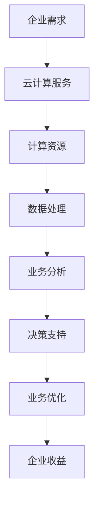

                 

# 云计算在企业数字化转型中的作用：灵活性与可扩展性

> **关键词：** 云计算、企业数字化转型、灵活性与可扩展性、技术优势、实践案例

> **摘要：** 本文旨在探讨云计算在企业数字化转型过程中的关键作用，特别是其提供的灵活性与可扩展性。通过分析云计算的原理及其在企业中的实际应用，我们旨在帮助企业更好地利用云计算技术，实现高效、可持续的数字化转型。

## 1. 背景介绍

随着信息技术的飞速发展，云计算已经成为企业数字化转型的重要驱动力。云计算不仅为企业提供了强大的计算资源，还大大简化了IT管理和运维工作。企业通过云计算可以更加灵活地应对业务需求变化，提升运营效率，降低成本。

企业数字化转型是指通过应用信息技术，尤其是云计算、大数据、物联网等新兴技术，对企业的业务流程、管理模式、组织结构进行全方位的变革。数字化转型不仅有助于提升企业的竞争力，还可以为企业创造新的增长点。

云计算在企业数字化转型中的作用主要体现在以下几个方面：

1. **提高灵活性**：企业可以根据业务需求灵活调整计算资源，无需担心硬件设备的采购和部署。
2. **提升可扩展性**：企业可以轻松扩展计算资源，以满足业务增长的需求，实现弹性伸缩。
3. **降低成本**：企业无需购买和维护大量硬件设备，通过云服务供应商提供的服务，可以大大降低IT成本。
4. **提高安全性**：云服务供应商提供专业的安全防护措施，可以提升企业的数据安全水平。

## 2. 核心概念与联系

### 2.1 云计算原理

云计算是一种通过互联网提供计算资源的服务模式。它将计算资源（如服务器、存储、网络等）集中起来，形成一个可弹性伸缩的计算资源池，用户可以根据需求随时获取和使用这些资源。

### 2.2 企业数字化转型

企业数字化转型是指利用信息技术（如云计算、大数据、物联网等）对企业的业务流程、管理模式、组织结构等进行全面革新，以提升企业的竞争力。

### 2.3 灵活性与可扩展性

灵活性是指企业能够快速响应市场变化，调整业务策略。可扩展性是指企业能够根据业务需求，灵活扩展计算资源，以满足业务增长的需求。

## 2.4 Mermaid 流程图



### 2.5 联系与作用

云计算通过提供灵活性和可扩展性，帮助企业实现数字化转型。企业可以根据业务需求快速调整计算资源，提升运营效率。同时，云计算还可以提供强大的数据处理和分析能力，为企业的决策支持提供有力保障。

## 3. 核心算法原理 & 具体操作步骤

### 3.1 云计算服务模型

云计算服务模型主要包括三种类型：IaaS（基础设施即服务）、PaaS（平台即服务）、SaaS（软件即服务）。

- **IaaS**：提供虚拟化的基础设施，如虚拟机、存储、网络等，用户可以根据需求自行配置和管理。
- **PaaS**：提供一个开发平台，用户可以在平台上开发、部署和管理应用程序，无需关注底层基础设施。
- **SaaS**：提供基于互联网的应用程序，用户可以通过浏览器访问和使用这些应用程序。

### 3.2 灵活性与可扩展性实现方法

- **自动化部署与扩展**：通过自动化工具，如容器编排系统（Kubernetes）、云服务供应商提供的自动扩展功能，实现计算资源的自动化部署和扩展。
- **按需付费**：用户可以根据实际使用情况，按需购买和使用计算资源，无需提前购买和配置大量硬件设备。

### 3.3 实际操作步骤

1. **需求分析**：了解企业业务需求，确定所需的计算资源类型和规模。
2. **选择云计算服务模型**：根据需求，选择适合的云计算服务模型。
3. **配置和管理计算资源**：使用云服务供应商提供的工具，配置和管理计算资源。
4. **部署应用程序**：在配置好的计算资源上部署应用程序，并进行测试和优化。

## 4. 数学模型和公式 & 详细讲解 & 举例说明

### 4.1 云计算资源利用率计算公式

$$
利用率 = \frac{实际使用资源}{总资源} \times 100\%
$$

### 4.2 实际应用举例

假设某企业需要处理1TB的数据，并选择使用IaaS服务模型。企业每月需要1EB的存储空间，并使用500台虚拟机进行数据处理。

- **利用率**： 
  $$ 
  利用率 = \frac{1TB}{1EB} \times 100\% = 0.01\% 
  $$

- **成本**： 
  假设每TB存储费用为1元，每台虚拟机每小时费用为0.1元。企业每月需要支付的云服务费用为： 
  $$ 
  成本 = 1元/月 \times 1EB + 0.1元/月 \times 500台 \times 24小时 \times 30天 = 18000元 
  $$

### 4.3 分析与优化

- **利用率**：企业云计算资源利用率较低，可以通过优化应用程序设计、采用更高效的算法等手段提高利用率。
- **成本**：企业可以根据业务需求，合理规划计算资源，避免过度采购，降低成本。

## 5. 项目实战：代码实际案例和详细解释说明

### 5.1 开发环境搭建

为了进行云计算实践，我们首先需要搭建一个开发环境。以下是搭建步骤：

1. 安装Python 3.x版本。
2. 安装Docker，用于容器化部署应用程序。
3. 安装Kubernetes，用于容器编排和管理。

### 5.2 源代码详细实现和代码解读

以下是一个简单的云计算应用程序示例，用于处理和存储数据：

```python
# 数据处理应用程序
import requests

def process_data(data):
    # 对数据进行处理
    return data.upper()

def store_data(data):
    # 将数据存储到数据库
    pass

if __name__ == "__main__":
    # 从远程服务器获取数据
    response = requests.get("https://example.com/data")
    data = response.text
    
    # 处理数据
    processed_data = process_data(data)
    
    # 存储数据
    store_data(processed_data)
```

### 5.3 代码解读与分析

- **数据处理**：应用程序通过HTTP请求从远程服务器获取数据，然后使用`process_data`函数对数据进行处理（在本例中，数据被转换为 uppercase）。
- **数据存储**：处理后的数据被存储到数据库中。在实际应用中，可以使用各种数据库技术，如MySQL、PostgreSQL等。

### 5.4 容器化部署

为了简化部署过程，我们可以使用Docker将应用程序容器化。以下是一个Dockerfile示例：

```dockerfile
# Dockerfile
FROM python:3.8

WORKDIR /app

COPY . .

RUN pip install -r requirements.txt

EXPOSE 8000

CMD ["python", "app.py"]
```

### 5.5 Kubernetes 部署

为了管理和扩展容器化应用程序，我们可以使用Kubernetes。以下是一个Kubernetes部署配置文件示例：

```yaml
# k8s-deployment.yaml
apiVersion: apps/v1
kind: Deployment
metadata:
  name: data-processing-app
spec:
  replicas: 3
  selector:
    matchLabels:
      app: data-processing
  template:
    metadata:
      labels:
        app: data-processing
    spec:
      containers:
      - name: data-processing
        image: data-processing:latest
        ports:
        - containerPort: 8000
```

## 6. 实际应用场景

### 6.1 金融行业

金融行业对数据处理和存储有着极高的要求。通过云计算，金融机构可以更加灵活地应对业务需求，提升数据处理能力。例如，云计算可以用于客户关系管理、风险控制、市场分析等。

### 6.2 零售业

零售业需要实时处理海量数据，以实现库存管理、销售预测和客户分析。云计算为零售业提供了强大的数据处理能力和可扩展性，帮助企业提高运营效率。

### 6.3 医疗保健

医疗保健行业需要处理大量的医疗数据和患者信息。通过云计算，医疗机构可以实现数据共享、协同诊断和远程医疗，提升医疗服务质量。

## 7. 工具和资源推荐

### 7.1 学习资源推荐

- **书籍**：《云计算：概念、技术和应用》（云计算领域经典教材）
- **论文**：《云计算的经济学分析：资源分配和定价策略》（关于云计算资源管理和定价的学术研究）
- **博客**：《云计算实战指南》（实战经验分享）

### 7.2 开发工具框架推荐

- **Docker**：用于容器化部署应用程序
- **Kubernetes**：用于容器编排和管理
- **AWS**：提供丰富的云计算服务，如计算、存储、数据库等
- **Azure**：提供全面的云计算服务，支持多种开发语言和框架

### 7.3 相关论文著作推荐

- **论文**：《云计算服务模型：IaaS、PaaS、SaaS的比较与选择》（云计算服务模型的研究）
- **著作**：《云计算与大数据技术》（系统介绍云计算和大数据技术的专著）

## 8. 总结：未来发展趋势与挑战

### 8.1 未来发展趋势

- **云计算服务多样性**：随着技术的进步，云计算服务将更加多样化，满足不同企业的需求。
- **边缘计算**：云计算与边缘计算相结合，实现数据处理的本地化和实时化。
- **人工智能**：人工智能与云计算的深度融合，为智能应用提供强大的计算支持和数据资源。

### 8.2 挑战与对策

- **数据安全**：加强数据安全防护措施，确保企业数据的安全性和隐私性。
- **标准化**：推动云计算服务的标准化，降低企业上云成本。
- **人才短缺**：加强云计算人才的培养和引进，满足行业需求。

## 9. 附录：常见问题与解答

### 9.1 云计算与传统IT相比有哪些优势？

云计算具有以下优势：

- **灵活性**：企业可以根据业务需求灵活调整计算资源。
- **可扩展性**：企业可以轻松扩展计算资源，以满足业务增长的需求。
- **降低成本**：企业无需购买和维护大量硬件设备，通过云服务供应商提供的服务，可以大大降低IT成本。

### 9.2 云计算的安全性如何保障？

云计算服务供应商提供以下安全措施：

- **数据加密**：对数据进行加密，确保数据传输和存储过程中的安全性。
- **访问控制**：通过身份验证和访问控制，确保只有授权人员可以访问数据。
- **备份与恢复**：定期备份数据，并在发生数据丢失或损坏时进行恢复。

## 10. 扩展阅读 & 参考资料

- **论文**：《云计算服务模型：IaaS、PaaS、SaaS的比较与选择》
- **博客**：《云计算实战指南》
- **网站**：[云计算技术网](http://www.cloudcomputing.cn/)
- **书籍**：《云计算：概念、技术和应用》

### 作者

**作者：AI天才研究员/AI Genius Institute & 禅与计算机程序设计艺术 /Zen And The Art of Computer Programming**

