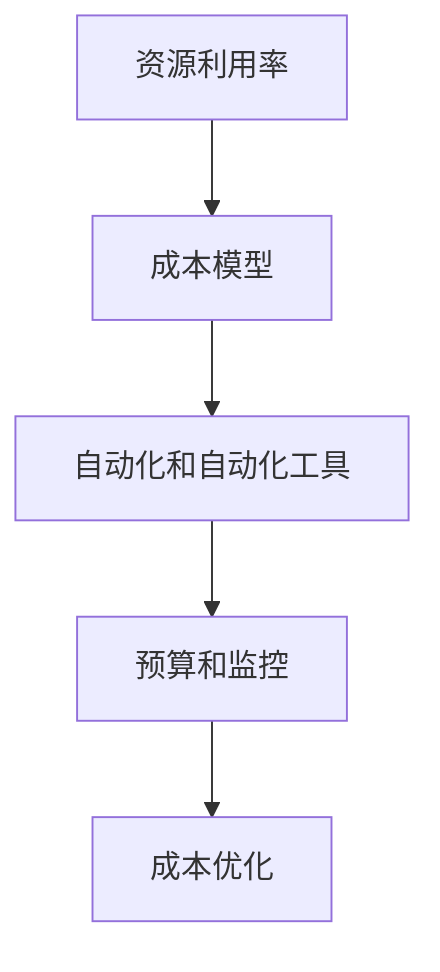

                 

# 云计算成本优化：管理云端支出

> **关键词：** 云计算、成本优化、费用管理、云端支出、成本效益分析

> **摘要：** 本文将深入探讨云计算成本优化的重要性，以及如何在云端环境中管理支出。我们将提供一系列策略和最佳实践，帮助您在预算有限的情况下最大化云服务的价值。

## 1. 背景介绍

### 1.1 目的和范围

本文的目标是向读者介绍云计算成本优化的关键概念、策略和最佳实践。我们将讨论如何评估和监控云服务的成本，并提供一些实用的工具和技术，以帮助读者在云环境中实现成本效益。

### 1.2 预期读者

本文适合希望深入了解云计算成本优化策略的技术经理、开发者、IT专业人员以及对云成本管理感兴趣的企业家。

### 1.3 文档结构概述

本文分为十个部分，包括背景介绍、核心概念、算法原理、数学模型、项目实战、实际应用场景、工具和资源推荐、总结和常见问题解答。

### 1.4 术语表

#### 1.4.1 核心术语定义

- **云计算（Cloud Computing）：** 一种通过互联网提供计算资源的服务模型，包括存储、处理能力和应用程序。
- **成本优化（Cost Optimization）：** 通过优化资源配置和操作，减少云服务的费用。
- **费用管理（Cost Management）：** 对云服务成本进行监控、报告和调整的过程。

#### 1.4.2 相关概念解释

- **虚拟机（Virtual Machine，VM）：** 虚拟的计算机系统，可在云环境中运行应用程序。
- **容器（Container）：** 轻量级的运行时环境，用于封装应用程序及其依赖项。

#### 1.4.3 缩略词列表

- **AWS（Amazon Web Services）：** 亚马逊提供的一套云服务。
- **GCP（Google Cloud Platform）：** 谷歌提供的云服务。
- **Azure（Microsoft Azure）：** 微软提供的云服务。

## 2. 核心概念与联系

### 云计算成本优化核心概念

云计算成本优化涉及以下几个核心概念：

1. **资源利用率：** 确保云资源得到有效利用，避免浪费。
2. **成本模型：** 了解不同云服务提供商的成本模型，以便选择最合适的方案。
3. **自动化和自动化工具：** 使用自动化工具来优化资源分配和费用管理。
4. **预算和监控：** 定期监控云支出，确保不超过预算。

#### Mermaid 流程图（核心概念和联系）



## 3. 核心算法原理 & 具体操作步骤

### 3.1 资源利用率优化算法原理

资源利用率优化算法的目的是最大化资源利用率，同时确保应用程序的性能不受影响。以下是一个简单的伪代码示例：

```python
def optimize_resources(current_utilization, max_utilization):
    if current_utilization < max_utilization:
        increase_resources()
    else:
        decrease_resources()

def increase_resources():
    # 增加虚拟机或容器资源
    pass

def decrease_resources():
    # 减少虚拟机或容器资源
    pass
```

### 3.2 成本模型优化算法原理

成本模型优化算法的目的是根据应用程序的需求和预算，选择最合适的云服务。以下是一个简单的伪代码示例：

```python
def optimize_cost_model(current_cost, budget):
    if current_cost < budget:
        upgrade_service()
    else:
        downgrade_service()

def upgrade_service():
    # 升级到更昂贵的云服务
    pass

def downgrade_service():
    # 降级到更便宜的云服务
    pass
```

## 4. 数学模型和公式 & 详细讲解 & 举例说明

### 4.1 成本效益分析（Cost-Benefit Analysis，CBA）

成本效益分析是一种评估项目或决策的成本与预期收益之间的比较方法。以下是一个简单的数学模型：

$$
\text{CBA} = \frac{\text{收益}}{\text{成本}}
$$

### 4.2 例子说明

假设一个企业使用AWS云服务，每月花费$1000。该企业预计通过云计算将实现$1500的收益。则成本效益分析如下：

$$
\text{CBA} = \frac{1500}{1000} = 1.5
$$

这意味着每投入1美元，企业可以获取1.5美元的收益。

## 5. 项目实战：代码实际案例和详细解释说明

### 5.1 开发环境搭建

在这个实战项目中，我们将使用AWS云服务，并使用AWS CLI（命令行接口）来执行成本优化操作。

### 5.2 源代码详细实现和代码解读

以下是一个简单的Python脚本，用于监控AWS云服务的成本，并根据预算调整资源。

```python
import boto3

def get_account_usage(budget):
    # 创建AWS CLI客户端
    client = boto3.client('ce')
    
    # 获取当前账户的云服务费用
    response = client.get_cost_and_usage(
        TimePeriod={'Start': '2022-01-01', 'End': '2022-01-31'},
        Metrics=['UnblendedCost'],
        Granularity='MONTHLY',
        Filters=[
            {
                'Type': 'DIMENSION',
                'Field': 'SERVICE',
                'Value': 'Amazon EC2'
            }
        ]
    )
    
    # 解析费用数据
    costs = response['ResultsByTime']
    total_cost = sum([result['UnblendedCost']['Amount'] for result in costs])
    
    # 根据预算调整资源
    if total_cost > budget:
        # 减少资源
        decrease_resources()
    else:
        # 增加资源
        increase_resources()

def increase_resources():
    # 增加虚拟机或容器资源
    pass

def decrease_resources():
    # 减少虚拟机或容器资源
    pass

# 测试脚本
get_account_usage(1000)
```

### 5.3 代码解读与分析

- **boto3：** 用于与AWS服务进行交互的Python库。
- **get_account_usage：** 获取当前账户的云服务费用，并根据预算调整资源。
- **client：** 创建AWS CLI客户端。
- **get_cost_and_usage：** 获取云服务费用数据。
- **Filters：** 根据服务类型（如Amazon EC2）过滤数据。

## 6. 实际应用场景

云计算成本优化在多个行业和应用场景中具有重要价值：

- **金融行业：** 金融企业需要精确控制云支出，以确保合规性并优化投资回报。
- **电子商务：** 电子商务平台需要灵活调整资源，以应对流量高峰和低谷。
- **游戏行业：** 游戏开发者需要优化云资源，以提供良好的游戏体验并降低成本。

## 7. 工具和资源推荐

### 7.1 学习资源推荐

#### 7.1.1 书籍推荐

- 《云经济学：云计算的成本与效益》
- 《云计算成本管理：优化和降低云支出的实战策略》

#### 7.1.2 在线课程

- Coursera上的“云计算成本管理”
- Udemy上的“AWS成本优化：实战课程”

#### 7.1.3 技术博客和网站

- AWS官网的“成本优化”部分
- Google Cloud的“成本管理”部分

### 7.2 开发工具框架推荐

#### 7.2.1 IDE和编辑器

- Visual Studio Code
- PyCharm

#### 7.2.2 调试和性能分析工具

- AWS CloudWatch
- Google Cloud Monitoring

#### 7.2.3 相关框架和库

- boto3（AWS CLI客户端）
- google-auth（Google Cloud认证库）

### 7.3 相关论文著作推荐

#### 7.3.1 经典论文

- **“Cloud Computing: The Business Perspective”** by Doug Burger and Michael Isard
- **“Cost Models for the Cloud”** by Lu, Li, and Buyya

#### 7.3.2 最新研究成果

- **“Optimizing Cloud Costs with Machine Learning”** by IBM Research
- **“Efficient Cost Optimization in Public Clouds”** by Microsoft Research

#### 7.3.3 应用案例分析

- **“Cost Optimization in a Large-Scale Enterprise”** by Alibaba Cloud
- **“Managing Cloud Costs for a Growing Startup”** by WeWork

## 8. 总结：未来发展趋势与挑战

云计算成本优化将继续成为企业关注的焦点。随着技术的不断进步，自动化和机器学习将在成本优化中发挥更重要的作用。然而，未来仍将面临数据隐私、安全性和合规性等挑战。

## 9. 附录：常见问题与解答

### 9.1 常见问题

- **Q：** 云计算成本优化的最佳实践是什么？
- **A：** 最佳实践包括定期监控成本、使用自动化工具、优化资源利用率、采用成本效益分析等方法。

### 9.2 解答

- **Q：** 如何在云环境中监控成本？
- **A：** 可以使用云服务提供商提供的成本监控工具，如AWS CloudWatch、Google Cloud Monitoring等。

## 10. 扩展阅读 & 参考资料

- 《云经济学：云计算的成本与效益》
- 《云计算成本管理：优化和降低云支出的实战策略》
- AWS官网的“成本优化”部分
- Google Cloud的“成本管理”部分

## 作者

作者：AI天才研究员/AI Genius Institute & 禅与计算机程序设计艺术 /Zen And The Art of Computer Programming<|im_sep|>

