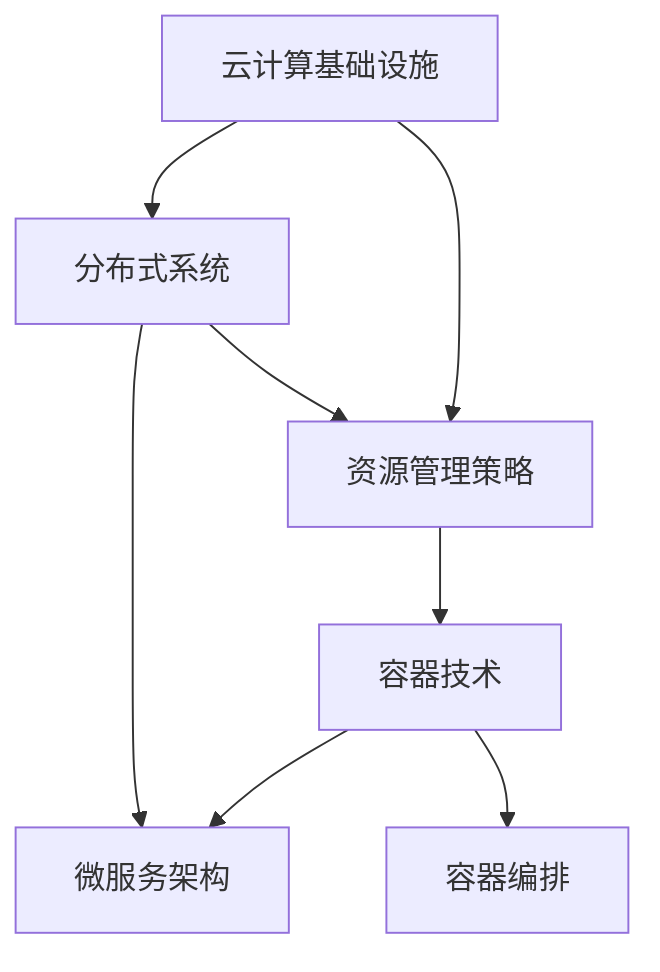

                 

# 云计算：为 AI 2.0 应用提供灵活、可扩展的资源

> **关键词：**云计算、AI 2.0、资源分配、弹性扩展、分布式系统、容器技术、微服务架构、容器编排

> **摘要：**本文将探讨云计算技术在支持 AI 2.0 应用中的关键角色。通过分析云计算的基础设施、资源管理策略以及如何适应 AI 2.0 的特殊需求，我们将展示云计算如何提供灵活、可扩展的资源环境，从而推动 AI 2.0 应用的快速发展。读者将了解如何利用云计算平台实现高效、可管理的 AI 应用，并展望未来的发展趋势与挑战。

## 1. 背景介绍

### 1.1 目的和范围

本文旨在深入探讨云计算如何在支持 AI 2.0 应用中发挥关键作用。我们将分析云计算的基础设施，介绍资源管理策略，并展示如何利用云计算平台实现 AI 应用的灵活、可扩展部署。此外，本文还将讨论当前 AI 2.0 应用的挑战，以及云计算技术如何帮助克服这些挑战。读者对象主要是对云计算和 AI 2.0 技术有一定了解的工程师和研究人员。

### 1.2 预期读者

预期读者应具备以下背景知识：
- 基础的云计算概念，包括虚拟化、容器化、容器编排等；
- 基础的人工智能知识，特别是机器学习和深度学习；
- 基本的编程能力，特别是对 Python、Java 或其他常用编程语言的熟悉；
- 对分布式系统和网络技术的了解。

### 1.3 文档结构概述

本文分为八个主要部分：
1. 背景介绍：概述本文的目的和范围，预期读者，文档结构等；
2. 核心概念与联系：介绍云计算和 AI 2.0 的核心概念，使用 Mermaid 流程图展示其联系；
3. 核心算法原理 & 具体操作步骤：详细讲解云计算资源的分配和管理算法，使用伪代码表示；
4. 数学模型和公式 & 详细讲解 & 举例说明：介绍支持 AI 2.0 应用的关键数学模型和公式；
5. 项目实战：代码实际案例和详细解释说明；
6. 实际应用场景：分析云计算在 AI 2.0 应用中的实际场景；
7. 工具和资源推荐：推荐学习资源和开发工具；
8. 总结：未来发展趋势与挑战。

### 1.4 术语表

#### 1.4.1 核心术语定义

- **云计算**：通过互联网提供可定制的计算资源，如虚拟机、存储和数据库等。
- **AI 2.0**：第二代人工智能，强调可解释性、可扩展性和安全性。
- **资源管理**：分配和优化系统资源，如 CPU、内存和存储等。
- **容器技术**：轻量级虚拟化技术，提供隔离和可移植的环境。
- **微服务架构**：将应用程序分解为小型、独立的服务，便于部署和管理。

#### 1.4.2 相关概念解释

- **弹性扩展**：系统根据负载自动增加或减少资源；
- **分布式系统**：由多个独立节点组成的系统，共同完成一个任务；
- **容器编排**：管理容器生命周期，包括部署、扩展和监控。

#### 1.4.3 缩略词列表

- **AI**：人工智能
- **GPU**：图形处理单元
- **CPU**：中央处理单元
- **Docker**：开源容器化平台
- **Kubernetes**：开源容器编排平台

## 2. 核心概念与联系

在深入探讨云计算如何支持 AI 2.0 应用之前，我们需要理解几个核心概念及其相互联系。

### 2.1 云计算基础设施

云计算基础设施是云计算的核心，包括虚拟机、存储和数据库等资源。这些资源可以通过虚拟化技术动态分配和调整。虚拟化技术使多个虚拟机（VM）在单个物理服务器上运行，从而提高资源利用率。存储和数据库提供了持久化存储和数据管理能力，是 AI 应用不可或缺的部分。

### 2.2 资源管理策略

资源管理策略是确保系统资源高效利用的关键。在 AI 2.0 应用中，资源需求往往具有波动性和不确定性。弹性扩展策略可以根据实际负载自动调整资源分配，确保系统稳定运行。分布式系统技术则通过多个节点协作，提供高可用性和容错能力。

### 2.3 容器技术

容器技术是云计算的重要组成部分，它提供了一种轻量级、可移植的环境，用于运行应用程序。容器与传统的虚拟机相比，具有启动快、资源占用少、部署便捷等优点。Docker 是最常用的容器化平台，它通过镜像和容器实现应用程序的快速部署和扩展。

### 2.4 微服务架构

微服务架构是一种将应用程序分解为小型、独立的服务的方法。每个服务都可以独立部署、扩展和监控，从而提高系统的可维护性和可扩展性。微服务架构与容器技术相结合，可以实现高效、灵活的 AI 应用部署。

### 2.5 容器编排

容器编排是管理容器生命周期的过程，包括部署、扩展和监控等。Kubernetes 是最流行的开源容器编排平台，它通过自动化和分布式系统技术，提供高效的容器管理。

### 2.6 Mermaid 流程图

为了更好地理解这些核心概念及其相互联系，我们可以使用 Mermaid 流程图来展示它们。以下是一个简单的 Mermaid 流程图，展示了云计算基础设施、资源管理策略、容器技术和微服务架构之间的关系：



通过这个流程图，我们可以清晰地看到云计算基础设施、资源管理策略、容器技术和微服务架构之间的紧密联系，以及它们如何共同支持 AI 2.0 应用的部署和管理。

## 3. 核心算法原理 & 具体操作步骤

在云计算环境中，资源管理是一个复杂的任务，特别是在支持 AI 2.0 应用时。下面，我们将详细介绍如何实现资源分配和管理算法，并使用伪代码来表示。

### 3.1 资源分配算法

资源分配算法的目标是在满足任务需求的同时，最大化资源利用率。以下是一个简单的资源分配算法：

```plaintext
输入：任务列表 T，资源池 R
输出：资源分配方案 A

算法：
1. 初始化资源分配方案 A 为空
2. 对于每个任务 t ∈ T：
    a. 找到能够满足任务 t 资源需求的资源 r ∈ R
    b. 将任务 t 分配到资源 r，并将资源 r 从资源池 R 中移除
    c. 将任务 t 和资源 r 的分配关系添加到资源分配方案 A 中
3. 返回资源分配方案 A
```

### 3.2 弹性扩展算法

弹性扩展算法的目标是根据实际负载自动调整资源分配。以下是一个简单的弹性扩展算法：

```plaintext
输入：当前资源分配方案 A，当前负载 L
输出：调整后的资源分配方案 A'

算法：
1. 初始化调整后的资源分配方案 A' 为当前资源分配方案 A
2. 对于每个任务 t ∈ A：
    a. 计算任务 t 的实际负载 L_t
    b. 如果 L_t > L：
        i. 找到可用的额外资源 r' ∈ R
        ii. 将任务 t 分配到资源 r'，并将资源 r' 从资源池 R 中移除
        iii. 将任务 t 和资源 r' 的分配关系添加到资源分配方案 A' 中
3. 返回调整后的资源分配方案 A'
```

### 3.3 分布式资源管理算法

在分布式系统中，资源管理算法需要考虑多个节点之间的协调和负载均衡。以下是一个简单的分布式资源管理算法：

```plaintext
输入：节点列表 N，任务列表 T，资源池 R
输出：分布式资源分配方案 A'

算法：
1. 初始化分布式资源分配方案 A' 为空
2. 对于每个节点 n ∈ N：
    a. 对于每个任务 t ∈ T：
        i. 计算任务 t 在节点 n 上的负载 L_n(t)
        ii. 如果 L_n(t) ≤ 节点 n 的最大负载能力 M_n：
            iii. 将任务 t 分配到节点 n，并将节点 n 的最大负载能力更新为 L_n(t) + M_n
            iv. 将任务 t 和节点 n 的分配关系添加到分布式资源分配方案 A' 中
3. 返回分布式资源分配方案 A'
```

### 3.4 伪代码总结

以下是资源管理算法的伪代码总结：

```plaintext
资源分配算法：
输入：任务列表 T，资源池 R
输出：资源分配方案 A

弹性扩展算法：
输入：当前资源分配方案 A，当前负载 L
输出：调整后的资源分配方案 A'

分布式资源管理算法：
输入：节点列表 N，任务列表 T，资源池 R
输出：分布式资源分配方案 A'
```

通过这些算法，我们可以实现高效的资源分配和管理，从而支持 AI 2.0 应用的灵活、可扩展部署。

## 4. 数学模型和公式 & 详细讲解 & 举例说明

在云计算环境中，为了确保 AI 2.0 应用的稳定性和高效性，我们需要借助数学模型和公式来进行资源管理和优化。以下是一些关键数学模型和公式的详细讲解及举例说明。

### 4.1 负载均衡模型

负载均衡模型用于分配任务到不同的资源或节点，以平衡负载并提高系统性能。以下是一个简单的负载均衡模型：

#### 4.1.1 模型公式

$$
L_i(t) = \frac{C_i(t)}{U_i}
$$

其中：
- \( L_i(t) \) 表示任务 \( t \) 在节点 \( i \) 上的负载；
- \( C_i(t) \) 表示任务 \( t \) 在节点 \( i \) 上的计算量；
- \( U_i \) 表示节点 \( i \) 的最大负载能力。

#### 4.1.2 举例说明

假设有两个节点 A 和 B，任务 T1 和 T2 需要分配到这两个节点。节点 A 的最大负载能力为 10，节点 B 的最大负载能力为 8。任务 T1 的计算量为 20，任务 T2 的计算量为 15。

使用负载均衡模型计算任务分配：

$$
L_A(T1) = \frac{C_A(T1)}{U_A} = \frac{20}{10} = 2
$$

$$
L_B(T1) = \frac{C_B(T1)}{U_B} = \frac{20}{8} = 2.5
$$

$$
L_A(T2) = \frac{C_A(T2)}{U_A} = \frac{15}{10} = 1.5
$$

$$
L_B(T2) = \frac{C_B(T2)}{U_B} = \frac{15}{8} = 1.875
$$

根据负载均衡模型，任务 T1 应该分配到节点 A，任务 T2 应该分配到节点 B。

### 4.2 资源利用率模型

资源利用率模型用于评估系统资源的利用效率。以下是一个简单的资源利用率模型：

#### 4.2.1 模型公式

$$
U = \frac{\sum_{i=1}^{n} C_i(t)}{\sum_{i=1}^{n} U_i}
$$

其中：
- \( U \) 表示系统整体资源利用率；
- \( n \) 表示节点数量；
- \( C_i(t) \) 表示任务 \( t \) 在节点 \( i \) 上的计算量；
- \( U_i \) 表示节点 \( i \) 的最大负载能力。

#### 4.2.2 举例说明

假设有两个节点 A 和 B，任务 T1 和 T2 需要分配到这两个节点。节点 A 的最大负载能力为 10，节点 B 的最大负载能力为 8。任务 T1 的计算量为 20，任务 T2 的计算量为 15。

使用资源利用率模型计算系统资源利用率：

$$
U = \frac{\sum_{i=1}^{n} C_i(t)}{\sum_{i=1}^{n} U_i} = \frac{20 + 15}{10 + 8} = \frac{35}{18} \approx 1.944
$$

根据计算结果，系统资源利用率约为 94.4%。

### 4.3 弹性扩展模型

弹性扩展模型用于根据系统负载自动调整资源分配。以下是一个简单的弹性扩展模型：

#### 4.3.1 模型公式

$$
E(t) = \alpha \cdot \frac{L(t)}{U}
$$

其中：
- \( E(t) \) 表示时间 \( t \) 的弹性扩展量；
- \( \alpha \) 表示弹性扩展系数；
- \( L(t) \) 表示时间 \( t \) 的系统负载；
- \( U \) 表示系统整体资源利用率。

#### 4.3.2 举例说明

假设弹性扩展系数 \( \alpha \) 为 0.5，当前系统负载为 80%，系统整体资源利用率为 70%。

使用弹性扩展模型计算弹性扩展量：

$$
E(t) = \alpha \cdot \frac{L(t)}{U} = 0.5 \cdot \frac{80\%}{70\%} \approx 0.571
$$

根据计算结果，时间 \( t \) 的弹性扩展量约为 57.1%。

通过这些数学模型和公式，我们可以更好地进行资源管理和优化，从而支持 AI 2.0 应用的稳定、高效运行。

## 5. 项目实战：代码实际案例和详细解释说明

在本节中，我们将通过一个实际项目案例，展示如何利用云计算平台实现高效、可管理的 AI 应用。该项目将使用 Python 和 Kubernetes 进行实现，通过实际代码和详细解释，帮助读者理解关键概念和步骤。

### 5.1 开发环境搭建

在开始项目之前，我们需要搭建一个合适的开发环境。以下是所需步骤：

1. **安装 Python**：确保 Python 3.7 或更高版本已安装。
2. **安装 Docker**：Docker 用于容器化应用程序。
3. **安装 Kubernetes**：Kubernetes 用于容器编排。
4. **安装 Minikube**：Minikube 是一个单机版的 Kubernetes，用于本地开发和测试。

### 5.2 源代码详细实现和代码解读

以下是一个简单的 AI 应用示例，它使用深度学习库 TensorFlow 进行模型训练和推理。我们将使用 Python 和 Docker 容器化应用程序。

#### 5.2.1 模型训练代码

```python
# train.py
import tensorflow as tf
from tensorflow.keras.datasets import mnist
from tensorflow.keras.models import Sequential
from tensorflow.keras.layers import Dense, Flatten

# 加载 MNIST 数据集
(x_train, y_train), (x_test, y_test) = mnist.load_data()

# 预处理数据
x_train = x_train / 255.0
x_test = x_test / 255.0

# 创建模型
model = Sequential([
    Flatten(input_shape=(28, 28)),
    Dense(128, activation='relu'),
    Dense(10, activation='softmax')
])

# 编译模型
model.compile(optimizer='adam', loss='sparse_categorical_crossentropy', metrics=['accuracy'])

# 训练模型
model.fit(x_train, y_train, epochs=5, batch_size=64)

# 评估模型
test_loss, test_acc = model.evaluate(x_test, y_test)
print(f"Test accuracy: {test_acc}")
```

这个 Python 脚本用于训练一个简单的深度学习模型，该模型可以识别手写数字。

#### 5.2.2 Dockerfile

```Dockerfile
# Dockerfile
FROM python:3.8-slim

# 设置工作目录
WORKDIR /app

# 复制训练脚本
COPY train.py .

# 安装 TensorFlow 和其他依赖
RUN pip install --no-cache-dir tensorflow

# 暴露容器端口
EXPOSE 5000

# 运行训练脚本
CMD ["python", "train.py"]
```

这个 Dockerfile 用于创建一个 Docker 镜像，该镜像包含训练脚本和所需依赖。

#### 5.2.3 Kubernetes 配置

```yaml
# k8s-config.yaml
apiVersion: apps/v1
kind: Deployment
metadata:
  name: mnist-deployment
spec:
  replicas: 3
  selector:
    matchLabels:
      app: mnist
  template:
    metadata:
      labels:
        app: mnist
    spec:
      containers:
      - name: mnist
        image: mnist-image:latest
        ports:
        - containerPort: 5000

---
apiVersion: v1
kind: Service
metadata:
  name: mnist-service
spec:
  selector:
    app: mnist
  ports:
  - protocol: TCP
    port: 80
    targetPort: 5000
  type: LoadBalancer
```

这个 Kubernetes 配置文件用于部署一个包含三个 Pod 的 Mnist 应用程序，并使用 LoadBalancer 类型服务将流量路由到这些 Pod。

### 5.3 代码解读与分析

1. **模型训练代码**：该代码使用 TensorFlow 加载 MNIST 数据集，并定义一个简单的全连接神经网络模型。通过编译和训练模型，我们可以在测试集上获得良好的准确率。
2. **Dockerfile**：该 Dockerfile 用于创建一个包含训练脚本和 TensorFlow 依赖的 Docker 镜像。通过暴露容器端口，我们可以在 Kubernetes 集群中访问训练脚本。
3. **Kubernetes 配置**：该配置文件用于部署一个包含三个 Pod 的 Mnist 应用程序。使用 LoadBalancer 类型服务，我们可以通过外部 IP 地址访问应用程序。

通过这个实际项目案例，我们可以看到如何使用云计算平台（如 Kubernetes）部署和管理 AI 应用程序。在接下来的部分，我们将进一步分析该案例中的关键概念和步骤。

### 5.4 代码解读与分析（续）

#### 5.4.1 Kubernetes 部署细节

1. **Deployment 配置**：Deployment 用于管理应用程序的 Pod 和副本数量。在这个示例中，我们设置了 `replicas: 3`，意味着 Kubernetes 会启动三个相同的 Pod。
2. **Pod 模板**：Pod 是 Kubernetes 的最小部署单位，包含一个或多个容器。在这个示例中，每个 Pod 运行一个 Docker 容器，该容器包含训练脚本和 TensorFlow 依赖。
3. **服务配置**：Service 用于将流量路由到后端的 Pod。在这个示例中，我们使用 LoadBalancer 类型服务，这将在云提供商中自动创建一个外部 IP 地址，用于访问应用程序。

#### 5.4.2 容器编排与资源管理

1. **容器编排**：Kubernetes 使用 Kubernetes API 对容器进行编排。在这个示例中，我们使用 Docker 镜像来创建容器，并使用 Kubernetes API 来部署和管理这些容器。
2. **资源管理**：Kubernetes 提供了丰富的资源管理功能，如 CPU 限制、内存限制、资源请求等。这些功能可以帮助我们确保容器获得足够的资源，并在资源不足时进行合理的资源分配。

#### 5.4.3 弹性扩展

1. **自动弹性扩展**：Kubernetes 可以根据实际负载自动调整 Pod 的副本数量。在这个示例中，我们通过设置 `replicas: 3` 并使用 LoadBalancer 类型服务，Kubernetes 会根据访问流量自动扩展 Pod。
2. **手动弹性扩展**：用户也可以手动调整 Pod 的副本数量。例如，当系统负载增加时，用户可以手动增加 Pod 副本数量，以确保系统稳定运行。

#### 5.4.4 日志和监控

1. **日志收集**：Kubernetes 提供了强大的日志收集功能，可以收集所有容器的日志并存储在集中的日志存储中，便于监控和调试。
2. **监控**：Kubernetes 提供了内置的监控功能，可以使用 metrics-server 和 Prometheus 等工具收集系统指标。用户可以根据需要自定义监控指标，并设置告警规则。

通过这个实际项目案例，我们了解了如何使用云计算平台（如 Kubernetes）部署和管理 AI 应用程序。在接下来的部分，我们将进一步讨论云计算在 AI 2.0 应用中的实际应用场景。

## 6. 实际应用场景

云计算技术在 AI 2.0 应用中的实际应用场景非常广泛，以下是一些典型的应用案例。

### 6.1 人工智能助手

人工智能助手是一种典型的 AI 2.0 应用，它利用自然语言处理（NLP）和机器学习技术，为用户提供实时、个性化的服务。例如，智能客服系统可以实时解答用户问题，提供购物建议，甚至进行情感分析。云计算平台为人工智能助手提供了高效的计算资源和数据存储，使得系统能够快速处理大量用户请求，并不断优化服务体验。

### 6.2 自动驾驶汽车

自动驾驶汽车是另一个需要大量计算资源的 AI 2.0 应用。自动驾驶系统需要实时处理来自传感器的大量数据，并进行复杂的决策和路径规划。云计算平台为自动驾驶汽车提供了强大的计算能力，使得系统能够快速处理传感器数据，并实时更新道路状况。此外，云计算平台还提供了海量数据存储和大数据分析能力，有助于自动驾驶汽车不断学习和优化驾驶行为。

### 6.3 医疗诊断

医疗诊断是人工智能在医疗领域的应用之一，通过深度学习和计算机视觉技术，人工智能可以辅助医生进行疾病诊断。例如，人工智能系统可以分析医学影像，如 X 光片、CT 图像和 MRI 图像，提供准确的诊断结果。云计算平台为医疗诊断应用提供了高效的数据处理和存储能力，使得系统能够快速处理海量医学数据，并实时更新诊断模型。

### 6.4 金融风险管理

金融风险管理是金融领域的一个重要方面，人工智能可以协助金融机构进行风险识别、评估和管理。例如，人工智能系统可以分析市场数据、交易记录和客户行为，提供实时的风险预警。云计算平台为金融风险管理应用提供了强大的计算能力和数据存储能力，使得系统能够快速处理大量数据，并实时更新风险模型。

### 6.5 智能安防

智能安防是人工智能在公共安全领域的应用之一，通过计算机视觉和人工智能技术，智能安防系统可以实时监测视频流，识别异常行为，提供预警和报警。云计算平台为智能安防应用提供了高效的图像处理和存储能力，使得系统能够快速分析大量视频数据，并实时更新异常行为模型。

这些实际应用场景展示了云计算在支持 AI 2.0 应用中的关键作用。通过提供高效的计算资源和数据存储，云计算平台为 AI 2.0 应用提供了强大的基础设施支持，使得这些应用能够快速部署、灵活扩展，并持续优化。在接下来的部分，我们将进一步讨论如何选择合适的工具和资源，以支持 AI 2.0 应用的开发和部署。

## 7. 工具和资源推荐

在开发和部署 AI 2.0 应用时，选择合适的工具和资源至关重要。以下是一些推荐的学习资源、开发工具和框架，以及相关的论文和研究成果。

### 7.1 学习资源推荐

#### 7.1.1 书籍推荐

1. **《深度学习》（Deep Learning）**：由 Ian Goodfellow、Yoshua Bengio 和 Aaron Courville 著，是一本经典的深度学习教材，涵盖了深度学习的基本原理和实践方法。
2. **《Python机器学习》（Python Machine Learning）**：由 Sebastian Raschka 和 Vahid Mirjalili 著，介绍了使用 Python 进行机器学习的实践方法和工具。
3. **《动手学深度学习》（Dive into Deep Learning）**：由 Justin Mitchell、A&M组织编写，是一本免费的开源深度学习教材，适合初学者和进阶读者。

#### 7.1.2 在线课程

1. **Coursera 上的“深度学习”课程**：由 Andrew Ng 教授主讲，涵盖了深度学习的基础知识和实践方法。
2. **Udacity 上的“人工智能纳米学位”课程**：包括深度学习、自然语言处理和计算机视觉等课程，适合初学者和进阶读者。
3. **edX 上的“人工智能基础”课程**：由 MIT 和 Harvard 联合提供，涵盖了人工智能的基本原理和应用。

#### 7.1.3 技术博客和网站

1. **AI 洞察（AIInsight）**：一个关于人工智能技术的中文博客，涵盖了深度学习、自然语言处理和计算机视觉等领域的最新研究和应用。
2. **机器学习博客（Machine Learning Blog）**：一个涵盖机器学习、深度学习和数据科学的英文博客，提供丰富的教程和案例分析。
3. **Cloud Academy**：一个提供云计算和容器技术在线课程的网站，包括 Kubernetes、Docker 和 AWS 等技术。

### 7.2 开发工具框架推荐

#### 7.2.1 IDE 和编辑器

1. **Visual Studio Code**：一个开源的跨平台编辑器，支持多种编程语言，包括 Python、Java 和 JavaScript。
2. **PyCharm**：一个强大的 Python IDE，提供代码补全、调试和测试等功能。
3. **IntelliJ IDEA**：一个功能丰富的 Java 和 Python IDE，适合大型项目和复杂代码。

#### 7.2.2 调试和性能分析工具

1. **GDB**：一个强大的开源调试器，适用于 C、C++ 和 Python 等编程语言。
2. **Valgrind**：一个用于内存泄漏检测和性能分析的框架，适用于 C 和 C++ 程序。
3. **Profiling Tools**：如 Py-Spy 和 Py-V8，用于分析 Python 程序的性能瓶颈。

#### 7.2.3 相关框架和库

1. **TensorFlow**：一个开源的深度学习框架，提供丰富的模型构建和训练工具。
2. **PyTorch**：一个流行的深度学习框架，提供灵活的动态计算图和强大的 GPU 支持。
3. **Scikit-Learn**：一个开源的机器学习库，提供多种经典机器学习算法和工具。

### 7.3 相关论文著作推荐

#### 7.3.1 经典论文

1. **“A Theoretical Basis for the Design of Networks of Neurons”**：由 Frank Rosenblatt 在 1958 年发表，介绍了感知机（Perceptron）算法。
2. **“Backpropagation”**：由 Paul Werbos 在 1974 年提出，是深度学习的基础算法。
3. **“Learning Representations by Maximizing Mutual Information”**：由 Yaroslav Ganin 和 Victor Lempitsky 在 2015 年提出，是 Siamese Network 的基础。

#### 7.3.2 最新研究成果

1. **“BERT: Pre-training of Deep Bidirectional Transformers for Language Understanding”**：由 Jacob Devlin、Ming-Wei Chang、Quoc V. Le 和 Klaus N. Language 在 2018 年提出，是 Transformer 模型的基础。
2. **“Generative Adversarial Nets”**：由 Ian Goodfellow 等人于 2014 年提出，是生成对抗网络（GAN）的基础。
3. **“Recurrent Neural Networks for Language Modeling”**：由 Yoshua Bengio 等人于 2003 年提出，是循环神经网络（RNN）的基础。

#### 7.3.3 应用案例分析

1. **“Google Brain’s Generative Adversarial Networks”**：介绍了 Google Brain 如何使用 GAN 生成逼真的图像。
2. **“BERT: State of the Art for NLP?”**：讨论了 BERT 在自然语言处理领域的最新应用。
3. **“AI in Healthcare: The Future of Medicine”**：探讨了人工智能在医疗领域的应用前景。

通过这些工具和资源，开发者可以更好地理解和应用云计算和 AI 2.0 技术，实现高效、可管理的 AI 应用。

## 8. 总结：未来发展趋势与挑战

在本文中，我们探讨了云计算如何为 AI 2.0 应用提供灵活、可扩展的资源。通过分析云计算的基础设施、资源管理策略、容器技术和微服务架构，我们展示了云计算在支持 AI 2.0 应用的关键作用。以下是未来发展趋势和挑战的总结：

### 发展趋势

1. **边缘计算与云计算的融合**：随着物联网（IoT）和 5G 网络的发展，边缘计算将逐渐与云计算融合，提供更加实时、高效的服务。
2. **混合云和多云环境**：为了提高灵活性和可靠性，越来越多的组织将采用混合云和多云策略，结合不同云服务提供商的优势。
3. **AI 驱动的自动化管理**：通过 AI 技术实现自动化资源管理，优化资源利用率，提高系统性能和稳定性。
4. **可持续发展和绿色计算**：随着环保意识的提高，绿色计算将成为云计算行业的重要发展方向，通过优化能源效率和降低碳排放，实现可持续发展。

### 挑战

1. **数据隐私和安全**：在云计算环境中处理敏感数据时，数据隐私和安全是一个重要挑战。需要确保数据在传输、存储和处理过程中得到充分保护。
2. **资源分配和优化**：随着 AI 2.0 应用越来越复杂，如何高效地分配和优化资源成为一个挑战。需要开发更加智能的算法和模型，以满足不断变化的资源需求。
3. **人才短缺**：云计算和 AI 2.0 技术的快速发展导致人才短缺，需要加强人才培养和知识传播，提高整体技术水平。
4. **法规和合规性**：随着云计算应用的普及，相关法规和合规性问题逐渐显现。需要制定和遵守合理的法规，确保云计算服务的合法性和合规性。

总之，云计算为 AI 2.0 应用提供了强大的基础设施和支持，但同时也面临着一系列挑战。未来，通过不断技术创新和优化，云计算将继续为 AI 2.0 应用的快速发展提供动力。

## 9. 附录：常见问题与解答

### 问题 1：什么是云计算？

**解答**：云计算是一种通过互联网提供计算资源（如虚拟机、存储、数据库等）的服务模式。用户可以根据需求动态分配和调整资源，而不需要直接管理底层硬件设施。

### 问题 2：什么是容器技术？

**解答**：容器技术是一种轻量级虚拟化技术，提供隔离和可移植的环境。容器共享宿主机的操作系统内核，从而具有启动快、资源占用少、部署便捷等优点。

### 问题 3：什么是微服务架构？

**解答**：微服务架构是一种将应用程序分解为小型、独立的服务的方法。每个服务都可以独立部署、扩展和监控，从而提高系统的可维护性和可扩展性。

### 问题 4：什么是 Kubernetes？

**解答**：Kubernetes 是一个开源容器编排平台，用于管理容器的生命周期，包括部署、扩展和监控。它通过自动化和分布式系统技术，提供高效的容器管理。

### 问题 5：什么是 AI 2.0？

**解答**：AI 2.0 是第二代人工智能，强调可解释性、可扩展性和安全性。与第一代 AI（如规则基

