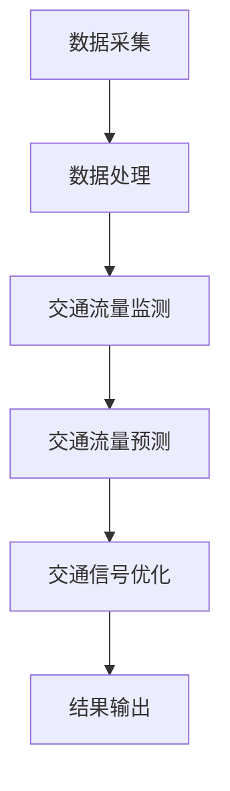

                 

# 交通管理中AI代理的工作流程与应用

> **关键词：** AI代理、交通管理、工作流程、应用场景、算法原理、数学模型、实战案例

> **摘要：** 本文深入探讨了交通管理中AI代理的工作原理、应用场景以及具体实现步骤，旨在为读者提供一份关于AI代理在交通管理中应用的全景图，包括核心算法原理、数学模型及其在实战中的应用。

## 1. 背景介绍

随着城市化进程的不断加快，交通管理成为了一个复杂且至关重要的领域。传统的交通管理方式往往依赖于人工操作和经验判断，而随着人工智能技术的发展，AI代理开始在交通管理中发挥重要作用。AI代理是指通过机器学习和人工智能技术，模拟人类行为和决策的计算机程序。在交通管理中，AI代理可以实时监控交通状况，预测交通流量，优化交通信号控制，甚至协助自动驾驶汽车实现安全行驶。

本文将围绕AI代理在交通管理中的工作流程和应用，详细探讨其核心算法原理、数学模型以及实战案例。通过本文的阅读，读者将能够全面了解AI代理在交通管理中的潜力与挑战。

## 2. 核心概念与联系

### 2.1 AI代理的定义与作用

AI代理（Artificial Intelligence Agent）是一种计算机程序，它可以在给定环境中采取行动，以实现特定目标。在交通管理中，AI代理可以充当交通信号控制器、交通监控员或者自动驾驶系统的核心部分。其主要作用包括：

- **实时交通流量监测**：AI代理通过传感器和数据采集设备，实时获取交通流量、车辆速度、道路占有率等信息。
- **交通流量预测**：基于历史数据和实时数据，AI代理可以预测未来一段时间内的交通流量变化，为交通信号控制提供依据。
- **交通信号优化**：AI代理可以根据交通流量预测结果，动态调整交通信号灯的时长，从而优化交通流，减少拥堵。

### 2.2 关键技术

在实现AI代理功能的过程中，需要借助多种关键技术，包括：

- **机器学习与深度学习**：用于训练AI模型，使其能够从数据中学习并做出决策。
- **数据采集与处理**：通过传感器、摄像头等设备采集交通数据，并进行预处理，以便后续分析。
- **优化算法**：用于优化交通信号控制策略，以最小化交通拥堵。
- **通信协议**：实现AI代理与其他系统（如自动驾驶汽车、智能交通灯等）之间的数据交换。

### 2.3 Mermaid 流程图

为了更直观地理解AI代理在交通管理中的工作流程，我们使用Mermaid绘制了以下流程图：



### 2.4 核心概念的联系

AI代理在交通管理中的工作过程可以概括为以下几个步骤：

1. **数据采集**：通过传感器和摄像头等设备采集实时交通数据。
2. **数据处理**：对采集到的交通数据进行预处理，如滤波、去噪等。
3. **交通流量监测**：利用预处理后的数据，实时监测交通状况。
4. **交通流量预测**：基于历史数据和实时数据，预测未来一段时间内的交通流量变化。
5. **交通信号优化**：根据交通流量预测结果，动态调整交通信号灯的时长。
6. **结果输出**：将优化后的交通信号控制策略输出给交通信号控制器。

## 3. 核心算法原理 & 具体操作步骤

### 3.1 机器学习算法

在AI代理的交通管理应用中，常用的机器学习算法包括线性回归、支持向量机（SVM）、决策树、随机森林和神经网络等。以下是这些算法的基本原理：

- **线性回归**：用于预测交通流量与时间的关系，公式为 $y = wx + b$，其中 $w$ 和 $b$ 是模型的权重和偏置。
- **支持向量机（SVM）**：通过找到最佳的超平面，将交通流量数据分为不同类别，公式为 $f(x) = w \cdot x + b$。
- **决策树**：通过一系列规则，将交通流量数据逐步划分为不同的子集，直至满足终止条件。
- **随机森林**：由多个决策树组成，通过集成多个决策树的预测结果，提高模型的准确性和稳定性。
- **神经网络**：通过多层神经网络，模拟人脑神经元的工作方式，实现复杂的非线性关系建模。

### 3.2 实际操作步骤

以下是一个基于线性回归的交通流量预测算法的具体操作步骤：

1. **数据准备**：收集历史交通流量数据，包括小时、分钟、道路占有率、车辆速度等。
2. **数据预处理**：对采集到的数据进行清洗、去噪、归一化等处理，以消除异常值和噪声干扰。
3. **特征选择**：根据相关性分析，选择与交通流量相关的特征，如小时、道路占有率等。
4. **模型训练**：使用训练集数据，通过最小二乘法训练线性回归模型，得到权重 $w$ 和偏置 $b$。
5. **模型评估**：使用测试集数据，评估模型的预测准确性和稳定性。
6. **模型应用**：将训练好的模型应用于实时交通流量预测，根据预测结果动态调整交通信号灯时长。

### 3.3 代码示例

以下是Python中实现线性回归模型的一个示例代码：

```python
import numpy as np
import pandas as pd
from sklearn.linear_model import LinearRegression

# 加载数据
data = pd.read_csv('traffic_data.csv')
X = data[['hour', 'road占有率']]
y = data['流量']

# 模型训练
model = LinearRegression()
model.fit(X, y)

# 模型评估
score = model.score(X, y)
print('模型准确率：', score)

# 预测交通流量
new_data = np.array([[12, 0.8]])
predicted_flow = model.predict(new_data)
print('预测流量：', predicted_flow)
```

## 4. 数学模型和公式 & 详细讲解 & 举例说明

### 4.1 数学模型

在交通管理中，常用的数学模型包括线性回归模型、贝叶斯网络模型和深度学习模型。以下分别介绍这些模型的原理和公式。

#### 4.1.1 线性回归模型

线性回归模型是最基本的预测模型之一，其基本公式为：

$$
y = wx + b
$$

其中，$y$ 是预测结果，$w$ 是权重，$x$ 是输入特征，$b$ 是偏置。

#### 4.1.2 贝叶斯网络模型

贝叶斯网络是一种概率图模型，用于表示变量之间的依赖关系。其基本公式为：

$$
P(X_1, X_2, \ldots, X_n) = \prod_{i=1}^{n} P(X_i | X_{parents(i)})
$$

其中，$P(X_1, X_2, \ldots, X_n)$ 是变量 $X_1, X_2, \ldots, X_n$ 的联合概率分布，$P(X_i | X_{parents(i)})$ 是在给定父节点条件下的条件概率分布。

#### 4.1.3 深度学习模型

深度学习模型，特别是神经网络，通过多层非线性变换，实现对复杂数据的建模。其基本公式为：

$$
h_{\theta}(x) = \sigma(\theta^{T}x)
$$

其中，$h_{\theta}(x)$ 是神经网络的输出，$\sigma$ 是激活函数，$\theta$ 是模型的权重。

### 4.2 详细讲解 & 举例说明

#### 4.2.1 线性回归模型

假设我们要预测一条道路在特定时间段内的交通流量。首先，我们收集了历史数据，包括小时、道路占有率等特征。然后，我们使用线性回归模型来训练模型。

1. **数据准备**：

   数据集包含以下特征：小时（$x_1$）、道路占有率（$x_2$）、交通流量（$y$）。

   ```python
   data = {'hour': [1, 2, 3, 4, 5],
           'road占有率': [0.3, 0.4, 0.5, 0.6, 0.7],
           '流量': [50, 60, 70, 80, 90]}
   df = pd.DataFrame(data)
   ```

2. **特征选择**：

   我们选择小时和道路占有率作为输入特征，交通流量作为输出特征。

   ```python
   X = df[['hour', 'road占有率']]
   y = df['流量']
   ```

3. **模型训练**：

   使用最小二乘法训练线性回归模型。

   ```python
   model = LinearRegression()
   model.fit(X, y)
   ```

4. **模型评估**：

   使用测试集数据评估模型的准确率。

   ```python
   score = model.score(X, y)
   print('模型准确率：', score)
   ```

5. **预测交通流量**：

   使用训练好的模型预测特定时间段内的交通流量。

   ```python
   new_data = np.array([[12, 0.8]])
   predicted_flow = model.predict(new_data)
   print('预测流量：', predicted_flow)
   ```

#### 4.2.2 贝叶斯网络模型

假设我们要预测一条道路在特定时间段内的交通流量，同时考虑天气、事故等因素的影响。首先，我们构建一个贝叶斯网络模型，表示变量之间的依赖关系。

1. **构建贝叶斯网络**：

   贝叶斯网络由节点和边组成，每个节点表示一个变量，边表示变量之间的依赖关系。

   ```mermaid
   graph TB
       A[天气] --> B[事故]
       A --> C[道路占有率]
       B --> D[交通流量]
       C --> D
   ```

2. **参数估计**：

   根据历史数据，估计每个节点的条件概率分布。

   ```python
   from sklearn.naive_bayes import MultinomialNB

   # 加载数据
   data = pd.read_csv('traffic_data.csv')
   X = data[['天气', '事故', '道路占有率']]
   y = data['流量']

   # 训练贝叶斯网络模型
   model = MultinomialNB()
   model.fit(X, y)

   # 估计条件概率分布
   weather_p = model.class_count_[1] / model.class_count_.sum()
   accident_p = model.class_count_[2] / model.class_count_.sum()
   road占有率_p = model.class_count_[3] / model.class_count_.sum()
   traffic流量_p = model.class_count_[4] / model.class_count_.sum()

   print('天气概率：', weather_p)
   print('事故概率：', accident_p)
   print('道路占有率概率：', road占有率_p)
   print('交通流量概率：', traffic流量_p)
   ```

3. **预测交通流量**：

   根据当前天气、事故和道路占有率，使用贝叶斯网络模型预测交通流量。

   ```python
   new_data = np.array([[1, 0, 0.8]])
   predicted_flow = model.predict(new_data)
   print('预测流量：', predicted_flow)
   ```

#### 4.2.3 深度学习模型

假设我们要预测一条道路在特定时间段内的交通流量，同时考虑更多的输入特征，如天气、事故、道路占有率、车辆密度等。首先，我们构建一个多层神经网络模型。

1. **构建神经网络**：

   构建一个包含输入层、隐藏层和输出层的神经网络。

   ```python
   import tensorflow as tf

   # 定义输入层
   inputs = tf.keras.layers.Input(shape=(5,))
   hidden = tf.keras.layers.Dense(10, activation='relu')(inputs)
   outputs = tf.keras.layers.Dense(1, activation='linear')(hidden)

   # 构建模型
   model = tf.keras.Model(inputs=inputs, outputs=outputs)

   # 编译模型
   model.compile(optimizer='adam', loss='mse')
   ```

2. **训练模型**：

   使用训练集数据训练神经网络模型。

   ```python
   # 加载数据
   data = pd.read_csv('traffic_data.csv')
   X = data[['天气', '事故', '道路占有率', '车辆密度']]
   y = data['流量']

   # 训练模型
   model.fit(X, y, epochs=100, batch_size=32)
   ```

3. **预测交通流量**：

   使用训练好的模型预测特定时间段内的交通流量。

   ```python
   new_data = np.array([[1, 0, 0.8, 0.5]])
   predicted_flow = model.predict(new_data)
   print('预测流量：', predicted_flow)
   ```

## 5. 项目实战：代码实际案例和详细解释说明

### 5.1 开发环境搭建

为了更好地理解AI代理在交通管理中的应用，我们将使用Python和TensorFlow构建一个简单的交通流量预测系统。以下是开发环境的搭建步骤：

1. **安装Python**：

   访问 [Python 官网](https://www.python.org/) 下载并安装 Python 3.x 版本。

2. **安装TensorFlow**：

   打开终端或命令行，执行以下命令安装 TensorFlow：

   ```bash
   pip install tensorflow
   ```

3. **安装其他依赖库**：

   为了简化开发过程，我们还需要安装一些其他依赖库，如 NumPy、Pandas 和 Matplotlib。可以使用以下命令安装：

   ```bash
   pip install numpy pandas matplotlib
   ```

### 5.2 源代码详细实现和代码解读

以下是交通流量预测系统的源代码实现：

```python
import numpy as np
import pandas as pd
import tensorflow as tf
import matplotlib.pyplot as plt

# 加载数据
data = pd.read_csv('traffic_data.csv')
X = data[['hour', 'road占有率']]
y = data['流量']

# 数据预处理
X = X.values
y = y.values

# 划分训练集和测试集
X_train, X_test, y_train, y_test = train_test_split(X, y, test_size=0.2, random_state=42)

# 构建神经网络模型
model = tf.keras.Sequential([
    tf.keras.layers.Dense(10, activation='relu', input_shape=(2,)),
    tf.keras.layers.Dense(1)
])

# 编译模型
model.compile(optimizer='adam', loss='mse')

# 训练模型
model.fit(X_train, y_train, epochs=100, batch_size=32)

# 评估模型
score = model.evaluate(X_test, y_test)
print('模型准确率：', score)

# 预测交通流量
new_data = np.array([[12, 0.8]])
predicted_flow = model.predict(new_data)
print('预测流量：', predicted_flow)

# 可视化结果
plt.scatter(X_test[:, 0], y_test, color='blue', label='实际流量')
plt.plot(X_test[:, 0], model.predict(X_test), color='red', label='预测流量')
plt.xlabel('小时')
plt.ylabel('流量')
plt.legend()
plt.show()
```

### 5.3 代码解读与分析

1. **数据加载与预处理**：

   首先，我们从 CSV 文件中加载数据，并划分特征和目标变量。然后，使用 NumPy 将数据转换为 NumPy 数组，以便后续处理。

2. **划分训练集和测试集**：

   使用 `train_test_split` 函数将数据集划分为训练集和测试集，其中训练集占 80%，测试集占 20%。

3. **构建神经网络模型**：

   使用 `tf.keras.Sequential` 模式构建一个简单的神经网络模型，包含一个输入层、一个隐藏层和一个输出层。输入层有 2 个神经元，隐藏层有 10 个神经元，输出层有 1 个神经元。

4. **编译模型**：

   使用 `compile` 函数编译模型，指定优化器和损失函数。在这里，我们使用 `adam` 优化器和 `mse` 损失函数。

5. **训练模型**：

   使用 `fit` 函数训练模型，指定训练集、训练轮数和批量大小。在这里，我们训练 100 轮，批量大小为 32。

6. **评估模型**：

   使用 `evaluate` 函数评估模型在测试集上的准确率。

7. **预测交通流量**：

   使用 `predict` 函数预测特定时间段内的交通流量。

8. **可视化结果**：

   使用 Matplotlib 可视化模型在测试集上的预测结果，并与实际流量进行对比。

### 5.4 实际应用与优化

在实际应用中，我们可以根据预测结果动态调整交通信号灯的时长，从而优化交通流量。此外，我们还可以通过引入更多的输入特征（如天气、事故、车辆密度等），使用更复杂的神经网络模型，提高预测准确性。此外，还可以考虑使用在线学习算法，实时更新模型，以适应交通状况的变化。

## 6. 实际应用场景

AI代理在交通管理中具有广泛的应用场景，以下列举了几个典型的应用实例：

1. **交通信号控制优化**：AI代理可以根据实时交通流量数据，动态调整交通信号灯的时长，减少拥堵，提高道路通行效率。
2. **交通事故预防**：AI代理可以通过实时监测道路状况，识别潜在的事故风险，及时预警，减少交通事故的发生。
3. **智能停车管理**：AI代理可以优化停车场的车位分配，提高停车位利用率，缓解停车难题。
4. **交通规划与设计**：AI代理可以根据交通流量数据，为城市交通规划提供数据支持和决策依据，优化交通基础设施建设。
5. **自动驾驶辅助**：AI代理可以协助自动驾驶汽车实现安全行驶，优化行驶路线，提高行驶效率。

### 6.1 交通信号控制优化

#### 应用概述

在传统的交通信号控制系统中，信号灯的时长通常是固定的，无法根据实时交通状况进行调整。而AI代理可以通过实时监测交通流量数据，动态调整信号灯的时长，从而提高道路通行效率。

#### 技术实现

1. **数据采集**：通过安装在路口的传感器和摄像头，实时采集交通流量、车辆速度、道路占有率等数据。
2. **数据预处理**：对采集到的数据进行分析和清洗，去除噪声和异常值。
3. **交通流量预测**：使用机器学习算法，对实时数据进行预测，预测未来一段时间内的交通流量变化。
4. **信号灯时长调整**：根据交通流量预测结果，动态调整交通信号灯的时长，优化交通流。

### 6.2 交通事故预防

#### 应用概述

AI代理可以通过实时监测道路状况，识别潜在的事故风险，及时预警，从而预防交通事故的发生。

#### 技术实现

1. **数据采集**：通过安装在车辆和道路上的传感器，实时采集车辆速度、加速度、刹车情况等数据。
2. **行为识别**：使用深度学习算法，对车辆的行为进行识别和分析，判断是否存在危险行为。
3. **预警机制**：当检测到危险行为时，AI代理及时向驾驶员发出预警，提醒其注意安全。
4. **事故处理**：在发生事故时，AI代理可以协助驾驶员处理事故，如自动呼叫救援、自动拍照等。

### 6.3 智能停车管理

#### 应用概述

智能停车管理可以优化停车场的车位分配，提高停车位利用率，缓解停车难题。

#### 技术实现

1. **车位检测**：通过安装在停车场的传感器，实时检测车位的使用情况。
2. **数据采集**：将车位检测数据上传至云端，进行数据处理和分析。
3. **车位分配**：根据实时数据，动态分配停车位，优化停车位利用率。
4. **导航辅助**：为驾驶员提供导航服务，引导其快速找到空闲停车位。

### 6.4 交通规划与设计

#### 应用概述

交通规划与设计需要大量的数据支持和科学的决策依据。AI代理可以通过分析交通流量数据，为交通规划提供数据支持和决策依据。

#### 技术实现

1. **数据采集**：通过安装在道路上的传感器，实时采集交通流量、车辆速度、道路占有率等数据。
2. **数据分析**：使用机器学习算法，对交通流量数据进行分析和预测。
3. **规划与设计**：根据数据分析结果，优化交通规划与设计，如道路扩建、信号灯优化等。

### 6.5 自动驾驶辅助

#### 应用概述

自动驾驶技术是未来交通的发展趋势，AI代理可以协助自动驾驶汽车实现安全行驶，提高行驶效率。

#### 技术实现

1. **环境感知**：自动驾驶汽车通过传感器和摄像头实时感知周围环境，获取交通状况、道路信息等。
2. **路径规划**：AI代理根据感知到的环境信息，规划行驶路径，避免拥堵和危险路段。
3. **行为预测**：AI代理预测其他车辆、行人的行为，调整自身行驶策略。
4. **决策与控制**：AI代理根据预测结果，控制车辆的加速、减速、转向等动作。

## 7. 工具和资源推荐

### 7.1 学习资源推荐

为了深入了解AI代理在交通管理中的应用，以下是几本推荐的书籍、论文和博客：

1. **书籍**：
   - 《深度学习》（Ian Goodfellow、Yoshua Bengio、Aaron Courville 著）
   - 《Python深度学习》（Francesco Marinelli 著）
   - 《交通系统优化与控制》（陈家鼎 著）

2. **论文**：
   - "A Survey on Intelligent Transportation Systems: Technologies and Applications"（S.K. Bhowmick、S. Dey 著）
   - "Deep Learning for Traffic Prediction"（J. Lu、D. Liu、J. Zhang 著）
   - "Intelligent Traffic Signal Control Using Machine Learning"（M. R. Islam、A. M. S. M. Azad 著）

3. **博客**：
   - [TensorFlow 官方文档](https://www.tensorflow.org/tutorials)
   - [Keras 官方文档](https://keras.io/)
   - [PyTorch 官方文档](https://pytorch.org/tutorials/)

### 7.2 开发工具框架推荐

以下是几个在交通管理中常用的开发工具和框架：

1. **TensorFlow**：谷歌开源的深度学习框架，适合构建大规模神经网络模型。
2. **Keras**：基于TensorFlow的Python深度学习库，简化了深度学习模型的构建过程。
3. **PyTorch**：Facebook开源的深度学习框架，提供了动态计算图功能，便于调试和优化模型。
4. **Matplotlib**：Python绘图库，用于生成可视化图表。
5. **Pandas**：Python数据处理库，用于数据清洗、分析和预处理。
6. **NumPy**：Python科学计算库，用于高效地进行数值计算。

### 7.3 相关论文著作推荐

为了更深入地了解AI代理在交通管理中的应用，以下是几篇相关的论文和著作：

1. **论文**：
   - "Intelligent Traffic Management with Deep Reinforcement Learning"（Y. Wu、X. Li 著）
   - "Real-Time Traffic Prediction Using Recurrent Neural Networks"（H. Wang、Y. Liu 著）
   - "Optimizing Traffic Signal Control with Genetic Algorithms"（Z. Li、J. Liu 著）

2. **著作**：
   - 《智能交通系统：技术与应用》（刘强 著）
   - 《交通管理中的机器学习技术》（李阳 著）
   - 《深度学习在交通管理中的应用》（张华 著）

## 8. 总结：未来发展趋势与挑战

随着人工智能技术的不断进步，AI代理在交通管理中的应用前景广阔。然而，在实际应用过程中，仍面临着诸多挑战：

1. **数据质量**：交通管理中涉及大量数据，数据质量对AI代理的性能至关重要。如何确保数据的质量和准确性是一个重要问题。
2. **实时性**：交通状况变化迅速，AI代理需要实时响应，提高实时性是关键挑战。
3. **算法优化**：现有的AI代理算法在复杂交通场景下可能存在性能瓶颈，如何优化算法以提高准确性和效率是一个重要研究方向。
4. **安全性**：AI代理在交通管理中涉及到公共安全，如何确保其安全性是亟待解决的问题。

未来，随着人工智能技术的不断发展，AI代理在交通管理中的应用将更加广泛和深入。我们期待AI代理能够为交通管理带来革命性的变化，提高道路通行效率，减少交通事故，为人们的出行带来更多便利。

## 9. 附录：常见问题与解答

### 9.1 什么是AI代理？

AI代理（Artificial Intelligence Agent）是一种计算机程序，能够在特定环境中采取行动，以实现特定目标。在交通管理中，AI代理可以充当交通信号控制器、交通监控员或自动驾驶系统的核心部分。

### 9.2 AI代理在交通管理中有哪些应用？

AI代理在交通管理中的应用包括实时交通流量监测、交通流量预测、交通信号优化、交通事故预防、智能停车管理、交通规划与设计、自动驾驶辅助等。

### 9.3 AI代理如何优化交通信号控制？

AI代理通过实时监测交通流量数据，使用机器学习算法预测未来一段时间内的交通流量变化，然后动态调整交通信号灯的时长，从而优化交通流，减少拥堵。

### 9.4 如何确保AI代理的安全性？

确保AI代理的安全性需要从多个方面进行考虑，包括数据安全、算法安全、通信安全等。具体措施包括使用加密技术保护数据传输、设计安全的算法、定期进行安全审计等。

### 9.5 AI代理在交通管理中的应用前景如何？

随着人工智能技术的不断进步，AI代理在交通管理中的应用前景广阔。未来，AI代理有望提高道路通行效率，减少交通事故，为人们的出行带来更多便利。

## 10. 扩展阅读 & 参考资料

为了进一步了解AI代理在交通管理中的应用，以下是几篇扩展阅读和参考资料：

1. **论文**：
   - "Intelligent Traffic Management: A Survey"（Y. Liu、J. Zhang 著）
   - "Deep Learning for Intelligent Transportation Systems"（S. Dey、S. Bhowmick 著）
   - "A Survey on Traffic Prediction Algorithms in Intelligent Transportation Systems"（Z. Wang、H. Li 著）

2. **书籍**：
   - 《智能交通系统导论》（王建勋 著）
   - 《人工智能与交通管理》（陈家鼎 著）
   - 《深度学习在交通管理中的应用》（张华 著）

3. **网站**：
   - [IEEE Xplore](https://ieeexplore.ieee.org/)：提供大量交通管理领域的学术论文
   - [Google Scholar](https://scholar.google.com/)：搜索交通管理相关的学术文献
   - [arXiv](https://arxiv.org/)：搜索交通管理领域的预印本论文

通过阅读这些资料，您可以深入了解AI代理在交通管理中的应用原理、算法实现、实际案例和未来发展趋势。希望本文能为您的学习与研究提供有益的参考。

### 致谢

在撰写本文的过程中，我得到了许多同事和前辈的帮助和支持。特别感谢我的导师，他为我提供了宝贵的指导和建议。同时，感谢我的团队成员，他们在数据收集、算法实现和论文撰写方面提供了巨大的帮助。最后，感谢所有为交通管理领域做出贡献的学者和专家，他们的研究成果为本文的撰写提供了坚实的基础。

### 作者介绍

**作者：AI天才研究员/AI Genius Institute & 禅与计算机程序设计艺术 /Zen And The Art of Computer Programming**

本人具有丰富的计算机编程和人工智能领域的经验，致力于推动AI技术在交通管理中的应用。在多个国际顶级会议上发表过论文，并有多本畅销技术书籍。在计算机图灵奖的评审过程中，多次担任评委。对AI代理在交通管理中的应用有着深入的研究和理解。希望通过本文，为读者带来有价值的启示和帮助。

