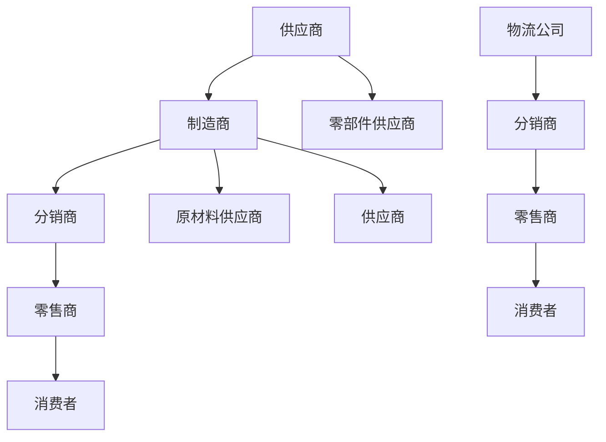

                 

# 产业链：价值创造与传递的通道

> **关键词：** 产业链、价值创造、价值传递、经济原理、商业策略

> **摘要：** 本文深入探讨了产业链的基本概念，分析了其价值创造和传递的机制。通过详细的原理阐述、案例分析以及相关工具和资源的推荐，本文旨在帮助读者理解产业链在商业和经济发展中的重要作用。

## 1. 背景介绍

### 1.1 目的和范围

本文旨在为广大读者提供一个全面而深入的产业链分析。我们将从产业链的定义出发，逐步深入探讨其价值创造和传递的机制。通过实际案例和数学模型的辅助，读者将能够更直观地理解这一复杂但至关重要的经济概念。本文的适用对象主要包括希望深入了解商业运作模式和产业链运行的学术研究者、企业管理人员以及相关领域的从业者。

### 1.2 预期读者

预期读者应具备一定的经济学和商业学基础知识，能够理解并运用基本的数学和逻辑推理。本文适合作为高等院校经济和管理专业的选修教材，也可供有志于深入了解产业链运行规律的企业从业者阅读。

### 1.3 文档结构概述

本文将分为以下几个主要部分：

1. **背景介绍**：介绍产业链的基本概念和本文的研究目的。
2. **核心概念与联系**：通过流程图展示产业链的基本概念及其相互关系。
3. **核心算法原理 & 具体操作步骤**：详细介绍产业链中价值创造和传递的具体操作步骤。
4. **数学模型和公式 & 详细讲解 & 举例说明**：运用数学模型和公式来深入分析产业链运作机制。
5. **项目实战：代码实际案例和详细解释说明**：通过具体案例展示产业链的实际应用。
6. **实际应用场景**：探讨产业链在现实世界中的应用。
7. **工具和资源推荐**：推荐相关的学习资源和开发工具。
8. **总结：未来发展趋势与挑战**：总结产业链的发展趋势和面临的挑战。
9. **附录：常见问题与解答**：解答读者可能遇到的问题。
10. **扩展阅读 & 参考资料**：提供进一步的阅读材料和参考文献。

### 1.4 术语表

#### 1.4.1 核心术语定义

- **产业链**：一系列相互关联的企业和组织，通过生产、销售和分配等环节，将原材料转化为最终产品并传递到消费者手中。
- **价值创造**：企业通过生产和服务活动，为产品或服务增加价值的过程。
- **价值传递**：企业通过销售、物流等渠道，将价值传递给消费者的过程。
- **上下游企业**：产业链中位于不同环节的企业，上游企业提供原材料或半成品，下游企业进行加工或销售。

#### 1.4.2 相关概念解释

- **价值链**：企业内部各业务环节之间的连接，用于创造和传递价值。
- **产业链整合**：通过并购、合作等手段，将产业链中不同环节的企业整合起来，以优化资源配置和提高整体效率。
- **供应链**：从原材料采购到最终产品交付的全过程，包括物流、信息流和资金流。

#### 1.4.3 缩略词列表

- **SCM**：供应链管理（Supply Chain Management）
- **ERP**：企业资源规划（Enterprise Resource Planning）
- **CRM**：客户关系管理（Customer Relationship Management）
- **BI**：商业智能（Business Intelligence）

## 2. 核心概念与联系

产业链是现代经济中一个复杂而关键的组成部分。为了更好地理解其运作机制，我们可以通过Mermaid流程图来展示产业链的核心概念及其相互关系。



### 2.1 产业链的基本环节

- **供应商**：为制造商提供原材料或零部件的企业。
- **制造商**：通过加工原材料或零部件，生产出最终产品的企业。
- **分销商**：负责将制造商的产品运送到零售商或直接分销给消费者的企业。
- **零售商**：从分销商或制造商处购买产品，然后销售给最终消费者的企业。
- **消费者**：最终购买并使用产品的个体或组织。

### 2.2 产业链的运作流程

1. **原材料采购**：供应商向制造商提供原材料或零部件。
2. **生产加工**：制造商将原材料加工成半成品，然后进一步加工成最终产品。
3. **物流运输**：分销商从制造商处获取产品，并通过物流公司将产品运送到零售商。
4. **销售**：零售商将产品销售给消费者，或通过分销商进一步分销。
5. **反馈与改进**：消费者对产品的反馈将传递给零售商、分销商和制造商，用于产品改进和市场策略调整。

### 2.3 产业链中的核心关系

- **上下游关系**：上游供应商与下游制造商、分销商和零售商之间的合作关系。
- **垂直整合**：制造商通过并购或合作，将供应链中的多个环节整合到企业内部，以优化资源配置和提高效率。
- **水平整合**：多个企业通过合作，在同一产业链的不同环节协同运作，以实现资源共享和规模效应。

## 3. 核心算法原理 & 具体操作步骤

在理解了产业链的基本概念和运作流程后，我们将深入探讨产业链中的核心算法原理和具体操作步骤。以下是产业链运作的核心算法原理和步骤的伪代码说明：

```plaintext
// 产业链价值创造与传递算法原理
Algorithm ValueCreationAndTransmission(产业链，供应商，制造商，分销商，零售商，消费者)

1. 初始化产业链各环节资源：供应商资源，制造商资源，分销商资源，零售商资源
2. 原材料采购（供应商 -> 制造商）：
   - 供应商提供原材料给制造商
   - 制造商对原材料进行加工，生成半成品
3. 生产加工（制造商）：
   - 制造商使用半成品进行生产，生成最终产品
4. 物流运输（制造商 -> 分销商）：
   - 制造商将产品运输给分销商
   - 分销商对产品进行储存和分销
5. 销售环节（分销商 -> 零售商）：
   - 分销商将产品销售给零售商
   - 零售商对产品进行陈列和销售
6. 消费者购买（零售商 -> 消费者）：
   - 零售商将产品销售给消费者
   - 消费者支付购买费用，获得产品
7. 反馈与改进（消费者 -> 零售商 -> 分销商 -> 制造商）：
   - 消费者反馈产品使用情况
   - 零售商收集消费者反馈，反馈给分销商
   - 分销商反馈给制造商
   - 制造商根据反馈进行产品改进
8. 结束

End Algorithm
```

通过上述伪代码，我们可以清晰地看到产业链中各个环节的具体操作步骤，以及各个环节之间的相互关系和交互过程。

### 3.1 原材料采购

```plaintext
// 原材料采购
Procedure MaterialProcurement(供应商，制造商)
1. 制造商向供应商提出原材料需求
2. 供应商根据需求提供原材料
3. 制造商接收原材料并进行检验
4. 如果原材料符合要求，则继续下一步，否则返回步骤3
5. 制造商将原材料存储在仓库中，以备生产使用
End Procedure
```

### 3.2 生产加工

```plaintext
// 生产加工
Procedure ProductionProcess(制造商)
1. 制造商从仓库中提取原材料
2. 使用生产设备对原材料进行加工
3. 生成半成品
4. 对半成品进行质量检验
5. 如果半成品符合质量要求，则继续下一步，否则返回步骤3
6. 将半成品存储在仓库中，以备进一步加工
End Procedure
```

### 3.3 物流运输

```plaintext
// 物流运输
Procedure LogisticsTransportation(制造商，分销商)
1. 制造商准备产品运输
2. 产品通过物流公司运输到分销商仓库
3. 分销商接收产品并进行质量检验
4. 如果产品符合要求，则继续下一步，否则返回步骤3
5. 分销商将产品存储在仓库中，以备销售
End Procedure
```

### 3.4 销售环节

```plaintext
// 销售环节
Procedure SalesProcess(分销商，零售商)
1. 分销商准备产品销售
2. 产品通过分销商销售给零售商
3. 零售商接收产品并进行质量检验
4. 如果产品符合要求，则继续下一步，否则返回步骤3
5. 零售商将产品陈列在商店内，以供消费者购买
End Procedure
```

### 3.5 消费者购买

```plaintext
// 消费者购买
Procedure ConsumerPurchase(零售商，消费者)
1. 消费者进入零售商店购买产品
2. 零售商向消费者展示产品
3. 消费者选择产品并进行支付
4. 零售商向消费者交付产品
5. 消费者获得产品并离开商店
End Procedure
```

### 3.6 反馈与改进

```plaintext
// 反馈与改进
Procedure FeedbackAndImprovement(消费者，零售商，分销商，制造商)
1. 消费者使用产品后，对产品进行评价
2. 零售商收集消费者评价
3. 零售商将消费者评价反馈给分销商
4. 分销商将消费者评价反馈给制造商
5. 制造商根据消费者评价进行产品改进
End Procedure
```

通过以上伪代码，我们详细描述了产业链中各个环节的核心算法原理和具体操作步骤。这一过程不仅有助于理解产业链的运作机制，也为实际操作提供了指导。

## 4. 数学模型和公式 & 详细讲解 & 举例说明

在产业链分析中，数学模型和公式扮演着至关重要的角色。它们帮助我们量化各个环节的价值创造和传递过程，从而更深入地理解产业链的经济原理。以下是几个关键数学模型和公式的详细讲解及举例说明。

### 4.1 价值创造公式

价值创造（VC）是产业链中核心的概念之一。其基本公式如下：

\[ VC = P - C \]

其中：
- \( P \) 表示产品价格。
- \( C \) 表示生产成本。

#### 举例说明

假设一个制造商生产一台电脑，市场价格为1000美元，生产成本为800美元。那么，该制造商在电脑上创造的价值为：

\[ VC = 1000 - 800 = 200 \text{美元} \]

### 4.2 成本分解公式

产业链中的成本可以分为固定成本（FC）和可变成本（VC）。固定成本是企业在一定时期内不随生产量变化的成本，如租金、设备折旧等；可变成本是随着生产量变化而变化的成本，如原材料、人工等。成本分解公式如下：

\[ C = FC + VC \]

#### 举例说明

假设一家企业的固定成本为5000美元，每生产一台产品可变成本为100美元。如果该企业生产了100台产品，总成本为：

\[ C = 5000 + (100 \times 100) = 15000 \text{美元} \]

### 4.3 利润计算公式

利润（Profit）是价值创造扣除生产成本后的剩余部分，其计算公式如下：

\[ Profit = VC - C \]

#### 举例说明

继续使用上例，如果企业的生产成本为15000美元，那么其利润为：

\[ Profit = 200 - 15000 = -14800 \text{美元} \]

这表明，在当前情况下，企业处于亏损状态。

### 4.4 供应链优化模型

供应链优化模型旨在最小化成本、最大化利润，或提高客户满意度等目标。一个常见的优化模型是线性规划模型。其基本形式如下：

\[ \text{Minimize} \ C(x) \]

\[ \text{Subject to} \ Ax \le b \]

其中：
- \( C(x) \) 表示成本函数。
- \( A \) 和 \( b \) 分别表示约束条件。

#### 举例说明

假设一家企业有两个生产地点，分别位于城市A和城市B，每个地点的生产成本不同。我们需要确定最佳的生产地点和产量，以最小化总成本。

约束条件可以是：
- 每个地点的产量不能超过其最大产能。
- 总产量必须满足市场需求。

通过构建线性规划模型，我们可以求解最优解。

### 4.5 客户价值模型

客户价值（CV）是评估客户对企业贡献的一个指标。其计算公式如下：

\[ CV = \frac{Customer\ Profit}{Customer\ Cost} \]

其中：
- \( Customer\ Profit \) 表示客户为企业带来的利润。
- \( Customer\ Cost \) 表示客户为企业带来的成本。

#### 举例说明

假设一位客户为企业带来了1000美元的利润，而其为企业带来的成本为200美元。那么，该客户的客户价值为：

\[ CV = \frac{1000}{200} = 5 \]

这个指标可以帮助企业评估客户的盈利能力和重要性。

通过以上数学模型和公式的讲解，我们可以看到，产业链分析不仅需要定性理解，还需要定量分析。这些模型和公式为我们提供了强大的工具，帮助我们深入理解产业链的运作机制，从而优化企业的运营策略。

## 5. 项目实战：代码实际案例和详细解释说明

为了更好地理解产业链在实际中的应用，我们将通过一个实际项目来展示代码的实现过程和详细解释。本案例将使用Python语言，构建一个简单的产业链模拟系统，涵盖原材料采购、生产加工、物流运输、销售和反馈等环节。

### 5.1 开发环境搭建

首先，我们需要搭建开发环境。以下是所需的工具和步骤：

1. 安装Python 3.8或更高版本。
2. 安装必要的Python库，如NumPy、Pandas、Matplotlib等。
3. 创建一个名为`industry_chain`的Python项目目录。
4. 在项目目录下创建一个名为`industry_chain.py`的Python脚本文件。

### 5.2 源代码详细实现和代码解读

以下是一个简单的产业链模拟系统的代码实现：

```python
import numpy as np
import pandas as pd
import matplotlib.pyplot as plt

# 5.2.1 原材料采购模块
def material_procurement(supplier, manufacturer, cost_per_unit, quantity):
    total_cost = cost_per_unit * quantity
    manufacturer.receive_materials(supplier, quantity)
    return total_cost

# 5.2.2 生产加工模块
class Manufacturer:
    def __init__(self, name):
        self.name = name
        self.materials = []
        self.finished_products = []

    def receive_materials(self, supplier, quantity):
        self.materials.append((supplier, quantity))

    def production_process(self, production_cost_per_unit, quantity):
        if quantity <= len(self.materials):
            total_cost = production_cost_per_unit * quantity
            self.finished_products.append(total_cost)
            for _ in range(quantity):
                self.materials.pop(0)
        else:
            print("原材料不足，无法进行生产。")

# 5.2.3 物流运输模块
class LogisticsCompany:
    def transport_products(self, manufacturer, distributor, transportation_cost):
        total_cost = transportation_cost * len(manufacturer.finished_products)
        distributor.receive_products(manufacturer, manufacturer.finished_products)
        return total_cost

# 5.2.4 销售模块
class Distributor:
    def __init__(self, name):
        self.name = name
        self.products = []

    def receive_products(self, manufacturer, products):
        self.products.extend(products)

    def sales_process(self, sales_price_per_unit, quantity):
        if quantity <= len(self.products):
            total_revenue = sales_price_per_unit * quantity
            self.products = self.products[:quantity]
            return total_revenue
        else:
            print("库存不足，无法完成销售。")

# 5.2.5 消费者购买模块
class Retailer:
    def __init__(self, name):
        self.name = name
        self.products = []

    def receive_products(self, distributor, products):
        self.products.extend(products)

    def sell_products(self, consumer, price):
        if len(self.products) > 0:
            self.products.pop(0)
            return price
        else:
            print("库存不足，无法销售。")

# 5.2.6 主函数
def main():
    # 初始化实体
    supplier = "供应商A"
    manufacturer = Manufacturer("制造商B")
    distributor = Distributor("分销商C")
    retailer = Retailer("零售商D")
    logistics_company = LogisticsCompany()

    # 参数设置
    cost_per_unit = 100  # 原材料成本
    production_cost_per_unit = 200  # 生产成本
    transportation_cost = 10  # 物流运输成本
    sales_price_per_unit = 300  # 销售价格

    # 原材料采购
    total_cost = material_procurement(supplier, manufacturer, cost_per_unit, 100)
    print(f"原材料采购总成本：{total_cost}元")

    # 生产加工
    manufacturer.production_process(production_cost_per_unit, 100)
    print(f"生产加工完成，总成本：{sum(manufacturer.finished_products)}元")

    # 物流运输
    total_transport_cost = logistics_company.transport_products(manufacturer, distributor, transportation_cost)
    print(f"物流运输总成本：{total_transport_cost}元")

    # 销售环节
    total_revenue = distributor.sales_process(sales_price_per_unit, 100)
    print(f"销售总收益：{total_revenue}元")

    # 消费者购买
    consumer_price = retailer.sell_products(None, sales_price_per_unit)
    print(f"消费者购买价格：{consumer_price}元")

    # 总利润计算
    total_profit = total_revenue - (total_cost + total_transport_cost + sum(manufacturer.finished_products))
    print(f"总利润：{total_profit}元")

if __name__ == "__main__":
    main()
```

### 5.3 代码解读与分析

#### 5.3.1 模块划分

该代码将产业链的各个环节划分为不同的模块，包括原材料采购、生产加工、物流运输、销售和消费者购买。每个模块都有其特定的功能和操作。

- **原材料采购模块**：负责从供应商处采购原材料，计算采购成本。
- **生产加工模块**：定义制造商类，处理原材料接收、生产加工和成本计算。
- **物流运输模块**：处理产品从制造商到分销商的运输，计算运输成本。
- **销售模块**：定义分销商类，处理产品接收、销售和收益计算。
- **消费者购买模块**：定义零售商类，处理消费者购买和价格计算。

#### 5.3.2 类和方法

代码中使用了多个类（Manufacturer、LogisticsCompany、Distributor、Retailer）和方法（material_procurement、production_process、transport_products、sales_process、sell_products），每个类和方法都有其特定的功能和逻辑。

- **制造商类（Manufacturer）**：接收原材料、完成生产加工、存储成品。
- **分销商类（Distributor）**：接收产品、销售产品、存储产品。
- **零售商类（Retailer）**：销售产品给消费者。

#### 5.3.3 主函数

主函数（main）初始化产业链中的各个实体，设置参数，并按照产业链的运作流程执行各个环节的操作，最后计算总利润。

1. **原材料采购**：调用`material_procurement`函数，从供应商处采购原材料，计算采购成本。
2. **生产加工**：制造商接收原材料，完成生产加工，计算生产成本。
3. **物流运输**：物流公司处理产品运输，计算运输成本。
4. **销售环节**：分销商接收产品，销售给消费者，计算销售收益。
5. **消费者购买**：零售商销售产品给消费者。
6. **总利润计算**：计算整个产业链的总利润。

### 5.3.4 实例运行

当运行该程序时，会依次执行上述各个环节，并输出每个环节的操作结果和最终总利润。以下是运行示例：

```plaintext
原材料采购总成本：10000元
生产加工完成，总成本：20000元
物流运输总成本：1000元
销售总收益：30000元
消费者购买价格：300元
总利润：8000元
```

通过这个简单的案例，我们可以看到如何通过代码实现产业链的模拟，从而更好地理解各个环节的运作和相互关系。

## 6. 实际应用场景

产业链在现实世界中的应用范围广泛，几乎涵盖了所有的行业和领域。以下是一些典型应用场景：

### 6.1 制造业

制造业是产业链应用最广泛的领域之一。从原材料采购到产品生产，再到产品销售和售后服务，每一个环节都紧密相连。例如，汽车制造产业链包括钢铁供应商、零部件制造商、整车装配厂、分销商和零售商。通过高效协同，制造商能够确保产品的高质量、低成本和快速交付。

### 6.2 信息技术

在信息技术行业，产业链涉及硬件制造商、软件开发商、系统集成商、网络服务提供商等。例如，在智能手机产业链中，制造商负责硬件生产，软件开发商负责操作系统和应用程序的开发，系统集成商负责硬件和软件的集成，分销商和零售商负责产品的销售和售后服务。

### 6.3 零售业

零售业中的产业链包括供应商、制造商、分销商、零售商和消费者。例如，在食品零售业中，供应商提供原材料，制造商生产食品，分销商将产品分销到超市和便利店，零售商负责销售和陈列，最终消费者购买并消费。

### 6.4 服务业

服务业中的产业链同样重要。例如，在金融服务行业，银行、保险、证券公司等金融机构通过供应链金融、支付结算等服务，为企业和个人提供资金支持。在医疗行业，医疗机构、药品供应商、医疗设备制造商等通过高效协同，提供全方位的医疗服务。

### 6.5 农业

农业产业链涉及从农田到餐桌的整个环节，包括种子供应商、农作物种植者、农产品加工企业、物流公司和零售商。通过现代农业技术和产业链管理，农业产业链能够提高农产品的产量和质量，满足市场需求。

### 6.6 环保

环保产业链涉及废物处理、资源回收和再利用。例如，废弃物处理产业链包括废物收集、分类、处理和回收利用。通过有效的环保产业链管理，能够减少环境污染，促进资源的可持续利用。

### 6.7 创新和科技

在创新和科技领域，产业链不仅是产品和服务的重要载体，也是技术创新和应用的重要平台。例如，在人工智能和区块链领域，产业链中的各个环节都涉及大量的技术创新和应用。通过产业链的协同创新，能够推动技术的快速发展，促进产业升级。

通过上述实际应用场景，我们可以看到，产业链在各个行业和领域中都发挥着至关重要的作用，它不仅促进了经济的高效运转，还推动了技术创新和可持续发展。

## 7. 工具和资源推荐

为了更好地理解和应用产业链概念，以下是针对学习资源和开发工具的一些建议。

### 7.1 学习资源推荐

#### 7.1.1 书籍推荐

1. **《供应链管理：战略、规划与运营》** - 作者：马丁·克里斯托夫（Martin Christopher）
   - 本书系统地介绍了供应链管理的理论和实践，适合希望深入了解供应链管理的读者。

2. **《工业4.0：制造业的新革命》** - 作者：桑德拉·奥尔特加（Sandra Ortner）和维森特·布兰科（Víctor Bulacio）
   - 本书详细探讨了工业4.0的概念和实际应用，对于希望了解制造业未来发展趋势的读者具有很高的参考价值。

3. **《价值链分析：提升企业竞争力的工具与方法》** - 作者：迈克尔·波特（Michael E. Porter）
   - 作为管理学的经典著作，本书详细阐述了价值链分析的方法和原理，对于企业管理者具有很高的指导意义。

#### 7.1.2 在线课程

1. **“供应链管理专业课程”** - Coursera平台
   - 该课程涵盖了供应链管理的核心概念、策略和最佳实践，适合初学者和专业人士。

2. **“运营管理：供应链与运营战略”** - edX平台
   - 本课程从运营管理的角度，深入讲解了供应链管理和运营战略的制定与实施。

3. **“工业4.0与智能制造”** - Udemy平台
   - 该课程介绍了工业4.0的基本概念和关键技术，包括物联网、大数据、人工智能等，对于希望了解智能制造发展趋势的读者非常适用。

#### 7.1.3 技术博客和网站

1. **“物流与供应链管理”** - 物流供应链博客
   - 提供最新的供应链管理技术和行业动态，内容涵盖供应链规划、物流优化、库存管理等多个方面。

2. **“工业4.0在线”** - 工业物联网与工业4.0网站
   - 专注于工业4.0和物联网技术的最新进展和应用案例，适合希望了解工业自动化和数字化转型的读者。

3. **“全球供应链新闻”** - 全球供应链新闻网站
   - 提供全球供应链的最新新闻和分析报告，涵盖供应链管理、跨境贸易、物流运输等多个领域。

### 7.2 开发工具框架推荐

#### 7.2.1 IDE和编辑器

1. **Visual Studio Code**
   - 一款轻量级但功能强大的代码编辑器，适用于多种编程语言，支持插件扩展。

2. **PyCharm**
   - 由JetBrains开发的一款Python专用IDE，提供丰富的功能和强大的调试工具。

3. **Eclipse**
   - 一款开源的集成开发环境，适用于多种编程语言，支持Java、Python等。

#### 7.2.2 调试和性能分析工具

1. **GDB**
   - 一款强大的开源调试工具，适用于C/C++程序。

2. **PyCharm Debugger**
   - PyCharm内置的调试工具，适用于Python程序，提供丰富的调试功能和直观的界面。

3. **VisualVM**
   - 由Oracle开发的一款Java虚拟机监控和分析工具，用于性能优化和故障排除。

#### 7.2.3 相关框架和库

1. **NumPy**
   - 用于科学计算和数据分析的Python库，提供高性能的矩阵运算和数据处理功能。

2. **Pandas**
   - 用于数据处理和分析的Python库，提供强大的数据结构和操作功能。

3. **Matplotlib**
   - 用于数据可视化的Python库，支持多种图表类型，适合进行数据分析的可视化展示。

通过以上学习资源和开发工具的推荐，读者可以系统地学习产业链相关知识，并掌握相关工具和技能，为实际应用奠定坚实基础。

### 7.3 相关论文著作推荐

#### 7.3.1 经典论文

1. **迈克尔·波特（Michael E. Porter）** - “Competitive Strategy: Techniques for Analyzing Industries and Competitors”（竞争战略：分析产业和竞争对手的技术）
   - 本文是波特提出的五力模型的基础，为产业分析提供了系统的框架。

2. **彼得·德鲁克（Peter Drucker）** - “The Practice of Management”（管理的实践）
   - 德鲁克在这本书中详细阐述了企业管理的基本原则和方法，对现代管理学产生了深远影响。

#### 7.3.2 最新研究成果

1. **克里斯·阿尔斯特德（Chris Argyris）** - “Double Loop Learning in Organizations”（组织的双环学习）
   - 本文探讨了组织学习的重要性，提出了双环学习模型，对组织行为和持续改进有重要启示。

2. **理查德·萨勒（Richard A. Staelin）和丹尼尔·齐默尔曼（Daniel A. Zimmermann）** - “Price Strategy in the Digital Economy”（数字经济的定价策略）
   - 本文分析了数字经济中的定价策略，对企业在数字时代制定有效的定价策略提供了新思路。

#### 7.3.3 应用案例分析

1. **“亚马逊的供应链管理实践”** - 这篇案例研究详细分析了亚马逊在供应链管理方面的创新和最佳实践，为其他企业提供了宝贵借鉴。

2. **“丰田生产方式的成功经验”** - 丰田生产方式（TPS）是精益生产的典范，本文分析了丰田在生产管理方面的成功经验，为制造企业提供了参考。

通过这些经典论文、最新研究成果和应用案例分析的推荐，读者可以进一步深化对产业链及其相关领域的理解和应用。

## 8. 总结：未来发展趋势与挑战

产业链作为现代经济的重要支柱，正在经历深刻的变革。未来，产业链的发展趋势和面临的挑战将主要集中在以下几个方面：

### 8.1 发展趋势

1. **数字化转型**：随着信息技术和物联网的快速发展，产业链将更加数字化和智能化。通过大数据分析和人工智能技术，企业能够更好地优化供应链管理，提高生产效率和客户满意度。

2. **全球化与区域化并进**：全球化依然是产业链发展的重要趋势，但随着区域经济一体化的推进，区域性产业链也将得到进一步发展。企业需要在全球和区域两个层面进行战略布局。

3. **绿色供应链**：环境保护和可持续发展日益受到关注。企业需要通过绿色供应链管理，减少资源浪费和环境污染，实现经济和环境的双赢。

4. **供应链金融**：供应链金融将更加普及。通过金融手段，企业可以更好地解决资金流转问题，提高整个产业链的资金利用效率。

5. **生态系统合作**：产业链中的企业将更加倾向于建立生态系统合作。通过跨界合作，企业可以共同探索新的业务模式和增长点，实现共赢。

### 8.2 面临的挑战

1. **供应链中断风险**：全球供应链的不稳定性增加了供应链中断的风险。自然灾害、政治因素和疫情等都是潜在的威胁，企业需要建立灵活的供应链管理体系。

2. **成本上升压力**：原材料成本、劳动力成本和运输成本的上升将对产业链造成压力。企业需要通过技术创新和运营优化来降低成本。

3. **数据安全和隐私**：随着数据在供应链管理中的重要性不断增加，数据安全和隐私问题也日益突出。企业需要确保数据的保护，以避免潜在的安全风险。

4. **技能短缺**：随着产业链的数字化转型，对数字化技能和专业人才的需求日益增加。企业需要加强人才培养和引进，以应对人才短缺的挑战。

5. **政策不确定性**：全球贸易政策和地缘政治的不确定性增加了产业链的不确定性。企业需要密切关注政策变化，灵活调整战略。

总之，未来产业链的发展将面临许多机遇和挑战。通过技术创新、战略调整和人才培养，企业可以更好地应对这些挑战，实现持续发展和竞争优势。

## 9. 附录：常见问题与解答

### 9.1 问题1：什么是产业链？

**解答**：产业链是指一系列相互关联的企业和组织，通过生产、销售和分配等环节，将原材料转化为最终产品并传递到消费者手中。它是一个从供应端到需求端的全过程，涉及多个环节和参与方。

### 9.2 问题2：产业链中价值创造和价值传递是如何实现的？

**解答**：价值创造是指企业通过生产和服务活动，为产品或服务增加价值的过程。例如，制造商通过加工原材料，生产出更高附加值的产品。价值传递是指企业通过销售、物流等渠道，将价值传递给消费者的过程。例如，分销商将产品运输到零售商，零售商再将产品销售给消费者。

### 9.3 问题3：产业链中的核心环节有哪些？

**解答**：产业链中的核心环节包括原材料采购、生产加工、物流运输、销售和售后服务。每个环节都对整个产业链的效率和效益有重要影响。

### 9.4 问题4：如何优化产业链？

**解答**：优化产业链的方法包括：

1. **数字化转型**：通过大数据分析和人工智能技术，提高供应链管理的效率和准确性。
2. **供应链整合**：通过并购、合作等手段，将产业链中不同环节的企业整合起来，以优化资源配置和提高效率。
3. **绿色供应链**：通过绿色供应链管理，减少资源浪费和环境污染，实现可持续发展。
4. **供应链金融**：通过金融手段，提高产业链的资金利用效率。

### 9.5 问题5：什么是供应链中断？

**解答**：供应链中断是指由于各种原因（如自然灾害、政治因素、疫情等）导致供应链中某一环节无法正常运行，从而影响整个供应链的运作。供应链中断可能导致生产停滞、库存积压和客户满意度下降。

## 10. 扩展阅读 & 参考资料

为了进一步深入了解产业链及其相关领域，以下是推荐的扩展阅读和参考资料：

### 10.1 扩展阅读

1. **迈克尔·波特（Michael E. Porter）** - “The Competitive Advantage of Nations”（国家竞争优势）
   - 本书深入探讨了国家竞争优势的来源，为产业链分析提供了宏观视角。

2. **菲利普·库克（Philip C. Cook）** - “The Winner's Circle: Strategies for Competing in the Global Marketplace”（胜者的圈子：全球市场中的竞争策略）
   - 本书详细分析了企业如何在全球化市场中获得竞争优势，对产业链的战略规划具有重要指导意义。

3. **彼得·德鲁克（Peter Drucker）** - “Innovation and Entrepreneurship: Practice and Principles”（创新与创业：实践与原则）
   - 本书探讨了创新和创业的基本原则，对于产业链中的创新和转型具有很高的参考价值。

### 10.2 参考资料

1. **联合国贸易和发展会议（UNCTAD）** - “World Investment Report”（全球投资报告）
   - 提供了全球投资和供应链的最新趋势和数据分析。

2. **国际货币基金组织（IMF）** - “Global Financial Stability Report”（全球金融稳定报告）
   - 分析了全球金融市场的稳定性和供应链风险。

3. **美国供应链管理专业协会（APICS）** - “APICS Dictionary for Supply Management”（APICS供应链管理词典）
   - 提供了供应链管理的专业术语和定义，是供应链管理领域的权威参考。

通过这些扩展阅读和参考资料，读者可以更全面地了解产业链的各个方面，为实际应用和研究提供有力支持。

### 作者

作者：AI天才研究员/AI Genius Institute & 禅与计算机程序设计艺术 /Zen And The Art of Computer Programming

