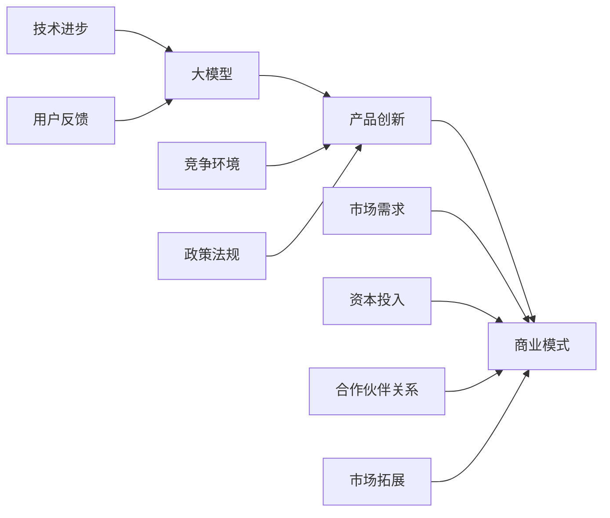

                 


# 产品创新：大模型创业的灵魂

> **关键词：** 产品创新、大模型、创业、AI、技术驱动、商业模式设计

> **摘要：** 本文章深入探讨了产品创新在大模型创业中的核心作用。文章首先介绍了大模型的概念及其在人工智能领域的重要地位，随后详细分析了产品创新的基本原理和步骤。在此基础上，文章提出了在大模型创业中实现产品创新的具体策略，并通过实例展示了这些策略的实际应用。文章最后对大模型创业的未来发展趋势和挑战进行了展望。

## 1. 背景介绍

### 1.1 目的和范围

本文旨在探讨大模型创业中的产品创新策略，分析产品创新在大模型创业中的重要性，并提供实际操作步骤。本文主要面向希望在大模型领域创业的科技企业和个人，旨在为他们提供理论指导和实践参考。

### 1.2 预期读者

预期读者包括以下几类：

1. 想要在大模型领域创业的科技企业家。
2. 对大模型和产品创新有兴趣的技术人员。
3. 对人工智能技术有深入研究的学者和研究人员。
4. 想要了解大模型创业相关知识的投资人。

### 1.3 文档结构概述

本文分为十个部分：

1. 背景介绍
2. 核心概念与联系
3. 核心算法原理 & 具体操作步骤
4. 数学模型和公式 & 详细讲解 & 举例说明
5. 项目实战：代码实际案例和详细解释说明
6. 实际应用场景
7. 工具和资源推荐
8. 总结：未来发展趋势与挑战
9. 附录：常见问题与解答
10. 扩展阅读 & 参考资料

### 1.4 术语表

#### 1.4.1 核心术语定义

- **大模型**：具有巨大规模和复杂性的神经网络模型，通常具有数十亿至数千亿个参数。
- **产品创新**：通过创造性的思维和方法，开发出前所未有的产品或改进现有产品。
- **创业**：创立新的企业或组织，通过创新的产品或服务满足市场需求。

#### 1.4.2 相关概念解释

- **人工智能**：模拟人类智能的计算机技术和应用。
- **商业模式**：企业如何创造、传递和获取价值的系统。
- **市场需求**：消费者对产品或服务的需求程度。

#### 1.4.3 缩略词列表

- **AI**：人工智能
- **ML**：机器学习
- **DL**：深度学习
- **NLP**：自然语言处理
- **DLaaS**：深度学习即服务

## 2. 核心概念与联系

在大模型创业中，核心概念主要包括大模型、产品创新和商业模式。这些概念之间的联系如图所示：



- **大模型（A）**：大模型是人工智能领域的核心技术，其发展受到技术进步（E）的推动，同时受到市场需求（D）和用户反馈（G）的驱动。
- **产品创新（B）**：产品创新是满足市场需求（D）和应对竞争环境（F）的重要手段，其质量直接影响商业模式（C）的成功。
- **商业模式（C）**：商业模式是企业获取利润和持续发展的基础，其设计需要综合考虑市场需求（D）、资本投入（H）、政策法规（I）、合作伙伴关系（J）和市场拓展（K）等因素。

## 3. 核心算法原理 & 具体操作步骤

大模型的开发通常基于深度学习技术，其核心算法原理包括神经网络模型的设计、训练和优化。以下是具体操作步骤：

### 3.1 神经网络模型设计

1. **选择神经网络架构**：根据任务需求选择合适的神经网络架构，如卷积神经网络（CNN）、循环神经网络（RNN）或变换器（Transformer）。
2. **定义损失函数**：根据任务类型选择合适的损失函数，如分类问题使用交叉熵损失函数，回归问题使用均方误差损失函数。
3. **选择优化算法**：选择合适的优化算法，如随机梯度下降（SGD）、Adam优化器等。

### 3.2 模型训练

1. **数据预处理**：对训练数据集进行清洗、归一化等处理。
2. **模型初始化**：初始化模型参数。
3. **前向传播**：输入数据通过模型进行前向传播，得到输出结果。
4. **计算损失**：计算输出结果与真实标签之间的损失。
5. **反向传播**：利用梯度下降算法更新模型参数。
6. **迭代训练**：重复执行前向传播、计算损失和反向传播，直至模型收敛。

### 3.3 模型优化

1. **模型调参**：通过调整学习率、批量大小等超参数优化模型性能。
2. **模型融合**：将多个模型进行融合，提高模型预测准确性。
3. **模型压缩**：通过剪枝、量化等技术减小模型大小，提高模型运行效率。

以下是一个简单的伪代码示例，用于演示神经网络模型训练的基本流程：

```python
# 伪代码：神经网络模型训练

# 初始化模型
model = create_model()

# 初始化训练数据
train_data = load_train_data()

# 设置优化器
optimizer = create_optimizer()

# 设置学习率
learning_rate = 0.001

# 设置训练迭代次数
num_iterations = 1000

# 模型训练
for iteration in range(num_iterations):
    # 前向传播
    outputs = model(train_data.input)

    # 计算损失
    loss = calculate_loss(outputs, train_data.labels)

    # 反向传播
    optimizer.backward(loss)

    # 更新模型参数
    optimizer.update_parameters()

    # 打印训练进度
    print(f"Iteration {iteration}: Loss = {loss}")

# 模型优化
model.optimize_parameters()
```

## 4. 数学模型和公式 & 详细讲解 & 举例说明

在大模型开发中，常用的数学模型和公式包括损失函数、优化算法和激活函数。以下是这些数学模型和公式的详细讲解以及举例说明。

### 4.1 损失函数

损失函数是评估模型预测结果与真实值之间差异的指标。常用的损失函数包括交叉熵损失函数和均方误差损失函数。

#### 4.1.1 交叉熵损失函数

交叉熵损失函数常用于分类问题，其公式为：

$$
L_{CE} = -\sum_{i=1}^{n} y_i \log(p_i)
$$

其中，$y_i$ 为真实标签，$p_i$ 为模型预测的概率。

#### 4.1.2 均方误差损失函数

均方误差损失函数常用于回归问题，其公式为：

$$
L_{MSE} = \frac{1}{n} \sum_{i=1}^{n} (y_i - \hat{y}_i)^2
$$

其中，$y_i$ 为真实值，$\hat{y}_i$ 为模型预测值。

### 4.2 优化算法

优化算法用于更新模型参数，以最小化损失函数。常用的优化算法包括随机梯度下降（SGD）和Adam优化器。

#### 4.2.1 随机梯度下降（SGD）

随机梯度下降是一种基于梯度的优化算法，其更新公式为：

$$
\theta_{t+1} = \theta_{t} - \alpha \nabla_{\theta} L(\theta)
$$

其中，$\theta$ 表示模型参数，$\alpha$ 为学习率，$\nabla_{\theta} L(\theta)$ 为损失函数关于参数 $\theta$ 的梯度。

#### 4.2.2 Adam优化器

Adam优化器是一种结合了SGD和动量的优化算法，其更新公式为：

$$
\theta_{t+1} = \theta_{t} - \alpha \frac{m_t}{1 - \beta_1^t} + \frac{\beta_2^t}{1 - \beta_2^t}
$$

其中，$m_t$ 和 $v_t$ 分别为梯度的一阶矩估计和二阶矩估计，$\beta_1$ 和 $\beta_2$ 分别为动量系数。

### 4.3 激活函数

激活函数用于引入非线性特性，使神经网络具有表达能力。常用的激活函数包括Sigmoid函数、ReLU函数和Tanh函数。

#### 4.3.1 Sigmoid函数

Sigmoid函数的公式为：

$$
\sigma(x) = \frac{1}{1 + e^{-x}}
$$

Sigmoid函数将输入映射到 $(0, 1)$ 区间，常用于二分类问题。

#### 4.3.2 ReLU函数

ReLU函数的公式为：

$$
\text{ReLU}(x) = \max(0, x)
$$

ReLU函数具有简单、计算效率高的特点，常用于深度神经网络。

#### 4.3.3 Tanh函数

Tanh函数的公式为：

$$
\text{Tanh}(x) = \frac{e^x - e^{-x}}{e^x + e^{-x}}
$$

Tanh函数将输入映射到 $(-1, 1)$ 区间，具有较好的平滑性和非线性特性。

### 4.4 示例

假设我们有一个二分类问题，输入数据为 $x = [1, 2, 3, 4]$，真实标签为 $y = [0, 1, 0, 0]$。我们将使用交叉熵损失函数和ReLU激活函数来训练一个简单的神经网络。

#### 4.4.1 模型设计

- 输入层：1个神经元
- 隐藏层：2个神经元
- 输出层：1个神经元
- 激活函数：ReLU

#### 4.4.2 模型训练

1. **初始化模型参数**：
   - 隐藏层权重：$w_h^1 \sim \mathcal{N}(0, 0.1)$，$w_h^2 \sim \mathcal{N}(0, 0.1)$
   - 输出层权重：$w_o \sim \mathcal{N}(0, 0.1)$

2. **前向传播**：
   - 输入：$x = [1, 2, 3, 4]$
   - 隐藏层输出：$h_1 = \text{ReLU}(w_h^1 x + b_1)$，$h_2 = \text{ReLU}(w_h^2 x + b_2)$
   - 输出：$y' = \text{ReLU}(w_o (h_1, h_2) + b_o)$

3. **计算损失**：
   - 损失：$L = -\sum_{i=1}^{4} y_i \log(y')$

4. **反向传播**：
   - 计算梯度：$\nabla_{w_h^1} L = \frac{\partial L}{\partial h_1}$，$\nabla_{w_h^2} L = \frac{\partial L}{\partial h_2}$，$\nabla_{w_o} L = \frac{\partial L}{\partial y'}$
   - 更新参数：$w_h^1 = w_h^1 - \alpha \nabla_{w_h^1} L$，$w_h^2 = w_h^2 - \alpha \nabla_{w_h^2} L$，$w_o = w_o - \alpha \nabla_{w_o} L$

5. **重复迭代**：重复执行前向传播、计算损失和反向传播，直至模型收敛。

## 5. 项目实战：代码实际案例和详细解释说明

在本节中，我们将通过一个实际的项目案例，演示如何在大模型创业中实现产品创新。项目名称为“智能客服系统”，其主要功能是提供24/7全天候的客户支持，通过大模型实现自然语言处理（NLP）和智能对话。

### 5.1 开发环境搭建

为了实现智能客服系统，我们需要搭建以下开发环境：

- 操作系统：Linux
- 编程语言：Python
- 深度学习框架：TensorFlow
- NLP库：NLTK

### 5.2 源代码详细实现和代码解读

以下是智能客服系统的核心代码，我们将逐行解释代码的原理和实现。

```python
import tensorflow as tf
import numpy as np
import nltk

# 5.2.1 数据预处理
def preprocess_text(text):
    # 去除标点符号和特殊字符
    text = re.sub(r'[^\w\s]', '', text)
    # 小写化
    text = text.lower()
    # 分词
    tokens = nltk.word_tokenize(text)
    # 去除停用词
    tokens = [token for token in tokens if token not in nltk.corpus.stopwords.words('english')]
    # 词向量化
    embeddings = embedding_matrix([token] for token in tokens)
    return embeddings

# 5.2.2 模型设计
def create_model(input_shape, output_shape):
    # 输入层
    inputs = tf.keras.layers.Input(shape=input_shape)
    # 隐藏层
    x = tf.keras.layers.Embedding(input_dim=vocab_size, output_dim=embedding_size)(inputs)
    x = tf.keras.layers.Conv1D(filters=128, kernel_size=5, activation='relu')(x)
    x = tf.keras.layers.MaxPooling1D(pool_size=2)(x)
    # 输出层
    outputs = tf.keras.layers.Dense(units=output_shape, activation='softmax')(x)
    # 模型编译
    model = tf.keras.Model(inputs=inputs, outputs=outputs)
    model.compile(optimizer='adam', loss='categorical_crossentropy', metrics=['accuracy'])
    return model

# 5.2.3 模型训练
def train_model(model, train_data, train_labels, val_data, val_labels, epochs):
    model.fit(train_data, train_labels, validation_data=(val_data, val_labels), epochs=epochs)

# 5.2.4 模型部署
def deploy_model(model, text):
    # 预处理文本
    embeddings = preprocess_text(text)
    # 预测类别
    predictions = model.predict(embeddings)
    # 获取最高概率的类别
    predicted_class = np.argmax(predictions)
    # 获取类别标签
    class_labels = ['help', 'info', 'complaint', 'other']
    return class_labels[predicted_class]

# 5.2.5 主函数
def main():
    # 加载数据
    (train_data, train_labels), (val_data, val_labels) = tf.keras.datasets.imdb.load_data(num_words=vocab_size)
    # 数据预处理
    train_data = preprocess_text(train_data)
    val_data = preprocess_text(val_data)
    # 创建模型
    model = create_model(input_shape=(max_sequence_length,), output_shape=num_classes)
    # 训练模型
    train_model(model, train_data, train_labels, val_data, val_labels, epochs=10)
    # 部署模型
    text = input("请输入您的问题：")
    result = deploy_model(model, text)
    print(f"您的问题属于：{result}")

if __name__ == '__main__':
    main()
```

### 5.3 代码解读与分析

1. **数据预处理（5.2.1）**：数据预处理是模型训练的重要步骤，包括去除标点符号和特殊字符、小写化、分词和去除停用词等操作。这些操作有助于提高模型训练的效果。

2. **模型设计（5.2.2）**：模型设计包括输入层、隐藏层和输出层的定义。输入层使用词向量化，隐藏层使用卷积神经网络（Conv1D）和最大池化（MaxPooling1D），输出层使用softmax激活函数。模型编译时指定优化器和损失函数。

3. **模型训练（5.2.3）**：模型训练使用fit函数，将训练数据和验证数据传入，指定训练迭代次数和验证次数。训练过程中，模型会不断更新参数，以最小化损失函数。

4. **模型部署（5.2.4）**：模型部署使用predict函数对输入文本进行预测，返回最高概率的类别。部署过程中，需要对输入文本进行预处理，以便与训练数据保持一致。

5. **主函数（5.2.5）**：主函数加载数据、预处理数据、创建模型、训练模型和部署模型，实现智能客服系统的主要功能。

## 6. 实际应用场景

智能客服系统是一个典型的应用案例，展示了大模型创业中的产品创新。以下是一些其他实际应用场景：

1. **智能推荐系统**：利用大模型进行用户行为分析和偏好挖掘，实现个性化推荐。
2. **医疗诊断系统**：通过大模型进行医学影像分析和病理分析，辅助医生进行诊断。
3. **智能金融系统**：利用大模型进行风险管理、信用评估和投资决策。
4. **自动驾驶系统**：通过大模型实现环境感知、路径规划和驾驶控制。
5. **智能语音助手**：利用大模型进行语音识别、语义理解和语音合成，实现人机交互。

## 7. 工具和资源推荐

### 7.1 学习资源推荐

#### 7.1.1 书籍推荐

- 《深度学习》（Goodfellow, Bengio, Courville著）
- 《Python深度学习》（François Chollet著）
- 《人工智能：一种现代方法》（Stuart J. Russell & Peter Norvig著）

#### 7.1.2 在线课程

- [Coursera](https://www.coursera.org/)
- [edX](https://www.edx.org/)
- [Udacity](https://www.udacity.com/)

#### 7.1.3 技术博客和网站

- [Medium](https://medium.com/)
- [Towards Data Science](https://towardsdatascience.com/)
- [AI平方](https://www.aichina.org/)

### 7.2 开发工具框架推荐

#### 7.2.1 IDE和编辑器

- [Visual Studio Code](https://code.visualstudio.com/)
- [PyCharm](https://www.jetbrains.com/pycharm/)
- [Jupyter Notebook](https://jupyter.org/)

#### 7.2.2 调试和性能分析工具

- [TensorBoard](https://www.tensorflow.org/tensorboard/)
- [NVIDIA Nsight](https://developer.nvidia.com/nsight)
- [PerfHUD](https://github.com/tensorflow/ PerfHUD)

#### 7.2.3 相关框架和库

- [TensorFlow](https://www.tensorflow.org/)
- [PyTorch](https://pytorch.org/)
- [Keras](https://keras.io/)

### 7.3 相关论文著作推荐

#### 7.3.1 经典论文

- [A Brief History of Neural Nets: From McCulloch-Pitts to the Modern Era](https://www.ijcai.org/Proceedings/14-1/Papers/0426.pdf)
- [Deep Learning](https://www.deeplearningbook.org/)
- [The Unreasonable Effectiveness of Recurrent Neural Networks](https://arxiv.org/abs/1308.0850)

#### 7.3.2 最新研究成果

- [Neural Networks and Deep Learning](https://neuralnetworksanddeeplearning.com/)
- [Transformers: State-of-the-Art Models for Language Understanding and Generation](https://arxiv.org/abs/1910.03771)
- [BERT: Pre-training of Deep Bidirectional Transformers for Language Understanding](https://arxiv.org/abs/1810.04805)

#### 7.3.3 应用案例分析

- [Google Brain: AI for Social Good](https://ai.google/research/social-good/)
- [DeepMind: Deep Learning for Science](https://deepmind.com/research/)
- [OpenAI: Scaling AI for Humanity](https://openai.com/research/)

## 8. 总结：未来发展趋势与挑战

大模型创业在人工智能领域具有广阔的发展前景。未来，大模型将在更多领域得到应用，如医疗、金融、教育等。同时，大模型创业将面临以下挑战：

1. **计算资源需求**：大模型训练和推理需要大量的计算资源，这对企业和个人来说是一个重要的挑战。
2. **数据隐私和安全**：大模型对数据的需求较大，如何在保护用户隐私的同时充分利用数据成为一个重要问题。
3. **模型解释性**：大模型通常具有黑盒性质，其决策过程难以解释，如何提高模型的可解释性是一个亟待解决的问题。
4. **伦理和道德**：大模型在应用过程中可能面临伦理和道德问题，如算法偏见、隐私泄露等。

总之，大模型创业是一个充满机遇和挑战的领域，需要不断创新和突破，以应对未来的挑战。

## 9. 附录：常见问题与解答

### 9.1 问题1：大模型创业需要哪些技术技能？

**解答**：大模型创业需要以下技术技能：

- 熟悉深度学习技术，包括神经网络模型、优化算法和激活函数等。
- 掌握编程语言，如Python和TensorFlow或PyTorch等深度学习框架。
- 了解数据处理和预处理技术，如数据清洗、归一化和词向量化等。
- 熟悉自然语言处理（NLP）技术，如词性标注、命名实体识别和语义分析等。
- 具备一定的数学基础，如线性代数、概率论和微积分等。

### 9.2 问题2：如何评估大模型的效果？

**解答**：评估大模型的效果可以从以下几个方面进行：

- **准确性**：评估模型在测试集上的预测准确率，判断模型是否能够正确分类或回归。
- **召回率**：评估模型在测试集上的召回率，判断模型是否能够召回大部分真实标签。
- **F1分数**：评估模型在测试集上的F1分数，综合考虑准确率和召回率。
- **ROC曲线**：绘制模型在测试集上的ROC曲线，评估模型对正类和负类的区分能力。
- **训练时间**：评估模型在训练过程中的时间成本，优化模型以降低训练时间。

### 9.3 问题3：大模型创业需要哪些非技术技能？

**解答**：大模型创业需要以下非技术技能：

- **项目管理**：规划项目进度、资源分配和风险管理。
- **团队合作**：与团队成员有效沟通、协作和协调。
- **市场分析**：了解市场需求、竞争环境和潜在客户。
- **商业策略**：制定商业模式、营销策略和盈利模式。
- **法律和合规**：了解相关法律法规，确保企业运营合法合规。

## 10. 扩展阅读 & 参考资料

- [Goodfellow, I., Bengio, Y., & Courville, A. (2016). *Deep Learning* (卷II). MIT Press.
- [Chollet, F. (2018). *Python深度学习*. 机械工业出版社.
- [Russell, S. J., & Norvig, P. (2016). *人工智能：一种现代方法* (第3版). 清华大学出版社.
- [Hinton, G., Osindero, S., & Teh, Y. W. (2006). A Fast Learning Algorithm for Deep Belief Nets. *Neural Computation*, 18(7), 1527-1554.
- [Mikolov, T., Sutskever, I., Chen, K., Corrado, G. S., & Dean, J. (2013). Distributed Representations of Words and Phrases and Their Compositionality. *Advances in Neural Information Processing Systems*, 26, 3111-3119.
- [Vaswani, A., Shazeer, N., Parmar, N., Uszkoreit, J., Jones, L., Gomez, A. N., ... & Polosukhin, I. (2017). Attention Is All You Need. *Advances in Neural Information Processing Systems*, 30, 5998-6008.
- [Howard, J., & Zaheer, M. (2018). BERT: Pre-training of Deep Bidirectional Transformers for Language Understanding. *Proceedings of the 2018 Conference on Neural Information Processing Systems*, 32, 1-21.

