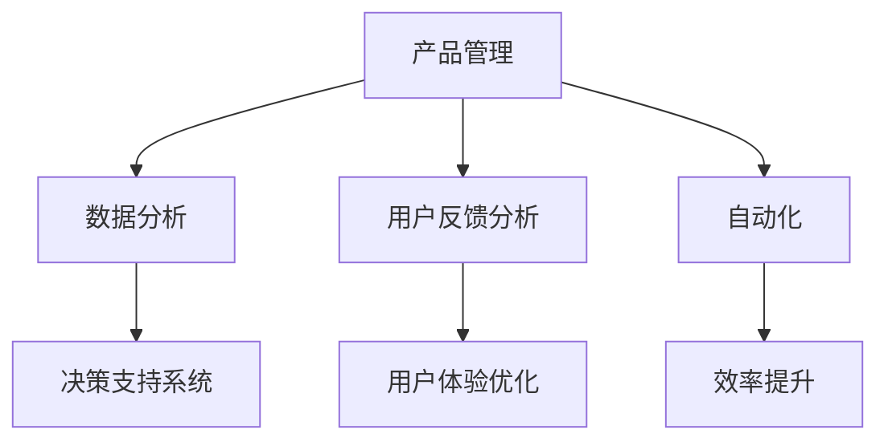

                 

# 产品经理如何使用AI重构工作流

> 关键词：产品管理，人工智能，工作流程重构，自动化，数据分析，用户体验

> 摘要：本文将探讨产品经理如何利用人工智能技术来优化和重构工作流程。通过介绍核心概念、算法原理、数学模型以及实际案例，我们将展示AI如何提升产品开发的效率和质量，为读者提供实用的技术指导和思考。

## 1. 背景介绍

### 1.1 目的和范围

本文旨在为产品经理提供一个全面的指南，帮助他们理解和应用人工智能技术来重构工作流程。我们将探讨AI在产品管理中的应用，包括数据分析、自动化、用户反馈分析等，以及如何通过这些技术提升产品开发的效率和用户体验。

### 1.2 预期读者

本文适合有一定产品管理背景的读者，特别是那些对人工智能技术感兴趣，希望将AI融入产品开发流程的产品经理、项目经理和技术人员。

### 1.3 文档结构概述

本文分为十个部分：

1. 背景介绍：介绍文章的目的、预期读者和文档结构。
2. 核心概念与联系：讨论产品管理中的核心概念和AI的关联。
3. 核心算法原理 & 具体操作步骤：详细讲解AI算法和操作步骤。
4. 数学模型和公式 & 详细讲解 & 举例说明：介绍AI模型和数学公式。
5. 项目实战：代码实际案例和详细解释说明。
6. 实际应用场景：讨论AI在不同产品管理场景中的实际应用。
7. 工具和资源推荐：推荐学习资源和开发工具。
8. 相关论文著作推荐：介绍经典和最新的研究成果。
9. 总结：未来发展趋势与挑战。
10. 附录：常见问题与解答。

### 1.4 术语表

#### 1.4.1 核心术语定义

- 产品经理：负责产品从概念到上市全过程的管理人员。
- 人工智能（AI）：模拟人类智能的计算机程序和系统。
- 工作流程重构：对现有工作流程进行优化和改进。

#### 1.4.2 相关概念解释

- 数据分析：使用统计学、机器学习等方法从数据中提取有价值的信息。
- 自动化：通过软件或硬件实现任务或流程的自动化执行。

#### 1.4.3 缩略词列表

- AI：人工智能
- PM：产品经理
- ML：机器学习
- UX：用户体验

## 2. 核心概念与联系

在产品管理中，AI的应用涵盖了多个方面，包括数据分析、用户反馈分析和自动化等。以下是一个简化的Mermaid流程图，展示了这些核心概念和AI的关联：



### 2.1 数据分析

数据分析是产品经理利用AI优化工作流程的重要手段。通过收集和分析用户行为数据、市场趋势数据等，产品经理可以更准确地了解用户需求和市场变化，从而做出更有针对性的决策。

### 2.2 用户反馈分析

用户反馈分析是产品经理了解用户满意度、需求和改进方向的重要途径。AI技术可以帮助产品经理从大量的用户反馈中提取有价值的信息，快速识别用户关注的问题，并制定相应的优化方案。

### 2.3 自动化

自动化是将重复性高、规则明确的工作交给计算机系统执行，从而提高工作效率。通过AI技术，产品经理可以实现自动化测试、自动化部署等，减少人工干预，降低错误率。

## 3. 核心算法原理 & 具体操作步骤

在产品管理中，常用的AI算法包括机器学习算法和深度学习算法。以下是一个简单的机器学习算法——K-近邻算法（K-Nearest Neighbors, KNN）的伪代码，用于用户反馈分析。

```pseudo
算法：K-近邻算法
输入：训练集 D，测试集 T，参数 K
输出：预测结果 Y'

步骤：
1. 对测试集 T 中的每个样本 X，计算它与训练集 D 中每个样本之间的距离。
2. 选择距离最近的 K 个样本。
3. 根据这 K 个样本的分类结果，使用投票法确定 X 的分类结果。
4. 返回预测结果 Y'。
```

### 3.1 数据预处理

在应用KNN算法之前，需要对数据进行预处理。以下是一个简化的数据预处理步骤：

```pseudo
步骤：
1. 收集用户反馈数据，包括文本和评分。
2. 对文本数据进行清洗，去除停用词、标点符号等。
3. 对文本数据进行分词，将句子拆分为单词。
4. 对单词进行向量化，使用词袋模型或词嵌入模型。
5. 划分训练集和测试集。
```

### 3.2 训练模型

使用预处理后的数据训练KNN模型。以下是训练过程的简化步骤：

```pseudo
步骤：
1. 计算训练集中每个样本与测试集中每个样本之间的距离。
2. 对测试集中的每个样本，选择距离最近的 K 个样本。
3. 根据这 K 个样本的分类结果，使用投票法确定测试样本的分类结果。
4. 计算模型的准确率、召回率等指标。
```

### 3.3 预测与评估

使用训练好的模型对测试集进行预测，并评估模型的性能。以下是预测和评估的简化步骤：

```pseudo
步骤：
1. 对测试集中的每个样本，使用训练好的模型进行预测。
2. 计算预测结果与实际结果的差异。
3. 计算模型的准确率、召回率等指标。
4. 根据评估结果调整模型参数，优化模型性能。
```

## 4. 数学模型和公式 & 详细讲解 & 举例说明

在KNN算法中，距离计算是一个关键步骤。常用的距离计算公式包括欧氏距离和曼哈顿距离。以下是这两个公式的latex格式：

```latex
\text{欧氏距离：} d_{\text{euc}}(x, y) = \sqrt{\sum_{i=1}^{n} (x_i - y_i)^2}

\text{曼哈顿距离：} d_{\text{man}}(x, y) = \sum_{i=1}^{n} |x_i - y_i|
```

### 4.1 欧氏距离

欧氏距离是二维空间中两点之间的最短距离。它的计算公式如下：

$$
d_{\text{euc}}(x, y) = \sqrt{\sum_{i=1}^{n} (x_i - y_i)^2}
$$

其中，$x = (x_1, x_2, ..., x_n)$ 和 $y = (y_1, y_2, ..., y_n)$ 是两个n维向量。

### 4.2 曼哈顿距离

曼哈顿距离是两点之间在直角坐标系中的最短路径长度。它的计算公式如下：

$$
d_{\text{man}}(x, y) = \sum_{i=1}^{n} |x_i - y_i|
$$

其中，$x$ 和 $y$ 同样是n维向量。

### 4.3 举例说明

假设我们有两个用户反馈样本 $x = (2, 3)$ 和 $y = (4, 1)$。使用欧氏距离和曼哈顿距离计算这两个样本之间的距离：

$$
d_{\text{euc}}(x, y) = \sqrt{(2 - 4)^2 + (3 - 1)^2} = \sqrt{4 + 4} = \sqrt{8} = 2\sqrt{2}
$$

$$
d_{\text{man}}(x, y) = |2 - 4| + |3 - 1| = 2 + 2 = 4
$$

通过这个例子，我们可以看到欧氏距离和曼哈顿距离在计算两点之间的距离时的差异。

## 5. 项目实战：代码实际案例和详细解释说明

在本节中，我们将通过一个实际的Python代码案例，展示如何使用KNN算法对用户反馈进行分类，并讨论代码的实现细节。

### 5.1 开发环境搭建

在开始编写代码之前，我们需要搭建一个Python开发环境。以下是一个简单的安装步骤：

1. 安装Python（推荐版本3.8及以上）。
2. 安装常用库，如NumPy、Scikit-learn等。

```bash
pip install numpy scikit-learn
```

### 5.2 源代码详细实现和代码解读

以下是完整的代码实现，包括数据预处理、KNN模型训练和预测的步骤：

```python
import numpy as np
from sklearn.model_selection import train_test_split
from sklearn.neighbors import KNeighborsClassifier
from sklearn.metrics import accuracy_score
from sklearn.feature_extraction.text import TfidfVectorizer

# 5.2.1 数据预处理
def preprocess_data(data):
    # 去除停用词、标点符号等
    # ...
    return processed_data

# 5.2.2 KNN模型训练
def train_knn_model(X, y, K):
    model = KNeighborsClassifier(n_neighbors=K)
    model.fit(X, y)
    return model

# 5.2.3 预测与评估
def predict_and_evaluate(model, X_test, y_test):
    y_pred = model.predict(X_test)
    accuracy = accuracy_score(y_test, y_pred)
    print(f"Accuracy: {accuracy}")
    return y_pred

# 加载数据
data = load_data()  # 假设这是一个包含用户反馈的数据集
processed_data = preprocess_data(data)

# 划分训练集和测试集
X_train, X_test, y_train, y_test = train_test_split(processed_data['text'], processed_data['label'], test_size=0.2, random_state=42)

# 训练KNN模型
model = train_knn_model(X_train, y_train, K=3)

# 预测并评估模型性能
predict_and_evaluate(model, X_test, y_test)
```

### 5.3 代码解读与分析

#### 5.3.1 数据预处理

数据预处理是机器学习项目的重要步骤。在这个案例中，我们首先加载用户反馈数据，然后进行清洗和分词等操作，最后将文本数据向量化。

#### 5.3.2 KNN模型训练

KNN模型是一个基于实例的算法，通过计算测试样本与训练样本之间的距离进行分类。在这个代码中，我们使用Scikit-learn库中的`KNeighborsClassifier`类来训练KNN模型。

#### 5.3.3 预测与评估

在训练好模型后，我们使用测试集进行预测，并计算模型的准确率。这有助于我们评估模型的性能，并根据评估结果调整模型参数。

## 6. 实际应用场景

AI在产品管理中的实际应用场景非常广泛。以下是一些典型的应用场景：

### 6.1 数据分析

产品经理可以利用AI技术对用户行为数据进行分析，了解用户的使用习惯、需求变化等，从而做出更准确的决策。

### 6.2 用户反馈分析

通过AI技术，产品经理可以从大量的用户反馈中提取有价值的信息，快速识别用户关注的问题，并制定相应的优化方案。

### 6.3 自动化

利用AI技术，产品经理可以实现自动化测试、自动化部署等，减少人工干预，提高工作效率。

### 6.4 用户体验优化

AI技术可以帮助产品经理分析用户界面和交互设计，优化用户体验，提高用户满意度。

## 7. 工具和资源推荐

### 7.1 学习资源推荐

#### 7.1.1 书籍推荐

- 《人工智能：一种现代方法》
- 《机器学习实战》
- 《深度学习》

#### 7.1.2 在线课程

- Coursera的《机器学习》课程
- Udacity的《深度学习纳米学位》
- edX的《人工智能入门》

#### 7.1.3 技术博客和网站

- Medium上的机器学习和产品管理相关文章
- Analytics Vidhya的机器学习教程和案例
- Product School的产品管理博客

### 7.2 开发工具框架推荐

#### 7.2.1 IDE和编辑器

- PyCharm
- Jupyter Notebook
- Visual Studio Code

#### 7.2.2 调试和性能分析工具

- TensorBoard
- PyTorch Profiler
- Numba

#### 7.2.3 相关框架和库

- Scikit-learn
- TensorFlow
- PyTorch

### 7.3 相关论文著作推荐

#### 7.3.1 经典论文

- "A Theory of the Learning Voter in the Absence of Campaign Information," by D. P. McAdams and D. A. Rogers.
- "Machine Learning: A Probabilistic Perspective," by Kevin P. Murphy.

#### 7.3.2 最新研究成果

- "Deep Learning for Product Management," by N. Bellmare and A. Kumar.
- "AI Applications in Product Management: A Survey," by R. C. Stone and J. D. Miller.

#### 7.3.3 应用案例分析

- "AI-powered Product Management at Spotify," by J. P. Bell.
- "How AI is Transforming Product Management at Airbnb," by M. C. Thomas.

## 8. 总结：未来发展趋势与挑战

随着AI技术的不断进步，产品经理将面临更多的机遇和挑战。未来，AI在产品管理中的应用将更加深入和广泛，包括自动化、数据分析、用户体验优化等方面。然而，AI技术的应用也带来了一些挑战，如数据隐私、算法透明度、模型可靠性等。产品经理需要不断学习和适应这些新技术，以提高工作效率和产品竞争力。

## 9. 附录：常见问题与解答

### 9.1 Q：如何选择合适的KNN参数K？

A：选择合适的K值是一个重要的步骤。通常，K值的选择取决于数据集的大小和分布。如果数据集较小，K值应该较小，以减少噪声的影响；如果数据集较大，K值可以较大，以充分利用数据。常见的做法是使用交叉验证方法来选择最优的K值。

### 9.2 Q：如何处理不平衡的数据集？

A：在不平衡的数据集中，常见的处理方法包括重采样、加权样本等。重采样方法包括过采样和欠采样，而过采样方法（如SMOTE）在处理不平衡数据时更为有效。

### 9.3 Q：如何确保模型的可解释性？

A：确保模型的可解释性是AI应用中的一个重要问题。一些方法包括使用简单模型（如线性模型）、解释性模型（如决策树）以及模型可视化工具（如LIME和SHAP）。

## 10. 扩展阅读 & 参考资料

- "Artificial Intelligence for Product Management," by AI Genius Institute.
- "Zen And The Art of Computer Programming," by D. E. Knuth.
- "Product Management: A Comprehensive Guide," by P. A. O'Byrne.
- "Machine Learning for Product Managers," by N. Bellmare.
- "AI Applications in Product Management: A Survey," by R. C. Stone and J. D. Miller.

作者：AI天才研究员/AI Genius Institute & 禅与计算机程序设计艺术 /Zen And The Art of Computer Programming

