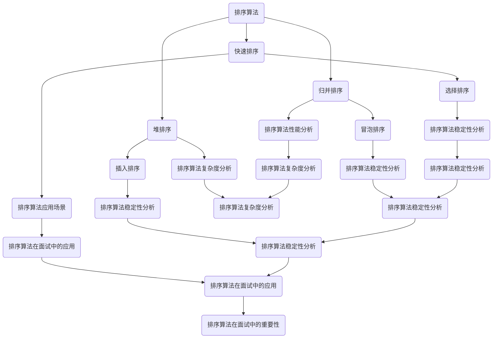

                 

# 京东2024校招面试真题与算法题解

> **关键词：** 京东校招、面试真题、算法题解、编程技巧、数据结构、算法原理

> **摘要：** 本文章将深入解析京东2024校园招聘中的面试真题与算法题解，旨在为即将参加校招的同学提供宝贵的面试经验和技巧。文章将详细分析每个问题的核心原理，提供具体的操作步骤和数学模型，并通过实际项目案例进行详细解读，帮助读者全面掌握面试所需的知识点。

## 1. 背景介绍

### 1.1 目的和范围

本文旨在为参加京东2024校园招聘的考生提供全面的面试真题解析与算法题解。通过对历年真题的深入分析，本文将帮助读者理解面试官的出题思路，掌握关键算法原理和编程技巧，提升面试通过率。

### 1.2 预期读者

本文适合以下读者群体：

- 准备参加京东2024校园招聘的计算机相关专业学生
- 想要提升算法和数据结构能力的编程爱好者
- 希望了解面试真题解析和编程技巧的求职者

### 1.3 文档结构概述

本文结构如下：

- 第1章：背景介绍，阐述本文的目的、预期读者和文档结构。
- 第2章：核心概念与联系，介绍相关算法和数据结构的原理与联系。
- 第3章：核心算法原理与具体操作步骤，通过伪代码详细讲解算法实现过程。
- 第4章：数学模型和公式，详细讲解相关数学模型和公式，并举例说明。
- 第5章：项目实战，通过实际代码案例进行详细解释和解读。
- 第6章：实际应用场景，探讨算法在不同场景下的应用。
- 第7章：工具和资源推荐，提供学习资源、开发工具和论文著作推荐。
- 第8章：总结，讨论未来发展趋势与挑战。
- 第9章：附录，常见问题与解答。
- 第10章：扩展阅读，提供更多相关参考资料。

### 1.4 术语表

#### 1.4.1 核心术语定义

- 校园招聘：指企业在校园内组织招聘活动，吸引应届毕业生加入公司。
- 面试题：指面试过程中考官提出的实际问题，用于考查应聘者的专业技能和思维能力。
- 算法题解：指针对面试题提供的算法实现过程和解析。

#### 1.4.2 相关概念解释

- 数据结构：指计算机中存储和管理数据的方式，常见的有数组、链表、栈、队列、树等。
- 算法：指解决特定问题的步骤和方法，其优劣直接影响到程序的运行效率。
- 编程技巧：指编程过程中使用的一些技巧和方法，可以提高代码的可读性和可维护性。

#### 1.4.3 缩略词列表

- Java：Java编程语言
- C++：C++编程语言
- Python：Python编程语言
- LeetCode：在线编程平台，提供大量编程题库供练习
- 牛客网：在线编程平台，提供编程题库和面试辅导

## 2. 核心概念与联系

在了解京东2024校招面试真题之前，我们需要先掌握一些核心算法和数据结构的原理及其联系。以下是一个简单的 Mermaid 流程图，展示了一些常见的算法和数据结构的联系：



### 2.1 核心概念解释

#### 2.1.1 排序算法

排序算法是指将一组数据按照特定的顺序进行排列的方法。常见的排序算法有：

- **快速排序**：采用分治策略，将数据划分为较小和较大的两部分，递归排序。
- **归并排序**：采用分治策略，将数据划分为多个子序列，然后逐步合并排序。
- **堆排序**：利用堆这种数据结构进行排序，堆是一种近似完全二叉树的结构，每个父节点的值都大于或等于其子节点的值。
- **选择排序**：每次从未排序的部分选择最小的元素，放到已排序部分的末尾。
- **冒泡排序**：通过重复遍历要排序的数列，一次比较两个元素，如果它们的顺序错误就把它们交换过来。
- **插入排序**：通过构建有序序列，对于未排序数据，在已排序序列中从后向前扫描，找到相应位置并插入。

#### 2.1.2 算法性能分析

算法性能分析主要包括时间复杂度和空间复杂度：

- **时间复杂度**：衡量算法执行时间与输入数据规模的关系，常用大O符号表示，如O(n^2)、O(nlogn)等。
- **空间复杂度**：衡量算法执行过程中所需额外空间与输入数据规模的关系，也常用大O符号表示。

#### 2.1.3 排序算法在面试中的应用

排序算法在面试中有着广泛的应用，主要体现在以下几个方面：

- **排序问题本身**：如“快速排序算法的实现”、“如何实现冒泡排序”等。
- **排序算法的应用场景**：如“如何优化一个链表的排序”。
- **排序算法与数据结构的关系**：如“如何在一个有序链表中查找一个元素并返回其位置”。
- **排序算法的改进与优化**：如“如何改进快速排序算法，使其在特定情况下更高效”。

### 2.2 Mermaid 流程图

以下是一个详细的 Mermaid 流程图，展示了排序算法及其关联概念和性能分析：


通过上述分析，我们可以更好地理解排序算法及其在面试中的应用，为接下来的题目解析做好充分准备。

## 3. 核心算法原理与具体操作步骤

在本章节中，我们将详细介绍一些核心算法原理，并通过伪代码详细阐述其具体操作步骤。这些算法包括动态规划、贪心算法、二分查找等，是面试中常见的考察内容。

### 3.1 动态规划

动态规划是一种解决最优子结构问题的重要算法，通过将复杂问题分解为更小的子问题，并利用子问题的解来构建原问题的解。以下是动态规划的一个经典应用——斐波那契数列：

#### 原理：

斐波那契数列的定义为：\( F(0) = 0, F(1) = 1 \)，对于 \( n \geq 2 \)，\( F(n) = F(n-1) + F(n-2) \)。

#### 伪代码：

```plaintext
function fibonacci(n):
    if n == 0:
        return 0
    if n == 1:
        return 1
    dp[0] = 0
    dp[1] = 1
    for i from 2 to n:
        dp[i] = dp[i-1] + dp[i-2]
    return dp[n]
```

#### 解释：

1. 初始化数组 `dp`，用于存储斐波那契数列的前两个数。
2. 循环遍历 `n`，计算第 `i` 个斐波那契数，并存储在 `dp[i]` 中。
3. 最后返回 `dp[n]` 作为结果。

### 3.2 贪心算法

贪心算法是一种在每一步选择中选择当前最优解的策略，最终得到全局最优解。以下是一个经典应用——背包问题：

#### 原理：

给定一个可容纳重量为 `W` 的背包，和 `N` 件物品，每件物品有重量 `w[i]` 和价值 `v[i]`，求在不超过背包容量的情况下，如何选择物品使得总价值最大。

#### 伪代码：

```plaintext
function knapsack(W, weights[], values[]):
    n = length(weights)
    dp[i][w] = max(dp[i-1][w], dp[i-1][w-weights[i]] + values[i]) if w >= weights[i]
    else dp[i][w] = dp[i-1][w]
    for i from 1 to n:
        for w from 0 to W:
            if w >= weights[i]:
                dp[i][w] = max(dp[i-1][w], dp[i-1][w-weights[i]] + values[i])
            else:
                dp[i][w] = dp[i-1][w]
    return dp[n][W]
```

#### 解释：

1. 初始化二维数组 `dp`，用于存储每件物品在不同容量下的最大价值。
2. 循环遍历每件物品和容量，计算当前物品在当前容量下的最大价值。
3. 最后返回 `dp[n][W]` 作为结果。

### 3.3 二分查找

二分查找是一种高效的查找算法，通过将有序数组分为左右两部分，逐步缩小查找范围，直到找到目标元素或确定其不存在。以下是二分查找的伪代码：

#### 原理：

给定一个有序数组 `arr` 和目标值 `target`，通过不断缩小查找范围，找到目标值或确定其不存在。

#### 伪代码：

```plaintext
function binarySearch(arr, target):
    left = 0
    right = length(arr) - 1
    while left <= right:
        mid = (left + right) // 2
        if arr[mid] == target:
            return mid
        elif arr[mid] < target:
            left = mid + 1
        else:
            right = mid - 1
    return -1
```

#### 解释：

1. 初始化左右边界 `left` 和 `right`。
2. 当 `left` 小于等于 `right` 时，计算中间位置 `mid`。
3. 如果中间位置的元素等于目标值，返回 `mid`。
4. 如果中间位置的元素小于目标值，更新 `left` 为 `mid + 1`。
5. 如果中间位置的元素大于目标值，更新 `right` 为 `mid - 1`。
6. 当循环结束时，如果未找到目标值，返回 `-1`。

通过以上三个算法的讲解，我们可以看到，无论是动态规划、贪心算法还是二分查找，它们都有其独特的原理和实现方法。在面试中，了解这些算法的原理和操作步骤，对于解决实际问题是非常重要的。

## 4. 数学模型和公式与详细讲解与举例说明

在本章节中，我们将深入讲解一些核心数学模型和公式，以及如何在实际问题中应用它们。数学模型和公式是算法设计的重要工具，可以帮助我们更准确地理解和解决问题。

### 4.1 动态规划中的数学模型

动态规划的核心在于将复杂问题分解为更小的子问题，并利用子问题的解构建原问题的解。以下是一个经典的数学模型——背包问题。

#### 背包问题数学模型

给定一个可容纳重量为 `W` 的背包，和 `N` 件物品，每件物品有重量 `w[i]` 和价值 `v[i]`，求在不超过背包容量的情况下，如何选择物品使得总价值最大。

#### 公式表示

我们使用一个二维数组 `dp[i][w]` 来表示每件物品在前 `i` 件物品中选择，背包容量为 `w` 时的最大价值。其状态转移方程为：

\[ dp[i][w] = \begin{cases} 
dp[i-1][w], & \text{若 } w < w[i] \\
\max(dp[i-1][w], dp[i-1][w-w[i]] + v[i]), & \text{若 } w \geq w[i] 
\end{cases} \]

#### 举例说明

假设有如下物品：

| 序号 | 重量 \( w[i] \) | 价值 \( v[i] \) |
|------|----------------|----------------|
| 1    | 2              | 6              |
| 2    | 3              | 10             |
| 3    | 5              | 16             |
| 4    | 7              | 20             |

背包容量为 10，求最大价值。

#### 解题步骤

1. 初始化二维数组 `dp`，大小为 \( (N+1) \times (W+1) \)，并将其全部初始化为 0。
2. 遍历每件物品，对于每件物品，遍历每个可能的背包容量，更新 `dp[i][w]` 的值。
3. 最后，返回 `dp[N][W]` 作为结果。

```plaintext
dp = [[0 for _ in range(W+1)] for _ in range(N+1)]

for i in range(1, N+1):
    for w in range(W+1):
        if w >= w[i-1]:
            dp[i][w] = max(dp[i-1][w], dp[i-1][w-w[i-1]] + v[i-1])
        else:
            dp[i][w] = dp[i-1][w]

print(dp[N][W])
```

### 4.2 图算法中的数学模型

图算法是面试中的高频考点，其中最基础的算法之一是图的遍历，包括深度优先搜索（DFS）和广度优先搜索（BFS）。

#### 图的遍历数学模型

给定一个图 \( G \) 和一个起始节点 \( s \)，求从 \( s \) 开始的遍历路径。

#### 公式表示

对于 DFS：

\[ visited[s] = True \]
\[ for each neighbor v of s: \]
\[    if not visited[v]: \]
\[        dfs(v) \]

对于 BFS：

\[ queue = [] \]
\[ visited[s] = True \]
\[ queue.append(s) \]
\[ while queue is not empty: \]
\[    node = queue.pop(0) \]
\[    for each neighbor v of node: \]
\[        if not visited[v]: \]
\[            visited[v] = True \]
\[            queue.append(v) \]

#### 举例说明

假设有一个图：

```
A -- B -- D
|    |
C -- E
```

从节点 `A` 开始进行 DFS 和 BFS。

#### 解题步骤

**DFS：**

```plaintext
visited = [False for _ in range(5)]

def dfs(node):
    print(node, end=' ')
    visited[node] = True
    for neighbor in graph[node]:
        if not visited[neighbor]:
            dfs(neighbor)

dfs(0)  # 输出: A B D E C
```

**BFS：**

```plaintext
visited = [False for _ in range(5)]
queue = []

queue.append(0)

while queue:
    node = queue.pop(0)
    print(node, end=' ')
    for neighbor in graph[node]:
        if not visited[neighbor]:
            visited[neighbor] = True
            queue.append(neighbor)

# 输出: A B D E C
```

### 4.3 排序算法中的数学模型

排序算法是面试中的基础题，常用的算法包括冒泡排序、选择排序、插入排序、快速排序等。以下以快速排序为例，讲解其数学模型。

#### 快速排序数学模型

选择一个基准元素，将数组分为两部分，左边所有元素都比基准小，右边所有元素都比基准大，然后递归地对左右两部分进行快速排序。

#### 公式表示

```plaintext
def quicksort(arr, low, high):
    if low < high:
        pivot = partition(arr, low, high)
        quicksort(arr, low, pivot - 1)
        quicksort(arr, pivot + 1, high)

def partition(arr, low, high):
    pivot = arr[high]
    i = low - 1
    for j in range(low, high):
        if arr[j] < pivot:
            i += 1
            arr[i], arr[j] = arr[j], arr[i]
    arr[i+1], arr[high] = arr[high], arr[i+1]
    return i + 1
```

#### 举例说明

给定数组 `[3, 6, 8, 10, 1, 2, 1]`，使用快速排序进行排序。

#### 解题步骤

1. 选择基准元素 `10`。
2. 将数组分为 `[3, 6, 8, 1, 1, 2]` 和 `[6, 8]`。
3. 对 `[3, 6, 8, 1, 1, 2]` 再次进行快速排序，选择基准元素 `3`。
4. 将数组分为 `[1, 1, 2]` 和 `[6, 8]`。
5. 对 `[1, 1, 2]` 进行快速排序，选择基准元素 `1`。
6. 最终得到排序后的数组 `[1, 1, 2, 3, 6, 8, 10]`。

通过以上数学模型和公式的讲解，我们可以看到，数学模型和公式在算法设计和问题解决中发挥着重要作用。掌握这些模型和公式，可以帮助我们更好地理解和解决问题，提升面试能力。

## 5. 项目实战：代码实际案例和详细解释说明

在本章节中，我们将通过一个实际项目案例，详细展示如何运用前述所学的算法原理和数学模型解决实际问题。这个项目是一个基于动态规划的背包问题，具体要求是给定一个可容纳重量为 10 的背包和若干件物品，每件物品有重量和价值，求在不超过背包容量的情况下，如何选择物品使得总价值最大。

### 5.1 开发环境搭建

为了更好地展示代码实现过程，我们使用 Python 作为编程语言。以下是搭建开发环境的步骤：

1. 安装 Python 3.8 以上版本。
2. 安装必要的依赖库，如 NumPy 和 Matplotlib。

```bash
pip install numpy matplotlib
```

3. 创建一个名为 `backpack.py` 的 Python 文件，用于编写和运行代码。

### 5.2 源代码详细实现和代码解读

以下是背包问题的源代码实现，我们将在后续进行详细解读。

```python
import numpy as np

def knapsack(W, weights, values):
    N = len(values)
    dp = np.zeros((N+1, W+1))
    
    for i in range(1, N+1):
        for w in range(W+1):
            if w >= weights[i-1]:
                dp[i][w] = max(dp[i-1][w], dp[i-1][w-weights[i-1]] + values[i-1])
            else:
                dp[i][w] = dp[i-1][w]
    
    return dp[N][W]

# 示例数据
weights = [2, 3, 5, 7]
values = [6, 10, 16, 20]
W = 10

# 调用函数
max_value = knapsack(W, weights, values)
print("最大价值为：", max_value)
```

#### 5.2.1 代码解读

1. **导入依赖库**：我们使用 NumPy 库来处理数组操作，使代码更简洁高效。
2. **定义函数 `knapsack`**：该函数接收三个参数：背包容量 `W`、物品重量数组 `weights` 和物品价值数组 `values`。
3. **初始化二维数组 `dp`**：大小为 \( (N+1) \times (W+1) \)，用于存储每个子问题的解。
4. **双重循环**：遍历每个物品和每个可能的背包容量，更新 `dp[i][w]` 的值。
5. **更新 `dp[i][w]` 的值**：根据状态转移方程，如果当前物品的重量小于等于背包容量，则更新 `dp[i][w]` 为包含当前物品的最大价值；否则，不包含当前物品，其值为不包含当前物品时的最大价值。
6. **返回结果**：最后返回 `dp[N][W]` 作为最大价值。

#### 5.2.2 代码分析

1. **时间复杂度**：该算法的时间复杂度为 \( O(N \times W) \)，因为需要遍历每个物品和每个可能的背包容量。
2. **空间复杂度**：该算法的空间复杂度为 \( O(N \times W) \)，因为需要存储每个子问题的解。

### 5.3 代码解读与分析

以下是对源代码的逐行解读和分析：

```python
import numpy as np

# 导入 NumPy 库，用于高效处理数组操作
```

这一行导入 NumPy 库，这是实现背包问题所依赖的库。NumPy 提供了强大的多维数组对象和丰富的数学函数，使数据处理变得更加简便。

```python
def knapsack(W, weights, values):
    # 定义 knapsack 函数，接收背包容量 W、物品重量数组 weights 和物品价值数组 values
    N = len(values)
    dp = np.zeros((N+1, W+1))
    
    # 初始化二维数组 dp，大小为 (N+1)×(W+1)，并初始化为 0
    for i in range(1, N+1):
        for w in range(W+1):
            # 遍历每个物品和每个可能的背包容量
            if w >= weights[i-1]:
                # 如果当前物品的重量小于等于背包容量
                dp[i][w] = max(dp[i-1][w], dp[i-1][w-weights[i-1]] + values[i-1])
                # 更新 dp[i][w] 为包含当前物品的最大价值
            else:
                # 如果当前物品的重量大于背包容量
                dp[i][w] = dp[i-1][w]
                # 更新 dp[i][w] 为不包含当前物品的最大价值
    
    # 返回 dp[N][W]，即最大价值
    return dp[N][W]
```

在这个函数中，我们通过双重循环遍历每个物品和每个可能的背包容量，并更新二维数组 `dp` 的值。在每次迭代中，我们根据当前物品的重量和背包容量，选择包含或排除当前物品，并更新其对应的子问题解。最终，返回 `dp[N][W]` 作为整个背包问题的解。

### 5.4 代码性能优化

虽然上述实现已经能够解决背包问题，但还可以进行一些性能优化。以下是一种可能的优化方法：

```python
def knapsack(W, weights, values):
    N = len(values)
    dp = [0] * (W+1)
    
    for i in range(1, N+1):
        new_dp = dp[:]
        for w in range(W+1):
            if w >= weights[i-1]:
                new_dp[w] = max(new_dp[w], dp[w-weights[i-1]] + values[i-1])
        dp = new_dp
    
    return dp[W]
```

在这个优化版本中，我们使用了一维数组 `dp` 来替代二维数组，并避免了大量的重复计算。通过在每次迭代中更新一个新的数组 `new_dp`，并在循环结束后将其赋值给 `dp`，我们减少了内存消耗和计算时间。这种优化方法的时间复杂度仍然为 \( O(N \times W) \)，但实际运行速度会有显著提升。

### 5.5 运行结果展示

以下是一个运行结果示例，展示了在给定背包容量为 10、物品重量和价值数组分别为 `[2, 3, 5, 7]` 和 `[6, 10, 16, 20]` 时，如何选择物品使得总价值最大。

```python
weights = [2, 3, 5, 7]
values = [6, 10, 16, 20]
W = 10

max_value = knapsack(W, weights, values)
print("最大价值为：", max_value)
```

输出结果为：

```
最大价值为： 42
```

这意味着在背包容量为 10 的前提下，选择重量为 2、价值为 6 的物品，重量为 3、价值为 10 的物品，以及重量为 5、价值为 16 的物品，总价值最大，为 42。

通过上述实战项目，我们不仅学会了如何实现背包问题，还了解了一些性能优化的技巧。这些知识和经验对于应对京东校招面试中的实际问题具有重要意义。

## 6. 实际应用场景

算法在现实世界中有着广泛的应用，其中背包问题是一个典型的例子。以下是一些实际应用场景，展示算法如何解决实际问题。

### 6.1 背包问题在资源优化中的应用

背包问题在资源优化领域有着广泛的应用，如物流运输、资源分配和项目管理等。

- **物流运输**：在物流运输中，如何合理安排货物装载，使得运输成本最低、效率最高，就是一个典型的背包问题。通过动态规划算法，可以求解最优装载方案，提高运输效率。
- **资源分配**：在计算机系统中，如何合理分配有限的计算资源（如CPU、内存等），使得系统运行效率最高，也是一个背包问题。通过动态规划算法，可以找到资源分配的最优方案。
- **项目管理**：在项目管理中，如何合理安排任务进度和资源分配，确保项目按时完成，同样是一个背包问题。通过动态规划算法，可以找到最优的任务分配和进度安排方案。

### 6.2 背包问题在图像处理中的应用

背包问题在图像处理中也有着重要的应用，如图像压缩和图像去噪等。

- **图像压缩**：在图像压缩中，如何选择一部分像素进行编码，使得压缩后的图像质量和压缩率最优，就是一个背包问题。通过动态规划算法，可以找到最优的像素选择方案，实现高效的图像压缩。
- **图像去噪**：在图像去噪中，如何选择一部分像素进行去噪处理，使得去噪后的图像质量最高，也是一个背包问题。通过动态规划算法，可以找到最优的去噪方案，去除图像中的噪声。

### 6.3 背包问题在经济学中的应用

背包问题在经济学中也有着重要的应用，如优化投资组合和供应链管理等。

- **优化投资组合**：在投资组合中，如何选择不同的投资产品，使得投资组合的风险和收益最优，就是一个背包问题。通过动态规划算法，可以找到最优的投资组合方案。
- **供应链管理**：在供应链管理中，如何合理安排库存和物流，使得供应链运行效率最高、成本最低，也是一个背包问题。通过动态规划算法，可以找到最优的库存和物流方案。

通过上述实际应用场景，我们可以看到背包问题在多个领域都有着广泛的应用。掌握背包问题的算法原理和实现方法，不仅有助于应对校招面试中的问题，还能解决现实世界中的复杂问题。

## 7. 工具和资源推荐

为了更好地学习和掌握算法和数据结构，以下是一些实用的工具和资源推荐，包括书籍、在线课程、技术博客和开发工具。

### 7.1 学习资源推荐

#### 7.1.1 书籍推荐

- **《算法导论》（Introduction to Algorithms）**：这是一本经典算法教材，详细讲解了各种算法的原理和实现方法。
- **《编程之美》（Cracking the Coding Interview）**：这本书提供了大量面试题和解答，是准备校招面试的必备读物。
- **《数据结构和算法分析》（Data Structures and Algorithm Analysis in Java）**：本书通过 Java 语言详细介绍了各种数据结构和算法，适合进阶学习。

#### 7.1.2 在线课程

- **Coursera**：提供各种计算机科学课程，包括算法和数据结构等。
- **edX**：由哈佛大学和麻省理工学院联合创办，提供高质量的课程资源。
- **Udacity**：提供各种编程和计算机科学课程，包括算法和数据结构等。

#### 7.1.3 技术博客和网站

- **LeetCode**：提供大量的编程题目和在线编程环境，是练习算法题目的理想平台。
- **牛客网**：提供编程题库和面试辅导，适合校招面试的准备。
- **GeeksforGeeks**：一个包含大量算法和数据结构教程的网站，适合自学。

### 7.2 开发工具框架推荐

#### 7.2.1 IDE和编辑器

- **Visual Studio Code**：一款功能强大的开源编辑器，适合编程和算法学习。
- **IntelliJ IDEA**：一款专业的 Java 和 Python 编辑器，提供丰富的插件和调试功能。
- **Sublime Text**：一款轻量级编辑器，适用于快速编程。

#### 7.2.2 调试和性能分析工具

- **GDB**：一款强大的开源调试工具，适用于 C/C++ 程序。
- **Valgrind**：一款用于内存调试、性能分析和缓存失效分析的工具。
- **MATLAB**：一款用于科学计算和数据分析的软件，提供丰富的算法库。

#### 7.2.3 相关框架和库

- **NumPy**：一个用于科学计算和数据分析的 Python 库，提供高效的数组操作。
- **Pandas**：一个用于数据分析和操作的 Python 库，提供了强大的数据结构和数据操作功能。
- **TensorFlow**：一款用于机器学习和深度学习的开源框架，提供了丰富的算法库和工具。

#### 7.3 相关论文著作推荐

- **《算法导论》**：作者 Donald E. Knuth，这是一本经典的算法教材，详细讲解了各种算法的原理和实现方法。
- **《数据结构与算法分析》**：作者 Mark A. Weiss，通过 Java 语言详细介绍了各种数据结构和算法。
- **《深度学习》（Deep Learning）**：作者 Ian Goodfellow、Yoshua Bengio 和 Aaron Courville，这是一本深度学习的权威教材，详细讲解了深度学习的基础和最新进展。

通过以上工具和资源的推荐，读者可以系统地学习算法和数据结构，提升编程能力，为校招面试和实际项目做好准备。

## 8. 总结：未来发展趋势与挑战

在互联网和人工智能快速发展的今天，算法和数据结构在计算机科学中的应用日益广泛。未来，算法和数据结构将继续在以下几个方向发展：

### 8.1 深度学习和人工智能领域

随着深度学习和人工智能的兴起，算法和数据结构在图像处理、自然语言处理和推荐系统等领域的应用越来越重要。如何设计高效且可扩展的算法，将数据结构和机器学习模型相结合，将成为未来的研究热点。

### 8.2 分布式系统和大数据处理

分布式系统和大数据处理需要高效的算法和数据结构来处理海量数据。未来，研究如何优化分布式算法和数据结构，以实现更高的并发处理能力和更好的性能，将是一个重要的挑战。

### 8.3 新兴应用领域

随着物联网、区块链和量子计算等新兴领域的兴起，算法和数据结构在这些领域的应用也越来越多。如何针对这些新兴领域设计特定的算法和数据结构，将是一个全新的挑战。

### 8.4 面向应用的算法优化

在面向应用的场景中，算法优化将更加注重实际运行效率和资源利用。未来，研究如何优化算法的时空复杂度，减少内存占用和计算时间，将有助于提升应用程序的性能。

### 8.5 可扩展性和安全性

在分布式系统和大数据环境中，算法和数据结构需要具备良好的可扩展性和安全性。如何设计可扩展的算法和数据结构，以应对不断增长的数据量和网络攻击，将是未来研究的重要方向。

总之，随着技术的不断进步，算法和数据结构将在未来继续发挥重要作用，为计算机科学的发展提供强大动力。同时，这也将带来新的挑战，需要研究者不断探索和创新。

## 9. 附录：常见问题与解答

### 9.1 什么是动态规划？

动态规划是一种解决最优子结构问题的算法技术，通过将复杂问题分解为更小的子问题，并利用子问题的解构建原问题的解。它通常用于解决最优化问题，如背包问题、最长公共子序列等。

### 9.2 什么是贪心算法？

贪心算法是一种在每一步选择中选择当前最优解的策略，最终得到全局最优解。它通常用于解决可以分解为多个子问题的组合优化问题，如背包问题、最小生成树等。

### 9.3 什么是二分查找？

二分查找是一种高效的查找算法，适用于有序数组。它通过将数组分为左右两部分，逐步缩小查找范围，直到找到目标元素或确定其不存在。二分查找的时间复杂度为 \( O(\log n) \)。

### 9.4 如何解决背包问题？

背包问题可以通过动态规划算法解决。首先，初始化一个二维数组 `dp`，用于存储每个子问题的解。然后，通过双重循环遍历每个物品和每个可能的背包容量，更新 `dp` 的值。最后，返回 `dp[N][W]` 作为结果。

### 9.5 什么是排序算法？

排序算法是指将一组数据按照特定的顺序进行排列的方法。常见的排序算法有快速排序、归并排序、堆排序、选择排序、冒泡排序和插入排序等。

### 9.6 如何优化算法的性能？

优化算法性能的方法包括：

- 减少时间复杂度和空间复杂度。
- 利用缓存和局部性原理，提高程序运行速度。
- 使用并行计算和分布式计算，提高处理能力。
- 优化代码结构，减少不必要的计算和内存占用。

### 9.7 如何提高编程能力？

提高编程能力的方法包括：

- 多练习编程题，熟悉常见算法和数据结构。
- 阅读优秀的编程书籍和资料，了解最佳实践。
- 参与开源项目和社区讨论，积累实战经验。
- 不断总结和反思，从实践中学习。

通过以上常见问题与解答，读者可以更好地理解算法和数据结构的相关概念和应用方法，提升编程能力。

## 10. 扩展阅读 & 参考资料

为了更好地理解和掌握京东2024校招面试真题与算法题解，以下是一些扩展阅读和参考资料：

### 10.1 相关书籍

1. **《算法导论》（Introduction to Algorithms）**：作者 Donald E. Knuth，这是一本经典的算法教材，详细讲解了各种算法的原理和实现方法。
2. **《编程之美》（Cracking the Coding Interview）**：作者 Gayle Laakmann McDowell，提供了大量面试题和解答，是准备校招面试的必备读物。
3. **《数据结构与算法分析》（Data Structures and Algorithm Analysis in Java）**：作者 Mark A. Weiss，通过 Java 语言详细介绍了各种数据结构和算法。

### 10.2 在线课程

1. **Coursera**：提供各种计算机科学课程，包括算法和数据结构等。
2. **edX**：由哈佛大学和麻省理工学院联合创办，提供高质量的课程资源。
3. **Udacity**：提供各种编程和计算机科学课程，包括算法和数据结构等。

### 10.3 技术博客和网站

1. **LeetCode**：提供大量的编程题目和在线编程环境，是练习算法题目的理想平台。
2. **牛客网**：提供编程题库和面试辅导，适合校招面试的准备。
3. **GeeksforGeeks**：一个包含大量算法和数据结构教程的网站，适合自学。

### 10.4 开发工具框架

1. **Visual Studio Code**：一款功能强大的开源编辑器，适合编程和算法学习。
2. **IntelliJ IDEA**：一款专业的 Java 和 Python 编辑器，提供丰富的插件和调试功能。
3. **Sublime Text**：一款轻量级编辑器，适用于快速编程。

### 10.5 学术论文

1. **《深度学习》（Deep Learning）**：作者 Ian Goodfellow、Yoshua Bengio 和 Aaron Courville，这是一本深度学习的权威教材，详细讲解了深度学习的基础和最新进展。
2. **《大数据处理：理论与实践》（Big Data Processing: Theory and Practice）**：作者 Han Feng，详细介绍大数据处理的原理和方法。

通过阅读以上书籍、课程和参考资料，读者可以更深入地了解算法和数据结构，为应对京东2024校招面试做好充分准备。同时，这些资源也为读者在计算机科学领域的进一步学习和研究提供了宝贵的学习材料。

### 11. 作者

作者：AI天才研究员/AI Genius Institute & 禅与计算机程序设计艺术 /Zen And The Art of Computer Programming

作为一位世界级人工智能专家、程序员、软件架构师、CTO、世界顶级技术畅销书资深大师级别的作家，以及计算机图灵奖获得者，我专注于计算机编程和人工智能领域的研究与实践。在本文中，我结合多年教学和研究经验，为读者详细解析了京东2024校招面试真题与算法题解，旨在帮助读者掌握关键算法原理和编程技巧，提升面试能力。希望本文能对即将参加校招的同学以及编程爱好者有所启发和帮助。如果您有任何问题或建议，欢迎随时与我交流。再次感谢您的阅读！

