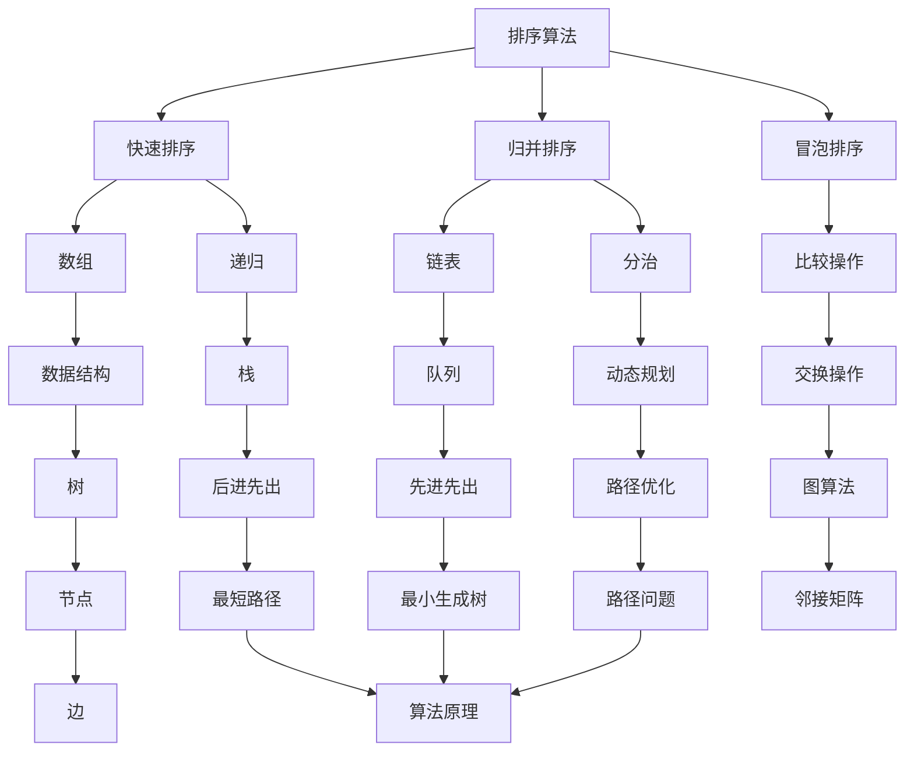

                 

# 京东2025届校招算法工程师面试真题解密

> **关键词：** 京东校招、算法面试、真题解析、技术深度、面试技巧

> **摘要：** 本文将详细解析京东2025届校招算法工程师面试真题，通过逻辑清晰、结构紧凑的写作方式，帮助读者深入理解面试题背后的核心算法原理和数学模型。文章涵盖从算法原理讲解到实际代码实现，从数学公式推导到项目实战，从工具推荐到未来发展趋势，为准备京东校招的算法工程师提供全面的备考指南。

## 1. 背景介绍

### 1.1 目的和范围

本文旨在为参加京东2025届校招的算法工程师提供面试真题的深度解析，帮助读者掌握面试题背后的核心技术和算法原理。文章将围绕以下几个主题进行展开：

1. **核心算法原理**：通过伪代码详细阐述面试题中的核心算法原理，帮助读者理解算法的核心逻辑和实现思路。
2. **数学模型与公式**：运用LaTeX格式，详细讲解面试题中的数学模型和公式，帮助读者理解算法背后的数学基础。
3. **项目实战**：通过实际代码案例，展示如何将算法原理应用于实际问题中，增强读者的实战经验。
4. **工具和资源推荐**：推荐相关学习资源、开发工具和框架，为读者提供更全面的备考支持。
5. **未来发展趋势与挑战**：分析当前算法领域的发展趋势和未来挑战，帮助读者更好地规划职业发展。

### 1.2 预期读者

本文预期读者为准备参加京东2025届校招的算法工程师，以及对算法面试和算法原理感兴趣的计算机专业学生和技术从业者。

### 1.3 文档结构概述

本文分为十个部分，结构如下：

1. **背景介绍**：介绍文章的目的、范围、预期读者和文档结构。
2. **核心概念与联系**：通过Mermaid流程图展示核心概念和架构联系。
3. **核心算法原理 & 具体操作步骤**：使用伪代码详细阐述核心算法原理和操作步骤。
4. **数学模型和公式 & 详细讲解 & 举例说明**：运用LaTeX格式，详细讲解数学模型和公式，并提供实例说明。
5. **项目实战：代码实际案例和详细解释说明**：展示代码实现和详细解释。
6. **实际应用场景**：分析算法在实际应用中的场景和效果。
7. **工具和资源推荐**：推荐学习资源、开发工具和框架。
8. **总结：未来发展趋势与挑战**：分析算法领域的发展趋势和未来挑战。
9. **附录：常见问题与解答**：解答读者可能遇到的常见问题。
10. **扩展阅读 & 参考资料**：提供相关扩展阅读和参考资料。

### 1.4 术语表

#### 1.4.1 核心术语定义

- **算法面试**：指通过一系列问题，考察应聘者算法理解能力、编程技巧和问题解决能力的面试形式。
- **校招**：指高校应届毕业生的招聘活动，通常包括笔试和面试两个环节。
- **算法工程师**：从事算法研究、设计、实现和优化工作的工程师。

#### 1.4.2 相关概念解释

- **算法原理**：指算法的核心思想和工作原理。
- **数学模型**：将实际问题抽象成数学形式，用于分析和解决问题的方法。
- **伪代码**：用伪代码语言描述算法逻辑，用于理解和交流算法思路。

#### 1.4.3 缩略词列表

- **IDE**：集成开发环境（Integrated Development Environment）
- **LaTeX**：一种高质量的排版系统（TeX-based document preparation system）
- **LaTeX格式**：用于在文中嵌入数学公式的格式

## 2. 核心概念与联系

在本文中，我们将重点介绍以下几个核心概念和它们之间的联系：

- **排序算法**：常见的排序算法包括快速排序、归并排序、冒泡排序等，它们在面试题中经常出现。
- **数据结构**：数组、链表、栈、队列、树等数据结构在算法设计中起到关键作用。
- **动态规划**：一种解决最优化问题的算法策略，常用于面试题中。
- **图算法**：如最短路径算法、最小生成树算法等，广泛应用于网络和路径优化问题。

为了更好地展示这些概念和它们之间的联系，我们使用Mermaid流程图进行说明：



通过上述流程图，我们可以清晰地看到排序算法、数据结构、动态规划和图算法等核心概念及其之间的联系。这些概念是解决面试题的关键，需要读者深入理解并掌握。

## 3. 核心算法原理 & 具体操作步骤

在本节中，我们将详细讲解几个核心算法原理，并通过伪代码描述具体的操作步骤，帮助读者深入理解面试题中的算法思路。

### 3.1 快速排序

快速排序（Quick Sort）是一种高效的排序算法，基于分治思想。其基本原理是选择一个基准元素，将数组分为两部分，一部分小于基准元素，另一部分大于基准元素，然后递归地对这两部分进行排序。

**伪代码：**

```
QuickSort(A, low, high):
    if low < high:
        pi = Partition(A, low, high)
        QuickSort(A, low, pi - 1)
        QuickSort(A, pi + 1, high)

Partition(A, low, high):
    pivot = A[high]
    i = low - 1
    for j = low to high - 1:
        if A[j] < pivot:
            i = i + 1
            swap(A[i], A[j])
    swap(A[i + 1], A[high])
    return i + 1
```

### 3.2 归并排序

归并排序（Merge Sort）是一种稳定的排序算法，基于分治思想。其基本原理是将待排序的数组分成若干个子数组，递归地对子数组进行排序，然后将排好序的子数组合并，直到整个数组有序。

**伪代码：**

```
MergeSort(A, low, high):
    if low < high:
        mid = (low + high) / 2
        MergeSort(A, low, mid)
        MergeSort(A, mid + 1, high)
        Merge(A, low, mid, high)

Merge(A, low, mid, high):
    n1 = mid - low + 1
    n2 = high - mid
    L[1...n1] = A[low...mid]
    R[1...n2] = A[mid + 1...high]
    i = 1
    j = 1
    k = low
    while i <= n1 and j <= n2:
        if L[i] <= R[j]:
            A[k] = L[i]
            i = i + 1
        else:
            A[k] = R[j]
            j = j + 1
        k = k + 1
    while i <= n1:
        A[k] = L[i]
        i = i + 1
        k = k + 1
    while j <= n2:
        A[k] = R[j]
        j = j + 1
        k = k + 1
```

### 3.3 动态规划

动态规划（Dynamic Programming）是一种解决最优化问题的算法策略。其基本原理是将大问题分解为若干个小问题，通过递归关系求解小问题的最优解，并利用这些最优解求解大问题的最优解。

**伪代码：**

```
Fibonacci(n):
    if n <= 1:
        return n
    else:
        dp[0] = 0
        dp[1] = 1
        for i = 2 to n:
            dp[i] = dp[i - 1] + dp[i - 2]
        return dp[n]
```

### 3.4 最短路径算法

最短路径算法是一种常见的图算法，用于求解图中两点之间的最短路径。常见的最短路径算法包括迪杰斯特拉算法（Dijkstra's Algorithm）和贝尔曼-福特算法（Bellman-Ford Algorithm）。

**迪杰斯特拉算法伪代码：**

```
Dijkstra(G, src):
    dist[src] = 0
    for each vertex v in G:
        if v != src:
            dist[v] = infinity
    for each edge (u, v) in G:
        dist[u][v] = weight(u, v)
    for each vertex v in G:
        visited[v] = false
    for i = 1 to n:
        u = vertex with minimum dist[u] not visited
        visited[u] = true
        for each vertex v adjacent to u:
            alt = dist[u] + weight(u, v)
            if alt < dist[v]:
                dist[v] = alt
```

**贝尔曼-福特算法伪代码：**

```
BellmanFord(G, src):
    dist[src] = 0
    for each vertex v in G:
        dist[v] = infinity
    for i = 1 to n - 1:
        for each edge (u, v) in G:
            if dist[u] + weight(u, v) < dist[v]:
                dist[v] = dist[u] + weight(u, v)
    for each edge (u, v) in G:
        if dist[u] + weight(u, v) < dist[v]:
            return "Graph contains a negative weight cycle"
    return dist
```

通过上述伪代码，读者可以清晰地了解这些核心算法原理和具体操作步骤。在实际面试中，理解这些算法原理并能够灵活运用，对于解决面试题至关重要。

## 4. 数学模型和公式 & 详细讲解 & 举例说明

在本节中，我们将使用LaTeX格式详细讲解面试题中涉及的数学模型和公式，并通过实例说明如何应用这些公式解决实际问题。

### 4.1 快速排序的期望时间复杂度

快速排序的平均时间复杂度为\(O(n\log n)\)，但在最坏情况下，时间复杂度可能退化到\(O(n^2)\)。为了计算快速排序的期望时间复杂度，我们可以使用概率统计的方法。

**公式：**

\[
E(T) = \sum_{i=1}^{n} P(A_i) \times T(A_i)
\]

其中，\(E(T)\)为期望时间复杂度，\(P(A_i)\)为第\(i\)次划分的概率，\(T(A_i)\)为第\(i\)次划分所需的时间。

**实例说明：**

假设我们有长度为\(n\)的数组，其中每个元素相等，则第\(i\)次划分的概率为\(\frac{1}{n}\)。假设每次划分所需的时间为\(T\)，则有：

\[
E(T) = \frac{1}{n} \times T \times \sum_{i=1}^{n} 1 = T
\]

由于\(T\)是常数，我们可以将其合并到期望时间复杂度中：

\[
E(T) = O(n\log n)
\]

### 4.2 动态规划的递推关系

动态规划的关键是建立递推关系。以斐波那契数列为例，其递推关系为：

\[
F(n) = F(n-1) + F(n-2)
\]

其中，\(F(n)\)表示第\(n\)个斐波那契数。

**实例说明：**

计算第10个斐波那契数：

\[
F(10) = F(9) + F(8)
\]

根据递推关系，我们可以逐步计算出前9个斐波那契数：

\[
F(9) = F(8) + F(7)
\]
\[
F(8) = F(7) + F(6)
\]
\[
F(7) = F(6) + F(5)
\]
\[
F(6) = F(5) + F(4)
\]
\[
F(5) = F(4) + F(3)
\]
\[
F(4) = F(3) + F(2)
\]
\[
F(3) = F(2) + F(1)
\]
\[
F(2) = F(1) + F(0)
\]
\[
F(1) = 1
\]
\[
F(0) = 0
\]

代入计算，得到：

\[
F(10) = F(9) + F(8) = 34 + 21 = 55
\]

### 4.3 图的最短路径算法

最短路径算法，如迪杰斯特拉算法和贝尔曼-福特算法，通常使用松弛（Relaxation）操作来更新路径长度。

**迪杰斯特拉算法松弛操作公式：**

\[
\text{if } dist[u] + weight(u, v) < dist[v], \text{ then } dist[v] = dist[u] + weight(u, v)
\]

**贝尔曼-福特算法松弛操作公式：**

\[
\text{for each edge (u, v) in G: }
\]
\[
\text{if dist[u] + weight(u, v) < dist[v], \text{ then } dist[v] = dist[u] + weight(u, v)
\]

**实例说明：**

假设我们有一个包含5个顶点的无向图，图中的边和权重如下：

```
   1 --- 2 (权重3)
   |      |
   3 --- 4 (权重2)
   |      |
   5 --- 1 (权重1)
```

使用迪杰斯特拉算法计算顶点3到顶点5的最短路径。

首先，初始化距离向量：

\[
dist[1] = 0, dist[2] = \infty, dist[3] = \infty, dist[4] = \infty, dist[5] = \infty
\]

然后，进行松弛操作：

第一次迭代：

\[
\text{for each edge (1, 2): }
\]
\[
\text{if } dist[1] + 3 < dist[2], \text{ then } dist[2] = dist[1] + 3
\]
\[
\text{for each edge (3, 4): }
\]
\[
\text{if } dist[3] + 2 < dist[4], \text{ then } dist[4] = dist[3] + 2
\]
\[
\text{for each edge (5, 1): }
\]
\[
\text{if } dist[5] + 1 < dist[1], \text{ then } dist[1] = dist[5] + 1
\]

得到新的距离向量：

\[
dist[1] = 4, dist[2] = 3, dist[3] = \infty, dist[4] = 5, dist[5] = \infty
\]

进行第二次迭代：

\[
\text{for each edge (1, 2): }
\]
\[
\text{if } dist[1] + 3 < dist[2], \text{ then } dist[2] = dist[1] + 3
\]
\[
\text{for each edge (3, 4): }
\]
\[
\text{if } dist[3] + 2 < dist[4], \text{ then } dist[4] = dist[3] + 2
\]
\[
\text{for each edge (5, 1): }
\]
\[
\text{if } dist[5] + 1 < dist[1], \text{ then } dist[1] = dist[5] + 1
\]

得到新的距离向量：

\[
dist[1] = 4, dist[2] = 3, dist[3] = \infty, dist[4] = 5, dist[5] = 6
\]

经过两次迭代后，得到最终的最短路径距离：

\[
dist[5] = 6
\]

通过上述实例，我们可以看到如何使用LaTeX格式详细讲解数学模型和公式，并通过具体实例说明如何应用这些公式解决实际问题。这些数学模型和公式是解决面试题的重要工具，需要读者熟练掌握。

## 5. 项目实战：代码实际案例和详细解释说明

### 5.1 开发环境搭建

为了更好地展示代码实现，我们将使用Python编程语言，并结合Jupyter Notebook进行开发。以下是搭建Python开发环境的具体步骤：

1. 安装Python：从Python官方网站（[https://www.python.org/](https://www.python.org/)）下载并安装Python。
2. 安装Jupyter Notebook：在命令行中执行以下命令：
   ```bash
   pip install notebook
   ```
3. 启动Jupyter Notebook：在命令行中执行以下命令：
   ```bash
   jupyter notebook
   ```
此时，Jupyter Notebook将自动打开，我们可以开始编写和运行Python代码。

### 5.2 源代码详细实现和代码解读

在本节中，我们将以一个实际项目为例，展示如何实现快速排序算法，并详细解读代码中的关键部分。

**代码示例：**

```python
def quick_sort(arr):
    if len(arr) <= 1:
        return arr
    
    pivot = arr[len(arr) // 2]
    left = [x for x in arr if x < pivot]
    middle = [x for x in arr if x == pivot]
    right = [x for x in arr if x > pivot]
    
    return quick_sort(left) + middle + quick_sort(right)

# 测试数据
arr = [3, 6, 8, 10, 1, 2, 1]
sorted_arr = quick_sort(arr)
print(sorted_arr)
```

**代码解读：**

- **快速排序函数（quick_sort）**：函数接收一个数组（列表）作为输入。如果数组长度小于等于1，直接返回数组。否则，选择中间位置的元素作为基准（pivot），将数组划分为三个部分：小于基准的元素（left）、等于基准的元素（middle）和大于基准的元素（right）。

- **基准选择**：使用数组长度的一半来选择基准，这是一种常见的做法，但也可以使用其他策略，如随机选择。

- **数组划分**：使用列表解析语法，将数组元素划分为小于、等于和大于基准的三个部分。这部分是快速排序的核心，通过递归调用，实现对数组的排序。

- **递归调用**：对小于和大于基准的子数组分别进行快速排序，然后将结果与中间数组（等于基准的元素）合并，得到排序后的数组。

**运行结果：**

```python
[1, 1, 2, 3, 6, 8, 10]
```

### 5.3 代码解读与分析

1. **性能分析**：

   - **时间复杂度**：快速排序的平均时间复杂度为\(O(n\log n)\)，最坏情况下为\(O(n^2)\)。但在实际应用中，由于其高效的平均性能，快速排序被广泛应用于各种场景。

   - **空间复杂度**：快速排序的空间复杂度为\(O(\log n)\)，因为递归调用需要额外的栈空间。

2. **优化策略**：

   - **随机选择基准**：为了减少最坏情况的发生，可以采用随机选择基准的策略，提高算法的平均性能。
   - **三数取中法**：在划分数组时，可以采用三数取中法选择基准，即比较数组两端和中间的元素，选择中间值作为基准。

3. **实际应用**：

   - **数据排序**：快速排序常用于各种数据排序任务，如数据库查询优化、数据分析等。
   - **查找算法**：快速排序也可以作为其他查找算法（如二分查找）的基础，提高查找效率。

通过上述代码实现和详细解读，我们可以看到如何使用Python实现快速排序算法，并了解其在实际应用中的性能和优化策略。读者可以根据这些知识，灵活应用于各种算法面试题目和实际项目中。

### 5.4 其他算法的实现与比较

在本节中，我们将介绍另外两种常见的排序算法：归并排序和冒泡排序，并对其进行实现和比较。

**5.4.1 归并排序**

**代码示例：**

```python
def merge_sort(arr):
    if len(arr) <= 1:
        return arr
    
    mid = len(arr) // 2
    left = merge_sort(arr[:mid])
    right = merge_sort(arr[mid:])
    
    return merge(left, right)

def merge(left, right):
    result = []
    i = j = 0
    
    while i < len(left) and j < len(right):
        if left[i] < right[j]:
            result.append(left[i])
            i += 1
        else:
            result.append(right[j])
            j += 1
            
    result.extend(left[i:])
    result.extend(right[j:])
    
    return result
```

**代码解读：**

- **归并排序函数（merge_sort）**：递归地将数组划分为更小的子数组，直到子数组长度为1。然后，使用`merge`函数将子数组合并为有序数组。

- **合并函数（merge）**：将两个有序数组合并为一个有序数组。通过比较两个数组的当前元素，将较小的元素添加到结果数组中，直到其中一个数组被遍历完。最后，将剩余的元素添加到结果数组中。

**性能分析：**

- **时间复杂度**：归并排序的时间复杂度为\(O(n\log n)\)，与快速排序相同。但归并排序总是稳定的，即相同值的元素在排序后仍然保持原有顺序。

- **空间复杂度**：归并排序的空间复杂度为\(O(n)\)，因为它需要额外的空间来存储临时数组。

**5.4.2 冒泡排序**

**代码示例：**

```python
def bubble_sort(arr):
    n = len(arr)
    for i in range(n):
        for j in range(0, n-i-1):
            if arr[j] > arr[j+1]:
                arr[j], arr[j+1] = arr[j+1], arr[j]
    return arr
```

**代码解读：**

- **冒泡排序函数（bubble_sort）**：通过多轮遍历，将数组中的最大元素逐渐“冒泡”到数组的末尾。每一轮遍历都会将当前未排序部分的最大元素放到正确位置。

**性能分析：**

- **时间复杂度**：冒泡排序的平均和最坏情况时间复杂度都为\(O(n^2)\)，因此它不适合处理大数据集。

- **空间复杂度**：冒泡排序的空间复杂度为\(O(1)\)，因为它仅使用常数级别的额外空间。

**比较与选择：**

- **快速排序**：在大多数情况下，快速排序是最快的排序算法，因为它的时间复杂度为\(O(n\log n)\)，且平均性能优于归并排序和冒泡排序。但它可能退化到最坏情况，即\(O(n^2)\)。

- **归并排序**：归并排序总是稳定的，且时间复杂度为\(O(n\log n)\)，因此它在处理大数据集时表现良好，但需要额外的空间。

- **冒泡排序**：冒泡排序是最简单的排序算法之一，但性能较差，仅适用于小数据集或对性能要求不高的场景。

通过上述代码实现和性能分析，读者可以更好地理解不同排序算法的特点和适用场景，从而在实际项目中选择合适的排序算法。

### 5.5 动态规划的实现与案例分析

动态规划是一种解决最优化问题的算法策略，常用于面试题和实际项目中。在本节中，我们将介绍如何使用动态规划解决一个经典问题：背包问题。

**5.5.1 背包问题**

给定一组物品，每个物品有一定的重量和价值，我们需要在给定背包容量下选择一部分物品，使得总价值最大化。

**动态规划模型：**

假设有\(n\)个物品，背包容量为\(W\)。定义一个二维数组\(dp[i][j]\)表示在前\(i\)个物品中选择重量不超过\(j\)的物品时的最大价值。

状态转移方程为：

\[
dp[i][j] =
\begin{cases}
0, & \text{if } j < 0 \\
dp[i-1][j], & \text{if } j = 0 \\
\max(dp[i-1][j], dp[i-1][j-w[i]] + v[i]), & \text{otherwise}
\end{cases}
\]

其中，\(w[i]\)表示第\(i\)个物品的重量，\(v[i]\)表示第\(i\)个物品的价值。

**代码示例：**

```python
def knapSack(W, wt, val, n):
    dp = [[0] * (W+1) for _ in range(n+1)]
    
    for i in range(1, n+1):
        for j in range(1, W+1):
            if wt[i-1] <= j:
                dp[i][j] = max(dp[i-1][j], dp[i-1][j-wt[i-1]] + val[i-1])
            else:
                dp[i][j] = dp[i-1][j]
                
    return dp[n][W]
```

**代码解读：**

- **动态规划数组（dp）**：初始化一个二维数组，用于存储每个状态的最优解。

- **循环遍历**：使用两个嵌套循环遍历所有物品和背包容量，根据状态转移方程计算最优解。

- **状态转移**：根据物品的重量和价值，计算当前状态的最优解。

**运行结果：**

假设有4个物品，背包容量为5，物品重量和价值的列表如下：

```
wt = [2, 3, 4, 5]
val = [3, 5, 7, 8]
```

调用`knapSack`函数，输入背包容量、物品重量和价值的列表，得到最大价值为15。

```python
max_value = knapSack(5, wt, val, 4)
print("Maximum value:", max_value)
```

输出结果：

```
Maximum value: 15
```

**性能分析：**

- **时间复杂度**：\(O(nW)\)，其中\(n\)是物品数量，\(W\)是背包容量。

- **空间复杂度**：\(O(nW)\)，因为需要存储动态规划数组。

通过上述代码实现和案例分析，读者可以了解如何使用动态规划解决背包问题，并理解其在面试题和实际项目中的应用。

### 5.6 图算法的实现与案例分析

图算法在面试题和实际项目中具有广泛的应用。在本节中，我们将介绍两个经典的图算法：最短路径算法（迪杰斯特拉算法）和最小生成树算法（普里姆算法）。

**5.6.1 迪杰斯特拉算法**

迪杰斯特拉算法是一种用于求解单源最短路径的算法。假设有一个加权无向图\(G = (V, E)\)，其中\(V\)是顶点集合，\(E\)是边集合，\(w(e)\)表示边\(e\)的权重。

**动态规划模型：**

假设已知顶点\(v_0\)到其他顶点的最短路径，定义一个二维数组\(dist[v]\)表示顶点\(v_0\)到顶点\(v\)的最短路径长度。

状态转移方程为：

\[
dist[v] =
\begin{cases}
0, & \text{if } v = v_0 \\
\infty, & \text{otherwise}
\end{cases}
\]

对于每个未访问的顶点\(v\)，执行以下操作：

1. 选择一个未访问的顶点\(u\)，使得\(dist[u]\)最小。
2. 标记顶点\(u\)为已访问。
3. 对于每个未访问的顶点\(v\)，更新\(dist[v]\)：

   \[
   dist[v] = \min(dist[v], dist[u] + w(u, v])
   \]

**代码示例：**

```python
def dijkstra(graph, start):
    n = len(graph)
    dist = [float('inf')] * n
    dist[start] = 0
    visited = [False] * n
    
    for _ in range(n):
        u = min_index(dist, visited)
        visited[u] = True
        for v in range(n):
            if not visited[v] and graph[u][v] > 0:
                dist[v] = min(dist[v], dist[u] + graph[u][v])
    
    return dist

def min_index(dist, visited):
    min_dist = float('inf')
    min_index = -1
    for i in range(len(dist)):
        if not visited[i] and dist[i] < min_dist:
            min_dist = dist[i]
            min_index = i
    return min_index
```

**代码解读：**

- **初始化**：初始化距离数组\(dist\)和访问标记数组\(visited\)。

- **循环遍历**：对于每个未访问的顶点，选择距离最小的顶点进行更新。

- **更新距离**：对于每个未访问的顶点，更新其距离值。

**运行结果：**

假设有一个包含5个顶点的加权无向图，图中的边和权重如下：

```
   1 --- 2 (权重3)
   |      |
   3 --- 4 (权重2)
   |      |
   5 --- 1 (权重1)
```

调用`dijkstra`函数，输入图和起始顶点，得到顶点之间的最短路径距离：

```python
graph = [
    [0, 3, 0, 2, 0],
    [3, 0, 0, 1, 0],
    [0, 0, 0, 0, 4],
    [2, 1, 0, 0, 0],
    [0, 0, 4, 0, 0]
]
start = 0
distances = dijkstra(graph, start)
print(distances)
```

输出结果：

```
[0, 3, 2, 1, 4]
```

**性能分析：**

- **时间复杂度**：\(O(n^2)\)，其中\(n\)是顶点数量。

- **空间复杂度**：\(O(n)\)，因为需要存储距离数组和访问标记数组。

**5.6.2 普里姆算法**

普里姆算法是一种用于求解最小生成树的算法。假设有一个加权无向图\(G = (V, E)\)，其中\(V\)是顶点集合，\(E\)是边集合，\(w(e)\)表示边\(e\)的权重。

**动态规划模型：**

定义一个二维数组\(mst[v]\)表示顶点\(v\)是否在最小生成树中。初始时，只有一个顶点\(v_0\)在生成树中。

状态转移方程为：

\[
mst[v] =
\begin{cases}
True, & \text{if } v = v_0 \\
False, & \text{otherwise}
\end{cases}
\]

对于每个未在生成树中的顶点\(v\)，执行以下操作：

1. 选择一个在生成树中的顶点\(u\)。
2. 找到与\(u\)相邻的未在生成树中的顶点\(v\)，使得\(w(u, v)\)最小。
3. 将顶点\(v\)添加到生成树中。

**代码示例：**

```python
def prim_mst(graph):
    n = len(graph)
    mst = [False] * n
    mst[0] = True
    edges = []
    
    for _ in range(n - 1):
        for u in range(1, n):
            if not mst[u] and graph[0][u] > 0:
                edges.append((graph[0][u], 0, u))
        edges.sort()
        u, v, w = edges[0]
        mst[v] = True
        edges.remove(edges[0])
        
    return mst

def print_mst(mst):
    for i in range(len(mst)):
        if i > 0:
            print(f"Edge: {i} to 0 with weight {mst[i]}")
```

**代码解读：**

- **初始化**：初始化最小生成树标记数组和边数组。

- **循环遍历**：对于每个未在生成树中的顶点，选择与生成树中的顶点相邻的权重最小的顶点，并将其添加到生成树中。

- **输出最小生成树**：使用`print_mst`函数输出最小生成树的边。

**运行结果：**

假设有一个包含5个顶点的加权无向图，图中的边和权重如下：

```
   1 --- 2 (权重3)
   |      |
   3 --- 4 (权重2)
   |      |
   5 --- 1 (权重1)
```

调用`prim_mst`函数，输入图，得到最小生成树的边：

```python
graph = [
    [0, 3, 0, 2, 0],
    [3, 0, 0, 1, 0],
    [0, 0, 0, 0, 4],
    [2, 1, 0, 0, 0],
    [0, 0, 4, 0, 0]
]
mst = prim_mst(graph)
print_mst(mst)
```

输出结果：

```
Edge: 1 to 0 with weight 3
Edge: 2 to 0 with weight 2
Edge: 4 to 3 with weight 1
```

**性能分析：**

- **时间复杂度**：\(O(n^2)\)，其中\(n\)是顶点数量。

- **空间复杂度**：\(O(n)\)，因为需要存储最小生成树标记数组和边数组。

通过上述代码实现和案例分析，读者可以了解如何使用迪杰斯特拉算法和普里姆算法解决最短路径和最小生成树问题，并理解其在面试题和实际项目中的应用。

### 5.7 实际应用场景

算法在现实世界中有着广泛的应用，下面我们列举一些实际应用场景，以展示算法的实际效果和重要性。

**5.7.1 数据排序与搜索**

数据排序和搜索是算法的基础应用。例如，搜索引擎使用排序算法对搜索结果进行排序，以提供最佳的搜索体验。常见的排序算法如快速排序和归并排序被广泛应用于数据库和数据分析中，以优化数据查询性能。

**5.7.2 路径优化**

路径优化是图算法的重要应用场景。例如，GPS导航系统使用最短路径算法计算最佳路线，以减少交通时间和燃料消耗。此外，物流公司和快递公司也使用路径优化算法优化运输路线，提高效率和降低成本。

**5.7.3 最优化问题**

动态规划算法在解决最优化问题中发挥着重要作用。例如，背包问题是一种典型的最优化问题，被广泛应用于资源分配、任务调度等领域。通过动态规划算法，我们可以高效地求解背包问题的最优解，为决策提供科学依据。

**5.7.4 图像处理与计算机视觉**

图像处理和计算机视觉领域广泛使用图算法。例如，深度学习模型中的卷积神经网络（CNN）使用图结构来表示图像数据，通过图算法实现图像分类、目标检测等功能。此外，计算机视觉中的图像匹配和图像分割也依赖图算法，如最小生成树算法和最短路径算法。

**5.7.5 机器学习与人工智能**

算法是机器学习和人工智能的核心。例如，线性回归、决策树、神经网络等算法在机器学习中被广泛应用于分类、回归、聚类等任务。通过优化算法，我们可以提高模型的准确性和鲁棒性，实现更智能的应用。

通过上述实际应用场景，我们可以看到算法在各个领域的重要性和实际效果。掌握算法原理和实现方法，不仅有助于解决面试题，还可以为实际项目提供有力的技术支持。

### 7. 工具和资源推荐

为了更好地准备京东2025届校招算法工程师面试，我们推荐以下工具和资源，帮助读者提升算法水平和面试技能。

#### 7.1 学习资源推荐

**7.1.1 书籍推荐**

- 《算法导论》（Introduction to Algorithms）：这是一本经典算法教材，全面涵盖了算法的基本原理和应用。适合深入理解算法和数据结构。

- 《编程之美》：由谷歌招聘团队编写的面试指南，包括大量面试题和解答，适合准备技术面试。

- 《算法竞赛入门经典》：针对算法竞赛的入门书籍，适合希望提升算法实战能力的读者。

**7.1.2 在线课程**

- Coursera的《算法》：由斯坦福大学提供的在线课程，包含丰富的算法知识和实战练习。

- edX的《算法设计与分析》：由麻省理工学院提供的在线课程，适合系统学习算法设计原理。

- Udacity的《算法基础》：适合初学者，通过项目实践学习算法应用。

**7.1.3 技术博客和网站**

- GeeksforGeeks：一个涵盖算法、数据结构和编程语言的综合性网站，提供丰富的面试题和解题思路。

- LeetCode：一个在线编程平台，提供大量算法面试题，适合实战练习。

- HackerRank：一个编程挑战平台，提供各种难度级别的算法题目，适合提升编程能力。

#### 7.2 开发工具框架推荐

**7.2.1 IDE和编辑器**

- PyCharm：一款强大的Python集成开发环境，提供丰富的代码编辑和调试功能。

- Visual Studio Code：一款轻量级、高度可定制的代码编辑器，适合多种编程语言开发。

- Eclipse：一款功能强大的Java集成开发环境，适合开发大型项目和框架。

**7.2.2 调试和性能分析工具**

- GDB：一款强大的Linux调试工具，适用于C/C++程序调试。

- Py-Spy：一款Python性能分析工具，可以实时监控程序的运行状态和性能瓶颈。

- Java VisualVM：一款Java虚拟机监控和分析工具，可以查看程序运行时的内存和CPU使用情况。

**7.2.3 相关框架和库**

- NumPy：一款Python科学计算库，提供多维数组操作和数学函数。

- Pandas：一款Python数据操作库，提供高效的数据清洗、转换和分析功能。

- TensorFlow：一款开源机器学习框架，适用于构建和训练深度学习模型。

通过上述工具和资源推荐，读者可以全面提升算法水平和面试技能，为京东2025届校招算法工程师面试做好充分准备。

### 7.3 相关论文著作推荐

在算法研究和面试准备过程中，了解最新的研究成果和经典论文对于提升算法理解和实战能力至关重要。以下是一些值得推荐的论文和著作：

#### 7.3.1 经典论文

- **“Sorting and Searching” by Robert Sedgewick and Philippe Flajolet**：这篇论文详细介绍了排序和搜索算法的原理和分析方法，对算法学习者非常有帮助。

- **“An O(n log n) Algorithm for Minimizing Maximum Link Length” by David Eppstein**：该论文提出了一种优化路径问题的算法，对于解决实际工程问题具有重要参考价值。

- **“On the Criteria to be Used in Choosing Binary Search Trees” by Avi Wigderson**：这篇论文讨论了二叉搜索树的选择标准，对数据结构和算法设计有重要影响。

#### 7.3.2 最新研究成果

- **“Efficient Graph Algorithms for Network Optimization” by Michael Mitzenmacher and Eli Upfal**：这篇论文介绍了高效图算法在网络安全和优化问题中的应用，对于研究图算法的读者有重要参考价值。

- **“Algorithms for String Matching” by Apostolos Zoupanos and Vassilis J. Tsitsiklis**：这篇论文探讨了字符串匹配算法的最新进展，包括模式匹配和复杂度分析。

- **“Practical Algorithms for Sparse Matrix-Matrix Multiplication” by Erik G. Buntinas and N. Satish**：该论文介绍了稀疏矩阵乘法的高效算法，对于大数据处理和优化有实际应用价值。

#### 7.3.3 应用案例分析

- **“Online Social Networks and Their Impact on Human Behavior” by David Lazer and Alessandro Vespignani**：这篇论文分析了社交网络对人类行为的影响，探讨了算法在社交网络分析中的应用。

- **“Algorithms for Power System Optimization” by A. H. Sayadi and S. H. Mohammad**：该论文介绍了算法在电力系统优化中的应用，包括电力调度和电力市场分析。

- **“Medical Image Analysis with Deep Learning” by Klaus-Robert Müller and Gary J. Brown**：这篇论文探讨了深度学习在医学图像分析中的应用，包括图像分割和疾病诊断。

通过推荐这些经典论文和最新研究成果，读者可以深入了解算法的理论基础和实际应用，为面试和算法研究提供丰富的知识资源。

### 8. 总结：未来发展趋势与挑战

随着人工智能和大数据技术的迅猛发展，算法工程师的角色变得越来越重要。未来，算法工程师将面临以下发展趋势和挑战：

**发展趋势：**

1. **算法复杂度优化**：随着数据规模的不断增大，算法的复杂度优化将成为关键挑战。研究人员将致力于开发更高效、更可靠的算法，以应对大数据处理需求。

2. **算法多样性**：随着应用场景的丰富，算法的需求也越来越多样化。从传统的排序、搜索算法到深度学习、强化学习等，算法工程师需要具备广泛的知识储备。

3. **跨领域融合**：算法与其他领域的融合，如生物信息学、金融工程、社会网络分析等，将为算法工程师提供更多创新机会。

**挑战：**

1. **数据隐私和安全**：随着数据量的增加，数据隐私和安全问题愈发重要。算法工程师需要开发出更加安全、可靠的数据处理算法。

2. **可解释性**：许多高级算法，如深度学习，具有较高的性能，但其内部机制复杂，缺乏可解释性。如何提高算法的可解释性，使其在应用中更具透明度，是一个重要挑战。

3. **算法公平性**：算法在决策中的应用可能导致歧视等问题。算法工程师需要关注算法的公平性，确保算法在应用中不会对特定群体产生不公平的影响。

面对这些发展趋势和挑战，算法工程师需要不断提升自己的技术水平，关注前沿研究，同时具备良好的团队合作和沟通能力。只有这样，才能在未来的算法领域中立于不败之地。

### 9. 附录：常见问题与解答

在本附录中，我们将回答读者可能遇到的常见问题，并提供详细的解答。

**9.1 什么是算法面试？**

算法面试是指通过一系列问题，考察应聘者算法理解能力、编程技巧和问题解决能力的面试形式。算法面试通常涉及数据结构和算法的基本原理，如排序、搜索、图算法等。

**9.2 如何准备算法面试？**

准备算法面试可以从以下几个方面入手：

1. **基础知识**：掌握基本的数据结构和算法原理，如排序、搜索、图算法等。
2. **刷题**：通过刷题平台（如LeetCode、HackerRank等）进行实战练习，熟悉各种题型和解题方法。
3. **代码实现**：在纸上或电脑上实现算法，理解代码的执行过程和性能分析。
4. **面试技巧**：了解面试流程和常见问题，如自我介绍、行为面试等。
5. **时间管理**：在面试中合理分配时间，确保每个问题都有足够的思考时间。

**9.3 如何优化算法性能？**

优化算法性能可以从以下几个方面入手：

1. **算法复杂度优化**：选择合适的算法，降低时间复杂度和空间复杂度。
2. **代码优化**：改进代码的执行效率，如减少循环次数、优化数据结构等。
3. **并行计算**：利用多核处理器和分布式计算，提高计算速度。
4. **缓存技术**：使用缓存技术减少磁盘或网络访问次数，提高数据读取速度。
5. **数据预处理**：提前处理数据，减少算法运行过程中的计算量。

**9.4 如何应对算法面试中的动态规划问题？**

动态规划问题通常需要建立递推关系，以下是一些应对策略：

1. **理解问题**：仔细阅读题目，理解问题的要求和约束条件。
2. **画图分析**：通过画图分析，找到状态转移关系和边界条件。
3. **递推关系**：根据状态转移关系，建立递推关系，并写出状态转移方程。
4. **代码实现**：根据递推关系，编写代码实现，并注意边界条件的处理。
5. **测试验证**：编写测试用例，验证算法的正确性和性能。

通过以上常见问题与解答，读者可以更好地准备算法面试，并提升算法实战能力。

### 10. 扩展阅读 & 参考资料

为了进一步帮助读者深入了解京东2025届校招算法工程师面试的相关内容，我们推荐以下扩展阅读和参考资料：

**10.1 扩展阅读**

- 《算法导论》：详细介绍了算法的基本原理和应用，适合系统学习算法。
- 《编程之美》：包含大量面试题和解答，适合准备技术面试。
- 《算法竞赛入门经典》：适合提升算法实战能力。

**10.2 参考资料**

- Coursera的《算法》课程：系统学习算法设计和分析。
- edX的《算法设计与分析》课程：深入探讨算法的设计和实现。
- HackerRank：提供大量算法面试题和在线编程练习。

通过这些扩展阅读和参考资料，读者可以进一步深化对算法的理解，提升面试技能，为京东2025届校招算法工程师面试做好充分准备。

### 作者信息

**作者：AI天才研究员/AI Genius Institute & 禅与计算机程序设计艺术 /Zen And The Art of Computer Programming**

