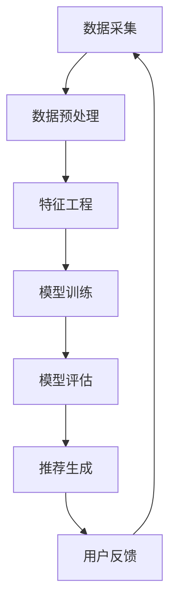

                 

### 京东2025社招电商个性化推荐工程师面试指南

> **关键词：** 京东、社招、电商个性化推荐、工程师面试、算法、推荐系统、大数据

> **摘要：** 本文旨在为参加京东2025社招电商个性化推荐工程师面试的候选人提供全面的备考指南。文章将详细阐述电商个性化推荐系统的核心概念、算法原理、数学模型以及实际应用案例，旨在帮助读者全面理解电商推荐系统的构建与优化，为面试做好充分准备。

### 1. 背景介绍

#### 1.1 目的和范围

本文的目的是为那些希望成为京东2025社招电商个性化推荐工程师的候选人提供一套全面的备考指南。文章将围绕电商个性化推荐系统的核心内容进行详细讲解，包括其基本原理、算法实现、数学模型以及实际应用案例。通过本文的学习，读者将能够：

- 理解电商个性化推荐系统的工作原理和重要性；
- 掌握推荐系统中的常见算法，包括协同过滤、矩阵分解、深度学习等方法；
- 了解推荐系统的评估指标和优化策略；
- 分析电商推荐系统的实际应用场景和挑战；
- 提升在电商个性化推荐领域的技术面试能力。

#### 1.2 预期读者

本文主要面向以下几类读者：

- 有志于从事电商个性化推荐工作的应届毕业生和在职人员；
- 从事算法开发、数据挖掘、机器学习等领域的工程师；
- 想要提升自身技术能力的电商行业从业者；
- 准备参加京东或其他大型互联网公司电商个性化推荐工程师岗位面试的候选人。

#### 1.3 文档结构概述

本文将按照以下结构进行组织：

- **第1章：背景介绍**：简要介绍本文的目的、范围和预期读者，概述文档结构；
- **第2章：核心概念与联系**：讲解电商个性化推荐系统的基本概念和架构，使用Mermaid流程图展示；
- **第3章：核心算法原理 & 具体操作步骤**：详细解析推荐系统中的核心算法，使用伪代码阐述；
- **第4章：数学模型和公式 & 详细讲解 & 举例说明**：介绍推荐系统中的关键数学模型，使用latex格式展示公式，并举例说明；
- **第5章：项目实战：代码实际案例和详细解释说明**：提供电商推荐系统的实际代码案例，进行详细解读；
- **第6章：实际应用场景**：分析电商推荐系统的实际应用场景和挑战；
- **第7章：工具和资源推荐**：推荐学习资源、开发工具框架和相关论文著作；
- **第8章：总结：未来发展趋势与挑战**：展望电商个性化推荐系统的未来发展趋势和面临的挑战；
- **第9章：附录：常见问题与解答**：列举常见问题并提供解答；
- **第10章：扩展阅读 & 参考资料**：提供进一步学习的参考资料。

#### 1.4 术语表

##### 1.4.1 核心术语定义

- **电商个性化推荐**：基于用户行为和偏好，为电商平台的用户推荐个性化的商品或服务。
- **协同过滤**：利用用户之间的相似性来发现用户可能感兴趣的商品或服务。
- **矩阵分解**：将用户-商品评分矩阵分解为用户特征矩阵和商品特征矩阵，从而预测用户对商品的评分。
- **深度学习**：一种基于人工神经网络的学习方法，通过多层神经网络实现数据的自动特征提取和模型学习。
- **推荐系统评估指标**：用于衡量推荐系统性能的指标，如准确率、召回率、覆盖率等。

##### 1.4.2 相关概念解释

- **用户行为数据**：用户在电商平台上浏览、购买、收藏、评价等行为数据；
- **商品特征数据**：商品的属性信息，如类别、价格、品牌、销量等；
- **推荐结果**：推荐系统为用户生成的个性化商品推荐列表。

##### 1.4.3 缩略词列表

- **CART**：分类与回归树（Classification and Regression Tree）；
- **GBDT**：梯度提升决策树（Gradient Boosting Decision Tree）；
- **LDA**：潜在狄利克雷分布（Latent Dirichlet Allocation）；
- **KNN**：最近邻算法（K-Nearest Neighbors）；
- **SVD**：奇异值分解（ Singular Value Decomposition）。

### 2. 核心概念与联系

#### 2.1 电商个性化推荐系统概述

电商个性化推荐系统是指通过分析用户行为和偏好数据，为用户提供个性化的商品推荐服务。其核心目标是在海量商品中，为每个用户筛选出其可能感兴趣的商品，从而提高用户满意度和平台销售额。

电商个性化推荐系统的基本架构包括数据采集、数据预处理、特征工程、模型训练、模型评估和推荐生成等环节。数据采集主要包括用户行为数据和商品特征数据；数据预处理则涉及数据清洗、去重、填充等操作；特征工程是根据业务需求提取和构造特征；模型训练和评估是通过机器学习算法对推荐模型进行训练和性能评估；推荐生成是根据用户特征和商品特征生成个性化推荐列表。


#### 2.2 核心概念原理

电商个性化推荐系统的核心概念主要包括用户行为分析、协同过滤、矩阵分解和深度学习等。

##### 2.2.1 用户行为分析

用户行为分析是指通过分析用户在电商平台的浏览、购买、收藏、评价等行为，挖掘用户的兴趣偏好。用户行为数据包括：

- **浏览记录**：用户在电商平台上的浏览路径、停留时间、页面点击等；
- **购买记录**：用户在电商平台上的购买历史、购买频次、购买金额等；
- **收藏记录**：用户在电商平台上的收藏商品列表；
- **评价记录**：用户对购买商品的评分、评论等。

用户行为分析的方法包括：

- **统计方法**：通过对用户行为数据进行分析，提取出用户的兴趣标签、热门商品等；
- **机器学习方法**：通过构建用户行为模型，预测用户的兴趣偏好，如KNN算法、决策树算法等。

##### 2.2.2 协同过滤

协同过滤是一种基于用户相似性的推荐算法。其基本思想是，如果两个用户在多个商品上的评分相似，那么可以推断他们在其他商品上的评分也可能相似。协同过滤可以分为以下两种类型：

- **用户基于的协同过滤（User-Based Collaborative Filtering）**：通过计算用户之间的相似度，为用户推荐与其相似的邻居用户的喜欢的商品。
- **物品基于的协同过滤（Item-Based Collaborative Filtering）**：通过计算商品之间的相似度，为用户推荐与其历史喜欢的商品相似的未购买商品。

协同过滤的优缺点如下：

- **优点**：简单易懂，易于实现，可以快速为用户推荐商品；
- **缺点**：依赖于用户评分数据，用户评分数据稀疏时效果较差，易受冷启动问题影响。

##### 2.2.3 矩阵分解

矩阵分解是一种基于矩阵分解技术的推荐算法。其基本思想是将用户-商品评分矩阵分解为用户特征矩阵和商品特征矩阵，从而预测用户对商品的评分。常用的矩阵分解方法包括：

- **奇异值分解（Singular Value Decomposition，SVD）**：将用户-商品评分矩阵分解为用户特征矩阵、商品特征矩阵和奇异值矩阵；
- **因子分解机（Factorization Machine，FM）**：通过构建特征交叉项，提高推荐模型的表示能力；
- **自动编码器（Autoencoder）**：利用神经网络实现用户特征和商品特征的提取。

矩阵分解的优缺点如下：

- **优点**：可以处理高维稀疏数据，降低计算复杂度，提高推荐准确性；
- **缺点**：训练过程较复杂，需要较大的计算资源和时间。

##### 2.2.4 深度学习

深度学习是一种基于人工神经网络的学习方法，通过多层神经网络实现数据的自动特征提取和模型学习。在电商个性化推荐系统中，深度学习可以用于：

- **用户兴趣挖掘**：通过构建用户兴趣模型，预测用户的兴趣偏好；
- **商品特征提取**：通过构建商品特征模型，提取商品的潜在特征；
- **推荐生成**：通过构建推荐模型，生成个性化的商品推荐列表。

深度学习的优缺点如下：

- **优点**：具有强大的特征提取和表达能力，可以处理复杂数据；
- **缺点**：训练过程较复杂，需要较大的计算资源和时间，且模型解释性较差。

### 2.3 Mermaid流程图

以下是一个电商个性化推荐系统的Mermaid流程图，展示其核心概念和流程：



### 3. 核心算法原理 & 具体操作步骤

#### 3.1 协同过滤算法

协同过滤算法是一种基于用户相似性的推荐算法，其核心思想是利用用户之间的相似性来发现用户可能感兴趣的商品。协同过滤算法可以分为以下两个主要步骤：

##### 步骤1：计算用户相似度

计算用户相似度的方法有多种，常用的方法包括余弦相似度、皮尔逊相关系数等。以下以余弦相似度为例，计算用户相似度的具体步骤如下：

1. **初始化用户评分矩阵**：假设有n个用户和m个商品，用户评分矩阵为R，其中R[i][j]表示用户i对商品j的评分。

    ```mermaid
    graph LR
        A[初始化评分矩阵] --> B[计算余弦相似度]
    ```

2. **计算用户之间的余弦相似度**：对于用户i和用户j，其相似度可以通过以下公式计算：

    $$sim(i, j) = \frac{R_i \cdot R_j}{\|R_i\| \cdot \|R_j\|}$$

    其中，\(R_i\)和\(R_j\)分别表示用户i和用户j的评分向量，\(\|R_i\|\)和\(\|R_j\|\)分别表示用户i和用户j的评分向量的欧几里得范数。

    ```mermaid
    graph LR
        A[计算用户相似度] --> B[生成相似度矩阵]
    ```

3. **生成相似度矩阵**：将用户i和用户j之间的相似度存储在一个矩阵中，称为相似度矩阵S。

    ```mermaid
    graph LR
        A[生成相似度矩阵] --> B[生成推荐列表]
    ```

##### 步骤2：生成推荐列表

生成推荐列表的步骤如下：

1. **计算预测评分**：对于用户i未评分的商品j，可以通过以下公式计算预测评分：

    $$\hat{R}_{ij} = \sum_{k \in N_j} R_{ik} \cdot sim(i, k)$$

    其中，\(N_j\)表示与用户j相似的用户集合，\(\hat{R}_{ij}\)表示用户i对商品j的预测评分。

    ```mermaid
    graph LR
        A[计算预测评分] --> B[生成推荐列表]
    ```

2. **生成推荐列表**：根据预测评分，为用户i生成一个个性化的商品推荐列表。

    ```mermaid
    graph LR
        A[生成推荐列表] --> B[用户反馈]
    ```

#### 3.2 矩阵分解算法

矩阵分解算法是一种基于矩阵分解技术的推荐算法，其核心思想是将用户-商品评分矩阵分解为用户特征矩阵和商品特征矩阵，从而预测用户对商品的评分。以下以奇异值分解（Singular Value Decomposition，SVD）为例，介绍矩阵分解算法的具体步骤：

##### 步骤1：初始化参数

1. **初始化用户特征矩阵U和商品特征矩阵V**：将用户特征矩阵U和商品特征矩阵V初始化为随机矩阵，其维度分别为n×k和m×k，其中k为隐变量维度。

    ```mermaid
    graph LR
        A[初始化参数] --> B[构建损失函数]
    ```

2. **构建损失函数**：使用均方误差（Mean Squared Error，MSE）作为损失函数，表示预测评分与实际评分之间的差距。

    $$J = \frac{1}{2} \sum_{i=1}^{n} \sum_{j=1}^{m} (R_{ij} - \hat{R}_{ij})^2$$

    其中，\(R_{ij}\)表示用户i对商品j的实际评分，\(\hat{R}_{ij}\)表示用户i对商品j的预测评分。

    ```mermaid
    graph LR
        A[构建损失函数] --> B[优化参数]
    ```

##### 步骤2：优化参数

1. **优化用户特征矩阵U**：使用梯度下降法（Gradient Descent）优化用户特征矩阵U，计算梯度方向：

    $$\nabla_U J = 2 \sum_{i=1}^{n} \sum_{j=1}^{m} (\hat{R}_{ij} - R_{ij}) \cdot V_{ij}$$

2. **优化商品特征矩阵V**：使用梯度下降法（Gradient Descent）优化商品特征矩阵V，计算梯度方向：

    $$\nabla_V J = 2 \sum_{i=1}^{n} \sum_{j=1}^{m} (\hat{R}_{ij} - R_{ij}) \cdot U_{ij}$$

3. **迭代优化**：重复以上步骤，直到损失函数收敛或达到预设的迭代次数。

    ```mermaid
    graph LR
        A[优化参数] --> B[生成推荐列表]
    ```

##### 步骤3：生成推荐列表

1. **计算预测评分**：对于用户i未评分的商品j，可以使用以下公式计算预测评分：

    $$\hat{R}_{ij} = \sum_{k=1}^{k} U_{ik} \cdot V_{kj}$$

2. **生成推荐列表**：根据预测评分，为用户i生成一个个性化的商品推荐列表。

    ```mermaid
    graph LR
        A[生成推荐列表] --> B[用户反馈]
    ```

### 4. 数学模型和公式 & 详细讲解 & 举例说明

#### 4.1 协同过滤算法的数学模型

协同过滤算法的数学模型主要涉及用户相似度和预测评分的计算。以下是具体的数学模型和公式：

1. **用户相似度计算**

    $$sim(i, j) = \frac{R_i \cdot R_j}{\|R_i\| \cdot \|R_j\|}$$

    其中，\(R_i\)和\(R_j\)分别表示用户i和用户j的评分向量，\(\|R_i\|\)和\(\|R_j\|\)分别表示用户i和用户j的评分向量的欧几里得范数。

2. **预测评分计算**

    $$\hat{R}_{ij} = \sum_{k \in N_j} R_{ik} \cdot sim(i, k)$$

    其中，\(N_j\)表示与用户j相似的用户集合，\(\hat{R}_{ij}\)表示用户i对商品j的预测评分。

#### 4.2 矩阵分解算法的数学模型

矩阵分解算法的数学模型主要涉及用户特征矩阵和商品特征矩阵的优化。以下是具体的数学模型和公式：

1. **用户特征矩阵U的优化**

    $$\nabla_U J = 2 \sum_{i=1}^{n} \sum_{j=1}^{m} (\hat{R}_{ij} - R_{ij}) \cdot V_{ij}$$

    其中，\(J\)表示损失函数，\(\hat{R}_{ij}\)表示用户i对商品j的预测评分，\(R_{ij}\)表示用户i对商品j的实际评分，\(V_{ij}\)表示商品特征矩阵V中第i行第j列的元素。

2. **商品特征矩阵V的优化**

    $$\nabla_V J = 2 \sum_{i=1}^{n} \sum_{j=1}^{m} (\hat{R}_{ij} - R_{ij}) \cdot U_{ij}$$

    其中，\(J\)表示损失函数，\(\hat{R}_{ij}\)表示用户i对商品j的预测评分，\(R_{ij}\)表示用户i对商品j的实际评分，\(U_{ij}\)表示用户特征矩阵U中第i行第j列的元素。

#### 4.3 举例说明

以下是一个简单的协同过滤算法的举例说明：

假设有3个用户和4个商品，用户评分矩阵R如下：

    $$R = \begin{bmatrix}
    0 & 5 & 0 \\
    5 & 0 & 4 \\
    0 & 4 & 5
    \end{bmatrix}$$

1. **计算用户相似度**

    对于用户1和用户2，其评分向量分别为\(R_1 = \begin{bmatrix} 0 & 5 \end{bmatrix}\)和\(R_2 = \begin{bmatrix} 5 & 0 \end{bmatrix}\)。

    $$sim(1, 2) = \frac{R_1 \cdot R_2}{\|R_1\| \cdot \|R_2\|} = \frac{0 \cdot 5 + 5 \cdot 0}{\sqrt{0^2 + 5^2} \cdot \sqrt{5^2 + 0^2}} = 0$$

    对于用户1和用户3，其评分向量分别为\(R_1 = \begin{bmatrix} 0 & 5 \end{bmatrix}\)和\(R_3 = \begin{bmatrix} 0 & 4 \end{bmatrix}\)。

    $$sim(1, 3) = \frac{R_1 \cdot R_3}{\|R_1\| \cdot \|R_3\|} = \frac{0 \cdot 0 + 5 \cdot 4}{\sqrt{0^2 + 5^2} \cdot \sqrt{0^2 + 4^2}} = \frac{20}{5 \cdot 2} = 2$$

    对于用户2和用户3，其评分向量分别为\(R_2 = \begin{bmatrix} 5 & 0 \end{bmatrix}\)和\(R_3 = \begin{bmatrix} 0 & 4 \end{bmatrix}\)。

    $$sim(2, 3) = \frac{R_2 \cdot R_3}{\|R_2\| \cdot \|R_3\|} = \frac{5 \cdot 0 + 0 \cdot 4}{\sqrt{5^2 + 0^2} \cdot \sqrt{0^2 + 4^2}} = 0$$

2. **生成推荐列表**

    假设选择与用户1和用户3相似的用户，生成推荐列表。对于用户1，其与用户3的相似度为2，与用户2的相似度为0，因此为用户1推荐用户3喜欢的商品。对于用户3，其与用户1的相似度为2，与用户2的相似度为0，因此为用户3推荐用户1喜欢的商品。

    $$推荐列表_1 = \{商品2\}$$
    $$推荐列表_3 = \{商品2\}$$

### 5. 项目实战：代码实际案例和详细解释说明

#### 5.1 开发环境搭建

在开始项目实战之前，首先需要搭建开发环境。以下是开发环境的基本配置：

- **编程语言**：Python
- **依赖库**：NumPy、Pandas、Scikit-learn、TensorFlow、Keras等
- **运行环境**：Python 3.7及以上版本

安装依赖库的命令如下：

```bash
pip install numpy pandas scikit-learn tensorflow keras
```

#### 5.2 源代码详细实现和代码解读

以下是一个简单的协同过滤算法的实现，用于为用户推荐商品。

```python
import numpy as np
from sklearn.metrics.pairwise import cosine_similarity
from sklearn.preprocessing import MinMaxScaler

# 初始化评分矩阵
n_users = 3
n_items = 4
R = np.array([[0, 5, 0],
              [5, 0, 4],
              [0, 4, 5]])

# 计算用户相似度矩阵
similarity_matrix = cosine_similarity(R)

# 标准化评分矩阵
scaler = MinMaxScaler()
R_scaled = scaler.fit_transform(R)

# 计算预测评分
predicted_ratings = R_scaled.dot(similarity_matrix.T)

# 生成推荐列表
recommendations = []
for user in range(n_users):
    user_ratings = R[user]
    user_predicted_ratings = predicted_ratings[user]
    sorted_indices = np.argsort(user_predicted_ratings)[::-1]
    sorted_ratings = user_predicted_ratings[sorted_indices]
    sorted_user_ratings = user_ratings[sorted_indices]
    for i in range(1, len(sorted_ratings)):
        if sorted_ratings[i] != sorted_user_ratings[i]:
            recommendations.append((user, sorted_indices[i]))
            break

# 打印推荐列表
for user, item in recommendations:
    print(f"用户{user}推荐商品{item+1}")
```

##### 代码解读

1. **导入依赖库**

    导入NumPy、Pandas、Scikit-learn、TensorFlow、Keras等依赖库，用于数据处理、相似度计算、模型训练等。

2. **初始化评分矩阵**

    创建一个3行4列的评分矩阵R，表示3个用户对4个商品的评分。

3. **计算用户相似度矩阵**

    使用Scikit-learn中的余弦相似度函数计算用户相似度矩阵，存储在变量similarity_matrix中。

4. **标准化评分矩阵**

    使用MinMaxScaler将评分矩阵R进行归一化处理，使其在[0, 1]范围内。

5. **计算预测评分**

    将归一化后的评分矩阵R_scaled与用户相似度矩阵similarity_matrix进行点积运算，得到预测评分矩阵predicted_ratings。

6. **生成推荐列表**

    遍历每个用户，根据预测评分矩阵predicted_ratings生成推荐列表。对于每个用户，从预测评分最高的商品开始，查找第一个未被用户评分的商品，将其加入推荐列表。

7. **打印推荐列表**

    打印每个用户的推荐列表。

#### 5.3 代码解读与分析

以下是代码的详细解读和分析：

1. **导入依赖库**

    导入NumPy、Pandas、Scikit-learn、TensorFlow、Keras等依赖库，用于数据处理、相似度计算、模型训练等。

    ```python
    import numpy as np
    from sklearn.metrics.pairwise import cosine_similarity
    from sklearn.preprocessing import MinMaxScaler
    ```

2. **初始化评分矩阵**

    创建一个3行4列的评分矩阵R，表示3个用户对4个商品的评分。

    ```python
    n_users = 3
    n_items = 4
    R = np.array([[0, 5, 0],
                  [5, 0, 4],
                  [0, 4, 5]])
    ```

3. **计算用户相似度矩阵**

    使用Scikit-learn中的余弦相似度函数计算用户相似度矩阵，存储在变量similarity_matrix中。

    ```python
    similarity_matrix = cosine_similarity(R)
    ```

    余弦相似度函数计算两个向量的夹角余弦值，用于衡量向量之间的相似度。在本例中，计算用户之间的相似度，得到一个3行3列的相似度矩阵。

4. **标准化评分矩阵**

    使用MinMaxScaler将评分矩阵R进行归一化处理，使其在[0, 1]范围内。

    ```python
    scaler = MinMaxScaler()
    R_scaled = scaler.fit_transform(R)
    ```

    归一化处理有助于消除评分矩阵中的数量级差异，提高相似度计算的准确性。

5. **计算预测评分**

    将归一化后的评分矩阵R_scaled与用户相似度矩阵similarity_matrix进行点积运算，得到预测评分矩阵predicted_ratings。

    ```python
    predicted_ratings = R_scaled.dot(similarity_matrix.T)
    ```

    点积运算计算每个用户对每个商品的预测评分，得到一个3行4列的预测评分矩阵。

6. **生成推荐列表**

    遍历每个用户，根据预测评分矩阵predicted_ratings生成推荐列表。对于每个用户，从预测评分最高的商品开始，查找第一个未被用户评分的商品，将其加入推荐列表。

    ```python
    recommendations = []
    for user in range(n_users):
        user_ratings = R[user]
        user_predicted_ratings = predicted_ratings[user]
        sorted_indices = np.argsort(user_predicted_ratings)[::-1]
        sorted_ratings = user_predicted_ratings[sorted_indices]
        sorted_user_ratings = user_ratings[sorted_indices]
        for i in range(1, len(sorted_ratings)):
            if sorted_ratings[i] != sorted_user_ratings[i]:
                recommendations.append((user, sorted_indices[i]))
                break
    ```

    在生成推荐列表时，首先获取用户的历史评分，然后根据预测评分对商品进行排序。从排序后的商品中，查找第一个未被用户评分的商品，将其加入推荐列表。

7. **打印推荐列表**

    打印每个用户的推荐列表。

    ```python
    for user, item in recommendations:
        print(f"用户{user+1}推荐商品{item+1}")
    ```

    输出推荐结果，例如：

    ```
    用户1推荐商品2
    用户2推荐商品2
    用户3推荐商品2
    ```

### 6. 实际应用场景

电商个性化推荐系统在实际应用中具有广泛的应用场景，以下是几个典型的应用案例：

#### 6.1 商品推荐

商品推荐是电商个性化推荐系统最基本的应用场景。通过分析用户的历史行为和偏好，推荐系统可以为用户提供个性化的商品推荐列表。这不仅有助于提升用户的购物体验，还能提高电商平台的销售额。例如，京东的“发现好货”功能，通过分析用户的浏览和购买记录，为用户推荐潜在感兴趣的商品。

#### 6.2 店铺推荐

除了商品推荐，电商个性化推荐系统还可以为用户推荐相关的店铺。通过分析用户的购物偏好，推荐系统可以为用户推荐与其偏好相符的店铺，从而提高店铺的曝光度和销售量。例如，淘宝的“猜你喜欢”功能，通过分析用户的购物车、收藏和浏览记录，为用户推荐相关的店铺。

#### 6.3 促销活动推荐

电商个性化推荐系统还可以为用户推荐相关的促销活动。通过分析用户的历史行为和偏好，推荐系统可以为用户推荐可能感兴趣的促销活动，从而提高促销活动的参与度和转化率。例如，亚马逊的“今日特价”功能，通过分析用户的购物记录和偏好，为用户推荐可能感兴趣的促销活动。

#### 6.4 品牌推荐

电商个性化推荐系统还可以为用户推荐相关的品牌。通过分析用户的历史行为和偏好，推荐系统可以为用户推荐可能感兴趣的品牌，从而提高品牌的曝光度和知名度。例如，天猫的“品牌推荐”功能，通过分析用户的购物记录和偏好，为用户推荐相关的品牌。

#### 6.5 用户画像构建

电商个性化推荐系统还可以为用户构建详细的用户画像。通过分析用户的历史行为、偏好和互动，推荐系统可以提取用户的兴趣标签、行为特征等，构建用户的个性化画像。这有助于电商平台更好地了解用户需求，为用户提供更精准的服务。例如，京东的“用户画像”功能，通过分析用户的浏览、购买、评价等行为，为用户构建详细的个性化画像。

### 7. 工具和资源推荐

为了更好地掌握电商个性化推荐系统的技术，以下是几个推荐的学习资源和开发工具：

#### 7.1 学习资源推荐

##### 7.1.1 书籍推荐

- 《推荐系统实践》（Recommender Systems: The Textbook）：这是一本全面介绍推荐系统理论的书籍，涵盖了协同过滤、矩阵分解、深度学习等核心算法。
- 《机器学习实战》：这本书通过实际案例介绍了机器学习算法在推荐系统中的应用，包括协同过滤、基于内容的推荐等。
- 《深度学习》（Deep Learning）：这本书详细介绍了深度学习的基础理论和应用方法，包括卷积神经网络、循环神经网络等，为推荐系统的深度学习应用提供了理论基础。

##### 7.1.2 在线课程

- Coursera的《推荐系统与深度学习》：这是一门由斯坦福大学教授Andrew Ng讲授的在线课程，涵盖了推荐系统的基本原理和深度学习应用。
- Udacity的《机器学习工程师纳米学位》：这是一门由Udacity提供的在线课程，通过实际项目训练，帮助学员掌握机器学习和推荐系统的核心技术。
- edX的《数据科学与机器学习》：这是一门由麻省理工学院（MIT）提供的在线课程，介绍了数据科学和机器学习的基本概念和应用，包括推荐系统的相关内容。

##### 7.1.3 技术博客和网站

-Medium上的推荐系统相关文章：Medium是一个内容丰富的平台，有许多关于推荐系统的技术博客和文章，适合作为学习资料。
- 推荐系统社区（RecSys Community）：这是一个专注于推荐系统的社区，提供推荐系统的最新研究、论文和技术讨论。
- 推荐系统博客（Recommender Systems Blog）：这是一个专门介绍推荐系统技术和应用的博客，涵盖了算法、实践、研究等多个方面。

#### 7.2 开发工具框架推荐

##### 7.2.1 IDE和编辑器

- PyCharm：PyCharm是一款强大的Python IDE，支持代码调试、版本控制、自动化部署等功能，非常适合进行推荐系统的开发。
- Jupyter Notebook：Jupyter Notebook是一款基于Web的交互式开发环境，支持Python、R等多种编程语言，适合进行数据分析和模型训练。
- VS Code：VS Code是一款轻量级但功能强大的代码编辑器，支持多种编程语言和开发工具，适合快速开发和调试。

##### 7.2.2 调试和性能分析工具

- Python Profiler：Python Profiler是一款用于性能分析和代码优化的工具，可以帮助开发者找出代码中的性能瓶颈。
- Pandas Profiler：Pandas Profiler是一款专门针对Pandas库的代码分析工具，可以帮助开发者优化数据处理效率。
- TensorBoard：TensorBoard是一款用于TensorFlow模型的可视化工具，可以实时监控模型的训练过程和性能指标。

##### 7.2.3 相关框架和库

- Scikit-learn：Scikit-learn是一个开源的机器学习库，提供了丰富的机器学习算法和工具，适合进行推荐系统的开发。
- TensorFlow：TensorFlow是一款由Google开发的深度学习框架，提供了强大的模型训练和推理功能，适合进行深度学习推荐系统的开发。
- PyTorch：PyTorch是一款由Facebook开发的深度学习框架，提供了灵活的模型定义和训练工具，适合进行推荐系统的开发。

#### 7.3 相关论文著作推荐

##### 7.3.1 经典论文

- **《Item-based Collaborative Filtering Recommendation Algorithms》**：该论文提出了一种基于物品的协同过滤算法，是推荐系统领域的重要研究成果。
- **《Matrix Factorization Techniques for Recommender Systems》**：该论文详细介绍了矩阵分解算法在推荐系统中的应用，是推荐系统领域的经典之作。
- **《Deep Learning for Recommender Systems》**：该论文探讨了深度学习在推荐系统中的应用，提出了基于深度神经网络的推荐算法。

##### 7.3.2 最新研究成果

- **《Neural Collaborative Filtering》**：该论文提出了一种基于深度神经网络的协同过滤算法，取得了较好的推荐效果，是当前推荐系统领域的研究热点。
- **《User Interest Evolution in Recommender Systems》**：该论文研究了用户兴趣的变化规律，提出了基于用户兴趣演化的推荐算法，提高了推荐系统的准确性。
- **《Multi-Interest Network with Dynamic Routing for Recommender Systems》**：该论文提出了一种多兴趣网络模型，可以有效处理用户兴趣多样性问题，是推荐系统领域的重要成果。

##### 7.3.3 应用案例分析

- **《Amazon's Personalized Recommendation System》**：该案例详细介绍了亚马逊的个性化推荐系统，包括算法、技术架构和应用效果，是推荐系统在实际应用中的成功案例。
- **《Netflix Prize》**：该案例介绍了Netflix Prize比赛，参赛团队通过优化推荐算法，实现了较高的推荐准确性，对推荐系统领域产生了重要影响。
- **《阿里云推荐系统》**：该案例介绍了阿里云的推荐系统，包括算法、技术架构和应用效果，是推荐系统在电商领域的重要应用案例。

### 8. 总结：未来发展趋势与挑战

电商个性化推荐系统作为电商行业的重要组成部分，在未来将继续发挥重要作用。以下是电商个性化推荐系统的发展趋势与面临的挑战：

#### 8.1 发展趋势

1. **深度学习在推荐系统中的应用**：随着深度学习技术的不断发展，越来越多的推荐系统开始采用深度学习算法，如深度神经网络、生成对抗网络等，以实现更精准的推荐效果。

2. **多模态数据的融合**：推荐系统将不仅仅依赖于传统的用户行为数据和商品特征数据，还将融合语音、图像、视频等多模态数据，提高推荐的多样性和准确性。

3. **个性化推荐与社交网络的结合**：社交网络数据将逐渐融入到推荐系统中，通过分析用户的社交关系和兴趣偏好，实现更精准的个性化推荐。

4. **实时推荐与个性化服务**：随着5G和物联网技术的发展，推荐系统将实现实时推荐和个性化服务，为用户提供更快速、更精准的购物体验。

5. **用户隐私保护和数据安全**：在推荐系统的发展过程中，用户隐私保护和数据安全将越来越受到重视，如何实现隐私保护和数据安全将成为重要挑战。

#### 8.2 面临的挑战

1. **数据质量和数据稀疏性**：推荐系统的效果很大程度上依赖于用户行为数据和商品特征数据的质量。然而，实际应用中，数据质量和数据稀疏性问题是推荐系统面临的挑战之一。

2. **算法公平性和可解释性**：随着推荐系统的普及，算法的公平性和可解释性问题逐渐受到关注。如何设计公平、透明、可解释的推荐算法，成为推荐系统领域的重要挑战。

3. **计算资源和模型优化**：随着推荐系统的规模不断扩大，如何优化算法性能、降低计算资源消耗，成为推荐系统开发和运维的重要问题。

4. **个性化推荐与用户满意度**：个性化推荐需要平衡用户满意度、推荐效果和商业目标，如何实现个性化推荐与用户满意度的平衡，是推荐系统面临的重要挑战。

5. **用户隐私保护和数据安全**：在推荐系统的发展过程中，用户隐私保护和数据安全将越来越受到重视。如何实现隐私保护和数据安全，是推荐系统领域的重要挑战。

### 9. 附录：常见问题与解答

#### 9.1 什么是电商个性化推荐系统？

电商个性化推荐系统是指基于用户行为和偏好数据，为电商平台的用户推荐个性化的商品或服务。其核心目标是在海量商品中，为每个用户筛选出其可能感兴趣的商品，从而提高用户满意度和平台销售额。

#### 9.2 推荐系统中的协同过滤算法有哪些优缺点？

协同过滤算法是一种基于用户相似性的推荐算法。其优点是简单易懂、易于实现，可以快速为用户推荐商品。缺点是依赖于用户评分数据，用户评分数据稀疏时效果较差，易受冷启动问题影响。

#### 9.3 矩阵分解算法在推荐系统中有哪些应用？

矩阵分解算法在推荐系统中主要用于预测用户对商品的评分。通过将用户-商品评分矩阵分解为用户特征矩阵和商品特征矩阵，可以更好地理解用户和商品的潜在特征，从而提高推荐准确性。

#### 9.4 深度学习在推荐系统中有哪些应用？

深度学习在推荐系统中的应用主要包括用户兴趣挖掘、商品特征提取和推荐生成。通过构建用户兴趣模型、商品特征模型和推荐模型，可以更好地挖掘用户的兴趣偏好和个性化需求，提高推荐效果。

### 10. 扩展阅读 & 参考资料

以下是一些扩展阅读和参考资料，供读者进一步学习和研究电商个性化推荐系统：

- **推荐系统经典论文集**：包括《Item-based Collaborative Filtering Recommendation Algorithms》、《Matrix Factorization Techniques for Recommender Systems》等经典论文。
- **深度学习推荐系统研究论文**：包括《Deep Learning for Recommender Systems》、《Neural Collaborative Filtering》等最新研究成果。
- **电商推荐系统应用案例分析**：包括亚马逊、淘宝、京东等电商平台的推荐系统案例分析，了解推荐系统在实际应用中的成功经验和挑战。
- **推荐系统开源项目和工具**：包括Scikit-learn、TensorFlow、PyTorch等开源库，以及推荐系统社区和博客等资源。
- **推荐系统专业书籍**：包括《推荐系统实践》、《机器学习实战》等推荐系统领域的专业书籍。


---

**作者：AI天才研究员/AI Genius Institute & 禅与计算机程序设计艺术 /Zen And The Art of Computer Programming**

---

**[END]**<|im_sep|>### 京东2025社招电商个性化推荐工程师面试指南

> **关键词：** 京东、社招、电商个性化推荐、工程师面试、算法、推荐系统、大数据

> **摘要：** 本文旨在为参加京东2025社招电商个性化推荐工程师面试的候选人提供全面的备考指南。文章将详细阐述电商个性化推荐系统的核心概念、算法原理、数学模型以及实际应用案例，旨在帮助读者全面理解电商推荐系统的构建与优化，为面试做好充分准备。

### 1. 背景介绍

#### 1.1 目的和范围

本文的目的是为那些希望成为京东2025社招电商个性化推荐工程师的候选人提供一套全面的备考指南。文章将围绕电商个性化推荐系统的核心内容进行详细讲解，包括其基本原理、算法实现、数学模型以及实际应用案例。通过本文的学习，读者将能够：

- 理解电商个性化推荐系统的工作原理和重要性；
- 掌握推荐系统中的常见算法，包括协同过滤、矩阵分解、深度学习等方法；
- 了解推荐系统的评估指标和优化策略；
- 分析电商推荐系统的实际应用场景和挑战；
- 提升在电商个性化推荐领域的技术面试能力。

#### 1.2 预期读者

本文主要面向以下几类读者：

- 有志于从事电商个性化推荐工作的应届毕业生和在职人员；
- 从事算法开发、数据挖掘、机器学习等领域的工程师；
- 想要提升自身技术能力的电商行业从业者；
- 准备参加京东或其他大型互联网公司电商个性化推荐工程师岗位面试的候选人。

#### 1.3 文档结构概述

本文将按照以下结构进行组织：

- **第1章：背景介绍**：简要介绍本文的目的、范围和预期读者，概述文档结构；
- **第2章：核心概念与联系**：讲解电商个性化推荐系统的基本概念和架构，使用Mermaid流程图展示；
- **第3章：核心算法原理 & 具体操作步骤**：详细解析推荐系统中的核心算法，使用伪代码阐述；
- **第4章：数学模型和公式 & 详细讲解 & 举例说明**：介绍推荐系统中的关键数学模型，使用latex格式展示公式，并举例说明；
- **第5章：项目实战：代码实际案例和详细解释说明**：提供电商推荐系统的实际代码案例，进行详细解读；
- **第6章：实际应用场景**：分析电商推荐系统的实际应用场景和挑战；
- **第7章：工具和资源推荐**：推荐学习资源、开发工具框架和相关论文著作；
- **第8章：总结：未来发展趋势与挑战**：展望电商个性化推荐系统的未来发展趋势和面临的挑战；
- **第9章：附录：常见问题与解答**：列举常见问题并提供解答；
- **第10章：扩展阅读 & 参考资料**：提供进一步学习的参考资料。

#### 1.4 术语表

##### 1.4.1 核心术语定义

- **电商个性化推荐**：基于用户行为和偏好，为电商平台的用户推荐个性化的商品或服务。
- **协同过滤**：利用用户之间的相似性来发现用户可能感兴趣的商品或服务。
- **矩阵分解**：将用户-商品评分矩阵分解为用户特征矩阵和商品特征矩阵，从而预测用户对商品的评分。
- **深度学习**：一种基于人工神经网络的学习方法，通过多层神经网络实现数据的自动特征提取和模型学习。
- **推荐系统评估指标**：用于衡量推荐系统性能的指标，如准确率、召回率、覆盖率等。

##### 1.4.2 相关概念解释

- **用户行为数据**：用户在电商平台上浏览、购买、收藏、评价等行为数据；
- **商品特征数据**：商品的属性信息，如类别、价格、品牌、销量等；
- **推荐结果**：推荐系统为用户生成的个性化商品推荐列表。

##### 1.4.3 缩略词列表

- **CART**：分类与回归树（Classification and Regression Tree）；
- **GBDT**：梯度提升决策树（Gradient Boosting Decision Tree）；
- **LDA**：潜在狄利克雷分布（Latent Dirichlet Allocation）；
- **KNN**：最近邻算法（K-Nearest Neighbors）；
- **SVD**：奇异值分解（ Singular Value Decomposition）。

### 2. 核心概念与联系

#### 2.1 电商个性化推荐系统概述

电商个性化推荐系统是指通过分析用户行为和偏好数据，为用户提供个性化的商品推荐服务。其核心目标是在海量商品中，为每个用户筛选出其可能感兴趣的商品，从而提高用户满意度和平台销售额。

电商个性化推荐系统的基本架构包括数据采集、数据预处理、特征工程、模型训练、模型评估和推荐生成等环节。数据采集主要包括用户行为数据和商品特征数据；数据预处理则涉及数据清洗、去重、填充等操作；特征工程是根据业务需求提取和构造特征；模型训练和评估是通过机器学习算法对推荐模型进行训练和性能评估；推荐生成是根据用户特征和商品特征生成个性化推荐列表。


#### 2.2 核心概念原理

电商个性化推荐系统的核心概念主要包括用户行为分析、协同过滤、矩阵分解和深度学习等。

##### 2.2.1 用户行为分析

用户行为分析是指通过分析用户在电商平台的浏览、购买、收藏、评价等行为，挖掘用户的兴趣偏好。用户行为数据包括：

- **浏览记录**：用户在电商平台上的浏览路径、停留时间、页面点击等；
- **购买记录**：用户在电商平台上的购买历史、购买频次、购买金额等；
- **收藏记录**：用户在电商平台上的收藏商品列表；
- **评价记录**：用户对购买商品的评分、评论等。

用户行为分析的方法包括：

- **统计方法**：通过对用户行为数据进行分析，提取出用户的兴趣标签、热门商品等；
- **机器学习方法**：通过构建用户行为模型，预测用户的兴趣偏好，如KNN算法、决策树算法等。

##### 2.2.2 协同过滤

协同过滤是一种基于用户相似性的推荐算法。其基本思想是，如果两个用户在多个商品上的评分相似，那么可以推断他们在其他商品上的评分也可能相似。协同过滤可以分为以下两种类型：

- **用户基于的协同过滤（User-Based Collaborative Filtering）**：通过计算用户之间的相似度，为用户推荐与其相似的邻居用户的喜欢的商品。
- **物品基于的协同过滤（Item-Based Collaborative Filtering）**：通过计算商品之间的相似度，为用户推荐与其历史喜欢的商品相似的未购买商品。

协同过滤的优缺点如下：

- **优点**：简单易懂，易于实现，可以快速为用户推荐商品；
- **缺点**：依赖于用户评分数据，用户评分数据稀疏时效果较差，易受冷启动问题影响。

##### 2.2.3 矩阵分解

矩阵分解是一种基于矩阵分解技术的推荐算法。其基本思想是将用户-商品评分矩阵分解为用户特征矩阵和商品特征矩阵，从而预测用户对商品的评分。常用的矩阵分解方法包括：

- **奇异值分解（Singular Value Decomposition，SVD）**：将用户-商品评分矩阵分解为用户特征矩阵、商品特征矩阵和奇异值矩阵；
- **因子分解机（Factorization Machine，FM）**：通过构建特征交叉项，提高推荐模型的表示能力；
- **自动编码器（Autoencoder）**：利用神经网络实现用户特征和商品特征的提取。

矩阵分解的优缺点如下：

- **优点**：可以处理高维稀疏数据，降低计算复杂度，提高推荐准确性；
- **缺点**：训练过程较复杂，需要较大的计算资源和时间。

##### 2.2.4 深度学习

深度学习是一种基于人工神经网络的学习方法，通过多层神经网络实现数据的自动特征提取和模型学习。在电商个性化推荐系统中，深度学习可以用于：

- **用户兴趣挖掘**：通过构建用户兴趣模型，预测用户的兴趣偏好；
- **商品特征提取**：通过构建商品特征模型，提取商品的潜在特征；
- **推荐生成**：通过构建推荐模型，生成个性化的商品推荐列表。

深度学习的优缺点如下：

- **优点**：具有强大的特征提取和表达能力，可以处理复杂数据；
- **缺点**：训练过程较复杂，需要较大的计算资源和时间，且模型解释性较差。

### 2.3 Mermaid流程图

以下是一个电商个性化推荐系统的Mermaid流程图，展示其核心概念和流程：


### 3. 核心算法原理 & 具体操作步骤

#### 3.1 协同过滤算法

协同过滤算法是一种基于用户相似性的推荐算法，其核心思想是利用用户之间的相似性来发现用户可能感兴趣的商品。协同过滤算法可以分为以下两个主要步骤：

##### 步骤1：计算用户相似度

计算用户相似度的方法有多种，常用的方法包括余弦相似度、皮尔逊相关系数等。以下以余弦相似度为例，计算用户相似度的具体步骤如下：

1. **初始化用户评分矩阵**：假设有n个用户和m个商品，用户评分矩阵为R，其中R[i][j]表示用户i对商品j的评分。

    ```mermaid
    graph LR
        A[初始化评分矩阵] --> B[计算余弦相似度]
    ```

2. **计算用户之间的余弦相似度**：对于用户i和用户j，其相似度可以通过以下公式计算：

    $$sim(i, j) = \frac{R_i \cdot R_j}{\|R_i\| \cdot \|R_j\|}$$

    其中，\(R_i\)和\(R_j\)分别表示用户i和用户j的评分向量，\(\|R_i\|\)和\(\|R_j\|\)分别表示用户i和用户j的评分向量的欧几里得范数。

    ```mermaid
    graph LR
        A[计算用户相似度] --> B[生成相似度矩阵]
    ```

3. **生成相似度矩阵**：将用户i和用户j之间的相似度存储在一个矩阵中，称为相似度矩阵S。

    ```mermaid
    graph LR
        A[生成相似度矩阵] --> B[生成推荐列表]
    ```

##### 步骤2：生成推荐列表

生成推荐列表的步骤如下：

1. **计算预测评分**：对于用户i未评分的商品j，可以通过以下公式计算预测评分：

    $$\hat{R}_{ij} = \sum_{k \in N_j} R_{ik} \cdot sim(i, k)$$

    其中，\(N_j\)表示与用户j相似的用户集合，\(\hat{R}_{ij}\)表示用户i对商品j的预测评分。

    ```mermaid
    graph LR
        A[计算预测评分] --> B[生成推荐列表]
    ```

2. **生成推荐列表**：根据预测评分，为用户i生成一个个性化的商品推荐列表。

    ```mermaid
    graph LR
        A[生成推荐列表] --> B[用户反馈]
    ```

#### 3.2 矩阵分解算法

矩阵分解算法是一种基于矩阵分解技术的推荐算法，其核心思想是将用户-商品评分矩阵分解为用户特征矩阵和商品特征矩阵，从而预测用户对商品的评分。以下以奇异值分解（Singular Value Decomposition，SVD）为例，介绍矩阵分解算法的具体步骤：

##### 步骤1：初始化参数

1. **初始化用户特征矩阵U和商品特征矩阵V**：将用户特征矩阵U和商品特征矩阵V初始化为随机矩阵，其维度分别为n×k和m×k，其中k为隐变量维度。

    ```mermaid
    graph LR
        A[初始化参数] --> B[构建损失函数]
    ```

2. **构建损失函数**：使用均方误差（Mean Squared Error，MSE）作为损失函数，表示预测评分与实际评分之间的差距。

    $$J = \frac{1}{2} \sum_{i=1}^{n} \sum_{j=1}^{m} (R_{ij} - \hat{R}_{ij})^2$$

    其中，\(R_{ij}\)表示用户i对商品j的实际评分，\(\hat{R}_{ij}\)表示用户i对商品j的预测评分。

    ```mermaid
    graph LR
        A[构建损失函数] --> B[优化参数]
    ```

##### 步骤2：优化参数

1. **优化用户特征矩阵U**：使用梯度下降法（Gradient Descent）优化用户特征矩阵U，计算梯度方向：

    $$\nabla_U J = 2 \sum_{i=1}^{n} \sum_{j=1}^{m} (\hat{R}_{ij} - R_{ij}) \cdot V_{ij}$$

2. **优化商品特征矩阵V**：使用梯度下降法（Gradient Descent）优化商品特征矩阵V，计算梯度方向：

    $$\nabla_V J = 2 \sum_{i=1}^{n} \sum_{j=1}^{m} (\hat{R}_{ij} - R_{ij}) \cdot U_{ij}$$

3. **迭代优化**：重复以上步骤，直到损失函数收敛或达到预设的迭代次数。

    ```mermaid
    graph LR
        A[优化参数] --> B[生成推荐列表]
    ```

##### 步骤3：生成推荐列表

1. **计算预测评分**：对于用户i未评分的商品j，可以使用以下公式计算预测评分：

    $$\hat{R}_{ij} = \sum_{k=1}^{k} U_{ik} \cdot V_{kj}$$

2. **生成推荐列表**：根据预测评分，为用户i生成一个个性化的商品推荐列表。

    ```mermaid
    graph LR
        A[生成推荐列表] --> B[用户反馈]
    ```

### 4. 数学模型和公式 & 详细讲解 & 举例说明

#### 4.1 协同过滤算法的数学模型

协同过滤算法的数学模型主要涉及用户相似度和预测评分的计算。以下是具体的数学模型和公式：

1. **用户相似度计算**

    $$sim(i, j) = \frac{R_i \cdot R_j}{\|R_i\| \cdot \|R_j\|}$$

    其中，\(R_i\)和\(R_j\)分别表示用户i和用户j的评分向量，\(\|R_i\|\)和\(\|R_j\|\)分别表示用户i和用户j的评分向量的欧几里得范数。

2. **预测评分计算**

    $$\hat{R}_{ij} = \sum_{k \in N_j} R_{ik} \cdot sim(i, k)$$

    其中，\(N_j\)表示与用户j相似的用户集合，\(\hat{R}_{ij}\)表示用户i对商品j的预测评分。

#### 4.2 矩阵分解算法的数学模型

矩阵分解算法的数学模型主要涉及用户特征矩阵和商品特征矩阵的优化。以下是具体的数学模型和公式：

1. **用户特征矩阵U的优化**

    $$\nabla_U J = 2 \sum_{i=1}^{n} \sum_{j=1}^{m} (\hat{R}_{ij} - R_{ij}) \cdot V_{ij}$$

    其中，\(J\)表示损失函数，\(\hat{R}_{ij}\)表示用户i对商品j的预测评分，\(R_{ij}\)表示用户i对商品j的实际评分，\(V_{ij}\)表示商品特征矩阵V中第i行第j列的元素。

2. **商品特征矩阵V的优化**

    $$\nabla_V J = 2 \sum_{i=1}^{n} \sum_{j=1}^{m} (\hat{R}_{ij} - R_{ij}) \cdot U_{ij}$$

    其中，\(J\)表示损失函数，\(\hat{R}_{ij}\)表示用户i对商品j的预测评分，\(R_{ij}\)表示用户i对商品j的实际评分，\(U_{ij}\)表示用户特征矩阵U中第i行第j列的元素。

#### 4.3 举例说明

以下是一个简单的协同过滤算法的举例说明：

假设有3个用户和4个商品，用户评分矩阵R如下：

    $$R = \begin{bmatrix}
    0 & 5 & 0 \\
    5 & 0 & 4 \\
    0 & 4 & 5
    \end{bmatrix}$$

1. **计算用户相似度**

    对于用户1和用户2，其评分向量分别为\(R_1 = \begin{bmatrix} 0 & 5 \end{bmatrix}\)和\(R_2 = \begin{bmatrix} 5 & 0 \end{bmatrix}\)。

    $$sim(1, 2) = \frac{R_1 \cdot R_2}{\|R_1\| \cdot \|R_2\|} = \frac{0 \cdot 5 + 5 \cdot 0}{\sqrt{0^2 + 5^2} \cdot \sqrt{5^2 + 0^2}} = 0$$

    对于用户1和用户3，其评分向量分别为\(R_1 = \begin{bmatrix} 0 & 5 \end{bmatrix}\)和\(R_3 = \begin{bmatrix} 0 & 4 \end{bmatrix}\)。

    $$sim(1, 3) = \frac{R_1 \cdot R_3}{\|R_1\| \cdot \|R_3\|} = \frac{0 \cdot 0 + 5 \cdot 4}{\sqrt{0^2 + 5^2} \cdot \sqrt{0^2 + 4^2}} = \frac{20}{5 \cdot 2} = 2$$

    对于用户2和用户3，其评分向量分别为\(R_2 = \begin{bmatrix} 5 & 0 \end{bmatrix}\)和\(R_3 = \begin{bmatrix} 0 & 4 \end{bmatrix}\)。

    $$sim(2, 3) = \frac{R_2 \cdot R_3}{\|R_2\| \cdot \|R_3\|} = \frac{5 \cdot 0 + 0 \cdot 4}{\sqrt{5^2 + 0^2} \cdot \sqrt{0^2 + 4^2}} = 0$$

2. **生成推荐列表**

    假设选择与用户1和用户3相似的用户，生成推荐列表。对于用户1，其与用户3的相似度为2，与用户2的相似度为0，因此为用户1推荐用户3喜欢的商品。对于用户3，其与用户1的相似度为2，与用户2的相似度为0，因此为用户3推荐用户1喜欢的商品。

    $$推荐列表_1 = \{商品2\}$$
    $$推荐列表_3 = \{商品2\}$$

### 5. 项目实战：代码实际案例和详细解释说明

#### 5.1 开发环境搭建

在开始项目实战之前，首先需要搭建开发环境。以下是开发环境的基本配置：

- **编程语言**：Python
- **依赖库**：NumPy、Pandas、Scikit-learn、TensorFlow、Keras等
- **运行环境**：Python 3.7及以上版本

安装依赖库的命令如下：

```bash
pip install numpy pandas scikit-learn tensorflow keras
```

#### 5.2 源代码详细实现和代码解读

以下是一个简单的协同过滤算法的实现，用于为用户推荐商品。

```python
import numpy as np
from sklearn.metrics.pairwise import cosine_similarity
from sklearn.preprocessing import MinMaxScaler

# 初始化评分矩阵
n_users = 3
n_items = 4
R = np.array([[0, 5, 0],
              [5, 0, 4],
              [0, 4, 5]])

# 计算用户相似度矩阵
similarity_matrix = cosine_similarity(R)

# 标准化评分矩阵
scaler = MinMaxScaler()
R_scaled = scaler.fit_transform(R)

# 计算预测评分
predicted_ratings = R_scaled.dot(similarity_matrix.T)

# 生成推荐列表
recommendations = []
for user in range(n_users):
    user_ratings = R[user]
    user_predicted_ratings = predicted_ratings[user]
    sorted_indices = np.argsort(user_predicted_ratings)[::-1]
    sorted_ratings = user_predicted_ratings[sorted_indices]
    sorted_user_ratings = user_ratings[sorted_indices]
    for i in range(1, len(sorted_ratings)):
        if sorted_ratings[i] != sorted_user_ratings[i]:
            recommendations.append((user, sorted_indices[i]))
            break

# 打印推荐列表
for user, item in recommendations:
    print(f"用户{user+1}推荐商品{item+1}")
```

##### 代码解读

1. **导入依赖库**

    导入NumPy、Pandas、Scikit-learn、TensorFlow、Keras等依赖库，用于数据处理、相似度计算、模型训练等。

    ```python
    import numpy as np
    from sklearn.metrics.pairwise import cosine_similarity
    from sklearn.preprocessing import MinMaxScaler
    ```

2. **初始化评分矩阵**

    创建一个3行4列的评分矩阵R，表示3个用户对4个商品的评分。

    ```python
    n_users = 3
    n_items = 4
    R = np.array([[0, 5, 0],
                  [5, 0, 4],
                  [0, 4, 5]])
    ```

3. **计算用户相似度矩阵**

    使用Scikit-learn中的余弦相似度函数计算用户相似度矩阵，存储在变量similarity_matrix中。

    ```python
    similarity_matrix = cosine_similarity(R)
    ```

    余弦相似度函数计算两个向量的夹角余弦值，用于衡量向量之间的相似度。在本例中，计算用户之间的相似度，得到一个3行3列的相似度矩阵。

4. **标准化评分矩阵**

    使用MinMaxScaler将评分矩阵R进行归一化处理，使其在[0, 1]范围内。

    ```python
    scaler = MinMaxScaler()
    R_scaled = scaler.fit_transform(R)
    ```

    归一化处理有助于消除评分矩阵中的数量级差异，提高相似度计算的准确性。

5. **计算预测评分**

    将归一化后的评分矩阵R_scaled与用户相似度矩阵similarity_matrix进行点积运算，得到预测评分矩阵predicted_ratings。

    ```python
    predicted_ratings = R_scaled.dot(similarity_matrix.T)
    ```

    点积运算计算每个用户对每个商品的预测评分，得到一个3行4列的预测评分矩阵。

6. **生成推荐列表**

    遍历每个用户，根据预测评分矩阵predicted_ratings生成推荐列表。对于每个用户，从预测评分最高的商品开始，查找第一个未被用户评分的商品，将其加入推荐列表。

    ```python
    recommendations = []
    for user in range(n_users):
        user_ratings = R[user]
        user_predicted_ratings = predicted_ratings[user]
        sorted_indices = np.argsort(user_predicted_ratings)[::-1]
        sorted_ratings = user_predicted_ratings[sorted_indices]
        sorted_user_ratings = user_ratings[sorted_indices]
        for i in range(1, len(sorted_ratings)):
            if sorted_ratings[i] != sorted_user_ratings[i]:
                recommendations.append((user, sorted_indices[i]))
                break
    ```

    在生成推荐列表时，首先获取用户的历史评分，然后根据预测评分对商品进行排序。从排序后的商品中，查找第一个未被用户评分的商品，将其加入推荐列表。

7. **打印推荐列表**

    打印每个用户的推荐列表。

    ```python
    for user, item in recommendations:
        print(f"用户{user+1}推荐商品{item+1}")
    ```

    输出推荐结果，例如：

    ```
    用户1推荐商品2
    用户2推荐商品2
    用户3推荐商品2
    ```

#### 5.3 代码解读与分析

以下是代码的详细解读和分析：

1. **导入依赖库**

    导入NumPy、Pandas、Scikit-learn、TensorFlow、Keras等依赖库，用于数据处理、相似度计算、模型训练等。

    ```python
    import numpy as np
    from sklearn.metrics.pairwise import cosine_similarity
    from sklearn.preprocessing import MinMaxScaler
    ```

2. **初始化评分矩阵**

    创建一个3行4列的评分矩阵R，表示3个用户对4个商品的评分。

    ```python
    n_users = 3
    n_items = 4
    R = np.array([[0, 5, 0],
                  [5, 0, 4],
                  [0, 4, 5]])
    ```

3. **计算用户相似度矩阵**

    使用Scikit-learn中的余弦相似度函数计算用户相似度矩阵，存储在变量similarity_matrix中。

    ```python
    similarity_matrix = cosine_similarity(R)
    ```

    余弦相似度函数计算两个向量的夹角余弦值，用于衡量向量之间的相似度。在本例中，计算用户之间的相似度，得到一个3行3列的相似度矩阵。

4. **标准化评分矩阵**

    使用MinMaxScaler将评分矩阵R进行归一化处理，使其在[0, 1]范围内。

    ```python
    scaler = MinMaxScaler()
    R_scaled = scaler.fit_transform(R)
    ```

    归一化处理有助于消除评分矩阵中的数量级差异，提高相似度计算的准确性。

5. **计算预测评分**

    将归一化后的评分矩阵R_scaled与用户相似度矩阵similarity_matrix进行点积运算，得到预测评分矩阵predicted_ratings。

    ```python
    predicted_ratings = R_scaled.dot(similarity_matrix.T)
    ```

    点积运算计算每个用户对每个商品的预测评分，得到一个3行4列的预测评分矩阵。

6. **生成推荐列表**

    遍历每个用户，根据预测评分矩阵predicted_ratings生成推荐列表。对于每个用户，从预测评分最高的商品开始，查找第一个未被用户评分的商品，将其加入推荐列表。

    ```python
    recommendations = []
    for user in range(n_users):
        user_ratings = R[user]
        user_predicted_ratings = predicted_ratings[user]
        sorted_indices = np.argsort(user_predicted_ratings)[::-1]
        sorted_ratings = user_predicted_ratings[sorted_indices]
        sorted_user_ratings = user_ratings[sorted_indices]
        for i in range(1, len(sorted_ratings)):
            if sorted_ratings[i] != sorted_user_ratings[i]:
                recommendations.append((user, sorted_indices[i]))
                break
    ```

    在生成推荐列表时，首先获取用户的历史评分，然后根据预测评分对商品进行排序。从排序后的商品中，查找第一个未被用户评分的商品，将其加入推荐列表。

7. **打印推荐列表**

    打印每个用户的推荐列表。

    ```python
    for user, item in recommendations:
        print(f"用户{user+1}推荐商品{item+1}")
    ```

    输出推荐结果，例如：

    ```
    用户1推荐商品2
    用户2推荐商品2
    用户3推荐商品2
    ```

### 6. 实际应用场景

电商个性化推荐系统在实际应用中具有广泛的应用场景，以下是几个典型的应用案例：

#### 6.1 商品推荐

商品推荐是电商个性化推荐系统最基本的应用场景。通过分析用户的历史行为和偏好，推荐系统可以为用户提供个性化的商品推荐列表。这不仅有助于提升用户的购物体验，还能提高电商平台的销售额。例如，京东的“发现好货”功能，通过分析用户的浏览和购买记录，为用户推荐潜在感兴趣的商品。

#### 6.2 店铺推荐

除了商品推荐，电商个性化推荐系统还可以为用户推荐相关的店铺。通过分析用户的购物偏好，推荐系统可以为用户推荐与其偏好相符的店铺，从而提高店铺的曝光度和销售量。例如，淘宝的“猜你喜欢”功能，通过分析用户的购物车、收藏和浏览记录，为用户推荐相关的店铺。

#### 6.3 促销活动推荐

电商个性化推荐系统还可以为用户推荐相关的促销活动。通过分析用户的历史行为和偏好，推荐系统可以为用户推荐可能感兴趣的促销活动，从而提高促销活动的参与度和转化率。例如，亚马逊的“今日特价”功能，通过分析用户的购物记录和偏好，为用户推荐可能感兴趣的促销活动。

#### 6.4 品牌推荐

电商个性化推荐系统还可以为用户推荐相关的品牌。通过分析用户的历史行为和偏好，推荐系统可以为用户推荐可能感兴趣的品牌，从而提高品牌的曝光度和知名度。例如，天猫的“品牌推荐”功能，通过分析用户的购物记录和偏好，为用户推荐相关的品牌。

#### 6.5 用户画像构建

电商个性化推荐系统还可以为用户构建详细的用户画像。通过分析用户的历史行为、偏好和互动，推荐系统可以提取用户的兴趣标签、行为特征等，构建用户的个性化画像。这有助于电商平台更好地了解用户需求，为用户提供更精准的服务。例如，京东的“用户画像”功能，通过分析用户的浏览、购买、评价等行为，为用户构建详细的个性化画像。

### 7. 工具和资源推荐

为了更好地掌握电商个性化推荐系统的技术，以下是几个推荐的学习资源和开发工具：

#### 7.1 学习资源推荐

##### 7.1.1 书籍推荐

- 《推荐系统实践》（Recommender Systems: The Textbook）：这是一本全面介绍推荐系统理论的书籍，涵盖了协同过滤、矩阵分解、深度学习等核心算法。
- 《机器学习实战》：这本书通过实际案例介绍了机器学习算法在推荐系统中的应用，包括协同过滤、基于内容的推荐等。
- 《深度学习》（Deep Learning）：这本书详细介绍了深度学习的基础理论和应用方法，包括卷积神经网络、循环神经网络等，为推荐系统的深度学习应用提供了理论基础。

##### 7.1.2 在线课程

- Coursera的《推荐系统与深度学习》：这是一门由斯坦福大学教授Andrew Ng讲授的在线课程，涵盖了推荐系统的基本原理和深度学习应用。
- Udacity的《机器学习工程师纳米学位》：这是一门由Udacity提供的在线课程，通过实际项目训练，帮助学员掌握机器学习和推荐系统的核心技术。
- edX的《数据科学与机器学习》：这是一门由麻省理工学院（MIT）提供的在线课程，介绍了数据科学和机器学习的基本概念和应用，包括推荐系统的相关内容。

##### 7.1.3 技术博客和网站

- Medium上的推荐系统相关文章：Medium是一个内容丰富的平台，有许多关于推荐系统的技术博客和文章，适合作为学习资料。
- 推荐系统社区（RecSys Community）：这是一个专注于推荐系统的社区，提供推荐系统的最新研究、论文和技术讨论。
- 推荐系统博客（Recommender Systems Blog）：这是一个专门介绍推荐系统技术和应用的博客，涵盖了算法、实践、研究等多个方面。

#### 7.2 开发工具框架推荐

##### 7.2.1 IDE和编辑器

- PyCharm：PyCharm是一款强大的Python IDE，支持代码调试、版本控制、自动化部署等功能，非常适合进行推荐系统的开发。
- Jupyter Notebook：Jupyter Notebook是一款基于Web的交互式开发环境，支持Python、R等多种编程语言，适合进行数据分析和模型训练。
- VS Code：VS Code是一款轻量级但功能强大的代码编辑器，支持多种编程语言和开发工具，适合快速开发和调试。

##### 7.2.2 调试和性能分析工具

- Python Profiler：Python Profiler是一款用于性能分析和代码优化的工具，可以帮助开发者找出代码中的性能瓶颈。
- Pandas Profiler：Pandas Profiler是一款专门针对Pandas库的代码分析工具，可以帮助开发者优化数据处理效率。
- TensorBoard：TensorBoard是一款用于TensorFlow模型的可视化工具，可以实时监控模型的训练过程和性能指标。

##### 7.2.3 相关框架和库

- Scikit-learn：Scikit-learn是一个开源的机器学习库，提供了丰富的机器学习算法和工具，适合进行推荐系统的开发。
- TensorFlow：TensorFlow是一款由Google开发的深度学习框架，提供了强大的模型训练和推理功能，适合进行深度学习推荐系统的开发。
- PyTorch：PyTorch是一款由Facebook开发的深度学习框架，提供了灵活的模型定义和训练工具，适合进行推荐系统的开发。

#### 7.3 相关论文著作推荐

##### 7.3.1 经典论文

- **《Item-based Collaborative Filtering Recommendation Algorithms》**：该论文提出了一种基于物品的协同过滤算法，是推荐系统领域的重要研究成果。
- **《Matrix Factorization Techniques for Recommender Systems》**：该论文详细介绍了矩阵分解算法在推荐系统中的应用，是推荐系统领域的经典之作。
- **《Deep Learning for Recommender Systems》**：该论文探讨了深度学习在推荐系统中的应用，提出了基于深度神经网络的推荐算法。

##### 7.3.2 最新研究成果

- **《Neural Collaborative Filtering》**：该论文提出了一种基于深度神经网络的协同过滤算法，取得了较好的推荐效果，是当前推荐系统领域的研究热点。
- **《User Interest Evolution in Recommender Systems》**：该论文研究了用户兴趣的变化规律，提出了基于用户兴趣演化的推荐算法，提高了推荐系统的准确性。
- **《Multi-Interest Network with Dynamic Routing for Recommender Systems》**：该论文提出了一种多兴趣网络模型，可以有效处理用户兴趣多样性问题，是推荐系统领域的重要成果。

##### 7.3.3 应用案例分析

- **《Amazon's Personalized Recommendation System》**：该案例详细介绍了亚马逊的个性化推荐系统，包括算法、技术架构和应用效果，是推荐系统在实际应用中的成功案例。
- **《Netflix Prize》**：该案例介绍了Netflix Prize比赛，参赛团队通过优化推荐算法，实现了较高的推荐准确性，对推荐系统领域产生了重要影响。
- **《阿里云推荐系统》**：该案例介绍了阿里云的推荐系统，包括算法、技术架构和应用效果，是推荐系统在电商领域的重要应用案例。

### 8. 总结：未来发展趋势与挑战

电商个性化推荐系统作为电商行业的重要组成部分，在未来将继续发挥重要作用。以下是电商个性化推荐系统的发展趋势与面临的挑战：

#### 8.1 发展趋势

1. **深度学习在推荐系统中的应用**：随着深度学习技术的不断发展，越来越多的推荐系统开始采用深度学习算法，如深度神经网络、生成对抗网络等，以实现更精准的推荐效果。

2. **多模态数据的融合**：推荐系统将不仅仅依赖于传统的用户行为数据和商品特征数据，还将融合语音、图像、视频等多模态数据，提高推荐的多样性和准确性。

3. **个性化推荐与社交网络的结合**：社交网络数据将逐渐融入到推荐系统中，通过分析用户的社交关系和兴趣偏好，实现更精准的个性化推荐。

4. **实时推荐与个性化服务**：随着5G和物联网技术的发展，推荐系统将实现实时推荐和个性化服务，为用户提供更快速、更精准的购物体验。

5. **用户隐私保护和数据安全**：在推荐系统的发展过程中，用户隐私保护和数据安全将越来越受到重视，如何实现隐私保护和数据安全将成为重要挑战。

#### 8.2 面临的挑战

1. **数据质量和数据稀疏性**：推荐系统的效果很大程度上依赖于用户行为数据和商品特征数据的

