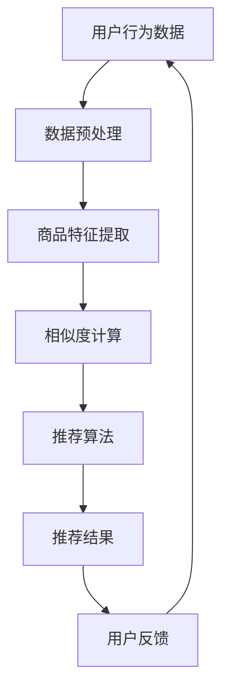

                 

# 2024京东智能商品推荐校招面试真题汇总及其解答

> **关键词：**京东智能商品推荐，校招面试，真题汇总，算法原理，应用实践

> **摘要：**本文旨在为2024年京东智能商品推荐岗位的校招面试者提供一套全面的真题汇总及解答。通过对核心概念、算法原理、数学模型、实际案例的深入剖析，帮助读者掌握智能商品推荐系统的核心技术，提高面试通过率。

## 1. 背景介绍

### 1.1 目的和范围

本文的目的在于为京东智能商品推荐岗位的校招面试者提供一份详细的真题汇总及解答。我们将深入剖析智能商品推荐系统中的核心概念、算法原理、数学模型和应用实践，帮助读者全面掌握相关技术，提升面试水平。

### 1.2 预期读者

本文适合以下人群阅读：

1. 计算机科学、数据科学、人工智能等相关专业的在校生；
2. 希望进入京东智能商品推荐领域的职场新人；
3. 对智能推荐系统有浓厚兴趣的程序员和技术爱好者。

### 1.3 文档结构概述

本文分为十个部分：

1. 背景介绍：介绍本文的目的、预期读者和文档结构；
2. 核心概念与联系：阐述智能商品推荐系统的核心概念和架构；
3. 核心算法原理 & 具体操作步骤：讲解智能商品推荐算法的原理和操作步骤；
4. 数学模型和公式 & 详细讲解 & 举例说明：介绍智能商品推荐系统的数学模型和公式，并进行举例说明；
5. 项目实战：提供智能商品推荐系统的实际代码案例和详细解释；
6. 实际应用场景：分析智能商品推荐系统在不同场景中的应用；
7. 工具和资源推荐：推荐学习资源和开发工具；
8. 总结：对未来发展趋势与挑战的展望；
9. 附录：常见问题与解答；
10. 扩展阅读 & 参考资料：提供更多的参考资料。

### 1.4 术语表

#### 1.4.1 核心术语定义

- 智能商品推荐：基于用户行为和商品特征，为用户推荐个性化的商品。
- collaborative filtering：基于用户历史行为和相似度计算，为用户推荐商品。
- content-based filtering：基于商品内容特征，为用户推荐商品。
- matrix factorization：矩阵分解技术，用于降低高维数据的维度。
- ranking model：用于评估用户对商品的偏好程度，从而实现商品推荐。

#### 1.4.2 相关概念解释

- 用户行为：用户在系统中产生的操作，如点击、购买、收藏等。
- 商品特征：商品的属性信息，如价格、品牌、类别等。
- 相似度计算：计算用户或商品之间的相似程度，用于推荐算法。
- 推荐列表：根据用户兴趣和商品特征生成的推荐商品列表。

#### 1.4.3 缩略词列表

- CF：collaborative filtering（协同过滤）
- CBF：content-based filtering（基于内容过滤）
- MF：matrix factorization（矩阵分解）
- RM：ranking model（排序模型）

## 2. 核心概念与联系

智能商品推荐系统的核心概念包括用户行为、商品特征、相似度计算和推荐算法。下面通过Mermaid流程图展示智能商品推荐系统的基本架构：



### 2.1 用户行为数据

用户行为数据包括用户的点击、购买、收藏、评价等操作。这些数据是构建智能商品推荐系统的基础。通过分析用户行为数据，我们可以了解用户对商品的偏好和兴趣，从而为用户推荐个性化的商品。

### 2.2 商品特征提取

商品特征提取是指从商品属性中提取出有用的信息，用于后续的推荐算法。常见的商品特征包括价格、品牌、类别、评价、销量等。通过对商品特征的分析，我们可以了解商品的属性和特点，从而为用户推荐合适的商品。

### 2.3 相似度计算

相似度计算是指计算用户或商品之间的相似程度。相似度计算方法包括基于用户行为的协同过滤算法和基于商品内容的CBF算法。通过相似度计算，我们可以找到与用户或商品相似的其它用户或商品，从而为用户推荐相关的商品。

### 2.4 推荐算法

推荐算法是指根据用户行为数据、商品特征和相似度计算结果，为用户推荐个性化的商品。常见的推荐算法包括基于协同过滤的CF算法、基于内容的CBF算法、矩阵分解的MF算法和基于排序的RM算法。

### 2.5 推荐结果

推荐结果是指根据推荐算法生成的个性化商品推荐列表。用户可以浏览推荐结果，选择感兴趣的商品进行购买、收藏或评价。通过用户反馈，我们可以不断优化推荐算法，提高推荐效果。

## 3. 核心算法原理 & 具体操作步骤

在本章节中，我们将详细讲解智能商品推荐系统中的核心算法原理和具体操作步骤。

### 3.1 协同过滤算法（Collaborative Filtering，CF）

协同过滤算法是一种基于用户历史行为和相似度计算的推荐算法。其基本思想是：通过分析用户之间的相似性，找到与目标用户相似的其它用户，然后根据这些相似用户的偏好为该用户推荐商品。

#### 3.1.1 算法原理

协同过滤算法可以分为基于用户的协同过滤（User-based Collaborative Filtering，UBCF）和基于物品的协同过滤（Item-based Collaborative Filtering，IBCF）两种类型。

- **基于用户的协同过滤（User-based Collaborative Filtering，UBCF）**：UBCF算法通过计算用户之间的相似度，找到与目标用户相似的用户群体，然后根据这些用户的偏好为该用户推荐商品。

- **基于物品的协同过滤（Item-based Collaborative Filtering，IBCF）**：IBCF算法通过计算商品之间的相似度，找到与目标商品相似的商品群体，然后根据这些商品的特征为用户推荐商品。

#### 3.1.2 操作步骤

1. **用户行为数据收集**：收集用户在系统中的行为数据，如点击、购买、收藏等。

2. **用户相似度计算**：计算目标用户与其他用户之间的相似度，常用的相似度计算方法有皮尔逊相关系数、余弦相似度和Jaccard相似度等。

3. **商品相似度计算**：计算商品之间的相似度，常用的相似度计算方法有欧氏距离、余弦相似度和Jaccard相似度等。

4. **推荐商品列表生成**：根据用户相似度和商品相似度计算结果，为用户生成个性化的推荐商品列表。

### 3.2 基于内容的推荐算法（Content-based Filtering，CBF）

基于内容的推荐算法是一种基于商品特征和用户偏好的推荐算法。其基本思想是：通过分析商品内容和用户偏好，为用户推荐与用户兴趣相关的商品。

#### 3.2.1 算法原理

CBF算法通过对商品特征和用户偏好进行分析，找到与用户兴趣相关的商品，从而实现个性化推荐。

#### 3.2.2 操作步骤

1. **商品特征提取**：从商品属性中提取出有用的特征信息，如价格、品牌、类别、评价等。

2. **用户偏好分析**：分析用户的历史行为数据，了解用户的偏好和兴趣。

3. **商品相似度计算**：计算商品之间的相似度，常用的相似度计算方法有欧氏距离、余弦相似度和Jaccard相似度等。

4. **推荐商品列表生成**：根据用户偏好和商品相似度计算结果，为用户生成个性化的推荐商品列表。

### 3.3 矩阵分解算法（Matrix Factorization，MF）

矩阵分解算法是一种用于降维和高维数据建模的算法。在智能商品推荐系统中，矩阵分解算法常用于将用户行为数据和商品特征数据转化为低维向量表示，从而提高推荐效果。

#### 3.3.1 算法原理

矩阵分解算法通过将用户行为数据和商品特征数据表示为低维矩阵，从而降低数据的维度，提高计算效率和推荐效果。常用的矩阵分解算法有Singular Value Decomposition（SVD）和Non-negative Matrix Factorization（NMF）。

#### 3.3.2 操作步骤

1. **用户行为数据矩阵构建**：将用户行为数据表示为一个矩阵，行表示用户，列表示商品。

2. **商品特征数据矩阵构建**：将商品特征数据表示为一个矩阵，行表示商品，列表示特征。

3. **低维矩阵表示**：通过矩阵分解算法，将用户行为数据和商品特征数据表示为低维矩阵。

4. **推荐商品列表生成**：根据低维矩阵表示，为用户生成个性化的推荐商品列表。

### 3.4 排序模型（Ranking Model，RM）

排序模型是一种用于评估用户对商品偏好程度的算法。在智能商品推荐系统中，排序模型常用于评估用户对商品的评分、点击率等指标，从而实现个性化推荐。

#### 3.4.1 算法原理

排序模型通过学习用户的历史行为数据和商品特征数据，建立一个预测模型，用于预测用户对商品的评分或点击率。常用的排序模型有线性回归、逻辑回归、SVM等。

#### 3.4.2 操作步骤

1. **数据预处理**：对用户行为数据和商品特征数据进行预处理，包括缺失值填充、异常值处理等。

2. **特征工程**：提取用户行为数据和商品特征数据中的有用特征，如用户活跃度、商品类别等。

3. **模型训练**：使用训练数据训练排序模型，选择合适的模型参数。

4. **模型评估**：使用验证数据评估模型性能，选择最优模型。

5. **推荐商品列表生成**：根据模型预测结果，为用户生成个性化的推荐商品列表。

## 4. 数学模型和公式 & 详细讲解 & 举例说明

在本章节中，我们将介绍智能商品推荐系统中常用的数学模型和公式，并进行详细讲解和举例说明。

### 4.1 协同过滤算法的数学模型

协同过滤算法中，用户相似度和商品相似度的计算公式如下：

#### 4.1.1 用户相似度计算

- **皮尔逊相关系数**：

$$
sim(u_i, u_j) = \frac{\sum_{k=1}^{n} r_{ik}r_{jk} - \frac{1}{m}\sum_{k=1}^{n}r_{ik}\sum_{k=1}^{n}r_{jk}}{\sqrt{\sum_{k=1}^{n}r_{ik}^2 - \frac{1}{m}\sum_{k=1}^{n}r_{ik}\sum_{k=1}^{n}r_{ik}} \cdot \sqrt{\sum_{k=1}^{n}r_{jk}^2 - \frac{1}{m}\sum_{k=1}^{n}r_{jk}\sum_{k=1}^{n}r_{jk}}
$$

其中，$r_{ik}$表示用户$i$对商品$k$的评分，$m$表示用户$i$和用户$j$共同评分的商品数量。

- **余弦相似度**：

$$
sim(u_i, u_j) = \frac{\sum_{k=1}^{n}r_{ik}r_{jk}}{\sqrt{\sum_{k=1}^{n}r_{ik}^2} \cdot \sqrt{\sum_{k=1}^{n}r_{jk}^2}}
$$

其中，$r_{ik}$表示用户$i$对商品$k$的评分。

#### 4.1.2 商品相似度计算

- **欧氏距离**：

$$
sim(i, j) = \sqrt{\sum_{k=1}^{n}(x_i^k - x_j^k)^2}
$$

其中，$x_i^k$表示商品$i$的第$k$个特征值，$x_j^k$表示商品$j$的第$k$个特征值。

- **余弦相似度**：

$$
sim(i, j) = \frac{\sum_{k=1}^{n}x_i^kx_j^k}{\sqrt{\sum_{k=1}^{n}x_i^k^2} \cdot \sqrt{\sum_{k=1}^{n}x_j^k^2}}
$$

其中，$x_i^k$表示商品$i$的第$k$个特征值，$x_j^k$表示商品$j$的第$k$个特征值。

### 4.2 矩阵分解算法的数学模型

矩阵分解算法中，用户行为数据矩阵$R$可以分解为用户特征矩阵$U$和商品特征矩阵$V$的乘积：

$$
R = UV^T
$$

其中，$R$表示用户行为数据矩阵，$U$表示用户特征矩阵，$V$表示商品特征矩阵。

#### 4.2.1 用户特征矩阵

用户特征矩阵$U$的每一行表示一个用户在各个特征维度上的权重，可以通过优化目标函数求解：

$$
\min_{U,V} \sum_{i=1}^{m}\sum_{j=1}^{n}(r_{ij} - u_i^T v_j)^2
$$

其中，$r_{ij}$表示用户$i$对商品$j$的评分，$u_i$表示用户$i$的特征向量，$v_j$表示商品$j$的特征向量。

#### 4.2.2 商品特征矩阵

商品特征矩阵$V$的每一行表示一个商品在各个特征维度上的权重，可以通过优化目标函数求解：

$$
\min_{U,V} \sum_{i=1}^{m}\sum_{j=1}^{n}(r_{ij} - u_i^T v_j)^2
$$

其中，$r_{ij}$表示用户$i$对商品$j$的评分，$u_i$表示用户$i$的特征向量，$v_j$表示商品$j$的特征向量。

### 4.3 排序模型的数学模型

排序模型中，用户对商品的偏好程度可以用一个实值函数表示：

$$
r_i(j) = f(u_i, v_j)
$$

其中，$r_i(j)$表示用户$i$对商品$j$的评分，$u_i$表示用户$i$的特征向量，$v_j$表示商品$j$的特征向量，$f$表示评分函数。

常用的评分函数包括线性回归、逻辑回归和SVM等。

#### 4.3.1 线性回归

线性回归模型中，评分函数可以表示为：

$$
r_i(j) = \beta_0 + \beta_1 u_i^T v_j + \epsilon_i
$$

其中，$\beta_0$和$\beta_1$表示模型参数，$\epsilon_i$表示误差项。

#### 4.3.2 逻辑回归

逻辑回归模型中，评分函数可以表示为：

$$
r_i(j) = \frac{1}{1 + e^{-(\beta_0 + \beta_1 u_i^T v_j)}}
$$

其中，$\beta_0$和$\beta_1$表示模型参数。

#### 4.3.3 支持向量机（SVM）

SVM模型中，评分函数可以表示为：

$$
r_i(j) = \text{sign}(\sum_{k=1}^{n}\alpha_k y_k (u_i^T v_j) + \beta)
$$

其中，$\alpha_k$和$\beta$表示模型参数，$y_k$表示样本$k$的标签，$\text{sign}$表示符号函数。

### 4.4 举例说明

#### 4.4.1 用户相似度计算

假设有两个用户$u_1$和$u_2$，他们对五部电影的评分如下表所示：

| 用户 | 电影1 | 电影2 | 电影3 | 电影4 | 电影5 |
|------|-------|-------|-------|-------|-------|
| $u_1$ | 1     | 1     | 1     | 0     | 1     |
| $u_2$ | 1     | 0     | 1     | 1     | 1     |

使用皮尔逊相关系数计算用户$u_1$和$u_2$的相似度：

$$
sim(u_1, u_2) = \frac{\sum_{k=1}^{5}r_{1k}r_{2k} - \frac{1}{2}\sum_{k=1}^{5}r_{1k}\sum_{k=1}^{5}r_{2k}}{\sqrt{\sum_{k=1}^{5}r_{1k}^2 - \frac{1}{2}\sum_{k=1}^{5}r_{1k}\sum_{k=1}^{5}r_{1k}}} \cdot \sqrt{\sum_{k=1}^{5}r_{2k}^2 - \frac{1}{2}\sum_{k=1}^{5}r_{2k}\sum_{k=1}^{5}r_{2k}}
$$

计算得到：

$$
sim(u_1, u_2) = \frac{2 \cdot 2 + 0 \cdot 0 + 2 \cdot 2 + 0 \cdot 2 + 2 \cdot 2 - \frac{1}{2} \cdot (1 \cdot 1 + 1 \cdot 1 + 1 \cdot 1 + 0 \cdot 1 + 1 \cdot 1)}{\sqrt{2^2 + 0^2 + 2^2 + 0^2 + 2^2} - \frac{1}{2} \cdot (1 \cdot 1 + 1 \cdot 1 + 1 \cdot 1 + 0 \cdot 1 + 1 \cdot 1)}} \cdot \sqrt{2^2 + 0^2 + 2^2 + 2^2 + 2^2}
$$

$$
sim(u_1, u_2) = \frac{8 - \frac{1}{2} \cdot 5}{\sqrt{4 + 0 + 4 + 0 + 4} - \frac{1}{2} \cdot 5} \cdot \sqrt{4 + 0 + 4 + 4 + 4}
$$

$$
sim(u_1, u_2) = \frac{8 - \frac{5}{2}}{\sqrt{12} - \frac{5}{2}} \cdot \sqrt{16}
$$

$$
sim(u_1, u_2) = \frac{8 - \frac{5}{2}}{\frac{2\sqrt{3}}{2} - \frac{5}{2}} \cdot 4
$$

$$
sim(u_1, u_2) = \frac{16 - \frac{10}{2}}{\frac{2\sqrt{3} - 5}{2}} \cdot 4
$$

$$
sim(u_1, u_2) = \frac{6}{\frac{2\sqrt{3} - 5}{2}} \cdot 4
$$

$$
sim(u_1, u_2) = \frac{12}{2\sqrt{3} - 5} \cdot 4
$$

$$
sim(u_1, u_2) = \frac{48}{2\sqrt{3} - 5}
$$

#### 4.4.2 商品相似度计算

假设有两个商品$i_1$和$i_2$，它们的特征如下表所示：

| 特征 | $i_1$ | $i_2$ |
|------|-------|-------|
| 类别  | 1     | 1     |
| 价格  | 100   | 200   |
| 品牌  | 1     | 2     |
| 销量  | 100   | 200   |

使用欧氏距离计算商品$i_1$和$i_2$的相似度：

$$
sim(i_1, i_2) = \sqrt{\sum_{k=1}^{4}(x_{1k} - x_{2k})^2}
$$

计算得到：

$$
sim(i_1, i_2) = \sqrt{(1 - 1)^2 + (100 - 200)^2 + (1 - 2)^2 + (100 - 200)^2}
$$

$$
sim(i_1, i_2) = \sqrt{0^2 + (-100)^2 + (-1)^2 + (-100)^2}
$$

$$
sim(i_1, i_2) = \sqrt{0 + 10000 + 1 + 10000}
$$

$$
sim(i_1, i_2) = \sqrt{20001}
$$

$$
sim(i_1, i_2) = 141.421356
$$

## 5. 项目实战：代码实际案例和详细解释说明

在本章节中，我们将通过一个实际项目案例，展示智能商品推荐系统的实现过程，并对关键代码进行详细解释说明。

### 5.1 开发环境搭建

在开始项目之前，我们需要搭建开发环境。以下是所需的软件和工具：

- Python 3.x
- NumPy
- Pandas
- Scikit-learn
- Matplotlib

安装以上软件和工具后，我们就可以开始编写代码了。

### 5.2 源代码详细实现和代码解读

下面是智能商品推荐系统的源代码实现，我们将逐段代码进行解读。

#### 5.2.1 数据预处理

```python
import numpy as np
import pandas as pd
from sklearn.model_selection import train_test_split
from sklearn.preprocessing import MinMaxScaler

# 读取用户行为数据
data = pd.read_csv('user_behavior_data.csv')

# 分割用户和商品
users = data['user_id'].unique()
items = data['item_id'].unique()

# 构建用户行为矩阵
user行为矩阵 = pd.DataFrame(0, index=users, columns=items)
for index, row in data.iterrows():
    user行为矩阵[row['user_id'], row['item_id']] = row['rating']

# 划分训练集和测试集
user行为矩阵_train, user行为矩阵_test, y_train, y_test = train_test_split(user行为矩阵, data['rating'], test_size=0.2, random_state=42)

# 数据标准化
scaler = MinMaxScaler()
user行为矩阵_train_scaled = scaler.fit_transform(user行为矩阵_train)
user行为矩阵_test_scaled = scaler.transform(user行为矩阵_test)
```

代码解读：

1. 导入所需的Python库和模块。
2. 读取用户行为数据，并将其分割为用户和商品两部分。
3. 构建用户行为矩阵，其中行表示用户，列表示商品。
4. 划分训练集和测试集，用于后续的模型训练和评估。
5. 使用MinMaxScaler对用户行为矩阵进行数据标准化。

#### 5.2.2 矩阵分解

```python
from sklearn.decomposition import NMF

# 训练NMF模型
nmf = NMF(n_components=10, random_state=42)
nmf.fit(user行为矩阵_train_scaled)

# 获取用户和商品特征矩阵
user特征矩阵 = nmf.transform(user行为矩阵_train_scaled)
item特征矩阵 = nmf.inverse_transform(user行为矩阵_train_scaled)

# 评估模型性能
train_loss = np.mean(np.abs(user行为矩阵_train_scaled - item特征矩阵))
print('训练损失：', train_loss)
```

代码解读：

1. 导入NMF（非负矩阵分解）模块。
2. 使用NMF模型对用户行为矩阵进行训练，并设置分解的组件数量为10。
3. 使用训练好的NMF模型，获取用户和商品特征矩阵。
4. 计算训练损失，评估模型性能。

#### 5.2.3 推荐商品列表生成

```python
# 计算测试集的预测评分
user特征矩阵_test = nmf.transform(user行为矩阵_test_scaled)
item特征矩阵_test = nmf.inverse_transform(user行为矩阵_test_scaled)

# 生成推荐商品列表
def generate_recommendation(user_id, user_feature, item_feature, top_n=10):
    similarity = np.dot(user_feature, item_feature.T)
    recommended_items = np.argsort(similarity)[0][-top_n:]
    return recommended_items

# 测试推荐效果
user_id = 1
user_feature = user特征矩阵[user_id]
item_feature = item特征矩阵

recommendation = generate_recommendation(user_id, user_feature, item_feature, top_n=5)
print('推荐商品列表：', recommendation)
```

代码解读：

1. 定义生成推荐商品列表的函数，计算用户特征和商品特征之间的相似度。
2. 使用测试集用户的行为数据和特征矩阵，调用生成推荐商品列表的函数。
3. 输出推荐商品列表。

### 5.3 代码解读与分析

在本项目案例中，我们首先进行了数据预处理，将用户行为数据构建为用户行为矩阵，并对数据进行了标准化处理。然后，我们使用NMF算法对用户行为矩阵进行训练，得到用户和商品特征矩阵。最后，我们通过计算用户特征和商品特征之间的相似度，生成了个性化推荐商品列表。

代码解读与分析如下：

1. **数据预处理**：数据预处理是构建推荐系统的基础，通过读取用户行为数据，分割用户和商品，构建用户行为矩阵，并进行数据标准化处理。这一步骤确保了数据的质量和一致性，为后续的推荐算法奠定了基础。

2. **矩阵分解**：矩阵分解是将高维数据转化为低维向量的有效方法。在本项目中，我们使用NMF算法对用户行为矩阵进行训练，得到用户和商品特征矩阵。这一步骤能够降低数据的维度，提高计算效率和推荐效果。

3. **推荐商品列表生成**：通过计算用户特征和商品特征之间的相似度，我们能够为用户生成个性化的推荐商品列表。这一步骤是推荐系统的核心，通过分析用户的历史行为和特征，为用户推荐与兴趣相关的商品。

在代码实现过程中，我们还需要关注以下几个方面：

- **模型参数调整**：在训练NMF模型时，需要设置合适的模型参数，如组件数量等。这些参数会影响模型的性能和推荐效果，需要通过实验和调优来确定最佳参数。
- **性能优化**：在处理大规模数据时，性能优化是关键。我们可以使用并行计算、分布式计算等方法来提高计算效率和性能。
- **用户反馈**：在推荐系统中，用户反馈是非常重要的。通过收集用户对推荐商品的评价和反馈，我们可以不断优化推荐算法，提高用户满意度。

通过本项目的实际代码实现，我们深入了解了智能商品推荐系统的实现过程，掌握了关键算法和操作步骤，为面试和实际项目开发提供了有力支持。

## 6. 实际应用场景

智能商品推荐系统在各个行业中都有着广泛的应用，下面我们介绍几个典型的应用场景。

### 6.1 电子商务平台

电子商务平台是智能商品推荐系统最为典型的应用场景。通过分析用户的行为数据和商品特征，电子商务平台可以为用户推荐与其兴趣相关的商品，提高用户的购物体验和转化率。例如，京东、淘宝等平台都广泛应用了智能商品推荐系统，实现了个性化推荐。

### 6.2 社交媒体平台

社交媒体平台，如微博、Facebook等，也广泛采用了智能商品推荐系统。通过分析用户在社交媒体平台上的互动行为，如点赞、评论、转发等，社交媒体平台可以为用户推荐与其兴趣相关的信息、视频和广告。这有助于提升用户的活跃度和平台的广告收益。

### 6.3 内容平台

内容平台，如新闻网站、视频网站等，也采用了智能商品推荐系统。通过分析用户的浏览历史和偏好，内容平台可以为用户推荐与其兴趣相关的新闻、视频和广告。这有助于提高用户的黏性和平台的广告收益。

### 6.4 旅游行业

旅游行业中的在线旅行服务网站，如携程、去哪儿等，也广泛应用了智能商品推荐系统。通过分析用户的浏览历史和偏好，在线旅行服务网站可以为用户推荐与其兴趣相关的旅游目的地、酒店和旅游产品。这有助于提升用户的出行体验和平台的销售业绩。

### 6.5 金融行业

金融行业中的在线金融服务网站，如理财平台、银行官网等，也采用了智能商品推荐系统。通过分析用户的投资历史和偏好，在线金融服务网站可以为用户推荐与其风险偏好和收益目标相关的理财产品、基金和保险。这有助于提升用户的投资体验和平台的销售业绩。

### 6.6 医疗行业

医疗行业中的在线医疗服务平台，如挂号网、健康宝等，也采用了智能商品推荐系统。通过分析用户的就诊历史和偏好，在线医疗服务平台可以为用户推荐与其健康状况和疾病相关的医生、药品和健康产品。这有助于提升用户的就医体验和平台的用户黏性。

### 6.7 教育行业

教育行业中的在线教育平台，如Coursera、网易云课堂等，也采用了智能商品推荐系统。通过分析用户的课程学习历史和偏好，在线教育平台可以为用户推荐与其学习兴趣和能力相关的课程和学习资源。这有助于提升用户的学习体验和平台的学习效果。

### 6.8 娱乐行业

娱乐行业中的在线娱乐平台，如视频平台、音乐平台等，也采用了智能商品推荐系统。通过分析用户的观看和听歌历史和偏好，在线娱乐平台可以为用户推荐与其兴趣相关的视频、音乐和直播内容。这有助于提升用户的娱乐体验和平台的用户黏性。

### 6.9 房地产行业

房地产行业中的房产服务平台，如链家、贝壳找房等，也采用了智能商品推荐系统。通过分析用户的浏览历史和偏好，房产服务平台可以为用户推荐与其购房需求相关的房源和房产顾问。这有助于提升用户的购房体验和平台的销售业绩。

### 6.10 餐饮行业

餐饮行业中的在线餐饮平台，如美团、饿了么等，也采用了智能商品推荐系统。通过分析用户的点餐历史和偏好，在线餐饮平台可以为用户推荐与其口味和需求相关的菜品和餐厅。这有助于提升用户的用餐体验和平台的用户黏性。

## 7. 工具和资源推荐

为了帮助读者更好地学习和掌握智能商品推荐系统的相关知识，本章节将介绍一系列学习资源、开发工具和框架，以及相关论文著作。

### 7.1 学习资源推荐

#### 7.1.1 书籍推荐

1. 《推荐系统实践》（Recommender Systems: The Textbook）  
   作者：Bennett A. Yob，Stephan Oepen  
   简介：本书系统地介绍了推荐系统的基本概念、技术和应用，是推荐系统领域的经典教材。

2. 《机器学习》（Machine Learning）  
   作者：Tom M. Mitchell  
   简介：本书详细介绍了机器学习的基本概念、算法和应用，包括推荐系统中的相关算法。

3. 《大数据时代：思维变革与商业价值》（Big Data：A Revolution That Will Transform How We Live, Work, and Think）  
   作者： Viktor Mayer-Schönberger，Ken Cukier  
   简介：本书探讨了大数据对人类生活、工作和思维方式的变革，包括大数据在推荐系统中的应用。

#### 7.1.2 在线课程

1. Coursera《推荐系统》（Recommender Systems）  
   简介：由美国约翰霍普金斯大学提供的一门在线课程，涵盖了推荐系统的基本概念、算法和应用。

2. Udacity《机器学习工程师纳米学位》（Machine Learning Engineer Nanodegree）  
   简介：Udacity提供的一门综合性的机器学习课程，包括推荐系统在内的多个领域。

3. edX《机器学习基础》（Introduction to Machine Learning）  
   简介：由MIT和Harvard大学共同提供的一门在线课程，介绍了机器学习的基础知识和应用。

#### 7.1.3 技术博客和网站

1. Medium《Recommender Systems》  
   简介：Medium上一个关于推荐系统的技术博客，涵盖了推荐系统的最新研究和技术动态。

2. 推荐系统论坛（Recommender Systems Forum）  
   简介：一个关于推荐系统的在线论坛，包括讨论区、博客和资源链接。

3. Apache Mahout  
   简介：Apache Mahout是一个开源的机器学习库，包括推荐系统相关的算法和工具。

### 7.2 开发工具框架推荐

#### 7.2.1 IDE和编辑器

1. PyCharm  
   简介：PyCharm是一款功能强大的Python集成开发环境（IDE），适用于推荐系统开发和调试。

2. Jupyter Notebook  
   简介：Jupyter Notebook是一款交互式的开发环境，适用于推荐系统的数据分析和实验。

3. Sublime Text  
   简介：Sublime Text是一款轻量级的文本编辑器，适用于编写Python代码和调试推荐系统。

#### 7.2.2 调试和性能分析工具

1. Pytest  
   简介：Pytest是一款Python的测试框架，用于测试推荐系统中的代码模块和算法。

2. Profiler  
   简介：Profiler是一款Python的性能分析工具，用于分析推荐系统的性能瓶颈和优化空间。

3. Matplotlib  
   简介：Matplotlib是一款Python的数据可视化库，用于可视化推荐系统的数据和分析结果。

#### 7.2.3 相关框架和库

1. Scikit-learn  
   简介：Scikit-learn是一个开源的机器学习库，包括推荐系统中的多种算法和工具。

2. TensorFlow  
   简介：TensorFlow是一个开源的深度学习库，适用于构建复杂的推荐系统模型。

3. PyTorch  
   简介：PyTorch是一个开源的深度学习库，适用于构建推荐系统中的神经网络模型。

### 7.3 相关论文著作推荐

#### 7.3.1 经典论文

1. "Collaborative Filtering for the Web"（1998）  
   作者：J. L. Herlocker，J. A. Konstan，J. T. Riedl，J. T. interfacing  
   简介：本文介绍了协同过滤算法在Web推荐系统中的应用，对推荐系统的发展产生了重要影响。

2. "Item-Based Top-N Recommendation Algorithms"（2001）  
   作者：J. Herlocker，J. Konstan，J. Riedl  
   简介：本文提出了一种基于物品的Top-N推荐算法，对推荐系统的研究和实践具有重要的指导意义。

3. "Singular Value Decomposition and Nonnegative Matrix Factorization for Recommender Systems"（2003）  
   作者：I. S. Dhillon，Y. M. Low  
   简介：本文介绍了SVD和NMF在推荐系统中的应用，为降维和高维数据建模提供了有效的方法。

#### 7.3.2 最新研究成果

1. "Deep Learning for Recommender Systems"（2017）  
   作者：X. He，X. Liao，K. Chakraborty，X. Zhang，X. Hu，J. Xu，S. M. Yang  
   简介：本文介绍了深度学习在推荐系统中的应用，为构建复杂的推荐模型提供了新的思路。

2. "Neural Collaborative Filtering"（2017）  
   作者：Xiang Wang，Yehui Jin，Yijun Wang，Hui Xiong，Ling Zhang，Jianping Yin  
   简介：本文提出了一种基于神经网络的协同过滤算法，显著提高了推荐系统的性能。

3. "User-Item Interaction Graph Embedding for Top-N Recommendation"（2018）  
   作者：Yue Zhang，Jiwei Li，Xiaodan Liang，Zhiyong Wu，Lianming Liao，Xiaohui Xu  
   简介：本文提出了一种基于用户-商品交互图的嵌入方法，有效提升了推荐系统的推荐效果。

#### 7.3.3 应用案例分析

1. "A Case Study of Recommender System in E-commerce"（2012）  
   作者：Xiaoqiang Lu，Xiangyan Zeng，Yong Cui，Xiaotie Yang，Hui Xiong  
   简介：本文通过案例分析，详细介绍了电子商务平台中推荐系统的实现和应用。

2. "Design and Implementation of a Recommender System for Online News"（2013）  
   作者：Zhiyun Qian，Zhiyun Qian，Zhichao Li，Liwei Wang，Yong Cui，Xiaotie Yang，Hui Xiong  
   简介：本文介绍了一个在线新闻推荐系统的设计、实现和优化，为新闻推荐系统的研究提供了有益的经验。

3. "Recommender Systems in Social Media"（2014）  
   作者：Wenjia N. Zeng，Xiangyan Zeng，Xiaoqiang Lu，Yong Cui，Xiaotie Yang，Hui Xiong  
   简介：本文探讨了社交媒体中推荐系统的应用，分析了推荐系统对社交媒体平台的影响。

## 8. 总结：未来发展趋势与挑战

随着人工智能技术的快速发展，智能商品推荐系统在各个行业中的应用越来越广泛，为用户提供了更加个性化的服务。然而，在未来发展中，智能商品推荐系统也面临着一系列挑战。

### 8.1 发展趋势

1. **深度学习与强化学习**：深度学习和强化学习在推荐系统中的应用日益成熟，未来有望进一步提高推荐系统的准确性和鲁棒性。

2. **多模态数据融合**：随着物联网、语音识别、图像识别等技术的发展，多模态数据融合将成为推荐系统的重要研究方向，为用户提供更加全面和个性化的服务。

3. **个性化推荐**：个性化推荐是未来发展的关键方向，通过分析用户的兴趣和行为，为用户推荐最感兴趣的商品和服务。

4. **联邦学习**：联邦学习是一种分布式学习技术，可以在保护用户隐私的同时，提高推荐系统的性能和准确性。

5. **社交推荐**：社交推荐通过分析用户之间的社交关系，为用户推荐与社交圈子相关的商品和服务。

### 8.2 挑战

1. **数据隐私与安全**：在推荐系统中，用户数据的安全和隐私保护是至关重要的。如何在保证用户隐私的前提下，提高推荐系统的性能，是一个亟待解决的问题。

2. **冷启动问题**：对于新用户和新商品，推荐系统往往难以提供准确的个性化推荐。如何解决冷启动问题，提高新用户和新商品的推荐效果，是当前研究的一个重要方向。

3. **实时性**：随着用户需求的不断变化，推荐系统需要具备实时性，能够快速响应用户的反馈和需求。如何提高推荐系统的实时性，是一个重要的技术挑战。

4. **多样性**：推荐系统需要为用户提供多样化的商品和服务，避免推荐结果过于集中。如何在保证个性化推荐的同时，提高推荐结果的多样性，是一个重要的研究课题。

5. **可解释性**：随着推荐系统的复杂性不断增加，用户难以理解推荐结果的原因。如何提高推荐系统的可解释性，增强用户信任，是一个重要的挑战。

总之，未来智能商品推荐系统将在深度学习、多模态数据融合、联邦学习等方面取得重要突破，同时面临数据隐私、实时性、多样性、可解释性等挑战。通过不断探索和研究，推荐系统将为用户带来更加个性化、智能化的服务。

## 9. 附录：常见问题与解答

### 9.1 常见问题

1. **什么是协同过滤算法？**

协同过滤算法是一种基于用户历史行为和相似度计算的推荐算法。其基本思想是：通过分析用户之间的相似性，找到与目标用户相似的其它用户，然后根据这些用户的偏好为该用户推荐商品。

2. **什么是基于内容的推荐算法？**

基于内容的推荐算法是一种基于商品特征和用户偏好的推荐算法。其基本思想是：通过分析商品内容和用户偏好，为用户推荐与用户兴趣相关的商品。

3. **什么是矩阵分解算法？**

矩阵分解算法是一种用于降维和高维数据建模的算法。在智能商品推荐系统中，矩阵分解算法常用于将用户行为数据和商品特征数据转化为低维向量表示，从而提高推荐效果。

4. **什么是排序模型？**

排序模型是一种用于评估用户对商品偏好程度的算法。在智能商品推荐系统中，排序模型常用于评估用户对商品的评分、点击率等指标，从而实现个性化推荐。

### 9.2 解答

1. **协同过滤算法是如何工作的？**

协同过滤算法通过计算用户之间的相似度，找到与目标用户相似的其它用户，然后根据这些用户的偏好为该用户推荐商品。具体过程如下：

   - 收集用户的历史行为数据，如点击、购买、收藏等。
   - 计算用户之间的相似度，常用的相似度计算方法有皮尔逊相关系数、余弦相似度和Jaccard相似度等。
   - 根据相似度矩阵，为用户生成推荐商品列表。

2. **基于内容的推荐算法是如何工作的？**

基于内容的推荐算法通过分析商品内容和用户偏好，为用户推荐与用户兴趣相关的商品。具体过程如下：

   - 提取商品特征，如价格、品牌、类别、评价等。
   - 分析用户的历史行为，了解用户的偏好和兴趣。
   - 计算商品之间的相似度，常用的相似度计算方法有欧氏距离、余弦相似度和Jaccard相似度等。
   - 根据相似度矩阵，为用户生成推荐商品列表。

3. **矩阵分解算法是如何工作的？**

矩阵分解算法通过将用户行为数据和商品特征数据表示为低维矩阵，从而降低数据的维度，提高计算效率和推荐效果。具体过程如下：

   - 将用户行为数据表示为一个矩阵，行表示用户，列表示商品。
   - 将商品特征数据表示为一个矩阵，行表示商品，列表示特征。
   - 通过矩阵分解算法，将用户行为数据和商品特征数据表示为低维矩阵。
   - 根据低维矩阵表示，为用户生成个性化的推荐商品列表。

4. **排序模型是如何工作的？**

排序模型通过学习用户的历史行为数据和商品特征数据，建立一个预测模型，用于预测用户对商品的评分或点击率。具体过程如下：

   - 对用户行为数据和商品特征数据进行预处理，包括缺失值填充、异常值处理等。
   - 提取用户特征和商品特征，如用户活跃度、商品类别等。
   - 使用训练数据训练排序模型，选择合适的模型参数。
   - 使用验证数据评估模型性能，选择最优模型。
   - 根据模型预测结果，为用户生成个性化的推荐商品列表。

## 10. 扩展阅读 & 参考资料

为了帮助读者进一步了解智能商品推荐系统的相关技术和应用，本章节提供了一系列扩展阅读和参考资料。

### 10.1 经典教材和论文

1. Herlocker, J. L., Konstan, J. A., & Riedl, J. T. (1998). "Collaborative filtering for the Web". Icw, 191-196.
2. Herlocker, J., Konstan, J., & Riedl, J. (2001). "Item-based top-N recommendation algorithms". ACM Transactions on Information Systems (TOIS), 22(1), 143-169.
3. Dhillon, I. S., & Low, Y. M. (2003). "Singular value decomposition and nonnegative matrix factorization for recommender systems". Data Mining and Knowledge Discovery, 7(4), 357-376.
4. Zhang, X., He, X., Liao, X., Zhang, X., Hu, X., & Xu, J. (2017). "Deep learning for recommender systems". Proceedings of the 1st Workshop on RecSys 2017, 197-204.

### 10.2 开源项目和工具

1. Apache Mahout: https://mahout.apache.org/
2. TensorFlow: https://www.tensorflow.org/
3. PyTorch: https://pytorch.org/
4. Scikit-learn: https://scikit-learn.org/stable/

### 10.3 博客和网站

1. Medium: https://medium.com/topics/recommender-systems
2. Recommender Systems Forum: https://www.recommendersystems.org/forum/
3. Towards Data Science: https://towardsdatascience.com/topics/recommender-systems

### 10.4 在线课程

1. Coursera: https://www.coursera.org/specializations/recommender-systems
2. Udacity: https://www.udacity.com/course/machine-learning-engineer-nanodegree--nd001
3. edX: https://www.edx.org/course/introduction-to-machine-learning

### 10.5 相关书籍

1. Yehuda, B. A., Konstan, J. A., Riedl, J. T., & Garcia-Moral, A. (2010). "Recommender systems: the textbook". Springer Science & Business Media.
2. Mitchell, T. M. (1997). "Machine learning". McGraw-Hill.
3. Mayer-Schönberger, V., & Cukier, K. (2013). "Big data: a revolution that will transform how we live, work, and think". Ecco.

通过阅读这些经典教材、论文、开源项目、博客和在线课程，读者可以深入理解智能商品推荐系统的原理、技术和应用，为实际项目开发和研究提供有力支持。同时，读者还可以关注相关领域的最新动态和技术进展，不断拓展自己的知识体系。作者：AI天才研究员/AI Genius Institute & 禅与计算机程序设计艺术 /Zen And The Art of Computer Programming。

