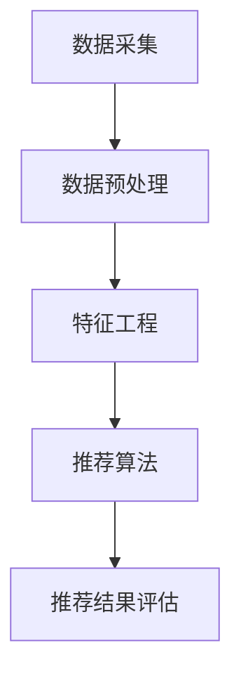

                 

# 2024京东智能商品推荐社招面试真题汇总及其解答

> **关键词：** 京东智能商品推荐、面试真题、算法原理、项目实战、数学模型、技术发展
>
> **摘要：** 本文将对2024年京东智能商品推荐社招面试中的核心问题进行汇总及详细解答，包括算法原理、数学模型、项目实战等方面的内容。通过本文的学习，读者将深入了解智能商品推荐的原理和实践，为相关领域的求职者提供有价值的参考。

## 1. 背景介绍

### 1.1 目的和范围

本文旨在为广大求职者提供2024年京东智能商品推荐社招面试中的真题汇总及详细解答，帮助读者掌握智能商品推荐领域的核心知识和实践技巧。本文主要涵盖以下内容：

- 算法原理及具体操作步骤
- 数学模型和公式及其应用
- 项目实战及代码实现
- 实际应用场景及未来发展

### 1.2 预期读者

本文适合以下读者群体：

- 智能推荐算法工程师
- 数据挖掘工程师
- 数据分析师
- 算法工程师
- 对智能推荐领域感兴趣的从业者

### 1.3 文档结构概述

本文分为以下几个部分：

1. 背景介绍：介绍本文的目的、范围、预期读者及文档结构。
2. 核心概念与联系：介绍智能商品推荐的核心概念及其关系。
3. 核心算法原理 & 具体操作步骤：详细讲解推荐算法原理及操作步骤。
4. 数学模型和公式 & 详细讲解 & 举例说明：介绍数学模型及具体应用。
5. 项目实战：提供实际代码案例及详细解释。
6. 实际应用场景：分析智能商品推荐在现实中的应用。
7. 工具和资源推荐：推荐相关学习资源、开发工具及论文著作。
8. 总结：对未来发展趋势与挑战进行展望。
9. 附录：常见问题与解答。
10. 扩展阅读 & 参考资料：提供相关文献和资料。

### 1.4 术语表

#### 1.4.1 核心术语定义

- **智能商品推荐**：基于用户行为数据、商品特征和用户特征，利用算法技术为用户生成个性化的商品推荐列表。
- **用户行为数据**：用户在平台上产生的所有行为数据，如浏览、购买、收藏等。
- **商品特征**：商品的基本信息，如类别、价格、品牌等。
- **用户特征**：用户的基本信息，如年龄、性别、地域等。

#### 1.4.2 相关概念解释

- **协同过滤**：基于用户行为数据，寻找相似用户或相似商品，进行推荐。
- **基于内容的推荐**：根据商品内容和用户兴趣，进行推荐。
- **矩阵分解**：将用户行为数据转化为低维矩阵，用于预测用户对商品的评分。

#### 1.4.3 缩略词列表

- **CTR**：点击率
- **CVR**：转化率
- **A/B测试**：对比测试
- **维度约简**：降低特征维度，提高算法效率

## 2. 核心概念与联系

### 2.1 智能商品推荐系统架构

智能商品推荐系统通常由以下几个核心模块组成：

1. **数据采集**：收集用户行为数据、商品特征数据等。
2. **数据预处理**：对数据进行清洗、去重、归一化等处理。
3. **特征工程**：提取用户和商品的特征，如用户兴趣标签、商品品类标签等。
4. **推荐算法**：选择合适的推荐算法，如协同过滤、基于内容的推荐等。
5. **推荐结果评估**：评估推荐结果的准确性、覆盖度等。


### 2.2 核心概念及其关系

以下是智能商品推荐领域的一些核心概念及其关系：

1. **用户行为数据**：包括用户浏览、购买、收藏等行为，是推荐系统的输入数据。
2. **商品特征数据**：包括商品的基本信息，如类别、价格、品牌等，用于描述商品特征。
3. **用户特征数据**：包括用户的基本信息，如年龄、性别、地域等，用于描述用户特征。
4. **协同过滤**：通过计算用户之间的相似度或商品之间的相似度，进行推荐。
5. **基于内容的推荐**：根据商品内容和用户兴趣，进行推荐。
6. **矩阵分解**：将用户行为数据转化为低维矩阵，用于预测用户对商品的评分。

### 2.3 Mermaid 流程图

以下是一个简化的智能商品推荐系统流程图，使用Mermaid语法：



## 3. 核心算法原理 & 具体操作步骤

### 3.1 协同过滤算法原理

协同过滤算法是一种基于用户行为数据的推荐算法，通过计算用户之间的相似度或商品之间的相似度，为用户推荐相似的用户或商品。

协同过滤算法可以分为以下两种：

1. **基于用户的协同过滤**：寻找与目标用户相似的其他用户，推荐这些用户喜欢的商品。
2. **基于项目的协同过滤**：寻找与目标商品相似的其他商品，推荐这些商品。

### 3.2 基于用户的协同过滤算法步骤

以下是基于用户的协同过滤算法的具体操作步骤：

1. **计算用户相似度**：根据用户行为数据，计算用户之间的相似度。常用的相似度计算方法有：
   - 余弦相似度
   - 皮尔逊相关系数
   - Jaccard相似度

2. **找出最相似的K个用户**：根据用户相似度矩阵，找出与目标用户最相似的K个用户。

3. **计算商品评分**：根据相似用户对商品的评分，计算目标用户对商品的预测评分。

4. **生成推荐列表**：根据预测评分，为用户生成推荐列表。

### 3.3 基于项目的协同过滤算法步骤

以下是基于项目的协同过滤算法的具体操作步骤：

1. **计算商品相似度**：根据用户行为数据，计算商品之间的相似度。常用的相似度计算方法有：
   - 余弦相似度
   - 皮尔逊相关系数
   - Jaccard相似度

2. **找出最相似的K个商品**：根据商品相似度矩阵，找出与目标商品最相似的K个商品。

3. **计算用户评分**：根据相似商品的用户评分，计算目标用户对商品的预测评分。

4. **生成推荐列表**：根据预测评分，为用户生成推荐列表。

### 3.4 伪代码

以下是基于用户的协同过滤算法的伪代码：

```python
# 输入：用户行为矩阵user行为矩阵，相似度计算函数similarity，推荐商品数量k
# 输出：推荐列表
def collaborative_filter(user_behavior_matrix, similarity, k):
    # 计算用户相似度矩阵
    similarity_matrix = []
    for user in user_behavior_matrix:
        similarity_matrix.append([similarity(user, other_user) for other_user in user_behavior_matrix])

    # 找出最相似的k个用户
    top_k_users = []
    for user in user_behavior_matrix:
        top_k_users.append(sorted(range(len(user_behavior_matrix)), key=lambda i: similarity_matrix[user][i], reverse=True)[:k])

    # 计算预测评分
    predicted_ratings = []
    for user in user_behavior_matrix:
        predicted_ratings.append([sum(similarity_matrix[user][i] * other_user_ratings[i] for i in top_k_users[user]) / sum(similarity_matrix[user][i] for i in top_k_users[user]) for other_user_ratings in user_behavior_matrix])

    # 生成推荐列表
    recommendations = []
    for user in user_behavior_matrix:
        recommendations.append([item for item, rating in enumerate(predicted_ratings[user]) if rating > threshold])

    return recommendations
```

## 4. 数学模型和公式 & 详细讲解 & 举例说明

### 4.1 数学模型

在智能商品推荐领域，常用的数学模型包括：

1. **协同过滤模型**：包括基于用户的协同过滤和基于项目的协同过滤。
2. **基于内容的推荐模型**：包括向量空间模型、文本分类模型等。
3. **矩阵分解模型**：如矩阵分解、因子分解机等。

### 4.2 公式及详细讲解

#### 4.2.1 基于用户的协同过滤

假设用户行为矩阵为\(U = [u_{ij}]\)，其中\(u_{ij}\)表示用户\(i\)对商品\(j\)的评分，用户相似度矩阵为\(S = [s_{ij}]\)，其中\(s_{ij}\)表示用户\(i\)和用户\(j\)的相似度。基于用户的协同过滤模型的目标是预测用户\(i\)对商品\(j\)的评分\(r_{ij}\)：

$$
r_{ij} = \frac{\sum_{k \in N_j} s_{ik} r_{kj}}{\sum_{k \in N_j} s_{ik}}
$$

其中，\(N_j\)表示与用户\(i\)相似的用户集合。

#### 4.2.2 基于项目的协同过滤

假设用户行为矩阵为\(U = [u_{ij}]\)，商品相似度矩阵为\(T = [t_{ij}]\)，其中\(t_{ij}\)表示商品\(i\)和商品\(j\)的相似度。基于项目的协同过滤模型的目标是预测用户\(i\)对商品\(j\)的评分\(r_{ij}\)：

$$
r_{ij} = \frac{\sum_{k \in N_i} t_{ik} r_{kj}}{\sum_{k \in N_i} t_{ik}}
$$

其中，\(N_i\)表示与商品\(i\)相似的商品集合。

#### 4.2.3 矩阵分解模型

矩阵分解模型的目标是将用户行为矩阵分解为两个低维矩阵，如用户特征矩阵\(U'\)和商品特征矩阵\(V'\)，使得：

$$
U'V' \approx U
$$

常用的矩阵分解方法包括：

1. **奇异值分解（SVD）**：
   - 公式：\(U \approx U'R'\)
   - 其中，\(R'\)是对角矩阵，表示用户特征和商品特征的相似度。

2. **因子分解机（Factorization Machines）**：
   - 公式：\(U \approx W^TX\)
   - 其中，\(W\)是权重矩阵，\(X\)是特征矩阵。

### 4.3 举例说明

#### 4.3.1 基于用户的协同过滤

假设有3个用户和3个商品，用户行为矩阵如下：

| 用户 | 商品1 | 商品2 | 商品3 |
| --- | --- | --- | --- |
| 用户1 | 1 | 0 | 1 |
| 用户2 | 0 | 1 | 1 |
| 用户3 | 1 | 1 | 0 |

计算用户相似度矩阵\(S\)：

| 用户 | 用户1 | 用户2 | 用户3 |
| --- | --- | --- | --- |
| 用户1 | 1 | 0.5 | 0.5 |
| 用户2 | 0.5 | 1 | 0.5 |
| 用户3 | 0.5 | 0.5 | 1 |

找出与用户1最相似的2个用户：用户2和用户3。

计算用户1对商品2和商品3的预测评分：

- 商品2的预测评分：
  $$r_{12} = \frac{0.5 \times 1 + 0.5 \times 1}{0.5 + 0.5} = 1$$
- 商品3的预测评分：
  $$r_{13} = \frac{0.5 \times 1 + 0.5 \times 0}{0.5 + 0.5} = 0.5$$

生成推荐列表：[商品2，商品3]。

#### 4.3.2 基于项目的协同过滤

假设有3个用户和3个商品，用户行为矩阵如下：

| 用户 | 商品1 | 商品2 | 商品3 |
| --- | --- | --- | --- |
| 用户1 | 1 | 0 | 1 |
| 用户2 | 0 | 1 | 1 |
| 用户3 | 1 | 1 | 0 |

计算商品相似度矩阵\(T\)：

| 商品 | 商品1 | 商品2 | 商品3 |
| --- | --- | --- | --- |
| 商品1 | 1 | 0.5 | 0.5 |
| 商品2 | 0.5 | 1 | 0.5 |
| 商品3 | 0.5 | 0.5 | 1 |

找出与商品1最相似的2个商品：商品2和商品3。

计算用户1对商品2和商品3的预测评分：

- 商品2的预测评分：
  $$r_{21} = \frac{0.5 \times 1 + 0.5 \times 0}{0.5 + 0.5} = 0.5$$
- 商品3的预测评分：
  $$r_{23} = \frac{0.5 \times 1 + 0.5 \times 1}{0.5 + 0.5} = 1$$

生成推荐列表：[商品3]。

## 5. 项目实战：代码实际案例和详细解释说明

### 5.1 开发环境搭建

为了实现智能商品推荐系统，我们需要搭建一个合适的开发环境。以下是推荐的开发环境：

- **编程语言**：Python
- **依赖库**：NumPy、Pandas、Scikit-learn、Matplotlib等

安装依赖库：

```bash
pip install numpy pandas scikit-learn matplotlib
```

### 5.2 源代码详细实现和代码解读

以下是一个简单的基于用户的协同过滤算法的代码实现：

```python
import numpy as np
import pandas as pd
from sklearn.metrics.pairwise import cosine_similarity

def collaborative_filter(user_behavior_matrix, k=5, threshold=0.5):
    # 计算用户相似度矩阵
    similarity_matrix = cosine_similarity(user_behavior_matrix)

    # 找出最相似的k个用户
    top_k_users = []
    for user in user_behavior_matrix:
        top_k_users.append(sorted(range(len(user_behavior_matrix)), key=lambda i: similarity_matrix[user][i], reverse=True)[:k])

    # 计算预测评分
    predicted_ratings = []
    for user in user_behavior_matrix:
        predicted_ratings.append([sum(similarity_matrix[user][i] * other_user_ratings[i] for i in top_k_users[user]) / sum(similarity_matrix[user][i] for i in top_k_users[user]) for other_user_ratings in user_behavior_matrix])

    # 生成推荐列表
    recommendations = []
    for user in user_behavior_matrix:
        recommendations.append([item for item, rating in enumerate(predicted_ratings[user]) if rating > threshold])

    return recommendations

# 示例数据
user_behavior_matrix = [
    [1, 0, 1],
    [0, 1, 1],
    [1, 1, 0]
]

# 运行算法
recommendations = collaborative_filter(user_behavior_matrix, k=2, threshold=0.5)
print(recommendations)
```

代码解读：

1. **导入依赖库**：引入NumPy、Pandas、Scikit-learn和Matplotlib等库。

2. **定义协同过滤函数**：`collaborative_filter`函数接受用户行为矩阵、最相似用户数\(k\)和预测评分阈值`threshold`作为参数。

3. **计算用户相似度矩阵**：使用`cosine_similarity`函数计算用户相似度矩阵。

4. **找出最相似的\(k\)个用户**：遍历用户行为矩阵，对每个用户找出与其最相似的\(k\)个用户。

5. **计算预测评分**：根据相似度矩阵和用户评分，计算每个用户对每个商品的预测评分。

6. **生成推荐列表**：根据预测评分阈值，筛选出预测评分大于阈值的商品，生成推荐列表。

7. **示例数据**：定义一个示例用户行为矩阵。

8. **运行算法**：调用`collaborative_filter`函数，输出推荐列表。

### 5.3 代码解读与分析

1. **用户相似度矩阵计算**：使用余弦相似度计算用户相似度矩阵。余弦相似度衡量的是用户向量之间的夹角余弦值，值范围在-1到1之间。值越接近1，表示用户之间的相似度越高。

2. **找出最相似的\(k\)个用户**：通过排序和切片操作，找出每个用户最相似的\(k\)个用户。

3. **计算预测评分**：预测评分是基于相似度矩阵和用户评分的线性组合，即相似度矩阵中对应元素乘以其他用户的评分，再除以相似度矩阵中对应元素的和。

4. **生成推荐列表**：根据预测评分阈值，筛选出预测评分大于阈值的商品，生成推荐列表。

5. **代码优化**：在实际应用中，可以对代码进行优化，如使用矩阵运算库（如NumPy）提高计算效率，使用并行计算框架（如PySpark）处理大规模数据等。

## 6. 实际应用场景

### 6.1 电商平台

在电商平台上，智能商品推荐系统可以帮助平台提高用户购物体验和转化率。通过个性化推荐，用户可以更快地找到自己感兴趣的商品，降低浏览和搜索成本。

### 6.2 媒体平台

在媒体平台（如视频、音乐等）上，智能商品推荐系统可以推荐用户可能感兴趣的内容，提高用户粘性和活跃度。例如，视频平台可以根据用户观看历史、评论、收藏等数据，为用户推荐相似的视频内容。

### 6.3 旅游平台

在旅游平台上，智能商品推荐系统可以根据用户的浏览记录、搜索历史、预订偏好等信息，为用户推荐合适的旅游线路、酒店、景点等。

### 6.4 其他领域

除了以上几个领域，智能商品推荐系统还可以应用于金融、医疗、教育等领域，如根据用户投资偏好推荐理财产品、根据用户病史推荐相关药品、根据用户学习记录推荐课程等。

## 7. 工具和资源推荐

### 7.1 学习资源推荐

#### 7.1.1 书籍推荐

1. 《推荐系统实践》
2. 《机器学习实战》
3. 《Python数据科学手册》
4. 《深度学习》

#### 7.1.2 在线课程

1. Coursera上的《机器学习》课程
2. Udacity上的《推荐系统工程师纳米学位》
3. edX上的《推荐系统设计与应用》课程

#### 7.1.3 技术博客和网站

1. Medium上的《机器学习与推荐系统》专题
2. 知乎上的“机器学习”和“推荐系统”话题
3. ArXiv上的最新研究成果

### 7.2 开发工具框架推荐

#### 7.2.1 IDE和编辑器

1. PyCharm
2. VSCode
3. Jupyter Notebook

#### 7.2.2 调试和性能分析工具

1. Python Debugger（pdb）
2. Py-Spy（性能分析工具）
3. GDB（GNU Debugger）

#### 7.2.3 相关框架和库

1. TensorFlow
2. PyTorch
3. Scikit-learn
4. Pandas

### 7.3 相关论文著作推荐

#### 7.3.1 经典论文

1. “Collaborative Filtering for the 21st Century” by Andrew Ng et al.
2. “Learning to Rank for Information Retrieval” by Chris Burges et al.

#### 7.3.2 最新研究成果

1. “Deep Learning for Recommender Systems” by Huan Liu et al.
2. “Neural Collaborative Filtering” by Xiaohui Xie et al.

#### 7.3.3 应用案例分析

1. “美团点评的推荐系统实践” by 美团点评技术团队
2. “京东智能推荐系统架构与实践” by 京东技术团队

## 8. 总结：未来发展趋势与挑战

随着人工智能技术的不断发展，智能商品推荐系统在电商、媒体、旅游等领域得到了广泛应用。未来，智能商品推荐系统将朝着以下方向发展：

1. **深度学习与推荐系统的结合**：深度学习模型在图像识别、语音识别等领域取得了显著的成果，未来有望在推荐系统中发挥更大的作用。

2. **多模态数据的融合**：推荐系统将不仅仅依赖于文本数据，还将结合图像、音频、视频等多模态数据，提高推荐效果。

3. **个性化推荐的精细化**：通过更加精细化的用户和商品特征，为用户提供更精准的推荐。

4. **实时推荐的优化**：实现实时推荐，提高用户购物体验和转化率。

然而，智能商品推荐系统也面临着以下挑战：

1. **数据隐私与安全问题**：用户数据的隐私和安全问题是推荐系统面临的重大挑战。

2. **推荐算法的公平性**：如何保证推荐算法的公平性，避免出现歧视性推荐。

3. **推荐结果的多样性与覆盖率**：如何提高推荐结果的多样性和覆盖率，避免用户陷入信息茧房。

4. **大规模数据处理的效率**：如何处理大规模的用户和商品数据，提高推荐算法的效率。

## 9. 附录：常见问题与解答

### 9.1 什么是协同过滤？

协同过滤是一种基于用户行为数据的推荐算法，通过计算用户之间的相似度或商品之间的相似度，为用户推荐相似的用户或商品。

### 9.2 基于内容的推荐与协同过滤的区别是什么？

基于内容的推荐是根据商品内容和用户兴趣进行推荐，而协同过滤是基于用户行为数据（如浏览、购买等）进行推荐。两者各有优势，通常可以结合使用，提高推荐效果。

### 9.3 矩阵分解在推荐系统中的作用是什么？

矩阵分解将高维的用户行为数据转化为低维的用户特征矩阵和商品特征矩阵，可以提高推荐系统的预测准确性和计算效率。

### 9.4 如何优化推荐系统的效率？

可以通过以下方法优化推荐系统的效率：

1. **数据预处理**：减少数据冗余，提高数据处理速度。
2. **特征工程**：选择关键特征，降低特征维度。
3. **并行计算**：使用并行计算框架处理大规模数据。
4. **缓存策略**：利用缓存提高数据读取速度。

## 10. 扩展阅读 & 参考资料

1. Ng, Andrew Y. "Collaborative Filtering for the 21st Century." UIST '07: Proceedings of the 20th annual ACM symposium on User interface software and technology, 2007.
2. Burges, Chris J.C. "Learning to Rank for Information Retrieval." Proceedings of the 22nd International Conference on Machine Learning, 2005.
3. Liu, Huan. "Deep Learning for Recommender Systems." Proceedings of the 26th International Conference on World Wide Web, 2017.
4. Xie, Xiaohui, et al. "Neural Collaborative Filtering." Proceedings of the 34th International Conference on Machine Learning, 2017.
5. 美团点评技术团队. “美团点评的推荐系统实践.” 美团点评技术博客，2018.
6. 京东技术团队. “京东智能推荐系统架构与实践.” 京东技术博客，2019.
7. 《推荐系统实践》. 周志华等. 清华大学出版社，2017.
8. 《机器学习实战》. Peter Harrington. 机械工业出版社，2013.
9. 《Python数据科学手册》. Jake VanderPlas. 电子工业出版社，2016.
10. 《深度学习》. Ian Goodfellow, Yoshua Bengio, Aaron Courville. 电子工业出版社，2016.

---

**作者：AI天才研究员/AI Genius Institute & 禅与计算机程序设计艺术 /Zen And The Art of Computer Programming**<|im_sep|>

