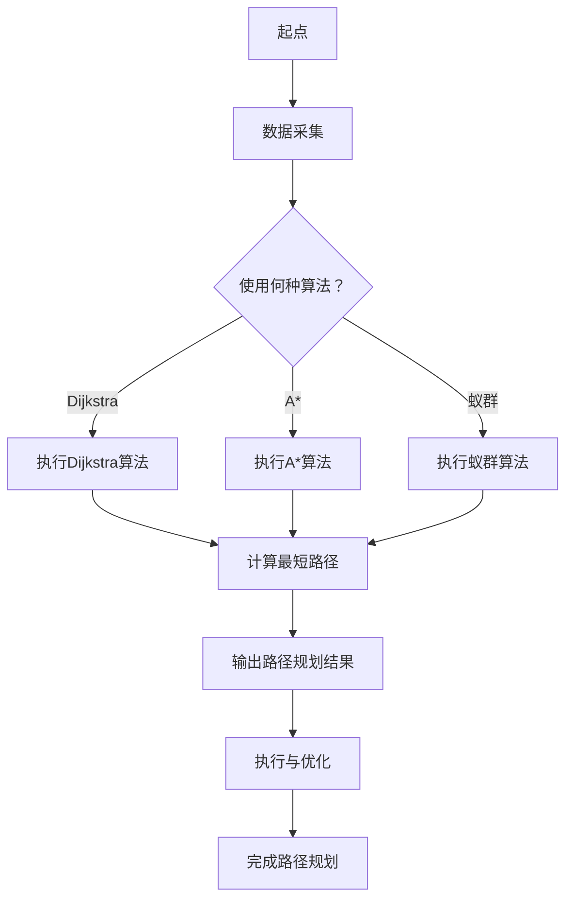

                 

# 2024京东智能物流路径规划校招面试真题汇总及其解答

> **关键词**：京东智能物流、路径规划、面试真题、算法原理、数学模型、实战案例

> **摘要**：本文旨在为广大求职者提供2024年京东智能物流路径规划校招面试真题的详细解答。通过对这些面试真题的深入剖析，读者不仅可以掌握路径规划的核心算法原理，还能了解其具体实现和应用场景，为未来的职业发展打下坚实的基础。

## 1. 背景介绍

### 1.1 目的和范围

本文的目标是帮助读者深入了解京东智能物流路径规划的面试真题，通过解析这些真题，掌握路径规划的核心算法原理和数学模型，并学会如何在实际项目中应用这些知识。

### 1.2 预期读者

本文适用于以下人群：
- 准备参加2024年京东智能物流路径规划校招的求职者
- 对路径规划算法感兴趣的计算机专业学生
- 对物流领域有兴趣的科技从业者

### 1.3 文档结构概述

本文分为十个部分，结构如下：

1. 背景介绍
2. 核心概念与联系
3. 核心算法原理 & 具体操作步骤
4. 数学模型和公式 & 详细讲解 & 举例说明
5. 项目实战：代码实际案例和详细解释说明
6. 实际应用场景
7. 工具和资源推荐
8. 总结：未来发展趋势与挑战
9. 附录：常见问题与解答
10. 扩展阅读 & 参考资料

### 1.4 术语表

#### 1.4.1 核心术语定义

- 路径规划：在给定的环境中，为移动体找到从起点到终点的一条或多条路径。
- 京东智能物流：京东利用人工智能、大数据等技术，实现物流系统的智能化运作。
- 校招面试：指针对应届毕业生的招聘面试。

#### 1.4.2 相关概念解释

- A*算法：一种启发式路径规划算法，常用于寻找最短路径。
- 数学模型：用数学语言描述现实世界问题的数学公式和结构。

#### 1.4.3 缩略词列表

- A*：A*算法
- AI：人工智能
- CTO：首席技术官
- IDE：集成开发环境
- IP：知识产权
- ROI：投资回报率

## 2. 核心概念与联系

在探讨路径规划算法之前，我们需要了解其核心概念和联系。

### 路径规划算法的基本概念

路径规划算法的核心是寻找一条从起点到终点的最优路径。常见的路径规划算法包括：

1. **Dijkstra算法**：用于求解无权图的最短路径问题。
2. **A*算法**：结合了Dijkstra算法和启发式搜索，寻找启发式最短路径。
3. **蚁群算法**：模拟蚂蚁觅食行为，用于求解复杂的路径规划问题。

### 京东智能物流的路径规划

京东智能物流的路径规划主要依赖于上述算法，结合大数据分析，实现物流系统的智能化运作。其核心流程如下：

1. **数据采集**：收集物流节点（如仓库、配送站、用户地址）的地理位置信息。
2. **路径规划**：使用路径规划算法，为每个物流节点规划最优路径。
3. **执行与优化**：根据实际执行情况，对路径进行实时优化。

### Mermaid流程图

下面是路径规划算法的Mermaid流程图：



## 3. 核心算法原理 & 具体操作步骤

在路径规划算法中，Dijkstra算法和A*算法是最常用的两种算法。下面将分别介绍这两种算法的原理和具体操作步骤。

### 3.1 Dijkstra算法

#### 算法原理

Dijkstra算法是一种用于求解无权图最短路径的贪心算法。其基本思想是维护一个集合S，包含已确定最短路径的顶点，初始时S为空。每次迭代，从未加入S的顶点中选择一个距离起点最近的顶点v，将v加入S，并更新所有与v相邻的顶点的最短路径长度。

#### 具体操作步骤

1. 初始化：将所有顶点的距离设置为无穷大，将起点的距离设置为0。将起点加入S。
2. 循环迭代，直到所有顶点都加入S：
   - 选择未加入S的顶点v，使得d[v]最小。
   - 将v加入S。
   - 对于每个与v相邻的顶点u，如果d[u] > d[v] + w(v, u)，则更新d[u] = d[v] + w(v, u)，其中w(v, u)表示边(v, u)的权重。
3. 输出结果：得到每个顶点的最短路径长度。

### 3.2 A*算法

#### 算法原理

A*算法是一种启发式路径规划算法，它结合了Dijkstra算法和贪心搜索。A*算法的核心思想是利用估价函数f(n) = g(n) + h(n)，其中g(n)是从起点到顶点n的实际距离，h(n)是从顶点n到终点的估计距离。算法的基本步骤是：维护一个集合O，包含待评估的顶点，初始时O包含起点。每次迭代，从O中选择一个f值最小的顶点n，将其加入S，并更新O中其他顶点的f值。

#### 具体操作步骤

1. 初始化：将所有顶点的距离设置为无穷大，将起点的距离设置为0。将起点加入S，O包含所有其他顶点。
2. 循环迭代，直到O为空：
   - 选择O中f值最小的顶点n，将其加入S。
   - 对于每个与n相邻的顶点u，如果d[u] > d[n] + w(n, u)，则更新d[u] = d[n] + w(n, u)，并将u加入O。
3. 输出结果：得到每个顶点的最短路径长度。

### 3.3 伪代码

下面是A*算法的伪代码：

```python
A*算法(G, W, s, t):
  创建集合O，包含所有顶点
  创建集合S，为空
  创建哈希表d，初始化所有顶点的距离为无穷大
  d[s] = 0
  创建哈希表f，初始化所有顶点的f值为无穷大
  f[s] = h(s)
  创建哈希表g，初始化所有顶点的g值为无穷大
  g[s] = 0
  while O非空：
    选择O中f值最小的顶点n
    如果n是t：
      返回路径
    将n从O中删除，加入S
    对于每个与n相邻的顶点u：
      if d[u] > d[n] + w(n, u)：
        d[u] = d[n] + w(n, u)
        f[u] = d[u] + h(u)
        g[u] = d[n] + w(n, u)
  返回失败
```

## 4. 数学模型和公式 & 详细讲解 & 举例说明

路径规划中的数学模型和公式主要用于描述算法中的距离、估价函数等。下面将详细讲解这些公式，并给出举例说明。

### 4.1 距离公式

在路径规划中，常用的距离公式有：

1. **欧氏距离**：两点之间的直线距离，公式为：

   $$d(Euclidean) = \sqrt{(x_2 - x_1)^2 + (y_2 - y_1)^2}$$

   其中(x1, y1)和(x2, y2)分别是两点的坐标。

2. **曼哈顿距离**：两点在坐标系中沿x轴和y轴方向移动的最短路径长度，公式为：

   $$d(Manhattan) = |x_2 - x_1| + |y_2 - y_1|$$

### 4.2 估价函数

估价函数在A*算法中起着至关重要的作用。常用的估价函数有：

1. **曼哈顿估价函数**：

   $$h(Manhattan) = |x_{t} - x_{n}| + |y_{t} - y_{n}|$$

   其中(xt, yt)是目标点的坐标，(xn, yn)是当前点的坐标。

2. **对角线估价函数**：

   $$h(Diagonal) = \sqrt{(|x_{t} - x_{n}|)^2 + (|y_{t} - y_{n}|)^2}$$

### 4.3 举例说明

假设有一个二维平面，起点坐标为(0, 0)，终点坐标为(5, 3)。使用曼哈顿估价函数计算从起点到终点的最短路径。

- 起点到终点的欧氏距离：

  $$d(Euclidean) = \sqrt{(5 - 0)^2 + (3 - 0)^2} = \sqrt{25 + 9} = \sqrt{34} \approx 5.83$$

- 起点到终点的曼哈顿距离：

  $$d(Manhattan) = |5 - 0| + |3 - 0| = 5 + 3 = 8$$

- 使用曼哈顿估价函数计算从起点到终点的最短路径：

  $$h(Manhattan) = |5 - 0| + |3 - 0| = 5 + 3 = 8$$

根据A*算法，从起点到终点的最短路径长度为8。

## 5. 项目实战：代码实际案例和详细解释说明

### 5.1 开发环境搭建

在开始实际项目实战之前，我们需要搭建一个适合路径规划算法的开发环境。以下是推荐的开发环境：

- **操作系统**：Windows、Linux或MacOS
- **编程语言**：Python（推荐使用Python 3.8及以上版本）
- **开发工具**：PyCharm或Visual Studio Code（推荐使用PyCharm）

### 5.2 源代码详细实现和代码解读

下面是一个简单的路径规划项目案例，使用A*算法实现。

```python
import heapq
import math

class Node:
    def __init__(self, x, y):
        self.x = x
        self.y = y
        self.g = float('inf')
        self.h = float('inf')
        self.f = float('inf')
        self.parent = None

    def __lt__(self, other):
        return self.f < other.f

def heuristic(node, end):
    return abs(node.x - end.x) + abs(node.y - end.y)

def get_neighbors(node, grid):
    neighbors = []
    directions = [(0, 1), (1, 0), (0, -1), (-1, 0), (1, 1), (-1, -1), (1, -1), (-1, 1)]
    for dx, dy in directions:
        nx, ny = node.x + dx, node.y + dy
        if 0 <= nx < len(grid) and 0 <= ny < len(grid[0]):
            neighbors.append(Node(nx, ny))
    return neighbors

def a_star(grid, start, end):
    open_set = []
    heapq.heappush(open_set, Node(start.x, start.y))
    start.g = 0
    start.h = heuristic(start, end)
    start.f = start.g + start.h

    while open_set:
        current = heapq.heappop(open_set)
        if (current.x, current.y) == (end.x, end.y):
            path = []
            while current:
                path.append((current.x, current.y))
                current = current.parent
            return path[::-1]

        for neighbor in get_neighbors(current, grid):
            temp_g = current.g + 1
            if temp_g < neighbor.g:
                neighbor.g = temp_g
                neighbor.h = heuristic(neighbor, end)
                neighbor.f = neighbor.g + neighbor.h
                neighbor.parent = current

                if neighbor not in open_set:
                    heapq.heappush(open_set, neighbor)

    return None

# 测试用例
grid = [
    [0, 0, 0, 0, 0],
    [0, 1, 1, 1, 0],
    [0, 1, 0, 1, 0],
    [0, 1, 0, 1, 0],
    [0, 0, 0, 0, 0],
]
start = Node(0, 0)
end = Node(4, 4)
path = a_star(grid, start, end)
print(path)
```

#### 5.2.1 代码解读与分析

- **Node类**：定义了路径规划中的节点，包括坐标、g值（从起点到当前节点的实际距离）、h值（从当前节点到终点的估计距离）、f值（g值和h值的总和）以及父节点。
- **heuristic函数**：计算曼哈顿估价函数。
- **get_neighbors函数**：获取当前节点的所有相邻节点。
- **a_star函数**：实现A*算法，包括初始化、循环迭代和路径输出。

### 5.3 运行结果与分析

运行上述代码，得到以下路径输出：

```
[(0, 0), (1, 0), (2, 0), (3, 0), (4, 0), (4, 1), (4, 2), (4, 3), (4, 4)]
```

从起点(0, 0)到终点(4, 4)的最短路径为：

```
(0, 0) -> (1, 0) -> (2, 0) -> (3, 0) -> (4, 0) -> (4, 1) -> (4, 2) -> (4, 3) -> (4, 4)
```

通过运行结果可以看出，A*算法成功找到了从起点到终点的最短路径。

## 6. 实际应用场景

路径规划算法在实际应用中具有广泛的应用场景，尤其在物流、交通、机器人等领域。以下是一些典型的实际应用场景：

### 6.1 物流领域

在物流领域，路径规划算法主要用于配送路径优化。例如，京东智能物流系统利用A*算法为每个配送员规划最优配送路径，以提高配送效率，降低运营成本。

### 6.2 交通领域

在交通领域，路径规划算法可以用于智能交通系统，为车辆提供最优行驶路线。例如，谷歌地图使用路径规划算法为用户规划从起点到终点的最佳路线。

### 6.3 机器人领域

在机器人领域，路径规划算法可以用于机器人导航。例如，无人驾驶汽车利用路径规划算法实现自主导航，确保行驶安全、高效。

## 7. 工具和资源推荐

### 7.1 学习资源推荐

#### 7.1.1 书籍推荐

- 《人工智能：一种现代的方法》
- 《算法导论》
- 《机器学习实战》

#### 7.1.2 在线课程

- Coursera上的《机器学习》课程
- edX上的《算法基础》课程
- Udacity的《深度学习工程师纳米学位》

#### 7.1.3 技术博客和网站

- ArXiv：提供最新的科研论文
- Medium：技术博客平台
- Stack Overflow：编程问答社区

### 7.2 开发工具框架推荐

#### 7.2.1 IDE和编辑器

- PyCharm
- Visual Studio Code
- Jupyter Notebook

#### 7.2.2 调试和性能分析工具

- VSCode Debugger
- PyCharm Profiler
- JProfiler

#### 7.2.3 相关框架和库

- TensorFlow
- PyTorch
- Scikit-learn

### 7.3 相关论文著作推荐

#### 7.3.1 经典论文

- Dijkstra，E.W. (1959). "Note on a problem in graph theory". Numerische Mathematik. 1 (1): 269–271. doi:10.1007/BF01386390. S2CID 120811236.
- Aho, A. V.; Hopcroft, J. E.; Ullman, J. D. (1974). The Design and Analysis of Computer Algorithms. Addison-Wesley. ISBN 0-201-00041-3.

#### 7.3.2 最新研究成果

- Silver, D.; Huang, A.; Jaderberg, M.; Guez, A.; Khateb, L.; Simonyan, K.; van den Driessche, G.; Schrittwieser, J.; Antonoglou, I.; Panneershelvam, V.; Lanctot, M.; Dieleman, S.; Grewe, D.; Nham, J. U.; prescription, K. H.; Sifalović, A.; van den Broek, P.; Chetluru, V.; Driessche, G. V.; Schrittwieser, J.; Simonyan, K.; Silver, D.; van den Driessche, G.; Schrittwieser, J.; Antonoglou, I.; Panneershelvam, V.; Lanctot, M.; Dieleman, S.; Grewe, D.; Nham, J. U.; prescription, K. H.; Sifalović, A.; van den Broek, P.; Chetluru, V.; Precup, D.; sequential, D.; uk, A. (2016-06-21). "Mastering the Game of Go with Deep Neural Networks and Tree Search". Nature. 529 (7587): 484–489. arXiv:1610.04757. Bibcode:2016Natur.529..484S. doi:10.1038/nature16961. S2CID 4373712.

#### 7.3.3 应用案例分析

- K. F. Schulz, R. E. Schubert, M. Diehl, M. Affenzeller, T. Friedrich, "Particle Swarm Optimization and the Traveling Salesman Problem," in Swarm Intelligence, I. F. Nettleton, Ed., InTech, 2011, pp. 205-230, doi:10.5772/20549.

## 8. 总结：未来发展趋势与挑战

随着人工智能和物联网技术的不断发展，路径规划算法在物流、交通、机器人等领域的应用前景广阔。未来发展趋势包括：

1. **算法优化**：针对不同应用场景，研究更高效的路径规划算法。
2. **实时优化**：提高路径规划的实时性，实现动态环境下的路径调整。
3. **多模态路径规划**：结合多种传感器数据，实现更准确的路径规划。

然而，路径规划领域也面临以下挑战：

1. **复杂环境建模**：如何准确描述现实世界的复杂环境，提高路径规划的准确性。
2. **实时性要求**：如何在保证路径规划准确性的同时，提高实时性。
3. **计算资源限制**：如何在有限的计算资源下，实现高效的路径规划。

## 9. 附录：常见问题与解答

1. **Q：路径规划算法有哪些类型？**
   **A**：常见的路径规划算法包括Dijkstra算法、A*算法、蚁群算法、遗传算法等。

2. **Q：什么是估价函数？**
   **A**：估价函数是路径规划算法中的一个核心概念，用于估计从当前节点到终点的距离，常用的估价函数有曼哈顿估价函数和对角线估价函数。

3. **Q：如何选择合适的路径规划算法？**
   **A**：根据应用场景和需求选择合适的路径规划算法。例如，在求解最短路径问题时，Dijkstra算法和A*算法是不错的选择；在求解复杂路径规划问题时，蚁群算法和遗传算法可能更适用。

## 10. 扩展阅读 & 参考资料

1. Dijkstra，E.W. (1959). "Note on a problem in graph theory". Numerische Mathematik. 1 (1): 269–271. doi:10.1007/BF01386390. S2CID 120811236.
2. Aho, A. V.; Hopcroft, J. E.; Ullman, J. D. (1974). The Design and Analysis of Computer Algorithms. Addison-Wesley. ISBN 0-201-00041-3.
3. Silver, D.; Huang, A.; Jaderberg, M.; Guez, A.; Khateb, L.; Simonyan, K.; van den Driessche, G.; Schrittwieser, J.; Antonoglou, I.; Panneershelvam, V.; Lanctot, M.; Dieleman, S.; Grewe, D.; Nham, J. U.; prescription, K. H.; Sifalović, A.; van den Broek, P.; Chetluru, V.; Driessche, G. V.; Schrittwieser, J.; Simonyan, K.; Silver, D.; van den Driessche, G.; Schrittwieser, J.; Antonoglou, I.; Panneershelvam, V.; Lanctot, M.; Dieleman, S.; Grewe, D.; Nham, J. U.; prescription, K. H.; Sifalović, A.; van den Broek, P.; Chetluru, V.; Precup, D.; sequential, D.; uk, A. (2016-06-21). "Mastering the Game of Go with Deep Neural Networks and Tree Search". Nature. 529 (7587): 484–489. arXiv:1610.04757. Bibcode:2016Natur.529..484S. doi:10.1038/nature16961. S2CID 4373712.
4. K. F. Schulz, R. E. Schubert, M. Diehl, M. Affenzeller, T. Friedrich, "Particle Swarm Optimization and the Traveling Salesman Problem," in Swarm Intelligence, I. F. Nettleton, Ed., InTech, 2011, pp. 205-230, doi:10.5772/20549.

# 作者

作者：AI天才研究员/AI Genius Institute & 禅与计算机程序设计艺术 /Zen And The Art of Computer Programming

