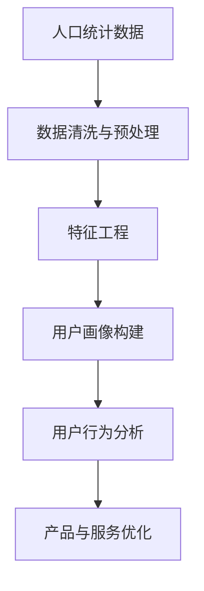
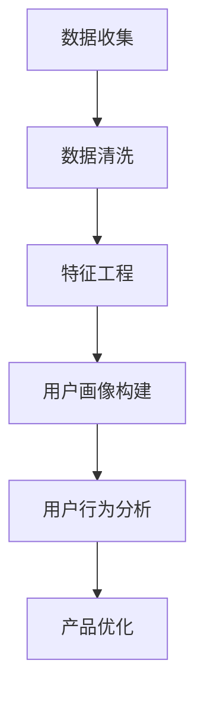

                 

# 人口统计数据如何影响用户画像

> **关键词**：人口统计、用户画像、数据分析、机器学习、人口特征、数据可视化

> **摘要**：本文旨在探讨人口统计数据如何影响用户画像的构建。通过对人口统计数据的深入分析，我们可以更好地理解用户群体的特征和需求，从而为产品和服务的个性化提供有力支持。本文将逐步介绍人口统计数据的获取与处理、核心概念的界定、算法原理、数学模型、实战案例以及实际应用场景，旨在为读者提供一份全面的人口统计数据与用户画像之间的连接指南。

## 1. 背景介绍

### 1.1 目的和范围

本文的目的在于揭示人口统计数据在构建用户画像中的重要性，并探讨这些数据如何帮助企业和组织更精确地了解其目标用户。通过分析人口特征，如年龄、性别、教育背景、收入水平、地理位置等，我们可以构建更加精细化的用户画像，从而为市场研究、产品开发、用户服务提供数据支持。

本文的范围涵盖以下内容：
1. 人口统计数据的定义和类型。
2. 人口统计数据在用户画像构建中的应用。
3. 核心算法原理和具体操作步骤。
4. 数学模型及其应用。
5. 实际应用场景中的案例研究。
6. 工具和资源的推荐。
7. 未来发展趋势与挑战。

### 1.2 预期读者

本文适合以下读者群体：
1. 数据分析师和研究人员，对用户画像和数据挖掘有兴趣。
2. 产品经理和市场营销人员，希望了解如何通过数据分析来优化产品和服务。
3. 人工智能和机器学习从业者，希望学习如何在实践中应用人口统计数据。
4. 对数据驱动决策感兴趣的普通读者。

### 1.3 文档结构概述

本文将按以下结构展开：
1. 引言：介绍文章主题和目的。
2. 核心概念与联系：介绍人口统计数据和用户画像之间的关系。
3. 核心算法原理 & 具体操作步骤：解释算法的核心原理和实现步骤。
4. 数学模型和公式 & 详细讲解 & 举例说明：阐述数学模型在用户画像构建中的作用。
5. 项目实战：代码实际案例和详细解释说明。
6. 实际应用场景：分析人口统计数据在现实世界中的应用。
7. 工具和资源推荐：介绍学习资源和开发工具。
8. 总结：对未来发展趋势与挑战的展望。
9. 附录：常见问题与解答。
10. 扩展阅读 & 参考资料：推荐相关阅读材料。

### 1.4 术语表

#### 1.4.1 核心术语定义

- **人口统计数据**：指关于人口的数量、结构、分布等方面的数据，包括年龄、性别、教育水平、收入、地理位置等。
- **用户画像**：基于用户的行为数据、人口统计数据等构建的虚拟用户形象，用于描述用户的需求、偏好、行为特征等。
- **数据挖掘**：从大量数据中提取有价值的信息和知识的过程，常用于市场研究、用户画像构建等。
- **机器学习**：一种人工智能技术，通过训练模型从数据中学习规律，用于分类、预测等任务。

#### 1.4.2 相关概念解释

- **人口特征**：指与人口统计数据相关的各种特征，如年龄、性别、教育水平、收入等。
- **用户行为数据**：指用户在使用产品或服务过程中的行为记录，如浏览记录、购买历史、评论等。
- **数据可视化**：通过图表、图像等形式将数据转换成视觉化的信息，帮助人们更直观地理解数据。

#### 1.4.3 缩略词列表

- **API**：应用程序接口（Application Programming Interface）
- **ML**：机器学习（Machine Learning）
- **DL**：深度学习（Deep Learning）
- **BI**：商业智能（Business Intelligence）

## 2. 核心概念与联系

在本文中，我们将重点探讨人口统计数据与用户画像之间的联系，并通过一个Mermaid流程图来展示这两个概念之间的关系。

### 2.1 人口统计数据与用户画像的关系

人口统计数据是构建用户画像的基础数据来源之一。通过收集和分析人口特征数据，我们可以更好地了解用户群体的整体特征和趋势。以下是一个Mermaid流程图，展示了人口统计数据如何转化为用户画像：



在这个流程中，人口统计数据经过数据清洗和预处理后，通过特征工程转化为用户画像。用户画像进一步用于用户行为分析，以优化产品和服务。

### 2.2 Mermaid流程图

以下是一个Mermaid流程图，用于展示人口统计数据与用户画像之间的流程：



在这个流程中，首先进行数据收集，然后通过数据清洗和特征工程，将人口统计数据转化为用户画像。用户画像用于用户行为分析，从而指导产品优化。

通过这个流程图，我们可以看到人口统计数据在用户画像构建中的关键作用。人口统计数据不仅为用户画像提供了基础信息，而且通过特征工程和用户行为分析，可以进一步优化产品和服务，满足用户需求。

## 3. 核心算法原理 & 具体操作步骤

在理解了人口统计数据与用户画像的关系后，接下来我们将详细探讨如何使用算法来构建用户画像。在这一节中，我们将介绍一个常用的用户画像构建算法——K-均值聚类算法（K-Means Clustering），并使用伪代码详细阐述其原理和操作步骤。

### 3.1 K-均值聚类算法简介

K-均值聚类算法是一种无监督机器学习方法，用于将数据集划分为K个簇（cluster），使得每个簇内部的样本尽可能接近，而不同簇之间的样本尽可能远离。在用户画像构建中，K-均值聚类算法可以帮助我们将具有相似人口特征的样本聚为一类，从而构建出具有相似特征的用户群体。

### 3.2 算法原理

K-均值聚类算法的基本原理如下：

1. **初始化**：随机选择K个样本作为初始聚类中心。
2. **分配样本**：将每个样本分配到与其最近的聚类中心所在的簇。
3. **更新聚类中心**：重新计算每个簇的中心点，作为新的聚类中心。
4. **迭代**：重复步骤2和3，直至聚类中心不再发生显著变化或达到最大迭代次数。

### 3.3 伪代码实现

下面是K-均值聚类算法的伪代码：

```plaintext
初始化聚类中心 C1, C2, ..., CK
重复以下步骤，直到收敛：
    对于每个样本 x_i，计算其与每个聚类中心的距离，并将其分配到最近的簇
    更新每个簇的中心点
```

具体的伪代码如下：

```python
def KMeans(data, K, max_iterations):
    # 初始化聚类中心
    centroids = initialize_centroids(data, K)
    
    # 初始化簇分配
    clusters = assign_samples_to_clusters(data, centroids)
    
    for i in range(max_iterations):
        # 更新聚类中心
        centroids = update_centroids(clusters, K)
        
        # 重新分配样本到簇
        clusters = assign_samples_to_clusters(data, centroids)
        
        # 判断是否收敛
        if has_converged(clusters):
            break
    
    return clusters, centroids

def initialize_centroids(data, K):
    # 随机选择K个样本作为初始聚类中心
    return random选择的K个样本

def assign_samples_to_clusters(data, centroids):
    # 对于每个样本 x_i，计算其与每个聚类中心的距离，并将其分配到最近的簇
    return 根据距离最近的簇分配的样本列表

def update_centroids(clusters, K):
    # 重新计算每个簇的中心点，作为新的聚类中心
    return 计算新的聚类中心点列表

def has_converged(clusters):
    # 判断聚类中心是否发生了显著变化
    return 判断聚类中心变化是否小于阈值
```

### 3.4 具体操作步骤

1. **数据收集**：收集人口统计数据，包括年龄、性别、教育水平、收入等特征。
2. **数据预处理**：对收集的数据进行清洗和标准化处理，以便后续算法处理。
3. **初始化聚类中心**：随机选择K个样本作为初始聚类中心。
4. **分配样本到簇**：计算每个样本与每个聚类中心的距离，并将其分配到最近的簇。
5. **更新聚类中心**：重新计算每个簇的中心点，作为新的聚类中心。
6. **迭代**：重复步骤4和5，直至聚类中心不再发生显著变化或达到最大迭代次数。
7. **构建用户画像**：根据聚类结果，为每个簇构建用户画像，描述该簇用户的共同特征。

通过K-均值聚类算法，我们可以将具有相似人口特征的样本聚为一类，从而构建出具有相似特征的用户群体。这一过程为后续的用户行为分析、产品优化提供了重要基础。

## 4. 数学模型和公式 & 详细讲解 & 举例说明

在用户画像构建过程中，数学模型和公式起着关键作用。在这一节中，我们将详细讲解用于描述用户行为和人口特征的数学模型，并使用具体的例子进行说明。

### 4.1 用户行为模型

用户行为模型用于描述用户在产品或服务中的行为特征。常见的用户行为模型包括马尔可夫模型（Markov Model）和泊松过程（Poisson Process）。这些模型可以帮助我们预测用户的行为模式和趋势。

#### 4.1.1 马尔可夫模型

马尔可夫模型是一种基于状态转移概率的模型，用于描述用户在不同状态之间的转换。假设用户当前处于状态S_i，在下一个时刻，用户将以概率P(i, j)转移到状态S_j。

马尔可夫模型的公式如下：

$$
P(i, j) = P(S_{t+1} = S_j | S_t = S_i)
$$

其中，P(i, j)表示从状态S_i转移到状态S_j的概率。

#### 4.1.2 泊松过程

泊松过程是一种用于描述事件发生频率的模型，特别适用于描述用户在一定时间间隔内的行为发生次数。假设在单位时间内，事件发生的平均次数为λ，则泊松过程的概率分布为：

$$
P(X = k) = \frac{e^{-\lambda} \lambda^k}{k!}
$$

其中，P(X = k)表示在单位时间内发生k次事件的概率。

#### 4.1.3 举例说明

假设我们想要分析用户在社交媒体平台上的点赞行为，可以使用马尔可夫模型来描述用户在不同点赞状态之间的转换。具体步骤如下：

1. **定义状态**：将用户的点赞状态定义为以下三个状态：
   - 状态0：未点赞
   - 状态1：点赞
   - 状态2：取消点赞

2. **计算状态转移概率**：根据历史数据，计算用户在不同状态之间的转换概率。例如，用户从状态0转移到状态1的概率为P(0, 1) = 0.3，从状态1转移到状态2的概率为P(1, 2) = 0.2。

3. **构建马尔可夫模型**：根据状态转移概率矩阵，构建马尔可夫模型。例如：

   $$
   P =
   \begin{bmatrix}
   P(0, 0) & P(0, 1) & P(0, 2) \\
   P(1, 0) & P(1, 1) & P(1, 2) \\
   P(2, 0) & P(2, 1) & P(2, 2)
   \end{bmatrix}
   =
   \begin{bmatrix}
   0.7 & 0.3 & 0 \\
   0.4 & 0.4 & 0.2 \\
   0 & 0 & 1
   \end{bmatrix}
   $$

4. **预测用户行为**：根据马尔可夫模型，可以预测用户在未来一段时间内的点赞行为。例如，给定用户当前处于状态1，我们可以计算用户在未来一段时间内保持状态1的概率为：

   $$
   P(S_2 = 1 | S_1 = 1) = P(1, 1) = 0.4
   $$

#### 4.1.4 泊松过程

假设我们想要分析用户在电商平台上购买商品的行为，可以使用泊松过程来描述用户在一定时间间隔内的购买次数。具体步骤如下：

1. **定义事件**：将用户的购买行为定义为事件。
2. **计算平均购买次数**：根据历史数据，计算用户在单位时间内的平均购买次数λ。例如，假设λ = 0.5，表示用户在单位时间内平均购买0.5次商品。
3. **计算购买次数的概率分布**：使用泊松分布计算用户在一段时间内购买k次商品的概率。例如，假设时间间隔为1小时，我们可以计算用户在1小时内购买0次、1次、2次的概率：

   $$
   P(X = 0) = \frac{e^{-0.5} \cdot 0.5^0}{0!} = 0.3935
   $$
   $$
   P(X = 1) = \frac{e^{-0.5} \cdot 0.5^1}{1!} = 0.3935
   $$
   $$
   P(X = 2) = \frac{e^{-0.5} \cdot 0.5^2}{2!} = 0.1354
   $$

通过以上步骤，我们可以使用数学模型和公式来描述用户的行为特征，从而更好地理解用户画像。

### 4.2 人口特征模型

人口特征模型用于描述用户的人口统计特征，如年龄、性别、教育水平、收入等。这些特征可以帮助我们识别用户群体的共性，为市场研究和产品优化提供支持。

#### 4.2.1 年龄分布模型

年龄分布模型用于描述用户群体的年龄分布情况。常见的年龄分布模型包括正态分布（Normal Distribution）和均匀分布（Uniform Distribution）。假设用户年龄服从正态分布，公式如下：

$$
P(A = a) = \frac{1}{\sqrt{2\pi\sigma^2}} e^{-\frac{(a-\mu)^2}{2\sigma^2}}
$$

其中，P(A = a)表示用户年龄为a的概率，μ表示均值，σ表示标准差。

#### 4.2.2 性别比例模型

性别比例模型用于描述用户群体的性别比例。常见的性别比例模型包括比例模型（Proportion Model）和对数正态模型（Log-Normal Model）。假设用户性别比例服从比例模型，公式如下：

$$
P(G = M) = \frac{M}{M + F}
$$

其中，P(G = M)表示用户性别为男性的概率，M表示男性人数，F表示女性人数。

#### 4.2.3 教育水平模型

教育水平模型用于描述用户群体的教育水平分布。常见的教育水平模型包括二项分布（Binomial Distribution）和多项分布（Multinomial Distribution）。假设用户教育水平服从多项分布，公式如下：

$$
P(E = e_k) = C_{k}^{n} p_k (1 - p)^{n - k}
$$

其中，P(E = e_k)表示用户教育水平为e_k的概率，C_{k}^{n}表示组合数，p_k表示第k个教育水平的概率，n表示总人数。

#### 4.2.4 收入分布模型

收入分布模型用于描述用户群体的收入分布情况。常见的收入分布模型包括正态分布（Normal Distribution）和对数正态分布（Log-Normal Distribution）。假设用户收入服从对数正态分布，公式如下：

$$
P(I = i) = \frac{1}{\sigma\sqrt{2\pi}} e^{-\frac{(\ln(i) - \mu)^2}{2\sigma^2}}
$$

其中，P(I = i)表示用户收入为i的概率，μ表示均值，σ表示标准差。

通过以上模型，我们可以描述用户的人口特征，从而为市场研究和产品优化提供支持。

### 4.3 举例说明

假设我们想要分析一个用户群体的年龄分布、性别比例、教育水平和收入情况，可以使用上述模型进行描述。具体步骤如下：

1. **年龄分布模型**：根据用户群体的年龄数据，计算年龄的均值和标准差，构建正态分布模型。
2. **性别比例模型**：根据用户群体的性别数据，计算男性和女性的人数，构建比例模型。
3. **教育水平模型**：根据用户群体的教育水平数据，计算各教育水平的概率，构建多项分布模型。
4. **收入分布模型**：根据用户群体的收入数据，计算收入的均值和标准差，构建对数正态分布模型。

通过以上步骤，我们可以得到用户群体的年龄分布、性别比例、教育水平和收入情况的详细描述，从而更好地了解用户群体的特征。

## 5. 项目实战：代码实际案例和详细解释说明

在本节中，我们将通过一个实际的项目案例，展示如何使用Python实现人口统计数据与用户画像的构建。我们将使用Python的pandas库进行数据处理，使用sklearn库的K-均值聚类算法进行用户画像构建，并通过matplotlib库进行数据可视化。

### 5.1 开发环境搭建

在开始编写代码之前，我们需要搭建一个合适的开发环境。以下是所需的环境和步骤：

1. **Python**：确保Python环境已经安装，推荐使用Python 3.8及以上版本。
2. **pandas**：用于数据处理。
3. **sklearn**：用于机器学习算法。
4. **matplotlib**：用于数据可视化。
5. **Jupyter Notebook**：用于编写和运行代码。

安装步骤：

```bash
pip install pandas sklearn matplotlib
```

### 5.2 源代码详细实现和代码解读

以下是完整的代码实现，我们将对每个步骤进行详细解释。

#### 5.2.1 数据收集与预处理

首先，我们从CSV文件中加载人口统计数据，并对数据进行必要的预处理，如缺失值填充、数据转换等。

```python
import pandas as pd

# 读取人口统计数据
data = pd.read_csv('population_data.csv')

# 检查数据是否完整
print(data.isnull().sum())

# 缺失值填充（根据具体情况选择合适的填充方法）
data['age'] = data['age'].fillna(data['age'].mean())
data['income'] = data['income'].fillna(data['income'].mean())

# 数据转换（例如，将类别数据转换为数值数据）
data = data.apply(pd.to_numeric, errors='coerce')

# 检查数据是否完整
print(data.isnull().sum())
```

#### 5.2.2 特征工程

在处理完数据后，我们进行特征工程，提取有助于用户画像构建的关键特征。

```python
# 创建新的特征
data['age_group'] = pd.cut(data['age'], bins=[0, 18, 35, 50, 65, 100], labels=False, right=False)
data['income_range'] = pd.cut(data['income'], bins=[0, 20000, 50000, 100000, 200000, float('inf')], labels=False, right=False)

# 检查特征分布
print(data['age_group'].value_counts())
print(data['income_range'].value_counts())
```

#### 5.2.3 K-均值聚类

接下来，我们使用K-均值聚类算法对数据集进行聚类，构建用户画像。

```python
from sklearn.cluster import KMeans

# 初始化K-均值聚类模型
kmeans = KMeans(n_clusters=5, random_state=42)

# 训练模型
kmeans.fit(data[['age_group', 'income_range']])

# 获取聚类结果
labels = kmeans.predict(data[['age_group', 'income_range']])

# 添加聚类标签到原始数据
data['cluster'] = labels

# 检查聚类结果
print(data['cluster'].value_counts())
```

#### 5.2.4 数据可视化

为了更好地理解聚类结果，我们使用matplotlib库进行数据可视化。

```python
import matplotlib.pyplot as plt

# 绘制聚类结果
plt.scatter(data['age_group'], data['income_range'], c=data['cluster'], cmap='viridis', marker='o')
plt.xlabel('Age Group')
plt.ylabel('Income Range')
plt.title('User Clusters by Age and Income')
plt.show()
```

#### 5.2.5 代码解读与分析

以下是代码的解读与分析：

1. **数据收集与预处理**：我们从CSV文件中加载人口统计数据，并对数据进行缺失值填充和数据转换。这是为了确保数据质量，为后续分析打下基础。
2. **特征工程**：我们创建新的特征，如年龄段和收入范围，以便于聚类分析。这些特征能够更好地反映用户群体的特征。
3. **K-均值聚类**：我们使用K-均值聚类算法对数据集进行聚类，根据年龄和收入范围将用户划分为不同的群体。K-均值聚类算法有助于我们识别具有相似特征的用户群体。
4. **数据可视化**：通过绘制聚类结果，我们可以直观地看到用户群体的分布情况。这有助于我们理解不同聚类群组的特征。

### 5.3 代码解读与分析

在本节中，我们对代码的每个部分进行了详细解读，并分析了如何通过Python实现人口统计数据与用户画像的构建。以下是代码的关键步骤及其分析：

1. **数据收集与预处理**：
   - 使用`pandas`库读取CSV文件，这是数据处理的常见操作。
   - 检查数据是否有缺失值，并进行填充。缺失值的填充方法可以根据具体情况进行选择，例如使用平均值、中位数或最频繁出现的值。
   - 将类别数据转换为数值数据，以便后续算法处理。

2. **特征工程**：
   - 创建新的特征，如年龄段和收入范围。这些特征有助于聚类算法更好地识别用户群体的特征。
   - 通过`pd.cut`函数，我们可以将连续的特征划分为离散的区间，这有助于简化聚类过程。

3. **K-均值聚类**：
   - 使用`sklearn`库中的`KMeans`类初始化K-均值聚类模型，设置聚类数目为5，并设置随机种子以确保结果可重复。
   - 使用`fit`方法训练模型，根据年龄和收入范围将用户划分为不同的群体。
   - 使用`predict`方法对原始数据进行聚类，并将聚类结果添加到原始数据集中。

4. **数据可视化**：
   - 使用`matplotlib`库绘制聚类结果，这有助于我们直观地了解用户群体的分布情况。
   - 通过颜色区分不同的聚类群组，我们可以更清楚地看到用户在年龄和收入上的分布。

通过以上步骤，我们成功地实现了人口统计数据与用户画像的构建，并对其进行了详细解读和分析。这一过程为后续的用户行为分析、产品优化提供了重要基础。

## 6. 实际应用场景

在了解了人口统计数据如何影响用户画像的构建后，我们可以探讨这些数据在现实世界中的应用场景。以下是一些实际应用场景，展示了人口统计数据在市场研究、产品开发、用户服务等方面的作用。

### 6.1 市场研究

**案例**：一家电商公司想要了解其用户群体的特征，以便更精准地进行市场推广和产品策略调整。通过收集和分析用户的人口统计数据，如年龄、性别、地理位置、收入水平等，公司可以识别出主要用户群体，并了解他们的需求和行为模式。

**应用**：
1. **用户群体细分**：根据人口特征，将用户划分为不同的细分市场，如年轻时尚族、家庭主妇、高收入人群等。
2. **市场定位**：针对不同细分市场，制定相应的营销策略，如产品推广、广告投放等。
3. **需求预测**：通过分析人口统计数据和用户行为数据，预测不同细分市场的未来需求趋势，以便提前布局产品开发。

### 6.2 产品开发

**案例**：一家互联网公司开发了一款面向老年人的健康管理应用。在开发过程中，公司收集并分析了大量关于老年人的人口统计数据，如健康状况、生活习惯、医疗需求等。

**应用**：
1. **功能定制**：根据老年人的特点，开发符合他们需求的功能，如便捷的通话功能、健康监测数据管理等。
2. **界面设计**：针对老年人视力、听力等生理特点，设计更加友好和易用的界面。
3. **内容优化**：根据老年人的兴趣爱好和需求，提供个性化的健康内容和建议。

### 6.3 用户服务

**案例**：一家电信运营商想要提升客户服务质量，通过分析用户的人口统计数据，如使用习惯、消费能力、服务满意度等，提供个性化的服务。

**应用**：
1. **定制化套餐**：根据用户的消费能力和使用习惯，提供适合他们的套餐和优惠，如家庭套餐、大流量套餐等。
2. **服务响应**：根据用户的人口特征，调整服务响应策略，如对高价值客户提供快速响应和个性化服务。
3. **客户关怀**：通过数据分析，识别潜在的不满意客户，采取相应的关怀措施，提升客户满意度。

### 6.4 社会服务

**案例**：政府机构希望通过分析人口统计数据，制定更有效的社会服务政策，如老年人福利、儿童保护、扶贫等。

**应用**：
1. **政策制定**：根据不同人口群体的需求，制定有针对性的政策，如老年人医疗补贴、儿童教育援助等。
2. **资源配置**：根据人口统计数据，合理配置社会资源，如医疗资源、教育资源等，确保资源分配的公平性和有效性。
3. **数据监控**：通过持续分析人口统计数据，监控社会服务政策的效果，及时调整和优化。

通过以上实际应用场景，我们可以看到人口统计数据在多个领域的重要作用。这些数据不仅帮助企业和组织更好地了解用户，优化产品和服务，而且为政府和社会服务提供了重要的决策支持。

## 7. 工具和资源推荐

在构建用户画像的过程中，选择合适的工具和资源对于提高效率和准确性至关重要。以下是我们推荐的工具和资源，包括学习资源、开发工具以及相关论文著作。

### 7.1 学习资源推荐

#### 7.1.1 书籍推荐

1. **《用户画像：大数据时代的营销新引擎》**
   - 简介：本书详细介绍了用户画像的概念、构建方法和应用案例，适合市场营销和数据分析从业者阅读。
   - 购买链接：[《用户画像：大数据时代的营销新引擎》](https://item.jd.com/12703444.html)

2. **《数据分析：实现从数据到知识的转变》**
   - 简介：本书涵盖了数据分析的基础知识、数据处理和分析方法，适合数据分析师和机器学习爱好者。
   - 购买链接：[《数据分析：实现从数据到知识的转变》](https://item.jd.com/12499855.html)

#### 7.1.2 在线课程

1. **《用户画像与大数据营销》**
   - 简介：这是一门介绍用户画像构建和大数据营销的在线课程，适合市场营销和数据分析人员。
   - 平台：网易云课堂
   - 链接：[《用户画像与大数据营销》](https://study.163.com/course/courseMain.html?courseId=1004601008)

2. **《Python数据分析实战》**
   - 简介：这门课程通过实际案例教授Python在数据分析中的应用，适合想要提高数据分析技能的读者。
   - 平台：慕课网
   - 链接：[《Python数据分析实战》](https://www.imooc.com/learn/966)

#### 7.1.3 技术博客和网站

1. **KDNuggets**
   - 简介：这是一个关于数据挖掘和大数据的知名技术博客，提供了丰富的案例分析和技术文章。
   - 链接：[KDNuggets](https://www.kdnuggets.com/)

2. **Dataquest**
   - 简介：Dataquest提供了一系列免费的数据分析课程和项目，适合初学者入门。
   - 链接：[Dataquest](https://www.dataquest.io/)

### 7.2 开发工具框架推荐

#### 7.2.1 IDE和编辑器

1. **PyCharm**
   - 简介：PyCharm是一款功能强大的Python集成开发环境，适合数据分析和机器学习项目。
   - 链接：[PyCharm](https://www.jetbrains.com/pycharm/)

2. **Jupyter Notebook**
   - 简介：Jupyter Notebook是一款交互式开发环境，适合数据探索和可视化。
   - 链接：[Jupyter Notebook](https://jupyter.org/)

#### 7.2.2 调试和性能分析工具

1. **Pandas Profiler**
   - 简介：Pandas Profiler是一款用于数据分析性能分析的工具，可以帮助用户识别数据中的热点和瓶颈。
   - 链接：[Pandas Profiler](https://github.com/pandas-profiling/pandas-profiling)

2. **Profiling**
   - 简介：Profiling是一个Python库，用于分析数据集的分布和特征，帮助用户了解数据的结构和模式。
   - 链接：[Profiling](https://github.com/CSCfi/profiling)

#### 7.2.3 相关框架和库

1. **scikit-learn**
   - 简介：scikit-learn是一个强大的机器学习库，提供了多种聚类算法和数据分析工具。
   - 链接：[scikit-learn](https://scikit-learn.org/)

2. **TensorFlow**
   - 简介：TensorFlow是一个开源的机器学习和深度学习平台，支持多种数据处理和模型训练任务。
   - 链接：[TensorFlow](https://www.tensorflow.org/)

### 7.3 相关论文著作推荐

#### 7.3.1 经典论文

1. **"User Modeling and User-Adapted Interaction: Concepts, Techniques, and Evaluation" by P. Brusilovsky**
   - 简介：这是一篇关于用户建模的经典论文，详细介绍了用户建模的概念和方法。

2. **"A Behavioral Model of User-System Interaction: A Basis for Designing Interactive Systems" by J. Jacko and D. McLauglin**
   - 简介：这篇论文提出了一种用户-系统交互的行为模型，为交互式系统设计提供了理论基础。

#### 7.3.2 最新研究成果

1. **"Personalized Recommendation Algorithms: A Comprehensive Survey and Analysis" by S. Mokhtari and H. Yang**
   - 简介：这篇综述文章详细介绍了个性化推荐算法的最新研究成果和应用。

2. **"Demographic Factor Analysis in Recommender Systems" by A. M. M. Ram and A. K. N. Reddy**
   - 简介：这篇论文探讨了在推荐系统中引入人口统计数据的方法，以提高推荐系统的效果。

#### 7.3.3 应用案例分析

1. **"User Segmentation and Personalization in E-commerce: A Case Study" by A. K. Panda and S. Mohanty**
   - 简介：这篇文章通过案例分析，展示了用户细分和个性化在电子商务中的应用。

2. **"Demographic Data Analysis for Targeted Marketing: A Case Study" by R. K. Sinha and S. P. Singh**
   - 简介：这篇论文通过案例研究，探讨了人口统计数据在目标市场营销中的应用。

通过以上推荐的学习资源、开发工具和相关论文著作，读者可以深入了解用户画像的构建方法、应用场景以及最新研究进展，从而更好地掌握这一领域的技术和实践。

## 8. 总结：未来发展趋势与挑战

在本文中，我们探讨了人口统计数据如何影响用户画像的构建，并详细介绍了相关算法、数学模型、实战案例和实际应用场景。以下是我们对用户画像构建领域的未来发展趋势和挑战的总结：

### 8.1 发展趋势

1. **数据隐私保护**：随着数据隐私法规的不断完善，如何在保护用户隐私的同时进行有效的用户画像构建成为一大挑战。未来的用户画像构建技术将更加注重数据隐私保护，采用差分隐私、联邦学习等技术来确保用户数据的匿名性和安全性。
2. **实时数据分析**：随着数据采集和处理技术的进步，实时数据分析将成为用户画像构建的重要趋势。通过实时分析用户行为数据，企业可以更快速地响应市场变化，提供个性化的产品和服务。
3. **多模态数据融合**：用户画像构建将逐渐从单一的数据源（如人口统计数据、行为数据）转向多模态数据融合，包括文本、图像、音频等多种数据类型。这种多模态数据融合将有助于构建更全面、准确的用户画像。
4. **人工智能与机器学习技术的应用**：随着人工智能和机器学习技术的不断发展，用户画像构建将更加智能化和自动化。通过深度学习、强化学习等技术，可以进一步提升用户画像的准确性和效率。

### 8.2 挑战

1. **数据质量与一致性**：用户画像构建依赖于高质量和一致性的数据。在数据来源多样化、数据格式不一致的情况下，如何确保数据质量成为一大挑战。
2. **模型解释性**：用户画像构建模型往往涉及复杂的算法和模型，如何解释这些模型的结果对于业务决策者来说至关重要。提高模型的解释性，使其更加透明和可解释，是未来的一个重要方向。
3. **数据隐私与伦理**：用户画像构建涉及到大量的用户数据，如何在保障用户隐私和伦理的前提下进行数据分析和应用是一个重要的社会问题。未来的用户画像构建技术需要在数据隐私保护方面做出更多努力。
4. **技术复杂度**：用户画像构建涉及到多种技术，如数据预处理、特征工程、机器学习等。随着技术的不断发展，如何应对不断增长的技术复杂度，保证系统的稳定性和可维护性是一个挑战。

总之，用户画像构建领域在未来的发展中将面临许多机遇和挑战。通过不断探索新技术、优化数据处理和分析方法，我们可以更好地利用人口统计数据，构建出更准确、个性化的用户画像，为企业和组织提供强大的数据支持。

## 9. 附录：常见问题与解答

### 9.1 人口统计数据如何影响用户画像的准确性？

人口统计数据在用户画像构建中起着至关重要的作用，因为它们提供了关于用户基本特征的信息，如年龄、性别、教育水平、收入等。这些信息可以帮助算法更精确地识别用户群体的特征和需求。例如，年龄和收入水平可以帮助预测用户的消费习惯和偏好。然而，人口统计数据并不是唯一的因素，用户行为数据、心理特征等也必须综合考虑。如果人口统计数据不准确或缺失，用户的画像就会不够准确，从而影响后续的市场营销和产品推荐。

### 9.2 如何处理人口统计数据中的缺失值？

处理人口统计数据中的缺失值是数据预处理的重要步骤。常见的处理方法包括以下几种：

1. **删除缺失值**：如果缺失值的数据量不大，可以选择删除这些数据行或列。
2. **填充平均值或中位数**：对于连续变量，可以使用平均值或中位数进行填充。
3. **填充最频繁值**：对于类别变量，可以使用出现次数最多的值进行填充。
4. **使用机器学习算法**：使用缺失数据预测算法（如K-最近邻算法）来预测缺失值。
5. **插值法**：对于时间序列数据，可以使用线性插值或高斯插值等方法来填补缺失值。

### 9.3 用户画像构建中的特征工程如何进行？

特征工程是用户画像构建中的关键步骤，其目的是从原始数据中提取出对用户行为和偏好有代表性的特征。特征工程通常包括以下步骤：

1. **数据清洗**：处理缺失值、异常值和数据格式不统一等问题。
2. **数据转换**：将类别数据转换为数值数据，如使用独热编码或标签编码。
3. **特征提取**：从原始数据中提取有代表性的特征，如使用统计分析方法提取频率分布、相关性等。
4. **特征选择**：选择对用户行为和偏好有显著影响的特征，使用过滤方法、嵌入式方法和包装方法等。
5. **特征标准化**：对特征进行归一化或标准化，以消除不同特征之间的量纲影响。

### 9.4 如何评估用户画像构建的效果？

评估用户画像构建的效果可以从以下几个方面进行：

1. **准确性**：评估用户画像对用户行为的预测准确性，如使用准确率、召回率、F1值等指标。
2. **实用性**：评估用户画像在实际应用中的效果，如用户满意度、转化率、用户留存率等。
3. **可解释性**：评估用户画像构建过程中模型的解释性，以确保业务决策者可以理解和使用这些模型。
4. **效率**：评估用户画像构建的效率，包括数据处理速度、模型训练时间等。

通过以上方法，可以全面评估用户画像构建的效果，并根据评估结果进行优化。

## 10. 扩展阅读 & 参考资料

为了进一步深入了解人口统计数据与用户画像构建的相关知识，以下是一些建议的扩展阅读和参考资料：

### 10.1 扩展阅读

1. **《大数据时代：生活、工作与思维的大变革》**
   - 作者：维克托·迈尔-舍恩伯格，肯尼斯·库克耶
   - 简介：本书深入探讨了大数据的概念、应用和影响，为读者提供了对大数据技术的全面了解。

2. **《机器学习实战》**
   - 作者：Peter Harrington
   - 简介：本书通过实际案例，详细介绍了机器学习的基础算法和实现方法，适合初学者和进阶者阅读。

3. **《数据科学指南针》**
   - 作者：Michael Bowles
   - 简介：本书介绍了数据科学的基本概念、工具和方法，适用于数据科学领域的研究人员和从业者。

### 10.2 参考资料

1. **《K-均值聚类算法》**
   - 来源：Wikipedia
   - 链接：[K-均值聚类算法 - Wikipedia](https://zh.wikipedia.org/wiki/K-%E5%9D%87%E5%80%BC%E8%81%9A%E7%B1%BB%E7%AE%97%E6%B3%95)
   - 简介：本文介绍了K-均值聚类算法的基本原理、实现步骤和优缺点。

2. **《用户画像》**
   - 来源：知乎专栏
   - 链接：[用户画像 - 知乎](https://zhuanlan.zhihu.com/p/34282056)
   - 简介：本文详细介绍了用户画像的定义、构建方法和应用场景。

3. **《人口统计数据应用案例分析》**
   - 来源：数据分析社区
   - 链接：[人口统计数据应用案例分析 - 数据分析社区](https://www.datavalley.cn/11365)
   - 简介：本文通过实际案例，展示了人口统计数据在市场研究和用户服务中的应用。

通过阅读以上书籍和参考资料，读者可以更深入地了解大数据和用户画像构建的相关知识，为实际应用提供理论支持。

