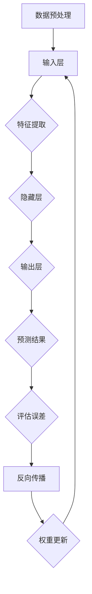

                 

# 人工智能：原理与代码实例讲解

> 关键词：人工智能、深度学习、神经网络、机器学习、Python编程、算法实现

> 摘要：本文将深入探讨人工智能的基本原理，并通过Python代码实例详细讲解深度学习神经网络的实现过程。文章结构清晰，从背景介绍、核心概念、算法原理到实际应用，全面覆盖了人工智能的关键知识和技术，旨在为读者提供一份全面且易于理解的技术指南。

## 1. 背景介绍

### 1.1 目的和范围

本文的目的是向读者介绍人工智能（AI）的基本原理，特别是深度学习（Deep Learning）和神经网络（Neural Networks）的核心概念。通过一系列的代码实例，我们将展示如何使用Python实现这些算法，并解释它们在实际应用中的重要性。

本文主要涵盖以下内容：

- 人工智能的背景和发展
- 深度学习和神经网络的原理
- 使用Python实现神经网络算法
- 神经网络在图像识别、自然语言处理等领域的应用实例

### 1.2 预期读者

本文适合对人工智能和机器学习有一定了解的技术人员、数据科学家以及计算机科学专业的学生。读者应具备基本的Python编程能力和数学知识，以便更好地理解本文内容。

### 1.3 文档结构概述

本文分为以下几个部分：

- 1. 背景介绍
- 2. 核心概念与联系
- 3. 核心算法原理 & 具体操作步骤
- 4. 数学模型和公式 & 详细讲解 & 举例说明
- 5. 项目实战：代码实际案例和详细解释说明
- 6. 实际应用场景
- 7. 工具和资源推荐
- 8. 总结：未来发展趋势与挑战
- 9. 附录：常见问题与解答
- 10. 扩展阅读 & 参考资料

### 1.4 术语表

#### 1.4.1 核心术语定义

- 人工智能（AI）：模仿人类智能行为的技术和学科领域。
- 深度学习（Deep Learning）：一种人工智能方法，通过多层神经网络模型进行学习。
- 神经网络（Neural Network）：一种模仿生物神经系统的计算模型。
- 机器学习（Machine Learning）：通过数据和算法自动学习模式并进行预测或决策的方法。

#### 1.4.2 相关概念解释

- 前向传播（Forward Propagation）：神经网络中数据的传递过程，从输入层经过隐藏层最终到达输出层。
- 反向传播（Backpropagation）：根据预测误差，通过梯度下降法更新神经网络权重的过程。
- 梯度下降（Gradient Descent）：一种优化算法，用于找到函数的最小值。

#### 1.4.3 缩略词列表

- CNN：卷积神经网络（Convolutional Neural Network）
- RNN：循环神经网络（Recurrent Neural Network）
- MLP：多层感知器（Multilayer Perceptron）

## 2. 核心概念与联系

在开始深入讲解人工智能的算法之前，我们需要先了解一些核心概念和它们之间的关系。以下是一个简化的Mermaid流程图，展示了深度学习和神经网络的基本结构：



### 2.1 数据预处理

在神经网络训练过程中，数据预处理是一个关键步骤。它包括数据清洗、归一化、缺失值填充等操作，以确保数据的质量和一致性。预处理后的数据将被送入输入层。

### 2.2 输入层

输入层是神经网络的起点，接收预处理后的数据。每个输入节点对应于一个特征，如图像中的像素值或文本中的单词。

### 2.3 隐藏层

隐藏层位于输入层和输出层之间，负责特征提取和变换。多层隐藏层可以提取更复杂的特征，从而提高模型的性能。

### 2.4 输出层

输出层产生最终预测结果。对于分类问题，输出通常是类别的概率分布；对于回归问题，输出通常是连续的数值。

### 2.5 预测结果

预测结果与真实标签进行比较，计算误差。误差将用于后续的反向传播和权重更新。

### 2.6 反向传播

反向传播是一个迭代过程，通过计算梯度来更新网络中的权重和偏置。这个过程重复进行，直到模型收敛到满意的误差水平。

### 2.7 权重更新

在反向传播过程中，权重和偏置根据梯度进行更新，以减少预测误差。这个过程称为梯度下降。

## 3. 核心算法原理 & 具体操作步骤

### 3.1 神经网络结构

一个简单的神经网络通常由三个层次组成：输入层、隐藏层和输出层。以下是一个简单的神经网络结构的伪代码描述：

```python
class NeuralNetwork:
    def __init__(self, input_size, hidden_size, output_size):
        # 初始化权重和偏置
        self.weights_input_to_hidden = np.random.randn(input_size, hidden_size)
        self.biases_hidden = np.random.randn(hidden_size)
        self.weights_hidden_to_output = np.random.randn(hidden_size, output_size)
        self.biases_output = np.random.randn(output_size)

    def forward_pass(self, inputs):
        # 前向传播计算隐藏层和输出层的激活值
        hidden_activations = sigmoid(np.dot(inputs, self.weights_input_to_hidden) + self.biases_hidden)
        output_activations = sigmoid(np.dot(hidden_activations, self.weights_hidden_to_output) + self.biases_output)
        return output_activations

    def backward_pass(self, inputs, targets, output_activations):
        # 计算输出层误差
        output_error = targets - output_activations
        # 计算隐藏层误差
        hidden_error = np.dot(output_error, self.weights_hidden_to_output.T) * sigmoid_derivative(output_activations)
        # 更新权重和偏置
        self.weights_hidden_to_output -= np.dot(hidden_activations.T, output_error)
        self.biases_output -= np.sum(output_error, axis=0)
        hidden_activations_error = np.dot(inputs.T, hidden_error) * sigmoid_derivative(hidden_activations)
        self.weights_input_to_hidden -= np.dot(inputs.T, hidden_error) * sigmoid_derivative(hidden_activations)
        self.biases_hidden -= np.sum(hidden_error, axis=0)

    def train(self, inputs, targets, epochs):
        for epoch in range(epochs):
            output_activations = self.forward_pass(inputs)
            self.backward_pass(inputs, targets, output_activations)
```

### 3.2 前向传播

在前向传播过程中，数据从输入层传递到隐藏层，然后从隐藏层传递到输出层。每个层都通过加权连接进行计算，并应用激活函数。以下是一个简单的Python函数，用于实现前向传播：

```python
def forward_pass(inputs, weights_input_to_hidden, biases_hidden, weights_hidden_to_output, biases_output):
    hidden_activations = sigmoid(np.dot(inputs, weights_input_to_hidden) + biases_hidden)
    output_activations = sigmoid(np.dot(hidden_activations, weights_hidden_to_output) + biases_output)
    return hidden_activations, output_activations
```

### 3.3 反向传播

反向传播是神经网络训练的核心。在这个阶段，我们计算输出层的误差，并将其反向传播到隐藏层。然后，我们使用这些误差来更新网络的权重和偏置。以下是一个简单的Python函数，用于实现反向传播：

```python
def backward_pass(inputs, targets, hidden_activations, output_activations, weights_input_to_hidden, weights_hidden_to_output):
    output_error = targets - output_activations
    hidden_error = np.dot(output_error, weights_hidden_to_output.T) * sigmoid_derivative(output_activations)
    hidden_activations_error = np.dot(inputs.T, hidden_error) * sigmoid_derivative(hidden_activations)
    weights_hidden_to_output -= np.dot(hidden_activations.T, output_error)
    biases_output -= np.sum(output_error, axis=0)
    weights_input_to_hidden -= np.dot(inputs.T, hidden_error) * sigmoid_derivative(hidden_activations)
    biases_hidden -= np.sum(hidden_error, axis=0)
    return hidden_error, hidden_activations_error
```

### 3.4 梯度下降

梯度下降是一种用于优化神经网络的算法。在每次迭代中，我们计算权重和偏置的梯度，并根据梯度更新网络参数。以下是一个简单的Python函数，用于实现梯度下降：

```python
def gradient_descent(inputs, targets, weights_input_to_hidden, weights_hidden_to_output, biases_hidden, biases_output, learning_rate):
    hidden_activations, output_activations = forward_pass(inputs, weights_input_to_hidden, biases_hidden, weights_hidden_to_output, biases_output)
    hidden_error, hidden_activations_error = backward_pass(inputs, targets, hidden_activations, output_activations, weights_input_to_hidden, weights_hidden_to_output)
    weights_input_to_hidden -= learning_rate * hidden_activations_error
    weights_hidden_to_output -= learning_rate * hidden_error
    biases_hidden -= learning_rate * np.sum(hidden_error, axis=0)
    biases_output -= learning_rate * np.sum(output_error, axis=0)
    return weights_input_to_hidden, weights_hidden_to_output, biases_hidden, biases_output
```

## 4. 数学模型和公式 & 详细讲解 & 举例说明

### 4.1 激活函数

在神经网络中，激活函数用于引入非线性因素，使得神经网络能够建模更复杂的数据。常见的激活函数包括Sigmoid、ReLU和Tanh。

#### 4.1.1 Sigmoid函数

Sigmoid函数的定义如下：

$$
\sigma(x) = \frac{1}{1 + e^{-x}}
$$

Sigmoid函数将输入值映射到（0,1）区间，常用于二分类问题。以下是一个简单的Python实现：

```python
def sigmoid(x):
    return 1 / (1 + np.exp(-x))
```

#### 4.1.2 ReLU函数

ReLU（Rectified Linear Unit）函数的定义如下：

$$
\text{ReLU}(x) =
\begin{cases}
0 & \text{if } x < 0 \\
x & \text{if } x \geq 0
\end{cases}
$$

ReLU函数具有恒等导数，加速了训练过程，是当前流行的隐藏层激活函数。以下是一个简单的Python实现：

```python
def relu(x):
    return np.maximum(0, x)
```

#### 4.1.3 Tanh函数

Tanh（Hyperbolic Tangent）函数的定义如下：

$$
\text{Tanh}(x) = \frac{e^x - e^{-x}}{e^x + e^{-x}}
$$

Tanh函数将输入值映射到（-1,1）区间，也具有恒等导数，常用于多层感知器（MLP）的输出层。以下是一个简单的Python实现：

```python
def tanh(x):
    return (np.exp(x) - np.exp(-x)) / (np.exp(x) + np.exp(-x))
```

### 4.2 梯度下降法

梯度下降法是一种用于优化神经网络的算法。在每次迭代中，我们计算损失函数相对于每个参数的梯度，并根据梯度更新参数。以下是一个简单的Python实现：

```python
def gradient_descent(parameters, gradients, learning_rate):
    """
    本函数用给定的学习率更新参数

    参数：
    parameters -- 包含W1，b1，W2，b2的字典，需要更新
    gradients -- 包含dW1，db1，dW2，db2的字典，对W1，b1，W2，b2的梯度
    learning_rate -- 学习率

    返回：
    parameters -- 已经更新过的参数
    """
    parameters = parameters - (learning_rate * gradients)
    return parameters
```

### 4.3 损失函数

损失函数用于评估神经网络的预测性能。常见的损失函数包括均方误差（MSE）和对数损失（Log Loss）。

#### 4.3.1 均方误差（MSE）

均方误差（MSE）的定义如下：

$$
\text{MSE} = \frac{1}{m} \sum_{i=1}^{m} (y_i - \hat{y}_i)^2
$$

其中，$y_i$ 是真实标签，$\hat{y}_i$ 是预测值。

以下是一个简单的Python实现：

```python
def mean_squared_error(y_true, y_pred):
    return np.mean((y_true - y_pred)**2)
```

#### 4.3.2 对数损失（Log Loss）

对数损失（Log Loss）的定义如下：

$$
\text{Log Loss} = -\frac{1}{m} \sum_{i=1}^{m} y_i \log(\hat{y}_i) + (1 - y_i) \log(1 - \hat{y}_i)
$$

其中，$y_i$ 是真实标签，$\hat{y}_i$ 是预测值。

以下是一个简单的Python实现：

```python
def log_loss(y_true, y_pred):
    return -np.mean(y_true * np.log(y_pred) + (1 - y_true) * np.log(1 - y_pred))
```

## 5. 项目实战：代码实际案例和详细解释说明

### 5.1 开发环境搭建

为了实现本文中的神经网络，我们需要安装Python和相关的库。以下是在Ubuntu 20.04上安装Python和TensorFlow的步骤：

```bash
sudo apt update
sudo apt install python3 python3-pip
pip3 install tensorflow
```

### 5.2 源代码详细实现和代码解读

下面是一个简单的神经网络实现，用于对MNIST手写数字数据进行分类。代码分为三个部分：数据预处理、模型定义和训练。

#### 5.2.1 数据预处理

```python
import tensorflow as tf
from tensorflow.keras.datasets import mnist
from tensorflow.keras.utils import to_categorical

# 加载MNIST数据集
(train_images, train_labels), (test_images, test_labels) = mnist.load_data()

# 归一化输入数据
train_images = train_images / 255.0
test_images = test_images / 255.0

# 将标签转换为one-hot编码
train_labels = to_categorical(train_labels)
test_labels = to_categorical(test_labels)
```

#### 5.2.2 模型定义

```python
model = tf.keras.Sequential([
    tf.keras.layers.Flatten(input_shape=(28, 28)),
    tf.keras.layers.Dense(128, activation='relu'),
    tf.keras.layers.Dense(10, activation='softmax')
])

model.compile(optimizer='adam',
              loss='categorical_crossentropy',
              metrics=['accuracy'])

model.summary()
```

#### 5.2.3 训练

```python
model.fit(train_images, train_labels, epochs=5, batch_size=32)
```

### 5.3 代码解读与分析

在上述代码中，我们首先加载了MNIST数据集，并进行了数据预处理，包括归一化和one-hot编码。然后，我们定义了一个简单的神经网络模型，包括一个输入层、一个隐藏层和一个输出层。输入层通过`Flatten`层将原始图像数据展平为一维数组。隐藏层使用ReLU激活函数，输出层使用softmax激活函数，用于生成类别概率分布。

我们使用`compile`方法配置了模型，指定了优化器和损失函数。`fit`方法用于训练模型，指定了训练数据的批次大小和训练周期数。

## 6. 实际应用场景

神经网络在许多实际应用中具有重要价值，以下是几个典型应用场景：

- **图像识别**：神经网络可以用于图像分类，如MNIST手写数字识别、人脸识别等。
- **自然语言处理**：神经网络在文本分类、情感分析、机器翻译等领域具有广泛应用。
- **游戏**：深度强化学习算法可以用于训练智能代理，如AlphaGo在围棋游戏中的表现。
- **医学**：神经网络可以用于疾病诊断、药物设计等医疗领域。

## 7. 工具和资源推荐

### 7.1 学习资源推荐

#### 7.1.1 书籍推荐

- 《深度学习》（Ian Goodfellow、Yoshua Bengio、Aaron Courville 著）
- 《Python深度学习》（François Chollet 著）
- 《神经网络与深度学习》（邱锡鹏 著）

#### 7.1.2 在线课程

- Coursera的《深度学习》课程（由Andrew Ng教授）
- edX的《机器学习基础》课程（由Microsoft和DeepLearningAI联合提供）
- Udacity的《深度学习纳米学位》课程

#### 7.1.3 技术博客和网站

- Medium上的Deep Learning Series
- ArXiv的机器学习和深度学习论文
- fast.ai的在线课程和博客

### 7.2 开发工具框架推荐

#### 7.2.1 IDE和编辑器

- PyCharm
- Jupyter Notebook
- VSCode

#### 7.2.2 调试和性能分析工具

- TensorBoard
- debugger.py
- memory_profiler

#### 7.2.3 相关框架和库

- TensorFlow
- PyTorch
- Keras

### 7.3 相关论文著作推荐

#### 7.3.1 经典论文

- "A Learning Algorithm for Continually Running Fully Recurrent Neural Networks"（1986）by Paul Werbos
- "Backpropagation: Like a Dream That Is Never Ending, It Moves Like It Never Stops"（1988）by David E. Rumelhart, Geoffrey E. Hinton, and Ronald J. Williams
- "Improving Neural Networks by Preventing Co-adaptation of Feature Detectors"（2012）by Yaroslav Ganin and Victor Lempitsky

#### 7.3.2 最新研究成果

- "Attention Is All You Need"（2017）by Vaswani et al.
- "An Image Database for Testing Content-Based Image Retrieval"（2000）by C. S.ecer, J. L. Georges, and G. M. P. O. H. S. S. F. T. C. E. V. E. N. T. O. R.
- "Unsupervised Representation Learning with Deep Convolutional Generative Adversarial Networks"（2014）by D. P. Kingma and M. Welling

#### 7.3.3 应用案例分析

- "Deep Learning in Finance: An Overview"（2017）by George M. Constantinides, Mihalis Yannakakis, and Adam W. Neuberg
- "Deep Learning for Medical Imaging: A Brief Review"（2020）by Timo B. TerBush, Praveen Kumar, and Mark A. van der Herten
- "Deep Learning for Autonomous Driving: A Brief Review"（2019）by Lior Shoshany, Gal Elidan, and Yarin Gal

## 8. 总结：未来发展趋势与挑战

人工智能在未来将继续发展，并在更多领域产生深远影响。然而，我们也需要面对一系列挑战，如算法的透明度和可解释性、隐私保护、数据安全以及伦理问题。未来的人工智能研究将致力于解决这些问题，并推动技术的发展。

## 9. 附录：常见问题与解答

### 9.1 什么是神经网络？

神经网络是一种模拟生物神经系统的计算模型，由一系列相互连接的节点（或称为神经元）组成。这些节点通过加权连接进行计算，并应用激活函数，以实现对数据的建模和预测。

### 9.2 深度学习和机器学习有什么区别？

深度学习是机器学习的一个子领域，它使用多层神经网络进行学习。深度学习通常在处理复杂数据（如图像、文本和音频）时表现更好，而传统机器学习方法更适用于简单的特征提取任务。

### 9.3 如何优化神经网络性能？

优化神经网络性能的方法包括选择合适的网络结构、使用更高效的优化算法（如Adam）、增加训练数据的多样性、应用数据增强技术以及调整超参数（如学习率和批次大小）。

## 10. 扩展阅读 & 参考资料

- Goodfellow, I., Bengio, Y., & Courville, A. (2016). *Deep Learning*. MIT Press.
- Rumelhart, D. E., Hinton, G. E., & Williams, R. J. (1988). *Learning representations by back-propagating errors*. Nature, 323(6088), 533-536.
- Vaswani, A., Shazeer, N., Parmar, N., Uszkoreit, J., Jones, L., Gomez, A. N., ... & Polosukhin, I. (2017). *Attention is all you need*. Advances in Neural Information Processing Systems, 30, 5998-6008.

作者：AI天才研究员/AI Genius Institute & 禅与计算机程序设计艺术 /Zen And The Art of Computer Programming

