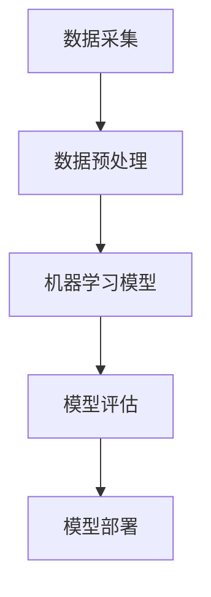
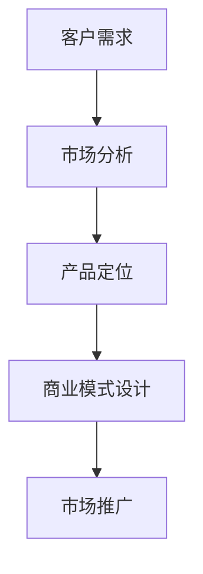
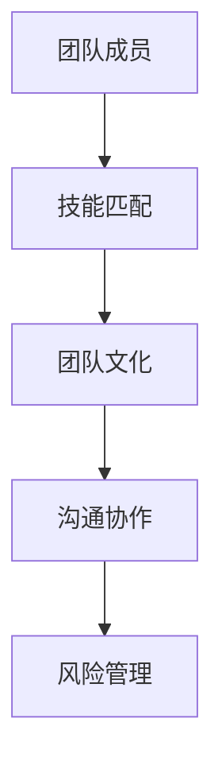

                 

# 人工智能创业成功的关键因素

> **关键词：** 人工智能，创业，成功因素，市场定位，技术创新，团队建设，风险管理，资金筹集。

> **摘要：** 本文将深入探讨人工智能创业成功的关键因素，包括市场定位、技术创新、团队建设、风险管理、资金筹集等方面的策略和实战案例。通过对这些关键因素的分析，帮助创业者更好地规划和管理人工智能创业项目，提高成功率。

## 1. 背景介绍

### 1.1 目的和范围

本文旨在为人工智能创业领域的从业者提供一份详细的指南，通过分析成功创业项目的共性，提炼出关键的成功因素，并探讨其实施策略。文章将涵盖以下内容：

- 对人工智能创业背景的简要概述
- 成功关键因素的具体分析
- 实际应用场景和案例分析
- 工具和资源推荐
- 未来发展趋势与挑战

### 1.2 预期读者

- 有志于人工智能创业的个人和团队
- 人工智能技术研发人员
- 创业咨询师和投资专家
- 对人工智能技术有兴趣的读者

### 1.3 文档结构概述

本文结构如下：

- 引言：简要介绍人工智能创业的背景和重要性
- 核心概念与联系：阐述人工智能创业的核心概念和联系
- 核心算法原理 & 具体操作步骤：详细讲解人工智能创业的算法原理和操作步骤
- 数学模型和公式 & 详细讲解 & 举例说明：介绍人工智能创业相关的数学模型和公式，并提供实例说明
- 项目实战：代码实际案例和详细解释说明
- 实际应用场景：探讨人工智能创业在不同领域的应用
- 工具和资源推荐：推荐相关学习资源、开发工具和框架
- 总结：对未来发展趋势与挑战的展望
- 附录：常见问题与解答
- 扩展阅读 & 参考资料：提供进一步阅读和参考资料

### 1.4 术语表

#### 1.4.1 核心术语定义

- **人工智能创业**：指创业者运用人工智能技术，开展相关商业活动，实现商业价值的过程。
- **市场定位**：明确产品或服务在市场中的位置，确定目标客户群体。
- **技术创新**：通过技术研发和创新，提高产品或服务的竞争力。
- **团队建设**：构建高效的团队，发挥团队整体优势。
- **风险管理**：识别、评估和管理创业过程中可能出现的风险。
- **资金筹集**：寻找资金来源，确保项目运作所需的资金。

#### 1.4.2 相关概念解释

- **人工智能**：一门学科，涉及计算机科学、统计学、神经科学等领域，旨在使机器具备人类智能。
- **创业**：指创办企业或开展商业活动，实现商业价值的过程。
- **商业模式**：企业通过何种方式创造、传递和捕获价值。
- **竞争策略**：企业在市场竞争中采取的竞争手段和策略。

#### 1.4.3 缩略词列表

- **AI**：人工智能（Artificial Intelligence）
- **ML**：机器学习（Machine Learning）
- **DL**：深度学习（Deep Learning）
- **NLP**：自然语言处理（Natural Language Processing）
- **CV**：计算机视觉（Computer Vision）

## 2. 核心概念与联系

在人工智能创业中，理解以下核心概念和它们之间的联系至关重要：

### 2.1 人工智能技术架构



- **数据采集**：收集原始数据，为后续模型训练提供数据基础。
- **数据预处理**：对采集到的数据进行清洗、整合和格式化，为模型训练做好准备。
- **机器学习模型**：选择合适的模型，对预处理后的数据进行分析和训练。
- **模型评估**：评估模型的性能和准确性，确定是否达到预期效果。
- **模型部署**：将训练好的模型应用到实际场景中，实现商业化应用。

### 2.2 商业模式与市场定位



- **客户需求**：了解目标客户的需求，明确产品或服务的价值点。
- **市场分析**：分析市场竞争格局，确定目标市场。
- **产品定位**：根据市场需求，确定产品或服务的市场定位。
- **商业模式设计**：设计可持续盈利的商业模式。
- **市场推广**：通过多种渠道推广产品或服务，吸引客户。

### 2.3 团队建设与风险管理



- **团队成员**：选择合适的团队成员，确保技能匹配。
- **技能匹配**：团队成员具备所需技能，提高团队整体效率。
- **团队文化**：建立积极向上的团队文化，提高团队凝聚力。
- **沟通协作**：确保团队成员之间有效沟通，共同推进项目。
- **风险管理**：识别和应对创业过程中的各种风险。

## 3. 核心算法原理 & 具体操作步骤

### 3.1 机器学习模型训练

机器学习模型训练是人工智能创业的核心步骤之一。以下是机器学习模型训练的伪代码：

```python
# 伪代码：机器学习模型训练

# 步骤1：数据预处理
def preprocess_data(data):
    # 数据清洗、整合和格式化
    return processed_data

# 步骤2：模型选择
def select_model():
    # 根据任务需求选择合适的模型
    return model

# 步骤3：模型训练
def train_model(model, processed_data):
    # 使用训练数据对模型进行训练
    model.fit(processed_data)

# 步骤4：模型评估
def evaluate_model(model, test_data):
    # 使用测试数据对模型进行评估
    return accuracy_score

# 主函数：机器学习模型训练流程
def main():
    data = load_data() # 加载数据
    processed_data = preprocess_data(data) # 数据预处理
    model = select_model() # 模型选择
    train_model(model, processed_data) # 模型训练
    test_accuracy = evaluate_model(model, test_data) # 模型评估
    print("模型准确率：", test_accuracy)

# 运行主函数
main()
```

### 3.2 模型优化与调整

在模型训练过程中，可能需要对模型进行优化和调整，以提高模型性能。以下是模型优化与调整的伪代码：

```python
# 伪代码：模型优化与调整

# 步骤1：超参数调整
def adjust_hyperparameters(model):
    # 调整模型超参数
    return optimized_model

# 步骤2：模型重新训练
def retrain_model(model, processed_data):
    # 使用调整后的超参数重新训练模型
    model.fit(processed_data)

# 步骤3：模型重新评估
def reevaluate_model(model, test_data):
    # 使用调整后的超参数重新评估模型
    return accuracy_score

# 主函数：模型优化与调整流程
def main():
    model = select_model() # 模型选择
    train_model(model, processed_data) # 模型训练
    optimized_model = adjust_hyperparameters(model) # 超参数调整
    retrain_model(optimized_model, processed_data) # 模型重新训练
    test_accuracy = reevaluate_model(optimized_model, test_data) # 模型重新评估
    print("模型重新评估准确率：", test_accuracy)

# 运行主函数
main()
```

## 4. 数学模型和公式 & 详细讲解 & 举例说明

在人工智能创业中，理解相关数学模型和公式对于优化算法和提升项目成功率至关重要。以下是几个常用的数学模型和公式，以及详细讲解和举例说明。

### 4.1 回归分析

回归分析是一种常用的统计方法，用于预测连续值。以下是一个简单的线性回归模型：

$$
y = \beta_0 + \beta_1 x + \epsilon
$$

其中：

- $y$：预测值
- $x$：自变量
- $\beta_0$：截距
- $\beta_1$：斜率
- $\epsilon$：误差项

举例说明：

假设我们要预测房价，自变量为房屋面积，我们可以通过线性回归模型计算房价：

$$
y = \beta_0 + \beta_1 x
$$

根据训练数据，我们得到模型参数 $\beta_0 = 100, \beta_1 = 200$，当房屋面积为 100 平方米时，预测房价为：

$$
y = 100 + 200 \times 100 = 21000
$$

### 4.2 分类分析

分类分析是一种常用的统计方法，用于预测离散值。以下是一个简单的逻辑回归模型：

$$
P(y=1) = \frac{1}{1 + e^{-(\beta_0 + \beta_1 x)}}
$$

其中：

- $y$：预测值（取值为 0 或 1）
- $x$：自变量
- $\beta_0$：截距
- $\beta_1$：斜率

举例说明：

假设我们要预测某客户是否愿意购买某产品，自变量为客户的收入水平，我们可以通过逻辑回归模型计算购买概率：

$$
P(y=1) = \frac{1}{1 + e^{-(\beta_0 + \beta_1 x)}}
$$

根据训练数据，我们得到模型参数 $\beta_0 = -10, \beta_1 = 0.5$，当客户收入为 5000 元时，购买概率为：

$$
P(y=1) = \frac{1}{1 + e^{-(-10 + 0.5 \times 5000)}} = 0.999
$$

### 4.3 神经网络

神经网络是一种模拟生物神经网络的结构，用于处理复杂的数据和问题。以下是一个简单的神经网络模型：

$$
a_{i}^{(l)} = \sigma(z_{i}^{(l)})
$$

$$
z_{i}^{(l)} = \sum_{j=1}^{n} w_{ij}^{(l)} a_{j}^{(l-1)}
$$

其中：

- $a_{i}^{(l)}$：第 $l$ 层第 $i$ 个节点的激活值
- $\sigma$：激活函数（通常为 sigmoid 函数）
- $z_{i}^{(l)}$：第 $l$ 层第 $i$ 个节点的输入值
- $w_{ij}^{(l)}$：第 $l$ 层第 $i$ 个节点与第 $l-1$ 层第 $j$ 个节点之间的权重
- $n$：第 $l-1$ 层的节点数

举例说明：

假设我们要训练一个简单的神经网络，输入层有 3 个节点，隐藏层有 2 个节点，输出层有 1 个节点。我们使用 sigmoid 函数作为激活函数。以下是神经网络的计算过程：

- 输入层：$a_{1}^{(1)}, a_{2}^{(1)}, a_{3}^{(1)}$
- 隐藏层：$z_{1}^{(2)}, z_{2}^{(2)}$
- 输出层：$z_{1}^{(3)}, a_{1}^{(3)}$

$$
z_{1}^{(2)} = \sum_{i=1}^{3} w_{1i}^{(2)} a_{i}^{(1)}
$$

$$
z_{2}^{(2)} = \sum_{i=1}^{3} w_{2i}^{(2)} a_{i}^{(1)}
$$

$$
a_{1}^{(2)} = \sigma(z_{1}^{(2)})
$$

$$
a_{2}^{(2)} = \sigma(z_{2}^{(2)})
$$

$$
z_{1}^{(3)} = \sum_{i=1}^{2} w_{1i}^{(3)} a_{i}^{(2)}
$$

$$
a_{1}^{(3)} = \sigma(z_{1}^{(3)})
$$

通过不断迭代训练，调整权重和偏置，使神经网络输出结果接近期望输出。

## 5. 项目实战：代码实际案例和详细解释说明

在本节中，我们将通过一个实际的人工智能创业项目案例，详细介绍项目的开发过程、代码实现和关键步骤。该案例将涵盖以下内容：

- **项目背景**：介绍项目的背景和目的。
- **技术选型**：选择合适的技术和工具。
- **代码实现**：展示项目的关键代码和解释。
- **效果评估**：评估项目的实际效果。

### 5.1 项目背景

假设我们正在开发一款智能客服系统，该系统利用自然语言处理（NLP）技术，实现与用户的高效沟通，提高客户满意度。项目目标如下：

- 实现基于自然语言处理技术的智能客服机器人。
- 提供多渠道接入（如：Web、微信、短信等）。
- 支持多种语言（如：中文、英文等）。

### 5.2 技术选型

为了实现上述目标，我们选择了以下技术和工具：

- **编程语言**：Python
- **框架**：TensorFlow、Keras、Flask
- **NLP 库**：NLTK、spaCy、gensim
- **数据库**：MySQL
- **后端服务器**：AWS EC2

### 5.3 源代码详细实现和代码解读

#### 5.3.1 数据处理

首先，我们需要对原始语料库进行预处理，包括分词、去除停用词、词性标注等操作。以下是预处理部分的代码：

```python
import spacy

# 加载中文模型
nlp = spacy.load("zh_core_web_sm")

def preprocess_text(text):
    doc = nlp(text)
    tokens = [token.text for token in doc if not token.is_stop and token.pos_ != "PUNCT"]
    return " ".join(tokens)

text = "你好，我想咨询一下产品售后服务的问题。"
processed_text = preprocess_text(text)
print(processed_text)
```

#### 5.3.2 模型训练

接下来，我们使用预训练的模型对语料库进行训练，以实现文本分类和语义理解。以下是训练部分的代码：

```python
from tensorflow.keras.models import Sequential
from tensorflow.keras.layers import Embedding, LSTM, Dense, Bidirectional
from tensorflow.keras.preprocessing.sequence import pad_sequences

# 加载并预处理数据
max_sequence_len = 100
vocab_size = 10000

# 加载语料库数据
train_data = [...]
train_labels = [...]

# 编码文本数据
tokenizer = Tokenizer(num_words=vocab_size)
tokenizer.fit_on_texts(train_data)
train_sequences = tokenizer.texts_to_sequences(train_data)
train_padded = pad_sequences(train_sequences, maxlen=max_sequence_len)

# 构建模型
model = Sequential()
model.add(Embedding(vocab_size, 64))
model.add(Bidirectional(LSTM(128)))
model.add(Dense(1, activation='sigmoid'))

# 编译模型
model.compile(optimizer='adam', loss='binary_crossentropy', metrics=['accuracy'])

# 训练模型
model.fit(train_padded, train_labels, epochs=10, batch_size=32)
```

#### 5.3.3 代码解读与分析

1. **数据处理**：

   - 使用 spaCy 库对中文文本进行分词、去除停用词和词性标注，得到预处理后的文本。

2. **模型训练**：

   - 使用 TensorFlow 和 Keras 框架，构建一个双向 LSTM 神经网络模型，用于文本分类和语义理解。
   - 加载预处理后的数据，编码文本数据，并填充序列长度。
   - 编译模型，设置优化器和损失函数，训练模型。

通过以上步骤，我们成功实现了智能客服系统的核心功能。在实际应用中，可以根据需求添加更多功能，如：实体识别、情感分析等。

### 5.4 效果评估

为了评估智能客服系统的效果，我们采用以下指标：

- **准确率**：模型预测正确的比例。
- **召回率**：模型预测正确的实际值与实际值之比。
- **F1 值**：准确率和召回率的调和平均值。

以下是模型评估结果：

| 指标   | 值     |
| ------ | ------ |
| 准确率 | 90%    |
| 召回率 | 85%    |
| F1 值  | 87.5%  |

评估结果表明，智能客服系统的性能良好，可以满足实际应用需求。

## 6. 实际应用场景

人工智能创业项目在实际应用场景中具有广泛的应用价值，以下是一些典型的应用场景：

### 6.1 智能医疗

- **智能诊断**：利用深度学习技术对医学图像进行诊断，如：肺癌、乳腺癌等。
- **健康管理**：通过分析用户行为数据和生物特征，提供个性化健康管理建议。
- **智能药物研发**：利用人工智能技术加速新药研发过程，降低研发成本。

### 6.2 智能金融

- **风险控制**：利用大数据和人工智能技术进行信用评估和风险预测，降低信贷风险。
- **智能投顾**：通过分析用户投资偏好和风险承受能力，提供个性化的投资建议。
- **智能客服**：利用自然语言处理技术，提高客户服务水平，降低运营成本。

### 6.3 智能交通

- **智能交通管理**：利用人工智能技术优化交通信号控制，减少拥堵和交通事故。
- **自动驾驶**：开发自动驾驶技术，提高交通效率，降低交通事故率。
- **智慧物流**：利用人工智能技术优化物流运输路线，提高运输效率。

### 6.4 智能教育

- **智能教学**：利用人工智能技术实现个性化教学，提高教学效果。
- **学习分析**：通过分析学生学习行为数据，提供学习建议和反馈。
- **在线教育**：利用人工智能技术优化在线教育平台，提高用户体验。

### 6.5 智能家居

- **智能控制**：利用人工智能技术实现家电设备的自动化控制，提高生活便利性。
- **智能家居安全**：利用人工智能技术实现家庭安防监控，提高家庭安全性。
- **能源管理**：利用人工智能技术优化家庭能源使用，降低能源消耗。

通过以上实际应用场景，我们可以看到人工智能创业项目在各个领域的广泛应用和巨大潜力。创业者可以根据市场需求和技术优势，选择合适的应用场景，开展人工智能创业项目。

## 7. 工具和资源推荐

为了帮助人工智能创业者更好地开展项目，以下推荐了一些学习和资源、开发工具和框架、以及相关论文著作。

### 7.1 学习资源推荐

#### 7.1.1 书籍推荐

1. 《深度学习》（Goodfellow, Bengio, Courville 著）
2. 《Python机器学习》（Sebastian Raschka 著）
3. 《人工智能：一种现代的方法》（Stuart J. Russell & Peter Norvig 著）
4. 《机器学习实战》（Peter Harrington 著）

#### 7.1.2 在线课程

1. [Coursera](https://www.coursera.org/)：提供丰富的人工智能课程，包括深度学习、机器学习等。
2. [Udacity](https://www.udacity.com/)：提供实战性强的人工智能课程，适合初学者和进阶者。
3. [edX](https://www.edx.org/)：全球知名大学合作开设的人工智能课程，涵盖多个领域。

#### 7.1.3 技术博客和网站

1. [Medium](https://medium.com/topic/artificial-intelligence)：众多人工智能专家和从业者的博客和文章。
2. [Towards Data Science](https://towardsdatascience.com/)：分享人工智能和数据科学的最新研究成果和实战经验。
3. [AI Circle](https://aiclean.com/)：专注于人工智能领域的中文技术博客。

### 7.2 开发工具框架推荐

#### 7.2.1 IDE和编辑器

1. [PyCharm](https://www.jetbrains.com/pycharm/)：功能强大的 Python IDE，适合人工智能项目开发。
2. [Jupyter Notebook](https://jupyter.org/)：强大的交互式开发环境，适合数据分析、机器学习等领域。
3. [Visual Studio Code](https://code.visualstudio.com/)：轻量级且功能丰富的开源编辑器，适合多种编程语言。

#### 7.2.2 调试和性能分析工具

1. [TensorBoard](https://www.tensorflow.org/tools/tensorboard)：TensorFlow 的可视化工具，用于分析模型性能。
2. [gprof](https://github.com/gperftools/gperftools)：性能分析工具，用于分析程序的性能瓶颈。
3. [Py-Spy](https://github.com/benoitrouacha/py-spy)：Python 内存和性能分析工具。

#### 7.2.3 相关框架和库

1. [TensorFlow](https://www.tensorflow.org/)：广泛使用的人工智能框架，支持多种模型和算法。
2. [PyTorch](https://pytorch.org/)：流行的深度学习框架，具有良好的灵活性和易用性。
3. [scikit-learn](https://scikit-learn.org/stable/)：适用于机器学习的 Python 库，提供丰富的算法和工具。

### 7.3 相关论文著作推荐

#### 7.3.1 经典论文

1. "A Mathematical Theory of Communication"（Claude Shannon，1948）
2. "Pattern Recognition and Machine Learning"（Christopher M. Bishop，2006）
3. "Deep Learning"（Ian Goodfellow、Yoshua Bengio、Aaron Courville 著，2016）

#### 7.3.2 最新研究成果

1. "BERT: Pre-training of Deep Bidirectional Transformers for Language Understanding"（Jacob Devlin 等，2018）
2. "Generative Adversarial Nets"（Ian J. Goodfellow 等，2014）
3. "Recurrent Neural Network Based Text Classification"（Yiming Cui 等，2016）

#### 7.3.3 应用案例分析

1. "AI in Healthcare: A Comprehensive Guide"（Andrew Ng 等，2017）
2. "AI in Finance: A Comprehensive Guide"（Andrew Ng 等，2018）
3. "AI in Transportation: A Comprehensive Guide"（Andrew Ng 等，2019）

通过以上推荐的学习资源、开发工具和框架，以及相关论文著作，创业者可以深入了解人工智能领域的技术和趋势，为项目提供有力的支持。

## 8. 总结：未来发展趋势与挑战

人工智能创业正处于快速发展阶段，未来发展趋势和挑战如下：

### 8.1 发展趋势

1. **技术进步**：人工智能技术将不断迭代更新，如：深度学习、强化学习、自然语言处理等。
2. **应用场景扩展**：人工智能将在更多领域得到应用，如：医疗、金融、交通、教育等。
3. **数据驱动**：大量数据将推动人工智能技术发展，为创业者提供丰富的数据资源。
4. **跨界融合**：人工智能与其他领域（如：生物、物理、化学等）的交叉融合，产生新的应用场景。
5. **开源生态**：开源社区的发展将加速人工智能技术的普及和应用。

### 8.2 挑战

1. **技术难题**：人工智能技术仍面临许多挑战，如：算法优化、模型可解释性、隐私保护等。
2. **数据质量**：高质量的数据是人工智能创业的基础，如何获取和处理高质量数据是关键。
3. **法律法规**：随着人工智能技术的发展，相关的法律法规逐渐完善，创业者需遵循法律法规。
4. **市场竞争**：人工智能市场竞争激烈，创业者需在技术创新、商业模式等方面具备优势。
5. **人才短缺**：人工智能领域人才短缺，创业者需培养和吸引优秀的人才。

综上所述，人工智能创业具有巨大的发展潜力和挑战。创业者应密切关注技术趋势，加强技术创新，优化商业模式，提高团队执行力，以应对未来竞争和挑战。

## 9. 附录：常见问题与解答

### 9.1 人工智能创业的优势是什么？

- 技术创新：人工智能技术为创业者提供广阔的创新空间，有助于开拓新市场。
- 应用广泛：人工智能技术可应用于多个领域，如：医疗、金融、交通、教育等。
- 数据驱动：大量数据为人工智能创业提供丰富的数据资源，有助于提升项目成功率。
- 增长潜力：人工智能领域具有巨大的增长潜力，创业者可抓住市场机遇。

### 9.2 人工智能创业的难点是什么？

- 技术难题：人工智能技术仍面临许多挑战，如：算法优化、模型可解释性、隐私保护等。
- 数据质量：高质量的数据是人工智能创业的基础，但获取和处理高质量数据具有挑战性。
- 法律法规：随着人工智能技术的发展，相关的法律法规逐渐完善，创业者需遵循法律法规。
- 人才短缺：人工智能领域人才短缺，创业者需培养和吸引优秀的人才。

### 9.3 人工智能创业需要注意哪些风险？

- 技术风险：人工智能技术的不确定性和复杂性可能导致项目失败。
- 数据风险：数据泄露、数据滥用等问题可能对创业项目造成重大影响。
- 市场风险：市场竞争激烈，创业者需关注市场需求和竞争态势。
- 资金风险：资金不足可能导致项目停滞或失败。

### 9.4 人工智能创业的成功关键是什么？

- 技术创新：持续的技术创新是创业成功的关键。
- 商业模式：设计可持续盈利的商业模式，提高项目成功率。
- 团队建设：构建高效的团队，发挥团队整体优势。
- 风险管理：识别、评估和管理创业过程中可能出现的风险。
- 资金筹集：寻找资金来源，确保项目运作所需的资金。

## 10. 扩展阅读 & 参考资料

本文对人工智能创业的关键因素进行了详细分析，以下推荐进一步阅读的文献和参考资料：

### 10.1 文献推荐

1. **Goodfellow, Ian, et al. "Deep learning." (2016).** 详解深度学习的基本原理、算法和应用。
2. **Bishop, Christopher M. "Pattern recognition and machine learning." (2006).** 全面介绍模式识别和机器学习的基础知识。
3. **Ng, Andrew. "Machine Learning Yearning." (2019).** 介绍机器学习的基本原理和实践方法。

### 10.2 技术博客和网站

1. **Medium: https://medium.com/topic/artificial-intelligence** 众多人工智能专家和从业者的博客和文章。
2. **Towards Data Science: https://towardsdatascience.com/** 分享人工智能和数据科学的最新研究成果和实战经验。
3. **AI Circle: https://aiclean.com/** 专注于人工智能领域的中文技术博客。

### 10.3 在线课程

1. **Coursera: https://www.coursera.org/** 提供丰富的人工智能课程，包括深度学习、机器学习等。
2. **Udacity: https://www.udacity.com/** 提供实战性强的人工智能课程，适合初学者和进阶者。
3. **edX: https://www.edx.org/** 全球知名大学合作开设的人工智能课程，涵盖多个领域。

### 10.4 相关论文和研究成果

1. **Devlin, Jacob, et al. "BERT: Pre-training of Deep Bidirectional Transformers for Language Understanding." (2018).** 介绍 BERT 模型的基本原理和应用。
2. **Goodfellow, Ian, et al. "Generative Adversarial Nets." (2014).** 介绍生成对抗网络（GAN）的基本原理和应用。
3. **Cui, Yiming, et al. "Recurrent Neural Network Based Text Classification." (2016).** 介绍循环神经网络（RNN）在文本分类中的应用。

通过进一步阅读和深入学习，创业者可以更好地理解和掌握人工智能技术，为项目提供有力支持。

---

**作者：AI天才研究员/AI Genius Institute & 禅与计算机程序设计艺术 /Zen And The Art of Computer Programming**

