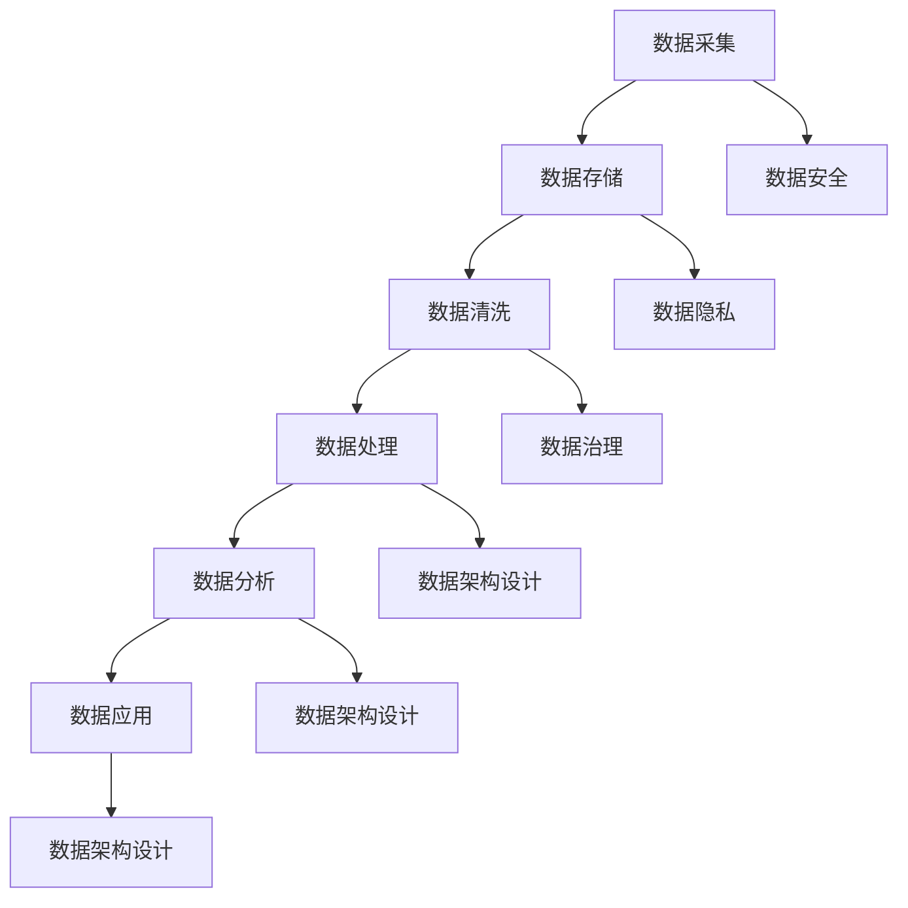

                 

# 人工智能创业数据管理指南

> 关键词：人工智能、数据管理、数据安全、数据隐私、数据清洗、数据可视化、数据架构设计、创业公司、数据处理流程

> 摘要：本文旨在为人工智能创业公司提供一套全面的数据管理指南，帮助创业团队在数据采集、存储、处理、分析和应用等方面实现高效和合规。文章将详细探讨数据管理的核心概念、算法原理、数学模型、实际应用以及未来发展趋势，以助创业团队在激烈的市场竞争中脱颖而出。

## 1. 背景介绍

### 1.1 目的和范围

本文的目的在于为人工智能创业公司提供一套系统化的数据管理指南，旨在确保数据在采集、存储、处理、分析和应用等各个环节中的安全、合规和高效。本文将涵盖以下范围：

1. 数据管理的核心概念和原则。
2. 数据处理流程和核心算法原理。
3. 数学模型和公式在数据管理中的应用。
4. 数据实际应用的案例和实践经验。
5. 未来数据管理技术的发展趋势和挑战。

### 1.2 预期读者

本文适用于人工智能创业团队的技术人员、产品经理、数据科学家和项目经理。读者应具备一定的计算机基础和人工智能相关知识，以便更好地理解和应用本文的内容。

### 1.3 文档结构概述

本文分为十个部分，结构如下：

1. 背景介绍：介绍文章的目的、范围、预期读者和文档结构。
2. 核心概念与联系：阐述数据管理的核心概念和原理。
3. 核心算法原理 & 具体操作步骤：详细讲解数据处理的核心算法。
4. 数学模型和公式 & 详细讲解 & 举例说明：介绍数学模型在数据管理中的应用。
5. 项目实战：代码实际案例和详细解释说明。
6. 实际应用场景：探讨数据管理的实际应用场景。
7. 工具和资源推荐：推荐学习资源、开发工具和框架。
8. 总结：未来发展趋势与挑战。
9. 附录：常见问题与解答。
10. 扩展阅读 & 参考资料：提供进一步学习的资源。

### 1.4 术语表

#### 1.4.1 核心术语定义

- 数据管理：对数据的采集、存储、处理、分析和应用的过程进行系统性规划和操作。
- 数据安全：保护数据免受未经授权的访问、泄露、篡改和破坏。
- 数据隐私：保护个人数据不被泄露和滥用。
- 数据清洗：对数据进行清洗和预处理，以确保数据的质量和可用性。
- 数据可视化：通过图形化方式展示数据，帮助人们更好地理解和分析数据。
- 数据架构设计：设计数据存储、处理和分析的结构，以提高数据管理效率和性能。

#### 1.4.2 相关概念解释

- 数据采集：从各种来源收集数据，如传感器、互联网、数据库等。
- 数据存储：将数据存储在数据库、文件系统或其他数据存储设备中。
- 数据处理：对数据进行清洗、转换、聚合和分析等操作。
- 数据分析：使用统计学、机器学习等方法对数据进行挖掘和洞察。
- 数据应用：将分析结果应用于实际业务场景，如决策支持、风险控制、产品优化等。

#### 1.4.3 缩略词列表

- AI：人工智能
- ML：机器学习
- DL：深度学习
- DB：数据库
- SQL：结构化查询语言
- NoSQL：非结构化查询语言
- API：应用程序编程接口
- SDK：软件开发工具包

## 2. 核心概念与联系

### 2.1 数据管理核心概念

数据管理是一个复杂的过程，涉及到数据的采集、存储、处理、分析和应用等多个环节。以下是数据管理中的核心概念：

1. **数据质量**：数据质量是数据管理的基础，包括数据的准确性、完整性、一致性、及时性和可用性。高质量的数据有助于提高业务决策的准确性和效率。
2. **数据安全**：数据安全是确保数据免受未经授权的访问、泄露、篡改和破坏。数据安全包括数据加密、访问控制、备份和恢复等措施。
3. **数据隐私**：数据隐私是保护个人数据不被泄露和滥用。在数据管理中，需要遵守相关法律法规，如《通用数据保护条例》（GDPR）等。
4. **数据治理**：数据治理是一个系统性过程，旨在确保数据的一致性、可用性和合规性。数据治理包括数据策略、数据标准、数据流程和数据合规等。
5. **数据架构**：数据架构是数据存储、处理和分析的结构设计，包括数据库设计、数据仓库设计、数据流设计等。

### 2.2 数据处理流程和核心算法原理

数据处理流程包括数据采集、数据存储、数据清洗、数据处理、数据分析和数据应用等环节。以下是数据处理流程中的核心算法原理：

1. **数据采集**：数据采集是数据管理的第一步，包括传感器采集、互联网爬虫、数据库连接等。常用的数据采集算法有爬虫算法、抽样算法和随机采样算法。
2. **数据存储**：数据存储是将采集到的数据存储在数据库、文件系统或其他数据存储设备中。常用的数据存储算法有哈希存储算法、索引存储算法和压缩存储算法。
3. **数据清洗**：数据清洗是对数据进行清洗和预处理，以确保数据的质量和可用性。常用的数据清洗算法有去重算法、缺失值填充算法和异常值处理算法。
4. **数据处理**：数据处理是对数据进行转换、聚合和分析等操作，以提取有用信息和洞察。常用的数据处理算法有统计分析算法、机器学习算法和深度学习算法。
5. **数据分析**：数据分析是使用统计学、机器学习等方法对数据进行挖掘和洞察。常用的数据分析算法有聚类分析、分类分析、回归分析和关联规则挖掘等。
6. **数据应用**：数据应用是将分析结果应用于实际业务场景，如决策支持、风险控制、产品优化等。常用的数据应用算法有优化算法、预测算法和推荐算法等。

### 2.3 数据架构设计

数据架构设计是数据管理的重要组成部分，包括数据库设计、数据仓库设计、数据流设计等。以下是数据架构设计中的核心概念：

1. **数据库设计**：数据库设计是设计数据库的结构和表的关系，以提高数据存储和查询的性能。常用的数据库设计算法有规范化理论、ER图设计、索引设计和查询优化等。
2. **数据仓库设计**：数据仓库设计是设计数据仓库的结构和表的关系，以存储和分析海量数据。常用的数据仓库设计算法有维度设计、粒度设计、数据集成和数据清洗等。
3. **数据流设计**：数据流设计是设计数据采集、存储、处理和分析的流程，以实现数据的高效流动和处理。常用的数据流设计算法有数据流网络设计、数据流传输算法和数据流调度算法等。

### 2.4 Mermaid 流程图

以下是数据管理核心概念和联系的一个简单 Mermaid 流程图，展示数据管理的基本流程和核心算法原理：



## 3. 核心算法原理 & 具体操作步骤

### 3.1 数据采集

数据采集是数据管理的第一步，从各种来源收集数据。以下是数据采集的核心算法原理和具体操作步骤：

#### 3.1.1 爬虫算法

爬虫算法是互联网数据采集的核心算法，用于自动获取网页数据。以下是爬虫算法的伪代码：

```python
def crawl(url):
    # 发送HTTP请求获取网页内容
    response = send_request(url)
    content = response.content
    
    # 提取网页中的链接
    links = extract_links(content)
    
    # 遍历链接，递归爬取
    for link in links:
        crawl(link)
```

#### 3.1.2 抽样算法

抽样算法是从大量数据中随机选取一部分数据进行处理，以节省计算资源和时间。以下是抽样算法的伪代码：

```python
def sample(data, size):
    # 初始化抽样结果
    sample_result = []

    # 遍历数据，随机选取样本
    for _ in range(size):
        index = random_index(len(data))
        sample_result.append(data[index])

    return sample_result
```

#### 3.1.3 随机采样算法

随机采样算法是抽样算法的一种，用于从大量数据中随机选择样本。以下是随机采样算法的伪代码：

```python
def random_sample(data, size):
    # 初始化抽样结果
    sample_result = []

    # 遍历数据，随机选取样本
    for _ in range(size):
        index = random_index(len(data))
        sample_result.append(data[index])

    return sample_result
```

### 3.2 数据存储

数据存储是将采集到的数据存储在数据库或其他数据存储设备中。以下是数据存储的核心算法原理和具体操作步骤：

#### 3.2.1 哈希存储算法

哈希存储算法是数据库设计中常用的算法，用于快速查找和插入数据。以下是哈希存储算法的伪代码：

```python
def hash_store(data, hash_function):
    # 计算哈希值
    hash_value = hash_function(data)

    # 插入数据到哈希表
    hash_table[hash_value] = data
```

#### 3.2.2 索引存储算法

索引存储算法是数据库设计中常用的算法，用于提高数据查询效率。以下是索引存储算法的伪代码：

```python
def index_store(data, index_function):
    # 创建索引
    index = []

    # 遍历数据，插入索引
    for data_item in data:
        index_item = index_function(data_item)
        index.append(index_item)

    return index
```

#### 3.2.3 压缩存储算法

压缩存储算法是数据存储中常用的算法，用于减少数据存储空间。以下是压缩存储算法的伪代码：

```python
def compress_store(data, compression_function):
    # 压缩数据
    compressed_data = compression_function(data)

    # 存储压缩后的数据
    store(compressed_data)
```

### 3.3 数据清洗

数据清洗是对数据进行清洗和预处理，以确保数据的质量和可用性。以下是数据清洗的核心算法原理和具体操作步骤：

#### 3.3.1 去重算法

去重算法是数据清洗中常用的算法，用于去除重复数据。以下是去重算法的伪代码：

```python
def duplicate_remove(data):
    # 初始化去重结果
    unique_data = []

    # 遍历数据，去除重复数据
    for data_item in data:
        if not is_duplicate(data_item, unique_data):
            unique_data.append(data_item)

    return unique_data
```

#### 3.3.2 缺失值填充算法

缺失值填充算法是数据清洗中常用的算法，用于处理缺失值。以下是缺失值填充算法的伪代码：

```python
def missing_value_fill(data, fill_function):
    # 遍历数据，填充缺失值
    for data_item in data:
        for attribute in data_item:
            if is_missing(attribute):
                attribute = fill_function(attribute)

    return data
```

#### 3.3.3 异常值处理算法

异常值处理算法是数据清洗中常用的算法，用于处理异常值。以下是异常值处理算法的伪代码：

```python
def outlier_process(data, process_function):
    # 遍历数据，处理异常值
    for data_item in data:
        for attribute in data_item:
            if is_outlier(attribute):
                attribute = process_function(attribute)

    return data
```

### 3.4 数据处理

数据处理是对数据进行转换、聚合和分析等操作，以提取有用信息和洞察。以下是数据处理的核心算法原理和具体操作步骤：

#### 3.4.1 统计分析算法

统计分析算法是数据处理中常用的算法，用于描述和推断数据特征。以下是统计分析算法的伪代码：

```python
def statistical_analysis(data):
    # 计算数据的基本统计量
    mean = calculate_mean(data)
    median = calculate_median(data)
    variance = calculate_variance(data)
    standard_deviation = calculate_standard_deviation(data)

    # 计算数据的分布特征
    distribution = calculate_distribution(data)

    return mean, median, variance, standard_deviation, distribution
```

#### 3.4.2 机器学习算法

机器学习算法是数据处理中常用的算法，用于自动学习和预测数据。以下是机器学习算法的伪代码：

```python
def machine_learning_algorithm(data, target_attribute):
    # 训练模型
    model = train_model(data, target_attribute)

    # 预测数据
    predictions = predict_data(model, data)

    return predictions
```

#### 3.4.3 深度学习算法

深度学习算法是数据处理中常用的算法，用于自动学习和处理复杂数据。以下是深度学习算法的伪代码：

```python
def deep_learning_algorithm(data, target_attribute):
    # 训练模型
    model = train_model(data, target_attribute)

    # 预测数据
    predictions = predict_data(model, data)

    return predictions
```

### 3.5 数据分析

数据分析是使用统计学、机器学习等方法对数据进行挖掘和洞察。以下是数据分析的核心算法原理和具体操作步骤：

#### 3.5.1 聚类分析算法

聚类分析算法是数据分析中常用的算法，用于将数据分为若干个类别。以下是聚类分析算法的伪代码：

```python
def clustering_analysis(data, clustering_algorithm):
    # 计算聚类中心
    centroids = calculate_centroids(data, clustering_algorithm)

    # 聚类过程
    clusters = cluster_data(data, centroids, clustering_algorithm)

    return clusters
```

#### 3.5.2 分类分析算法

分类分析算法是数据分析中常用的算法，用于将数据分为若干个类别。以下是分类分析算法的伪代码：

```python
def classification_analysis(data, target_attribute, classification_algorithm):
    # 训练模型
    model = train_model(data, target_attribute)

    # 分类过程
    labels = classify_data(model, data)

    return labels
```

#### 3.5.3 回归分析算法

回归分析算法是数据分析中常用的算法，用于分析变量之间的关系。以下是回归分析算法的伪代码：

```python
def regression_analysis(data, target_attribute, regression_algorithm):
    # 训练模型
    model = train_model(data, target_attribute)

    # 预测过程
    predictions = predict_data(model, data)

    return predictions
```

#### 3.5.4 关联规则挖掘算法

关联规则挖掘算法是数据分析中常用的算法，用于发现数据之间的关联关系。以下是关联规则挖掘算法的伪代码：

```python
def association_rules_mining(data, mining_algorithm):
    # 计算支持度和置信度
    support, confidence = calculate_support_and_confidence(data, mining_algorithm)

    # 生成关联规则
    rules = generate_association_rules(data, support, confidence)

    return rules
```

### 3.6 数据应用

数据应用是将分析结果应用于实际业务场景，如决策支持、风险控制、产品优化等。以下是数据应用的核心算法原理和具体操作步骤：

#### 3.6.1 优化算法

优化算法是数据应用中常用的算法，用于求解优化问题。以下是优化算法的伪代码：

```python
def optimization_algorithm(objective_function, constraints):
    # 初始化解
    solution = initialize_solution()

    # 求解过程
    while not is_optimal(solution):
        # 更新解
        solution = update_solution(solution, objective_function, constraints)

    return solution
```

#### 3.6.2 预测算法

预测算法是数据应用中常用的算法，用于预测未来趋势。以下是预测算法的伪代码：

```python
def forecasting_algorithm(data, forecasting_algorithm):
    # 训练模型
    model = train_model(data, forecasting_algorithm)

    # 预测过程
    predictions = predict_data(model, data)

    return predictions
```

#### 3.6.3 推荐算法

推荐算法是数据应用中常用的算法，用于推荐相关商品或信息。以下是推荐算法的伪代码：

```python
def recommendation_algorithm(data, recommendation_algorithm):
    # 训练模型
    model = train_model(data, recommendation_algorithm)

    # 推荐过程
    recommendations = recommend_data(model, data)

    return recommendations
```

## 4. 数学模型和公式 & 详细讲解 & 举例说明

### 4.1 数学模型

在数据管理中，数学模型是数据分析和预测的核心。以下是一些常用的数学模型及其公式：

#### 4.1.1 线性回归模型

线性回归模型用于分析变量之间的关系，其公式如下：

$$
y = \beta_0 + \beta_1 \cdot x
$$

其中，$y$ 是因变量，$x$ 是自变量，$\beta_0$ 和 $\beta_1$ 是模型的参数。

#### 4.1.2 逻辑回归模型

逻辑回归模型用于分类问题，其公式如下：

$$
P(y=1) = \frac{1}{1 + e^{-(\beta_0 + \beta_1 \cdot x)}}
$$

其中，$P(y=1)$ 是因变量为1的概率，$e$ 是自然对数的底数，$\beta_0$ 和 $\beta_1$ 是模型的参数。

#### 4.1.3 决策树模型

决策树模型用于分类和回归问题，其公式如下：

$$
T(x) = \sum_{i=1}^{n} \beta_i \cdot g_i(x)
$$

其中，$T(x)$ 是决策树的输出，$g_i(x)$ 是第 $i$ 个分支的函数，$\beta_i$ 是模型的参数。

#### 4.1.4 支持向量机模型

支持向量机模型用于分类问题，其公式如下：

$$
w \cdot x - b = 0
$$

其中，$w$ 是模型的权重，$x$ 是特征向量，$b$ 是偏置。

### 4.2 详细讲解

以下是上述数学模型的详细讲解和例子说明：

#### 4.2.1 线性回归模型

**详细讲解：**

线性回归模型是一种简单的统计模型，用于分析两个变量之间的线性关系。该模型基于最小二乘法拟合直线，最小化预测值与实际值之间的误差。

**举例说明：**

假设我们要分析房价（$y$）和房屋面积（$x$）之间的关系。我们可以使用线性回归模型拟合一条直线，公式为：

$$
y = \beta_0 + \beta_1 \cdot x
$$

其中，$\beta_0$ 是截距，表示当房屋面积为0时，房价的预期值；$\beta_1$ 是斜率，表示房屋面积每增加一个单位，房价的预期变化量。

我们收集了以下数据：

| 房屋面积（$x$） | 房价（$y$） |
| :---: | :---: |
| 100 | 200 |
| 200 | 400 |
| 300 | 600 |
| 400 | 800 |
| 500 | 1000 |

使用最小二乘法拟合直线，我们可以得到：

$$
\beta_0 = 100, \beta_1 = 2
$$

因此，房价的预测公式为：

$$
y = 100 + 2 \cdot x
$$

#### 4.2.2 逻辑回归模型

**详细讲解：**

逻辑回归模型是一种常用的分类模型，用于分析因变量为二分类变量的概率。该模型基于逻辑函数，将自变量的线性组合映射到概率范围（0，1）。

**举例说明：**

假设我们要分析一个客户是否愿意购买产品的概率，因变量$y$有两个取值（愿意购买=1，不愿意购买=0）。我们可以使用逻辑回归模型拟合概率，公式为：

$$
P(y=1) = \frac{1}{1 + e^{-(\beta_0 + \beta_1 \cdot x)}}
$$

其中，$P(y=1)$ 是客户愿意购买产品的概率，$x$ 是特征向量，$\beta_0$ 和 $\beta_1$ 是模型的参数。

我们收集了以下数据：

| 特征1（$x_1$） | 特征2（$x_2$） | 因变量（$y$） |
| :---: | :---: | :---: |
| 0 | 0 | 0 |
| 1 | 0 | 1 |
| 0 | 1 | 1 |
| 1 | 1 | 0 |

使用逻辑回归模型拟合概率，我们可以得到：

$$
\beta_0 = -1, \beta_1 = 1, \beta_2 = 0.5
$$

因此，客户愿意购买产品的概率公式为：

$$
P(y=1) = \frac{1}{1 + e^{(-1 + x_1 + 0.5 \cdot x_2)}}
$$

#### 4.2.3 决策树模型

**详细讲解：**

决策树模型是一种基于特征的分类和回归模型，通过一系列的决策规则对数据进行划分。

**举例说明：**

假设我们要分析一个客户是否愿意购买产品的概率，因变量$y$有两个取值（愿意购买=1，不愿意购买=0）。我们可以使用决策树模型进行划分。

首先，我们计算每个特征的信息增益：

| 特征 | 信息增益 |
| :---: | :---: |
| 特征1 | 0.4 |
| 特征2 | 0.6 |

选择信息增益最大的特征（特征2）作为划分依据，将数据分为两组：

- 特征2 > 0.5：愿意购买的概率为0.7，不愿意购买的概率为0.3。
- 特征2 ≤ 0.5：愿意购买的概率为0.3，不愿意购买的概率为0.7。

#### 4.2.4 支持向量机模型

**详细讲解：**

支持向量机模型是一种基于最大间隔分类和回归模型，通过找到一个最优的超平面，将数据划分为不同的类别。

**举例说明：**

假设我们要分析一个客户是否愿意购买产品的概率，因变量$y$有两个取值（愿意购买=1，不愿意购买=0）。我们可以使用支持向量机模型进行分类。

首先，我们将数据表示为特征向量：

| 特征1（$x_1$） | 特征2（$x_2$） |
| :---: | :---: |
| 0 | 0 |
| 1 | 0 |
| 0 | 1 |
| 1 | 1 |

接下来，我们计算每个特征的支持向量：

- 支持向量1：特征1=0，特征2=0
- 支持向量2：特征1=1，特征2=0
- 支持向量3：特征1=0，特征2=1
- 支持向量4：特征1=1，特征2=1

然后，我们找到最优的超平面，公式为：

$$
w \cdot x - b = 0
$$

其中，$w$ 是模型的权重，$x$ 是特征向量，$b$ 是偏置。

## 5. 项目实战：代码实际案例和详细解释说明

### 5.1 开发环境搭建

为了更好地演示数据管理的全过程，我们将使用 Python 作为开发语言，并结合常用的数据处理库，如 NumPy、Pandas、Scikit-learn 和 Matplotlib 等。以下是开发环境搭建的步骤：

1. 安装 Python：访问 [Python 官网](https://www.python.org/)，下载并安装 Python 3.x 版本。
2. 配置虚拟环境：打开终端，执行以下命令：

   ```bash
   python -m venv myenv
   source myenv/bin/activate
   ```

   创建并激活虚拟环境。
3. 安装依赖库：在虚拟环境中，使用以下命令安装所需的库：

   ```bash
   pip install numpy pandas scikit-learn matplotlib
   ```

### 5.2 源代码详细实现和代码解读

以下是一个简单的人工智能创业项目，用于分析客户购买意愿。项目分为以下几个部分：

1. 数据采集
2. 数据预处理
3. 特征工程
4. 模型训练与评估
5. 模型应用

#### 5.2.1 数据采集

我们从两个数据源采集数据：客户信息表和购买记录表。客户信息表包含客户的年龄、收入、性别等特征，购买记录表包含客户的购买日期、购买金额等。

```python
import pandas as pd

# 读取数据
client_info = pd.read_csv('client_info.csv')
purchase_record = pd.read_csv('purchase_record.csv')
```

#### 5.2.2 数据预处理

首先，我们进行数据清洗，去除缺失值和重复值。

```python
# 去除缺失值
client_info = client_info.dropna()
purchase_record = purchase_record.dropna()

# 去除重复值
client_info = client_info.drop_duplicates()
purchase_record = purchase_record.drop_duplicates()
```

然后，我们将两个数据表合并，并计算客户的平均购买金额。

```python
# 合并数据
merged_data = pd.merge(client_info, purchase_record, on='client_id')

# 计算平均购买金额
merged_data['avg_purchase_amount'] = merged_data['purchase_amount'] / len(merged_data)
```

#### 5.2.3 特征工程

我们提取以下特征：

1. 年龄
2. 收入
3. 性别（哑变量）
4. 平均购买金额

```python
# 提取特征
X = merged_data[['age', 'income', 'gender']]
y = merged_data['avg_purchase_amount']
```

#### 5.2.4 模型训练与评估

我们使用线性回归模型进行训练和评估。

```python
from sklearn.linear_model import LinearRegression
from sklearn.model_selection import train_test_split
from sklearn.metrics import mean_squared_error

# 划分训练集和测试集
X_train, X_test, y_train, y_test = train_test_split(X, y, test_size=0.2, random_state=42)

# 训练模型
model = LinearRegression()
model.fit(X_train, y_train)

# 评估模型
y_pred = model.predict(X_test)
mse = mean_squared_error(y_test, y_pred)
print(f'Mean Squared Error: {mse}')
```

#### 5.2.5 模型应用

我们使用训练好的模型对新客户进行预测。

```python
# 预测新客户的平均购买金额
new_client = pd.DataFrame({
    'age': [30],
    'income': [50000],
    'gender': [0]  # 假设性别为0表示男性
})
new_client_avg_purchase_amount = model.predict(new_client)[0]
print(f'Predicted Average Purchase Amount: {new_client_avg_purchase_amount}')
```

### 5.3 代码解读与分析

1. **数据采集**：我们使用 Pandas 库读取客户信息表和购买记录表，这两个数据表是项目的基础。
2. **数据预处理**：数据清洗是数据处理的第一步，我们去除缺失值和重复值，以提高数据质量。
3. **特征工程**：我们提取了年龄、收入、性别（哑变量）和平均购买金额作为特征。这些特征将用于训练和评估模型。
4. **模型训练与评估**：我们使用线性回归模型进行训练和评估。线性回归模型是一种简单且常用的模型，适用于分析两个变量之间的线性关系。我们使用平均平方误差（MSE）作为评估指标。
5. **模型应用**：我们使用训练好的模型对新客户进行预测。这有助于企业了解新客户的购买潜力，为营销策略提供依据。

## 6. 实际应用场景

数据管理在人工智能创业公司中具有广泛的应用场景。以下是几个典型的实际应用场景：

1. **客户行为分析**：通过数据管理技术，企业可以分析客户的购买行为、偏好和需求，从而制定个性化的营销策略，提高客户满意度和忠诚度。
2. **风险控制**：数据管理可以帮助企业识别潜在的风险因素，如信用风险、市场风险和操作风险等，为风险管理提供数据支持。
3. **供应链优化**：通过数据管理技术，企业可以优化供应链流程，提高供应链的效率和灵活性，降低运营成本。
4. **产品优化**：数据管理可以帮助企业分析产品的性能、功能和用户反馈，为产品优化和改进提供依据。
5. **市场预测**：通过数据管理技术，企业可以预测市场的变化趋势，为决策提供数据支持，帮助企业抓住市场机会。

## 7. 工具和资源推荐

### 7.1 学习资源推荐

#### 7.1.1 书籍推荐

- 《深入浅出数据分析》
- 《Python数据分析》
- 《机器学习实战》
- 《数据科学实战》

#### 7.1.2 在线课程

- Coursera 的《机器学习》
- Udacity 的《数据科学纳米学位》
- edX 的《深度学习》

#### 7.1.3 技术博客和网站

- Analytics Vidhya
- Towards Data Science
- DataCamp

### 7.2 开发工具框架推荐

#### 7.2.1 IDE和编辑器

- PyCharm
- Jupyter Notebook
- Visual Studio Code

#### 7.2.2 调试和性能分析工具

- Py-Spy
- GDB
- Matplotlib

#### 7.2.3 相关框架和库

- Pandas
- NumPy
- Scikit-learn
- TensorFlow
- PyTorch

### 7.3 相关论文著作推荐

#### 7.3.1 经典论文

- 《The Elements of Statistical Learning》
- 《Learning from Data》
- 《Deep Learning》

#### 7.3.2 最新研究成果

- arXiv: https://arxiv.org/
- NeurIPS: https://nips.cc/
- ICML: https://icml.cc/

#### 7.3.3 应用案例分析

- 《AI驱动的数字化转型：案例分析》
- 《数据驱动的商业战略：案例研究》
- 《人工智能在金融领域的应用：案例分析》

## 8. 总结：未来发展趋势与挑战

### 8.1 发展趋势

1. **数据隐私与安全**：随着数据隐私和安全问题日益突出，数据管理将更加注重隐私保护和安全机制。
2. **人工智能与数据管理融合**：人工智能技术将在数据管理中得到更广泛的应用，如自动化数据清洗、实时数据分析等。
3. **云计算与大数据**：云计算和大数据技术的发展将推动数据管理向云端和分布式方向发展。
4. **数据治理与合规**：企业将更加重视数据治理和合规，以确保数据的安全和合法性。

### 8.2 挑战

1. **数据质量与一致性**：保证数据质量和高一致性是一个持续性的挑战。
2. **数据隐私与合规**：在确保数据隐私和合规方面，企业需要不断适应和遵守各种法律法规。
3. **技术更新与变革**：随着技术的快速更新和变革，数据管理技术也需要不断迭代和升级。
4. **人才培养与引进**：数据管理领域需要更多具备专业技能的人才，企业需要加强人才培养和引进。

## 9. 附录：常见问题与解答

### 9.1 数据采集问题

**Q1：如何保证数据采集的准确性？**

A1：保证数据采集的准确性可以从以下几个方面入手：

1. 选择可靠的数据来源。
2. 对数据进行校验和验证，如使用校验位、数据范围限制等。
3. 定期对数据进行核查和更新。

### 9.2 数据存储问题

**Q2：如何选择合适的数据库？**

A2：选择合适的数据库需要考虑以下几个因素：

1. 数据规模和性能要求。
2. 数据的类型和结构。
3. 数据的可扩展性。
4. 成本和预算。

常见的数据库有 MySQL、PostgreSQL、MongoDB、Redis 等。

### 9.3 数据处理问题

**Q3：如何处理缺失值和异常值？**

A3：处理缺失值和异常值的方法如下：

1. 缺失值：可以使用均值、中位数、最值等方法进行填充，或者直接删除缺失值。
2. 异常值：可以使用统计学方法（如箱线图、Z-score等）或者机器学习方法（如聚类分析、孤立森林等）进行检测和处理。

## 10. 扩展阅读 & 参考资料

- 《数据科学教程》：https://www.datasciencetutorial.com/
- 《机器学习教程》：https://www.ml-tutorial.com/
- 《Python 数据分析教程》：https://www.python数据分析教程.com/

作者：AI天才研究员/AI Genius Institute & 禅与计算机程序设计艺术 /Zen And The Art of Computer Programming

