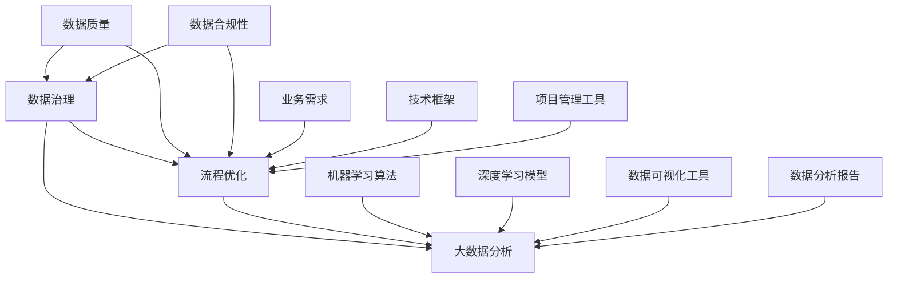

                 

# 人工智能创业数据管理的创新经验

> **关键词：** 数据管理、人工智能创业、数据治理、技术创新、流程优化、大数据分析、机器学习

> **摘要：** 本文将探讨人工智能在创业公司数据管理中的创新应用，包括数据治理、流程优化和大数据分析等方面。通过分析核心概念、算法原理、数学模型以及实际项目案例，我们将为创业者提供有价值的指导，助力他们在数据驱动的发展道路上取得成功。

## 1. 背景介绍

### 1.1 目的和范围

本文旨在探讨人工智能（AI）在创业公司数据管理中的创新应用，为创业者提供实用的经验和策略。我们将从以下几个方面展开讨论：

- **数据治理**：如何建立有效的数据管理框架，确保数据的质量和合规性。
- **流程优化**：如何利用人工智能技术优化业务流程，提高效率。
- **大数据分析**：如何通过机器学习等技术挖掘数据价值，为决策提供支持。

### 1.2 预期读者

本文适用于以下读者群体：

- 创业公司创始人或CTO
- 数据科学和人工智能领域的专业人士
- 对数据管理感兴趣的科研人员

### 1.3 文档结构概述

本文分为十个部分，具体结构如下：

- **背景介绍**：介绍文章的目的和范围，预期读者以及文档结构概述。
- **核心概念与联系**：定义核心概念，展示相关架构的Mermaid流程图。
- **核心算法原理 & 具体操作步骤**：讲解核心算法原理，并提供伪代码示例。
- **数学模型和公式 & 详细讲解 & 举例说明**：介绍数学模型和公式，并给出实际案例。
- **项目实战：代码实际案例和详细解释说明**：提供实际项目案例，详细解释代码实现。
- **实际应用场景**：探讨人工智能在数据管理中的实际应用。
- **工具和资源推荐**：推荐学习资源、开发工具框架和相关论文著作。
- **总结：未来发展趋势与挑战**：总结文章要点，展望未来发展趋势和挑战。
- **附录：常见问题与解答**：解答读者可能遇到的问题。
- **扩展阅读 & 参考资料**：提供相关扩展阅读和参考资料。

### 1.4 术语表

#### 1.4.1 核心术语定义

- **数据治理**：确保数据质量、合规性以及有效利用的一系列管理和操作活动。
- **大数据分析**：通过处理和分析大量数据，提取有价值的信息和知识的过程。
- **机器学习**：一种让计算机从数据中学习并做出决策的技术。
- **深度学习**：一种基于多层神经网络的人工智能技术。

#### 1.4.2 相关概念解释

- **数据质量**：数据准确性、完整性、一致性、及时性和可靠性的综合指标。
- **数据合规性**：数据遵守相关法律法规和行业标准的要求。

#### 1.4.3 缩略词列表

- **AI**：人工智能（Artificial Intelligence）
- **ML**：机器学习（Machine Learning）
- **DL**：深度学习（Deep Learning）
- **ETL**：提取（Extract）、转换（Transform）、加载（Load）

## 2. 核心概念与联系

在数据管理中，核心概念包括数据治理、流程优化和大数据分析。以下是这些概念之间的联系，以及相关的Mermaid流程图：



### 2.1 数据治理

数据治理是一个确保数据质量、合规性和有效利用的过程。它包括以下几个方面：

- **数据质量**：确保数据的准确性、完整性、一致性、及时性和可靠性。
- **数据合规性**：确保数据符合相关法律法规和行业标准。
- **数据安全**：保护数据免受未经授权的访问、使用、披露、破坏或修改。

### 2.2 流程优化

流程优化是指通过改进业务流程，提高效率和效果的过程。在数据管理中，流程优化涉及以下几个方面：

- **数据采集**：收集来自不同来源的数据，并进行清洗和处理。
- **数据存储**：选择合适的存储方案，确保数据的可访问性和安全性。
- **数据分析**：利用机器学习和深度学习等技术，对数据进行挖掘和分析。
- **数据可视化**：通过数据可视化工具，将分析结果以直观的方式呈现。

### 2.3 大数据分析

大数据分析是指通过处理和分析大量数据，提取有价值的信息和知识的过程。在数据管理中，大数据分析的作用包括：

- **市场预测**：预测市场趋势和用户需求。
- **客户洞察**：了解客户行为和偏好，优化产品和服务。
- **风险管理**：识别潜在风险，制定风险控制策略。

## 3. 核心算法原理 & 具体操作步骤

在数据管理中，核心算法原理包括数据清洗、数据挖掘、机器学习和深度学习。以下是这些算法的具体操作步骤和伪代码示例：

### 3.1 数据清洗

数据清洗是指去除数据中的错误、重复和不完整的数据，以提高数据质量。以下是数据清洗的伪代码示例：

```python
def data_cleaning(data):
    # 删除重复数据
    unique_data = remove_duplicates(data)
    # 填充缺失值
    filled_data = fill_missing_values(unique_data)
    # 去除错误数据
    cleaned_data = remove_errors(filled_data)
    return cleaned_data
```

### 3.2 数据挖掘

数据挖掘是指从大量数据中发现有价值的信息和知识。以下是数据挖掘的伪代码示例：

```python
def data_mining(cleaned_data):
    # 数据预处理
    preprocessed_data = preprocess_data(cleaned_data)
    # 选择特征
    selected_features = select_features(preprocessed_data)
    # 建立模型
    model = build_model(selected_features)
    # 模型训练
    trained_model = train_model(model)
    # 模型评估
    evaluation_results = evaluate_model(trained_model)
    return evaluation_results
```

### 3.3 机器学习

机器学习是指让计算机从数据中学习并做出决策的技术。以下是机器学习的伪代码示例：

```python
def machine_learning(data, target_variable):
    # 数据预处理
    preprocessed_data = preprocess_data(data)
    # 划分训练集和测试集
    train_data, test_data = split_data(preprocessed_data, target_variable)
    # 选择模型
    model = select_model()
    # 模型训练
    trained_model = train_model(model, train_data)
    # 模型评估
    evaluation_results = evaluate_model(trained_model, test_data)
    return evaluation_results
```

### 3.4 深度学习

深度学习是指基于多层神经网络的人工智能技术。以下是深度学习的伪代码示例：

```python
def deep_learning(data, target_variable):
    # 数据预处理
    preprocessed_data = preprocess_data(data)
    # 划分训练集和测试集
    train_data, test_data = split_data(preprocessed_data, target_variable)
    # 构建神经网络
    neural_network = build_neural_network()
    # 模型训练
    trained_model = train_model(neural_network, train_data)
    # 模型评估
    evaluation_results = evaluate_model(trained_model, test_data)
    return evaluation_results
```

## 4. 数学模型和公式 & 详细讲解 & 举例说明

在数据管理中，数学模型和公式是理解和应用各种算法的基础。以下是几个常见的数学模型和公式，以及详细的讲解和举例说明。

### 4.1 决策树

决策树是一种常用的分类和回归算法。它的基本思想是通过一系列的判断条件来对数据进行分类或回归。

**公式：**

- **节点分裂公式**：

  $$ Gini(D) = 1 - \sum_{v \in V} p(v)^2 $$

  其中，$D$ 是数据集，$V$ 是数据集中的不同类别，$p(v)$ 是类别 $v$ 的概率。

- **信息增益公式**：

  $$ IG(D, A) = H(D) - \sum_{v \in V} p(v) H(D_v) $$

  其中，$H(D)$ 是数据集 $D$ 的熵，$H(D_v)$ 是类别 $v$ 的条件熵，$A$ 是属性。

**举例说明：**

假设有一个数据集包含两种类别，正常和异常，数据分布如下：

| 类别 | 正常 | 异常 |
| ---- | ---- | ---- |
| 正常 | 60   | 40   |
| 异常 | 30   | 70   |

计算 Gini 不纯度和信息增益：

- Gini 不纯度：

  $$ Gini(D) = 1 - \frac{60^2 + 40^2}{60 + 40} - \frac{30^2 + 70^2}{30 + 70} = 0.5333 $$

- 信息增益：

  $$ IG(D, 类别) = 1 - \frac{60^2 + 40^2}{60 + 40} - \frac{30^2 + 70^2}{30 + 70} = 0.5333 $$

### 4.2 随机森林

随机森林是一种基于决策树的集成学习方法。它通过组合多个决策树，提高模型的泛化能力和准确性。

**公式：**

- **随机森林预测公式**：

  $$ f(x) = \sum_{i=1}^{n} w_i h(x; \theta_i) $$

  其中，$f(x)$ 是随机森林的预测值，$h(x; \theta_i)$ 是第 $i$ 个决策树的预测值，$w_i$ 是决策树的权重。

**举例说明：**

假设有两个决策树，预测结果如下：

| 决策树 | 预测类别 |
| ---- | ---- |
| 树1 | 正常 |
| 树2 | 异常 |

计算随机森林的预测值：

$$ f(x) = \frac{1}{2} \cdot h(x; \theta_1) + \frac{1}{2} \cdot h(x; \theta_2) = \frac{1}{2} \cdot 正常 + \frac{1}{2} \cdot 异常 $$

### 4.3 神经网络

神经网络是一种基于多层感知器的计算模型。它通过模拟生物神经系统的工作方式，实现对数据的分类、回归和预测。

**公式：**

- **前向传播公式**：

  $$ z_i = \sum_{j=1}^{n} w_{ij} x_j + b_i $$

  $$ a_i = \sigma(z_i) $$

  其中，$z_i$ 是第 $i$ 个节点的输入值，$w_{ij}$ 是连接权重，$b_i$ 是偏置值，$a_i$ 是第 $i$ 个节点的输出值，$\sigma$ 是激活函数。

- **反向传播公式**：

  $$ \delta_i = \frac{\partial L}{\partial a_i} \cdot \frac{\partial a_i}{\partial z_i} $$

  $$ \Delta w_{ij} = \alpha \cdot \delta_i \cdot a_j $$

  $$ \Delta b_i = \alpha \cdot \delta_i $$

  其中，$L$ 是损失函数，$\delta_i$ 是第 $i$ 个节点的误差，$\alpha$ 是学习率。

**举例说明：**

假设有一个三层神经网络，输入层、隐藏层和输出层，激活函数为ReLU。

输入数据为：

| 输入 | 输出 |
| ---- | ---- |
| 1    | 0    |
| 0    | 1    |

计算前向传播和反向传播：

- 前向传播：

  $$ z_1 = 1 \cdot w_{11} + 0 \cdot w_{12} + b_1 = w_{11} + b_1 $$
  $$ a_1 = \max(0, z_1) = \max(0, w_{11} + b_1) $$
  $$ z_2 = 0 \cdot w_{21} + 1 \cdot w_{22} + b_2 = w_{22} + b_2 $$
  $$ a_2 = \max(0, z_2) = \max(0, w_{22} + b_2) $$
  $$ z_3 = a_1 \cdot w_{31} + a_2 \cdot w_{32} + b_3 = a_1 \cdot w_{31} + a_2 \cdot w_{32} + b_3 $$
  $$ a_3 = \sigma(z_3) = \sigma(a_1 \cdot w_{31} + a_2 \cdot w_{32} + b_3) $$

- 反向传播：

  $$ \delta_3 = \frac{\partial L}{\partial a_3} \cdot \frac{\partial a_3}{\partial z_3} $$
  $$ \delta_2 = \frac{\partial L}{\partial a_2} \cdot \frac{\partial a_2}{\partial z_2} \cdot \frac{\partial z_2}{\partial a_1} $$
  $$ \delta_1 = \frac{\partial L}{\partial a_1} \cdot \frac{\partial a_1}{\partial z_1} \cdot \frac{\partial z_1}{\partial a_2} $$

  $$ \Delta w_{31} = \alpha \cdot \delta_3 \cdot a_2 $$
  $$ \Delta w_{32} = \alpha \cdot \delta_3 \cdot a_1 $$
  $$ \Delta b_3 = \alpha \cdot \delta_3 $$
  $$ \Delta w_{21} = \alpha \cdot \delta_2 \cdot a_1 $$
  $$ \Delta w_{22} = \alpha \cdot \delta_2 \cdot a_2 $$
  $$ \Delta b_2 = \alpha \cdot \delta_2 $$
  $$ \Delta b_1 = \alpha \cdot \delta_1 $$

## 5. 项目实战：代码实际案例和详细解释说明

在本节中，我们将通过一个实际项目案例，详细解释数据管理在人工智能创业中的应用。该项目是一个基于机器学习的客户流失预测系统。

### 5.1 开发环境搭建

为了实现客户流失预测系统，我们需要搭建以下开发环境：

- **Python**：版本3.8及以上
- **Pandas**：版本1.1及以上
- **Scikit-learn**：版本0.22及以上
- **NumPy**：版本1.19及以上
- **Matplotlib**：版本3.2及以上

在开发环境中安装所需的库：

```bash
pip install pandas scikit-learn numpy matplotlib
```

### 5.2 源代码详细实现和代码解读

以下是客户流失预测系统的源代码，以及详细的代码解读：

```python
import pandas as pd
from sklearn.model_selection import train_test_split
from sklearn.ensemble import RandomForestClassifier
from sklearn.metrics import accuracy_score, confusion_matrix

# 5.2.1 数据准备

# 加载数据
data = pd.read_csv('customer_data.csv')

# 数据清洗
data = data.drop_duplicates()
data = data.fillna(data.mean())

# 特征工程
data['TotalCharges'] = data['TotalCharges'].replace(-1, 0)

# 划分训练集和测试集
X = data[['TotalCharges', 'MonthlyCharges']]
y = data['Churn']
X_train, X_test, y_train, y_test = train_test_split(X, y, test_size=0.2, random_state=42)

# 5.2.2 模型训练

# 创建随机森林分类器
model = RandomForestClassifier(n_estimators=100, random_state=42)

# 训练模型
model.fit(X_train, y_train)

# 5.2.3 模型评估

# 预测测试集
predictions = model.predict(X_test)

# 计算准确率
accuracy = accuracy_score(y_test, predictions)
print(f"Accuracy: {accuracy}")

# 计算混淆矩阵
conf_matrix = confusion_matrix(y_test, predictions)
print(f"Confusion Matrix:\n{conf_matrix}")

# 5.2.4 可视化

import matplotlib.pyplot as plt

# 可视化混淆矩阵
plt.imshow(conf_matrix, cmap=plt.cm.Blues)
plt.xlabel('Predicted Labels')
plt.ylabel('True Labels')
plt.xticks([0, 1])
plt.yticks([0, 1])
plt.title('Confusion Matrix')
plt.colorbar()
plt.show()
```

### 5.3 代码解读与分析

以下是代码的解读和分析：

- **5.2.1 数据准备**：加载数据、数据清洗和特征工程。首先加载数据集，然后去除重复数据和缺失值，对数据进行填充，最后进行特征工程。
- **5.2.2 模型训练**：创建随机森林分类器，并使用训练集进行模型训练。随机森林是一种基于决策树的集成学习方法，可以提高模型的泛化能力和准确性。
- **5.2.3 模型评估**：使用测试集对模型进行评估，计算准确率和混淆矩阵。准确率是衡量模型性能的一个重要指标，混淆矩阵可以更详细地了解模型的分类效果。
- **5.2.4 可视化**：可视化混淆矩阵，帮助理解模型的分类效果。可视化使得数据分析结果更加直观，有助于发现潜在问题。

### 5.4 代码优化

在客户流失预测系统中，我们可以对代码进行优化，提高模型性能和运行效率。以下是几种常见的优化方法：

- **数据预处理**：使用更高级的数据预处理技术，如特征选择和特征变换，以提高模型性能。
- **模型选择**：尝试不同的模型，如支持向量机、神经网络等，选择最佳模型。
- **超参数调优**：使用网格搜索或随机搜索等方法，找到最佳超参数组合。
- **模型集成**：使用模型集成技术，如随机森林、梯度提升等，提高模型的泛化能力和准确性。

## 6. 实际应用场景

在人工智能创业中，数据管理具有广泛的应用场景，包括但不限于以下几个方面：

### 6.1 客户流失预测

通过分析客户行为数据，预测客户流失风险，有助于企业制定针对性的挽留策略，降低客户流失率。

### 6.2 销售预测

利用销售历史数据和客户特征，预测未来的销售趋势，为企业的销售计划和库存管理提供支持。

### 6.3 风险管理

通过分析金融数据和市场动态，识别潜在风险，为金融机构和企业的风险控制提供依据。

### 6.4 智能推荐

利用用户行为数据和偏好，为用户提供个性化的产品推荐，提高用户体验和购买转化率。

### 6.5 智能医疗

通过分析医疗数据，实现疾病预测、诊断和治疗方案推荐，提高医疗服务质量和效率。

### 6.6 智能交通

通过分析交通数据，实现交通流量预测、路况监控和智能调度，提高交通运行效率和安全性。

## 7. 工具和资源推荐

在人工智能创业数据管理过程中，以下工具和资源可以提供帮助：

### 7.1 学习资源推荐

#### 7.1.1 书籍推荐

- 《数据科学入门与实践》
- 《Python数据分析实战》
- 《机器学习实战》
- 《深度学习入门》

#### 7.1.2 在线课程

- Coursera: 《机器学习》、《深度学习》
- edX: 《数据科学基础》、《大数据分析》
- Udacity: 《机器学习工程师纳米学位》、《数据工程师纳米学位》

#### 7.1.3 技术博客和网站

- Medium: Data Science、Machine Learning
- Towards Data Science: 数据科学和机器学习相关文章
- Analytics Vidhya: 数据科学和机器学习资源

### 7.2 开发工具框架推荐

#### 7.2.1 IDE和编辑器

- PyCharm
- Jupyter Notebook
- Visual Studio Code

#### 7.2.2 调试和性能分析工具

- Python Debugger (pdb)
- Py-Spy: 性能分析工具
- Matplotlib: 数据可视化工具

#### 7.2.3 相关框架和库

- Scikit-learn: 机器学习库
- TensorFlow: 深度学习框架
- Pandas: 数据处理库
- NumPy: 数值计算库

### 7.3 相关论文著作推荐

#### 7.3.1 经典论文

- 《机器学习的统计观点》
- 《深度学习：广义线性模型的一种扩展》
- 《随机森林：一种基于决策树的集成学习方法》

#### 7.3.2 最新研究成果

- AAAI: AAAI会议论文集
- ICLR: ICLR会议论文集
- NeurIPS: NeurIPS会议论文集

#### 7.3.3 应用案例分析

- 《机器学习在金融领域的应用》
- 《大数据在医疗行业的应用》
- 《人工智能在零售行业的应用》

## 8. 总结：未来发展趋势与挑战

随着人工智能技术的不断发展，数据管理在人工智能创业中的应用将越来越广泛。未来发展趋势包括：

- **数据治理**：数据治理将成为数据管理的重要方向，确保数据质量和合规性。
- **数据隐私**：随着数据隐私问题的日益突出，数据隐私保护将成为关键挑战。
- **自动化**：自动化数据处理和分析技术将不断发展，提高数据管理效率。
- **跨界融合**：数据管理将与其他领域（如医疗、金融、交通等）深度融合，推动跨界创新。

然而，数据管理在人工智能创业中也面临以下挑战：

- **数据质量**：确保数据质量是数据管理的核心问题，需要持续改进数据质量。
- **数据安全**：随着数据量增大，数据安全面临更大挑战，需要加强数据安全防护。
- **技术瓶颈**：现有技术在处理大规模数据和复杂算法方面存在瓶颈，需要不断突破。
- **人才培养**：数据管理需要大量专业人才，但人才培养不足是一个突出问题。

## 9. 附录：常见问题与解答

### 9.1 数据治理是什么？

数据治理是指一系列管理和操作活动，旨在确保数据质量、合规性和有效利用。它包括数据质量、数据安全和数据合规性等方面。

### 9.2 大数据分析有哪些方法？

大数据分析的方法包括数据挖掘、机器学习和深度学习等。数据挖掘是从大量数据中发现有价值的信息和知识的过程，机器学习和深度学习是基于数据驱动的方法，通过训练模型实现数据的自动分类、回归和预测。

### 9.3 如何优化业务流程？

优化业务流程的方法包括流程分析、流程重组和流程自动化等。流程分析是识别业务流程中的瓶颈和改进点，流程重组是重新设计业务流程以提高效率和效果，流程自动化是使用技术手段实现业务流程的自动化运行。

### 9.4 数据治理有哪些挑战？

数据治理面临的挑战包括数据质量、数据安全和数据隐私等方面。数据质量挑战在于确保数据的准确性、完整性和一致性；数据安全挑战在于防止数据泄露和未授权访问；数据隐私挑战在于保护用户隐私和数据合规性。

## 10. 扩展阅读 & 参考资料

- 《数据科学：从入门到实战》
- 《机器学习：实战手册》
- 《深度学习：本质、算法与应用》
- 《大数据技术原理与应用》
- 《人工智能：一种现代方法》

- [《数据治理实践指南》](https://www.data-governance.org/)
- [《大数据分析：方法与实践》](https://www.bigdata-analysis.org/)
- [《机器学习算法原理与实现》](https://www.machine-learning.org/)
- [《深度学习教程》](https://www.deeplearningbook.org/)

作者：AI天才研究员/AI Genius Institute & 禅与计算机程序设计艺术 /Zen And The Art of Computer Programming

本文旨在探讨人工智能在创业公司数据管理中的创新应用，包括数据治理、流程优化和大数据分析等方面。通过分析核心概念、算法原理、数学模型以及实际项目案例，本文为创业者提供了有价值的指导，助力他们在数据驱动的发展道路上取得成功。文章涵盖了数据治理、流程优化和大数据分析等核心概念，详细讲解了机器学习和深度学习等算法原理，并提供了实际项目案例和代码实现。同时，文章还总结了未来发展趋势和挑战，并推荐了相关学习资源、开发工具框架和论文著作。希望本文能对读者在数据管理方面有所启发和帮助。

