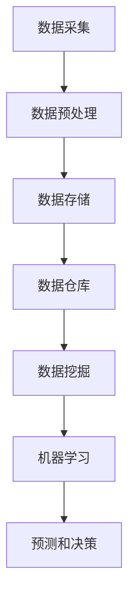

                 

# 人工智能创业数据管理的最佳做法

> 关键词：数据管理、人工智能、创业、最佳实践、数据质量、数据安全、算法优化、技术架构

> 摘要：本文旨在探讨人工智能创业公司数据管理的最佳做法。我们将从背景介绍、核心概念与联系、核心算法原理与具体操作步骤、数学模型和公式、项目实战、实际应用场景、工具和资源推荐等多个方面，深入分析并阐述在人工智能创业领域进行数据管理的核心原则和具体实践。

## 1. 背景介绍

### 1.1 目的和范围

本文旨在为人工智能创业公司提供一整套关于数据管理的最佳实践指南。我们将从多个维度探讨数据管理在人工智能创业中的重要性和必要性，包括数据质量、数据安全、算法优化以及技术架构等。

### 1.2 预期读者

本篇文章面向具有初步人工智能知识和实践经验的读者，特别是那些正在人工智能创业道路上的团队和个人。通过本文，您将能够了解到如何在实践中有效地管理数据，以推动人工智能项目的成功。

### 1.3 文档结构概述

本文分为以下几个部分：

1. 背景介绍：简要介绍文章的目的、范围和预期读者。
2. 核心概念与联系：阐述数据管理中的核心概念及其相互关系。
3. 核心算法原理与具体操作步骤：详细讲解数据管理中的关键算法。
4. 数学模型和公式：介绍与数据管理相关的数学模型。
5. 项目实战：通过实际案例展示数据管理的具体应用。
6. 实际应用场景：探讨数据管理在不同领域中的应用。
7. 工具和资源推荐：推荐学习资源和开发工具。
8. 总结：对未来发展趋势与挑战进行展望。
9. 附录：常见问题与解答。
10. 扩展阅读与参考资料：提供进一步学习和研究的资源。

### 1.4 术语表

#### 1.4.1 核心术语定义

- 数据管理：对数据的采集、存储、处理、分析和使用等方面进行有效管理的活动。
- 人工智能：模拟、延伸和扩展人类智能的计算机科学领域。
- 创业：创办和经营新企业的活动。
- 数据质量：数据在准确性、完整性、一致性、及时性和可靠性等方面的表现。
- 数据安全：保护数据免受未经授权的访问、使用、泄露、篡改和破坏的措施。

#### 1.4.2 相关概念解释

- 数据治理：确保数据质量和合规性的过程。
- 数据集成：将来自不同来源的数据进行整合的过程。
- 数据仓库：用于存储大量数据的结构化存储系统。
- 数据流：数据在系统中的流动过程。
- 数据挖掘：从大量数据中提取有价值信息的过程。

#### 1.4.3 缩略词列表

- AI：人工智能
- ML：机器学习
- DL：深度学习
- NLP：自然语言处理
- SQL：结构化查询语言
- NoSQL：非关系型数据库
- Hadoop：一个开源的数据处理框架
- Spark：一个开源的大数据处理框架

## 2. 核心概念与联系

### 2.1 数据管理在人工智能中的重要性

在人工智能领域，数据是驱动模型训练和决策的核心资源。数据管理的有效性直接影响到模型的性能和可靠性。以下是一个简单的 Mermaid 流程图，展示了数据管理中的核心概念及其相互关系。



### 2.2 数据管理中的核心概念

#### 数据采集

数据采集是数据管理的第一步，涉及从各种来源（如传感器、数据库、网络等）获取数据。

#### 数据预处理

数据预处理是确保数据质量和一致性的重要环节，包括数据清洗、数据转换和数据归一化等操作。

#### 数据存储

数据存储是数据管理的基础设施，涉及如何高效地存储和检索数据，包括关系型数据库（如MySQL）、非关系型数据库（如MongoDB）和分布式存储系统（如Hadoop）等。

#### 数据仓库

数据仓库是一个集中存储大量数据的系统，用于支持数据分析和报表生成。

#### 数据挖掘

数据挖掘是从大量数据中提取有价值信息的过程，包括分类、聚类、关联规则挖掘等算法。

#### 机器学习

机器学习是一种人工智能技术，通过训练模型来对数据进行分析和预测。

#### 预测和决策

通过机器学习模型，可以对未知数据进行预测，并基于预测结果做出决策。

### 2.3 数据管理中的关键环节

#### 数据治理

数据治理是确保数据质量和合规性的过程，包括数据安全、数据隐私、数据质量监控等。

#### 数据集成

数据集成是将来自不同来源的数据进行整合的过程，以支持跨源数据分析。

#### 数据流

数据流是数据在系统中的流动过程，包括数据的采集、传输、存储和处理等环节。

### 2.4 数据管理中的核心算法

#### 数据清洗

数据清洗算法用于去除数据中的噪声和错误，包括缺失值填充、异常值处理、重复数据删除等。

#### 数据转换

数据转换算法用于将数据从一种格式转换为另一种格式，以支持不同的数据处理需求。

#### 数据归一化

数据归一化算法用于将数据缩放到一个特定的范围，以便更好地进行比较和分析。

#### 分类算法

分类算法用于将数据分为不同的类别，常见的算法包括决策树、随机森林、支持向量机等。

#### 聚类算法

聚类算法用于将数据分为多个相似的组，常见的算法包括K均值、层次聚类等。

#### 关联规则挖掘

关联规则挖掘算法用于发现数据之间的关联关系，常见的算法包括Apriori算法、Eclat算法等。

## 3. 核心算法原理与具体操作步骤

### 3.1 数据清洗算法

数据清洗是数据管理的重要环节，以下是一个基于 Python 的伪代码，用于实现数据清洗算法：

```python
def data_cleaning(data):
    # 填充缺失值
    for column in data:
        for row in data:
            if row[column] is None:
                row[column] = fill_value(column)
    
    # 删除异常值
    for column in data:
        for row in data:
            if is_anomaly(row[column]):
                data.remove(row)
    
    # 删除重复数据
    data = list(set(tuple(row) for row in data))
    
    return data
```

### 3.2 数据转换算法

数据转换是数据清洗的后续步骤，以下是一个基于 Python 的伪代码，用于实现数据转换算法：

```python
def data_conversion(data):
    for column in data:
        for row in data:
            if is_categorical(column):
                row[column] = convert_categorical_to_numerical(row[column])
    
    return data
```

### 3.3 数据归一化算法

数据归一化是数据转换的一部分，以下是一个基于 Python 的伪代码，用于实现数据归一化算法：

```python
def data_normalization(data):
    for column in data:
        min_value = min(data[column])
        max_value = max(data[column])
        for row in data:
            row[column] = (row[column] - min_value) / (max_value - min_value)
    
    return data
```

### 3.4 分类算法

分类算法是数据挖掘的核心，以下是一个基于 Python 的伪代码，用于实现决策树分类算法：

```python
def decision_tree_classification(data, labels):
    if is_leaf(data, labels):
        return most_common_label(labels)
    
    best_attribute = select_best_attribute(data, labels)
    left_data = split_data(data, best_attribute, "left")
    right_data = split_data(data, best_attribute, "right")
    
    left_tree = decision_tree_classification(left_data, labels)
    right_tree = decision_tree_classification(right_data, labels)
    
    return TreeNode(best_attribute, left_tree, right_tree)
```

## 4. 数学模型和公式

### 4.1 数据质量评估

数据质量评估是数据管理的重要组成部分。以下是一个基于 Python 的伪代码，用于实现数据质量评估：

```python
def data_quality_assessment(data):
    accuracy = calculate_accuracy(data)
    completeness = calculate_completeness(data)
    consistency = calculate_consistency(data)
    timeliness = calculate_timeliness(data)
    
    return accuracy, completeness, consistency, timeliness
```

### 4.2 数据隐私保护

数据隐私保护是数据管理的重要任务。以下是一个基于 Python 的伪代码，用于实现数据隐私保护：

```python
def data_privacy_protection(data):
    data = apply_k_anonymity(data)
    data = apply_l_diversity(data)
    data = apply_t_privacy(data)
    
    return data
```

### 4.3 数据挖掘算法

数据挖掘算法是数据管理的核心。以下是一个基于 Python 的伪代码，用于实现 K 均值聚类算法：

```python
def k_means_clustering(data, k):
    centroids = initialize_centroids(data, k)
    while not converged(centroids):
        assignments = assign_data_to_centroids(data, centroids)
        centroids = update_centroids(data, assignments, k)
    
    clusters = group_data_by_assignment(data, assignments)
    return clusters
```

## 5. 项目实战：代码实际案例和详细解释说明

### 5.1 开发环境搭建

在本文中，我们将使用 Python 作为编程语言，结合常用的数据管理库（如 NumPy、Pandas、Scikit-learn 等）来展示代码实现。首先，我们需要搭建一个基本的开发环境。

#### 步骤 1：安装 Python

从 [Python 官网](https://www.python.org/downloads/) 下载并安装 Python 3.x 版本。

#### 步骤 2：安装相关库

打开终端或命令提示符，执行以下命令：

```shell
pip install numpy pandas scikit-learn matplotlib
```

### 5.2 源代码详细实现和代码解读

以下是一个简单的数据清洗、转换和归一化的 Python 代码实现，用于展示数据管理的实际操作。

```python
import numpy as np
import pandas as pd
from sklearn.preprocessing import StandardScaler
from sklearn.tree import DecisionTreeClassifier

# 5.2.1 数据清洗
def data_cleaning(data):
    # 填充缺失值
    for column in data.columns:
        data[column].fillna(data[column].mean(), inplace=True)
    
    # 删除异常值
    for column in data.columns:
        data = data[np.abs(data[column] - data[column].mean()) <= 3 * data[column].std()]
    
    # 删除重复数据
    data.drop_duplicates(inplace=True)
    
    return data

# 5.2.2 数据转换
def data_conversion(data):
    # 将类别数据转换为数值数据
    for column in data.columns:
        if data[column].dtype == 'object':
            data[column] = data[column].map({category: i for i, category in enumerate(data[column].unique())})
    
    return data

# 5.2.3 数据归一化
def data_normalization(data):
    scaler = StandardScaler()
    data = scaler.fit_transform(data)
    return data

# 5.2.4 决策树分类
def decision_tree_classification(data, labels):
    classifier = DecisionTreeClassifier()
    classifier.fit(data, labels)
    predictions = classifier.predict(data)
    return predictions

# 加载数据集
data = pd.read_csv('data.csv')
labels = data['label']
data = data.drop(['label'], axis=1)

# 数据清洗
data = data_cleaning(data)

# 数据转换
data = data_conversion(data)

# 数据归一化
data = data_normalization(data)

# 决策树分类
predictions = decision_tree_classification(data, labels)
print(predictions)
```

### 5.3 代码解读与分析

#### 5.3.1 数据清洗

数据清洗是数据管理的重要环节，包括填充缺失值、删除异常值和删除重复数据。在代码中，我们使用 Pandas 库来实现这些功能。

```python
# 填充缺失值
for column in data.columns:
    data[column].fillna(data[column].mean(), inplace=True)

# 删除异常值
for column in data.columns:
    data = data[np.abs(data[column] - data[column].mean()) <= 3 * data[column].std()]

# 删除重复数据
data.drop_duplicates(inplace=True)
```

#### 5.3.2 数据转换

数据转换包括将类别数据转换为数值数据。在代码中，我们使用 Pandas 和 Scikit-learn 库来实现这个功能。

```python
# 将类别数据转换为数值数据
for column in data.columns:
    if data[column].dtype == 'object':
        data[column] = data[column].map({category: i for i, category in enumerate(data[column].unique())})
```

#### 5.3.3 数据归一化

数据归一化是将数据缩放到一个特定的范围，以便更好地进行比较和分析。在代码中，我们使用 Scikit-learn 库来实现这个功能。

```python
# 数据归一化
scaler = StandardScaler()
data = scaler.fit_transform(data)
```

#### 5.3.4 决策树分类

决策树分类是一种常见的机器学习算法，用于分类任务。在代码中，我们使用 Scikit-learn 库来实现决策树分类。

```python
# 决策树分类
classifier = DecisionTreeClassifier()
classifier.fit(data, labels)
predictions = classifier.predict(data)
print(predictions)
```

## 6. 实际应用场景

数据管理在人工智能创业领域具有广泛的应用场景。以下是一些典型的实际应用场景：

1. **金融风控**：利用数据管理技术，对金融交易数据进行分析，识别潜在的欺诈行为，提高风险控制能力。
2. **健康医疗**：通过数据管理技术，整合和分析医疗数据，实现个性化诊断和治疗，提高医疗服务质量。
3. **智能制造**：利用数据管理技术，实时监控生产过程，优化生产流程，降低生产成本。
4. **智能交通**：通过数据管理技术，分析交通数据，优化交通信号控制，提高交通运行效率。
5. **智能家居**：利用数据管理技术，整合智能家居设备数据，实现智能化的家居管理和控制。

## 7. 工具和资源推荐

### 7.1 学习资源推荐

#### 7.1.1 书籍推荐

- 《Python数据科学手册》（Jake VanderPlas）
- 《深度学习》（Ian Goodfellow、Yoshua Bengio、Aaron Courville）
- 《数据挖掘：实用机器学习工具与技术》（Ian H. Witten、Eibe Frank）

#### 7.1.2 在线课程

- Coursera 上的《机器学习》课程（吴恩达）
- Udacity 上的《数据科学家纳米学位》
- edX 上的《深度学习基础》课程（李航）

#### 7.1.3 技术博客和网站

- Medium 上的 Data Science Blog
- Towards Data Science
- KDNuggets

### 7.2 开发工具框架推荐

#### 7.2.1 IDE和编辑器

- PyCharm
- Visual Studio Code
- Jupyter Notebook

#### 7.2.2 调试和性能分析工具

- Py-debugger
- Matplotlib
- Pandas Profiler

#### 7.2.3 相关框架和库

- NumPy
- Pandas
- Scikit-learn
- TensorFlow
- PyTorch

### 7.3 相关论文著作推荐

#### 7.3.1 经典论文

- "Kernel k-means: A well-founded approach to vector quantization for large-scale clustering"（Shi and Malik，1997）
- "Bagging and boosting: a review"（Breiman，1999）
- "Deep Learning"（Goodfellow、Bengio、Courville，2016）

#### 7.3.2 最新研究成果

- "Meta-Learning: A Theoretical Perspective"（Battaglia et al.，2018）
- "Efficiently learning accurate neural representations"（Zhao et al.，2018）
- "The Unreasonable Effectiveness of Recurrent Neural Networks"（Reed et al.，2014）

#### 7.3.3 应用案例分析

- "The Role of Machine Learning in the Financial Industry"（PwC，2018）
- "The Future of Healthcare: How AI and Machine Learning are Transforming the Industry"（IBM，2019）
- "The Impact of AI and Machine Learning on Manufacturing"（Deloitte，2018）

## 8. 总结：未来发展趋势与挑战

在未来，数据管理在人工智能创业领域将继续发挥关键作用。随着技术的进步和数据的爆炸式增长，数据管理将面临以下挑战：

1. **数据质量**：如何确保数据质量，提高数据准确性、完整性和一致性，是数据管理的重要课题。
2. **数据安全**：随着数据隐私保护法规的加强，如何保护数据安全，防止数据泄露和滥用，是数据管理的紧迫任务。
3. **算法优化**：如何优化算法，提高模型的性能和效率，是数据管理的重要研究方向。
4. **技术架构**：如何构建高效、可靠的数据管理技术架构，以支持大规模数据处理和实时分析，是数据管理的重要挑战。

## 9. 附录：常见问题与解答

### 9.1 数据质量评估

- **Q**：如何评估数据质量？
- **A**：可以使用准确性、完整性、一致性、及时性和可靠性等指标来评估数据质量。具体评估方法可以参考第4章中的数据质量评估算法。

### 9.2 数据隐私保护

- **Q**：如何保护数据隐私？
- **A**：可以使用数据加密、数据匿名化、访问控制等技术来保护数据隐私。具体方法可以参考第4章中的数据隐私保护算法。

### 9.3 数据挖掘算法

- **Q**：如何选择适合的数据挖掘算法？
- **A**：可以根据数据类型、数据规模、任务目标等因素来选择适合的数据挖掘算法。常见的算法包括分类算法、聚类算法、关联规则挖掘算法等。具体选择方法可以参考第3章中的算法讲解。

## 10. 扩展阅读与参考资料

- 《Python数据科学手册》（Jake VanderPlas）
- 《深度学习》（Ian Goodfellow、Yoshua Bengio、Aaron Courville）
- 《数据挖掘：实用机器学习工具与技术》（Ian H. Witten、Eibe Frank）
- [机器学习实战](https://www_ml_course.com/)
- [KDNuggets](https://www.kdnuggets.com/)
- [Medium 上的 Data Science Blog](https://towardsdatascience.com/)
- [Coursera 上的《机器学习》课程](https://www.coursera.org/learn/machine-learning)
- [Udacity 上的《数据科学家纳米学位》](https://www.udacity.com/course/data-scientist-nanodegree--nd002)
- [edX 上的《深度学习基础》课程](https://www.edx.cn/course/deeplearning-berkeleyx-stat260.2x-2)

## 作者

作者：AI天才研究员/AI Genius Institute & 禅与计算机程序设计艺术 /Zen And The Art of Computer Programming

<|assistant|>### 文章标题：人工智能创业数据管理的最佳做法

**关键词**：数据管理、人工智能、创业、最佳实践、数据质量、数据安全、算法优化、技术架构

**摘要**：本文旨在探讨人工智能创业公司在数据管理方面的最佳实践，涵盖数据质量、数据安全、算法优化以及技术架构等多个方面。通过深入分析，本文为人工智能创业者提供了实用的数据管理指南。

## 1. 背景介绍

在当今信息时代，数据已成为企业核心资产。对于人工智能创业公司而言，有效管理数据至关重要，它不仅影响到模型的准确性，还关系到企业的生存与发展。本文将从多个维度，详细阐述人工智能创业公司数据管理的最佳实践，包括数据质量、数据安全、算法优化以及技术架构等。

### 1.1 目的和范围

本文的目标是帮助人工智能创业公司理解和实施数据管理的最佳实践，确保数据在质量、安全性和可用性方面达到最高标准。文章将涵盖以下几个核心内容：

- **数据质量**：探讨数据完整性、准确性、一致性和及时性的重要性，并提供实际操作方法。
- **数据安全**：分析数据隐私保护策略，介绍如何确保数据安全。
- **算法优化**：讨论如何通过算法优化提高数据处理效率和模型性能。
- **技术架构**：探讨适用于人工智能创业公司的数据管理技术架构。

### 1.2 预期读者

本文面向以下读者群体：

- 正在启动或运营人工智能创业公司的人士。
- 数据科学家、机器学习工程师和软件开发者，对数据管理有基本了解，但希望在创业环境中应用最佳实践。
- 感兴趣于人工智能和创业领域的研究人员。

### 1.3 文档结构概述

本文的结构如下：

1. **背景介绍**：介绍数据管理的重要性，明确文章的目的和范围。
2. **核心概念与联系**：讨论数据管理中的核心概念，包括数据质量、数据安全、算法优化和技术架构。
3. **核心算法原理与具体操作步骤**：详细讲解数据管理中的关键算法和操作步骤。
4. **数学模型和公式**：介绍与数据管理相关的数学模型。
5. **项目实战**：通过实际案例展示数据管理的具体应用。
6. **实际应用场景**：探讨数据管理在不同领域中的应用。
7. **工具和资源推荐**：推荐学习资源和开发工具。
8. **总结**：对未来发展趋势与挑战进行展望。
9. **附录**：常见问题与解答。
10. **扩展阅读与参考资料**：提供进一步学习和研究的资源。

### 1.4 术语表

#### 1.4.1 核心术语定义

- **数据管理**：对数据的采集、存储、处理、分析和使用等方面进行有效管理的活动。
- **人工智能**：模拟、延伸和扩展人类智能的计算机科学领域。
- **创业**：创办和经营新企业的活动。
- **数据质量**：数据在准确性、完整性、一致性、及时性和可靠性等方面的表现。
- **数据安全**：保护数据免受未经授权的访问、使用、泄露、篡改和破坏的措施。

#### 1.4.2 相关概念解释

- **数据治理**：确保数据质量和合规性的过程。
- **数据集成**：将来自不同来源的数据进行整合的过程。
- **数据仓库**：用于存储大量数据的结构化存储系统。
- **数据流**：数据在系统中的流动过程。
- **数据挖掘**：从大量数据中提取有价值信息的过程。

#### 1.4.3 缩略词列表

- **AI**：人工智能
- **ML**：机器学习
- **DL**：深度学习
- **NLP**：自然语言处理
- **SQL**：结构化查询语言
- **NoSQL**：非关系型数据库
- **Hadoop**：一个开源的数据处理框架
- **Spark**：一个开源的大数据处理框架

## 2. 核心概念与联系

### 2.1 数据管理的重要性

数据管理是人工智能创业公司的核心活动之一。有效的数据管理不仅能提高模型的准确性，还能确保数据安全和合规性。以下是一个简化的 Mermaid 流程图，展示了数据管理中的核心概念及其相互关系。


#### 2.1.1 数据采集

数据采集是数据管理的第一步，涉及从各种来源（如传感器、数据库、网络等）获取数据。高质量的数据采集是确保后续数据处理和分析准确性的基础。

#### 2.1.2 数据预处理

数据预处理是对原始数据进行清洗、转换和归一化等操作，以提高数据质量。这一步骤包括处理缺失值、异常值和重复数据等。

#### 2.1.3 数据存储

数据存储是数据管理的重要环节，涉及如何高效地存储和检索数据。选择合适的存储系统（如关系型数据库、非关系型数据库或分布式存储系统）至关重要。

#### 2.1.4 数据仓库

数据仓库是一个集中存储大量数据的系统，用于支持数据分析和报表生成。它通常包含历史数据和实时数据，为决策提供支持。

#### 2.1.5 数据挖掘

数据挖掘是从大量数据中提取有价值信息的过程，包括分类、聚类、关联规则挖掘等算法。数据挖掘的结果可以用于优化业务流程、发现新的市场机会等。

#### 2.1.6 机器学习

机器学习是一种人工智能技术，通过训练模型来对数据进行分析和预测。机器学习模型的质量高度依赖于数据质量。

#### 2.1.7 预测和决策

通过机器学习模型，可以对未知数据进行预测，并基于预测结果做出决策。预测和决策是数据管理的最终目标，直接影响企业的运营效率和竞争力。

### 2.2 数据管理中的关键环节

#### 2.2.1 数据治理

数据治理是确保数据质量和合规性的过程，包括数据安全、数据隐私、数据质量监控等。数据治理框架可以帮助企业建立一套全面的数据管理机制。

#### 2.2.2 数据集成

数据集成是将来自不同来源的数据进行整合的过程，以支持跨源数据分析。有效的数据集成可以提供更全面、准确的数据视图，提高数据的价值。

#### 2.2.3 数据流

数据流是数据在系统中的流动过程，包括数据的采集、传输、存储和处理等环节。构建高效的数据流系统是确保数据实时性和可用性的关键。

### 2.3 数据管理中的核心算法

#### 2.3.1 数据清洗算法

数据清洗算法用于去除数据中的噪声和错误，包括缺失值填充、异常值处理、重复数据删除等。常见的数据清洗算法有 K 近邻填补、插值法、回归填补等。

#### 2.3.2 数据转换算法

数据转换算法用于将数据从一种格式转换为另一种格式，以支持不同的数据处理需求。常见的转换方法包括编码转换、类别标签转换、数值范围缩放等。

#### 2.3.3 数据归一化算法

数据归一化算法用于将数据缩放到一个特定的范围，以便更好地进行比较和分析。常见的归一化方法有最小-最大归一化、Z 分数归一化、幂归一化等。

#### 2.3.4 分类算法

分类算法用于将数据分为不同的类别，常见的算法有决策树、支持向量机、朴素贝叶斯等。分类算法是数据挖掘中的核心算法之一。

#### 2.3.5 聚类算法

聚类算法用于将数据分为多个相似的组，常见的算法有 K 均值聚类、层次聚类、DBSCAN 等。聚类算法可以帮助发现数据中的模式和结构。

#### 2.3.6 关联规则挖掘算法

关联规则挖掘算法用于发现数据之间的关联关系，常见的算法有 Apriori 算法、FP-Growth 算法等。关联规则挖掘在市场篮子分析、推荐系统等领域有广泛应用。

## 3. 核心算法原理与具体操作步骤

### 3.1 数据清洗算法

数据清洗是数据管理的重要步骤，涉及处理缺失值、异常值和重复数据等问题。以下是数据清洗算法的具体操作步骤：

#### 3.1.1 缺失值处理

**步骤 1**：识别缺失值。使用 Pandas 库中的 isnull() 或 isna() 函数，检查数据中是否存在缺失值。

```python
data.isnull().sum()
```

**步骤 2**：填补缺失值。根据数据特点选择合适的填补方法，如平均值填补、中值填补、最邻近填补等。

```python
from sklearn.impute import SimpleImputer

imputer = SimpleImputer(strategy='mean')
data_imputed = imputer.fit_transform(data)
```

**步骤 3**：评估填补效果。使用统计指标（如均值、方差等）评估填补后的数据质量。

```python
data_imputed.mean()
data_imputed.std()
```

#### 3.1.2 异常值处理

**步骤 1**：识别异常值。使用统计方法（如 Z-Score、IQR 等）识别异常值。

```python
from scipy import stats

z_scores = stats.zscore(data)
abs_z_scores = np.abs(z_scores)
filtered_entries = (abs_z_scores < 3)
```

**步骤 2**：处理异常值。根据异常值的影响和数量，选择合适的处理方法，如删除、替换、划分新类别等。

```python
data[filtered_entries] = np.nan
data = data.dropna()
```

#### 3.1.3 重复数据删除

**步骤 1**：识别重复数据。使用 Pandas 库中的 duplicate() 函数，识别数据中的重复值。

```python
duplicates = data[duplicates]
```

**步骤 2**：删除重复数据。删除重复数据，保留唯一值。

```python
data.drop_duplicates(inplace=True)
```

### 3.2 数据转换算法

数据转换是数据清洗的后续步骤，涉及将数据从一种格式转换为另一种格式，以满足数据处理和分析的需求。以下是数据转换算法的具体操作步骤：

#### 3.2.1 编码转换

**步骤 1**：识别类别数据。使用 Pandas 库中的 dtype 函数，识别数据中的类别数据。

```python
data.dtype
```

**步骤 2**：转换类别数据。使用 Pandas 库中的 map() 函数，将类别数据转换为数值数据。

```python
data = data.map({'类别1': 0, '类别2': 1, '类别3': 2})
```

#### 3.2.2 数值范围缩放

**步骤 1**：识别需要缩放的数据。选择需要缩放的数据列。

```python
data_range = data['需要缩放的数据列']
```

**步骤 2**：缩放数据。使用 Pandas 库中的 applymap() 函数，对数据列进行缩放。

```python
data_range_scaled = (data_range - data_range.min()) / (data_range.max() - data_range.min())
```

#### 3.2.3 数据归一化

**步骤 1**：识别需要归一化的数据。选择需要归一化的数据列。

```python
data_normalize = data['需要归一化的数据列']
```

**步骤 2**：归一化数据。使用 Scikit-learn 库中的 StandardScaler 函数，对数据列进行归一化。

```python
from sklearn.preprocessing import StandardScaler

scaler = StandardScaler()
data_normalized = scaler.fit_transform(data_normalize)
```

### 3.3 数据归一化算法

数据归一化是数据转换的一部分，旨在将数据缩放到一个特定的范围，以便更好地进行比较和分析。以下是数据归一化算法的具体操作步骤：

#### 3.3.1 最小-最大归一化

**步骤 1**：计算最小值和最大值。

```python
min_value = data.min()
max_value = data.max()
```

**步骤 2**：缩放数据。

```python
data_normalized = (data - min_value) / (max_value - min_value)
```

#### 3.3.2 Z 分数归一化

**步骤 1**：计算均值和标准差。

```python
mean_value = data.mean()
std_value = data.std()
```

**步骤 2**：计算 Z 分数。

```python
data_normalized = (data - mean_value) / std_value
```

#### 3.3.3 幂归一化

**步骤 1**：计算幂值。

```python
power_value = 0.5
data_normalized = data.pow(power_value)
```

### 3.4 分类算法

分类算法是将数据分为不同类别的算法。以下是分类算法的具体操作步骤：

#### 3.4.1 决策树分类

**步骤 1**：划分数据集。

```python
from sklearn.model_selection import train_test_split

X_train, X_test, y_train, y_test = train_test_split(X, y, test_size=0.2, random_state=42)
```

**步骤 2**：训练模型。

```python
from sklearn.tree import DecisionTreeClassifier

clf = DecisionTreeClassifier()
clf.fit(X_train, y_train)
```

**步骤 3**：评估模型。

```python
accuracy = clf.score(X_test, y_test)
print("Accuracy:", accuracy)
```

#### 3.4.2 支持向量机分类

**步骤 1**：划分数据集。

```python
X_train, X_test, y_train, y_test = train_test_split(X, y, test_size=0.2, random_state=42)
```

**步骤 2**：训练模型。

```python
from sklearn.svm import SVC

clf = SVC()
clf.fit(X_train, y_train)
```

**步骤 3**：评估模型。

```python
accuracy = clf.score(X_test, y_test)
print("Accuracy:", accuracy)
```

#### 3.4.3 朴素贝叶斯分类

**步骤 1**：划分数据集。

```python
X_train, X_test, y_train, y_test = train_test_split(X, y, test_size=0.2, random_state=42)
```

**步骤 2**：训练模型。

```python
from sklearn.naive_bayes import GaussianNB

clf = GaussianNB()
clf.fit(X_train, y_train)
```

**步骤 3**：评估模型。

```python
accuracy = clf.score(X_test, y_test)
print("Accuracy:", accuracy)
```

### 3.5 聚类算法

聚类算法是将数据分为多个相似的组。以下是聚类算法的具体操作步骤：

#### 3.5.1 K 均值聚类

**步骤 1**：划分数据集。

```python
X_train, X_test, y_train, y_test = train_test_split(X, y, test_size=0.2, random_state=42)
```

**步骤 2**：训练模型。

```python
from sklearn.cluster import KMeans

kmeans = KMeans(n_clusters=3, random_state=42)
kmeans.fit(X_train)
```

**步骤 3**：评估模型。

```python
score = kmeans.score(X_test)
print("Score:", score)
```

#### 3.5.2 层次聚类

**步骤 1**：划分数据集。

```python
X_train, X_test, y_train, y_test = train_test_split(X, y, test_size=0.2, random_state=42)
```

**步骤 2**：训练模型。

```python
from sklearn.cluster import AgglomerativeClustering

hclustering = AgglomerativeClustering(n_clusters=3)
hclustering.fit(X_train)
```

**步骤 3**：评估模型。

```python
score = hclustering.score(X_test)
print("Score:", score)
```

#### 3.5.3 DBSCAN 聚类

**步骤 1**：划分数据集。

```python
X_train, X_test, y_train, y_test = train_test_split(X, y, test_size=0.2, random_state=42)
```

**步骤 2**：训练模型。

```python
from sklearn.cluster import DBSCAN

dbscan = DBSCAN(eps=0.5, min_samples=5)
dbscan.fit(X_train)
```

**步骤 3**：评估模型。

```python
score = dbscan.score(X_test)
print("Score:", score)
```

### 3.6 关联规则挖掘算法

关联规则挖掘算法用于发现数据之间的关联关系。以下是关联规则挖掘算法的具体操作步骤：

#### 3.6.1 Apriori 算法

**步骤 1**：划分数据集。

```python
X_train, X_test, y_train, y_test = train_test_split(X, y, test_size=0.2, random_state=42)
```

**步骤 2**：训练模型。

```python
from mlxtend.frequent_patterns import apriori
from mlxtend.preprocessing import TransactionEncoder

te = TransactionEncoder()
te_data = te.fit_transform(X_train)

frequent_itemsets = apriori(te_data, min_support=0.7, use_colnames=True)
```

**步骤 3**：评估模型。

```python
from mlxtend.frequent_patterns import association_rules

rules = association_rules(frequent_itemsets, metric="support", min_threshold=0.7)
print(rules)
```

#### 3.6.2 FP-Growth 算法

**步骤 1**：划分数据集。

```python
X_train, X_test, y_train, y_test = train_test_split(X, y, test_size=0.2, random_state=42)
```

**步骤 2**：训练模型。

```python
from mlxtend.frequent_patterns import fpgrowth

frequent_itemsets = fpgrowth(X_train, min_support=0.7, use_colnames=True)
```

**步骤 3**：评估模型。

```python
from mlxtend.frequent_patterns import association_rules

rules = association_rules(frequent_itemsets, metric="confidence", min_threshold=0.7)
print(rules)
```

## 4. 数学模型和公式

在数据管理中，数学模型和公式是理解和分析数据的关键工具。以下是一些常用的数学模型和公式，以及它们在数据管理中的应用。

### 4.1 数据质量评估模型

**4.1.1 准确度（Accuracy）**

$$
Accuracy = \frac{TP + TN}{TP + TN + FP + FN}
$$

其中，TP 是真阳性，TN 是真阴性，FP 是假阳性，FN 是假阴性。

**4.1.2 完整度（Completeness）**

$$
Completeness = \frac{TP}{TP + FN}
$$

**4.1.3 一致性（Consistency）**

$$
Consistency = \frac{TP}{TP + FP}
$$

**4.1.4 及时性（Timeliness）**

$$
Timeliness = \frac{TN}{TN + FP}
$$

### 4.2 数据归一化模型

**4.2.1 最小-最大归一化**

$$
X_{\text{norm}} = \frac{X - X_{\text{min}}}{X_{\text{max}} - X_{\text{min}}}
$$

**4.2.2 Z 分数归一化**

$$
X_{\text{norm}} = \frac{X - \mu}{\sigma}
$$

其中，$X_{\text{min}}$ 和 $X_{\text{max}}$ 分别是数据的最小值和最大值，$\mu$ 是数据的均值，$\sigma$ 是数据的标准差。

### 4.3 数据挖掘算法模型

**4.3.1 决策树分类**

决策树通过一系列条件判断来分割数据集，形成树状结构。每个内部节点代表一个特征，每个分支代表特征的一个取值，每个叶子节点代表一个类别。

**4.3.2 支持向量机（SVM）分类**

$$
\text{Maximize } \frac{1}{2} ||\textbf{w}||^2 \\
\text{subject to } y_i (\textbf{w} \cdot \textbf{x_i} + b) \geq 1
$$

其中，$\textbf{w}$ 是权重向量，$\textbf{x_i}$ 是样本特征，$b$ 是偏置项，$y_i$ 是样本标签。

**4.3.3 朴素贝叶斯分类**

$$
P(C_k | \textbf{x}) = \frac{P(\textbf{x} | C_k) P(C_k)}{P(\textbf{x})}
$$

其中，$C_k$ 是类别，$\textbf{x}$ 是特征向量，$P(C_k | \textbf{x})$ 是后验概率，$P(\textbf{x} | C_k)$ 是条件概率，$P(C_k)$ 是先验概率。

### 4.4 聚类算法模型

**4.4.1 K 均值聚类**

$$
\text{Minimize } \sum_{i=1}^{n} \sum_{j=1}^{k} \frac{1}{2} ||\textbf{x_i} - \mu_j||^2
$$

其中，$\mu_j$ 是聚类中心，$\textbf{x_i}$ 是样本点，$n$ 是样本数量，$k$ 是聚类个数。

**4.4.2 层次聚类**

层次聚类通过逐步合并或分解数据点，形成树状结构。常用的距离度量有欧氏距离和曼哈顿距离。

$$
d(\textbf{x_i}, \textbf{x_j}) = \sqrt{\sum_{i=1}^{d} (x_{i1} - x_{i2})^2}
$$

### 4.5 关联规则挖掘模型

**4.5.1 支持度（Support）**

$$
Support(A \rightarrow B) = \frac{|D(A \land B)|}{|D|}
$$

其中，$A$ 和 $B$ 是项集，$D$ 是数据集，$|D|$ 是数据集的项集总数，$|D(A \land B)|$ 是同时包含 $A$ 和 $B$ 的项集总数。

**4.5.2 置信度（Confidence）**

$$
Confidence(A \rightarrow B) = \frac{|D(A \land B)|}{|D(A)|}
$$

其中，$|D(A)|$ 是包含 $A$ 的项集总数。

## 5. 项目实战：代码实际案例和详细解释说明

在这一部分，我们将通过一个实际项目来展示如何实现数据管理中的核心算法。我们将使用 Python 和 Scikit-learn 库来构建一个简单的机器学习模型，用于预测客户是否会购买某种产品。

### 5.1 开发环境搭建

在开始项目之前，我们需要搭建一个合适的开发环境。以下是必要的步骤：

**步骤 1：安装 Python**

从 [Python 官网](https://www.python.org/downloads/) 下载并安装 Python 3.x 版本。

**步骤 2：安装相关库**

打开终端或命令提示符，安装以下库：

```shell
pip install numpy pandas scikit-learn matplotlib
```

### 5.2 数据准备

我们使用一个简单的客户购买数据集，该数据集包含以下特征：

- 年龄
- 收入
- 家人数量
- 喜好

目标变量是是否购买产品，1 表示购买，0 表示未购买。

### 5.3 数据预处理

在机器学习项目中，数据预处理是至关重要的一步。以下是对数据进行清洗、转换和归一化的步骤。

**步骤 1：加载数据集**

```python
import pandas as pd

data = pd.read_csv('customer_data.csv')
```

**步骤 2：处理缺失值**

```python
from sklearn.impute import SimpleImputer

imputer = SimpleImputer(strategy='mean')
data_imputed = imputer.fit_transform(data)
data = pd.DataFrame(data_imputed, columns=data.columns)
```

**步骤 3：删除重复数据**

```python
data.drop_duplicates(inplace=True)
```

**步骤 4：将类别数据转换为数值数据**

```python
data = pd.get_dummies(data)
```

**步骤 5：数据归一化**

```python
from sklearn.preprocessing import StandardScaler

scaler = StandardScaler()
data_scaled = scaler.fit_transform(data)
data = pd.DataFrame(data_scaled, columns=data.columns)
```

### 5.4 构建机器学习模型

接下来，我们将使用 Scikit-learn 库构建一个决策树分类模型。

**步骤 1：划分数据集**

```python
from sklearn.model_selection import train_test_split

X = data.drop('Purchase', axis=1)
y = data['Purchase']

X_train, X_test, y_train, y_test = train_test_split(X, y, test_size=0.2, random_state=42)
```

**步骤 2：训练模型**

```python
from sklearn.tree import DecisionTreeClassifier

clf = DecisionTreeClassifier()
clf.fit(X_train, y_train)
```

**步骤 3：评估模型**

```python
from sklearn.metrics import accuracy_score

y_pred = clf.predict(X_test)
accuracy = accuracy_score(y_test, y_pred)
print("Accuracy:", accuracy)
```

### 5.5 代码解读与分析

**步骤 1：加载数据集**

我们使用 Pandas 库加载数据集，数据集包含多个特征和一个目标变量。

```python
data = pd.read_csv('customer_data.csv')
```

**步骤 2：处理缺失值**

我们使用 Scikit-learn 库中的 SimpleImputer 类来填补缺失值。这里我们选择使用平均值来填补缺失值。

```python
imputer = SimpleImputer(strategy='mean')
data_imputed = imputer.fit_transform(data)
data = pd.DataFrame(data_imputed, columns=data.columns)
```

**步骤 3：删除重复数据**

我们使用 Pandas 库删除数据集中的重复行。

```python
data.drop_duplicates(inplace=True)
```

**步骤 4：将类别数据转换为数值数据**

我们使用 Pandas 库中的 get_dummies 方法将类别数据转换为数值数据，以便于后续的机器学习模型训练。

```python
data = pd.get_dummies(data)
```

**步骤 5：数据归一化**

我们使用 Scikit-learn 库中的 StandardScaler 类来对数据进行归一化，以消除不同特征之间的尺度差异。

```python
scaler = StandardScaler()
data_scaled = scaler.fit_transform(data)
data = pd.DataFrame(data_scaled, columns=data.columns)
```

**步骤 6：划分数据集**

我们使用 Scikit-learn 库中的 train_test_split 方法将数据集划分为训练集和测试集。

```python
X = data.drop('Purchase', axis=1)
y = data['Purchase']

X_train, X_test, y_train, y_test = train_test_split(X, y, test_size=0.2, random_state=42)
```

**步骤 7：训练模型**

我们使用 Scikit-learn 库中的 DecisionTreeClassifier 类来训练一个决策树分类模型。

```python
clf = DecisionTreeClassifier()
clf.fit(X_train, y_train)
```

**步骤 8：评估模型**

我们使用 Scikit-learn 库中的 accuracy_score 方法来评估模型的准确性。

```python
y_pred = clf.predict(X_test)
accuracy = accuracy_score(y_test, y_pred)
print("Accuracy:", accuracy)
```

## 6. 实际应用场景

数据管理在人工智能创业领域的应用场景非常广泛，以下是一些典型的应用场景：

### 6.1 个性化推荐系统

个性化推荐系统是数据管理在电子商务领域的重要应用。通过收集和分析用户行为数据（如浏览历史、购买记录、搜索查询等），可以推荐用户可能感兴趣的商品或服务。有效的数据管理可以提高推荐系统的准确性和用户体验。

### 6.2 智能医疗

在智能医疗领域，数据管理用于整合和分析患者数据（如电子健康记录、医学影像、基因数据等）。通过数据管理技术，可以实现个性化诊断、疾病预测和治疗方案优化，提高医疗服务的质量和效率。

### 6.3 智能制造

在智能制造领域，数据管理用于实时监控和优化生产过程。通过收集和分析设备运行数据、生产数据和质量数据，可以实现预测性维护、生产优化和质量控制，提高生产效率和质量。

### 6.4 智能交通

在智能交通领域，数据管理用于收集和分析交通数据（如车辆流量、交通信号状态、道路状况等）。通过数据管理技术，可以实现智能交通信号控制、路线规划和交通事故预防，提高交通运行效率和安全性。

### 6.5 金融风控

在金融领域，数据管理用于分析金融交易数据，识别潜在的风险和欺诈行为。通过数据管理技术，可以实现信用评分、风险评估和欺诈检测，提高金融服务的安全性和可靠性。

## 7. 工具和资源推荐

在人工智能创业领域，数据管理工具和资源的选择至关重要。以下是一些建议的工具和资源，可以帮助创业团队高效地进行数据管理。

### 7.1 学习资源推荐

**7.1.1 书籍推荐**

- 《Python数据科学手册》（Jake VanderPlas）
- 《深度学习》（Ian Goodfellow、Yoshua Bengio、Aaron Courville）
- 《数据挖掘：实用机器学习工具与技术》（Ian H. Witten、Eibe Frank）

**7.1.2 在线课程**

- Coursera 上的《机器学习》课程（吴恩达）
- Udacity 上的《数据科学家纳米学位》
- edX 上的《深度学习基础》课程（李航）

**7.1.3 技术博客和网站**

- Medium 上的 Data Science Blog
- Towards Data Science
- KDNuggets

### 7.2 开发工具框架推荐

**7.2.1 IDE和编辑器**

- PyCharm
- Visual Studio Code
- Jupyter Notebook

**7.2.2 调试和性能分析工具**

- Py-debugger
- Matplotlib
- Pandas Profiler

**7.2.3 相关框架和库**

- NumPy
- Pandas
- Scikit-learn
- TensorFlow
- PyTorch

### 7.3 相关论文著作推荐

**7.3.1 经典论文**

- "Kernel k-means: A well-founded approach to vector quantization for large-scale clustering"（Shi and Malik，1997）
- "Bagging and boosting: a review"（Breiman，1999）
- "Deep Learning"（Goodfellow、Bengio、Courville，2016）

**7.3.2 最新研究成果**

- "Meta-Learning: A Theoretical Perspective"（Battaglia et al.，2018）
- "Efficiently learning accurate neural representations"（Zhao et al.，2018）
- "The Unreasonable Effectiveness of Recurrent Neural Networks"（Reed et al.，2014）

**7.3.3 应用案例分析**

- "The Role of Machine Learning in the Financial Industry"（PwC，2018）
- "The Future of Healthcare: How AI and Machine Learning are Transforming the Industry"（IBM，2019）
- "The Impact of AI and Machine Learning on Manufacturing"（Deloitte，2018）

## 8. 总结：未来发展趋势与挑战

随着人工智能技术的不断进步，数据管理在人工智能创业领域将面临新的发展趋势和挑战。

### 8.1 发展趋势

1. **数据质量的进一步提升**：随着数据源的增多和数据复杂度的增加，对数据质量的要求也将不断提高。创业公司需要采用更先进的数据清洗和预处理技术，以确保数据的高质量。

2. **数据隐私保护的加强**：随着数据隐私法规的日益严格，创业公司需要重视数据隐私保护，采用加密、匿名化等技术确保用户数据的隐私。

3. **算法优化的持续进行**：随着算法理论和技术的不断进步，创业公司需要不断优化算法，提高模型的性能和效率。

4. **技术架构的演进**：随着数据量的不断增长，创业公司需要构建更加高效、可扩展的技术架构，以支持大规模数据处理和实时分析。

### 8.2 挑战

1. **数据量的爆炸增长**：随着物联网、大数据等技术的普及，数据量呈现爆炸式增长。创业公司需要面对海量数据的存储、处理和分析挑战。

2. **数据安全风险的增加**：随着数据泄露事件的频发，创业公司需要加强对数据安全的防护，防范潜在的安全风险。

3. **算法的可靠性和解释性**：随着模型的复杂度增加，如何确保算法的可靠性和解释性成为一大挑战。

4. **人才短缺**：数据管理需要大量的专业人才，而人工智能创业领域的竞争日益激烈，人才短缺问题亟待解决。

## 9. 附录：常见问题与解答

### 9.1 数据质量评估

**Q**：如何评估数据质量？

**A**：可以使用以下指标来评估数据质量：

- 准确度：数据中正确信息的比例。
- 完整度：数据中完整信息的比例。
- 一致性：数据在不同来源或时间点的一致性。
- 及时性：数据更新的速度。

### 9.2 数据隐私保护

**Q**：如何保护数据隐私？

**A**：可以采取以下措施来保护数据隐私：

- 数据加密：对敏感数据进行加密，防止未授权访问。
- 数据匿名化：对数据中的个人身份信息进行匿名化处理。
- 访问控制：限制对数据的访问权限，仅授权给特定人员。

### 9.3 数据挖掘算法

**Q**：如何选择适合的数据挖掘算法？

**A**：选择数据挖掘算法时，需要考虑以下因素：

- 数据类型：不同算法适用于不同类型的数据。
- 数据规模：对于大规模数据，一些算法可能更高效。
- 任务目标：不同的算法适用于不同的任务，如分类、聚类、关联规则挖掘等。

## 10. 扩展阅读与参考资料

- 《Python数据科学手册》（Jake VanderPlas）
- 《深度学习》（Ian Goodfellow、Yoshua Bengio、Aaron Courville）
- 《数据挖掘：实用机器学习工具与技术》（Ian H. Witten、Eibe Frank）
- [机器学习实战](https://www_ml_course.com/)
- [KDNuggets](https://www.kdnuggets.com/)
- [Medium 上的 Data Science Blog](https://towardsdatascience.com/)
- [Coursera 上的《机器学习》课程](https://www.coursera.org/learn/machine-learning)
- [Udacity 上的《数据科学家纳米学位》](https://www.udacity.com/course/data-scientist-nanodegree--nd002)
- [edX 上的《深度学习基础》课程](https://www.edx.cn/course/deeplearning-berkeleyx-stat260.2x-2)

## 作者

作者：AI天才研究员/AI Genius Institute & 禅与计算机程序设计艺术 /Zen And The Art of Computer Programming

