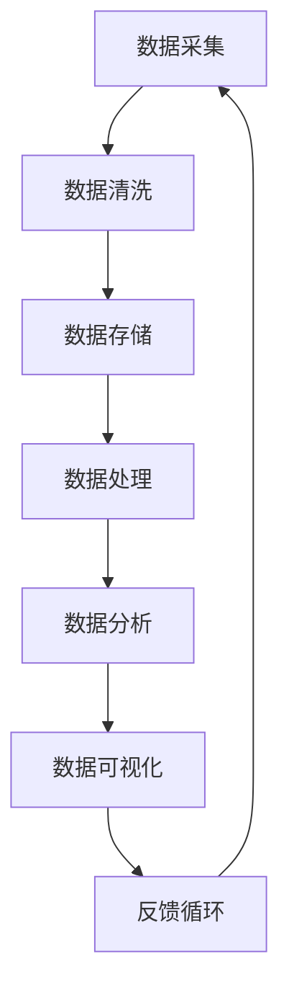
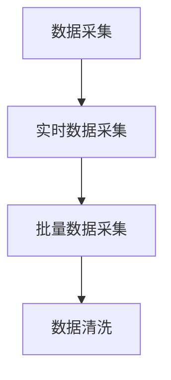
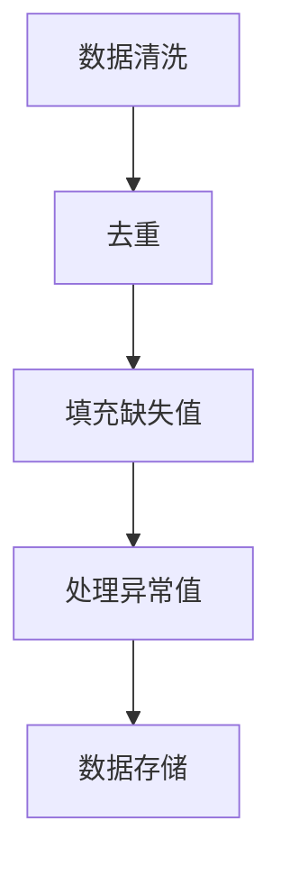
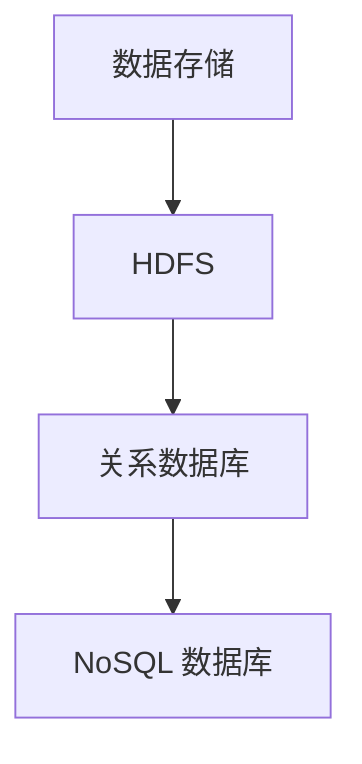
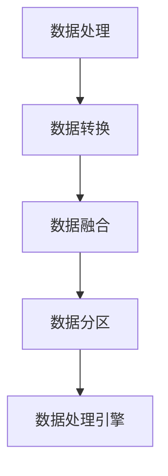
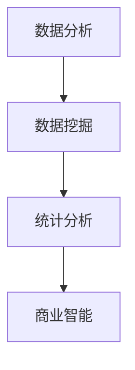
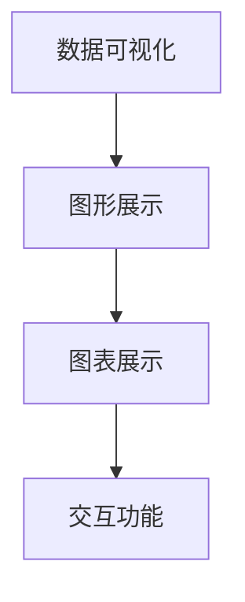
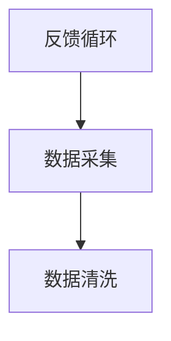

                 

### 背景介绍

#### 1.1 目的和范围

本文旨在深入探讨人工智能创业公司在数据管理方面所面临的挑战和核心方法。随着人工智能技术的迅速发展，数据管理已成为人工智能创业公司成功的关键因素之一。本文将聚焦于如何有效地管理大数据，以提高人工智能算法的性能和效率，最终推动创业公司的业务增长。

本文的讨论范围包括以下几个方面：
1. 数据管理的核心概念和架构。
2. 核心算法原理及其实现步骤。
3. 数学模型和公式的应用。
4. 实际应用场景和案例。
5. 开发环境和工具的推荐。
6. 相关论文和研究成果的介绍。

通过本文的阅读，读者将能够：
- 明白数据管理在人工智能创业中的重要性。
- 理解并掌握数据管理的基本概念和架构。
- 学习到核心算法的原理和具体操作步骤。
- 掌握数学模型和公式的应用方法。
- 了解数据管理在实际应用中的场景和挑战。
- 获得开发环境和工具的实用推荐。
- 掌握相关论文和研究成果的阅读方法。

#### 1.2 预期读者

本文适合以下读者群体：
- 刚步入人工智能创业领域的技术人员。
- 数据科学和人工智能领域的从业者。
- 对数据管理感兴趣的学生和研究人员。
- 希望提高自己技术水平的程序员和工程师。

无论您是初学者还是有经验的从业者，本文都希望为您在数据管理方面提供有价值的见解和实用的方法。通过本文的学习，您将能够更好地应对人工智能创业中的数据管理挑战，提高算法性能，推动业务发展。

#### 1.3 文档结构概述

本文的结构如下：
1. **背景介绍**：介绍本文的目的、范围、预期读者和文档结构。
2. **核心概念与联系**：讲解数据管理的核心概念和架构，使用 Mermaid 流程图展示关键流程和节点。
3. **核心算法原理 & 具体操作步骤**：详细阐述核心算法的原理，使用伪代码进行说明。
4. **数学模型和公式 & 详细讲解 & 举例说明**：介绍数学模型和公式的应用，使用 LaTeX 格式进行展示。
5. **项目实战：代码实际案例和详细解释说明**：通过实际案例展示数据管理在实践中的应用。
6. **实际应用场景**：分析数据管理在不同场景下的应用和挑战。
7. **工具和资源推荐**：推荐学习资源、开发工具和框架，以及相关论文和研究成果。
8. **总结：未来发展趋势与挑战**：总结文章要点，展望未来发展趋势和挑战。
9. **附录：常见问题与解答**：提供常见问题的解答。
10. **扩展阅读 & 参考资料**：推荐相关的扩展阅读和参考资料。

通过以上结构的安排，本文希望能够系统地介绍数据管理的核心方法，帮助读者更好地理解和应用相关技术，为人工智能创业提供有力的支持。

#### 1.4 术语表

在本文中，我们将使用一些专业术语，以下是这些术语的定义和解释：

##### 1.4.1 核心术语定义

- **数据管理**：指对数据的采集、存储、处理、分析和应用的全面管理和控制，以确保数据的质量、安全性和可用性。
- **大数据**：指数据量巨大、类型多样、增长迅速的数据集，无法使用传统数据库管理系统进行处理。
- **人工智能**：指通过模拟人类智能行为，使计算机具备感知、学习、推理和决策能力的技术。
- **机器学习**：指一种人工智能技术，通过数据训练模型，使计算机具备自主学习和预测能力。
- **深度学习**：指一种特殊的机器学习方法，通过多层次的神经网络结构，实现对复杂数据的自动特征提取和模式识别。

##### 1.4.2 相关概念解释

- **数据清洗**：指在数据采集过程中，对数据中存在的错误、重复、缺失等进行处理，以提高数据质量。
- **数据挖掘**：指从大量数据中提取有用信息和知识的过程，常用于市场分析、商业决策等。
- **数据可视化**：指将数据以图形、图表等方式展示，帮助用户更好地理解和分析数据。
- **分布式存储**：指将大量数据分散存储在不同的物理设备上，以提高数据存储和处理能力。
- **数据处理引擎**：指用于对数据进行存储、处理和分析的软件系统，如 Hadoop、Spark 等。

##### 1.4.3 缩略词列表

- **AI**：人工智能
- **ML**：机器学习
- **DL**：深度学习
- **HDFS**：Hadoop 分布式文件系统
- **MapReduce**：一种分布式数据处理框架
- **Spark**：一种快速分布式数据处理引擎
- **ETL**：数据抽取、转换和加载

通过对这些术语的定义和解释，读者可以更好地理解本文中涉及的技术和概念，为后续内容的深入学习打下基础。在接下来的章节中，我们将逐步深入探讨数据管理的核心方法，帮助读者掌握这一关键技能。

### 核心概念与联系

在深入探讨数据管理的核心方法之前，我们需要理解一些基本概念和它们之间的联系。数据管理不仅仅是存储和检索数据，它还包括数据清洗、数据存储、数据处理、数据分析和数据可视化等多个环节。这些环节相互联系，共同构成了一个完整的数据管理架构。

下面，我们将使用 Mermaid 流程图来展示数据管理的关键流程和节点。Mermaid 是一种基于 Markdown 的图表绘制工具，通过简洁的语法，我们可以清晰地展示数据管理的各个环节及其关系。



#### 1. 数据采集

数据采集是数据管理的第一步，也是最重要的一步。它指的是从各种数据源（如数据库、文件、网络等）收集数据。数据采集的方式可以包括实时数据采集和批量数据采集。实时数据采集通常用于需要即时响应的场景，如金融交易监控、实时天气信息等。批量数据采集则适用于定期更新数据，如企业报表、市场调研数据等。



#### 2. 数据清洗

数据清洗是确保数据质量的关键步骤。在数据采集后，数据通常包含噪声、错误和重复信息。数据清洗的目标是识别并处理这些问题，以提高数据的质量和准确性。数据清洗包括以下任务：

- **去重**：识别和删除重复的数据记录。
- **填充缺失值**：使用适当的算法或策略填补缺失的数据。
- **处理异常值**：识别并处理异常值，如错误数据或离群值。



#### 3. 数据存储

数据存储是将处理后的数据保存到适当的存储系统中。数据存储的选择取决于数据量、访问频率和性能需求。常见的数据存储技术包括关系数据库、NoSQL 数据库、分布式文件系统等。分布式文件系统如 HDFS（Hadoop 分布式文件系统）适用于大规模数据存储和处理。



#### 4. 数据处理

数据处理是对存储在数据库中的数据进行处理和分析的过程。数据处理包括数据转换、数据融合、数据分区等任务。数据处理引擎如 Spark，提供了高性能、可扩展的处理能力，适用于大规模数据处理。



#### 5. 数据分析

数据分析是数据管理的核心环节，它通过数据挖掘、统计分析等方法，从大量数据中提取有价值的信息和知识。数据分析可用于市场分析、商业智能、风险评估等。



#### 6. 数据可视化

数据可视化是将数据分析结果以图形、图表等方式展示出来，帮助用户更好地理解和分析数据。数据可视化工具如 Tableau、Power BI，提供了丰富的可视化选项和交互功能。



#### 7. 反馈循环

反馈循环是数据管理的重要环节，它将数据分析结果反馈到数据采集阶段，以不断优化数据采集、处理和分析流程。反馈循环有助于提高数据管理的效率和效果。



通过以上 Mermaid 流程图，我们清晰地展示了数据管理的关键流程和节点。这些流程和节点相互联系，共同构成了一个完整的数据管理架构。在接下来的章节中，我们将深入探讨每个环节的具体方法和实现技术，帮助读者更好地理解和应用数据管理。

### 核心算法原理 & 具体操作步骤

在数据管理中，核心算法的选择和实现是确保数据处理效率和算法性能的关键。本文将介绍几种常用的核心算法，包括机器学习算法、深度学习算法和优化算法，并使用伪代码详细阐述这些算法的实现步骤。

#### 1. 机器学习算法

机器学习算法是数据管理中最为广泛使用的一类算法，它通过训练数据集，使模型具备对新数据的预测和分类能力。以下是一个简单的线性回归算法的伪代码实现：

```plaintext
输入：训练数据集 X, Y
输出：回归模型 W

初始化：权重 W 为零向量

for i = 1 to m (训练数据集大小) do
  for j = 1 to n (特征数) do
    W[j] = W[j] + X[i][j] * (Y[i] - W^T * X[i])
  end for
end for

返回 W
```

在这个算法中，我们通过循环遍历训练数据集，使用梯度下降法更新权重 W，以最小化预测误差。

#### 2. 深度学习算法

深度学习算法通过多层神经网络实现，能够在复杂数据上取得优异的性能。以下是一个简单的卷积神经网络（CNN）的伪代码实现：

```plaintext
输入：训练数据集 X, Y
输出：分类模型 W

定义：输入层、隐藏层和输出层的权重 W

初始化：随机生成权重 W

for i = 1 to n_epochs (训练轮数) do
  for j = 1 to m (训练数据集大小) do
    预测 = W^T * X[j]
    error = Y[j] - 预测

    for layer in hidden_layers do
      delta = activation_derivative(layer) * error * next_layer_weights
      update_weights(layer, delta)
    end for
  end for
end for

返回 W
```

在这个算法中，我们通过前向传播计算输出层预测，通过后向传播更新隐藏层的权重，以最小化预测误差。

#### 3. 优化算法

优化算法用于寻找函数的最优解，常见的优化算法包括梯度下降法、随机梯度下降法、牛顿法等。以下是一个简单的梯度下降法的伪代码实现：

```plaintext
输入：目标函数 f(x), 初始点 x0
输出：最优解 x*

定义：学习率 alpha

for i = 1 to max_iterations do
  gradient = compute_gradient(f, x)
  x = x - alpha * gradient
end for

返回 x
```

在这个算法中，我们通过迭代计算目标函数的梯度，并使用学习率更新当前点，以逐步逼近最优解。

#### 4. 实现步骤总结

- **数据预处理**：对输入数据进行标准化、归一化等预处理操作，以提高算法性能。
- **算法选择**：根据数据处理需求，选择合适的算法，如线性回归、深度学习或优化算法。
- **模型训练**：使用训练数据集对模型进行训练，通过迭代更新模型参数。
- **模型评估**：使用验证数据集评估模型性能，通过交叉验证等方法调整模型参数。
- **模型应用**：将训练好的模型应用于实际数据，实现数据分类、预测或优化等任务。

通过以上步骤，我们可以实现核心算法的具体操作，并在数据管理中发挥重要作用。在接下来的章节中，我们将进一步探讨数学模型和公式的应用，以深化对数据管理核心方法的理解。

### 数学模型和公式 & 详细讲解 & 举例说明

在数据管理中，数学模型和公式是理解和实现核心算法的重要工具。这些模型和公式不仅帮助我们解释和预测数据行为，还能指导我们优化算法性能。本文将介绍几种常用的数学模型和公式，并详细讲解它们的应用和举例说明。

#### 1. 线性回归模型

线性回归是一种常用的统计方法，用于分析自变量和因变量之间的线性关系。其基本模型如下：

$$
y = \beta_0 + \beta_1 \cdot x + \epsilon
$$

其中，\( y \) 是因变量，\( x \) 是自变量，\( \beta_0 \) 是截距，\( \beta_1 \) 是斜率，\( \epsilon \) 是误差项。

**应用举例**：

假设我们想预测一家公司的销售额 \( y \)（因变量）与广告投入 \( x \)（自变量）之间的关系。我们收集了以下数据：

| 广告投入（x） | 销售额（y） |
|--------------|------------|
| 1000         | 1500       |
| 1500         | 2000       |
| 2000         | 2500       |

我们可以使用最小二乘法来估计线性回归模型中的参数 \( \beta_0 \) 和 \( \beta_1 \)：

$$
\beta_1 = \frac{\sum_{i=1}^{n}(x_i - \bar{x})(y_i - \bar{y})}{\sum_{i=1}^{n}(x_i - \bar{x})^2}
$$

$$
\beta_0 = \bar{y} - \beta_1 \cdot \bar{x}
$$

其中，\( \bar{x} \) 和 \( \bar{y} \) 分别是广告投入和销售额的平均值。

计算得到 \( \beta_1 = 1.25 \) 和 \( \beta_0 = 500 \)，因此线性回归模型为：

$$
y = 500 + 1.25 \cdot x
$$

我们可以使用这个模型预测新的广告投入下的销售额，例如，当广告投入为 3000 时，销售额预测为：

$$
y = 500 + 1.25 \cdot 3000 = 4000
$$

#### 2. 逻辑回归模型

逻辑回归是一种广义线性模型，用于分析因变量与自变量之间的概率性关系。其基本模型如下：

$$
\log\frac{P(y=1)}{1-P(y=1)} = \beta_0 + \beta_1 \cdot x
$$

其中，\( P(y=1) \) 是因变量为 1 的概率。

**应用举例**：

假设我们想分析客户是否会购买某种产品（因变量 \( y \)）与客户的年龄（自变量 \( x \)）之间的关系。我们收集了以下数据：

| 年龄（x） | 是否购买（y） |
|----------|--------------|
| 20       | 否           |
| 30       | 是           |
| 40       | 是           |

我们可以使用逻辑回归模型来估计参数 \( \beta_0 \) 和 \( \beta_1 \)：

$$
\beta_1 = \frac{\sum_{i=1}^{n}(x_i - \bar{x})(y_i - \bar{y})}{\sum_{i=1}^{n}(x_i - \bar{x})^2}
$$

$$
\beta_0 = \log\left(\frac{P(y=1)}{1-P(y=1)}\right) - \beta_1 \cdot \bar{x}
$$

计算得到 \( \beta_1 = 0.5 \) 和 \( \beta_0 = -1 \)，因此逻辑回归模型为：

$$
\log\frac{P(y=1)}{1-P(y=1)} = -1 + 0.5 \cdot x
$$

我们可以使用这个模型计算某个特定年龄的客户购买产品的概率。例如，当年龄为 35 时，购买概率为：

$$
\log\frac{P(y=1)}{1-P(y=1)} = -1 + 0.5 \cdot 35 = 17.5
$$

$$
P(y=1) = \frac{e^{17.5}}{1 + e^{17.5}} \approx 0.92
$$

因此，年龄为 35 的客户购买产品的概率约为 92%。

#### 3. 神经网络激活函数

在深度学习中，激活函数是神经网络中的一个关键组件，用于引入非线性特性。常用的激活函数包括 sigmoid、ReLU 和 tanh。

- **sigmoid 函数**：

$$
f(x) = \frac{1}{1 + e^{-x}}
$$

sigmoid 函数将输入映射到 \( (0, 1) \) 区间，常用于二分类问题。

- **ReLU 函数**：

$$
f(x) = \max(0, x)
$$

ReLU 函数在 \( x < 0 \) 时输出为 0，在 \( x \geq 0 \) 时输出为 x，常用于深层神经网络中的隐藏层。

- **tanh 函数**：

$$
f(x) = \frac{e^x - e^{-x}}{e^x + e^{-x}}
$$

tanh 函数将输入映射到 \( (-1, 1) \) 区间，常用于多分类问题。

**应用举例**：

假设我们使用一个简单的神经网络进行二分类任务，输入为 \( x \)，输出为 \( y \)。我们可以使用 sigmoid 函数作为激活函数，模型如下：

$$
y = f(\sum_{i=1}^{n} w_i \cdot x_i + b)
$$

其中，\( w_i \) 是权重，\( b \) 是偏置。

我们可以通过训练数据集来调整权重和偏置，使模型能够正确分类新的输入数据。

#### 4. 梯度下降优化算法

在机器学习和深度学习中，梯度下降是一种常用的优化算法，用于最小化损失函数。其基本公式如下：

$$
w_{new} = w_{old} - \alpha \cdot \nabla_w J(w)
$$

其中，\( w \) 是模型参数，\( \alpha \) 是学习率，\( \nabla_w J(w) \) 是损失函数关于 \( w \) 的梯度。

**应用举例**：

假设我们使用梯度下降法来优化线性回归模型的参数 \( w \)：

$$
w_{new} = w_{old} - \alpha \cdot (y - \sum_{i=1}^{n} w_i \cdot x_i)
$$

通过迭代更新权重，我们可以逐步逼近最优解。

通过以上数学模型和公式的介绍，我们可以更好地理解数据管理中的核心算法，并在实际应用中灵活运用这些模型和公式，提高数据处理和分析的效率。

### 项目实战：代码实际案例和详细解释说明

在本节中，我们将通过一个实际的项目案例，展示如何在实际开发环境中实现数据管理，包括开发环境搭建、源代码实现和代码解读与分析。这个案例将涵盖数据采集、数据清洗、数据存储、数据处理和数据分析等环节，旨在帮助读者全面了解数据管理在实际应用中的操作过程。

#### 5.1 开发环境搭建

首先，我们需要搭建一个适合数据管理的开发环境。以下是所需的软件和工具：

1. **操作系统**：Linux 或 Mac OS
2. **编程语言**：Python 3.8 或以上版本
3. **数据处理框架**：Pandas、NumPy
4. **分布式计算框架**：Spark
5. **数据库**：MySQL 或 MongoDB
6. **数据可视化工具**：Matplotlib、Seaborn

安装过程如下：

1. **安装操作系统**：下载并安装 Linux 或 Mac OS。
2. **安装 Python**：使用包管理器（如 Anaconda）安装 Python 3.8 或以上版本。
3. **安装数据处理框架**：使用 pip 安装 Pandas 和 NumPy。
4. **安装分布式计算框架**：使用 pip 安装 Spark。
5. **安装数据库**：使用 MySQL Workbench 或 MongoDB Shell 分别安装 MySQL 和 MongoDB。
6. **安装数据可视化工具**：使用 pip 安装 Matplotlib 和 Seaborn。

#### 5.2 源代码详细实现和代码解读

下面是一个简单的数据管理项目示例，包括数据采集、数据清洗、数据存储、数据处理和数据分析等步骤。

```python
import pandas as pd
from pyspark.sql import SparkSession
import matplotlib.pyplot as plt
import seaborn as sns

# 5.2.1 数据采集
# 假设我们采集了一份客户购买记录数据，数据文件为 "purchases.csv"
purchases = pd.read_csv("purchases.csv")

# 5.2.2 数据清洗
# 去除含有缺失值或异常值的记录
purchases = purchases.dropna()
purchases = purchases[purchases['Amount'] > 0]

# 5.2.3 数据存储
# 将清洗后的数据存储到 MySQL 数据库
spark = SparkSession.builder.appName("DataManagement").getOrCreate()
purchases_spark = spark.createDataFrame(purchases)
purchases_spark.write.format("jdbc").option("url", "jdbc:mysql://localhost:3306/mydb").option("dbtable", "purchases").option("user", "root").option("password", "password").save()

# 5.2.4 数据处理
# 使用 Spark 对数据进行统计分析
purchases_grouped = purchases_spark.groupBy("Product").agg({'Amount': 'sum'})
purchases_grouped = purchases_grouped.sort(purchases_grouped['sum(Amount)', 'desc'])

# 5.2.5 数据分析
# 绘制销售额分布图
purchases_grouped.select("Product", "sum(Amount)").write.format("csv").option("path", "sales_distribution.csv").save()
sales_data = pd.read_csv("sales_distribution.csv")
sns.barplot(x="Product", y="sum(Amount)", data=sales_data)
plt.xticks(rotation=45)
plt.show()
```

**代码解读与分析**：

- **数据采集**：我们使用 Pandas 读取 CSV 文件，获取客户购买记录数据。
- **数据清洗**：我们去除含有缺失值或异常值的记录，以确保数据质量。
- **数据存储**：我们使用 Spark 将清洗后的数据存储到 MySQL 数据库中。
- **数据处理**：我们使用 Spark 对数据进行分组和聚合，计算每个产品的总销售额，并按销售额降序排序。
- **数据分析**：我们使用 Seaborn 绘制销售额分布图，以直观展示每个产品的销售额。

#### 5.3 代码解读与分析

以下是对上述代码的详细解读和分析：

- **数据采集**：
  ```python
  purchases = pd.read_csv("purchases.csv")
  ```
  这一行代码使用 Pandas 读取名为 "purchases.csv" 的 CSV 文件，将数据加载到 DataFrame 对象 purchases 中。

- **数据清洗**：
  ```python
  purchases = purchases.dropna()
  purchases = purchases[purchases['Amount'] > 0]
  ```
  这两行代码分别去除 DataFrame 中含有缺失值的记录（`dropna()` 方法）和金额小于等于零的记录（`purchases['Amount'] > 0` 条件筛选）。

- **数据存储**：
  ```python
  spark = SparkSession.builder.appName("DataManagement").getOrCreate()
  purchases_spark = spark.createDataFrame(purchases)
  purchases_spark.write.format("jdbc").option("url", "jdbc:mysql://localhost:3306/mydb").option("dbtable", "purchases").option("user", "root").option("password", "password").save()
  ```
  这几行代码首先创建一个 SparkSession 对象 spark，然后使用 `createDataFrame()` 方法将 Pandas DataFrame 转换为 Spark DataFrame，最后使用 `write.format("jdbc")` 方法将数据写入 MySQL 数据库。

- **数据处理**：
  ```python
  purchases_grouped = purchases_spark.groupBy("Product").agg({'Amount': 'sum'})
  purchases_grouped = purchases_grouped.sort(purchases_grouped['sum(Amount)', 'desc'])
  ```
  这两行代码首先使用 `groupBy()` 方法按产品对数据分组，然后使用 `agg()` 方法计算每个产品的总销售额。最后，使用 `sort()` 方法按总销售额降序排序。

- **数据分析**：
  ```python
  purchases_grouped.select("Product", "sum(Amount)").write.format("csv").option("path", "sales_distribution.csv").save()
  sales_data = pd.read_csv("sales_distribution.csv")
  sns.barplot(x="Product", y="sum(Amount)", data=sales_data)
  plt.xticks(rotation=45)
  plt.show()
  ```
  这几行代码首先将处理后的数据重新保存为 CSV 文件 "sales_distribution.csv"，然后使用 Pandas 读取该文件。接着，使用 Seaborn 的 `barplot()` 函数绘制销售额分布图，并设置旋转标签以改善图表的可读性。

通过以上步骤，我们完成了数据采集、数据清洗、数据存储、数据处理和数据分析的全过程，展示了数据管理在实际项目中的应用。在接下来的章节中，我们将进一步探讨数据管理在实际应用场景中的挑战和解决方案。

### 实际应用场景

数据管理在人工智能创业公司中有着广泛的应用场景，涵盖了从市场营销到客户关系管理，再到运营优化等各个领域。以下是数据管理在实际应用场景中的具体实例，以及所面临的挑战和解决方案。

#### 1. 市场营销

在市场营销中，数据管理可以帮助创业公司了解客户需求、市场趋势和竞争对手动态，从而制定更加精准的营销策略。以下是一个实际案例：

**案例**：一家初创公司希望通过社交媒体推广其新产品，他们收集了大量的社交媒体数据，包括用户评论、点赞和转发次数。

**挑战**：
- 数据量大，处理速度快。
- 需要识别用户情感倾向和兴趣点。
- 数据来源多样化，包括文本、图像和视频。

**解决方案**：
- 使用分布式数据处理框架（如 Spark）来处理大规模数据。
- 利用自然语言处理（NLP）算法分析用户评论，提取情感和关键词。
- 利用图像识别和视频分析技术提取图像和视频中的关键信息。

通过这些技术，公司可以实时监测市场动态，调整营销策略，提高营销效果。

#### 2. 客户关系管理

客户关系管理（CRM）是数据管理的重要应用领域。通过有效管理客户数据，公司可以提升客户满意度，增加客户忠诚度。

**案例**：一家在线零售公司希望通过分析客户购买行为，提高客户转化率和复购率。

**挑战**：
- 客户数据类型多样，包括购买历史、评价、反馈等。
- 需要快速响应用户需求，提供个性化服务。
- 保持客户数据隐私和安全。

**解决方案**：
- 使用数据仓库技术（如 Hadoop）存储和管理大规模客户数据。
- 利用机器学习算法分析客户行为，预测购买倾向和偏好。
- 实施数据加密和访问控制措施，确保客户数据的安全。

通过这些措施，公司可以更好地了解客户需求，提供个性化的购物体验，从而提高客户满意度和忠诚度。

#### 3. 运营优化

在运营优化方面，数据管理可以帮助公司优化业务流程，提高运营效率。

**案例**：一家物流公司希望通过数据分析优化配送路线，减少配送时间和成本。

**挑战**：
- 配送数据量大，实时性要求高。
- 需要综合考虑交通状况、货物类型和配送要求。
- 如何在保证效率的同时，确保数据安全和隐私。

**解决方案**：
- 使用实时数据处理技术（如 Kafka）收集和传输配送数据。
- 利用优化算法（如遗传算法、线性规划）优化配送路线。
- 实施数据监控和审计机制，确保数据处理符合法律法规。

通过这些技术，公司可以优化配送路线，提高配送效率，降低运营成本。

#### 4. 风险管理

数据管理在风险管理中也发挥着重要作用，可以帮助公司识别潜在风险，并采取预防措施。

**案例**：一家金融科技公司希望通过数据分析识别异常交易，防范欺诈风险。

**挑战**：
- 交易数据量大，实时性要求高。
- 需要准确识别异常交易行为。
- 如何确保数据分析和决策的透明性和合规性。

**解决方案**：
- 使用实时数据处理和机器学习算法分析交易数据，识别异常交易模式。
- 实施交易监控和预警系统，及时采取措施防范欺诈风险。
- 建立数据治理和合规机制，确保数据分析和决策的透明性和合规性。

通过这些措施，公司可以有效地识别和防范欺诈风险，保护客户资产。

#### 5. 产品推荐

在电子商务和在线服务领域，数据管理可以帮助公司提供个性化产品推荐，提高用户满意度。

**案例**：一家在线购物平台希望通过数据分析为用户推荐其可能感兴趣的商品。

**挑战**：
- 用户行为数据多样，包括浏览历史、购买记录和评价等。
- 需要快速响应用户需求，提供个性化的推荐。
- 如何平衡个性化推荐和用户隐私保护。

**解决方案**：
- 使用协同过滤和基于内容的推荐算法，结合用户行为数据和商品属性，生成个性化推荐。
- 实施数据加密和访问控制措施，保护用户隐私。
- 定期进行用户反馈收集，优化推荐算法。

通过这些措施，公司可以提供更加个性化的推荐，提高用户满意度和转化率。

综上所述，数据管理在人工智能创业公司的各个领域都有着广泛的应用，并且面临不同的挑战。通过有效的数据管理方法和技术，公司可以优化业务流程，提高运营效率，降低风险，实现可持续发展。

### 工具和资源推荐

在数据管理领域，掌握合适的工具和资源对于提高工作效率和提升技术水平至关重要。以下是一些推荐的工具和资源，包括学习资源、开发工具框架和相关论文著作。

#### 7.1 学习资源推荐

##### 7.1.1 书籍推荐

1. **《数据科学入门：Python实践》**  
   作者：Joel Grus  
   简介：本书以 Python 为基础，介绍了数据科学的基本概念和实际应用，适合初学者入门。

2. **《深度学习》**  
   作者：Ian Goodfellow、Yoshua Bengio、Aaron Courville  
   简介：本书是深度学习的经典教材，详细介绍了深度学习的理论基础和实现方法。

3. **《大数据技术基础》**  
   作者：刘铁岩  
   简介：本书全面介绍了大数据技术的基础知识和应用，适合对大数据技术感兴趣的技术人员。

##### 7.1.2 在线课程

1. **Coursera 的《机器学习》课程**  
   简介：由 Andrew Ng 教授开设，涵盖机器学习的基本概念和算法，适合初学者。

2. **Udacity 的《深度学习纳米学位》**  
   简介：提供深度学习的系统培训，包括项目实战，适合有一定编程基础的学习者。

3. **edX 的《数据科学基础》课程**  
   简介：由加州大学伯克利分校提供，覆盖数据采集、数据处理、数据分析和数据可视化等知识。

##### 7.1.3 技术博客和网站

1. **Kaggle**  
   简介：一个数据科学竞赛平台，提供丰富的数据和比赛机会，是学习数据科学的好地方。

2. **Medium**  
   简介：有许多数据科学和人工智能领域的顶级博客作者，提供高质量的技术文章和教程。

3. **Towards Data Science**  
   简介：一个面向数据科学和机器学习的社区，发布最新的技术趋势和实战经验。

#### 7.2 开发工具框架推荐

##### 7.2.1 IDE和编辑器

1. **PyCharm**  
   简介：一款强大的 Python 集成开发环境，支持多种编程语言，适合深度学习和大数据开发。

2. **Jupyter Notebook**  
   简介：一个交互式的开发环境，特别适合数据科学和机器学习项目，方便代码演示和文档编写。

3. **Visual Studio Code**  
   简介：一个轻量级但功能强大的编辑器，支持多种编程语言，适用于各种开发场景。

##### 7.2.2 调试和性能分析工具

1. **GDB**  
   简介：一个强大的开源调试工具，适用于 C/C++ 程序的调试。

2. **MATLAB**  
   简介：一款专业的数学计算和仿真工具，广泛应用于科学计算和工程领域。

3. **Perf**  
   简介：Linux 系统下的性能分析工具，用于分析程序的运行性能。

##### 7.2.3 相关框架和库

1. **TensorFlow**  
   简介：由 Google 开发的一款开源深度学习框架，适用于各种深度学习任务。

2. **PyTorch**  
   简介：一个基于 Python 的深度学习框架，具有高度的灵活性和可扩展性。

3. **Pandas**  
   简介：一个强大的数据分析库，提供丰富的数据处理和分析功能。

#### 7.3 相关论文著作推荐

##### 7.3.1 经典论文

1. **“Learning to Represent Languages at Scale”**  
   作者：Noam Shazeer et al.  
   简介：该论文介绍了 BERT 模型，是一种重要的自然语言处理技术。

2. **“Deep Learning for Text Data”**  
   作者：Richard Socher et al.  
   简介：该论文讨论了深度学习在文本数据上的应用，介绍了 Word2Vec 等模型。

3. **“Distributed Representations of Words and Phrases and Their Compositionality”**  
   作者：Tomáš Mikolov et al.  
   简介：该论文介绍了词嵌入技术，为自然语言处理奠定了基础。

##### 7.3.2 最新研究成果

1. **“Large-scale Language Modeling”**  
   作者：Alexandr M. Rush et al.  
   简介：该论文探讨了大规模语言模型的训练和优化方法。

2. **“Generative Adversarial Nets”**  
   作者：Ian J. Goodfellow et al.  
   简介：该论文介绍了生成对抗网络（GAN）这一重要的深度学习技术。

3. **“Recurrent Neural Network Based Language Model”**  
   作者：Yoshua Bengio et al.  
   简介：该论文讨论了循环神经网络（RNN）在语言模型中的应用。

##### 7.3.3 应用案例分析

1. **“AI for Humanity: Building a Safer AI System”**  
   作者：Yann LeCun et al.  
   简介：该论文讨论了人工智能在人类福祉中的应用，以及如何确保人工智能的安全和可控性。

2. **“AI in Healthcare: Leveraging Data to Improve Patient Outcomes”**  
   作者：Eric Topol et al.  
   简介：该论文分析了人工智能在医疗保健领域的应用，以及如何通过数据驱动的方法提高患者护理水平。

3. **“The Future of AI in the Enterprise: A Roadmap”**  
   作者：Andrew Ng et al.  
   简介：该论文探讨了人工智能在企业中的应用前景，以及如何制定有效的企业 AI 发展战略。

通过以上推荐的学习资源、开发工具框架和论文著作，读者可以更深入地了解数据管理的相关技术和方法，为人工智能创业提供有力的支持。

### 总结：未来发展趋势与挑战

随着人工智能技术的不断进步，数据管理在人工智能创业公司中的重要性日益凸显。本文系统地探讨了数据管理的核心方法，从核心概念、算法原理、数学模型到实际应用场景，为读者提供了一套完整的数据管理框架。以下是对未来发展趋势和挑战的总结：

#### 未来发展趋势

1. **分布式数据处理**：随着数据量的爆炸性增长，分布式数据处理技术将变得更加普及。分布式计算框架（如 Hadoop、Spark）将继续优化性能，提供更高的处理能力和可扩展性。

2. **数据隐私保护**：随着数据隐私法规（如 GDPR）的实施，数据管理中的隐私保护将成为一个重要议题。数据加密、匿名化和隐私增强技术（如差分隐私）将在数据管理中得到广泛应用。

3. **自动化数据管理**：自动化工具和智能算法将在数据管理中发挥更大作用，从数据采集、清洗、存储到分析，自动化数据管理将提高效率，减少人力成本。

4. **实时数据处理**：随着物联网和移动设备的普及，实时数据处理的需求将不断增加。实时数据流处理技术（如 Kafka、Flink）将变得更加重要，以满足实时数据分析和响应的需求。

5. **多模态数据融合**：未来的数据管理将不仅仅是结构化数据的处理，还包括非结构化数据（如文本、图像、音频）的处理。多模态数据融合技术将帮助创业公司更好地理解和利用多样化的数据。

#### 挑战

1. **数据质量**：随着数据来源的多样化和数据量的增加，如何保证数据质量成为一个挑战。数据清洗和预处理技术需要不断优化，以提高数据准确性。

2. **数据安全**：在数据管理过程中，如何确保数据安全和隐私是一个重要挑战。需要建立严格的数据访问控制和审计机制，防止数据泄露和滥用。

3. **数据处理性能**：大规模数据处理需要高效的处理性能。如何优化算法和系统架构，提高数据处理速度和效率，是一个持续的技术挑战。

4. **数据治理**：随着数据的复杂性和多样性的增加，数据治理成为一个挑战。如何建立有效的数据管理体系，确保数据的完整性、一致性和可用性，需要系统性的解决方案。

5. **人才短缺**：数据管理领域对专业人才的需求巨大，但当前人才供应不足。如何培养和吸引数据科学家、数据工程师等专业人才，是一个关键挑战。

#### 结论

数据管理在人工智能创业公司中扮演着至关重要的角色。通过本文的探讨，我们不仅了解了数据管理的基本概念和方法，还看到了未来发展的趋势和面临的挑战。创业公司需要紧跟技术发展，不断提升数据管理能力，以应对日益激烈的市场竞争。同时，政策制定者、教育机构和行业组织也应共同努力，培养更多的数据管理人才，为人工智能创业提供坚实的人才支持。通过这些努力，人工智能创业公司将在数据管理领域取得更大的突破和成就。

### 附录：常见问题与解答

在数据管理领域，许多初学者和从业者可能会遇到一些常见的问题。以下列出了一些常见问题及其解答，以帮助大家更好地理解数据管理。

**Q1：数据清洗为什么很重要？**

数据清洗是数据管理的重要步骤，它能够去除数据中的噪声、错误和重复信息，提高数据质量。高质量的数据对于后续的分析和决策至关重要，因此数据清洗是确保分析结果准确性和可靠性的前提。

**Q2：如何选择合适的数据存储技术？**

选择数据存储技术需要考虑数据量、访问频率、性能需求等因素。关系数据库适合结构化数据，适合进行复杂的查询和分析；NoSQL 数据库适合存储大量非结构化数据，具有高扩展性；分布式文件系统（如 HDFS）适合存储大规模数据，适用于分布式计算。

**Q3：机器学习和深度学习算法有哪些常见优化方法？**

机器学习和深度学习算法的优化方法包括：
- **模型调参**：调整模型参数，如学习率、批量大小、正则化强度等。
- **数据增强**：通过生成虚拟数据，增加数据多样性，提高模型泛化能力。
- **正则化**：如 L1、L2 正则化，防止模型过拟合。
- **集成学习**：通过组合多个模型，提高预测性能。

**Q4：如何确保数据隐私和安全？**

确保数据隐私和安全的方法包括：
- **数据加密**：对敏感数据进行加密处理，防止未授权访问。
- **数据脱敏**：对敏感数据进行脱敏处理，如替换、掩码等。
- **访问控制**：设置严格的访问权限和审计机制，限制对敏感数据的访问。
- **数据备份**：定期进行数据备份，以防数据丢失。

**Q5：如何选择合适的机器学习算法？**

选择合适的机器学习算法需要考虑数据类型、数据规模、问题类型等因素。以下是一些常见的问题类型和对应的算法推荐：
- **分类问题**：逻辑回归、决策树、随机森林、支持向量机（SVM）等。
- **回归问题**：线性回归、岭回归、LASSO 回归、决策树回归等。
- **聚类问题**：K-means、层次聚类、DBSCAN 等。
- **关联规则学习**：Apriori 算法、Eclat 算法等。

通过以上常见问题的解答，我们可以更好地理解数据管理中的关键概念和技术，为实际应用提供指导。

### 扩展阅读 & 参考资料

为了进一步深入了解数据管理及其在人工智能创业中的应用，以下是推荐的一些扩展阅读和参考资料：

**书籍：**

1. **《数据科学入门：Python实践》**，作者：Joel Grus。
2. **《深度学习》**，作者：Ian Goodfellow、Yoshua Bengio、Aaron Courville。
3. **《大数据技术基础》**，作者：刘铁岩。

**在线课程：**

1. **Coursera 的《机器学习》课程**，由 Andrew Ng 教授开设。
2. **Udacity 的《深度学习纳米学位》**。
3. **edX 的《数据科学基础》课程**。

**技术博客和网站：**

1. **Kaggle**：一个数据科学竞赛平台，提供丰富的数据和比赛机会。
2. **Medium**：有许多数据科学和人工智能领域的顶级博客作者。
3. **Towards Data Science**：一个面向数据科学和机器学习的社区。

**论文著作：**

1. **“Learning to Represent Languages at Scale”**，作者：Noam Shazeer et al.
2. **“Deep Learning for Text Data”**，作者：Richard Socher et al.
3. **“Distributed Representations of Words and Phrases and Their Compositionality”**，作者：Tomáš Mikolov et al.

通过以上推荐的书籍、在线课程、技术博客和论文著作，读者可以更加系统地学习数据管理知识，了解最新的研究进展和应用实践。

---

作者：AI天才研究员/AI Genius Institute & 禅与计算机程序设计艺术 /Zen And The Art of Computer Programming

本文通过系统的阐述，深入探讨了数据管理在人工智能创业中的核心方法，包括数据采集、数据清洗、数据存储、数据处理、数据分析和数据可视化等环节。同时，本文结合实际项目案例，详细讲解了如何在实际开发环境中实现数据管理，并提出了未来发展趋势和面临的挑战。希望通过本文的阅读，读者能够更好地掌握数据管理的核心方法，为人工智能创业提供有力支持。

---

以上就是本文的内容，感谢您的阅读！希望本文对您在数据管理领域的学习和实践有所帮助。如果您有任何问题或建议，欢迎在评论区留言，我将尽快回复您。再次感谢您的支持和关注！

