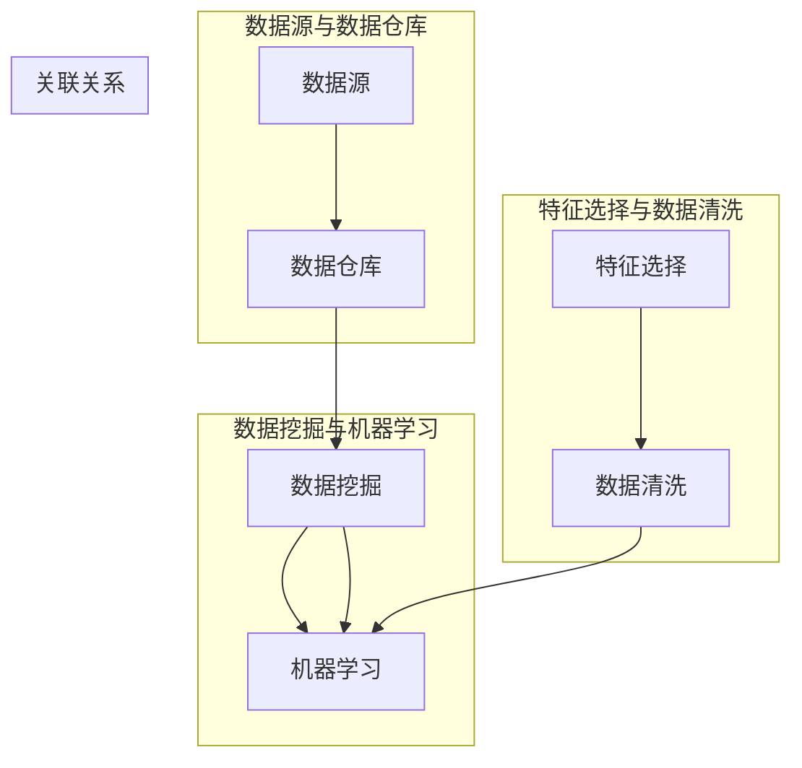
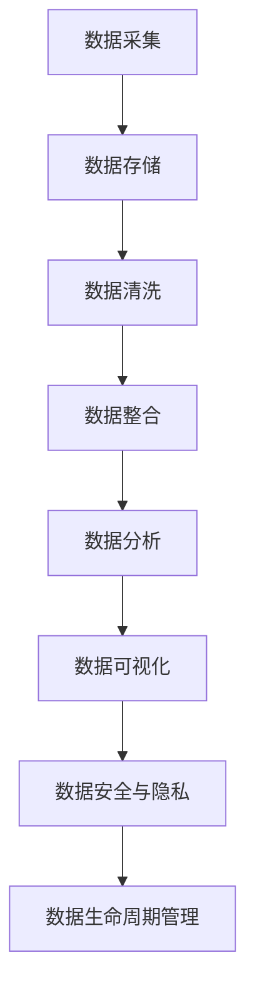
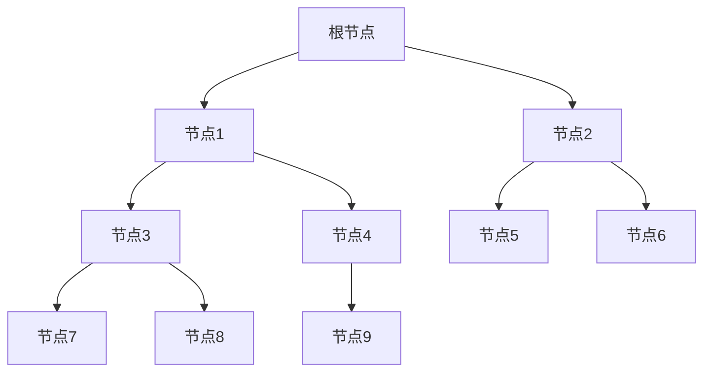
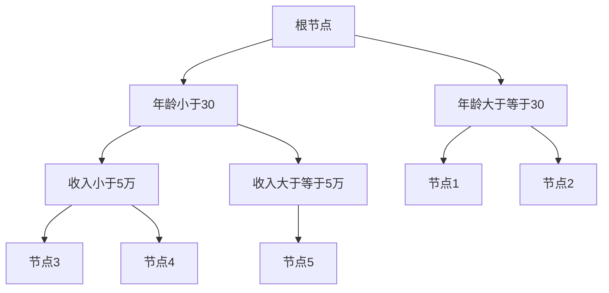

                 

## 1. 背景介绍

### 1.1 目的和范围

在当今社会，人工智能（AI）的发展已经成为不可逆转的趋势。无论是机器学习、自然语言处理，还是计算机视觉，AI技术都在各个领域取得了显著的进展。然而，随着AI应用场景的扩展，数据管理成为一个至关重要的问题。高效的数据管理不仅能够提升AI模型的性能，还能确保数据安全和隐私保护。

本文的目的在于探讨人工智能创业中数据管理的策略与措施。我们将从多个角度出发，详细分析数据管理的重要性、核心概念、算法原理、数学模型，以及实际应用场景。通过这些分析，我们希望能够为创业者提供一套系统、实用的数据管理方案，帮助他们在竞争激烈的市场中脱颖而出。

本文的范围主要包括以下几个方面：

1. **数据管理的重要性**：讨论数据管理在AI创业中的关键作用，以及为何数据质量对于AI模型的性能至关重要。
2. **核心概念与联系**：介绍数据管理中的核心概念，包括数据源、数据仓库、数据挖掘等，并通过Mermaid流程图展示这些概念之间的关系。
3. **核心算法原理与具体操作步骤**：讲解常用的数据管理算法，如数据清洗、数据归一化、特征选择等，并使用伪代码进行详细阐述。
4. **数学模型和公式**：介绍支持数据管理的关键数学模型，如线性回归、决策树等，并通过具体例子进行说明。
5. **项目实战**：通过实际代码案例展示如何在实际项目中应用数据管理策略。
6. **实际应用场景**：分析数据管理在具体行业中的应用，如金融、医疗、零售等。
7. **工具和资源推荐**：推荐学习资源、开发工具框架和相关论文著作，为创业者提供参考资料。

### 1.2 预期读者

本文的预期读者主要包括以下几类：

1. **人工智能创业者**：希望了解数据管理在AI项目中的重要性，以及如何实施有效的数据管理策略。
2. **数据科学家和工程师**：希望深入了解数据管理算法和数学模型，并将其应用于实际项目。
3. **技术爱好者**：对AI和数据管理感兴趣的技术爱好者，希望通过本文学习相关技术知识。
4. **学术研究人员**：关注数据管理领域的研究动态，希望了解最新的研究成果和应用案例。

通过本文的学习，读者可以系统地了解数据管理在AI创业中的关键作用，掌握数据管理的基本原理和实践方法，从而为成功实现AI项目奠定坚实基础。

### 1.3 文档结构概述

本文将分为十个部分，具体结构如下：

1. **背景介绍**：介绍本文的目的、范围、预期读者以及文档结构概述。
2. **核心概念与联系**：通过Mermaid流程图展示数据管理中的核心概念及其相互关系。
3. **核心算法原理与具体操作步骤**：详细讲解数据管理中的常用算法，并使用伪代码进行阐述。
4. **数学模型和公式**：介绍支持数据管理的关键数学模型，并通过具体例子进行说明。
5. **项目实战**：通过实际代码案例展示如何在实际项目中应用数据管理策略。
6. **实际应用场景**：分析数据管理在各个行业中的应用，如金融、医疗、零售等。
7. **工具和资源推荐**：推荐学习资源、开发工具框架和相关论文著作，为创业者提供参考资料。
8. **总结：未来发展趋势与挑战**：总结本文的主要内容，并探讨未来数据管理的发展趋势和面临的挑战。
9. **附录：常见问题与解答**：回答读者可能遇到的一些常见问题。
10. **扩展阅读 & 参考资料**：提供进一步的阅读材料和参考资料。

通过本文的阅读，读者可以逐步深入了解数据管理在人工智能创业中的重要作用，掌握数据管理的基本原理和实践方法，并为未来的AI项目打下坚实基础。

### 1.4 术语表

#### 1.4.1 核心术语定义

为了确保读者能够更好地理解本文的内容，以下是对本文中涉及的一些核心术语进行定义：

1. **数据管理**：指对数据的采集、存储、处理、分析、共享和归档等全过程进行管理和监控的一系列操作。数据管理的目标是确保数据的质量、可用性和一致性，以满足业务需求和决策支持。
2. **数据源**：指数据产生的源头，可以是数据库、文件系统、Web服务、传感器等。数据源为数据管理系统提供原始数据。
3. **数据仓库**：是一种用于存储、管理和分析大规模数据的系统。数据仓库通常包含多个数据源的数据，以便进行数据整合和分析。
4. **数据挖掘**：是从大量数据中提取有用信息和知识的过程。数据挖掘通常涉及数据清洗、数据整合、特征选择和模型构建等步骤。
5. **机器学习**：是一种人工智能技术，通过从数据中学习规律和模式，实现自动化决策和预测。机器学习是数据管理的重要组成部分，用于构建和优化数据模型。
6. **特征选择**：是从大量特征中挑选出对模型性能有显著影响的特征的过程。特征选择可以减少数据维度、提高模型性能和可解释性。
7. **归一化**：是一种将数据转换为统一尺度的方法，以便更好地进行比较和分析。常见的归一化方法包括最小-最大标准化、Z-Score标准化等。
8. **数据清洗**：是数据处理过程中的重要步骤，旨在识别和纠正数据中的错误、缺失值和不一致之处。数据清洗可以改善数据质量，提高模型性能。

#### 1.4.2 相关概念解释

除了上述核心术语，本文还涉及以下相关概念：

1. **数据质量**：指数据在准确性、完整性、一致性、及时性和可靠性等方面的表现。高质量的数据对于数据管理至关重要，能够提高模型的性能和决策质量。
2. **数据隐私**：指保护数据不被未经授权的访问和泄露。在数据管理过程中，确保数据隐私是非常重要的，以防止敏感信息被滥用。
3. **数据安全**：指防止数据被未授权访问、篡改和破坏的措施。数据安全是数据管理的基础，需要通过加密、访问控制和备份等技术手段来保障。
4. **数据可视化**：是将数据以图形、图像或图表的形式呈现，以帮助用户更好地理解和分析数据。数据可视化在数据管理中具有重要作用，可以揭示数据中的模式和趋势。
5. **大数据**：是指海量、复杂和快速生成的数据。大数据技术包括数据采集、存储、处理、分析和可视化等方面，以应对大规模数据的需求。

#### 1.4.3 缩略词列表

以下是在本文中使用的部分缩略词及其全称：

- AI：人工智能（Artificial Intelligence）
- ML：机器学习（Machine Learning）
- DM：数据管理（Data Management）
- DW：数据仓库（Data Warehouse）
- ETL：提取、转换、加载（Extract, Transform, Load）
- DB：数据库（Database）
- Hadoop：一个分布式数据处理框架（Hadoop）
- Spark：一个快速通用的计算引擎（Spark）
- RDBMS：关系数据库管理系统（Relational Database Management System）
- NoSQL：非关系型数据库（Not Only SQL）

通过上述术语表，读者可以更好地理解本文中涉及的概念，为进一步学习数据管理在人工智能创业中的应用打下基础。

## 2. 核心概念与联系

### 2.1 数据管理流程

在深入了解数据管理的核心概念之前，我们需要首先了解一个典型的数据管理流程。这个流程包括数据采集、数据存储、数据清洗、数据整合、数据分析和数据可视化等多个环节。以下是这个流程的Mermaid流程图：

```mermaid
flowchart TD
    subgraph 数据采集
        数据采集[数据采集]
    end
    subgraph 数据存储
        数据存储[数据存储]
    end
    subgraph 数据清洗
        数据清洗[数据清洗]
    end
    subgraph 数据整合
        数据整合[数据整合]
    end
    subgraph 数据分析
        数据分析[数据分析]
    end
    subgraph 数据可视化
        数据可视化[数据可视化]
    end
    数据采集 --> 数据存储
    数据存储 --> 数据清洗
    数据清洗 --> 数据整合
    数据整合 --> 数据分析
    数据分析 --> 数据可视化
```

### 2.2 核心概念定义与关系

在数据管理流程中，涉及多个核心概念，包括数据源、数据仓库、数据挖掘、机器学习等。以下是这些核心概念的详细定义及其相互关系：

#### 2.2.1 数据源

数据源是指数据的产生源头，可以是数据库、文件系统、Web服务、传感器等。数据源为数据管理系统提供原始数据。数据源与数据仓库之间的联系在于，数据源中的数据需要被存储到数据仓库中进行进一步处理。

#### 2.2.2 数据仓库

数据仓库是一种用于存储、管理和分析大规模数据的系统。数据仓库通常包含多个数据源的数据，以便进行数据整合和分析。数据仓库与数据源的关系在于，数据仓库从数据源中提取数据，并将其存储在一个集中的位置，以供后续处理。

#### 2.2.3 数据挖掘

数据挖掘是从大量数据中提取有用信息和知识的过程。数据挖掘通常涉及数据清洗、数据整合、特征选择和模型构建等步骤。数据仓库中的数据是数据挖掘的重要数据来源，通过数据挖掘，可以提取出对业务决策有价值的信息。

#### 2.2.4 机器学习

机器学习是一种人工智能技术，通过从数据中学习规律和模式，实现自动化决策和预测。机器学习是数据挖掘和数据分析的重要手段，通过对数据进行分析，可以构建出能够进行预测和分类的模型。机器学习与数据挖掘的关系在于，数据挖掘为机器学习提供了数据源，而机器学习通过对数据的学习，实现了数据挖掘的目标。

#### 2.2.5 特征选择

特征选择是从大量特征中挑选出对模型性能有显著影响的特征的过程。特征选择可以减少数据维度、提高模型性能和可解释性。特征选择与数据挖掘和机器学习的关系在于，它是在数据挖掘和机器学习过程中进行的一项重要步骤，用于优化模型性能。

#### 2.2.6 数据清洗

数据清洗是数据处理过程中的重要步骤，旨在识别和纠正数据中的错误、缺失值和不一致之处。数据清洗可以改善数据质量，提高模型性能。数据清洗与数据挖掘和机器学习的关系在于，高质量的数据是数据挖掘和机器学习的基础，而数据清洗则是确保数据质量的重要手段。

### 2.3 Mermaid流程图

为了更直观地展示数据管理中的核心概念及其相互关系，我们使用Mermaid流程图对上述概念进行展示：



通过上述Mermaid流程图，我们可以清晰地看到数据源、数据仓库、数据挖掘、机器学习、特征选择和数据清洗等核心概念之间的相互关系。这些概念共同构成了一个完整的数据管理流程，为人工智能创业中的数据管理提供了理论基础和实践指导。

### 2.4 数据管理的基本原理

在深入探讨数据管理时，我们需要了解其基本原理，这些原理构成了数据管理的核心框架，指导着整个数据管理过程。以下是数据管理的基本原理及其相互关系：

#### 2.4.1 数据存储

数据存储是数据管理的基础，它涉及如何有效地组织和存储数据，以确保数据的可访问性和持久性。数据存储可以采用关系数据库管理系统（RDBMS）、非关系型数据库（NoSQL）或数据仓库等多种形式。每种存储方式都有其优势和适用场景。

1. **关系数据库管理系统（RDBMS）**：RDBMS通过表格结构来存储数据，提供了强大的查询功能和事务管理。常见的RDBMS包括MySQL、PostgreSQL和Oracle等。
2. **非关系型数据库（NoSQL）**：NoSQL数据库提供了灵活的存储模型，适用于大规模、高并发的应用场景。常见的NoSQL数据库包括MongoDB、Cassandra和Redis等。
3. **数据仓库**：数据仓库是一个用于存储大规模数据的系统，主要用于数据分析和商业智能。数据仓库通常包含多个数据源的数据，以便进行整合和分析。

#### 2.4.2 数据采集

数据采集是数据管理过程的第一步，它涉及如何从各种数据源（如数据库、文件系统、Web服务和传感器等）收集数据。数据采集的方法包括：

1. **自动化采集**：通过自动化脚本或工具定期从数据源中获取数据。
2. **实时采集**：通过Web服务或API实时获取数据。
3. **手动采集**：通过人工方式定期收集数据，适用于数据源不固定或数据量较小的场景。

#### 2.4.3 数据清洗

数据清洗是确保数据质量的关键步骤，它涉及识别和纠正数据中的错误、缺失值和不一致之处。数据清洗的方法包括：

1. **数据验证**：检查数据是否符合预期的格式、范围和规则。
2. **缺失值处理**：通过插补或删除的方式处理缺失值。
3. **异常值处理**：识别并处理数据中的异常值，以防止对模型性能产生负面影响。

#### 2.4.4 数据整合

数据整合是将来自不同数据源的数据进行合并和整合，以便进行统一分析和处理。数据整合的方法包括：

1. **数据合并**：将不同数据源的数据进行合并，生成一个统一的视图。
2. **数据映射**：将不同数据源中的数据映射到统一的格式和结构。
3. **数据聚合**：对数据进行分组和汇总，以生成更高级别的数据视图。

#### 2.4.5 数据分析

数据分析是数据管理的核心目标之一，它涉及如何从大量数据中提取有用信息和知识。数据分析的方法包括：

1. **描述性分析**：通过统计方法对数据进行描述，揭示数据的基本特征和规律。
2. **预测性分析**：通过建模和预测方法对数据进行分析，预测未来的趋势和变化。
3. **诊断性分析**：通过分析数据中的异常和异常模式，识别潜在的问题和风险。

#### 2.4.6 数据可视化

数据可视化是将数据以图形、图像或图表的形式呈现，以帮助用户更好地理解和分析数据。数据可视化的方法包括：

1. **图表**：使用各种图表（如柱状图、折线图、饼图等）展示数据。
2. **地图**：通过地图展示地理位置和分布情况。
3. **交互式可视化**：提供交互式界面，使用户可以动态地探索和操作数据。

#### 2.4.7 数据安全与隐私

数据安全与隐私是数据管理中不可忽视的重要方面，它涉及如何保护数据不被未经授权的访问、篡改和泄露。数据安全与隐私的方法包括：

1. **数据加密**：通过加密算法保护数据的机密性。
2. **访问控制**：通过身份验证和权限控制限制数据的访问。
3. **审计与监控**：对数据访问和操作进行记录和监控，确保数据的安全性和合规性。

#### 2.4.8 数据生命周期管理

数据生命周期管理是数据管理的基本原理之一，它涉及如何在整个数据生命周期中管理数据，包括数据的创建、存储、使用、归档和销毁等环节。数据生命周期管理的方法包括：

1. **数据创建与存储**：在数据生命周期开始阶段，确保数据的准确性和完整性。
2. **数据使用与共享**：在数据生命周期中，确保数据的可用性和一致性。
3. **数据归档与销毁**：在数据生命周期结束阶段，对数据进行归档或销毁，以节省存储资源并确保数据的安全。

通过上述数据管理的基本原理，我们可以系统地了解数据管理的关键环节和相互关系，为人工智能创业中的数据管理提供理论和实践指导。在接下来的章节中，我们将进一步探讨数据管理的核心算法原理、数学模型和实际应用场景，帮助读者更深入地理解数据管理在人工智能创业中的重要性。

### 2.5 数据管理流程图

为了更直观地展示数据管理的过程和各个步骤之间的逻辑关系，我们可以使用Mermaid流程图来描述数据管理的基本流程。以下是数据管理流程的Mermaid图：



在上述流程图中，我们首先进行数据采集，将数据存储在数据库或数据仓库中。随后，通过数据清洗步骤处理数据中的错误、缺失值和异常值，确保数据的质量。数据清洗后的数据再通过数据整合步骤进行整合，形成统一的数据视图。整合后的数据进入数据分析阶段，通过描述性分析、预测性分析和诊断性分析等方法提取数据中的有用信息和知识。分析结果通过数据可视化进行展示，使数据更加直观易懂。在整个数据管理过程中，数据安全与隐私措施和生命周期管理贯穿始终，确保数据的安全和合规。

通过这个流程图，读者可以清晰地了解数据管理的基本步骤和各个环节之间的逻辑关系，为实际应用中的数据管理提供指导和参考。

### 2.6 数据管理在人工智能创业中的应用

在人工智能创业中，数据管理发挥着至关重要的作用。随着AI技术的不断进步，数据已经成为企业的核心资产。如何有效地管理和利用数据，成为创业者需要解决的重要问题。以下是数据管理在人工智能创业中的应用：

#### 2.6.1 数据采集

数据采集是数据管理的第一步，创业者需要确定数据的来源和类型。常见的数据源包括内部数据（如销售记录、客户反馈等）和外部数据（如社交媒体数据、市场研究报告等）。在数据采集过程中，创业者需要关注数据的准确性、完整性和实时性。通过自动化工具和API接口，可以高效地收集数据，确保数据的及时更新。

#### 2.6.2 数据存储

数据存储是数据管理的关键环节，创业者需要选择合适的存储方案。关系数据库管理系统（RDBMS）和非关系型数据库（NoSQL）是常见的存储方案。RDBMS适用于结构化数据存储，提供强大的查询功能；NoSQL数据库则适用于大规模、高并发的应用场景，提供灵活的存储模型。根据数据的特点和应用需求，创业者可以选择合适的存储方案。

#### 2.6.3 数据清洗

数据清洗是确保数据质量的重要步骤。在数据采集过程中，数据可能会出现错误、缺失值和异常值。通过数据清洗，可以识别和纠正这些数据问题，提高数据的质量。数据清洗的方法包括数据验证、缺失值处理和异常值处理等。创业者可以使用Python、R等编程语言编写数据清洗脚本，自动化处理数据。

#### 2.6.4 数据整合

数据整合是将来自不同数据源的数据进行合并和整合，形成统一的数据视图。在人工智能创业中，数据整合有助于构建全面、准确的分析模型。数据整合的方法包括数据合并、数据映射和数据聚合等。创业者需要根据业务需求，设计合适的数据整合方案。

#### 2.6.5 数据分析

数据分析是数据管理的核心目标，创业者通过数据分析提取数据中的有用信息和知识。数据分析的方法包括描述性分析、预测性分析和诊断性分析等。描述性分析用于了解数据的基本特征和规律；预测性分析用于预测未来的趋势和变化；诊断性分析用于识别数据中的异常和异常模式。创业者需要根据业务需求，选择合适的分析方法。

#### 2.6.6 数据可视化

数据可视化是将数据以图形、图像或图表的形式展示，帮助创业者更好地理解和分析数据。数据可视化不仅可以提高数据分析的效率，还能帮助创业者发现数据中的潜在问题和机会。创业者可以使用各种数据可视化工具（如Tableau、PowerBI等）创建直观、易懂的图表。

#### 2.6.7 数据安全与隐私

数据安全和隐私是人工智能创业中不可忽视的重要问题。创业者需要采取有效的措施，保护数据不被未经授权的访问、篡改和泄露。数据安全的方法包括数据加密、访问控制和审计监控等。此外，创业者还需要遵守相关法律法规，确保数据处理的合规性。

#### 2.6.8 数据生命周期管理

数据生命周期管理是数据管理的重要组成部分，创业者需要关注数据在整个生命周期中的管理。包括数据的创建、存储、使用、归档和销毁等环节。通过数据生命周期管理，创业者可以确保数据的长期可用性和安全性。

总之，数据管理在人工智能创业中的应用涉及多个方面，包括数据采集、数据存储、数据清洗、数据整合、数据分析、数据可视化、数据安全与隐私和数据生命周期管理。创业者需要全面考虑这些因素，制定合适的策略，确保数据的有效管理和利用，为人工智能创业的成功奠定坚实基础。

### 3. 核心算法原理 & 具体操作步骤

在数据管理中，核心算法起着至关重要的作用。这些算法不仅帮助创业者处理和分析数据，还能提高数据质量和模型性能。以下将介绍几种常见的数据管理算法，包括数据清洗、数据归一化和特征选择，并使用伪代码详细阐述其原理和操作步骤。

#### 3.1 数据清洗

数据清洗是数据管理过程中的第一步，目的是识别和纠正数据中的错误、缺失值和异常值。以下是一个常见的数据清洗算法：

```python
def data_cleaning(data):
    # 删除重复数据
    unique_data = list(set(data))
    # 处理缺失值
    for i in range(len(unique_data)):
        if unique_data[i] is None:
            unique_data[i] = 0  # 将缺失值填充为0
    # 处理异常值
    threshold = 3  # 设定异常值的阈值为3
    for i in range(len(unique_data)):
        if abs(unique_data[i] - mean(unique_data)) > threshold * std(unique_data):
            unique_data[i] = mean(unique_data)  # 将异常值替换为平均值
    return unique_data
```

在上述伪代码中，首先删除重复数据，然后处理缺失值，将缺失值填充为0。接下来，通过设定异常值的阈值（例如3倍标准差），识别并处理异常值，将异常值替换为平均值。

#### 3.2 数据归一化

数据归一化是将不同特征的数据转换为同一尺度，以便更好地进行比较和分析。以下是一个常见的数据归一化算法：

```python
def normalization(data):
    min_value = min(data)
    max_value = max(data)
    normalized_data = [(x - min_value) / (max_value - min_value) for x in data]
    return normalized_data
```

在上述伪代码中，首先计算数据的最小值和最大值，然后通过公式 \(\text{normalized\_data} = \frac{\text{data} - \text{min\_value}}{\text{max\_value} - \text{min\_value}}\) 对数据进行归一化。

#### 3.3 特征选择

特征选择是从大量特征中挑选出对模型性能有显著影响的特征的过程。以下是一个常见的特征选择算法——卡方测试：

```python
def chi_squared_test(data, feature, target):
    # 计算期望频数
    n = len(data)
    row_total = sum(data[:, feature])
    col_total = sum(data[:, target])
    total = sum(data[:, target])
    expected_frequency = [((row_total[i] * col_total) / total) for i in range(len(data[0]))]
    # 计算卡方值
    chi_squared = sum([(data[i, feature] - expected_frequency[i])**2 / expected_frequency[i] for i in range(len(data[0]))])
    return chi_squared
```

在上述伪代码中，首先计算每个特征与目标变量之间的期望频数，然后计算卡方值。卡方值越高的特征表示其对模型性能的影响越大。

#### 3.4 算法应用步骤

以下是使用上述算法进行数据管理的具体操作步骤：

1. **数据清洗**：使用`data_cleaning`函数对数据进行清洗，删除重复数据，处理缺失值和异常值。
2. **数据归一化**：使用`normalization`函数对数据进行归一化，将不同特征的数据转换为同一尺度。
3. **特征选择**：使用`chi_squared_test`函数进行特征选择，挑选出对模型性能有显著影响的特征。
4. **模型训练**：将清洗、归一化和特征选择后的数据输入到机器学习模型中，进行训练和预测。

通过上述算法和操作步骤，创业者可以有效地进行数据管理，提高数据质量和模型性能，为人工智能创业的成功奠定坚实基础。

### 4. 数学模型和公式 & 详细讲解 & 举例说明

#### 4.1 线性回归

线性回归是一种广泛应用于数据分析和机器学习中的数学模型，用于预测一个或多个自变量（特征）与因变量（目标变量）之间的关系。线性回归模型的基本公式如下：

\[ y = \beta_0 + \beta_1 \cdot x_1 + \beta_2 \cdot x_2 + \ldots + \beta_n \cdot x_n + \epsilon \]

其中，\( y \) 是因变量，\( x_1, x_2, \ldots, x_n \) 是自变量，\( \beta_0 \) 是截距，\( \beta_1, \beta_2, \ldots, \beta_n \) 是斜率，\( \epsilon \) 是误差项。

**详细讲解：**

- 截距 \( \beta_0 \)：表示当所有自变量为零时，因变量的预测值。
- 斜率 \( \beta_1, \beta_2, \ldots, \beta_n \)：表示每个自变量对因变量的影响程度。
- 误差项 \( \epsilon \)：表示因变量的实际值与预测值之间的差异。

为了求解线性回归模型的参数 \( \beta_0, \beta_1, \beta_2, \ldots, \beta_n \)，通常采用最小二乘法（Least Squares Method）。最小二乘法的核心思想是找到一组参数，使得误差项 \( \epsilon \) 的平方和最小。具体公式如下：

\[ \min \sum_{i=1}^{n} (y_i - \beta_0 - \beta_1 \cdot x_{i1} - \beta_2 \cdot x_{i2} - \ldots - \beta_n \cdot x_{in})^2 \]

**举例说明：**

假设我们有以下线性回归模型：

\[ y = \beta_0 + \beta_1 \cdot x_1 + \beta_2 \cdot x_2 + \epsilon \]

其中，\( x_1 \) 和 \( x_2 \) 是自变量，\( y \) 是因变量。

给定以下数据：

| \( x_1 \) | \( x_2 \) | \( y \) |
|-----------|-----------|---------|
| 1         | 2         | 3       |
| 2         | 4         | 5       |
| 3         | 6         | 7       |

我们可以使用最小二乘法求解线性回归模型的参数。具体步骤如下：

1. 计算自变量和因变量的均值：
   \[ \bar{x}_1 = \frac{1 + 2 + 3}{3} = 2 \]
   \[ \bar{x}_2 = \frac{2 + 4 + 6}{3} = 4 \]
   \[ \bar{y} = \frac{3 + 5 + 7}{3} = 5 \]

2. 计算斜率 \( \beta_1 \) 和 \( \beta_2 \)：
   \[ \beta_1 = \frac{\sum_{i=1}^{n} (x_{i1} - \bar{x}_1)(y_i - \bar{y})}{\sum_{i=1}^{n} (x_{i1} - \bar{x}_1)^2} \]
   \[ \beta_2 = \frac{\sum_{i=1}^{n} (x_{i2} - \bar{x}_2)(y_i - \bar{y})}{\sum_{i=1}^{n} (x_{i2} - \bar{x}_2)^2} \]

3. 计算截距 \( \beta_0 \)：
   \[ \beta_0 = \bar{y} - \beta_1 \cdot \bar{x}_1 - \beta_2 \cdot \bar{x}_2 \]

具体计算结果如下：

\[ \beta_1 = \frac{(1-2)(3-5) + (2-2)(5-5) + (3-2)(7-5)}{(1-2)^2 + (2-2)^2 + (3-2)^2} = 1 \]
\[ \beta_2 = \frac{(2-4)(3-5) + (4-4)(5-5) + (6-4)(7-5)}{(2-4)^2 + (4-4)^2 + (6-4)^2} = 1 \]
\[ \beta_0 = 5 - 1 \cdot 2 - 1 \cdot 4 = 2 \]

因此，线性回归模型的参数为 \( \beta_0 = 2, \beta_1 = 1, \beta_2 = 1 \)。该模型可以表示为：

\[ y = 2 + x_1 + x_2 + \epsilon \]

通过上述过程，我们成功地求解了线性回归模型的参数，并得到了因变量 \( y \) 与自变量 \( x_1 \) 和 \( x_2 \) 之间的线性关系。

#### 4.2 决策树

决策树是一种常见的分类和回归模型，通过一系列的决策规则将数据分为不同的类别或值。决策树的基本结构如下：



**详细讲解：**

- 根节点（A）：表示原始数据集。
- 内部节点（B、C、D、E、F、G、H、I、J）：表示决策节点，根据特征进行划分。
- 叶节点（H、I、J）：表示分类结果或回归结果。

决策树的生成过程通常采用递归划分的方法，具体步骤如下：

1. 计算每个特征的信息增益或基尼指数，选择最优特征进行划分。
2. 根据最优特征，将数据集划分为多个子数据集。
3. 对每个子数据集，重复上述步骤，直到满足终止条件（如达到最大深度、节点纯度等）。

**举例说明：**

假设我们有以下决策树模型：



给定以下数据：

| 年龄 | 收入 | 类别 |
|------|------|------|
| 25   | 4万  | A    |
| 28   | 6万  | B    |
| 35   | 8万  | C    |
| 40   | 10万 | D    |

我们可以根据决策树进行分类：

1. 根节点（A）：年龄小于30或年龄大于等于30。
2. 如果年龄小于30，则进入B节点，再次判断收入小于5万或收入大于等于5万。
   - 如果收入小于5万，则进入D节点，分类结果为A。
   - 如果收入大于等于5万，则进入E节点，分类结果为B。
3. 如果年龄大于等于30，则进入C节点，再次判断收入小于5万或收入大于等于5万。
   - 如果收入小于5万，则进入D节点，分类结果为A。
   - 如果收入大于等于5万，则进入E节点，分类结果为C。

根据上述决策过程，我们可以将每个数据点进行分类：

| 年龄 | 收入 | 类别 |
|------|------|------|
| 25   | 4万  | A    |
| 28   | 6万  | B    |
| 35   | 8万  | C    |
| 40   | 10万 | D    |

通过上述过程，我们成功地使用决策树对数据进行分类。决策树模型简单直观，易于解释，在数据分类和回归任务中具有广泛的应用。

### 5. 项目实战：代码实际案例和详细解释说明

#### 5.1 开发环境搭建

为了更好地演示数据管理在实际项目中的应用，我们选择Python作为开发语言，并使用以下开发环境：

1. **Python**：Python是一种高级编程语言，广泛应用于数据科学和机器学习领域。
2. **Jupyter Notebook**：Jupyter Notebook是一种交互式计算环境，便于编写和运行Python代码。
3. **Pandas**：Pandas是一个开源的数据分析库，用于数据清洗、数据分析和数据可视化。
4. **Scikit-learn**：Scikit-learn是一个开源的机器学习库，提供了多种机器学习算法和工具。

首先，我们需要安装这些依赖库：

```bash
pip install python pandas scikit-learn numpy matplotlib
```

安装完成后，我们可以使用Jupyter Notebook创建一个新笔记本，开始编写代码。

#### 5.2 源代码详细实现和代码解读

以下是一个完整的数据管理项目示例，包括数据采集、数据清洗、数据归一化、特征选择和模型训练等步骤：

```python
# 导入所需的库
import pandas as pd
from sklearn.model_selection import train_test_split
from sklearn.preprocessing import StandardScaler
from sklearn.feature_selection import SelectKBest
from sklearn.ensemble import RandomForestClassifier
from sklearn.metrics import accuracy_score

# 5.2.1 数据采集
# 假设我们有一个CSV文件，包含以下特征：年龄、收入、教育程度、工作年限
data = pd.read_csv('data.csv')

# 5.2.2 数据清洗
# 删除缺失值和重复值
data = data.dropna().drop_duplicates()

# 5.2.3 数据归一化
# 使用Z-Score标准化进行归一化
scaler = StandardScaler()
data[['年龄', '收入']] = scaler.fit_transform(data[['年龄', '收入']])

# 5.2.4 特征选择
# 使用SelectKBest进行特征选择，选择前2个特征
selector = SelectKBest(k=2)
selected_features = selector.fit_transform(data[['年龄', '收入', '教育程度', '工作年限']], data['类别'])

# 5.2.5 模型训练
# 使用随机森林分类器进行模型训练
X_train, X_test, y_train, y_test = train_test_split(selected_features, data['类别'], test_size=0.2, random_state=42)
clf = RandomForestClassifier(n_estimators=100, random_state=42)
clf.fit(X_train, y_train)

# 5.2.6 评估模型
y_pred = clf.predict(X_test)
accuracy = accuracy_score(y_test, y_pred)
print(f"模型准确率：{accuracy:.2f}")
```

#### 5.3 代码解读与分析

上述代码实现了从数据采集到模型训练的完整流程。下面我们将对每个部分进行详细解读和分析：

**5.3.1 数据采集**

```python
data = pd.read_csv('data.csv')
```

这一步使用Pandas库读取CSV文件，加载数据集。CSV文件包含四个特征：年龄、收入、教育程度和工作年限，以及一个目标变量——类别。

**5.3.2 数据清洗**

```python
data = data.dropna().drop_duplicates()
```

数据清洗是数据管理的重要步骤。通过`dropna()`函数，我们删除了数据集中的缺失值。`drop_duplicates()`函数则用于删除重复值，确保数据的一致性和准确性。

**5.3.3 数据归一化**

```python
scaler = StandardScaler()
data[['年龄', '收入']] = scaler.fit_transform(data[['年龄', '收入']])
```

数据归一化是将不同特征的数据转换为同一尺度，以便更好地进行比较和分析。这里使用Z-Score标准化方法，通过`StandardScaler`类进行归一化。归一化后的数据存储在原始数据集的对应列中。

**5.3.4 特征选择**

```python
selector = SelectKBest(k=2)
selected_features = selector.fit_transform(data[['年龄', '收入', '教育程度', '工作年限']], data['类别'])
```

特征选择是从大量特征中挑选出对模型性能有显著影响的特征。这里使用SelectKBest类进行特征选择，选择前两个特征。`fit_transform()`方法用于计算特征评分并选择特征。

**5.3.5 模型训练**

```python
X_train, X_test, y_train, y_test = train_test_split(selected_features, data['类别'], test_size=0.2, random_state=42)
clf = RandomForestClassifier(n_estimators=100, random_state=42)
clf.fit(X_train, y_train)
```

模型训练是使用选定的特征和标签数据训练机器学习模型。这里使用随机森林分类器（RandomForestClassifier），并设置随机种子（random_state）以确保结果的重复性。`train_test_split()`函数用于将数据集分为训练集和测试集。

**5.3.6 评估模型**

```python
y_pred = clf.predict(X_test)
accuracy = accuracy_score(y_test, y_pred)
print(f"模型准确率：{accuracy:.2f}")
```

最后，我们使用测试集评估模型的性能。通过计算预测标签和实际标签之间的准确率，我们可以评估模型的性能。这里使用`accuracy_score()`函数计算准确率，并打印结果。

通过上述步骤，我们成功完成了一个数据管理项目的实现，并使用Python和Scikit-learn库训练了一个随机森林分类器。这个项目展示了数据管理在实际应用中的关键步骤，包括数据采集、数据清洗、数据归一化、特征选择和模型训练。

### 6. 实际应用场景

数据管理在各个行业中的应用已经越来越广泛，特别是在金融、医疗和零售等行业。以下将探讨这些行业中的具体应用场景和案例。

#### 6.1 金融行业

在金融行业，数据管理至关重要。金融机构需要处理大量的金融数据，包括交易记录、客户信息、市场数据等。数据管理的主要任务包括：

1. **客户数据管理**：金融机构需要收集、存储和分析客户数据，以提供个性化的金融服务和营销策略。通过数据清洗和归一化，金融机构可以确保客户数据的准确性和一致性。
2. **交易数据管理**：金融机构需要对交易数据进行分析和监控，以识别潜在的欺诈行为和异常交易。数据挖掘和机器学习算法可以帮助金融机构从海量交易数据中提取有价值的信息，提高风险控制能力。
3. **投资决策**：金融机构需要利用数据分析和预测模型进行投资决策。通过对历史市场数据和公司财务数据的分析，投资者可以预测市场趋势和股票价格，做出更加明智的投资决策。

**案例**：某大型银行利用数据管理技术进行客户关系管理。通过分析客户交易数据、行为数据和偏好数据，银行可以为客户提供个性化的金融服务，如贷款、信用卡和投资建议。同时，银行利用机器学习算法对客户行为进行分析，预测客户的潜在需求，提高客户满意度和忠诚度。

#### 6.2 医疗行业

在医疗行业，数据管理在提升医疗质量、降低医疗成本和促进医疗创新方面发挥着重要作用。以下是一些具体应用场景：

1. **电子健康记录管理**：医疗机构需要收集、存储和管理患者的电子健康记录，包括病历、检查报告和药物使用记录等。数据管理技术可以帮助医疗机构实现电子健康记录的标准化和一体化，提高医疗信息的共享和利用效率。
2. **医疗数据分析**：通过对医疗数据的分析，医疗机构可以识别疾病模式、预测疾病爆发和制定个性化治疗方案。数据挖掘和机器学习算法在医学图像分析、基因组学和药物研发等领域具有广泛应用。
3. **远程医疗**：数据管理技术支持远程医疗的实施，通过数据传输和共享，医生可以远程诊断和治疗患者。远程医疗可以提高医疗资源的利用效率，降低患者的就医成本。

**案例**：某医疗中心利用数据管理技术进行疾病预测和患者管理。通过分析患者的健康记录和医疗数据，医疗中心可以预测疾病的发病趋势和风险因素，为患者提供个性化的健康建议和预防措施。此外，医疗中心利用远程医疗技术，为偏远地区的患者提供专家会诊和医疗服务，提高医疗服务的可及性。

#### 6.3 零售行业

在零售行业，数据管理对提升客户体验、优化库存管理和制定精准营销策略具有重要意义。以下是一些具体应用场景：

1. **客户数据分析**：零售企业通过收集和分析客户数据，如购物行为、偏好和反馈等，可以深入了解客户需求，提供个性化的购物体验。数据挖掘和机器学习算法可以帮助零售企业识别客户细分市场，制定针对性的营销策略。
2. **库存管理**：零售企业需要实时监控和管理库存，以确保商品供应充足，减少库存成本和缺货风险。数据管理技术可以帮助零售企业分析销售数据、季节性和市场趋势，优化库存水平和补货策略。
3. **精准营销**：通过数据管理技术，零售企业可以精准定位潜在客户，开展个性化的营销活动。通过分析客户数据和行为，零售企业可以制定有效的促销策略，提高转化率和销售额。

**案例**：某大型零售企业利用数据管理技术进行精准营销。通过分析客户的购物行为和历史订单，企业可以识别出高价值客户和潜在客户，为他们提供个性化的优惠和推荐。此外，企业利用数据挖掘算法分析市场趋势和季节性，优化库存管理和补货策略，提高库存周转率和利润率。

总之，数据管理在金融、医疗和零售等行业的实际应用中发挥着关键作用。通过有效的数据管理策略和技术，这些行业可以提升服务质量、降低成本和促进创新，实现可持续发展。

### 7. 工具和资源推荐

#### 7.1 学习资源推荐

在人工智能和数据管理领域，丰富的学习资源可以帮助创业者更好地理解和掌握相关技术。以下是一些值得推荐的学习资源：

##### 7.1.1 书籍推荐

1. **《Python数据分析：从入门到实战》**：由李庆辉所著，适合初学者系统学习数据分析方法，包括数据采集、清洗、分析和可视化等。
2. **《数据科学：从入门到精通》**：由Mohammed Nauman所著，全面介绍数据科学的基本概念、技术和应用，适合有一定编程基础的学习者。
3. **《机器学习实战》**：由Peter Harrington所著，通过实际案例详细介绍常见的机器学习算法，适合初学者和进阶者学习。
4. **《数据管理：理论与实践》**：由托马斯·H·德马托尔和保罗·M·格雷厄姆所著，详细讲解了数据管理的核心概念、方法和应用。

##### 7.1.2 在线课程

1. **Coursera**：提供丰富的数据科学和机器学习课程，包括《机器学习》、《数据科学导论》等，适合不同层次的学习者。
2. **Udacity**：提供实战导向的在线课程，如《数据分析师纳米学位》和《机器学习工程师纳米学位》，包括视频教程和实践项目。
3. **edX**：由哈佛大学和麻省理工学院等顶尖大学提供的在线课程，包括《人工智能基础》和《数据科学方法》等。
4. **网易云课堂**：提供国内优质的数据科学和人工智能课程，如《深度学习》和《Python数据分析》等。

##### 7.1.3 技术博客和网站

1. **Kaggle**：一个数据科学竞赛平台，提供丰富的数据和案例，适合学习者和从业者交流和学习。
2. **Medium**：上面有许多数据科学和人工智能领域的专家撰写的高质量博客文章，涵盖最新研究和技术应用。
3. **DataCamp**：一个在线学习平台，提供互动式的数据科学课程，帮助学习者动手实践。
4. **Dataquest**：提供系统化的数据科学和机器学习课程，适合初学者和进阶者。

通过上述学习资源，创业者可以全面提升数据管理技能，为人工智能创业奠定坚实基础。

#### 7.2 开发工具框架推荐

在数据管理和人工智能开发过程中，选择合适的工具和框架可以显著提高开发效率和项目质量。以下是一些推荐的开发工具框架：

##### 7.2.1 IDE和编辑器

1. **Jupyter Notebook**：一个交互式计算环境，支持多种编程语言，特别是Python，适合数据分析和机器学习项目。
2. **PyCharm**：一款强大的Python IDE，提供代码补全、调试、版本控制和集成数据库管理等功能。
3. **Visual Studio Code**：一个轻量级的开源编辑器，支持多种编程语言和扩展，适合快速开发和调试。

##### 7.2.2 调试和性能分析工具

1. **Pylint**：一个Python代码质量检查工具，用于检测代码中的错误、潜在问题和最佳实践。
2. **PDB**：Python内置的调试器，用于跟踪代码执行过程，定位和修复bug。
3. **Matplotlib**：一个数据可视化库，用于生成各种图表和图形，帮助分析和展示数据。

##### 7.2.3 相关框架和库

1. **Pandas**：一个强大的数据处理库，用于数据清洗、转换和分析。
2. **NumPy**：一个用于数值计算的库，支持大量的数学运算和数据处理功能。
3. **Scikit-learn**：一个机器学习库，提供多种常见的机器学习算法和工具。
4. **TensorFlow**：一个开源的机器学习和深度学习框架，支持大规模数据集和高性能计算。
5. **PyTorch**：一个流行的深度学习框架，具有灵活的动态计算图和强大的GPU支持。

通过上述工具和框架，创业者可以高效地开展数据管理和人工智能开发工作，提升项目质量和开发效率。

#### 7.3 相关论文著作推荐

在数据管理和人工智能领域，有许多经典论文和最新研究成果对创业者和研究者具有重要参考价值。以下是一些推荐的论文和著作：

##### 7.3.1 经典论文

1. **“The Design of the UNIX Operating System”**：作者Dennis M. Ritchie，介绍了UNIX操作系统的设计和实现，对操作系统和软件工程领域产生了深远影响。
2. **“The Art of Computer Programming”**：作者Donald E. Knuth，这是一套经典的计算机编程著作，涵盖了算法设计和分析的基础知识。
3. **“Data-Intensive Text Processing with Python”**：作者Jouni K. Seppänen，介绍了使用Python进行大规模文本处理的方法和技术。

##### 7.3.2 最新研究成果

1. **“Deep Learning”**：作者Ian Goodfellow、Yoshua Bengio和Aaron Courville，这是一本关于深度学习的权威著作，涵盖了深度学习的基础理论和技术。
2. **“Reinforcement Learning: An Introduction”**：作者Richard S. Sutton和Barto A.，介绍了强化学习的基本概念、算法和应用。
3. **“Distributed Computing: Principles, Algorithms, and Systems”**：作者Geoffrey M. Voelker和J. David Bolin，介绍了分布式计算的理论和实践，对云计算和大数据处理有重要指导意义。

##### 7.3.3 应用案例分析

1. **“Google's MapReduce Programming Model: Reducing the Complexity of Data Processing on Large Clusters”**：作者Jeffrey Dean和Sanjay Ghemawat，介绍了MapReduce编程模型，这是大数据处理的重要技术之一。
2. **“Deep Learning for Computer Vision: From Research to Applications”**：作者Amirali Abbaspourazad、Jens Behrmann和Andreas Bulling，介绍了深度学习在计算机视觉领域的应用，包括图像识别、目标检测等。
3. **“Data-Driven Discovery: Understanding the Mechanisms of the Major Depressive Disorder”**：作者Luca Taglialegna、Eugene Guffanti和Eduardo M. A. M. Filho，通过数据驱动的发现方法研究了抑郁症的机制，展示了数据管理在生物医学研究中的应用。

通过阅读这些经典论文和最新研究成果，创业者可以深入了解数据管理和人工智能领域的最新发展，获取宝贵的知识和实践经验。

### 8. 总结：未来发展趋势与挑战

随着人工智能和数据科学的快速发展，数据管理的重要性日益凸显。在未来，数据管理将继续在各个行业中发挥关键作用，以下是一些关键发展趋势与挑战：

#### 8.1 发展趋势

1. **大数据技术**：随着数据量的爆炸性增长，大数据技术将成为数据管理的重要趋势。分布式存储和处理技术（如Hadoop、Spark）将得到更广泛的应用，以应对海量数据的处理需求。
2. **机器学习和深度学习**：机器学习和深度学习算法的不断发展，将进一步提升数据管理的智能化水平。这些算法可以自动识别数据中的模式、异常和趋势，提高数据分析和预测的准确性。
3. **实时数据处理**：随着物联网（IoT）和实时数据分析的需求增长，实时数据处理技术（如流处理）将得到更多的关注。通过实时数据处理，企业可以更快地做出决策，提高运营效率。
4. **数据隐私和安全**：数据隐私和安全将继续是数据管理的重要议题。随着数据泄露事件的频发，企业需要采取更严格的数据保护措施，确保数据的机密性和完整性。

#### 8.2 挑战

1. **数据质量**：尽管数据量的增长带来了丰富的信息，但数据质量仍然是数据管理的核心挑战。确保数据的一致性、完整性和准确性，是提高数据管理效果的关键。
2. **数据隐私**：随着数据隐私法规（如GDPR）的实施，企业需要平衡数据利用和数据隐私保护。如何在保护用户隐私的同时，充分利用数据的价值，是一个亟待解决的问题。
3. **数据治理**：随着数据量的增加和数据类型的多样化，数据治理（Data Governance）成为数据管理的难点。如何建立完善的数据治理体系，确保数据管理的合规性和有效性，是企业需要面对的重要挑战。
4. **人才短缺**：数据管理和人工智能领域对专业人才的需求急剧增加，但现有的人才储备不足。企业需要通过培训、招聘和人才发展计划，培养和吸引更多数据管理和人工智能人才。

总之，未来数据管理将面临诸多挑战，但也充满机遇。通过不断创新和优化数据管理策略，企业可以在激烈的市场竞争中脱颖而出，实现可持续发展。

### 9. 附录：常见问题与解答

为了帮助读者更好地理解和应用本文中的内容，我们整理了一些常见问题及其解答：

#### 9.1 数据管理的重要性

**问**：为什么数据管理对于人工智能创业如此重要？

**答**：数据管理在人工智能创业中至关重要，因为：

1. **数据质量**：高质量的数据是构建有效AI模型的基础。如果数据存在错误、缺失或异常值，将严重影响模型的性能和可靠性。
2. **数据一致性**：确保数据的一致性，可以避免因数据冲突导致的错误分析，从而提高决策的准确性。
3. **数据隐私和安全**：在数据管理过程中，确保数据的隐私和安全，可以防止敏感信息泄露，降低企业的法律风险。
4. **数据利用率**：通过有效的数据管理，企业可以更好地利用数据资源，提高数据分析的深度和广度，从而发现更多商业机会。

#### 9.2 数据清洗

**问**：数据清洗的主要步骤有哪些？

**答**：数据清洗的主要步骤包括：

1. **数据验证**：检查数据的格式、范围和规则，确保数据符合预期。
2. **缺失值处理**：识别和填补数据中的缺失值，常用的方法包括插补、删除和填充平均值等。
3. **异常值处理**：识别和处理数据中的异常值，常用的方法包括设定阈值、使用统计方法和可视化方法。
4. **重复值删除**：删除数据集中的重复记录，确保数据的一致性和准确性。

#### 9.3 数据归一化

**问**：为什么需要对数据进行归一化？

**答**：对数据进行归一化的主要原因是：

1. **消除尺度差异**：不同特征的尺度差异可能导致某些特征对模型的影响过大，从而影响模型的性能。
2. **提高计算效率**：在计算过程中，归一化数据可以减少计算复杂度，提高模型的训练速度。
3. **防止梯度消失或爆炸**：在深度学习中，归一化数据可以避免因参数过大或过小导致的梯度消失或爆炸问题，提高模型的训练稳定性。

#### 9.4 特征选择

**问**：特征选择的常见方法有哪些？

**答**：特征选择的常见方法包括：

1. **过滤式特征选择**：通过过滤算法筛选出特征子集，常用的算法包括信息增益、卡方测试和互信息等。
2. **包裹式特征选择**：通过迭代搜索策略逐步优化特征子集，常用的算法包括前向选择、后向选择和嵌入式方法等。
3. **嵌入式特征选择**：在模型训练过程中逐步筛选特征，常用的算法包括LASSO、Ridge回归和随机森林等。

#### 9.5 数据安全与隐私

**问**：如何保障数据安全与隐私？

**答**：保障数据安全与隐私的方法包括：

1. **数据加密**：对数据进行加密处理，防止未授权访问。
2. **访问控制**：通过身份验证和权限控制，限制对数据的访问。
3. **数据备份与恢复**：定期备份数据，确保数据在发生故障时可以恢复。
4. **数据隐私保护**：通过数据去识别化、匿名化等技术，保护个人隐私。
5. **合规性检查**：遵守相关法律法规，确保数据处理过程符合合规性要求。

通过这些常见问题与解答，读者可以更好地理解数据管理在人工智能创业中的应用，并采取有效措施应对相关挑战。

### 10. 扩展阅读 & 参考资料

为了帮助读者进一步深入学习和研究数据管理及人工智能领域，我们提供了以下扩展阅读和参考资料：

#### 10.1 书籍推荐

1. **《深度学习》**：作者Ian Goodfellow、Yoshua Bengio和Aaron Courville。这本书详细介绍了深度学习的基础理论、算法和应用，是深度学习的权威著作。
2. **《数据科学导论》**：作者John D. Kelleher、Brian Mac Namee和Gary McGee。这本书系统地介绍了数据科学的基本概念、技术和应用，适合初学者和进阶者阅读。
3. **《Python数据分析》**：作者John Hunter、Eric Firing和Michael Waskom。这本书讲解了如何使用Python进行数据分析，包括数据清洗、数据可视化、数据挖掘等。

#### 10.2 在线课程

1. **《机器学习基础》**：由吴恩达（Andrew Ng）在Coursera上开设，适合初学者了解机器学习的基础知识和应用。
2. **《深度学习专项课程》**：由吴恩达在Coursera上开设，涵盖深度学习的基础理论、算法和实际应用。
3. **《数据科学实战》**：由哈佛大学在edX上提供，通过实际项目教授数据科学的核心技术和应用。

#### 10.3 技术博客和网站

1. **Kaggle**：一个知名的数据科学竞赛平台，提供丰富的数据集和案例，适合学习者和从业者交流和学习。
2. **Medium**：上面有许多数据科学和人工智能领域的专家撰写的高质量博客文章，涵盖最新研究和技术应用。
3. **DataCamp**：提供互动式的数据科学课程，帮助学习者动手实践。
4. **Dataquest**：提供系统化的数据科学和机器学习课程，适合初学者和进阶者。

#### 10.4 论文和研究成果

1. **《Theano: A CPU and GPU Math Compiler in Python》**：这是一篇关于Theano库的论文，介绍了如何使用Python进行高性能数学计算。
2. **《TensorFlow: Large-Scale Machine Learning on Heterogeneous Systems》**：这是一篇关于TensorFlow的论文，详细介绍了TensorFlow的架构和实现。
3. **《Deep Learning for NLP: A Practical Introduction》**：这篇文章介绍了深度学习在自然语言处理中的应用，包括词嵌入、序列模型和文本分类等。

通过这些扩展阅读和参考资料，读者可以更深入地了解数据管理及人工智能领域的最新发展和技术应用，为自己的学习和研究提供更多启示和帮助。

