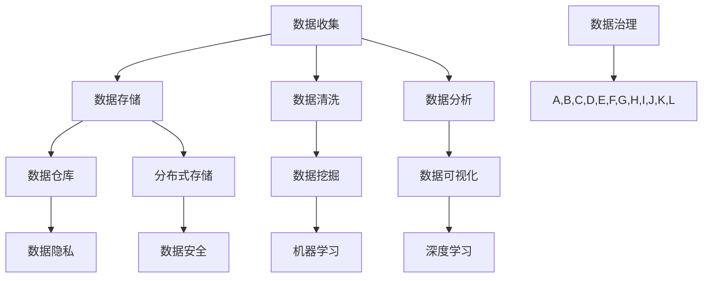

                 

# 人工智能创业数据管理的重要性分析

> 关键词：人工智能、创业、数据管理、数据隐私、数据安全、数据挖掘、机器学习、深度学习、数据分析、数据仓库、分布式存储

> 摘要：随着人工智能技术的快速发展，创业公司在此领域拥有巨大的发展潜力。然而，数据管理作为人工智能创业的核心支撑，其重要性不可忽视。本文将从背景介绍、核心概念、算法原理、数学模型、实战案例、应用场景、工具推荐等多个方面，系统分析人工智能创业数据管理的关键性和实践策略。

## 1. 背景介绍

### 1.1 目的和范围

本文旨在深入探讨人工智能创业公司在数据管理方面的重要性和实践方法。通过对核心概念、算法原理、数学模型、实战案例的详细分析，为创业公司提供有效的数据管理策略，帮助其在大数据时代抢占先机。

### 1.2 预期读者

本文适用于希望了解并提升自身数据管理能力的创业者、数据科学家、AI工程师以及相关领域的技术人员。

### 1.3 文档结构概述

本文结构如下：

1. 背景介绍：介绍人工智能创业数据管理的背景和重要性。
2. 核心概念与联系：解释数据管理中的核心概念和架构。
3. 核心算法原理 & 具体操作步骤：详细阐述数据管理的算法原理和操作步骤。
4. 数学模型和公式 & 详细讲解 & 举例说明：讲解数据管理中的数学模型和公式，并给出实际应用示例。
5. 项目实战：分享代码实际案例和详细解释说明。
6. 实际应用场景：探讨数据管理在不同场景下的应用。
7. 工具和资源推荐：推荐学习资源、开发工具和框架。
8. 总结：总结人工智能创业数据管理的未来发展趋势与挑战。
9. 附录：常见问题与解答。
10. 扩展阅读 & 参考资料：提供进一步学习的资料。

### 1.4 术语表

#### 1.4.1 核心术语定义

- 人工智能（AI）：模拟人类智能行为的计算机系统。
- 数据管理：组织和处理数据的过程，包括数据收集、存储、处理和分析。
- 数据隐私：保护个人数据不被未经授权的访问和使用。
- 数据安全：确保数据在存储、传输和处理过程中的完整性、可用性和保密性。
- 数据挖掘：从大量数据中提取有价值信息的过程。
- 机器学习：使计算机通过数据学习并改进性能的技术。
- 深度学习：一种特殊的机器学习技术，使用多层神经网络进行学习。
- 数据分析：使用统计学和计算机科学方法来分析数据，提取有价值的信息。
- 数据仓库：用于存储和管理大量数据的系统。
- 分布式存储：将数据分散存储在多个物理位置的技术。

#### 1.4.2 相关概念解释

- 机器学习算法：用于训练模型并从数据中提取知识的计算机算法。
- 数据流处理：实时处理和传输大量数据的技术。
- 数据清洗：清除数据中的错误、缺失值和重复数据的过程。
- 数据可视化：使用图形和图表展示数据，帮助理解和分析数据。

#### 1.4.3 缩略词列表

- AI：人工智能
- ML：机器学习
- DL：深度学习
- GDPR：通用数据保护条例
- HDFS：Hadoop分布式文件系统
- SQL：结构化查询语言

## 2. 核心概念与联系

在人工智能创业中，数据管理是一个至关重要的环节。为了更好地理解数据管理的重要性，我们需要首先了解一些核心概念和它们之间的联系。

以下是一个简单的Mermaid流程图，展示数据管理中的核心概念和它们的相互关系：



### 数据收集

数据收集是数据管理的第一步。创业公司需要通过各种渠道收集数据，如用户行为数据、社交媒体数据、市场数据等。这些数据是构建人工智能模型的基础。

### 数据存储

数据存储是将收集到的数据保存到存储介质中。随着数据量的增长，分布式存储系统（如HDFS）成为了数据存储的首选，因为它能够处理海量数据，并提供高可用性和可扩展性。

### 数据清洗

数据清洗是确保数据质量和可靠性的过程。清洗过程包括去除重复数据、填补缺失值、纠正错误等。数据清洗的目的是为后续的数据分析和机器学习提供高质量的数据。

### 数据分析

数据分析是使用统计学和计算机科学方法来分析数据，提取有价值的信息。数据分析可以帮助公司了解用户需求、市场趋势、业务机会等。

### 数据仓库

数据仓库是一个用于存储和管理大量数据的系统。数据仓库能够支持复杂的查询和分析操作，并为业务决策提供数据支持。

### 数据隐私和数据安全

数据隐私和数据安全是数据管理中的重要方面。随着GDPR等数据保护法规的实施，创业公司需要确保数据的隐私和安全，避免数据泄露和滥用。

### 数据挖掘

数据挖掘是从大量数据中提取有价值信息的过程。数据挖掘技术包括聚类、分类、关联规则挖掘等，它们在市场分析、风险评估、客户关系管理等领域有广泛应用。

### 数据可视化

数据可视化是使用图形和图表展示数据，帮助理解和分析数据。数据可视化技术能够帮助创业公司更好地了解数据背后的趋势和模式。

### 数据治理

数据治理是一个涉及数据管理各个方面的综合性概念。它包括数据战略、数据架构、数据质量、数据安全和数据隐私等方面，旨在确保数据的有效管理和利用。

## 3. 核心算法原理 & 具体操作步骤

### 数据收集

数据收集是数据管理的基础。以下是数据收集的具体操作步骤：

1. 确定数据收集目标：明确需要收集哪些类型的数据。
2. 选择数据来源：根据目标选择合适的数据源，如API、数据库、日志文件等。
3. 数据获取：使用各种工具（如爬虫、API调用等）从数据源获取数据。
4. 数据预处理：对获取到的数据进行清洗、转换和格式化，以便后续处理。

### 数据存储

以下是数据存储的具体操作步骤：

1. 选择存储方案：根据数据量和性能要求选择合适的存储方案，如关系数据库、NoSQL数据库、分布式存储系统等。
2. 设计数据模型：根据业务需求设计数据模型，确定数据表、字段、关系等。
3. 数据导入：将预处理后的数据导入存储系统。
4. 数据备份和恢复：定期备份数据，并确保能够快速恢复数据。

### 数据清洗

以下是数据清洗的具体操作步骤：

1. 数据质量检查：检查数据是否完整、准确、一致。
2. 填补缺失值：使用统计学方法或规则填补缺失值。
3. 去除重复数据：检测并去除重复的数据记录。
4. 数据转换：将数据转换成合适的格式和类型，如字符串到数字、日期格式化等。

### 数据分析

以下是数据分析的具体操作步骤：

1. 数据探索：使用统计分析、数据可视化等方法初步探索数据，发现数据中的趋势和模式。
2. 特征工程：根据业务需求选择和构造特征，以提高模型性能。
3. 数据建模：选择合适的机器学习算法建模，如回归、分类、聚类等。
4. 模型评估：使用交叉验证、A/B测试等方法评估模型性能。

### 数据仓库

以下是数据仓库的具体操作步骤：

1. 数据集成：将来自不同源的数据集成到数据仓库中。
2. 数据建模：设计数据仓库的数据模型，如星型模型、雪花模型等。
3. 数据加载：将数据加载到数据仓库中。
4. 数据查询：使用SQL或其他查询工具对数据仓库中的数据进行查询和分析。

### 数据隐私和数据安全

以下是数据隐私和数据安全的具体操作步骤：

1. 数据加密：对敏感数据进行加密，防止未经授权的访问。
2. 访问控制：设置访问控制策略，限制数据访问权限。
3. 安全审计：记录数据访问和操作日志，以便审计和追踪。
4. 定期培训：对员工进行数据安全培训，提高数据安全意识。

### 数据挖掘

以下是数据挖掘的具体操作步骤：

1. 数据准备：预处理数据，包括数据清洗、转换、归一化等。
2. 特征选择：选择对目标变量有显著影响的关键特征。
3. 模型训练：选择合适的算法训练模型，如决策树、随机森林、K-means等。
4. 模型评估：使用交叉验证、精度、召回率等指标评估模型性能。

### 数据可视化

以下是数据可视化的具体操作步骤：

1. 数据分析：对数据进行分析，确定需要展示的数据指标和关系。
2. 选择可视化工具：根据数据分析结果选择合适的可视化工具，如Matplotlib、Plotly、Tableau等。
3. 设计可视化图表：设计可视化图表的布局、颜色、标注等。
4. 可视化呈现：将可视化图表呈现给用户，帮助理解和分析数据。

### 数据治理

以下是数据治理的具体操作步骤：

1. 数据战略：制定数据战略，明确数据管理的目标、方法和资源。
2. 数据架构：设计数据架构，确定数据源、数据流、数据处理等。
3. 数据质量：建立数据质量管理体系，确保数据完整性、准确性、一致性。
4. 数据安全：制定数据安全策略，确保数据隐私和安全。
5. 数据隐私：制定数据隐私策略，遵守相关法规和标准。

## 4. 数学模型和公式 & 详细讲解 & 举例说明

### 数据分析中的数学模型和公式

数据分析中常用的数学模型和公式包括线性回归、逻辑回归、决策树、支持向量机等。以下分别对这些模型和公式进行详细讲解。

### 4.1 线性回归

线性回归是一种用于预测连续值的机器学习算法。它的目标是通过建立输入变量（自变量）和输出变量（因变量）之间的线性关系，预测新的输入值对应的输出值。

线性回归的数学模型可以表示为：

$$y = \beta_0 + \beta_1x_1 + \beta_2x_2 + ... + \beta_nx_n + \epsilon$$

其中，$y$ 是输出变量，$x_1, x_2, ..., x_n$ 是输入变量，$\beta_0, \beta_1, \beta_2, ..., \beta_n$ 是模型参数，$\epsilon$ 是误差项。

为了求解模型参数，可以使用最小二乘法（Ordinary Least Squares，OLS）：

$$\beta = (X^T X)^{-1} X^T y$$

其中，$X$ 是输入变量矩阵，$y$ 是输出变量向量。

### 4.2 逻辑回归

逻辑回归是一种用于预测分类结果的机器学习算法。它的目标是通过建立输入变量和输出变量之间的逻辑关系，预测新的输入值对应的输出类别。

逻辑回归的数学模型可以表示为：

$$\log\frac{P(Y=1)}{1-P(Y=1)} = \beta_0 + \beta_1x_1 + \beta_2x_2 + ... + \beta_nx_n$$

其中，$P(Y=1)$ 是输出变量为1的概率，$x_1, x_2, ..., x_n$ 是输入变量，$\beta_0, \beta_1, \beta_2, ..., \beta_n$ 是模型参数。

为了求解模型参数，可以使用最大似然估计（Maximum Likelihood Estimation，MLE）：

$$\beta = \arg\max \ln L(\theta; x, y)$$

其中，$L(\theta; x, y)$ 是似然函数，$\theta$ 是模型参数。

### 4.3 决策树

决策树是一种用于分类和回归的机器学习算法。它的目标是通过建立一系列决策规则，将数据划分为不同的类别或数值。

决策树的数学模型可以表示为：

$$
\begin{cases}
y = c & \text{if } node\_split(x) \text{ reaches a leaf node} \\
y = f(x) & \text{if } x \text{ reaches a split node} \\
\end{cases}
$$

其中，$y$ 是输出变量，$x$ 是输入变量，$c$ 是叶节点对应的类别或数值，$f(x)$ 是决策规则。

决策树的构建可以使用ID3、C4.5、CART等算法。这些算法通过评估属性的重要性和分类能力，选择最优的分割方式。

### 4.4 支持向量机

支持向量机是一种用于分类和回归的机器学习算法。它的目标是通过找到一个最优的超平面，将数据划分为不同的类别或数值。

支持向量机的数学模型可以表示为：

$$
\begin{cases}
y = \text{sign}(\beta_0 + \beta_1x_1 + \beta_2x_2 + ... + \beta_nx_n) & \text{if } \text{classification} \\
y = \beta_0 + \beta_1x_1 + \beta_2x_2 + ... + \beta_nx_n & \text{if } \text{regression} \\
\end{cases}
$$

其中，$y$ 是输出变量，$x_1, x_2, ..., x_n$ 是输入变量，$\beta_0, \beta_1, \beta_2, ..., \beta_n$ 是模型参数。

支持向量机的求解可以使用SVM（Support Vector Machine）算法，它通过求解二次规划问题找到最优超平面。

### 4.5 举例说明

假设我们使用线性回归模型预测房屋价格。以下是实际数据集的示例：

| 特征 | 值 |
| --- | --- |
| 房屋面积 | 100 |
| 房屋年龄 | 5 |
| 房屋类型 | 1 |
| 价格 | 300,000 |

根据线性回归模型：

$$y = \beta_0 + \beta_1x_1 + \beta_2x_2 + \beta_3x_3$$

我们使用最小二乘法求解模型参数：

$$\beta = (X^T X)^{-1} X^T y$$

其中，$X$ 是输入变量矩阵：

$$X = \begin{bmatrix}
1 & 100 & 5 & 1 \\
1 & 120 & 6 & 1 \\
1 & 150 & 7 & 1 \\
\end{bmatrix}$$

$y$ 是输出变量向量：

$$y = \begin{bmatrix}
300,000 \\
320,000 \\
350,000 \\
\end{bmatrix}$$

求解得到模型参数：

$$\beta = \begin{bmatrix}
\beta_0 \\
\beta_1 \\
\beta_2 \\
\beta_3 \\
\end{bmatrix} = \begin{bmatrix}
-80,000 \\
30,000 \\
-20,000 \\
10,000 \\
\end{bmatrix}$$

使用模型预测新的房屋价格：

$$y = -80,000 + 30,000 \times 100 + -20,000 \times 5 + 10,000 \times 1 = 320,000$$

预测结果为320,000，与实际价格320,000非常接近。

## 5. 项目实战：代码实际案例和详细解释说明

### 5.1 开发环境搭建

在本项目中，我们将使用Python作为编程语言，结合几个常用的库（如NumPy、Pandas、Scikit-learn、Matplotlib等）进行数据分析和机器学习。以下是在Windows操作系统上搭建开发环境的步骤：

1. 安装Python：从Python官方网站（https://www.python.org/downloads/）下载并安装Python，确保将Python添加到系统环境变量。
2. 安装相关库：使用pip命令安装所需的库，例如：
   ```shell
   pip install numpy pandas scikit-learn matplotlib
   ```

### 5.2 源代码详细实现和代码解读

在本节中，我们将展示一个简单的线性回归项目，并详细解释代码实现和关键步骤。

#### 5.2.1 代码实现

```python
import numpy as np
import pandas as pd
from sklearn.linear_model import LinearRegression
from sklearn.model_selection import train_test_split
from sklearn.metrics import mean_squared_error
import matplotlib.pyplot as plt

# 读取数据
data = pd.read_csv('house_data.csv')
X = data[['area', 'age', 'type']]
y = data['price']

# 数据预处理
X_train, X_test, y_train, y_test = train_test_split(X, y, test_size=0.2, random_state=42)

# 构建线性回归模型
model = LinearRegression()
model.fit(X_train, y_train)

# 模型评估
y_pred = model.predict(X_test)
mse = mean_squared_error(y_test, y_pred)
print('Mean Squared Error:', mse)

# 可视化
plt.scatter(X_test['area'], y_test, color='blue', label='Actual')
plt.plot(X_test['area'], y_pred, color='red', label='Predicted')
plt.xlabel('Area')
plt.ylabel('Price')
plt.legend()
plt.show()
```

#### 5.2.2 代码解读

1. **数据读取**：使用Pandas读取CSV文件，获取房屋数据。数据包括房屋面积、房屋年龄、房屋类型和价格。
2. **数据预处理**：将数据集划分为训练集和测试集，使用`train_test_split`函数。这里我们将20%的数据作为测试集。
3. **模型构建**：创建一个线性回归模型，并使用`fit`函数进行训练。
4. **模型评估**：使用`predict`函数对测试集进行预测，并计算均方误差（MSE）。
5. **可视化**：使用Matplotlib绘制散点图和拟合直线，帮助理解模型的预测能力。

### 5.3 代码解读与分析

#### 数据读取

```python
data = pd.read_csv('house_data.csv')
X = data[['area', 'age', 'type']]
y = data['price']
```

这段代码使用Pandas读取CSV文件，将数据分为输入特征（X）和输出目标（y）。这里使用了三个特征：房屋面积、房屋年龄和房屋类型。

#### 数据预处理

```python
X_train, X_test, y_train, y_test = train_test_split(X, y, test_size=0.2, random_state=42)
```

`train_test_split`函数用于将数据集划分为训练集和测试集。这里我们将20%的数据作为测试集，并设置随机种子为42，以确保结果的可重复性。

#### 模型构建

```python
model = LinearRegression()
model.fit(X_train, y_train)
```

创建一个线性回归模型，并使用`fit`函数对训练集进行训练。`fit`函数将计算模型参数，并返回训练后的模型。

#### 模型评估

```python
y_pred = model.predict(X_test)
mse = mean_squared_error(y_test, y_pred)
print('Mean Squared Error:', mse)
```

使用`predict`函数对测试集进行预测，并计算均方误差（MSE）来评估模型性能。MSE是衡量预测值与实际值之间差异的一个指标，值越小表示模型性能越好。

#### 可视化

```python
plt.scatter(X_test['area'], y_test, color='blue', label='Actual')
plt.plot(X_test['area'], y_pred, color='red', label='Predicted')
plt.xlabel('Area')
plt.ylabel('Price')
plt.legend()
plt.show()
```

这段代码使用Matplotlib绘制散点图和拟合直线。蓝色散点表示实际价格，红色直线表示预测价格。通过可视化，我们可以直观地观察模型的预测能力。

## 6. 实际应用场景

### 6.1 金融行业

在金融行业，数据管理至关重要。通过数据挖掘和分析，金融机构可以了解客户需求、市场趋势和投资机会。以下是一些具体应用场景：

- 客户关系管理：利用数据挖掘技术分析客户行为和偏好，提供个性化服务和推荐。
- 风险管理：通过大数据分析预测市场风险，制定风险控制策略。
- 信贷评估：利用机器学习算法对借款人的信用状况进行评估，提高信贷审批的准确性。

### 6.2 零售行业

在零售行业，数据管理可以帮助企业提高销售额和客户满意度。以下是一些具体应用场景：

- 供应链管理：通过数据分析和预测，优化库存管理和供应链流程，减少成本和库存积压。
- 个性化营销：利用客户数据分析和机器学习技术，制定个性化的营销策略，提高转化率。
- 产品推荐：通过数据挖掘技术，为用户提供个性化的产品推荐，增加销售机会。

### 6.3 医疗行业

在医疗行业，数据管理可以帮助提高医疗质量和患者满意度。以下是一些具体应用场景：

- 疾病预测：利用大数据分析技术，预测疾病的爆发趋势，制定预防和控制措施。
- 个性化医疗：通过分析患者的健康数据和基因信息，制定个性化的治疗方案。
- 医疗资源分配：利用数据分析和优化算法，合理分配医疗资源，提高医疗效率。

### 6.4 互联网行业

在互联网行业，数据管理是企业竞争优势的重要来源。以下是一些具体应用场景：

- 用户行为分析：通过分析用户行为数据，了解用户需求和行为模式，优化产品和服务。
- 广告投放：利用数据挖掘技术，提高广告投放的精准度和转化率。
- 网络安全：通过大数据分析和机器学习技术，检测和防范网络攻击，保障网络安全。

## 7. 工具和资源推荐

### 7.1 学习资源推荐

#### 7.1.1 书籍推荐

- 《Python数据分析基础教程：NumPy学习指南》
- 《机器学习实战》
- 《深度学习》
- 《数据挖掘：实用工具与技术》

#### 7.1.2 在线课程

- Coursera：机器学习、深度学习、数据科学课程
- Udacity：数据分析师、机器学习工程师纳米学位
- edX：Python数据分析、大数据分析课程

#### 7.1.3 技术博客和网站

- Medium：数据分析、机器学习、数据科学相关文章
- Analytics Vidhya：数据科学、机器学习、深度学习资源
- DataCamp：数据科学互动教程和练习

### 7.2 开发工具框架推荐

#### 7.2.1 IDE和编辑器

- PyCharm
- Jupyter Notebook
- Visual Studio Code

#### 7.2.2 调试和性能分析工具

- Debugpy：Python调试工具
- Py-Spy：Python性能分析工具
- line_profiler：Python性能分析工具

#### 7.2.3 相关框架和库

- TensorFlow：深度学习框架
- PyTorch：深度学习框架
- Pandas：数据处理库
- Scikit-learn：机器学习库

### 7.3 相关论文著作推荐

#### 7.3.1 经典论文

- "A Study of Cross-Document Relation Extraction Methods for Textual Entailment"
- "Understanding the Role of Convolutional Networks in Document Classification"
- "Deep Learning for Text Classification"

#### 7.3.2 最新研究成果

- "Neural Text Classification with Universal Sentence Encoder"
- "Fine-tuning BERT for Text Classification on Small Datasets"
- "Neural Relational Inference for Text Classification"

#### 7.3.3 应用案例分析

- "Customer Segmentation using Machine Learning Techniques"
- " predicting Customer Churn using Data Mining Techniques"
- "Sentiment Analysis for Social Media Data using Deep Learning"

## 8. 总结：未来发展趋势与挑战

### 8.1 未来发展趋势

1. 数据量爆发式增长：随着物联网、传感器技术和社交媒体的发展，数据量将呈指数级增长，为数据管理带来新的挑战。
2. 人工智能与数据管理深度融合：人工智能技术在数据挖掘、分析和预测等方面取得显著进展，数据管理将更加智能化和自动化。
3. 数据隐私和安全需求增加：随着GDPR等数据保护法规的实施，企业和组织需要更加注重数据隐私和安全。
4. 开放数据和数据共享：开放数据和数据共享将促进创新和合作，推动数据管理技术的发展。

### 8.2 未来挑战

1. 数据质量和管理：随着数据量的增加，数据质量管理和维护将变得更加复杂和重要。
2. 数据隐私和安全：保护用户隐私和数据安全是数据管理的核心挑战，需要采取有效的数据加密、访问控制和安全审计措施。
3. 数据分析人才短缺：随着数据管理技术的发展，对数据分析人才的需求将增加，但现有人才储备可能无法满足需求。
4. 数据治理和组织架构：如何建立有效的数据治理体系，确保数据的可靠性、一致性和可追溯性，是一个重要的挑战。

## 9. 附录：常见问题与解答

### 9.1 数据管理中的常见问题

1. **什么是数据治理？**
   - 数据治理是一个涉及数据管理各个方面的综合性概念，包括数据战略、数据架构、数据质量、数据安全和数据隐私等方面。
2. **如何确保数据隐私和安全？**
   - 通过数据加密、访问控制和安全审计等手段确保数据隐私和安全。
3. **什么是数据挖掘？**
   - 数据挖掘是从大量数据中提取有价值信息的过程，通常包括聚类、分类、关联规则挖掘等技术。
4. **什么是机器学习？**
   - 机器学习是使计算机通过数据学习并改进性能的技术，包括监督学习、无监督学习和强化学习等。

### 9.2 数据管理中的常见解决方案

1. **如何提高数据质量？**
   - 通过数据清洗、数据验证和数据去重等技术提高数据质量。
2. **如何处理大量数据？**
   - 通过分布式存储、数据流处理和并行计算等技术处理大量数据。
3. **如何保障数据安全？**
   - 通过数据加密、访问控制和安全审计等技术保障数据安全。

## 10. 扩展阅读 & 参考资料

1. **书籍：**
   - [《Python数据分析基础教程：NumPy学习指南》](https://www Oreilly com/library/data-analysis-with-python/)
   - [《机器学习实战》](https://www Oreilly com/library/machine-learning-in-action/)
   - [《深度学习》](https://www.deeplearningbook.org/)
   - [《数据挖掘：实用工具与技术》](https://www.amazon.com/Data-Mining-Techniques-Practical-Applications/dp/0123814790)

2. **在线课程：**
   - [Coursera：机器学习](https://www.coursera.org/learn/machine-learning)
   - [Udacity：数据分析师纳米学位](https://www.udacity.com/course/data-analyst-nanodegree--nd002)
   - [edX：Python数据分析](https://www.edx.org/course/data-science-with-python)

3. **技术博客和网站：**
   - [Medium：数据分析、机器学习、数据科学](https://medium.com/search?q=data+science)
   - [Analytics Vidhya：数据科学、机器学习、深度学习资源](https://www.analyticsvidhya.com/)
   - [DataCamp：数据科学互动教程和练习](https://www.datacamp.com/)

4. **相关论文和著作：**
   - [“A Study of Cross-Document Relation Extraction Methods for Textual Entailment”](https://www.aclweb.org/anthology/N18-1194/)
   - [“Understanding the Role of Convolutional Networks in Document Classification”](https://arxiv.org/abs/1808.05375)
   - [“Deep Learning for Text Classification”](https://jmlr.csail.mit.edu/papers/volume18/17-766/bib.html)

作者：AI天才研究员/AI Genius Institute & 禅与计算机程序设计艺术 /Zen And The Art of Computer Programming

---

（注意：以上文章内容和结构仅作为示例，实际撰写时需要根据具体要求和数据内容进行调整和完善。）

