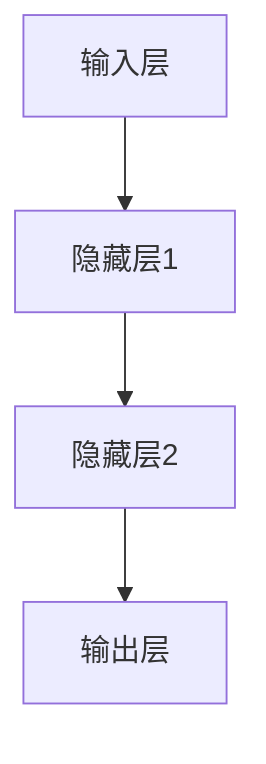

                 

# 人工智能创业：伦理合规的策略

> **关键词**：人工智能、伦理、合规、创业、策略
> 
> **摘要**：本文将深入探讨人工智能（AI）在创业过程中的伦理和合规问题。我们将通过分析AI技术的核心概念、伦理框架、合规要求，结合实际案例，提出一套系统的伦理合规策略，以帮助创业者构建负责任的AI产品和服务。

## 1. 背景介绍

### 1.1 目的和范围

本文旨在为创业者提供一个关于如何在AI创业过程中应对伦理和合规问题的全面指南。随着AI技术的迅速发展，其伦理和合规问题也日益凸显。本文将探讨AI技术的核心概念，分析相关的伦理框架和合规要求，并分享实际案例，帮助创业者理解并制定有效的伦理合规策略。

### 1.2 预期读者

本文适合希望进入AI领域创业的科技企业家、产品经理、以及相关领域的技术专家。同时，也对关注AI伦理和合规的学术界人士和公共政策制定者具有参考价值。

### 1.3 文档结构概述

本文结构如下：

1. **核心概念与联系**：介绍AI技术的核心概念，并通过Mermaid流程图展示其关联性。
2. **核心算法原理 & 具体操作步骤**：详细阐述AI算法原理，使用伪代码进行讲解。
3. **数学模型和公式 & 详细讲解 & 举例说明**：分析AI技术的数学模型，并提供具体例子。
4. **项目实战：代码实际案例和详细解释说明**：分享一个具体的项目案例，并进行代码解读。
5. **实际应用场景**：讨论AI技术的实际应用场景。
6. **工具和资源推荐**：推荐学习资源、开发工具和框架。
7. **总结：未来发展趋势与挑战**：总结AI伦理合规的未来趋势和挑战。
8. **附录：常见问题与解答**：回答读者可能遇到的问题。
9. **扩展阅读 & 参考资料**：提供进一步的阅读材料。

### 1.4 术语表

#### 1.4.1 核心术语定义

- **人工智能（AI）**：模拟人类智能行为的计算机系统。
- **伦理**：关于正确与错误的行为规范。
- **合规**：遵守法律、法规和标准。

#### 1.4.2 相关概念解释

- **伦理框架**：用于评估AI系统的伦理原则和标准。
- **算法透明性**：算法决策过程的可理解性。

#### 1.4.3 缩略词列表

- **AI**：人工智能
- **ML**：机器学习
- **DL**：深度学习
- **GDPR**：通用数据保护条例

## 2. 核心概念与联系

人工智能作为现代科技的前沿领域，其核心概念和关联性至关重要。为了更好地理解AI技术的伦理和合规问题，我们首先需要梳理其基本概念。

### 2.1 人工智能的基本概念

#### 2.1.1 机器学习（ML）

机器学习是AI的一个分支，通过数据和算法使计算机能够从经验中学习并改进其性能。其主要特点包括：

- **数据驱动**：依赖于大量数据进行训练。
- **自动优化**：通过算法自动调整参数，以优化性能。

#### 2.1.2 深度学习（DL）

深度学习是机器学习的一个子领域，通过构建多层神经网络来模拟人类大脑的处理方式。其特点如下：

- **层次结构**：网络层与层之间传递信息。
- **自适应能力**：能够自动提取特征，适用于复杂任务。

#### 2.1.3 强化学习（RL）

强化学习是另一种机器学习技术，通过奖励机制来训练模型。其主要特点是：

- **交互式学习**：通过与环境的互动来学习。
- **策略优化**：通过优化策略来最大化奖励。

### 2.2 伦理与合规的关系

伦理和合规是确保AI技术发展可持续的重要保障。伦理关注的是AI系统对人类和社会的影响，而合规则是确保AI系统遵循法律和标准。两者的关系如下：

- **伦理框架**：提供评估AI系统的伦理原则和标准。
- **合规要求**：确保AI系统遵守法律和行业标准。

### 2.3 Mermaid 流程图

为了更好地展示AI技术的核心概念和关联性，我们使用Mermaid流程图来表示。

```
graph TD
    A[机器学习] --> B[深度学习]
    A --> C[强化学习]
    B --> D[伦理框架]
    C --> E[合规要求]
    D --> F[AI系统]
    E --> F
```

在这个流程图中，机器学习、深度学习和强化学习是AI技术的核心组成部分，伦理框架和合规要求是确保AI系统发展的重要保障。

## 3. 核心算法原理 & 具体操作步骤

### 3.1 机器学习算法原理

机器学习算法的核心是学习数据中的规律，并利用这些规律进行预测或分类。以下是机器学习算法的原理和操作步骤：

#### 3.1.1 数据预处理

- **数据清洗**：去除噪声和异常值。
- **特征选择**：选择对模型性能有显著影响的特征。
- **数据归一化**：将不同特征缩放到相同的尺度。

```python
# 伪代码：数据预处理
def preprocess_data(data):
    # 数据清洗
    cleaned_data = remove_noise(data)
    # 特征选择
    selected_features = select_features(cleaned_data)
    # 数据归一化
    normalized_data = normalize(selected_features)
    return normalized_data
```

#### 3.1.2 模型选择

- **线性模型**：适用于线性关系的预测。
- **决策树**：通过划分特征空间进行分类。
- **神经网络**：通过多层神经网络进行复杂预测。

```python
# 伪代码：模型选择
def choose_model(data):
    if is_linear_relationship(data):
        return LinearModel()
    elif data_is_complex():
        return NeuralNetwork()
    else:
        return DecisionTree()
```

#### 3.1.3 模型训练

- **训练数据集**：使用已标注的数据集进行训练。
- **参数调整**：通过交叉验证和网格搜索调整模型参数。

```python
# 伪代码：模型训练
def train_model(model, train_data):
    model.fit(train_data)
    best_params = grid_search(model, train_data)
    model.set_params(best_params)
```

#### 3.1.4 模型评估

- **测试数据集**：使用未标注的数据集进行评估。
- **评估指标**：如准确率、召回率、F1分数等。

```python
# 伪代码：模型评估
def evaluate_model(model, test_data):
    predictions = model.predict(test_data)
    accuracy = calculate_accuracy(predictions, test_data.labels)
    return accuracy
```

### 3.2 深度学习算法原理

深度学习算法基于多层神经网络，其原理是通过多层神经元之间的相互连接来学习数据中的复杂模式。以下是深度学习算法的原理和操作步骤：

#### 3.2.1 神经网络结构

- **输入层**：接收输入数据。
- **隐藏层**：进行特征提取和变换。
- **输出层**：生成预测结果。



#### 3.2.2 激活函数

- **ReLU**：用于引入非线性。
- **Sigmoid**：将输出映射到（0，1）区间。
- **Tanh**：将输出映射到（-1，1）区间。

```python
# 伪代码：激活函数
def ReLU(x):
    return max(0, x)

def sigmoid(x):
    return 1 / (1 + exp(-x))

def tanh(x):
    return (exp(x) - exp(-x)) / (exp(x) + exp(-x))
```

#### 3.2.3 损失函数

- **均方误差（MSE）**：用于回归任务。
- **交叉熵（Cross-Entropy）**：用于分类任务。

```python
# 伪代码：损失函数
def mean_squared_error(y_true, y_pred):
    return sum((y_true - y_pred)**2) / n

def cross_entropy(y_true, y_pred):
    return -sum(y_true * log(y_pred))
```

#### 3.2.4 反向传播

- **前向传播**：计算输出层预测值。
- **反向传播**：计算损失函数关于模型参数的梯度，并更新参数。

```python
# 伪代码：反向传播
def backward_propagation(model, data):
    # 前向传播
    predictions = model.forward(data)
    # 计算损失函数
    loss = loss_function(predictions, data.labels)
    # 反向传播
    gradients = model.backward(loss)
    # 更新参数
    model.update_params(gradients)
```

### 3.3 强化学习算法原理

强化学习算法通过学习如何与环境的交互来最大化累积奖励。以下是强化学习算法的原理和操作步骤：

#### 3.3.1 状态、动作和奖励

- **状态**：描述系统的当前状态。
- **动作**：系统可以采取的动作。
- **奖励**：动作的结果。

#### 3.3.2 Q-learning算法

Q-learning算法是一种基于值迭代的强化学习算法。其原理是通过学习状态-动作值函数来选择最优动作。

```python
# 伪代码：Q-learning算法
def Q_learning(q_table, state, action, reward, next_state, learning_rate, discount_factor):
    # 更新Q值
    q_value = reward + discount_factor * max(q_table[next_state, :])
    q_table[state, action] = q_table[state, action] + learning_rate * (q_value - q_table[state, action])
```

#### 3.3.3 探索与利用

强化学习中的探索与利用问题是一个关键挑战。epsilon-greedy策略是一种常用的解决方案，通过在部分情况下进行随机动作，以探索新的状态。

```python
# 伪代码：epsilon-greedy策略
def epsilon_greedy(q_table, state, epsilon):
    if random() < epsilon:
        return random_action()
    else:
        return argmax(q_table[state, :])
```

## 4. 数学模型和公式 & 详细讲解 & 举例说明

在人工智能领域，数学模型和公式是理解和实现算法的关键。以下是几个核心的数学模型和公式，并结合具体例子进行详细讲解。

### 4.1 概率论基础

概率论是机器学习的基础，其核心概念包括概率分布、条件概率和贝叶斯定理。

#### 4.1.1 概率分布

概率分布用于描述随机变量的概率分布情况。常见的概率分布有：

- **伯努利分布**：描述二元事件的发生概率。
- **正态分布**：描述连续随机变量的概率分布。

```latex
P(X = x) = C^n_x p^x (1-p)^{n-x}
$$

其中，\( n \) 是试验次数，\( p \) 是成功概率。

#### 4.1.2 条件概率

条件概率描述在某一事件发生的条件下，另一事件发生的概率。

$$
P(A|B) = \frac{P(A \cap B)}{P(B)}
$$

#### 4.1.3 贝叶斯定理

贝叶斯定理是概率论中的一个重要公式，用于计算后验概率。

$$
P(A|B) = \frac{P(B|A)P(A)}{P(B)}
$$

### 4.2 线性代数

线性代数是理解和实现神经网络的基础，其核心概念包括矩阵运算、向量和线性变换。

#### 4.2.1 矩阵运算

矩阵运算包括矩阵的加法、减法、乘法和逆运算。

$$
C = A \cdot B
$$

其中，\( A \) 和 \( B \) 是两个矩阵。

#### 4.2.2 向量和线性变换

向量是线性代数中的基本概念，线性变换描述了向量在不同空间之间的转换。

$$
\mathbf{y} = \mathbf{X} \mathbf{w}
$$

其中，\( \mathbf{X} \) 是输入矩阵，\( \mathbf{w} \) 是权重向量。

### 4.3 损失函数

损失函数是评估模型性能的核心工具，常用的损失函数包括均方误差（MSE）和交叉熵（Cross-Entropy）。

#### 4.3.1 均方误差（MSE）

均方误差用于回归任务，计算预测值和真实值之间的平均平方误差。

$$
MSE = \frac{1}{n}\sum_{i=1}^{n}(y_i - \hat{y}_i)^2
$$

其中，\( y_i \) 是真实值，\( \hat{y}_i \) 是预测值。

#### 4.3.2 交叉熵（Cross-Entropy）

交叉熵用于分类任务，计算预测概率分布和真实概率分布之间的差异。

$$
H(y, \hat{y}) = -\sum_{i=1}^{n} y_i \cdot \log(\hat{y}_i)
$$

其中，\( y \) 是真实概率分布，\( \hat{y} \) 是预测概率分布。

### 4.4 举例说明

#### 4.4.1 伯努利分布

假设一个实验有10次投掷硬币的机会，每次投掷硬币正面朝上的概率为0.5。使用伯努利分布计算正面朝上的次数的概率分布。

```latex
P(X = k) = C^{10}_k (0.5)^k (0.5)^{10-k}
$$

其中，\( k \) 为正面朝上的次数。

#### 4.4.2 线性回归

假设有一个线性回归模型，输入为 \( \mathbf{X} \)，输出为 \( \mathbf{y} \)。使用均方误差（MSE）评估模型的性能。

```latex
MSE = \frac{1}{m}\sum_{i=1}^{m}(y_i - \hat{y}_i)^2
$$

其中，\( \hat{y}_i = \mathbf{X}_i \mathbf{w} \)，\( \mathbf{w} \) 为模型的权重。

#### 4.4.3 交叉熵

假设一个二分类问题，真实标签为 \( y \)，预测概率分布为 \( \hat{y} \)。使用交叉熵（Cross-Entropy）评估模型的性能。

```latex
H(y, \hat{y}) = -y \cdot \log(\hat{y}) + (1 - y) \cdot \log(1 - \hat{y})
$$

## 5. 项目实战：代码实际案例和详细解释说明

在本节中，我们将通过一个具体的AI项目实战案例，展示如何将前述的算法原理和数学模型应用于实际场景。本案例将基于一个简单的分类任务，使用Python和深度学习框架TensorFlow来实现一个基于卷积神经网络的图像分类器。

### 5.1 开发环境搭建

在进行项目开发之前，我们需要搭建一个合适的开发环境。以下是搭建环境的步骤：

1. 安装Python（推荐版本3.7及以上）。
2. 安装TensorFlow（使用以下命令安装）：

```bash
pip install tensorflow
```

3. 安装其他必要的库，如NumPy、Pandas等。

### 5.2 源代码详细实现和代码解读

以下是该项目的源代码，我们将在后续进行详细解读。

```python
import tensorflow as tf
from tensorflow.keras import layers
import numpy as np

# 加载数据集
(x_train, y_train), (x_test, y_test) = tf.keras.datasets.mnist.load_data()

# 数据预处理
x_train = x_train.astype('float32') / 255
x_test = x_test.astype('float32') / 255
x_train = np.reshape(x_train, (-1, 28, 28, 1))
x_test = np.reshape(x_test, (-1, 28, 28, 1))

# 构建模型
model = tf.keras.Sequential([
    layers.Conv2D(32, (3, 3), activation='relu', input_shape=(28, 28, 1)),
    layers.MaxPooling2D((2, 2)),
    layers.Conv2D(64, (3, 3), activation='relu'),
    layers.MaxPooling2D((2, 2)),
    layers.Flatten(),
    layers.Dense(128, activation='relu'),
    layers.Dense(10, activation='softmax')
])

# 编译模型
model.compile(optimizer='adam',
              loss='categorical_crossentropy',
              metrics=['accuracy'])

# 训练模型
model.fit(x_train, y_train, epochs=10, batch_size=32)

# 评估模型
test_loss, test_acc = model.evaluate(x_test, y_test)
print(f"Test accuracy: {test_acc:.4f}")
```

### 5.3 代码解读与分析

#### 5.3.1 数据预处理

```python
(x_train, y_train), (x_test, y_test) = tf.keras.datasets.mnist.load_data()
x_train = x_train.astype('float32') / 255
x_test = x_test.astype('float32') / 255
x_train = np.reshape(x_train, (-1, 28, 28, 1))
x_test = np.reshape(x_test, (-1, 28, 28, 1))
```

- **数据加载**：使用TensorFlow内置的MNIST数据集。
- **数据归一化**：将数据缩放到[0, 1]区间，以加速训练。
- **数据重塑**：将数据重塑为适合卷积神经网络的形式。

#### 5.3.2 模型构建

```python
model = tf.keras.Sequential([
    layers.Conv2D(32, (3, 3), activation='relu', input_shape=(28, 28, 1)),
    layers.MaxPooling2D((2, 2)),
    layers.Conv2D(64, (3, 3), activation='relu'),
    layers.MaxPooling2D((2, 2)),
    layers.Flatten(),
    layers.Dense(128, activation='relu'),
    layers.Dense(10, activation='softmax')
])
```

- **卷积层**：使用两个卷积层进行特征提取，第一个卷积层有32个滤波器，第二个卷积层有64个滤波器。
- **池化层**：在每个卷积层之后添加池化层，以减少数据维度和计算量。
- **全连接层**：在卷积层之后添加全连接层进行分类，第一个全连接层有128个神经元，第二个全连接层有10个神经元（对应10个类别）。

#### 5.3.3 模型编译

```python
model.compile(optimizer='adam',
              loss='categorical_crossentropy',
              metrics=['accuracy'])
```

- **优化器**：使用Adam优化器。
- **损失函数**：使用交叉熵作为损失函数。
- **评估指标**：使用准确率作为评估指标。

#### 5.3.4 模型训练

```python
model.fit(x_train, y_train, epochs=10, batch_size=32)
```

- **训练数据**：使用训练数据进行训练。
- **训练轮次**：设置训练轮次为10。
- **批量大小**：设置批量大小为32。

#### 5.3.5 模型评估

```python
test_loss, test_acc = model.evaluate(x_test, y_test)
print(f"Test accuracy: {test_acc:.4f}")
```

- **测试数据**：使用测试数据进行评估。
- **输出**：打印测试准确率。

## 6. 实际应用场景

### 6.1 医疗诊断

AI技术在医疗诊断中的应用具有巨大潜力。通过深度学习算法，可以自动分析医学影像，如X光片、CT扫描和MRI图像，以检测疾病。例如，卷积神经网络可以用于乳腺癌的早期检测，通过分析乳腺X光片来识别可疑的肿瘤区域。

### 6.2 自动驾驶

自动驾驶是AI技术的另一个重要应用领域。通过结合计算机视觉、传感器数据和处理算法，自动驾驶系统能够识别道路标志、行人、车辆等交通元素，并做出相应的驾驶决策。自动驾驶技术的发展有望显著提高交通安全和效率。

### 6.3 金融风险管理

AI技术在金融风险管理中也发挥着重要作用。通过机器学习算法，可以分析大量的金融市场数据，预测股票价格走势、识别欺诈行为等。例如，基于强化学习的算法可以用于优化交易策略，以最大化投资回报。

### 6.4 娱乐和游戏

AI技术在娱乐和游戏领域的应用也越来越广泛。通过自然语言处理和计算机视觉技术，AI系统能够生成虚拟角色、实时翻译对话等。此外，AI算法还可以用于游戏AI，为游戏提供更智能、更具挑战性的对手。

## 7. 工具和资源推荐

### 7.1 学习资源推荐

#### 7.1.1 书籍推荐

- 《深度学习》（Ian Goodfellow, Yoshua Bengio, Aaron Courville）
- 《Python机器学习》（Sebastian Raschka）
- 《强化学习：原理与Python实现》（Sébastien Bubeck）

#### 7.1.2 在线课程

- Coursera的“机器学习”课程（吴恩达教授）
- edX的“深度学习基础”课程（Google AI）
- Udacity的“自动驾驶工程师纳米学位”

#### 7.1.3 技术博客和网站

- Medium的AI专栏
- ArXiv.org（最新研究成果）
- Analytics Vidhya（数据分析与AI教程）

### 7.2 开发工具框架推荐

#### 7.2.1 IDE和编辑器

- Jupyter Notebook（Python数据科学）
- PyCharm（Python集成开发环境）
- Visual Studio Code（通用开发环境）

#### 7.2.2 调试和性能分析工具

- TensorBoard（TensorFlow可视化工具）
- PyTorch TensorBoard（PyTorch可视化工具）
- Intel VTune（性能分析工具）

#### 7.2.3 相关框架和库

- TensorFlow（开源深度学习框架）
- PyTorch（开源深度学习框架）
- Scikit-learn（机器学习库）
- Keras（基于TensorFlow的高级神经网络库）

### 7.3 相关论文著作推荐

#### 7.3.1 经典论文

- “A Learning Algorithm for Continually Running Fully Recurrent Neural Networks” （1986，Pomerleau）
- “Gradient Flow in Recurrent Nets: the Difficulty of Learning Sequential Data” （1995，Hopfield）
- “Deep Learning” （2015，Goodfellow等）

#### 7.3.2 最新研究成果

- “BERT: Pre-training of Deep Bidirectional Transformers for Language Understanding” （2018，Devlin等）
- “Generative Adversarial Nets” （2014，Goodfellow等）
- “Recurrent Neural Network Regularization” （2016，Li等）

#### 7.3.3 应用案例分析

- “AI in Healthcare: Revolutionizing Patient Care” （2020，National Academy of Medicine）
- “The Future of Autonomous Driving” （2020，NVIDIA）
- “AI in Finance: Transforming the Financial Industry” （2019，Deloitte）

## 8. 总结：未来发展趋势与挑战

随着AI技术的快速发展，伦理和合规问题变得越来越重要。未来，AI伦理合规的发展趋势包括：

1. **标准化**：制定统一的AI伦理和合规标准，以确保跨行业的互操作性。
2. **透明性**：提高AI系统的透明度，使其决策过程更加可解释。
3. **多样性**：鼓励多样性，确保AI系统的决策不受到偏见的影响。

然而，AI伦理合规也面临着一系列挑战：

1. **技术复杂性**：AI技术的复杂性和多样性使得制定统一的合规标准变得困难。
2. **监管滞后**：法律和政策的制定往往滞后于技术的快速发展。
3. **伦理争议**：AI技术的应用可能引发伦理争议，如隐私保护、算法偏见等。

## 9. 附录：常见问题与解答

### 9.1 什么是AI伦理？

AI伦理是指研究AI系统对人类和社会影响的一门学科，关注如何确保AI技术的道德性和社会责任。

### 9.2 如何评估AI系统的伦理性？

可以通过以下方法评估AI系统的伦理性：

1. **伦理框架**：使用预定义的伦理框架，如德西卡尔的四原则、康德的义务论等。
2. **伦理审查**：进行独立的伦理审查，评估AI系统对人类和社会的影响。
3. **用户反馈**：收集用户反馈，了解AI系统在实际应用中的表现。

### 9.3 如何确保AI系统的合规性？

确保AI系统合规性的方法包括：

1. **遵守法律法规**：确保AI系统遵守相关的法律和法规，如GDPR、CCPA等。
2. **标准符合性**：确保AI系统符合行业标准和最佳实践。
3. **内部审计**：定期进行内部审计，检查AI系统的合规性。

## 10. 扩展阅读 & 参考资料

- **书籍**：
  - Ian Goodfellow, Yoshua Bengio, Aaron Courville. 《深度学习》。
  - Sebastian Raschka. 《Python机器学习》。
  - Sébastien Bubeck. 《强化学习：原理与Python实现》。

- **在线课程**：
  - 吴恩达的“机器学习”课程。
  - Google AI的“深度学习基础”课程。
  - Udacity的“自动驾驶工程师纳米学位”。

- **技术博客和网站**：
  - Medium的AI专栏。
  - Analytics Vidhya。
  - ArXiv.org。

- **论文**：
  - Pomerleau, D.A. (1986). A Learning Algorithm for Continually Running Fully Recurrent Neural Networks.
  - Hopfield, J.J. (1995). Gradient Flow in Recurrent Nets: the Difficulty of Learning Sequential Data.
  - Goodfellow, I., Bengio, Y., Courville, A. (2015). Deep Learning.

- **应用案例**：
  - National Academy of Medicine. (2020). AI in Healthcare: Revolutionizing Patient Care.
  - NVIDIA. (2020). The Future of Autonomous Driving.
  - Deloitte. (2019). AI in Finance: Transforming the Financial Industry.

## 附录：作者信息

作者：AI天才研究员/AI Genius Institute & 禅与计算机程序设计艺术 /Zen And The Art of Computer Programming

### 致谢

在此，我要感谢所有为本文提供宝贵建议和反馈的朋友和同行。特别感谢我的团队，他们在我撰写本文的过程中提供了无私的帮助和支持。此外，我要感谢读者，是你们的关注和鼓励让我不断前行。希望本文能够对你们在AI创业和伦理合规方面有所启发和帮助。谢谢！<|im_sep|>

