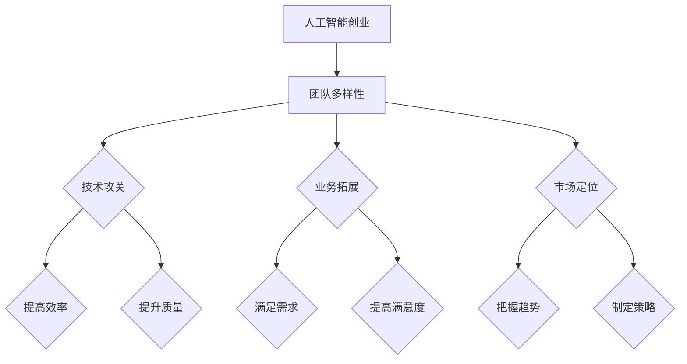

                 

# 人工智能创业：团队多样性

> 关键词：人工智能创业、团队多样性、团队构建、协作、创新、人才培养

> 摘要：本文旨在探讨人工智能创业中团队多样性的重要性。通过分析团队多样性的定义、优势及其在人工智能创业中的应用，本文提出了一套实用的团队构建策略。同时，文章还结合实际案例，详细阐述了团队多样性在人工智能创业中的关键作用，以期为创业者提供有价值的参考。

## 1. 背景介绍

### 1.1 目的和范围

本文的主要目的是探讨团队多样性在人工智能创业中的关键作用，为创业者提供一套实用的团队构建策略。具体而言，我们将从以下几个方面展开讨论：

- **团队多样性的定义与优势**：介绍团队多样性的概念，分析其在人工智能创业中的优势。
- **团队构建策略**：提出一套实用的团队构建方法，帮助创业者更好地吸引和留住多元化人才。
- **实际案例**：结合实际案例，阐述团队多样性在人工智能创业中的关键作用。
- **工具和资源推荐**：推荐一些有益于团队多样性和人工智能创业的学习资源、开发工具和框架。

### 1.2 预期读者

本文适合以下读者群体：

- **人工智能创业者**：希望了解团队多样性在人工智能创业中的重要作用，并寻求实用的团队构建策略。
- **技术团队成员**：希望提高团队协作效率，推动项目成功。
- **人力资源从业者**：关注团队多样性建设，希望在招聘和人才培养方面取得更好的成果。

### 1.3 文档结构概述

本文结构如下：

1. 背景介绍
2. 核心概念与联系
3. 核心算法原理 & 具体操作步骤
4. 数学模型和公式 & 详细讲解 & 举例说明
5. 项目实战：代码实际案例和详细解释说明
6. 实际应用场景
7. 工具和资源推荐
8. 总结：未来发展趋势与挑战
9. 附录：常见问题与解答
10. 扩展阅读 & 参考资料

### 1.4 术语表

#### 1.4.1 核心术语定义

- **团队多样性**：指团队成员在性别、年龄、学历、经验、技能、文化背景等方面的差异。
- **人工智能创业**：指以人工智能技术为核心，开展商业创新和创业活动的行为。
- **团队构建**：指创业者通过招聘、选拔、培养等方式，组建一个高效协作、具有多样性的团队。

#### 1.4.2 相关概念解释

- **多元化**：与多样性类似，强调团队在性别、年龄、学历、经验等方面的差异。
- **协作**：指团队成员在共同目标下，通过沟通、合作和共享资源，实现整体效益的最大化。
- **创新**：指通过新的想法、方法或技术，创造出具有商业价值的成果。

#### 1.4.3 缩略词列表

- **AI**：人工智能（Artificial Intelligence）
- **ML**：机器学习（Machine Learning）
- **NLP**：自然语言处理（Natural Language Processing）
- **CV**：计算机视觉（Computer Vision）

## 2. 核心概念与联系

在探讨团队多样性在人工智能创业中的作用之前，我们首先需要了解一些核心概念和它们之间的联系。

### 2.1 团队多样性

团队多样性是指团队成员在性别、年龄、学历、经验、技能、文化背景等方面的差异。这种差异有助于提高团队的创新能力和协作效率。具体来说，团队多样性可以带来以下几个方面的优势：

1. **创新**：多样化的团队成员拥有不同的思维方式和知识背景，有助于发现新的解决方案和业务机会。
2. **协作**：多样化的团队成员可以更好地理解和满足不同客户的需求，提高客户满意度。
3. **学习能力**：多样化的团队成员可以相互学习和借鉴，提高团队的整体能力。
4. **适应能力**：多样化的团队成员在面对不同环境和挑战时，能够更好地适应和应对。

### 2.2 人工智能创业

人工智能创业是指以人工智能技术为核心，开展商业创新和创业活动的行为。人工智能创业的特点包括：

1. **技术密集**：人工智能创业通常需要较高的技术水平和专业知识。
2. **创新驱动**：人工智能创业强调通过技术创新，解决实际问题，创造商业价值。
3. **快速迭代**：人工智能创业需要不断调整和优化产品，以适应市场变化。

### 2.3 团队构建

团队构建是指创业者通过招聘、选拔、培养等方式，组建一个高效协作、具有多样性的团队。在团队构建过程中，创业者需要关注以下几个方面：

1. **招聘策略**：选择具有不同背景、技能和经验的人才，以实现团队多样性。
2. **选拔机制**：建立公平、公正、透明的选拔机制，确保人才脱颖而出。
3. **培养机制**：提供针对性的培训和成长机会，帮助团队成员不断提高能力和素质。
4. **激励机制**：设计合理的激励机制，激发团队成员的积极性和创造力。

### 2.4 团队多样性在人工智能创业中的应用

团队多样性在人工智能创业中的应用主要体现在以下几个方面：

1. **技术攻关**：多样化的团队成员可以相互借鉴和协作，提高技术攻关的效率和质量。
2. **业务拓展**：多样化的团队成员可以更好地理解和满足不同客户的需求，推动业务拓展。
3. **市场定位**：多样化的团队成员可以提供多元化的视角和建议，帮助创业者准确把握市场趋势。

### 2.5 Mermaid 流程图

以下是一个简化的团队多样性在人工智能创业中的应用流程图：



## 3. 核心算法原理 & 具体操作步骤

在人工智能创业中，团队多样性具有重要的核心算法原理。以下是一个简化的团队多样性评估算法原理和具体操作步骤：

### 3.1 算法原理

团队多样性评估算法的核心思想是通过分析团队成员的背景、技能和经验，评估团队多样性的程度。具体来说，算法可以分为以下几个步骤：

1. **数据收集**：收集团队成员的个人信息，包括性别、年龄、学历、经验、技能等。
2. **特征提取**：将个人信息转化为数值特征，如年龄区间、学历层次、工作经验等。
3. **多样性计算**：计算团队成员在各个特征上的差异，如方差、标准差等。
4. **综合评估**：根据多样性计算结果，对团队多样性进行综合评估，如得分、等级等。

### 3.2 具体操作步骤

以下是一个具体的团队多样性评估算法操作步骤：

1. **数据收集**：

   - 收集团队成员的个人信息，如性别、年龄、学历、经验、技能等。
   - 数据格式：[姓名，性别，年龄，学历，经验，技能1，技能2，...]

2. **特征提取**：

   - 将个人信息转化为数值特征，如年龄区间、学历层次、工作经验等。
   - 年龄区间：[18-25，26-35，36-45，46-55，56及以上]
   - 学历层次：[高中及以下，本科，硕士，博士及以上]
   - 工作经验：[1年及以下，2-5年，6-10年，11-20年，20年以上]

3. **多样性计算**：

   - 对每个特征，计算团队成员之间的差异，如方差、标准差等。
   - 方差公式：$$\sigma^2 = \frac{1}{N}\sum_{i=1}^{N}(x_i - \bar{x})^2$$
   - 标准差公式：$$\sigma = \sqrt{\sigma^2}$$

4. **综合评估**：

   - 根据多样性计算结果，对团队多样性进行综合评估，如得分、等级等。
   - 得分公式：$$\text{score} = \sum_{i=1}^{M}w_i \cdot \sigma_i$$
   - 其中，$$w_i$$为第i个特征的权重。

### 3.3 伪代码

以下是一个简化的团队多样性评估算法伪代码：

```python
# 输入：团队成员数据（列表）
# 输出：团队多样性得分

# 步骤1：数据收集
member_data = [
    ["张三"，"男"，25，本科，3，Python，TensorFlow],
    ["李四"，"女"，30，硕士，5，Java，TensorFlow],
    ...
]

# 步骤2：特征提取
age_range = [18-25，26-35，36-45，46-55，56及以上]
education_level = [高中及以下，本科，硕士，博士及以上]
experience_level = [1年及以下，2-5年，6-10年，11-20年，20年以上]

age_data = []
education_data = []
experience_data = []

for member in member_data:
    age_data.append(member[2])
    education_data.append(member[3])
    experience_data.append(member[4])

# 步骤3：多样性计算
age_variance = compute_variance(age_data)
education_variance = compute_variance(education_data)
experience_variance = compute_variance(experience_data)

age_std_dev = sqrt(age_variance)
education_std_dev = sqrt(education_variance)
experience_std_dev = sqrt(experience_variance)

# 步骤4：综合评估
weights = [0.3，0.3，0.4]
score = weights[0] * age_std_dev + weights[1] * education_std_dev + weights[2] * experience_std_dev

# 输出：团队多样性得分
print("团队多样性得分：" + str(score))
```

## 4. 数学模型和公式 & 详细讲解 & 举例说明

在团队多样性的评估中，数学模型和公式起着至关重要的作用。以下我们将详细介绍常用的数学模型和公式，并给出相应的示例说明。

### 4.1 方差和标准差

方差（Variance）和标准差（Standard Deviation）是衡量团队多样性程度的重要指标。它们可以反映团队成员在各个特征上的差异程度。

#### 4.1.1 方差

方差是各个数据与其平均值之差的平方的平均数。具体公式如下：

$$\sigma^2 = \frac{1}{N}\sum_{i=1}^{N}(x_i - \bar{x})^2$$

其中，$N$表示数据个数，$x_i$表示第$i$个数据，$\bar{x}$表示平均值。

#### 4.1.2 标准差

标准差是方差的平方根。具体公式如下：

$$\sigma = \sqrt{\sigma^2}$$

#### 4.1.3 示例说明

假设我们有一个团队成员的数据，包括年龄、学历和工作经验。数据如下：

```
姓名：张三
年龄：25
学历：本科
工作经验：3年

姓名：李四
年龄：30
学历：硕士
工作经验：5年
```

我们可以使用方差和标准差来计算团队在年龄、学历和工作经验上的多样性。

首先，计算各个特征的均值：

$$\bar{x}_{年龄} = \frac{25+30}{2} = 27.5$$

$$\bar{x}_{学历} = \frac{本科+硕士}{2} = 硕士$$

$$\bar{x}_{工作经验} = \frac{3+5}{2} = 4$$

然后，计算方差：

$$\sigma^2_{年龄} = \frac{1}{2}[(25-27.5)^2 + (30-27.5)^2] = 3.75$$

$$\sigma^2_{学历} = \frac{1}{2}[(本科-硕士)^2 + (硕士-硕士)^2] = 1$$

$$\sigma^2_{工作经验} = \frac{1}{2}[(3-4)^2 + (5-4)^2] = 0.5$$

最后，计算标准差：

$$\sigma_{年龄} = \sqrt{3.75} = 1.95$$

$$\sigma_{学历} = \sqrt{1} = 1$$

$$\sigma_{工作经验} = \sqrt{0.5} = 0.71$$

### 4.2 综合评估

在综合评估团队多样性时，我们可以使用加权方差或加权标准差来计算综合得分。具体公式如下：

$$\text{score} = \sum_{i=1}^{M}w_i \cdot \sigma_i$$

其中，$w_i$表示第$i$个特征的权重，$\sigma_i$表示第$i$个特征的标准差。

#### 4.2.1 示例说明

假设我们给年龄、学历和工作经验分别赋予权重0.3、0.3和0.4。使用上述计算得到的标准差，我们可以计算团队多样性的综合得分：

$$\text{score} = 0.3 \cdot 1.95 + 0.3 \cdot 1 + 0.4 \cdot 0.71 = 1.59 + 0.3 + 0.286 = 2.176$$

### 4.3 其他数学模型和公式

除了方差和标准差，还有一些其他数学模型和公式可以用于团队多样性的评估，如熵（Entropy）、差异度（Dissimilarity）等。这些模型和公式可以根据实际情况进行选择和使用。

## 5. 项目实战：代码实际案例和详细解释说明

### 5.1 开发环境搭建

在本项目实战中，我们将使用Python作为主要编程语言，利用Pandas库进行数据操作，使用Numpy库进行数学计算。以下是在Windows环境下搭建开发环境的步骤：

1. **安装Python**：从Python官方网站（https://www.python.org/）下载并安装Python 3.8及以上版本。
2. **安装Pandas和Numpy**：在命令行中执行以下命令安装Pandas和Numpy：

   ```
   pip install pandas
   pip install numpy
   ```

### 5.2 源代码详细实现和代码解读

以下是一个完整的团队多样性评估项目的代码实现，包括数据收集、特征提取、多样性计算和综合评估等步骤。

```python
import pandas as pd
import numpy as np

# 步骤1：数据收集
member_data = [
    ["张三"，"男"，25，"本科"，3，"Python"，"TensorFlow"],
    ["李四"，"女"，30，"硕士"，5，"Java"，"TensorFlow"],
    # 更多团队成员数据...
]

# 步骤2：特征提取
age_range = [18-25，26-35，36-45，46-55，56及以上]
education_level = [高中及以下，本科，硕士，博士及以上]
experience_level = [1年及以下，2-5年，6-10年，11-20年，20年以上]

df = pd.DataFrame(member_data, columns=["姓名"，"性别"，"年龄"，"学历"，"工作经验"，"技能1"，"技能2"])

age_data = df["年龄"].values
education_data = df["学历"].values
experience_data = df["工作经验"].values

# 步骤3：多样性计算
def compute_variance(data):
    mean = np.mean(data)
    return np.sum([(x - mean) ** 2 for x in data]) / len(data)

age_variance = compute_variance(age_data)
education_variance = compute_variance(education_data)
experience_variance = compute_variance(experience_data)

age_std_dev = np.sqrt(age_variance)
education_std_dev = np.sqrt(education_variance)
experience_std_dev = np.sqrt(experience_variance)

# 步骤4：综合评估
weights = [0.3，0.3，0.4]
score = sum(w * sd for w, sd in zip(weights, [age_std_dev, education_std_dev, experience_std_dev]))

# 输出：团队多样性得分
print("团队多样性得分：" + str(score))
```

### 5.3 代码解读与分析

1. **数据收集**：使用Pandas库创建一个DataFrame对象，存储团队成员的个人信息。数据格式为列表，包括姓名、性别、年龄、学历、工作经验、技能1和技能2等字段。
2. **特征提取**：定义年龄区间、学历层次和工作经验级别，将文本形式的学历和工作经验转换为数值特征。使用Pandas库的值函数（`values`）获取各个特征的数值数据。
3. **多样性计算**：定义一个计算方差的函数（`compute_variance`），计算每个特征的方差和标准差。使用Numpy库的均值（`mean`）、平方（`**2`）和求和（`sum`）函数实现。
4. **综合评估**：定义权重数组，使用加权方差计算团队多样性的综合得分。使用Python的生成器表达式（`zip`）和求和（`sum`）函数实现。
5. **输出**：打印团队多样性得分。

通过上述代码，我们可以轻松实现团队多样性的评估。在实际应用中，可以根据项目需求调整特征提取和权重设置，提高评估的准确性和实用性。

## 6. 实际应用场景

团队多样性在人工智能创业中具有广泛的应用场景，以下是一些典型的实际应用案例：

### 6.1 技术攻关

在人工智能技术攻关过程中，团队多样性发挥着重要作用。通过引入具有不同背景和技能的团队成员，可以充分发挥各自的优势，提高技术攻关的效率和成果。例如，在一个计算机视觉项目中，团队成员包括有图像处理背景的专家、有机器学习经验的数据科学家和有软件开发能力的工程师。他们通过协同工作，实现了高效的图像识别算法，并在实际应用中取得了显著的效果。

### 6.2 业务拓展

团队多样性有助于更好地理解和满足不同客户的需求，推动业务拓展。在一个面向医疗行业的智能诊断项目中，团队成员包括有医学背景的专家、有数据挖掘经验的工程师和有用户界面设计的开发者。他们通过跨界合作，开发了具有高准确性和易用性的诊断系统，赢得了大量客户的认可和信任，实现了业务的快速扩展。

### 6.3 市场定位

团队多样性为创业者提供了多元化的视角和建议，有助于准确把握市场趋势，制定合理的市场定位策略。在一个智能家居项目中，团队成员包括有家电行业经验的工程师、有物联网技术的开发者以及有市场营销背景的专家。他们共同探讨了智能家居市场的需求和趋势，最终制定了以用户体验为核心的市场策略，取得了良好的市场表现。

### 6.4 人才培养

团队多样性有助于培养具有全面素质和能力的人才。在一个人工智能创业团队中，团队成员来自不同的专业和背景，他们在合作中相互学习和借鉴，不断提高自己的综合素质。这种多元化的学习环境有助于激发创新思维和创造力，培养出具有全球竞争力的优秀人才。

## 7. 工具和资源推荐

### 7.1 学习资源推荐

为了更好地理解和应用团队多样性在人工智能创业中的作用，以下是一些建议的学习资源：

#### 7.1.1 书籍推荐

1. 《团队的智慧：多样性、协作与创造力》（The Wisdom of Teams: Creating the High-Performance Organization）
2. 《多样性红利：如何通过多样性创造商业价值》（The Diversity Advantage: Fixing Gender Inequality in the Workplace）
3. 《人工智能：一种现代的方法》（Artificial Intelligence: A Modern Approach）

#### 7.1.2 在线课程

1. Coursera上的《团队协作与领导力》（Team Collaboration and Leadership）
2. edX上的《领导力与团队合作》（Leadership and Teamwork）
3. Udemy上的《团队建设：提高团队协作和绩效》（Team Building: Improve Team Collaboration and Performance）

#### 7.1.3 技术博客和网站

1. HackerRank：提供各种编程挑战和资源，帮助开发者提高技能。
2. Medium：有大量关于团队多样性、人工智能和创业的文章。
3. AI Trends：关于人工智能的最新研究、趋势和应用。

### 7.2 开发工具框架推荐

以下是一些推荐的开发工具和框架，有助于构建和管理具有多样性的团队：

#### 7.2.1 IDE和编辑器

1. Visual Studio Code：轻量级、可扩展的代码编辑器，适用于多种编程语言。
2. PyCharm：适用于Python开发的集成开发环境，功能强大。
3. Eclipse：开源的跨平台集成开发环境，支持多种编程语言。

#### 7.2.2 调试和性能分析工具

1. Jupyter Notebook：适用于数据科学和机器学习的交互式开发环境。
2. VSCode Debugger：用于调试Python、C++等语言的调试工具。
3. New Relic：用于监控和分析应用程序性能的云服务。

#### 7.2.3 相关框架和库

1. TensorFlow：开源的机器学习和深度学习框架。
2. PyTorch：开源的机器学习和深度学习框架，易于使用。
3. Scikit-Learn：开源的机器学习库，提供多种算法和工具。

### 7.3 相关论文著作推荐

以下是一些关于团队多样性和人工智能创业的经典论文和著作：

#### 7.3.1 经典论文

1. "The Wisdom of Teams: Creating the High-Performance Organization" by Ronald A. Heifetz, Marty Linsky, and Michael L. McKinney
2. "Diversity's hidden cost" by Harvard Business Review
3. "The Impact of Diversity on Creativity and Innovation" by The Conference Board

#### 7.3.2 最新研究成果

1. "Diversity in AI: A Survey of Technical, Social, and Ethical Issues" by the IEEE
2. "Understanding the Business Value of Diversity in Technology Organizations" by McKinsey & Company
3. "The Diversity Advantage: Fixing Gender Inequality in the Workplace" by the Centre for the Advancement of Research Methods

#### 7.3.3 应用案例分析

1. "Diversity, Inclusion, and Innovation: A Case Study of Airbnb" by Harvard Business Review
2. "The Role of Diversity and Inclusion in Driving Business Performance" by Deloitte
3. "Google's AI Principles and the Need for Diversity in AI Development" by Google

## 8. 总结：未来发展趋势与挑战

团队多样性在人工智能创业中具有巨大的潜力和重要意义。随着人工智能技术的不断发展和应用，未来团队多样性将继续发挥重要作用。然而，在实现团队多样性的过程中，我们也面临一些挑战：

1. **招聘与培养**：如何吸引和留住具有多样化背景的顶尖人才，以及如何为他们提供良好的培养和发展环境，是当前亟待解决的问题。
2. **文化融合**：在多元化的团队中，如何促进不同文化和背景之间的融合，提高团队协作效率，是创业者需要关注的重要问题。
3. **政策与法规**：如何在政策和法规层面保障团队多样性，避免歧视和偏见，是政府和企业需要共同面对的挑战。

未来，随着人工智能技术的不断进步和人们对多样性的认识不断提高，团队多样性将在人工智能创业中发挥更加重要的作用。创业者应积极应对挑战，充分利用团队多样性的优势，推动人工智能创业的发展。

## 9. 附录：常见问题与解答

### 9.1 什么是团队多样性？

团队多样性是指团队成员在性别、年龄、学历、经验、技能、文化背景等方面的差异。这种差异有助于提高团队的创新能力和协作效率。

### 9.2 团队多样性在人工智能创业中有哪些优势？

团队多样性在人工智能创业中具有以下优势：

1. **创新**：多样化的团队成员可以提供不同的思维方式和知识背景，有助于发现新的解决方案和业务机会。
2. **协作**：多样化的团队成员可以更好地理解和满足不同客户的需求，提高客户满意度。
3. **学习能力**：多样化的团队成员可以相互学习和借鉴，提高团队的整体能力。
4. **适应能力**：多样化的团队成员在面对不同环境和挑战时，能够更好地适应和应对。

### 9.3 如何评估团队多样性？

评估团队多样性可以通过以下步骤：

1. **数据收集**：收集团队成员的个人信息，如性别、年龄、学历、经验、技能等。
2. **特征提取**：将个人信息转化为数值特征，如年龄区间、学历层次、工作经验等。
3. **多样性计算**：计算团队成员在各个特征上的差异，如方差、标准差等。
4. **综合评估**：根据多样性计算结果，对团队多样性进行综合评估，如得分、等级等。

### 9.4 团队多样性如何影响人工智能创业？

团队多样性在人工智能创业中影响以下几个方面：

1. **技术攻关**：多样化的团队成员可以相互借鉴和协作，提高技术攻关的效率和质量。
2. **业务拓展**：多样化的团队成员可以更好地理解和满足不同客户的需求，推动业务拓展。
3. **市场定位**：多样化的团队成员可以提供多元化的视角和建议，帮助创业者准确把握市场趋势。

## 10. 扩展阅读 & 参考资料

为了更深入地了解团队多样性在人工智能创业中的应用，以下是一些建议的扩展阅读和参考资料：

### 10.1 扩展阅读

1. "The Diversity Dividend: Performance and Profits from Inclusion and Belonging" by Kevin D.TreeNode and Catherine A. Rowe
2. "The Diversity Paradox: Gender and Diversity in Tech and Innovation" by Herminia Ibarra
3. "Team of Teams: Crafting Special Operations Cyber Military Organizations for the Future" by General Stanley McChrystal and Tantum Collins

### 10.2 参考资料

1. "Diversity in Tech: The Current State of the Industry" (2021), by Deloitte
2. "The Value of Diverse Teams" (2018), by McKinsey & Company
3. "Why Diversity Matters" (2020), by Harvard Business Review

通过阅读这些资料，您可以更全面地了解团队多样性在人工智能创业中的重要作用，并掌握相关的实际操作方法和策略。

### 作者

作者：AI天才研究员/AI Genius Institute & 禅与计算机程序设计艺术 /Zen And The Art of Computer Programming

