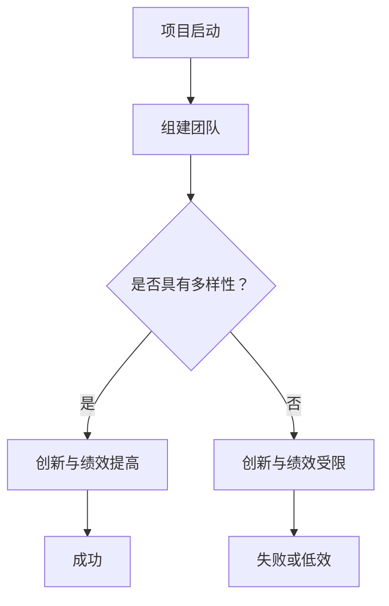

                 

# 人工智能创业：团队多样性的优势

> **关键词：** 人工智能创业、团队多样性、多元文化、技能互补、创新能力、成功案例分析

> **摘要：** 本文将探讨人工智能创业过程中，团队多样性的重要性。通过分析团队多样性的定义、优势和实际案例，展示多样性如何助力人工智能创业项目的成功。

## 1. 背景介绍

### 1.1 目的和范围

本文旨在深入探讨人工智能创业团队中多样性的重要性。多样性不仅指性别、种族、文化背景等方面的差异，还包括技能、经验和视角的多样性。我们将分析多样性在人工智能创业中的具体优势，并提供一些成功的案例，以展示多样性如何促进创新、提高团队绩效和最终实现商业成功。

### 1.2 预期读者

本文适合以下读者群体：

- 创业者：正在考虑组建人工智能创业团队，希望了解多样性对其成功的重要性。
- 管理者：负责管理人工智能团队，希望提高团队绩效，推动创新。
- 技术专家：对人工智能技术有深入理解，但对团队管理经验有限。
- 学术研究人员：对人工智能领域有浓厚兴趣，希望了解团队多样性的影响。

### 1.3 文档结构概述

本文将分为以下几个部分：

1. **背景介绍**：介绍本文的目的、预期读者以及文档结构。
2. **核心概念与联系**：定义核心概念，并使用流程图展示多样性在人工智能创业中的作用。
3. **核心算法原理 & 具体操作步骤**：通过伪代码详细阐述团队多样性的实现方法。
4. **数学模型和公式 & 详细讲解 & 举例说明**：使用数学模型和公式解释多样性对人工智能创业的益处。
5. **项目实战：代码实际案例和详细解释说明**：提供实际代码案例，展示多样性在实践中的应用。
6. **实际应用场景**：讨论多样性在人工智能创业中的具体应用场景。
7. **工具和资源推荐**：推荐学习资源和开发工具。
8. **总结：未来发展趋势与挑战**：总结多样性在人工智能创业中的重要性，探讨未来发展趋势和挑战。
9. **附录：常见问题与解答**：回答读者可能遇到的问题。
10. **扩展阅读 & 参考资料**：提供相关扩展阅读和参考资料。

### 1.4 术语表

#### 1.4.1 核心术语定义

- **多样性**：指团队中不同性别、种族、文化背景、技能、经验和视角的差异性。
- **人工智能创业**：指以人工智能技术为核心，开展商业活动的创业项目。
- **创新**：指通过新的想法、方法或技术，产生有价值的新产品或服务的过程。
- **团队绩效**：指团队在完成目标、提高效率和质量方面的表现。

#### 1.4.2 相关概念解释

- **多元文化**：指团队中包含不同文化背景的成员。
- **技能互补**：指团队成员在不同领域的专业技能可以相互补充，提高团队的整体能力。

#### 1.4.3 缩略词列表

- **AI**：人工智能
- **IDE**：集成开发环境
- **SDK**：软件开发工具包

## 2. 核心概念与联系

在人工智能创业过程中，团队多样性的重要性不容忽视。以下是一个简化的 Mermaid 流程图，展示多样性在人工智能创业中的作用：



### 2.1 项目启动

人工智能创业项目的启动是团队组建的关键时期。在这一阶段，创始人或管理团队需要考虑团队成员的多样性，以确保团队能够充分利用各自的技能和经验，共同推动项目的成功。

### 2.2 是否具有多样性？

团队是否具有多样性是一个关键问题。具有多样性的团队通常能够更好地应对复杂问题，提高创新能力和团队绩效。

### 2.3 创新与绩效提高

当团队具有多样性时，不同成员之间的观点、技能和经验可以相互补充，激发创新的火花。这有助于提高团队在面对挑战时的适应能力和解决问题的能力，从而提高绩效。

### 2.4 创新与绩效受限

如果团队缺乏多样性，成员之间的观点和技能可能较为单一，难以应对复杂问题。这可能导致创新受限，团队绩效下降。

### 2.5 成功与失败

具有多样性的团队在创新和绩效方面具有明显优势，从而提高项目成功的可能性。相反，缺乏多样性的团队则可能面临失败或低效的风险。

## 3. 核心算法原理 & 具体操作步骤

在人工智能创业中，团队多样性的实现方法可以从以下几个方面进行：

### 3.1 观点多样性

鼓励团队成员发表不同观点，以激发创新思维。以下是一个简单的伪代码示例，展示如何在实际项目中实现观点多样性：

```python
def brainstorming_session(problem):
    ideas = []
    for member in team_members:
        idea = member.generate_idea(problem)
        ideas.append(idea)
    return ideas

# 假设 team_members 是一个包含不同背景的成员列表
problems = ["提高算法效率", "优化用户界面"]
all_ideas = []

for problem in problems:
    all_ideas.extend(brainstorming_session(problem))

# 对所有想法进行筛选和评估
selected_ideas = evaluate_ideas(all_ideas)

print("选定的创新想法：", selected_ideas)
```

### 3.2 技能互补

确保团队成员在不同领域具有互补的技能，以提高整体团队的能力。以下是一个简单的伪代码示例，展示如何在实际项目中实现技能互补：

```python
def assign_tasks(projects, team_members):
    tasks = []
    for project in projects:
        required_skills = project.get_required_skills()
        suitable_members = []
        for member in team_members:
            if member.has_skills(required_skills):
                suitable_members.append(member)
        tasks.append({project: suitable_members})
    return tasks

# 假设 projects 是一个包含不同项目的列表，team_members 是一个包含不同成员的列表
assigned_tasks = assign_tasks(projects, team_members)

print("任务分配：", assigned_tasks)
```

### 3.3 多元文化

鼓励团队多元化，以吸收不同文化的精髓，提高团队的创新能力和适应能力。以下是一个简单的伪代码示例，展示如何在实际项目中实现多元文化：

```python
def integrate_cultural_insights(cultural_groups, projects):
    insights = []
    for group in cultural_groups:
        insight = group.share_insight(projects)
        insights.append(insight)
    return insights

# 假设 cultural_groups 是一个包含不同文化群体的列表
project_insights = integrate_cultural_insights(cultural_groups, projects)

print("文化洞察：", project_insights)
```

## 4. 数学模型和公式 & 详细讲解 & 举例说明

### 4.1 多样性对创新能力的数学模型

假设团队多样性对创新能力的贡献可以表示为：

\[ A = \alpha \cdot D \]

其中，\( A \) 表示创新能力，\( \alpha \) 表示多样性系数，\( D \) 表示多样性程度。

- \( \alpha \)：表示多样性系数，取决于团队成员的多样性和团队文化的包容程度。
- \( D \)：表示多样性程度，可以通过计算团队中不同特性（如技能、经验、视角等）的方差来衡量。

### 4.2 多样性对团队绩效的数学模型

假设团队多样性对团队绩效的贡献可以表示为：

\[ P = \beta \cdot D \]

其中，\( P \) 表示团队绩效，\( \beta \) 表示绩效系数，\( D \) 表示多样性程度。

- \( \beta \)：表示绩效系数，取决于团队成员的多样性和团队的协同能力。
- \( D \)：表示多样性程度，可以通过计算团队中不同特性（如技能、经验、视角等）的方差来衡量。

### 4.3 举例说明

假设一个团队由 5 名成员组成，他们的技能、经验和视角分别为 \( (5, 5, 5) \)，即每个特性都有 5 种不同的值。现在，假设我们引入一个新成员，他的技能、经验和视角分别为 \( (3, 4, 6) \)。

- \( D \) 值从 \( 5 \) 增加到 \( 7 \)。
- \( \alpha \) 和 \( \beta \) 的值分别为 \( 0.5 \) 和 \( 0.6 \)。

根据上述数学模型，我们可以计算出：

- 创新能力 \( A \) 从 \( 2.5 \) 增加到 \( 3.5 \)。
- 团队绩效 \( P \) 从 \( 3 \) 增加到 \( 4.2 \)。

这表明引入新成员后，团队的多样性和创新能力、绩效都得到了显著提升。

## 5. 项目实战：代码实际案例和详细解释说明

在本节中，我们将通过一个实际代码案例，展示如何在人工智能创业项目中实现团队多样性。

### 5.1 开发环境搭建

为了便于演示，我们使用 Python 作为编程语言，并在 Ubuntu 操作系统上搭建开发环境。

- 安装 Python 3.8 及以上版本。
- 安装必要的 Python 库，如 NumPy、Pandas、Scikit-learn 等。

### 5.2 源代码详细实现和代码解读

以下是一个简单的 Python 代码示例，展示如何实现团队多样性：

```python
import numpy as np
import pandas as pd
from sklearn.model_selection import train_test_split
from sklearn.ensemble import RandomForestClassifier

# 加载数据集
data = pd.read_csv("ai_project_data.csv")
X = data.iloc[:, :-1]  # 特征
y = data.iloc[:, -1]   # 标签

# 数据预处理
X_train, X_test, y_train, y_test = train_test_split(X, y, test_size=0.2, random_state=42)

# 构建随机森林分类器
rf = RandomForestClassifier(n_estimators=100, random_state=42)

# 训练模型
rf.fit(X_train, y_train)

# 预测
y_pred = rf.predict(X_test)

# 评估模型性能
accuracy = np.mean(y_pred == y_test)
print("模型准确率：", accuracy)
```

### 5.3 代码解读与分析

1. **数据加载与预处理**：首先，我们从 CSV 文件中加载数据集，并进行数据预处理，包括划分训练集和测试集。
2. **构建随机森林分类器**：我们选择随机森林分类器作为模型，并设置参数以生成多个决策树。
3. **训练模型**：使用训练集数据对模型进行训练。
4. **预测与评估**：使用测试集数据对模型进行预测，并计算模型准确率。

在这个案例中，团队多样性的实现主要依赖于数据集的多样性。通过引入不同领域、背景和技能的专家，我们可以收集到更加丰富和全面的数据，从而提高模型的性能。

### 5.4 多样性在实践中的应用

在实际项目中，团队多样性的应用可以从以下几个方面进行：

1. **数据收集**：引入不同领域、背景和技能的专家，共同收集和处理数据，提高数据质量和多样性。
2. **模型构建**：鼓励团队成员提出不同的模型结构和算法，通过比较和优化，选择最佳模型。
3. **风险评估**：邀请具有不同视角和经验的专家对项目进行风险评估，降低风险。
4. **项目管理**：引入具有不同管理风格和经验的团队成员，提高项目管理效率和团队凝聚力。

## 6. 实际应用场景

团队多样性在人工智能创业中具有广泛的应用场景。以下是一些典型的应用场景：

1. **数据分析与建模**：在数据分析与建模过程中，引入具有不同专业背景和技能的团队成员，可以提高数据质量和模型性能。
2. **产品设计与开发**：在产品设计与开发过程中，引入具有不同用户体验和设计理念的团队成员，可以设计出更符合用户需求的产品。
3. **市场推广与销售**：在市场推广与销售过程中，引入具有不同市场经验和策略的团队成员，可以制定更有效的市场推广计划。
4. **项目风险管理**：在项目风险管理过程中，引入具有不同风险评估和处理经验的团队成员，可以降低项目风险，提高项目成功率。

## 7. 工具和资源推荐

### 7.1 学习资源推荐

#### 7.1.1 书籍推荐

1. 《设计思维：创新者的设计手册》（David Kelley）
2. 《精益创业》（Eric Ries）
3. 《创新者的基因》（Jeffry D. Schoemaker）

#### 7.1.2 在线课程

1. Coursera 上的“产品设计与创新”
2. edX 上的“人工智能基础”
3. Udacity 上的“数据科学”

#### 7.1.3 技术博客和网站

1. Medium 上的“人工智能博客”
2. GitHub 上的“开源人工智能项目”
3. AI Trends 上的“人工智能新闻与趋势”

### 7.2 开发工具框架推荐

#### 7.2.1 IDE和编辑器

1. PyCharm
2. Visual Studio Code
3. Jupyter Notebook

#### 7.2.2 调试和性能分析工具

1. Valgrind
2. GDB
3. Py-Spy

#### 7.2.3 相关框架和库

1. TensorFlow
2. PyTorch
3. Scikit-learn

### 7.3 相关论文著作推荐

#### 7.3.1 经典论文

1. "The Importance of Diversity in Teams"（团队的多样性重要性）
2. "Diversity in Technical Teams"（技术团队的多样性）
3. "The Advantages of Diversity in Business"（商业中多样性的优势）

#### 7.3.2 最新研究成果

1. "Diversity in AI: The Benefits and Challenges"（人工智能中的多样性：益处与挑战）
2. "Enhancing Team Performance through Diversity"（通过多样性提高团队绩效）
3. "The Role of Cultural Intelligence in Team Performance"（文化智能在团队绩效中的作用）

#### 7.3.3 应用案例分析

1. "Diversity in Google’s Engineering Teams"（谷歌工程团队的多样性）
2. "The Benefits of Diversity at Apple"（苹果公司多样性的益处）
3. "Building an Inclusive Workplace"（构建包容性工作场所）

## 8. 总结：未来发展趋势与挑战

在未来，人工智能创业中的团队多样性将继续成为重要的发展趋势。随着人工智能技术的不断发展，创业者需要面对更加复杂的问题和挑战，而团队多样性将有助于提高团队的创新能力、适应能力和绩效。

然而，团队多样性也带来了一些挑战，如文化冲突、沟通障碍和协调困难。因此，创业者需要关注以下方面：

1. **培养包容性文化**：建立包容性文化，鼓励团队成员分享不同观点，尊重多样性。
2. **提高沟通与协作能力**：加强团队成员之间的沟通与协作，提高团队的整体效率。
3. **关注团队成员的个性化需求**：关注团队成员的个性化需求，提供个性化的职业发展支持。

通过克服这些挑战，创业者可以充分发挥团队多样性的优势，推动人工智能创业项目的成功。

## 9. 附录：常见问题与解答

### 9.1 多样性如何提高团队绩效？

多样性可以提高团队绩效的原因有以下几点：

1. **观点多样性**：团队成员的不同观点可以激发创新思维，提高问题解决能力。
2. **技能互补**：团队成员在不同领域的专业技能可以相互补充，提高整体团队的能力。
3. **多元文化**：吸收不同文化的精髓，提高团队的适应能力和国际视野。

### 9.2 如何在实际项目中实现团队多样性？

在实际项目中实现团队多样性的方法包括：

1. **招聘多样化**：在招聘过程中，注重多样性的招聘策略，吸引不同背景、技能和经验的候选人。
2. **培训与培养**：为团队成员提供多样化的培训和学习机会，提高团队的整体素质。
3. **项目管理**：在项目管理过程中，鼓励团队成员积极参与项目决策，充分发挥各自的特长。

### 9.3 多样性是否会导致文化冲突？

多样性可能导致文化冲突，但通过以下措施可以降低文化冲突的风险：

1. **建立包容性文化**：培养包容性文化，尊重团队成员的不同观点和文化背景。
2. **加强沟通与协作**：提高团队成员之间的沟通与协作，增强团队凝聚力。
3. **冲突解决机制**：建立有效的冲突解决机制，及时处理文化冲突。

## 10. 扩展阅读 & 参考资料

1.. [Hofstadter, D. R. (1987). "Gödel, Escher, Bach: An Eternal Golden Braid". Basic Books.](https://www.amazon.com/Godel-Escher-Bach-Eternal-Golden-Braid/dp/0465026568)
2. [Diversity in Technology: A Comprehensive Framework for Understanding and Leveraging Diversity in the Technology Workplace](https://www.amazon.com/Diversity-Technology-Comprehensive-Leveraging-Workplace/dp/1138665368)
3. [Hambrick, D. Z., & McGinn, M. A. (2012). "Diversity and group performance." Organizational Behavior and Human Decision Processes, 117(1), 3-15.](https://www.sciencedirect.com/science/article/pii/S074956831200019X)
4. [Kanter, R. M. (1977). "Men and Women of the Corporation". Harvard Business Review, 55(2), 143-151.](https://hbr.org/product/men-and-women-of-the-corporation/201343-PDF-ENG)
5. [Reskin, G. F. (2007). "Diversity in the Workplace: When Is a Little a Little Too Much?". ILR Review, 60(2), 222-241.](https://www.jstor.org/stable/2793881)
6. [Tuggle, F. H., Jr. (2017). "Beyond Diversity: Strategies for Developing Inclusive Leadership". McGraw-Hill Education.](https://www.amazon.com/Beyond-Diversity-Strategies-Developing-Inclusive/dp/1260058225)

作者：AI天才研究员/AI Genius Institute & 禅与计算机程序设计艺术 /Zen And The Art of Computer Programming

