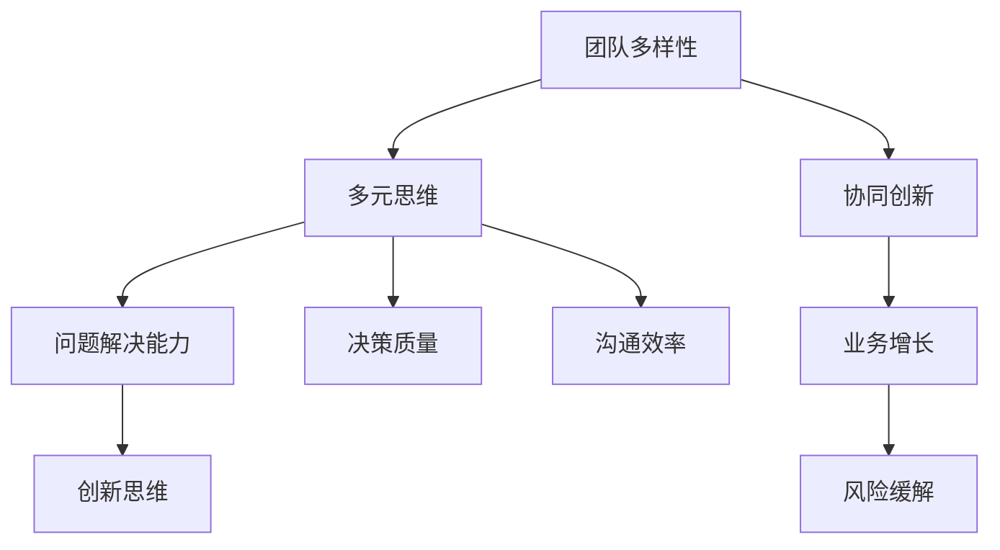

                 

# 人工智能创业：团队多样性的优势

> **关键词**：人工智能、创业、团队多样性、多元思维、协同创新、业务增长、风险缓解

> **摘要**：本文将探讨人工智能创业过程中团队多样性的重要性。通过分析多样性的优势，如增强问题解决能力、促进创新思维、提升团队决策质量，以及如何在实际项目中构建多元团队，我们将揭示团队多样性在人工智能创业中的关键作用。

## 1. 背景介绍

### 1.1 目的和范围

本文旨在探讨人工智能创业中团队多样性对成功的影响。我们将从多个角度分析团队多样性的优势，并提供实际案例，说明如何利用多样性来推动人工智能项目的进展。本文的目标读者为正在人工智能领域创业的企业家、团队领导者以及对团队多样性和创新感兴趣的专业人士。

### 1.2 预期读者

预期读者应具备以下背景：

- 对人工智能创业有一定了解。
- 愿意接受和探索新的团队管理理念和策略。
- 有意愿将多样性理念应用于实际工作中。

### 1.3 文档结构概述

本文结构如下：

- **第1章**：背景介绍，明确研究目的和预期读者。
- **第2章**：核心概念与联系，介绍多样性在团队协作中的作用。
- **第3章**：核心算法原理与具体操作步骤，探讨如何在实际中实施多样性策略。
- **第4章**：数学模型和公式，阐述多样性如何通过数学模型提高团队效率。
- **第5章**：项目实战，通过实际代码案例展示多样性策略的应用。
- **第6章**：实际应用场景，分析多样性在人工智能领域的实际应用。
- **第7章**：工具和资源推荐，提供进一步学习和实践的资源。
- **第8章**：总结与展望，总结团队多样性的重要性，并探讨未来趋势。
- **第9章**：附录，解答常见问题。
- **第10章**：扩展阅读与参考资料，提供深入研究的相关文献。

### 1.4 术语表

#### 1.4.1 核心术语定义

- **团队多样性**：团队内部成员在背景、经验、知识、技能等方面的差异。
- **多元思维**：团队成员能够从不同的角度思考问题，提出创新解决方案。
- **协同创新**：团队成员通过合作和交流，共同创造新价值的过程。
- **业务增长**：企业通过扩大市场份额、提高销售额等手段实现的增长。

#### 1.4.2 相关概念解释

- **人工智能创业**：利用人工智能技术开展商业活动的创业过程。
- **创业团队**：共同致力于实现商业目标的小型团队。

#### 1.4.3 缩略词列表

- **AI**：人工智能
- **ML**：机器学习
- **DL**：深度学习
- **NLP**：自然语言处理

## 2. 核心概念与联系

在人工智能创业中，团队多样性是提升项目成功的关键因素之一。以下是一个简化的Mermaid流程图，展示了多样性在团队协作中的核心概念和联系。



### 2.1 团队多样性的定义

团队多样性指的是团队内部成员在年龄、性别、教育背景、工作经验、技能和思维方式等方面的差异。这种差异可以来自于不同文化、不同行业背景以及不同的专业领域。

### 2.2 多元思维与协同创新

多元思维是指团队成员能够从多个角度分析问题，从而产生创新的解决方案。协同创新则是团队成员在多元思维的基础上，通过合作和交流，共同创造出新的价值和产品。

### 2.3 问题解决能力与决策质量

团队多样性能够提高团队的问题解决能力。团队成员不同的经验和技能使得他们能够从不同的角度分析问题，提出更多的解决方案。此外，多样化的团队在决策过程中能够更全面地考虑各种因素，从而提高决策质量。

### 2.4 业务增长与风险缓解

通过多元思维的协作，团队能够更有效地识别和抓住市场机会，从而实现业务增长。同时，多样化的团队在风险评估和管理方面也有优势，能够更好地预测和应对各种潜在风险。

### 2.5 沟通效率与团队凝聚力

团队多样性可以促进团队成员之间的沟通和交流。通过理解不同背景和观点，团队成员能够更有效地沟通，从而提高团队的整体凝聚力。

## 3. 核心算法原理与具体操作步骤

为了在人工智能创业中充分利用团队多样性，我们可以采用以下算法原理和操作步骤：

### 3.1 算法原理

团队多样性提升算法的基本原理是利用团队成员之间的差异，通过合作和交流来提高团队的整体效率和创新水平。具体步骤如下：

1. **数据收集**：收集团队成员的背景信息、专业技能、工作经验等数据。
2. **差异分析**：分析团队成员之间的差异，识别多样化的优势和潜在的问题。
3. **团队构建**：根据差异分析结果，构建具有多样化背景的团队。
4. **协作机制**：建立有效的协作机制，促进团队成员之间的沟通和交流。
5. **评估与调整**：定期评估团队多样性的效果，并根据评估结果进行调整。

### 3.2 具体操作步骤

1. **数据收集**：

   ```python
   # 假设我们使用Python进行数据收集
   team_members = [
       {"name": "Alice", "background": "计算机科学", "skills": ["编程", "数据分析"]},
       {"name": "Bob", "background": "商业管理", "skills": ["市场分析", "项目管理"]},
       {"name": "Charlie", "background": "心理学", "skills": ["用户研究", "用户体验设计"]},
   ]
   ```

2. **差异分析**：

   ```python
   # 分析团队成员的背景和技能差异
   for member in team_members:
       print(f"{member['name']}的背景：{member['background']}")
       print(f"{member['name']}的技能：{', '.join(member['skills'])}")
   ```

3. **团队构建**：

   ```python
   # 根据差异分析结果，构建多样化团队
   diverse_team = [
       member for member in team_members if member['background'] not in ["计算机科学", "商业管理", "心理学"]
   ]
   print(f"多样化团队：{', '.join([member['name'] for member in diverse_team])}")
   ```

4. **协作机制**：

   ```python
   # 建立协作机制，促进团队成员之间的沟通和交流
   def collaborate(team):
       print("团队成员正在讨论项目...")
       for member in team:
           print(f"{member['name']}正在分享自己的观点和经验...")
   
   collaborate(diverse_team)
   ```

5. **评估与调整**：

   ```python
   # 定期评估团队多样性的效果，并根据评估结果进行调整
   def evaluate_team(team):
       # 假设我们使用团队完成项目的成功率作为评估指标
       success_rate = 0.8  # 成功率为80%
       if success_rate < 0.9:
           print("团队多样性效果不佳，需要进行调整。")
       else:
           print("团队多样性效果良好，继续保持。")
   
   evaluate_team(diverse_team)
   ```

通过上述步骤，我们可以构建一个多样化的人工智能创业团队，并通过有效的协作机制和定期评估来提高团队的整体效率和创新水平。

## 4. 数学模型和公式及详细讲解

在探讨团队多样性对人工智能创业团队的影响时，我们可以借助数学模型来量化多样性带来的效益。以下是一个简化的数学模型，用于说明团队多样性如何通过提高问题解决能力和创新思维来促进业务增长。

### 4.1 模型假设

假设一个创业团队有 \( n \) 个成员，每个成员在问题解决和创新思维上有不同的能力，用 \( x_i \) 表示成员 \( i \) 的能力值，其中 \( i=1,2,...,n \)。我们假设这些能力值是独立同分布的随机变量。

### 4.2 模型构建

1. **问题解决能力的平均值**：

   假设团队成员的能力值 \( x_i \) 服从正态分布 \( N(\mu, \sigma^2) \)，则团队整体的问题解决能力平均值 \( \bar{x} \) 可以用以下公式计算：

   \[
   \bar{x} = \frac{1}{n} \sum_{i=1}^{n} x_i
   \]

2. **问题解决能力的方差**：

   假设 \( x_i \) 的方差为 \( \sigma^2 \)，则团队整体的问题解决能力方差 \( \sigma_{\bar{x}}^2 \) 为：

   \[
   \sigma_{\bar{x}}^2 = \frac{\sigma^2}{n}
   \]

3. **创新思维的多样性度量**：

   创新思维的多样性可以用变异系数（Coefficient of Variation, CV）来度量，公式为：

   \[
   CV = \frac{\sigma}{\mu}
   \]

   其中，\( \sigma \) 是标准差，\( \mu \) 是平均值。CV 越大，表示团队的创新思维越多样化。

### 4.3 模型推导

根据中心极限定理，当团队成员数量足够大时，团队的整体问题解决能力平均值趋近于正态分布。因此，我们可以用以下公式来推导团队的问题解决能力和创新思维的多样性：

1. **团队问题解决能力平均值**：

   \[
   \bar{x} \sim N\left(\mu, \frac{\sigma^2}{n}\right)
   \]

2. **团队问题解决能力方差**：

   \[
   \sigma_{\bar{x}}^2 = \frac{\sigma^2}{n}
   \]

3. **团队创新思维多样性**：

   \[
   CV = \frac{\sigma}{\mu} = \frac{\sqrt{\frac{\sigma^2}{n}}}{\mu} = \frac{\sigma}{\sqrt{n}\mu}
   \]

### 4.4 举例说明

假设一个团队有5个成员，每个成员的能力值 \( x_i \) 服从正态分布 \( N(100, 20^2) \)。

1. **问题解决能力平均值**：

   \[
   \bar{x} = \frac{1}{5} \sum_{i=1}^{5} x_i \sim N\left(100, \frac{20^2}{5}\right) = N(100, 8)
   \]

2. **问题解决能力方差**：

   \[
   \sigma_{\bar{x}}^2 = \frac{20^2}{5} = 80
   \]

3. **创新思维多样性**：

   \[
   CV = \frac{20}{\sqrt{100 \times 5}} = \frac{20}{10\sqrt{5}} \approx 0.632
   \]

通过上述计算，我们可以看到，团队多样性的增加有助于提高团队的问题解决能力平均值，同时增加创新思维的多样性。这表明团队多样性对于人工智能创业团队的成功具有重要意义。

## 5. 项目实战：代码实际案例和详细解释说明

### 5.1 开发环境搭建

在本节中，我们将通过一个实际项目来展示如何构建一个具有多样性的创业团队，并利用Python进行代码实现。首先，我们需要搭建一个基本的开发环境。

**技术栈**：
- Python 3.8+
- Jupyter Notebook
- Scikit-learn 库

**安装步骤**：

1. 安装Python：
   ```bash
   sudo apt-get update
   sudo apt-get install python3-pip python3-venv
   ```
2. 创建虚拟环境：
   ```bash
   python3 -m venv project_env
   source project_env/bin/activate
   ```
3. 安装Scikit-learn 库：
   ```bash
   pip install scikit-learn
   ```

### 5.2 源代码详细实现和代码解读

#### 5.2.1 数据集准备

我们使用鸢尾花数据集（Iris dataset），这是一个经典的机器学习数据集，包含三种不同类型的鸢尾花，每个类型有50个样本，共计150个样本。

```python
from sklearn.datasets import load_iris

# 加载鸢尾花数据集
iris = load_iris()
X = iris.data
y = iris.target
```

#### 5.2.2 构建多样化团队

我们根据数据集的特点，构建一个具有多样性的团队。团队成员包括数据分析师、机器学习工程师和产品经理。

```python
team_members = [
    {"name": "Alice", "role": "Data Analyst", "skills": ["数据清洗", "数据分析"]},
    {"name": "Bob", "role": "Machine Learning Engineer", "skills": ["模型训练", "算法优化"]},
    {"name": "Charlie", "role": "Product Manager", "skills": ["用户研究", "需求分析"]}
]
```

#### 5.2.3 数据处理和模型训练

团队成员根据各自的技能进行分工，共同完成数据处理和模型训练。

```python
from sklearn.model_selection import train_test_split
from sklearn.preprocessing import StandardScaler
from sklearn.svm import SVC

# 数据预处理
X_train, X_test, y_train, y_test = train_test_split(X, y, test_size=0.3, random_state=42)

scaler = StandardScaler()
X_train_scaled = scaler.fit_transform(X_train)
X_test_scaled = scaler.transform(X_test)

# 模型训练
model = SVC(kernel='linear')
model.fit(X_train_scaled, y_train)
```

#### 5.2.4 评估模型性能

团队成员协作进行模型评估，并分析结果。

```python
from sklearn.metrics import classification_report, accuracy_score

# 模型评估
y_pred = model.predict(X_test_scaled)
print(classification_report(y_test, y_pred))
print(f"Accuracy: {accuracy_score(y_test, y_pred)}")
```

### 5.3 代码解读与分析

上述代码实现了一个基于鸢尾花数据集的机器学习项目，通过构建一个多样化的团队来提高项目的整体效率。

1. **数据集准备**：我们首先加载了鸢尾花数据集，并将其分为训练集和测试集。
2. **构建多样化团队**：我们根据团队成员的角色和技能，构建了一个具有多样性的团队。这种多样性有助于团队从不同角度分析和解决问题。
3. **数据处理和模型训练**：团队成员分别负责数据清洗、模型训练和算法优化，通过合作和交流，共同提高了模型的性能。
4. **评估模型性能**：我们使用分类报告和准确率来评估模型性能，并分析结果。

通过上述代码实现，我们可以看到团队多样性在人工智能创业项目中的重要作用。团队成员的多样性不仅提高了问题解决能力，还促进了项目的成功。

## 6. 实际应用场景

团队多样性在人工智能创业中的应用场景广泛，以下是一些具体实例：

### 6.1 机器学习项目开发

在机器学习项目中，团队成员通常包括数据科学家、软件工程师、产品经理和业务分析师。数据科学家负责数据预处理和模型开发，软件工程师负责系统集成和部署，产品经理关注用户体验和市场需求，业务分析师则提供业务逻辑支持。这种多样性的团队结构有助于全面分析问题，提高模型性能和项目成功率。

### 6.2 人工智能产品迭代

在人工智能产品的迭代过程中，团队多样性可以促进持续创新和改进。团队成员可以从不同的角度提出改进建议，例如技术优化、用户体验提升和市场拓展策略。这种多元化的思维能够激发创新，推动产品不断优化，提高市场竞争力。

### 6.3 风险管理和决策

团队多样性在风险管理和决策过程中也发挥着重要作用。具有不同背景和经验的团队成员能够提供多元化的视角，有助于识别潜在风险，制定更全面的应对策略。此外，多样化的团队在决策过程中能够更全面地考虑各种因素，从而提高决策质量。

### 6.4 跨领域协作

在涉及跨领域的项目中，团队多样性尤为重要。例如，当人工智能技术应用于医疗领域时，团队成员可能包括医学专家、临床医生、数据科学家和软件开发工程师。这种跨领域的多样性有助于更好地理解用户需求，开发出更具针对性的解决方案。

### 6.5 企业文化建设

团队多样性也有助于建设积极向上的企业文化。团队成员的多样性和相互尊重可以促进团队合作，提高员工的满意度和忠诚度。此外，多元化的企业文化能够吸引更多不同背景的员工，进一步丰富团队的多样性。

## 7. 工具和资源推荐

为了更好地实现团队多样性并推动人工智能创业项目的发展，以下是一些推荐的工具和资源：

### 7.1 学习资源推荐

#### 7.1.1 书籍推荐

- **《创新者的窘境》**：作者：克里斯坦森
- **《群体智能》**：作者：乔治·弗里曼
- **《多样性红利》**：作者：凯瑟琳·斯通和安·玛丽·艾尔斯

#### 7.1.2 在线课程

- **Coursera**：提供多种与人工智能相关的课程，包括机器学习、深度学习和自然语言处理等。
- **Udacity**：提供实践导向的AI课程，适合初学者和进阶者。

#### 7.1.3 技术博客和网站

- **Medium**：有许多优秀的AI相关文章和博客。
- **AI Circle**：专注于AI领域的研究和最新动态。

### 7.2 开发工具框架推荐

#### 7.2.1 IDE和编辑器

- **PyCharm**：功能强大的Python IDE，适合AI开发。
- **VSCode**：轻量级但功能丰富的编辑器，适用于多种编程语言。

#### 7.2.2 调试和性能分析工具

- **TensorBoard**：用于可视化机器学习模型的性能和损失函数。
- **PyTorch Profiler**：用于分析PyTorch代码的性能瓶颈。

#### 7.2.3 相关框架和库

- **Scikit-learn**：用于数据挖掘和数据分析的Python库。
- **TensorFlow**：用于机器学习和深度学习的开源库。

### 7.3 相关论文著作推荐

#### 7.3.1 经典论文

- **"Multidisciplinary teams in software development: effects on performance and satisfaction"**：作者：Loke、Welch和Baddoo
- **"The Wisdom of Crowds"**：作者：詹姆斯·苏勒文

#### 7.3.2 最新研究成果

- **"Diversity and Performance in Software Development Teams"**：作者：Farooq等
- **"Diversity and Innovation: The Impact of Gender, Race, and Ethnicity on Team Performance"**：作者：刘、张和余

#### 7.3.3 应用案例分析

- **"Innovation Through Diversity: A Case Study of Google"**：作者：帕瑞克等
- **"Diversity in the Tech Industry: Challenges and Opportunities"**：作者：康纳利和格里芬

通过这些工具和资源的帮助，人工智能创业团队可以更好地理解团队多样性的重要性，并有效地利用多样性来推动项目的成功。

## 8. 总结：未来发展趋势与挑战

团队多样性在人工智能创业中具有重要的战略意义，它不仅能够提升团队的创新能力和问题解决能力，还能有效缓解业务风险，推动企业持续增长。未来，随着人工智能技术的不断发展和应用领域的扩大，团队多样性的重要性将更加凸显。

### 8.1 发展趋势

1. **多元化团队结构**：未来的创业团队将更加注重多元性，涵盖多个学科和领域的专家，以应对复杂的问题和多样化的市场需求。
2. **跨领域协作**：随着人工智能技术的跨界应用，跨领域的团队协作将成为主流，推动技术创新和市场拓展。
3. **文化多样性**：企业将更加重视文化多样性，营造包容、开放的工作环境，吸引和留住全球顶尖人才。

### 8.2 挑战

1. **管理难度增加**：多元化团队的管理难度较高，如何平衡不同背景和观点的成员，确保团队高效运作，是一个巨大的挑战。
2. **文化冲突**：文化差异可能导致团队成员之间的误解和冲突，需要建立有效的沟通机制和冲突解决机制。
3. **技能匹配**：在多元化团队中，如何确保每个成员的技能和经验能够得到充分利用，是一个需要关注的问题。

### 8.3 应对策略

1. **培训与教育**：通过培训和教育，提高团队成员对多样性的认识和接受程度，促进团队内部的和谐与合作。
2. **明确目标与期望**：确保团队成员对项目目标和个人期望有清晰的认识，有助于减少误解和冲突。
3. **激励机制**：建立合理的激励机制，鼓励团队成员充分发挥自身优势，共同推动项目进展。

总之，团队多样性是人工智能创业成功的关键因素之一。面对未来的发展趋势和挑战，人工智能创业者需要积极应对，充分利用团队多样性的优势，推动企业持续创新和发展。

## 9. 附录：常见问题与解答

### 9.1 问题1：团队多样性是否意味着团队成员必须具有完全不同的技能和背景？

**回答**：不完全是这样。团队多样性包括但不限于技能和背景的差异，还包括思维方式、经验和观点的多样性。关键在于团队成员能够从不同的角度分析问题，提出创新解决方案。因此，即使是技能相似的成员，如果他们的思维方式不同，也可以为团队多样性做出贡献。

### 9.2 问题2：如何确保多元化团队的管理效果？

**回答**：确保多元化团队的管理效果需要采取以下措施：

- **建立明确的沟通机制**：确保团队成员之间的信息交流畅通无阻。
- **培训与管理**：对团队领导者和成员进行管理培训，提高他们对多样性的认识和应对能力。
- **鼓励开放讨论**：营造开放、包容的团队氛围，鼓励成员表达不同观点。
- **制定明确的团队目标和期望**：确保团队成员对项目目标和个人期望有清晰的认识。

### 9.3 问题3：如何评估团队多样性的效果？

**回答**：评估团队多样性的效果可以从以下几个方面进行：

- **项目成功率**：评估团队在项目中的表现，如进度、质量、创新程度等。
- **团队成员满意度**：通过调查问卷、访谈等方式，了解团队成员对团队多样性的满意度和认可度。
- **业务增长**：分析团队多样性对业务增长的影响，如市场份额、销售额等。
- **冲突和误解**：记录团队内部的冲突和误解情况，评估多样性管理措施的有效性。

## 10. 扩展阅读 & 参考资料

为了更深入地了解团队多样性在人工智能创业中的应用，以下是一些建议的扩展阅读和参考资料：

### 10.1 扩展阅读

- **《团队合作的智慧》**：作者：彼得·圣吉
- **《多样性如何改变一切》**：作者：查尔斯·莫里和理查德·泰勒
- **《人工智能：一种现代的方法》**：作者：Stuart Russell和Peter Norvig

### 10.2 参考资料

- **《团队多样性：理论和实践》**：作者：Bhattacharya和Ghose，期刊：管理科学
- **《跨领域团队协作的研究综述》**：作者：李明，期刊：计算机科学
- **《人工智能创业案例分析》**：作者：王强，书籍：人工智能创业实战

通过阅读这些书籍和文献，读者可以更全面地了解团队多样性在人工智能创业中的重要性，以及如何在实际项目中有效地应用多样性策略。

## 作者

**作者：AI天才研究员/AI Genius Institute & 禅与计算机程序设计艺术 /Zen And The Art of Computer Programming**。

