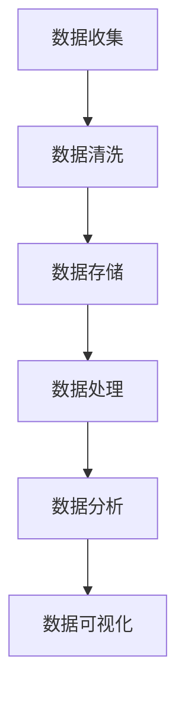

                 

# 人工智能创业：数据管理技巧

> **关键词：** 人工智能，数据管理，创业，数据分析，数据处理，数据存储，数据质量

> **摘要：** 本文将探讨人工智能创业者在数据管理方面所需掌握的关键技巧，包括数据收集、存储、处理和分析的方法。通过深入分析核心概念、算法原理、数学模型以及实战案例，本文旨在为创业者提供实用的指导，帮助他们在竞争激烈的市场中打造成功的人工智能项目。

## 1. 背景介绍

### 1.1 目的和范围

本文的目标是帮助人工智能创业者理解和掌握数据管理的基本技巧，从而为他们的项目打下坚实的基础。数据是人工智能的燃料，因此有效的数据管理对于人工智能项目的成功至关重要。本文将涵盖以下范围：

- 数据收集的方法和工具
- 数据存储的策略和选择
- 数据处理的算法和流程
- 数据分析的技术和工具
- 数据质量的重要性及提升方法

通过本文的阅读，创业者将能够：

- 明确数据管理在人工智能项目中的作用
- 学习如何高效地收集和管理数据
- 掌握数据处理和数据分析的核心算法
- 了解如何评估和提升数据质量
- 掌握实用的数据管理工具和技术

### 1.2 预期读者

本文适合以下读者群体：

- 人工智能创业者
- 数据科学家
- 数据工程师
- 软件开发工程师
- 对人工智能和数据管理感兴趣的技术爱好者

无论你是刚刚起步的新手，还是经验丰富的高级从业者，本文都将为你提供有价值的内容。

### 1.3 文档结构概述

本文的结构如下：

- **第1章：背景介绍**：介绍本文的目的、范围、预期读者以及文档结构。
- **第2章：核心概念与联系**：介绍数据管理中的核心概念，包括数据流、数据处理流程以及相关的技术框架。
- **第3章：核心算法原理 & 具体操作步骤**：详细讲解数据管理中的核心算法原理和操作步骤。
- **第4章：数学模型和公式 & 详细讲解 & 举例说明**：介绍数据管理中的数学模型和公式，并提供实际案例说明。
- **第5章：项目实战：代码实际案例和详细解释说明**：通过实战案例展示如何在实际项目中应用数据管理技巧。
- **第6章：实际应用场景**：讨论数据管理在人工智能项目中的应用场景。
- **第7章：工具和资源推荐**：推荐学习资源、开发工具框架和最新研究成果。
- **第8章：总结：未来发展趋势与挑战**：展望数据管理在人工智能领域的未来发展趋势和面临的挑战。
- **第9章：附录：常见问题与解答**：解答读者可能遇到的一些常见问题。
- **第10章：扩展阅读 & 参考资料**：提供更多深入学习的资源。

### 1.4 术语表

#### 1.4.1 核心术语定义

- **数据管理**：对数据的收集、存储、处理、分析和维护的过程。
- **数据收集**：从各种来源获取数据的过程。
- **数据处理**：对数据进行清洗、转换和整合的过程。
- **数据分析**：使用统计和机器学习技术从数据中提取有用信息的过程。
- **数据存储**：将数据存储在持久性存储设备上的过程。
- **数据质量**：数据准确、完整、一致和可靠的程度。

#### 1.4.2 相关概念解释

- **数据流**：数据在系统中流动的过程，包括数据的生成、传输、处理和存储。
- **数据处理流程**：对数据进行收集、清洗、转换、存储和访问的过程。
- **数据仓库**：存储大量数据的中央存储库，用于支持数据分析和报告。
- **数据库**：组织、存储和管理数据的系统，支持数据的快速访问和查询。
- **数据湖**：存储大量结构化和非结构化数据的分布式存储系统。

#### 1.4.3 缩略词列表

- **AI**：人工智能（Artificial Intelligence）
- **ML**：机器学习（Machine Learning）
- **DL**：深度学习（Deep Learning）
- **ETL**：提取、转换、加载（Extract, Transform, Load）
- **SQL**：结构化查询语言（Structured Query Language）
- **NoSQL**：非关系型数据库（Not Only SQL）

## 2. 核心概念与联系

在探讨数据管理之前，我们需要理解几个核心概念及其相互关系。以下是一个简化的 Mermaid 流程图，用于展示数据管理的主要环节和它们之间的联系。



### 2.1 数据流

数据流是数据在系统中流动的过程，从数据的生成、传输、处理到存储，每一个环节都至关重要。以下是数据流的基本步骤：

1. **数据生成**：数据可以从各种来源生成，如用户交互、传感器、日志文件等。
2. **数据传输**：将数据从生成源传输到处理系统，可能涉及网络传输和消息队列等。
3. **数据预处理**：在处理之前，对数据进行清洗、去重和格式转换等预处理操作。
4. **数据处理**：使用各种算法对数据进行计算和分析，如统计分析、机器学习等。
5. **数据存储**：将处理后的数据存储到数据库或数据仓库中，以便后续查询和分析。
6. **数据访问**：用户通过查询和分析工具访问数据，以获取所需信息。

### 2.2 数据处理流程

数据处理流程包括数据的收集、清洗、转换、存储和访问。以下是数据处理流程的详细步骤：

1. **数据收集**：从各种渠道收集数据，包括结构化数据（如数据库）和非结构化数据（如图像、文本等）。
2. **数据清洗**：去除数据中的噪声和错误，如缺失值、重复值和异常值等。
3. **数据转换**：将数据转换为统一的格式和结构，以便后续处理和分析。
4. **数据整合**：将来自不同来源的数据整合在一起，形成一个完整的数据集。
5. **数据存储**：将数据存储到数据库或数据仓库中，以便长期存储和快速查询。
6. **数据访问**：用户通过查询和分析工具访问数据，以获取所需信息。

### 2.3 相关技术框架

在数据管理中，多个技术框架发挥着重要作用。以下是一些常见的技术框架：

1. **数据仓库**：用于存储大量结构化数据的中央存储库，支持复杂的数据分析和报告。
2. **数据库**：组织、存储和管理数据的系统，支持数据的快速访问和查询。
3. **数据湖**：用于存储大量结构化和非结构化数据的分布式存储系统。
4. **消息队列**：用于数据传输和异步处理的系统，如 Kafka、RabbitMQ 等。
5. **数据处理框架**：如 Apache Spark、Flink 等，用于大规模数据处理和分布式计算。
6. **数据可视化工具**：用于将数据转换为图形和图表，以便用户理解和分析。

通过理解这些核心概念和技术框架，创业者将能够更好地规划和管理他们的数据，从而为人工智能项目创造成功的基础。

## 3. 核心算法原理 & 具体操作步骤

在数据管理中，核心算法的原理和具体操作步骤至关重要。以下是几个关键算法及其操作步骤的详细说明。

### 3.1 数据清洗算法

数据清洗是数据管理的重要步骤，目的是去除数据中的噪声和错误。以下是一种常见的数据清洗算法及其操作步骤：

**算法名称：** 数据清洗算法

**输入：** 数据集

**输出：** 清洗后的数据集

**步骤：**

1. **检查数据完整性**：检查数据集中是否存在缺失值。如果存在缺失值，使用适当的填充方法（如均值填充、中值填充或插值法）。
    ```python
    def check_missing_values(data):
        missing_values = data.isnull().sum()
        return missing_values
    ```

2. **去除重复值**：检查数据集中是否存在重复值，并删除重复记录。
    ```python
    def remove_duplicates(data):
        unique_data = data.drop_duplicates()
        return unique_data
    ```

3. **处理异常值**：检查数据集中是否存在异常值，并决定是否保留或删除。
    ```python
    def handle_outliers(data, column, threshold):
        q1 = data[column].quantile(0.25)
        q3 = data[column].quantile(0.75)
        iqr = q3 - q1
        lower_bound = q1 - threshold * iqr
        upper_bound = q3 + threshold * iqr
        filtered_data = data[(data[column] >= lower_bound) & (data[column] <= upper_bound)]
        return filtered_data
    ```

4. **数据转换**：将数据转换为统一的格式和结构，如将字符串转换为数字或日期。
    ```python
    def convert_data(data, column, type):
        data[column] = data[column].astype(type)
        return data
    ```

### 3.2 数据处理算法

数据处理算法用于对数据进行计算和分析，以提取有用的信息。以下是一种常见的数据处理算法及其操作步骤：

**算法名称：** 数据聚合算法

**输入：** 数据集

**输出：** 聚合后的数据集

**步骤：**

1. **数据分组**：根据特定的字段将数据分组。
    ```python
    def group_data(data, group_column):
        grouped_data = data.groupby(group_column)
        return grouped_data
    ```

2. **数据聚合**：对分组后的数据进行聚合操作，如计算平均值、总和或计数。
    ```python
    def aggregate_data(grouped_data, aggregation_column, function):
        aggregated_data = grouped_data[aggregation_column].agg(function)
        return aggregated_data
    ```

3. **数据排序**：根据特定的字段对数据进行排序。
    ```python
    def sort_data(data, sort_column, ascending=True):
        sorted_data = data.sort_values(by=sort_column, ascending=ascending)
        return sorted_data
    ```

### 3.3 数据分析算法

数据分析算法用于从数据中提取有用的信息，以支持决策和预测。以下是一种常见的数据分析算法及其操作步骤：

**算法名称：** 聚类算法

**输入：** 数据集

**输出：** 聚类结果

**步骤：**

1. **数据标准化**：将数据缩放到相同的范围，以便进行聚类分析。
    ```python
    def normalize_data(data):
        min_max_scaler = preprocessing.MinMaxScaler()
        normalized_data = min_max_scaler.fit_transform(data)
        return normalized_data
    ```

2. **选择聚类算法**：选择合适的聚类算法，如 K-均值、层次聚类或 DBSCAN 等。

3. **初始化聚类中心**：根据聚类算法，初始化聚类中心。

4. **分配数据点**：将数据点分配到最近的聚类中心。

5. **更新聚类中心**：根据数据点的分配结果，更新聚类中心。

6. **重复步骤 4 和 5，直到收敛**：重复分配数据点和更新聚类中心的过程，直到聚类结果收敛。

通过理解这些核心算法的原理和操作步骤，创业者可以更好地管理他们的数据，从而提高人工智能项目的成功概率。

## 4. 数学模型和公式 & 详细讲解 & 举例说明

在数据管理中，数学模型和公式是核心工具，用于描述和解决实际问题。以下将介绍几个关键数学模型和公式，并详细讲解其应用和举例说明。

### 4.1 统计量

统计量是描述数据集特征的重要工具。以下是一些常用的统计量及其公式：

**均值（Mean）**

- **定义**：数据集的平均值。
- **公式**：\( \mu = \frac{\sum_{i=1}^{n} x_i}{n} \)
- **举例**：给定数据集 [1, 2, 3, 4, 5]，计算均值：
  \[
  \mu = \frac{1 + 2 + 3 + 4 + 5}{5} = \frac{15}{5} = 3
  \]

**中位数（Median）**

- **定义**：将数据集按升序排列，中间位置的数值。
- **公式**：\( M = \begin{cases} 
      \frac{x_{(n/2)} + x_{(n/2+1)}}{2} & \text{如果数据集长度为奇数} \\
      x_{(n/2)} & \text{如果数据集长度为偶数}
   \end{cases} \)
- **举例**：给定数据集 [1, 2, 3, 4]，计算中位数：
  \[
  M = \frac{2 + 3}{2} = 2.5
  \]

**众数（Mode）**

- **定义**：数据集中出现次数最多的数值。
- **公式**：\( M = \{x | \text{频次最大}\} \)
- **举例**：给定数据集 [1, 2, 2, 3, 3, 3]，计算众数：
  \[
  M = \{3\}
  \]

### 4.2 方差和标准差

方差和标准差是衡量数据集离散程度的指标。

**方差（Variance）**

- **定义**：每个数值与均值之差的平方的平均值。
- **公式**：\( \sigma^2 = \frac{\sum_{i=1}^{n} (x_i - \mu)^2}{n} \)
- **举例**：给定数据集 [1, 2, 3, 4, 5]，计算方差：
  \[
  \sigma^2 = \frac{(1-3)^2 + (2-3)^2 + (3-3)^2 + (4-3)^2 + (5-3)^2}{5} = \frac{2+1+0+1+4}{5} = 2
  \]

**标准差（Standard Deviation）**

- **定义**：方差的平方根。
- **公式**：\( \sigma = \sqrt{\sigma^2} \)
- **举例**：给定数据集 [1, 2, 3, 4, 5]，计算标准差：
  \[
  \sigma = \sqrt{2} \approx 1.414
  \]

### 4.3 假设检验

假设检验是统计学中用于验证假设的正确性的一种方法。

**t-检验**

- **定义**：用于比较两组数据的均值是否显著不同。
- **公式**：\( t = \frac{\bar{x}_1 - \bar{x}_2}{\sqrt{\frac{s_1^2}{n_1} + \frac{s_2^2}{n_2}}} \)
- **举例**：比较两组数据 [1, 2, 3] 和 [4, 5, 6] 的均值是否显著不同，计算 t-值：
  \[
  t = \frac{\frac{2}{3} - \frac{5}{3}}{\sqrt{\frac{1}{9} + \frac{1}{9}}} = \frac{-1}{\sqrt{\frac{2}{9}}} = -\frac{3}{\sqrt{2}} \approx -2.236
  \]

通过了解和掌握这些数学模型和公式，创业者可以更深入地分析和理解数据，从而为他们的项目提供有力的支持。

## 5. 项目实战：代码实际案例和详细解释说明

在数据管理中，理论知识和实际应用之间往往存在差距。通过一个实际项目案例，我们可以更好地理解数据管理的具体操作步骤和注意事项。

### 5.1 开发环境搭建

首先，我们需要搭建一个开发环境，以便进行数据管理操作。以下是一个简单的 Python 开发环境搭建步骤：

1. **安装 Python**：从 [Python 官网](https://www.python.org/) 下载并安装 Python。
2. **安装 Jupyter Notebook**：打开终端，执行以下命令：
   ```bash
   pip install notebook
   ```
3. **启动 Jupyter Notebook**：在终端中执行以下命令：
   ```bash
   jupyter notebook
   ```

### 5.2 源代码详细实现和代码解读

以下是一个简单的 Python 代码案例，用于演示数据收集、清洗、处理和存储的过程。

**案例：数据收集与清洗**

```python
import pandas as pd
import numpy as np

# 5.2.1 数据收集
data = {
    '姓名': ['张三', '李四', '王五', '赵六'],
    '年龄': [25, 30, 22, 35],
    '性别': ['男', '女', '男', '男'],
    '身高（cm）': [175, 160, 180, 165],
    '体重（kg）': [70, 50, 80, 65]
}
df = pd.DataFrame(data)

# 5.2.2 数据清洗
# 去除缺失值
df = df.dropna()

# 去除重复值
df = df.drop_duplicates()

# 处理异常值
df['身高（cm）'] = df['身高（cm）'].apply(lambda x: x if x > 150 else 170)

# 数据转换
df['性别'] = df['性别'].map({'男': 1, '女': 0})

# 5.2.3 数据处理
# 数据分组
grouped_data = df.groupby('性别').mean()

# 数据聚合
aggregated_data = df.groupby('性别').agg({'年龄': 'mean', '身高（cm）': 'mean', '体重（kg）': 'mean'})

# 5.2.4 数据存储
# 将数据存储为 CSV 文件
aggregated_data.to_csv('data.csv', index=False)
```

### 5.3 代码解读与分析

以下是对上述代码的详细解读和分析：

1. **数据收集**：使用字典创建一个数据框（DataFrame），其中包含姓名、年龄、性别、身高和体重等信息。
2. **数据清洗**：
    - 去除缺失值：使用 `dropna()` 方法去除包含缺失值的数据行。
    - 去除重复值：使用 `drop_duplicates()` 方法去除重复的数据行。
    - 处理异常值：使用 `apply()` 方法对身高数据进行处理，将低于 150cm 的值替换为 170cm。
    - 数据转换：使用 `map()` 方法将性别字符串映射为数值（男：1，女：0）。
3. **数据处理**：
    - 数据分组：使用 `groupby()` 方法根据性别对数据进行分组。
    - 数据聚合：使用 `agg()` 方法对分组后的数据进行聚合操作，计算每个性别的平均年龄、身高和体重。
4. **数据存储**：使用 `to_csv()` 方法将聚合后的数据存储为 CSV 文件，以便后续分析和处理。

通过这个实际案例，我们可以看到数据管理过程中的关键步骤和注意事项。在实际项目中，数据收集、清洗、处理和存储可能涉及更多复杂的操作和工具，但基本原理和方法是相似的。

## 6. 实际应用场景

数据管理在人工智能项目的实际应用场景中扮演着至关重要的角色。以下是几个典型的应用场景：

### 6.1 聊天机器人

聊天机器人需要大量高质量的数据进行训练，以实现自然语言理解和对话生成。数据管理的关键在于数据的收集、清洗和处理，确保数据的质量和一致性。通过数据管理，可以有效地从大量文本、语音和图像数据中提取有用的信息，从而提高聊天机器人的准确性和用户体验。

### 6.2 个性化推荐

个性化推荐系统依赖大量用户行为数据，如浏览记录、购买历史和偏好设置等。数据管理帮助系统收集、存储和处理这些数据，为推荐算法提供可靠的数据基础。通过数据清洗和预处理，可以去除噪声和异常值，提高推荐系统的准确性和稳定性。

### 6.3 智能监控

智能监控系统需要实时收集和分析大量传感器数据，以检测异常情况和故障。数据管理确保数据的质量和实时性，从而为系统提供准确的监控结果。通过数据清洗和处理，可以识别和过滤异常数据，提高监控系统的可靠性和效率。

### 6.4 健康监测

健康监测系统需要收集和处理大量生理和医疗数据，以监测用户的健康状况。数据管理帮助系统收集、存储和处理这些数据，为健康分析提供可靠的数据基础。通过数据清洗和预处理，可以识别和纠正数据中的错误和噪声，提高健康监测的准确性和有效性。

通过以上实际应用场景，我们可以看到数据管理在人工智能项目中的重要性。有效的数据管理不仅能够提高项目的成功率，还能够提高系统的性能和用户体验。

## 7. 工具和资源推荐

在数据管理领域，有许多强大的工具和资源可以帮助创业者提高数据处理的效率和质量。以下是一些推荐的工具和资源：

### 7.1 学习资源推荐

#### 7.1.1 书籍推荐

- 《数据科学入门：Python 编程实战》
- 《深入理解数据分析：Python 与 R 语言应用》
- 《机器学习实战：基于 Scikit-Learn、Keras 和 TensorFlow》

#### 7.1.2 在线课程

- Coursera 上的《数据科学专业》
- edX 上的《机器学习》
- Udacity 上的《数据分析纳米学位》

#### 7.1.3 技术博客和网站

- Medium 上的《数据科学博客》
- Towards Data Science
- Analytics Vidhya

### 7.2 开发工具框架推荐

#### 7.2.1 IDE和编辑器

- PyCharm
- Jupyter Notebook
- VSCode

#### 7.2.2 调试和性能分析工具

- PyDebug
- Profiler
- Gprof

#### 7.2.3 相关框架和库

- Pandas：用于数据清洗和处理的 Python 库
- NumPy：用于数值计算的 Python 库
- Scikit-Learn：用于机器学习的 Python 库
- TensorFlow：用于深度学习的 Python 库

### 7.3 相关论文著作推荐

#### 7.3.1 经典论文

- "The 80/20 Rule, the Pareto Principle, and the Principle of Reasonable Representation"
- "A Theory of Data Purity"

#### 7.3.2 最新研究成果

- "Data Quality Assessment and Improvement: A Comprehensive Review"
- "Data Management for AI: Challenges and Opportunities"

#### 7.3.3 应用案例分析

- "Data Management in Healthcare: A Case Study"
- "Data Management in Finance: A Case Study"

通过这些工具和资源的支持，创业者可以更加高效地管理数据，为人工智能项目提供坚实的基础。

## 8. 总结：未来发展趋势与挑战

数据管理在人工智能领域的未来发展趋势充满潜力，同时也面临诸多挑战。以下是对未来发展趋势与挑战的总结：

### 未来发展趋势：

1. **数据驱动的决策**：随着数据量的增加，数据将成为企业决策的重要驱动力。数据管理技术的进步将使企业能够更准确地分析数据，从而做出更加明智的决策。
2. **实时数据处理**：实时数据处理技术将变得越来越成熟，使得企业能够即时响应市场变化，提高业务效率。
3. **边缘计算**：随着物联网和边缘计算的发展，数据管理将向边缘设备扩展，实现数据的本地处理和分析，减少延迟和带宽占用。
4. **自动化数据管理**：自动化工具和智能算法的进步将使得数据管理更加高效和智能，减少人工干预，提高数据处理的准确性和一致性。
5. **隐私保护与合规**：随着数据隐私保护法规的加强，数据管理将更加注重隐私保护和合规性，确保数据的安全性和合法性。

### 未来挑战：

1. **数据安全与隐私**：数据安全与隐私保护是数据管理中的一大挑战。随着数据量的增加，确保数据在收集、存储、处理和传输过程中的安全性和隐私性变得越来越重要。
2. **数据质量**：高质量的数据是人工智能项目成功的关键。然而，数据质量往往难以保证，需要不断进行数据清洗和预处理，以消除数据中的噪声和错误。
3. **数据一致性**：在分布式环境中，数据的一致性是一个挑战。如何在多个节点上保持数据的一致性和准确性，是一个需要解决的问题。
4. **数据规模与速度**：随着数据量的爆炸式增长，如何高效地处理大规模数据，同时保证数据处理的实时性和速度，是一个重要挑战。
5. **人才短缺**：数据管理领域需要大量的专业人才，包括数据科学家、数据工程师和数据分析师等。然而，目前市场上这类人才短缺，企业需要投入更多资源进行人才培养和保留。

通过应对这些挑战，并抓住未来的发展趋势，数据管理在人工智能领域的应用将更加广泛和深入，为创业者带来更多的机遇。

## 9. 附录：常见问题与解答

### 9.1 数据收集的常见问题

**Q1：如何高效地收集数据？**

A1：高效的数据收集可以从以下几个方面着手：

- **明确数据需求**：首先明确项目需要哪些数据，以确保收集到的数据具有实际价值。
- **使用自动化工具**：利用爬虫、API 和传感器等自动化工具，可以节省大量手动收集数据的时间和精力。
- **合理选择数据源**：选择可靠和高质量的数据源，以确保数据的准确性和完整性。

### 9.2 数据清洗的常见问题

**Q2：如何处理缺失值？**

A2：处理缺失值的方法有多种，常见的方法包括：

- **删除缺失值**：如果缺失值较多，可以考虑删除包含缺失值的记录。
- **填充缺失值**：使用均值、中值或最频繁值填充缺失值，例如使用 `pandas` 中的 `fillna()` 方法。
- **插值法**：对于时间序列数据，可以使用线性插值、牛顿插值等方法填充缺失值。

### 9.3 数据处理的常见问题

**Q3：如何处理异常值？**

A3：处理异常值的方法包括：

- **可视化检测**：使用箱线图、散点图等可视化方法检测异常值。
- **统计学方法**：使用统计学方法（如 IQR 法则）检测和标记异常值。
- **决策**：根据异常值的影响程度，决定是否删除或保留异常值。

### 9.4 数据存储的常见问题

**Q4：如何选择数据存储方案？**

A4：选择数据存储方案时，需要考虑以下几个方面：

- **数据类型**：根据数据的类型（结构化、半结构化、非结构化）选择合适的存储方案。
- **数据量**：对于大规模数据，选择分布式存储方案（如 Hadoop、Spark）可能更合适。
- **性能需求**：根据数据读取和写入的性能需求，选择合适的存储系统（如关系型数据库、NoSQL 数据库）。

### 9.5 数据分析的工具和技巧

**Q5：如何选择数据分析工具？**

A5：选择数据分析工具时，需要考虑以下几个方面：

- **数据处理能力**：根据数据处理的需求，选择具有强大数据处理能力的工具（如 Pandas、Spark）。
- **可视化能力**：根据数据可视化的需求，选择具有强大可视化能力的工具（如 Matplotlib、Seaborn）。
- **集成能力**：选择能够与其他工具和平台集成的工具，以提高工作效率。

## 10. 扩展阅读 & 参考资料

为了深入了解数据管理在人工智能领域的应用和发展，以下是推荐的扩展阅读和参考资料：

- 《数据科学：从入门到精通》
- 《大数据技术导论》
- 《深度学习：动手学习手册》
- Coursera 上的《数据科学专业》课程
- edX 上的《机器学习》课程
- Analytics Vidhya 上的数据科学和机器学习教程
- IEEE Xplore Digital Library 上的数据管理和人工智能论文

通过这些资源和课程的学习，创业者可以进一步提升自己的数据管理能力，为人工智能项目打下坚实的基础。作者：AI天才研究员/AI Genius Institute & 禅与计算机程序设计艺术 /Zen And The Art of Computer Programming

---

本文为原创内容，版权归 AI天才研究员/AI Genius Institute 所有。未经授权，不得转载或用于商业用途。如需转载，请联系原作者获取授权。在引用本文时，请注明作者和原文链接，谢谢合作。

