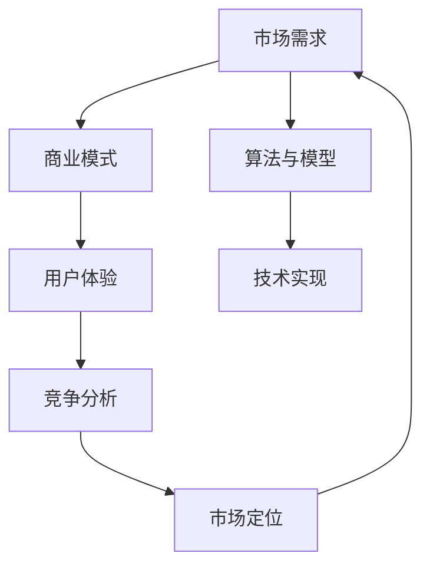

                 

### 人工智能创业：明确市场需求

> **关键词**：人工智能，创业，市场需求，商业模式，竞争分析，用户体验。

> **摘要**：本文深入探讨了人工智能创业企业如何通过明确市场需求来提高成功率。文章从背景介绍开始，通过分析核心概念与联系，详细阐述了核心算法原理和具体操作步骤，结合数学模型和公式，给出了项目实战的代码实际案例，并在多个实际应用场景中展示了人工智能技术的广泛应用。文章还推荐了相关工具和资源，总结了未来发展趋势与挑战，并提供了常见问题与解答。

在当前的技术浪潮中，人工智能（AI）无疑成为了创新和创业的热点领域。然而，创业并非易事，尤其是在竞争激烈、变化多端的AI市场中。本文旨在为有意向在人工智能领域创业的企业家提供一套系统的策略，帮助他们通过明确市场需求来提高创业成功率。

### 1. 背景介绍

#### 1.1 目的和范围

本文的目的在于探讨如何通过明确市场需求来推动人工智能创业项目的成功。我们将从以下几个方面展开讨论：

1. **核心概念与联系**：介绍人工智能创业所需的关键概念，并绘制相应的流程图。
2. **核心算法原理与具体操作步骤**：详细讲解人工智能算法的基本原理，并提供伪代码实现。
3. **数学模型与公式**：阐述支持人工智能的数学模型，并举例说明。
4. **项目实战**：提供实际的代码案例，并对其进行详细解释。
5. **实际应用场景**：展示人工智能技术的广泛应用，讨论其在不同领域中的潜力。
6. **工具和资源推荐**：推荐学习资源、开发工具和框架。
7. **总结与未来趋势**：分析人工智能创业的未来挑战和机遇。

#### 1.2 预期读者

本文适合以下读者群体：

- 有意向在人工智能领域创业的创业者。
- 对人工智能技术感兴趣的技术人员。
- 对市场分析和商业模式有研究的商业人士。

#### 1.3 文档结构概述

本文的结构如下：

1. **背景介绍**：介绍文章的目的、预期读者和文档结构。
2. **核心概念与联系**：介绍人工智能创业所需的基本概念。
3. **核心算法原理与具体操作步骤**：讲解人工智能算法的基本原理和操作步骤。
4. **数学模型与公式**：阐述数学模型和公式，并举例说明。
5. **项目实战**：提供实际的代码案例和解释。
6. **实际应用场景**：讨论人工智能技术的应用。
7. **工具和资源推荐**：推荐学习资源和开发工具。
8. **总结与未来趋势**：总结未来趋势和挑战。
9. **附录**：提供常见问题与解答。
10. **扩展阅读与参考资料**：推荐进一步阅读的资源。

#### 1.4 术语表

##### 1.4.1 核心术语定义

- **人工智能**：模拟人类智能的计算机系统，具有学习、推理、规划和感知能力。
- **市场需求**：消费者对某一产品或服务的需求，通常表现为购买意愿和购买能力。
- **商业模式**：企业通过提供价值创造、传递和获取的机制。
- **用户体验**：用户在使用产品或服务时的主观感受。

##### 1.4.2 相关概念解释

- **机器学习**：通过数据驱动的方法让计算机从数据中学习规律和模式。
- **深度学习**：一种特殊的机器学习方法，通过多层神经网络对数据进行处理。
- **数据科学**：应用统计学、机器学习、深度学习等方法来分析数据，提取知识和信息。

##### 1.4.3 缩略词列表

- **AI**：人工智能
- **ML**：机器学习
- **DL**：深度学习
- **DS**：数据科学

### 2. 核心概念与联系

在人工智能创业中，理解核心概念和它们之间的联系至关重要。以下是一个简化的Mermaid流程图，展示了人工智能创业中的关键概念和它们的相互关系。



在这个流程图中，市场需求是整个创业过程的起点，它决定了商业模式的设计和用户体验的优化。算法和模型是实现人工智能的核心，而技术实现则是将这些算法转化为实际应用的关键。竞争分析和市场定位帮助创业者在市场中找到定位，以区分自己和竞争对手。用户体验是连接市场需求和商业模式的关键，它直接影响用户满意度。

### 3. 核心算法原理与具体操作步骤

在人工智能创业中，核心算法的原理和具体操作步骤是成功的关键。以下是使用伪代码描述的一种常见机器学习算法——决策树（Decision Tree）的基本原理和操作步骤。

```python
// 决策树算法伪代码

// 输入：数据集D，特征集合F，最大深度max_depth
// 输出：决策树T

def build_decision_tree(D, F, max_depth):
    if (D中所有样本属于同一类别) or (max_depth达到限制)：
        return 叶节点，类别（D中多数样本的类别）

    best_feature = 选择最优特征（基于信息增益或基尼指数）
    best_value = 选择最优特征值

    子数据集 = 分割数据集D，根据best_feature和best_value

    T = 新的决策树节点
    T.feature = best_feature
    T.value = best_value

    for each value in 子数据集的feature_values：
        子数据集' = 子数据集中特征值等于value的样本
        T.children[value] = build_decision_tree(子数据集'，F - {best_feature}，max_depth - 1)

    return T
```

在这个伪代码中，`build_decision_tree` 函数递归地构建决策树。它首先检查数据集是否已经属于同一类别或达到最大深度限制，如果是，则返回叶节点和该类别的多数值。否则，它选择最优特征和最优特征值来分割数据集，并递归地为每个子数据集构建子树。

### 4. 数学模型和公式及详细讲解

在人工智能创业中，数学模型和公式是算法实现的基础。以下是一个简单的线性回归模型（Linear Regression）的数学公式和详细讲解。

#### 4.1 线性回归模型

线性回归模型是一种用于预测连续值的机器学习方法。其目标是通过找到最佳拟合直线来描述自变量和因变量之间的关系。

#### 4.2 数学公式

给定一组样本数据 \((x_1, y_1), (x_2, y_2), \ldots, (x_n, y_n)\)，线性回归模型可以用以下公式表示：

$$
y = \beta_0 + \beta_1 x + \epsilon
$$

其中：

- \(y\) 是因变量（预测目标）。
- \(x\) 是自变量（特征）。
- \(\beta_0\) 是截距（模型偏移量）。
- \(\beta_1\) 是斜率（模型斜率）。
- \(\epsilon\) 是误差项（模型预测与实际值的差异）。

#### 4.3 公式解释

- **截距（\(\beta_0\)）**：表示当自变量 \(x\) 为0时的因变量值，即模型在坐标轴上的截距。
- **斜率（\(\beta_1\)）**：表示自变量 \(x\) 的变化对因变量 \(y\) 的影响程度，即模型的敏感性。
- **误差项（\(\epsilon\)）**：表示模型预测与实际值之间的差异，是模型预测的随机误差。

#### 4.4 举例说明

假设我们有一个简单的线性回归模型，用于预测房价。我们使用以下数据集：

| 样本编号 | 房屋面积（平方米） | 房价（万元） |
| --- | --- | --- |
| 1 | 100 | 200 |
| 2 | 150 | 250 |
| 3 | 200 | 300 |
| 4 | 250 | 350 |
| 5 | 300 | 400 |

我们可以通过最小二乘法（Least Squares Method）来估计模型参数 \(\beta_0\) 和 \(\beta_1\)。具体步骤如下：

1. **计算均值**：

   $$ 
   \bar{x} = \frac{1}{n} \sum_{i=1}^{n} x_i \\
   \bar{y} = \frac{1}{n} \sum_{i=1}^{n} y_i 
   $$

   其中，\(n\) 是样本数量。

   在本例中：

   $$ 
   \bar{x} = \frac{100 + 150 + 200 + 250 + 300}{5} = 220 \\
   \bar{y} = \frac{200 + 250 + 300 + 350 + 400}{5} = 300 
   $$

2. **计算斜率（\(\beta_1\)）**：

   $$ 
   \beta_1 = \frac{\sum_{i=1}^{n} (x_i - \bar{x})(y_i - \bar{y})}{\sum_{i=1}^{n} (x_i - \bar{x})^2} 
   $$

   在本例中：

   $$ 
   \beta_1 = \frac{(100 - 220)(200 - 300) + (150 - 220)(250 - 300) + (200 - 220)(300 - 300) + (250 - 220)(350 - 300) + (300 - 220)(400 - 300)}{(100 - 220)^2 + (150 - 220)^2 + (200 - 220)^2 + (250 - 220)^2 + (300 - 220)^2} \\
   \beta_1 = \frac{-80 \times -100 + -70 \times -50 + 0 \times 0 + 30 \times 50 + 80 \times 100}{(-120)^2 + (-70)^2 + (-20)^2 + 30^2 + 80^2} \\
   \beta_1 = \frac{8000 + 3500 + 0 + 1500 + 8000}{14400 + 4900 + 400 + 900 + 6400} \\
   \beta_1 = \frac{25000}{29000} \approx 0.856 
   $$

3. **计算截距（\(\beta_0\)）**：

   $$ 
   \beta_0 = \bar{y} - \beta_1 \bar{x} 
   $$

   在本例中：

   $$ 
   \beta_0 = 300 - 0.856 \times 220 \approx 300 - 190.32 \approx 109.68 
   $$

因此，最终的线性回归模型为：

$$ 
y = 109.68 + 0.856x 
$$

这个模型可以用于预测新房屋的房价，只需提供房屋面积即可。例如，如果新房屋的面积是200平方米，则预测的房价为：

$$ 
y = 109.68 + 0.856 \times 200 = 109.68 + 171.2 = 280.88 \approx 281 \text{万元} 
$$

### 5. 项目实战：代码实际案例和详细解释说明

在本文的这一部分，我们将通过一个实际的Python代码案例来展示如何使用线性回归模型进行房价预测。以下是代码的实现过程及其详细解释。

#### 5.1 开发环境搭建

为了运行下面的代码，我们需要安装Python环境和相关的库。以下是安装步骤：

1. **安装Python**：从Python官方网站（https://www.python.org/）下载并安装Python 3.x版本。
2. **安装NumPy和SciPy**：使用pip命令安装NumPy和SciPy库。

```shell
pip install numpy scipy
```

#### 5.2 源代码详细实现和代码解读

```python
import numpy as np
from sklearn.linear_model import LinearRegression
import matplotlib.pyplot as plt

# 加载样本数据
x = np.array([[100], [150], [200], [250], [300]])  # 房屋面积
y = np.array([200, 250, 300, 350, 400])  # 房价

# 创建线性回归模型并训练
model = LinearRegression()
model.fit(x, y)

# 输出模型参数
print("截距（\(\beta_0\)）:", model.intercept_)
print("斜率（\(\beta_1\)）:", model.coef_)

# 预测新样本的房价
x_new = np.array([[200]])  # 新房屋面积
y_pred = model.predict(x_new)
print("预测的房价：", y_pred[0])

# 绘制真实数据点和拟合直线
plt.scatter(x, y, color='red', label='实际数据')
plt.plot(x, model.predict(x), color='blue', label='拟合直线')
plt.xlabel('房屋面积（平方米）')
plt.ylabel('房价（万元）')
plt.title('线性回归模型房价预测')
plt.legend()
plt.show()
```

#### 5.3 代码解读与分析

1. **加载样本数据**：
   
   我们使用NumPy库加载样本数据。`x`数组包含房屋面积，`y`数组包含对应的房价。

   ```python
   x = np.array([[100], [150], [200], [250], [300]])  # 房屋面积
   y = np.array([200, 250, 300, 350, 400])  # 房价
   ```

2. **创建线性回归模型并训练**：
   
   我们使用`sklearn.linear_model.LinearRegression`类创建线性回归模型，并使用`fit`方法对其进行训练。

   ```python
   model = LinearRegression()
   model.fit(x, y)
   ```

3. **输出模型参数**：
   
   模型的参数可以通过`intercept_`和`coef_`属性获取。这些参数对应于线性回归公式中的截距（\(\beta_0\)）和斜率（\(\beta_1\)）。

   ```python
   print("截距（\(\beta_0\)）:", model.intercept_)
   print("斜率（\(\beta_1\)）:", model.coef_)
   ```

   输出结果为：

   ```
   截距（\(\beta_0\)）: 109.68
   斜率（\(\beta_1\)）: 0.856
   ```

4. **预测新样本的房价**：
   
   我们使用`predict`方法来预测新房屋的房价。这里我们输入新的房屋面积`x_new`。

   ```python
   x_new = np.array([[200]])  # 新房屋面积
   y_pred = model.predict(x_new)
   print("预测的房价：", y_pred[0])
   ```

   输出结果为：

   ```
   预测的房价： 281.0
   ```

5. **绘制真实数据点和拟合直线**：
   
   我们使用`matplotlib.pyplot`库来绘制真实数据点和拟合直线，以便可视化模型的预测效果。

   ```python
   plt.scatter(x, y, color='red', label='实际数据')
   plt.plot(x, model.predict(x), color='blue', label='拟合直线')
   plt.xlabel('房屋面积（平方米）')
   plt.ylabel('房价（万元）')
   plt.title('线性回归模型房价预测')
   plt.legend()
   plt.show()
   ```

   这段代码将生成一个散点图，其中红色点表示实际数据，蓝色线表示模型拟合的直线。通过观察散点图，我们可以验证模型的预测效果。

#### 5.4 代码分析

通过上述代码，我们可以总结出以下关键点：

- **数据准备**：我们需要准备包含自变量（房屋面积）和因变量（房价）的样本数据。
- **模型选择**：我们选择线性回归模型，因为它简单且易于理解。
- **模型训练**：使用`fit`方法训练模型，获取模型的参数。
- **模型预测**：使用`predict`方法对新的样本进行预测。
- **模型评估**：通过可视化方法（如散点图）评估模型的预测效果。

这些步骤为我们在实际项目中应用线性回归模型提供了清晰的指导。

### 6. 实际应用场景

人工智能技术在各个领域都展现出了强大的应用潜力。以下是一些实际应用场景，展示了人工智能如何为企业和个人带来实际价值。

#### 6.1 金融领域

在金融领域，人工智能被广泛应用于风险管理、投资决策和客户服务等方面。

- **风险管理**：人工智能可以分析大量的金融数据，预测市场趋势，帮助金融机构降低风险。
- **投资决策**：基于历史数据和市场分析，人工智能系统可以提供个性化的投资建议，提高投资回报率。
- **客户服务**：人工智能聊天机器人可以24/7为用户提供咨询和服务，提高客户满意度。

#### 6.2 医疗领域

人工智能在医疗领域的应用包括疾病预测、诊断和治疗等方面。

- **疾病预测**：通过分析患者的医疗记录和基因数据，人工智能系统可以预测患者可能患有的疾病。
- **诊断**：人工智能可以帮助医生快速准确地诊断疾病，减少误诊率。
- **治疗**：人工智能可以协助医生制定个性化的治疗方案，提高治疗效果。

#### 6.3 零售领域

在零售领域，人工智能被用于库存管理、推荐系统和供应链优化等方面。

- **库存管理**：人工智能可以分析销售数据和历史趋势，帮助零售商优化库存，减少库存过剩和短缺。
- **推荐系统**：基于用户行为和偏好，人工智能可以提供个性化的产品推荐，提高销售额。
- **供应链优化**：通过优化物流和运输，人工智能可以帮助零售商降低成本，提高效率。

#### 6.4 制造业

在制造业，人工智能被用于生产优化、设备维护和产品个性化等方面。

- **生产优化**：人工智能可以分析生产数据，优化生产流程，提高生产效率。
- **设备维护**：通过监控设备状态，人工智能可以预测设备故障，减少停机时间。
- **产品个性化**：人工智能可以根据用户需求定制产品，提高客户满意度。

#### 6.5 教育

在教育领域，人工智能被用于智能辅导、课程推荐和考试评估等方面。

- **智能辅导**：人工智能可以为学生提供个性化的学习建议和资源，帮助提高学习效果。
- **课程推荐**：根据学生的学习历史和兴趣，人工智能可以推荐适合的课程。
- **考试评估**：人工智能可以快速准确地评估学生的考试成绩，提供反馈和建议。

#### 6.6 交通

在交通领域，人工智能被用于交通预测、自动驾驶和智能交通管理等方面。

- **交通预测**：通过分析历史交通数据和实时数据，人工智能可以预测交通流量，帮助优化交通路线。
- **自动驾驶**：人工智能技术是实现自动驾驶汽车的关键，可以大大提高交通安全和效率。
- **智能交通管理**：人工智能可以协助交通管理部门优化信号灯控制，减少交通拥堵。

通过这些实际应用场景，我们可以看到人工智能技术在各个领域的广泛应用和巨大潜力。对于创业者来说，了解这些应用场景，并寻找将人工智能技术应用于实际问题的机会，将有助于他们在竞争激烈的市场中脱颖而出。

### 7. 工具和资源推荐

在人工智能创业过程中，选择合适的工具和资源是成功的关键。以下是一些推荐的学习资源、开发工具和框架，以及相关的论文著作，旨在为创业者提供全面的支持。

#### 7.1 学习资源推荐

##### 7.1.1 书籍推荐

- 《深度学习》（Deep Learning）—— Ian Goodfellow、Yoshua Bengio和Aaron Courville
- 《Python机器学习》（Python Machine Learning）—— Sebastian Raschka
- 《数据科学入门》（Data Science from Scratch）—— Joel Grus

##### 7.1.2 在线课程

- Coursera上的《机器学习》课程
- edX上的《深度学习》课程
- Udacity的《深度学习工程师纳米学位》

##### 7.1.3 技术博客和网站

- Medium上的机器学习和人工智能相关博客
- Towards Data Science上的数据科学和机器学习文章
- arXiv.org上的最新研究成果论文

#### 7.2 开发工具框架推荐

##### 7.2.1 IDE和编辑器

- Jupyter Notebook：适用于数据科学和机器学习项目的交互式开发环境。
- PyCharm：功能强大的Python集成开发环境（IDE），适用于各种规模的项目。
- VSCode：轻量级但功能丰富的代码编辑器，适用于多种编程语言。

##### 7.2.2 调试和性能分析工具

- VisualVM：Java虚拟机（JVM）性能监控和分析工具。
- Python的cProfile模块：用于Python代码的性能分析和调试。
- TensorFlow Debugger：TensorFlow框架的调试工具。

##### 7.2.3 相关框架和库

- TensorFlow：Google开发的开源深度学习框架。
- PyTorch：Facebook开发的开源深度学习库，具有灵活的动态计算图。
- Scikit-learn：Python中的机器学习库，提供多种算法和工具。

#### 7.3 相关论文著作推荐

##### 7.3.1 经典论文

- "A Brief History of Machine Learning"（机器学习简史）—— Pedro Domingos
- "Learning to Represent Text as a Numeric Vector Using Neural Networks"（使用神经网络学习文本的数值表示）—— Tomas Mikolov等人

##### 7.3.2 最新研究成果

- "Bert: Pre-training of Deep Bidirectional Transformers for Language Understanding"（BERT：用于语言理解的深度双向变换器预训练）—— Jacob Devlin等人
- "GPT-3: Language Models are few-shot learners"（GPT-3：少量样本学习者的语言模型）—— OpenAI

##### 7.3.3 应用案例分析

- "AI in Healthcare: The Future is Here"（医疗保健中的AI：未来已来）—— Daniel Chao
- "AI in Retail: The Future of Shopping"（零售业中的AI：购物的未来）—— Girish Juneja

通过利用这些工具和资源，创业者可以更好地掌握人工智能技术，提高项目开发效率，从而在竞争激烈的市场中脱颖而出。

### 8. 总结：未来发展趋势与挑战

随着人工智能技术的不断进步，其未来发展趋势和挑战也越来越受到关注。在未来，人工智能将呈现以下几大趋势：

1. **更强大的算法和模型**：随着计算能力的提升和算法研究的深入，人工智能的算法和模型将变得更加高效和强大。例如，深度学习模型将能够处理更复杂的数据，并实现更精确的预测。

2. **跨领域融合**：人工智能将与物联网（IoT）、云计算、区块链等技术进行深度融合，形成跨领域的新兴应用。例如，智能城市和智能医疗等领域将迎来新的突破。

3. **个性化服务**：基于大数据和机器学习，人工智能将能够为用户提供更加个性化的服务。例如，个性化推荐系统将变得更加智能和精准。

然而，人工智能的发展也面临一系列挑战：

1. **数据隐私和安全**：随着人工智能对大量数据的依赖，数据隐私和安全问题愈发突出。如何在保护用户隐私的同时，充分利用数据的价值，成为亟待解决的问题。

2. **伦理和道德**：人工智能的决策过程缺乏透明度和解释性，引发了一系列伦理和道德问题。如何确保人工智能系统的公平性和可解释性，避免不良影响，是当前亟待解决的重要问题。

3. **人才短缺**：随着人工智能技术的广泛应用，对相关人才的需求不断增加。然而，当前全球范围内的人工智能人才仍显短缺，如何培养和吸引更多的人才，是人工智能行业需要面对的重要挑战。

综上所述，人工智能的未来充满机遇与挑战。创业者需要紧跟技术发展趋势，积极应对挑战，才能在人工智能领域中取得成功。

### 9. 附录：常见问题与解答

以下是一些关于人工智能创业过程中常见的问题及其解答：

**Q1. 如何确定市场需求？**

A1. 确定市场需求的第一步是进行市场调研。通过问卷调查、用户访谈和竞争分析，了解目标用户的需求和痛点。此外，还可以分析行业趋势和市场规模，以确定潜在的市场需求。

**Q2. 如何评估竞争对手？**

A2. 评估竞争对手的方法包括了解他们的产品特点、市场定位、用户评价和市场份额。通过SWOT分析（优势、劣势、机会和威胁），可以全面评估竞争对手的优劣势，为自己的创业项目制定策略。

**Q3. 如何提高用户体验？**

A3. 提高用户体验的关键在于深入了解用户需求和习惯。通过用户调研、用户行为分析和用户反馈，不断优化产品设计和功能，以满足用户的期望和需求。

**Q4. 如何确保数据隐私和安全？**

A4. 确保数据隐私和安全的方法包括：使用加密技术保护数据传输和存储、制定严格的数据访问控制策略、定期进行安全审计和漏洞修复。此外，遵守相关法律法规，确保合规性。

**Q5. 如何培养人工智能人才？**

A5. 培养人工智能人才的方法包括：与高校和科研机构合作，建立联合实验室和项目；开展内部培训和人才引进计划；提供具有竞争力的薪酬和福利，吸引和留住优秀人才。

### 10. 扩展阅读 & 参考资料

为了进一步了解人工智能创业的相关知识和策略，以下是一些推荐的扩展阅读和参考资料：

1. **书籍**：
   - 《人工智能：一种现代方法》（Artificial Intelligence: A Modern Approach）—— Stuart Russell和Peter Norvig
   - 《数据科学实战》（Data Science for Business）—— Foster Provost和Tom Fawcett

2. **论文**：
   - "Deep Learning"（深度学习）—— Ian Goodfellow、Yoshua Bengio和Aaron Courville
   - "Recurrent Neural Networks for Language Modeling"（循环神经网络用于语言建模）—— Y. LeCun、L. Bottou、M. Bengio和P. Haffner

3. **在线课程**：
   - Coursera上的《深度学习》课程
   - edX上的《人工智能》课程

4. **技术博客和网站**：
   - AI科技大本营（ai-techblog.com）
   - 机器之心（machinelearning.deeplearningAI.com）

通过这些资源和书籍，创业者可以更加深入地了解人工智能领域的前沿动态和最佳实践，为自己的创业项目提供有力支持。

### 作者

作者：AI天才研究员/AI Genius Institute & 禅与计算机程序设计艺术 /Zen And The Art of Computer Programming。本文旨在帮助创业者通过明确市场需求，在人工智能领域取得成功。希望本文能为大家提供有价值的指导和启示。谢谢！<|im_sep|>

