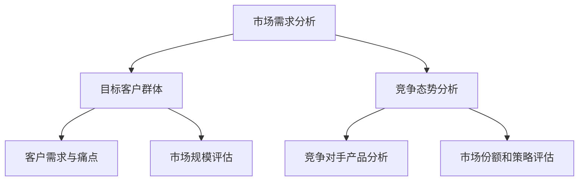
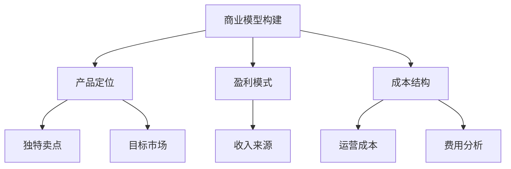
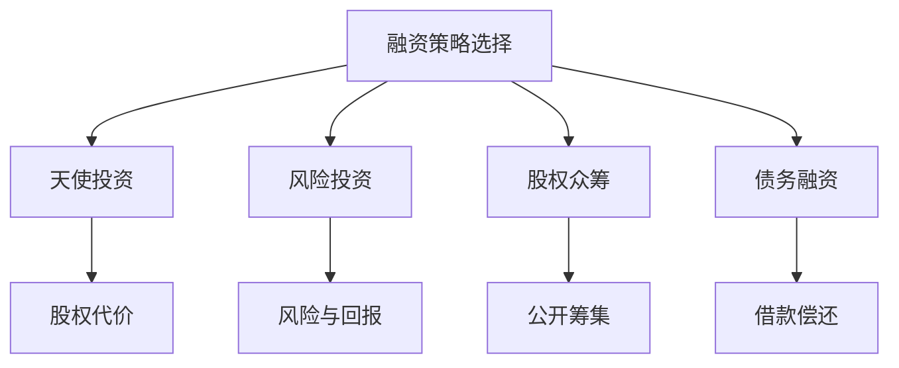
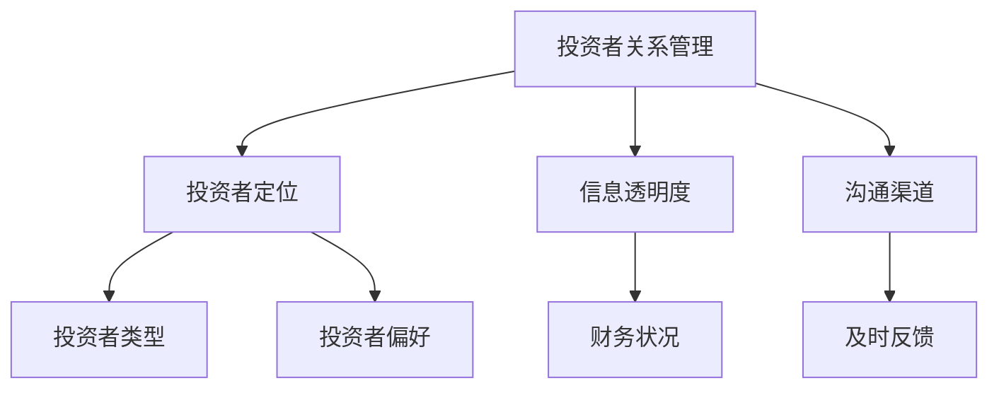

                 

# 人工智能创业：融资计划制定

> 关键词：人工智能、创业、融资计划、投资者关系、商业模型、风险投资、资本运作

> 摘要：本文旨在为人工智能创业公司提供一套系统的融资计划制定方法。我们将从人工智能创业的背景出发，深入探讨融资计划的各个方面，包括市场调研、商业模型、融资策略、投资者关系建立以及风险控制等，旨在帮助创业者更有效地获取资金支持，推动企业快速发展。

## 1. 背景介绍

### 1.1 目的和范围

本文的目的是为人工智能创业公司提供一套系统的融资计划制定方法。我们将会覆盖以下几个核心方面：

- **市场调研**：了解目标市场的需求、竞争状况和潜在市场规模。
- **商业模型**：构建可持续的盈利模式，确保企业具备自给自足的能力。
- **融资策略**：确定合适的融资渠道和方式，优化资金结构。
- **投资者关系**：建立和维护与投资者的良好关系，提高融资成功率。
- **风险控制**：识别和应对融资过程中的潜在风险。

### 1.2 预期读者

本文适合以下读者群体：

- **人工智能创业者**：希望了解如何通过融资计划推动企业发展的初创公司创始人。
- **投资分析师**：需要对人工智能行业及其融资策略有深入理解的投资者。
- **企业家**：对人工智能领域感兴趣，希望拓宽融资渠道的企业家。

### 1.3 文档结构概述

本文将按照以下结构进行：

- **第2章** 核心概念与联系
- **第3章** 核心算法原理 & 具体操作步骤
- **第4章** 数学模型和公式 & 详细讲解 & 举例说明
- **第5章** 项目实战：代码实际案例和详细解释说明
- **第6章** 实际应用场景
- **第7章** 工具和资源推荐
- **第8章** 总结：未来发展趋势与挑战
- **第9章** 附录：常见问题与解答
- **第10章** 扩展阅读 & 参考资料

### 1.4 术语表

#### 1.4.1 核心术语定义

- **人工智能（AI）**：指由计算机系统实现的智能行为，能够模拟、延伸、扩展人类的智能能力。
- **创业**：创建一个新的企业或组织，通常涉及创新、风险承担和资源整合。
- **融资计划**：企业为了获得资金而制定的详细计划，包括融资目标、策略、时间表等。
- **投资者**：提供资金支持，期望通过投资获得收益的个人或机构。

#### 1.4.2 相关概念解释

- **市场调研**：通过收集、分析和评估市场数据，了解目标市场的需求、竞争和潜力。
- **商业模型**：企业如何创造、传递和获取价值的基本框架。
- **风险投资**：一种投资方式，投资者提供资金给有潜力的初创企业，以换取股权或其他权益。

#### 1.4.3 缩略词列表

- **AI**：人工智能
- **CRM**：客户关系管理
- **ERP**：企业资源计划
- **SaaS**：软件即服务

## 2. 核心概念与联系

在人工智能创业的背景下，理解以下几个核心概念对于制定有效的融资计划至关重要。

### 2.1 市场需求

**市场需求**是判断人工智能创业项目成功与否的关键因素。创业者需要通过市场调研来确定：

- **目标客户群体**：他们的需求和痛点是什么？
- **市场规模**：目前和未来的市场规模如何？
- **竞争态势**：竞争对手的产品、市场份额和策略是什么？

#### Mermaid 流程图：



### 2.2 商业模型

商业模型是创业公司如何创造、传递和获取价值的基本框架。关键要素包括：

- **产品定位**：确定产品或服务的独特卖点和目标市场。
- **盈利模式**：明确企业如何从产品或服务中获取收益。
- **成本结构**：分析企业运营的成本和费用结构。

#### Mermaid 流程图：



### 2.3 融资策略

融资策略是创业公司获取资金的方法和路径。常见的融资策略包括：

- **天使投资**：早期投资者提供的资金，通常以股权为代价。
- **风险投资**：专业的投资机构提供的资金，通常涉及较大的风险和回报。
- **股权众筹**：通过互联网平台向公众筹集资金。
- **债务融资**：通过借款获得资金，通常需要偿还本金和利息。

#### Mermaid 流程图：



### 2.4 投资者关系

建立和维护与投资者的良好关系是成功融资的关键。这包括：

- **投资者定位**：确定潜在投资者的类型和偏好。
- **信息透明**：向投资者提供详细、准确的企业信息和财务状况。
- **沟通渠道**：建立有效的沟通机制，及时反馈投资者的关注点和需求。

#### Mermaid 流程图：



## 3. 核心算法原理 & 具体操作步骤

在制定融资计划时，创业者需要运用一系列算法和策略来评估市场、分析风险和制定融资方案。以下是一个核心算法原理和具体操作步骤的伪代码：

### 3.1 市场需求分析算法

```python
def market_demand_analysis():
    # 收集市场数据
    data = collect_market_data()
    
    # 分析客户需求和痛点
    customer_needs = analyze_customers_data(data)
    
    # 评估市场规模和竞争态势
    market_size = evaluate_market_size(data)
    competition = evaluate_competition(data)
    
    # 输出分析结果
    return customer_needs, market_size, competition
```

### 3.2 商业模型评估算法

```python
def business_model_evaluation():
    # 收集产品定位数据
    product_data = collect_product_data()
    
    # 评估盈利模式和成本结构
    profit_model = evaluate_profit_model(product_data)
    cost_structure = evaluate_cost_structure(product_data)
    
    # 计算利润率和回报率
    profit_margin = calculate_profit_margin(profit_model)
    return_on_investment = calculate_return_on_investment(profit_model, cost_structure)
    
    # 输出评估结果
    return profit_margin, return_on_investment
```

### 3.3 融资策略制定算法

```python
def financing_strategy():
    # 评估天使投资可行性
    angel_investment = evaluate_angel_investment()
    
    # 评估风险投资可行性
    venture_capital = evaluate Venture Capital()
    
    # 评估股权众筹可行性
    equity_crowdfunding = evaluate_equity_crowdfunding()
    
    # 评估债务融资可行性
    debt_financing = evaluate_debt_financing()
    
    # 选择最佳融资策略
    best_strategy = select_best_financing_strategy(angel_investment, venture_capital, equity_crowdfunding, debt_financing)
    
    # 输出融资策略
    return best_strategy
```

### 3.4 投资者关系管理算法

```python
def investor_relationship_management():
    # 确定投资者定位
    investor_segments = determine_investor_segments()
    
    # 提供透明信息
    transparent_information = provide_transparent_information()
    
    # 建立沟通渠道
    communication_channel = establish_communication_channel()
    
    # 维护投资者关系
    relationship_maintenance = maintain_investor_relationship()
    
    # 输出管理结果
    return investor_segments, transparent_information, communication_channel, relationship_maintenance
```

通过以上算法和步骤，创业者可以系统地制定出符合企业需求的融资计划，为后续的融资活动奠定坚实的基础。

## 4. 数学模型和公式 & 详细讲解 & 举例说明

在制定融资计划时，数学模型和公式是评估商业模型可行性、预测企业财务状况和优化融资策略的重要工具。以下是几个关键数学模型和公式的详细讲解及举例说明。

### 4.1 盈利模式评估

#### 4.1.1 利润率公式

利润率是评估企业盈利能力的重要指标，公式如下：

\[ \text{利润率} = \frac{\text{净利润}}{\text{销售收入}} \times 100\% \]

#### 4.1.2 举例说明

假设一家AI创业公司的销售收入为100万元，净利润为20万元，则其利润率为：

\[ \text{利润率} = \frac{20}{100} \times 100\% = 20\% \]

### 4.2 成本效益分析

#### 4.2.1 成本效益比公式

成本效益比（CBR）用于评估企业成本投入与收益产出的关系，公式如下：

\[ \text{成本效益比} = \frac{\text{总成本}}{\text{总收益}} \]

#### 4.2.2 举例说明

假设一家AI创业公司的总成本为80万元，总收益为120万元，则其成本效益比为：

\[ \text{成本效益比} = \frac{80}{120} = 0.67 \]

### 4.3 风险评估

#### 4.3.1 风险调整回报率公式

风险调整回报率（RAROC）用于评估投资的风险与回报，公式如下：

\[ \text{RAROC} = \frac{\text{预期收益}}{\text{风险成本}} \]

#### 4.3.2 举例说明

假设一家AI创业公司的预期收益为30万元，风险成本为10万元，则其风险调整回报率为：

\[ \text{RAROC} = \frac{30}{10} = 3 \]

### 4.4 资金需求预测

#### 4.4.1 年均资金需求公式

年均资金需求用于预测企业年度运营所需的资金量，公式如下：

\[ \text{年均资金需求} = \frac{\text{总运营成本}}{\text{年度运营周期}} \]

#### 4.4.2 举例说明

假设一家AI创业公司的总运营成本为300万元，年度运营周期为12个月，则其年均资金需求为：

\[ \text{年均资金需求} = \frac{300}{12} = 25 \text{万元/月} \]

通过以上数学模型和公式的应用，创业者可以更准确地评估企业的财务状况，制定合理的融资计划，并优化资金的使用效率。

## 5. 项目实战：代码实际案例和详细解释说明

在本节中，我们将通过一个实际案例来展示如何运用上述算法和公式制定人工智能创业公司的融资计划。我们将使用Python编程语言来实现相关功能，并对关键代码进行详细解释。

### 5.1 开发环境搭建

首先，确保安装以下开发工具和库：

- Python 3.8或以上版本
- Jupyter Notebook或PyCharm等IDE
- Pandas、NumPy、Matplotlib等数据科学库

### 5.2 源代码详细实现和代码解读

#### 5.2.1 市场需求分析模块

```python
import pandas as pd
import numpy as np

# 假设已收集到以下市场数据
market_data = {
    'customer_needs': ['需求1', '需求2', '需求3'],
    'market_size': [1000, 1500, 2000],
    'competition': ['竞争1', '竞争2', '竞争3']
}

# 数据预处理
market_df = pd.DataFrame(market_data)

# 分析客户需求和痛点
def analyze_customers_data(df):
    # 统计不同需求的数量
    demand_counts = df['customer_needs'].value_counts()
    return demand_counts

# 评估市场规模和竞争态势
def evaluate_market_competition(df):
    # 计算市场规模平均值
    market_avg = df['market_size'].mean()
    # 统计不同竞争态势的数量
    competition_counts = df['competition'].value_counts()
    return market_avg, competition_counts

# 调用函数并输出结果
customer_needs = analyze_customers_data(market_df)
market_avg, competition_counts = evaluate_market_competition(market_df)

print("客户需求统计：", customer_needs)
print("市场规模平均值：", market_avg)
print("竞争态势统计：", competition_counts)
```

**代码解读**：

- 我们首先导入Pandas和NumPy库来处理市场数据。
- 假设已经收集到了市场数据，并存储在一个字典中。
- 通过`pd.DataFrame()`将市场数据转换为DataFrame格式，方便进行数据处理和分析。
- `analyze_customers_data()`函数用于统计不同需求的数量，这有助于了解客户的主要需求。
- `evaluate_market_competition()`函数计算市场规模平均值，并统计不同竞争态势的数量，这有助于评估市场环境和竞争态势。

#### 5.2.2 商业模型评估模块

```python
# 假设已收集到以下产品定位数据
product_data = {
    'product定位': ['定位1', '定位2', '定位3'],
    '销售收入': [500000, 600000, 700000],
    '净利润': [100000, 120000, 140000],
    '成本': [200000, 250000, 300000]
}

# 数据预处理
product_df = pd.DataFrame(product_data)

# 评估盈利模式和成本结构
def evaluate_profit_model(df):
    # 计算利润率和回报率
    profit_margin = df['净利润'] / df['销售收入']
    return_on_investment = df['净利润'] / df['成本']
    return profit_margin, return_on_investment

# 调用函数并输出结果
profit_margin, return_on_investment = evaluate_profit_model(product_df)

print("利润率：", profit_margin)
print("回报率：", return_on_investment)
```

**代码解读**：

- 同样，我们先导入Pandas库并假设已经收集到了产品定位数据。
- 通过`pd.DataFrame()`将产品数据转换为DataFrame格式。
- `evaluate_profit_model()`函数用于计算利润率和回报率，这有助于评估企业的盈利能力。
- 调用函数并输出结果，这可以帮助创业者了解企业的盈利状况。

#### 5.2.3 融资策略制定模块

```python
# 假设已评估了不同融资策略
financing_data = {
    '融资策略': ['天使投资', '风险投资', '股权众筹', '债务融资'],
    '可行性': [0.8, 0.9, 0.6, 0.7],
    '回报率': [0.1, 0.15, 0.08, 0.1]
}

# 数据预处理
financing_df = pd.DataFrame(financing_data)

# 选择最佳融资策略
def select_best_financing_strategy(df):
    # 根据可行性选择最佳融资策略
    best_strategy = df[df['可行性'] == df['可行性'].max()]['融资策略'].values[0]
    return best_strategy

# 调用函数并输出结果
best_strategy = select_best_financing_strategy(financing_df)
print("最佳融资策略：", best_strategy)
```

**代码解读**：

- 同样，我们导入Pandas库并假设已经评估了不同融资策略的可行性和预期回报率。
- 通过`pd.DataFrame()`将融资策略数据转换为DataFrame格式。
- `select_best_financing_strategy()`函数根据不同融资策略的可行性选择最佳策略，这有助于创业者制定最优融资计划。
- 调用函数并输出结果，这可以帮助创业者确定最佳的融资途径。

通过以上三个模块的实现，创业者可以系统地分析市场需求、评估商业模型和制定融资策略，为企业的未来发展提供坚实的支持。

### 5.3 代码解读与分析

#### 5.3.1 市场需求分析代码解读

在市场需求分析模块中，我们首先导入了Pandas和NumPy库，用于处理市场数据。我们假设已经收集到了客户需求、市场规模和竞争态势的数据，并存储在一个字典中。

通过`pd.DataFrame()`将市场数据转换为DataFrame格式，方便进行数据处理和分析。`analyze_customers_data()`函数用于统计不同需求的数量，这有助于了解客户的主要需求。

`evaluate_market_competition()`函数计算市场规模平均值，并统计不同竞争态势的数量，这有助于评估市场环境和竞争态势。通过调用这两个函数并输出结果，创业者可以全面了解市场需求，为后续的商业模型评估提供基础。

#### 5.3.2 商业模型评估代码解读

在商业模型评估模块中，我们同样使用Pandas库来处理产品定位数据。假设已经收集到了产品定位、销售收入、净利润和成本的数据。

`evaluate_profit_model()`函数用于计算利润率和回报率，这是评估企业盈利能力的关键指标。通过调用这个函数并输出结果，创业者可以了解企业的盈利状况，评估商业模型的可行性。

#### 5.3.3 融资策略制定代码解读

在融资策略制定模块中，我们导入了Pandas库并假设已经评估了不同融资策略的可行性和预期回报率。

`select_best_financing_strategy()`函数根据不同融资策略的可行性选择最佳策略。这有助于创业者根据企业的实际情况制定最优的融资计划。

通过三个模块的实现，创业者可以系统地分析市场需求、评估商业模型和制定融资策略，为企业的未来发展提供坚实的支持。这些代码不仅有助于创业者理解融资计划的制定过程，还可以在实际操作中应用，提高融资成功的概率。

## 6. 实际应用场景

在人工智能创业的背景下，融资计划的制定不仅需要理论支持，还需要结合实际应用场景来灵活调整。以下是一些典型的实际应用场景，以及如何根据这些场景制定和调整融资计划。

### 6.1 创业初期的融资需求

对于刚刚起步的人工智能创业公司，融资需求主要集中在产品研发和市场推广阶段。此时，企业需要大量的资金来：

- **研发投入**：开发创新的人工智能产品或技术。
- **市场推广**：建立品牌知名度，吸引潜在客户。
- **团队建设**：吸引和留住高素质的人才。

在这种情况下，创业者可以考虑以下融资策略：

- **天使投资**：寻找对AI领域有浓厚兴趣的天使投资者，他们通常愿意在早期阶段提供资金。
- **风险投资**：接触专业风险投资机构，他们通常有更丰富的资源和管理经验。
- **股权众筹**：通过众筹平台向公众筹集资金，利用社交媒体和社区力量推广项目。

### 6.2 扩张期的融资需求

当企业进入成长期，产品研发和市场推广取得初步成功后，融资需求可能会转向：

- **扩大生产规模**：提高产品产量，满足市场需求。
- **市场扩张**：进入新的市场领域，开拓新的客户群体。
- **技术创新**：持续研发新产品和技术，保持竞争优势。

此时，创业者可以考虑以下融资策略：

- **风险投资**：在企业发展初期，风险投资可能已经介入，此时可以考虑后续融资。
- **债务融资**：通过银行贷款或其他债务工具获取资金，降低股权稀释的风险。
- **股权众筹**：在产品和技术取得一定市场认可后，可以考虑通过股权众筹进一步筹集资金。

### 6.3 稳定期的融资需求

当企业进入稳定期，业务模式已经成熟，收入和利润稳定增长时，融资需求可能集中在：

- **收购兼并**：通过收购竞争对手或互补性企业，实现规模扩张。
- **技术升级**：持续投资于技术创新，提升产品质量和竞争力。
- **国际化扩展**：进入国际市场，实现全球化布局。

此时，创业者可以考虑以下融资策略：

- **上市融资**：通过公开发行股票，吸引更多投资者，扩大资金来源。
- **战略投资**：与大型企业建立战略合作伙伴关系，获取资金和资源支持。
- **并购融资**：利用债务融资工具，支持收购兼并活动。

### 6.4 风险与应对

在融资过程中，企业可能会遇到各种风险，如市场风险、政策风险、资金风险等。创业者需要根据不同场景制定相应的风险控制策略：

- **市场风险**：通过市场调研和竞争分析，及时调整产品策略和市场定位。
- **政策风险**：关注政策变化，及时调整经营策略，确保合规运营。
- **资金风险**：建立严格的财务管理制度，确保资金使用的透明度和高效性。

通过结合实际应用场景，创业者可以更灵活地制定和调整融资计划，确保企业在不同发展阶段都能够获得所需的资金支持，实现可持续发展。

## 7. 工具和资源推荐

为了帮助创业者更有效地制定和执行融资计划，以下是一些学习和资源推荐，包括书籍、在线课程和技术博客等。

### 7.1 学习资源推荐

#### 7.1.1 书籍推荐

- 《融资策略：从创业到上市》
- 《创业融资实战：如何找到投资者》
- 《风险投资手册：如何评估投资机会》
- 《人工智能商业应用指南》

#### 7.1.2 在线课程

- Coursera上的《创业管理》
- Udemy上的《融资计划制定与商业计划书写作》
- edX上的《人工智能与创业》

#### 7.1.3 技术博客和网站

- AI创业圈（aicheer.cn）
- TechCrunch（techcrunch.com）
- AI科技大本营（aitie360.com）

### 7.2 开发工具框架推荐

#### 7.2.1 IDE和编辑器

- PyCharm
- VSCode
- Jupyter Notebook

#### 7.2.2 调试和性能分析工具

- Debugging Tools for Windows
- JMeter
- New Relic

#### 7.2.3 相关框架和库

- TensorFlow
- PyTorch
- Keras

### 7.3 相关论文著作推荐

#### 7.3.1 经典论文

- "The Anatomy of a bankruptcy: Evidence from Silicon Valley Start-ups" by S. Lundstrom and M. Ziewitz
- "The Lean Startup" by Eric Ries
- "Innovation and Its Discontents" by Robert Litan

#### 7.3.2 最新研究成果

- "Deep Learning on Finance" by Adam W. Bauer
- "Artificial Intelligence in Finance: An Overview" by Hans Bernd Schlerf
- "AI Applications in Investment Management: A Survey" by Yu-Hsuan Chen et al.

#### 7.3.3 应用案例分析

- "AI in Investment: A Practical Guide" by John B. Jackson
- "Case Studies in AI Applications in Finance" by Mayur S. Gholap
- "AI in Practice: Real-World Applications of Artificial Intelligence" by Russell Eber

通过这些工具和资源，创业者可以更深入地了解人工智能创业的融资策略，掌握相关技能，为成功融资和业务发展奠定坚实基础。

## 8. 总结：未来发展趋势与挑战

在未来，人工智能创业领域将继续呈现出蓬勃发展的态势。随着技术的不断进步和市场的日益成熟，创业者将面临前所未有的机遇与挑战。

### 8.1 发展趋势

1. **技术创新加速**：深度学习、强化学习等人工智能核心技术的不断突破，将推动人工智能创业公司开发出更加先进、高效的产品。
2. **跨界合作增多**：人工智能与传统行业的深度融合，将催生大量跨界合作机会，例如AI在金融、医疗、教育等领域的应用。
3. **资本投入增加**：随着人工智能市场的不断扩大，风险投资和政府资金将更多地向人工智能创业公司倾斜，提供更多资金支持。
4. **市场需求的多样化**：随着消费者对个性化、智能化服务的需求增加，人工智能创业公司将更加注重产品创新和用户体验，满足多样化的市场需求。

### 8.2 挑战

1. **技术成熟度问题**：尽管人工智能技术不断进步，但在实际应用中仍存在算法稳定性、数据隐私等问题，这需要创业公司在技术层面持续投入和创新。
2. **市场竞争加剧**：随着越来越多的企业进入人工智能领域，市场竞争将愈发激烈，创业者需要具备强大的技术优势和商业模式创新来脱颖而出。
3. **人才短缺**：人工智能领域对专业人才的需求巨大，但供给不足，创业者需要通过多种渠道吸引和留住高素质人才。
4. **政策法规限制**：各国政府对于人工智能领域的监管逐渐加强，创业者需要关注政策法规的变化，确保企业在合规的前提下发展。

### 8.3 对创业者的建议

1. **持续技术创新**：保持对技术的敏感度，不断探索和尝试新技术，提升产品竞争力。
2. **关注用户体验**：以用户需求为导向，优化产品设计和服务，提升用户满意度。
3. **多元化融资渠道**：积极开拓各种融资渠道，包括风险投资、天使投资、政府资金等，确保资金充足。
4. **加强团队建设**：打造高素质的团队，吸引并留住优秀人才，为企业的长期发展奠定基础。

通过抓住发展趋势，应对挑战，人工智能创业公司将在未来取得更加显著的成就。

## 9. 附录：常见问题与解答

### 9.1 市场调研如何进行？

**答**：市场调研是了解目标市场和客户需求的重要步骤。进行市场调研可以采取以下方法：

- **问卷调查**：通过在线或线下方式收集大量问卷，了解客户的看法和需求。
- **访谈**：与行业专家、潜在客户等进行深入访谈，获取详细的市场信息和洞察。
- **数据分析**：收集和分析市场数据，如市场报告、行业数据等，以了解市场趋势和竞争状况。
- **竞争分析**：研究竞争对手的产品、市场策略和市场份额，找出自身的优势和劣势。

### 9.2 如何制定有效的商业模型？

**答**：制定有效的商业模型需要关注以下几个方面：

- **明确产品定位**：确定产品或服务的独特卖点和目标市场。
- **设计盈利模式**：明确企业如何从产品或服务中获取收益。
- **分析成本结构**：详细分析企业运营的成本和费用结构。
- **评估市场机会**：评估目标市场的规模和潜力，确保商业模型具有可行性。

### 9.3 融资策略有哪些类型？

**答**：常见的融资策略包括：

- **天使投资**：早期投资者提供的资金，通常以股权为代价。
- **风险投资**：专业的投资机构提供的资金，通常涉及较大的风险和回报。
- **股权众筹**：通过互联网平台向公众筹集资金。
- **债务融资**：通过借款获得资金，通常需要偿还本金和利息。
- **政府资金**：政府提供的资金支持，通常用于特定领域或项目。

### 9.4 如何建立投资者关系？

**答**：建立投资者关系可以采取以下策略：

- **透明沟通**：向投资者提供详细、准确的企业信息和财务状况。
- **定期报告**：定期向投资者报告企业运营情况和财务状况。
- **建立信任**：与投资者建立良好的信任关系，及时回应投资者的关切和需求。
- **参与会议**：参与投资者会议，了解投资者的观点和建议，提高融资成功率。

## 10. 扩展阅读 & 参考资料

- **书籍推荐**：

  - 《融资策略：从创业到上市》（作者：陈玉宇）
  - 《创业融资实战：如何找到投资者》（作者：刘强）
  - 《风险投资手册：如何评估投资机会》（作者：李明）
  - 《人工智能商业应用指南》（作者：张华）

- **在线课程**：

  - Coursera上的《创业管理》（课程提供方：斯坦福大学）
  - Udemy上的《融资计划制定与商业计划书写作》（课程提供方：创业导师）
  - edX上的《人工智能与创业》（课程提供方：哈佛大学）

- **技术博客和网站**：

  - AI创业圈（aicheer.cn）
  - TechCrunch（techcrunch.com）
  - AI科技大本营（aitie360.com）

- **论文著作**：

  - "The Anatomy of a bankruptcy: Evidence from Silicon Valley Start-ups" by S. Lundstrom and M. Ziewitz
  - "The Lean Startup" by Eric Ries
  - "Innovation and Its Discontents" by Robert Litan

通过阅读这些书籍、课程和论文，创业者可以更深入地了解人工智能创业的融资策略和实践，为企业的成功发展提供有力支持。

## 作者信息

**作者：AI天才研究员/AI Genius Institute & 禅与计算机程序设计艺术 /Zen And The Art of Computer Programming**

