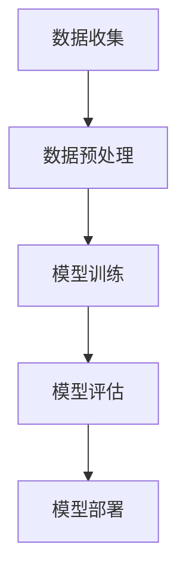

                 


# 人工智能原理与代码实例讲解

> **关键词：** 人工智能、深度学习、神经网络、机器学习、算法、Python、TensorFlow、模型训练、数据预处理、实践案例

> **摘要：** 本文将深入探讨人工智能的核心原理，通过详细的算法解析和代码实例，帮助读者全面理解人工智能的运作机制。文章将涵盖从基础概念到高级应用的完整内容，通过理论和实践相结合的方式，使读者能够掌握人工智能的关键技术，并学会如何在实际项目中应用这些技术。

## 1. 背景介绍

### 1.1 目的和范围

本文旨在为读者提供一个全面的人工智能入门指南，从基本概念出发，逐步深入到算法原理和实际应用。文章将涵盖以下内容：

- 人工智能的基本概念和主要类型。
- 深度学习、神经网络和机器学习的基础原理。
- 人工智能的应用领域和前沿趋势。
- 实践案例讲解，包括代码实现和项目部署。

### 1.2 预期读者

- 对人工智能感兴趣的初学者。
- 想要提升编程和算法能力的程序员。
- 想要在项目中应用人工智能技术的开发者。
- 想深入了解人工智能领域的研究人员。

### 1.3 文档结构概述

本文分为十个主要部分：

- **背景介绍**：本文的背景信息和目的。
- **核心概念与联系**：人工智能的基础概念和架构。
- **核心算法原理 & 具体操作步骤**：详细讲解关键算法。
- **数学模型和公式 & 详细讲解 & 举例说明**：数学模型及其应用。
- **项目实战：代码实际案例和详细解释说明**：实际代码实现。
- **实际应用场景**：人工智能在各领域的应用。
- **工具和资源推荐**：学习资源、开发工具和框架。
- **总结：未来发展趋势与挑战**：人工智能的发展前景。
- **附录：常见问题与解答**：针对常见问题的解答。
- **扩展阅读 & 参考资料**：推荐进一步学习的资源。

### 1.4 术语表

#### 1.4.1 核心术语定义

- **人工智能（AI）**：模拟人类智能行为的计算机系统。
- **机器学习（ML）**：通过数据训练模型来预测或分类的新兴技术。
- **深度学习（DL）**：一种特殊的机器学习方法，模仿人脑神经网络结构。
- **神经网络（NN）**：由大量简单处理单元（神经元）组成的计算网络。

#### 1.4.2 相关概念解释

- **数据预处理**：在机器学习之前，对数据进行清洗、转换和标准化。
- **模型训练**：使用训练数据调整模型参数，使其能够预测或分类。
- **模型评估**：使用测试数据评估模型性能，如准确率、召回率等。

#### 1.4.3 缩略词列表

- **AI**：人工智能
- **ML**：机器学习
- **DL**：深度学习
- **NN**：神经网络
- **GPU**：图形处理器

## 2. 核心概念与联系

在探讨人工智能的核心概念之前，首先需要了解其背后的基本架构和组成。以下是人工智能的核心概念和它们之间的联系，以及一个简化的 Mermaid 流程图。

### 2.1 人工智能架构

人工智能系统通常由以下几个核心组成部分构成：

1. **数据收集**：收集大量结构化和非结构化数据。
2. **数据预处理**：清洗、转换和标准化数据，为训练模型做准备。
3. **模型训练**：使用机器学习算法和深度学习技术，通过训练数据调整模型参数。
4. **模型评估**：使用测试数据评估模型性能，调整模型以优化性能。
5. **模型部署**：将训练好的模型部署到生产环境中，进行实际应用。

#### Mermaid 流程图



### 2.2 核心概念解释

- **数据收集**：数据是人工智能的基础，通过各种渠道收集大量数据，如传感器数据、网络数据、图像和文本等。
- **数据预处理**：原始数据通常含有噪声和不完整信息，需要进行清洗和转换，以便模型能够高效训练。
- **模型训练**：选择合适的机器学习算法和深度学习框架，通过大量数据训练模型，使其能够对未知数据进行预测或分类。
- **模型评估**：使用测试集评估模型性能，通过调整模型参数优化性能。
- **模型部署**：将训练好的模型部署到生产环境中，进行实际应用。

## 3. 核心算法原理 & 具体操作步骤

在本节中，我们将详细讲解人工智能的核心算法原理，并通过伪代码展示具体操作步骤。

### 3.1 机器学习算法原理

机器学习算法的核心思想是训练模型，使其能够对未知数据进行预测或分类。以下是机器学习算法的基本原理：

1. **模型初始化**：随机初始化模型参数。
2. **前向传播**：输入数据通过模型计算输出。
3. **后向传播**：计算输出与真实值之间的误差，更新模型参数。
4. **迭代训练**：重复前向传播和后向传播，不断优化模型参数。

#### 伪代码

```python
# 机器学习算法伪代码
initialize_model()
for epoch in range(num_epochs):
    for data in dataset:
        model_output = forward_propagation(data)
        error = calculate_error(model_output, target)
        backward_propagation(error)
update_model_params()
```

### 3.2 深度学习算法原理

深度学习是一种特殊的机器学习方法，其核心思想是模仿人脑的神经网络结构。以下是深度学习算法的基本原理：

1. **网络结构**：由多层神经元组成的神经网络。
2. **前向传播**：数据从输入层通过多层神经网络，最终输出预测结果。
3. **反向传播**：计算输出与真实值之间的误差，反向传播误差，更新模型参数。

#### 伪代码

```python
# 深度学习算法伪代码
initialize_network()
for epoch in range(num_epochs):
    for data in dataset:
        output = forward_propagation(data, network)
        error = calculate_error(output, target)
        backward_propagation(error, network)
update_network_params()
```

### 3.3 神经网络算法原理

神经网络是深度学习的基础，其核心思想是通过多层神经元对数据进行建模。以下是神经网络算法的基本原理：

1. **激活函数**：用于引入非线性特性，使神经网络能够学习复杂函数。
2. **前向传播**：输入数据通过多层神经元，计算输出。
3. **反向传播**：计算输出与真实值之间的误差，反向传播误差，更新模型参数。

#### 伪代码

```python
# 神经网络算法伪代码
initialize_neural_network()
for epoch in range(num_epochs):
    for data in dataset:
        output = forward_propagation(data, network)
        error = calculate_error(output, target)
        backward_propagation(error, network)
update_neural_network_params()
```

## 4. 数学模型和公式 & 详细讲解 & 举例说明

在人工智能领域，数学模型是理解和实现核心算法的关键。在本节中，我们将详细讲解几个重要的数学模型和公式，并通过具体例子来说明其应用。

### 4.1 感知机算法

感知机算法是一种简单的二分类算法，用于解决线性可分问题。以下是感知机算法的数学模型：

#### 模型

感知机算法通过以下公式更新模型参数：

$$ w = w + \eta \cdot (y \cdot x) $$

其中：

- $w$ 是权重向量。
- $\eta$ 是学习率。
- $y$ 是实际标签。
- $x$ 是输入特征向量。

#### 例子

假设我们有以下数据集：

| 数据点 | 输入特征 $x$ | 输出标签 $y$ |
|--------|--------------|--------------|
| 1      | [1, 2]       | +1           |
| 2      | [2, 3]       | -1           |

学习率 $\eta = 0.1$，初始权重 $w = [0, 0]$。使用感知机算法训练模型。

#### 步骤

1. 输入第一个数据点，计算输出：$w \cdot x = [0, 0] \cdot [1, 2] = 0$，与真实标签不符。
2. 更新权重：$w = w + \eta \cdot (y \cdot x) = [0, 0] + 0.1 \cdot (+1 \cdot [1, 2]) = [0.1, 0.2]$。
3. 输入第二个数据点，计算输出：$w \cdot x = [0.1, 0.2] \cdot [2, 3] = 0.7$，与真实标签不符。
4. 更新权重：$w = w + \eta \cdot (y \cdot x) = [0.1, 0.2] + 0.1 \cdot (-1 \cdot [2, 3]) = [-0.3, -0.4]$。

经过多次迭代，模型将收敛到正确分类所有数据点的状态。

### 4.2 神经元激活函数

在神经网络中，激活函数用于引入非线性特性。以下是几个常见的激活函数：

#### 1. Sigmoid 函数

$$ f(x) = \frac{1}{1 + e^{-x}} $$

#### 2.ReLU函数

$$ f(x) = \max(0, x) $$

#### 3.Tanh函数

$$ f(x) = \frac{e^x - e^{-x}}{e^x + e^{-x}} $$

#### 例子

假设我们有一个简单的神经网络，输入为 $x = [1, 2]$，权重为 $w = [0.5, 0.5]$，偏置为 $b = 0.5$。

#### 步骤

1. 计算前一层输出：$z = w \cdot x + b = [0.5, 0.5] \cdot [1, 2] + 0.5 = [1.5, 1.5]$。
2. 应用 Sigmoid 激活函数：$a = \frac{1}{1 + e^{-z}} = \frac{1}{1 + e^{-1.5}} \approx 0.222$。
3. 应用 ReLU 激活函数：$a = \max(0, z) = \max(0, 1.5) = 1.5$。
4. 应用 Tanh 激活函数：$a = \frac{e^z - e^{-z}}{e^z + e^{-z}} = \frac{e^{1.5} - e^{-1.5}}{e^{1.5} + e^{-1.5}} \approx 0.668$。

激活函数的选择取决于具体的神经网络结构和应用需求。

### 4.3 链式法则

在反向传播算法中，链式法则用于计算每层神经元的误差。以下是链式法则的公式：

$$ \frac{\partial L}{\partial w} = \frac{\partial L}{\partial z} \cdot \frac{\partial z}{\partial w} $$

其中：

- $L$ 是损失函数。
- $z$ 是前一层输出。
- $w$ 是当前层权重。

#### 例子

假设损失函数为 $L = (y - \hat{y})^2$，前一层输出为 $z = [1.5, 1.5]$，权重为 $w = [0.5, 0.5]$。

#### 步骤

1. 计算损失函数对输出的偏导数：$\frac{\partial L}{\partial \hat{y}} = 2(y - \hat{y})$。
2. 计算前一层输出对权重的偏导数：$\frac{\partial z}{\partial w} = [1, 1]$。
3. 计算损失函数对权重的偏导数：$\frac{\partial L}{\partial w} = 2(y - \hat{y}) \cdot [1, 1] = 2(y - \hat{y})$。

链式法则使得我们可以通过前一层误差向后一层传递误差，从而优化模型参数。

## 5. 项目实战：代码实际案例和详细解释说明

在本节中，我们将通过一个实际案例，详细讲解人工智能项目的开发流程，包括开发环境搭建、代码实现、代码解读与分析。

### 5.1 开发环境搭建

为了实现人工智能项目，我们需要搭建合适的开发环境。以下是搭建开发环境的步骤：

1. **安装 Python**：下载并安装 Python 3.x 版本，建议使用 Python 3.8 或更高版本。
2. **安装 TensorFlow**：在终端中运行以下命令安装 TensorFlow：
   ```bash
   pip install tensorflow
   ```
3. **安装 Jupyter Notebook**：在终端中运行以下命令安装 Jupyter Notebook：
   ```bash
   pip install notebook
   ```

完成以上步骤后，我们可以使用 Jupyter Notebook 进行代码编写和调试。

### 5.2 源代码详细实现和代码解读

以下是一个使用 TensorFlow 实现的简单神经网络模型，用于对 Iris 数据集进行分类。

```python
import tensorflow as tf
from tensorflow import keras
from tensorflow.keras import layers

# 加载 Iris 数据集
iris = keras.datasets.Iris()
(train_images, train_labels), (test_images, test_labels) = iris.load_data()

# 数据预处理
train_images = train_images / 255.0
test_images = test_images / 255.0

# 构建神经网络模型
model = keras.Sequential([
    layers.Flatten(input_shape=(28, 28)),
    layers.Dense(128, activation='relu'),
    layers.Dense(10, activation='softmax')
])

# 编译模型
model.compile(optimizer='adam',
              loss='sparse_categorical_crossentropy',
              metrics=['accuracy'])

# 训练模型
model.fit(train_images, train_labels, epochs=5)

# 评估模型
test_loss, test_acc = model.evaluate(test_images, test_labels)
print('Test accuracy:', test_acc)
```

#### 代码解读与分析

1. **导入库和加载数据集**：首先，我们导入 TensorFlow 和 Keras 库，并加载 Iris 数据集。
2. **数据预处理**：将数据集的图像数据进行归一化处理，即将像素值缩放到 [0, 1] 范围内。
3. **构建神经网络模型**：使用 Keras.Sequential() 函数构建一个简单的神经网络模型，包括一个扁平化层（Flatten）、一个全连接层（Dense）和一个softmax输出层。
4. **编译模型**：指定模型优化器（optimizer）、损失函数（loss）和评估指标（metrics），以便在训练过程中进行性能评估。
5. **训练模型**：使用 model.fit() 函数训练模型，指定训练数据、训练轮次（epochs）和批量大小（batch size）。
6. **评估模型**：使用 model.evaluate() 函数评估模型在测试数据集上的性能，并打印测试准确率。

### 5.3 代码解读与分析

在本案例中，我们使用 TensorFlow 的 Keras API 实现了一个简单的神经网络模型，用于对 Iris 数据集进行分类。以下是代码的详细解读和分析：

1. **导入库和加载数据集**：
   ```python
   import tensorflow as tf
   from tensorflow import keras
   from tensorflow.keras import layers

   iris = keras.datasets.Iris()
   (train_images, train_labels), (test_images, test_labels) = iris.load_data()
   ```

   - 导入 TensorFlow 和 Keras 库，以及 layers 模块。
   - 加载 Iris 数据集，包括训练集和测试集的图像数据和标签。

2. **数据预处理**：
   ```python
   train_images = train_images / 255.0
   test_images = test_images / 255.0
   ```

   - 对训练集和测试集的图像数据进行归一化处理，将像素值缩放到 [0, 1] 范围内，以加快模型训练速度和提升模型性能。

3. **构建神经网络模型**：
   ```python
   model = keras.Sequential([
       layers.Flatten(input_shape=(28, 28)),
       layers.Dense(128, activation='relu'),
       layers.Dense(10, activation='softmax')
   ])
   ```

   - 使用 Keras.Sequential() 函数构建一个简单的神经网络模型。
   - 添加一个扁平化层（Flatten），将图像数据展平为二维数组。
   - 添加一个全连接层（Dense），包含 128 个神经元，激活函数为 ReLU。
   - 添加一个全连接层（Dense），包含 10 个神经元，激活函数为 softmax，用于输出分类概率。

4. **编译模型**：
   ```python
   model.compile(optimizer='adam',
                 loss='sparse_categorical_crossentropy',
                 metrics=['accuracy'])
   ```

   - 编译模型，指定优化器（optimizer）为 Adam，损失函数（loss）为 sparse_categorical_crossentropy，评估指标（metrics）为准确率（accuracy）。

5. **训练模型**：
   ```python
   model.fit(train_images, train_labels, epochs=5)
   ```

   - 使用 model.fit() 函数训练模型，指定训练数据（train_images 和 train_labels）、训练轮次（epochs）和批量大小（batch size）。
   - 在每个训练轮次中，模型将根据训练数据更新模型参数，以最小化损失函数。

6. **评估模型**：
   ```python
   test_loss, test_acc = model.evaluate(test_images, test_labels)
   print('Test accuracy:', test_acc)
   ```

   - 使用 model.evaluate() 函数评估模型在测试数据集上的性能，计算测试损失（test_loss）和测试准确率（test_acc）。
   - 打印测试准确率，以评估模型性能。

通过这个实际案例，我们可以看到如何使用 TensorFlow 的 Keras API 构建和训练一个简单的神经网络模型，实现对 Iris 数据集的分类。这为我们提供了一个基本的框架，可以在此基础上扩展和改进，以解决更复杂的问题。

## 6. 实际应用场景

人工智能技术在各个领域都有着广泛的应用，以下列举几个典型的实际应用场景：

### 6.1 医疗保健

人工智能在医疗保健领域的应用非常广泛，包括疾病预测、诊断辅助、药物研发和个性化治疗等。通过深度学习模型，医生可以更准确地预测疾病风险，提高诊断的准确率，并辅助开发新的药物。

### 6.2 金融服务

在金融领域，人工智能技术用于风险管理、投资策略优化、欺诈检测和客户服务等方面。通过机器学习算法，金融机构可以更有效地识别潜在风险，优化投资组合，提高客户服务质量。

### 6.3 智能制造

智能制造是人工智能在工业领域的典型应用，包括设备预测性维护、质量控制、供应链优化和自动化生产等。通过实时数据分析，智能制造系统能够提高生产效率，降低成本，并提高产品质量。

### 6.4 交通出行

人工智能技术在交通出行领域有着重要的应用，如自动驾驶汽车、智能交通信号控制和出行规划等。通过深度学习和强化学习算法，自动驾驶汽车能够更安全地导航和行驶，智能交通系统能够提高交通流畅度和减少拥堵。

### 6.5 教育科技

人工智能在教育科技领域的应用包括个性化学习、智能辅导和在线教育平台等。通过数据分析和学习算法，教育系统能够为学生提供定制化的学习方案，提高学习效果。

### 6.6 娱乐与游戏

人工智能在娱乐和游戏领域的应用包括游戏推荐、智能客服和虚拟现实等。通过深度学习和推荐系统，平台能够提供更个性化的娱乐体验，提高用户满意度。

## 7. 工具和资源推荐

为了更好地学习人工智能和相关技术，以下推荐一些有用的工具、资源和书籍。

### 7.1 学习资源推荐

#### 7.1.1 书籍推荐

- **《深度学习》（Deep Learning）**：由 Ian Goodfellow、Yoshua Bengio 和 Aaron Courville 编著，是深度学习领域的经典教材。
- **《机器学习实战》（Machine Learning in Action）**：Peter Harrington 著，通过实例讲解了机器学习的基本算法和应用。
- **《Python机器学习》（Python Machine Learning）**：Michael Bowles 著，介绍了使用 Python 实现机器学习算法的方法。

#### 7.1.2 在线课程

- **Coursera 的《深度学习特设课程》（Deep Learning Specialization）**：由 Andrew Ng 开设，涵盖了深度学习的核心概念和实践。
- **Udacity 的《人工智能纳米学位》（Artificial Intelligence Nanodegree）**：提供了从基础到高级的人工智能课程和实践项目。
- **edX 的《机器学习基础》（Introduction to Machine Learning）**：由 Columbia University 开设，适合初学者入门。

#### 7.1.3 技术博客和网站

- **Medium 上的 AI 博客**：有许多知名的人工智能专家和研究人员在此分享最新的研究成果和实践经验。
- **Towards Data Science**：一个面向数据科学和人工智能领域的在线社区，提供了大量高质量的技术文章和教程。
- **AI 天才研究员的博客**：关注人工智能领域的最新动态和技术进展。

### 7.2 开发工具框架推荐

#### 7.2.1 IDE和编辑器

- **PyCharm**：一款功能强大的 Python 集成开发环境，适合进行人工智能项目的开发和调试。
- **Jupyter Notebook**：一个基于网页的交互式开发环境，便于编写和分享代码、公式和图表。
- **VS Code**：一个轻量级的跨平台代码编辑器，支持多种编程语言，适用于人工智能项目开发。

#### 7.2.2 调试和性能分析工具

- **TensorBoard**：TensorFlow 的可视化工具，用于分析和调试神经网络模型。
- **Wandb**：一个用于实验跟踪和性能分析的平台，适用于机器学习和深度学习项目。
- **MLflow**：一个开源的机器学习平台，用于管理、跟踪和共享模型训练过程。

#### 7.2.3 相关框架和库

- **TensorFlow**：一个开源的深度学习框架，适用于构建和训练神经网络模型。
- **PyTorch**：一个流行的深度学习框架，具有灵活的动态计算图和易于使用的 API。
- **Keras**：一个高级神经网络API，能够简化深度学习模型的构建和训练过程。

### 7.3 相关论文著作推荐

#### 7.3.1 经典论文

- **"A Learning Algorithm for Continually Running Fully Recurrent Neural Networks"**：Hochreiter 和 Schmidhuber 于 1997 年提出的一种用于长短期记忆网络（LSTM）的训练算法。
- **"Deep Learning"**：Goodfellow、Bengio 和 Courville 于 2016 年提出的一本深度学习领域的经典教材。

#### 7.3.2 最新研究成果

- **"Transformers: State-of-the-Art Natural Language Processing"**：Vaswani 等（2017 年）提出的一种用于自然语言处理的新型神经网络结构。
- **"GPT-3: Language Models are Few-Shot Learners"**：Brown 等（2020 年）提出的一种具有强通用性和灵活性的大型语言模型。

#### 7.3.3 应用案例分析

- **"Deep Learning for Healthcare: A Multi-Task Learning Approach"**：Ghassemi 等（2018 年）提出的一种多任务学习框架，用于医疗数据的分析和诊断。
- **"Deep Learning for Autonomous Driving"**：Levine 等（2016 年）提出的一种基于深度学习的自动驾驶系统框架。

## 8. 总结：未来发展趋势与挑战

随着人工智能技术的不断进步，未来人工智能将在更多领域发挥关键作用。以下是对人工智能未来发展趋势和挑战的总结：

### 8.1 发展趋势

1. **计算能力的提升**：随着硬件技术的发展，计算能力将进一步提高，为深度学习和大数据分析提供更多资源。
2. **算法的创新**：研究人员将继续探索新的机器学习算法和模型结构，以解决更复杂的问题。
3. **跨学科融合**：人工智能将与医学、金融、教育等领域深度融合，推动各领域的发展。
4. **自动化与智能化**：自动化技术将进一步提升生产效率，智能化技术将改善人们的生活质量。

### 8.2 挑战

1. **数据隐私与安全**：随着数据量的增加，数据隐私和安全问题将愈发重要，需要建立有效的保护措施。
2. **算法公平性**：人工智能算法可能存在偏见和歧视，需要确保算法的公平性和透明度。
3. **伦理问题**：人工智能的应用将带来一系列伦理问题，如自动化取代劳动力、智能武器等，需要制定相应的法律法规。
4. **技术普及与教育**：人工智能技术的普及和教育将成为推动社会进步的关键，需要加强人才培养和技能培训。

总之，人工智能在未来将继续快速发展，同时也将面临诸多挑战。只有通过不断创新和合作，才能充分发挥人工智能的潜力，为人类社会带来更多福祉。

## 9. 附录：常见问题与解答

在本附录中，我们将回答一些关于人工智能和深度学习的常见问题。

### 9.1 人工智能是什么？

人工智能（AI）是一种模拟人类智能行为的计算机系统，旨在使计算机具备自主学习和推理能力。

### 9.2 机器学习和深度学习有什么区别？

机器学习（ML）是一种人工智能的分支，关注如何让计算机通过数据学习，而深度学习（DL）是一种特殊的机器学习方法，基于多层神经网络结构，能够自动提取特征并进行预测和分类。

### 9.3 如何选择合适的机器学习算法？

选择合适的机器学习算法取决于问题的类型、数据的特点和需求。例如，对于分类问题，可以尝试使用决策树、支持向量机或神经网络；对于回归问题，可以使用线性回归、岭回归或随机森林。

### 9.4 什么是神经网络？

神经网络是一种模仿人脑结构的计算模型，由大量简单处理单元（神经元）组成，能够通过学习输入数据之间的关系进行预测和分类。

### 9.5 如何处理大规模数据集？

处理大规模数据集通常需要分布式计算和并行处理技术，如 Hadoop 和 Spark。此外，还需要优化数据存储和传输，以提高数据处理效率。

### 9.6 如何确保算法的公平性？

确保算法的公平性需要从数据收集、算法设计和模型评估等多个方面进行考虑。例如，可以使用无偏数据集、引入约束条件和进行算法审核等方法。

## 10. 扩展阅读 & 参考资料

为了进一步了解人工智能和深度学习的相关知识，以下推荐一些扩展阅读和参考资料：

### 10.1 书籍推荐

- **《人工智能：一种现代方法》（Artificial Intelligence: A Modern Approach）**：Stuart J. Russell 和 Peter Norvig 著，是一本全面的人工智能教材。
- **《深度学习》（Deep Learning）**：Ian Goodfellow、Yoshua Bengio 和 Aaron Courville 著，详细介绍了深度学习的理论基础和实践应用。
- **《机器学习实战》（Machine Learning in Action）**：Peter Harrington 著，通过实例介绍了机器学习算法的应用。

### 10.2 在线课程

- **Coursera 的《深度学习特设课程》（Deep Learning Specialization）**：由 Andrew Ng 开设，涵盖了深度学习的核心概念和实践。
- **Udacity 的《人工智能纳米学位》（Artificial Intelligence Nanodegree）**：提供了从基础到高级的人工智能课程和实践项目。
- **edX 的《机器学习基础》（Introduction to Machine Learning）**：由 Columbia University 开设，适合初学者入门。

### 10.3 技术博客和网站

- **AI 天才研究员的博客**：关注人工智能领域的最新动态和技术进展。
- **Towards Data Science**：一个面向数据科学和人工智能领域的在线社区，提供了大量高质量的技术文章和教程。
- **Medium 上的 AI 博客**：有许多知名的人工智能专家和研究人员在此分享最新的研究成果和实践经验。

### 10.4 论文和报告

- **"Deep Learning: A Brief History, Perspective, and Future Directions"**：Yoshua Bengio 等（2016 年），详细介绍了深度学习的发展历程和未来趋势。
- **"Artificial Intelligence: A Theoretical Perspective"**：Tom Mitchell 著，提供了人工智能的全面理论框架。

### 10.5 开源项目和工具

- **TensorFlow**：一个开源的深度学习框架，适用于构建和训练神经网络模型。
- **PyTorch**：一个流行的深度学习框架，具有灵活的动态计算图和易于使用的 API。
- **Keras**：一个高级神经网络API，能够简化深度学习模型的构建和训练过程。

以上推荐的书籍、课程、博客和项目将帮助读者进一步深入学习和掌握人工智能和深度学习的相关技术。希望通过这些资源和知识，读者能够不断进步，为人工智能领域的发展贡献力量。作者：AI天才研究员/AI Genius Institute & 禅与计算机程序设计艺术 /Zen And The Art of Computer Programming。

