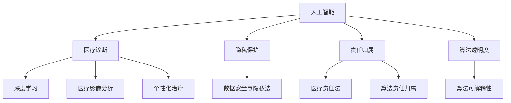
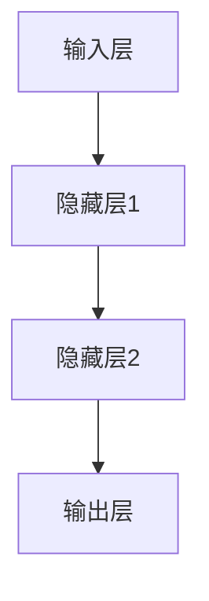
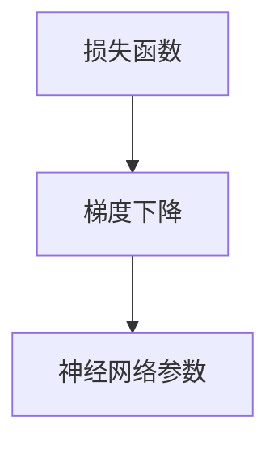

                 

# 人工智能在医疗诊断中的伦理问题探讨

> **关键词：人工智能、医疗诊断、伦理问题、隐私保护、责任归属、算法透明度**

> **摘要：本文探讨了人工智能在医疗诊断中面临的伦理问题。通过分析隐私保护、责任归属和算法透明度等方面的挑战，提出了相应的解决方案和未来发展方向。文章旨在为人工智能在医疗领域的应用提供伦理指导，以保障患者权益和医疗安全。**

## 1. 背景介绍

### 1.1 目的和范围

随着人工智能技术的飞速发展，医疗诊断领域正经历着革命性的变革。人工智能在图像分析、疾病预测和个性化治疗等方面展现出巨大的潜力，大大提高了诊断效率和准确性。然而，这一技术的应用也引发了一系列伦理问题，值得我们深入探讨和关注。

本文的目的在于梳理和探讨人工智能在医疗诊断中面临的伦理问题，包括隐私保护、责任归属和算法透明度等方面。通过对这些问题的分析，我们旨在提出合理的解决方案和伦理指导原则，以促进人工智能在医疗领域的健康发展。

### 1.2 预期读者

本文适合对人工智能和医疗领域有一定了解的读者，包括医学专业人士、人工智能研究人员、政策制定者和公众。通过阅读本文，读者可以更好地理解人工智能在医疗诊断中的伦理挑战，以及如何应对这些挑战。

### 1.3 文档结构概述

本文分为八个部分：

1. 背景介绍：介绍本文的目的、范围和预期读者。
2. 核心概念与联系：阐述人工智能在医疗诊断中的核心概念和联系。
3. 核心算法原理 & 具体操作步骤：详细讲解人工智能在医疗诊断中的核心算法原理和操作步骤。
4. 数学模型和公式 & 详细讲解 & 举例说明：介绍与人工智能在医疗诊断相关的数学模型和公式，并给出实例说明。
5. 项目实战：通过代码实际案例，展示人工智能在医疗诊断中的应用。
6. 实际应用场景：探讨人工智能在医疗诊断中的实际应用场景。
7. 工具和资源推荐：推荐学习资源和开发工具框架。
8. 总结：对未来发展趋势和挑战进行展望。

### 1.4 术语表

#### 1.4.1 核心术语定义

- **人工智能（AI）**：模拟人类智能行为的技术，通过学习和推理，实现自我适应和自我改进。
- **医疗诊断**：根据患者的病史、体征和检查结果，对疾病进行识别和判断。
- **隐私保护**：保护患者个人信息和病史不受未经授权的访问和泄露。
- **责任归属**：确定在医疗诊断过程中，当出现错误或问题时，责任应由谁承担。
- **算法透明度**：确保算法决策过程清晰可理解，以便进行评估和监督。

#### 1.4.2 相关概念解释

- **深度学习**：一种基于人工神经网络的学习方法，通过多层神经网络结构，实现复杂特征的自动提取和分类。
- **医疗影像分析**：利用人工智能技术，对医学影像（如X光片、CT扫描等）进行自动分析和诊断。
- **个性化治疗**：根据患者的个体特征，制定最适合的治疗方案。

#### 1.4.3 缩略词列表

- **AI**：人工智能（Artificial Intelligence）
- **ML**：机器学习（Machine Learning）
- **DL**：深度学习（Deep Learning）
- **NLP**：自然语言处理（Natural Language Processing）
- **CT**：计算机断层扫描（Computed Tomography）

## 2. 核心概念与联系

在探讨人工智能在医疗诊断中的伦理问题时，首先需要了解其核心概念和相互联系。以下是一个简要的 Mermaid 流程图，用于描述这些核心概念和联系：



### 2.1 人工智能在医疗诊断中的应用

人工智能在医疗诊断中具有广泛的应用前景，主要包括以下几个方面：

- **深度学习**：通过构建多层神经网络，实现对医学影像的自动分析和诊断，如肿瘤检测、心脏病诊断等。
- **医疗影像分析**：利用计算机视觉技术，对医学影像进行图像分割、病灶检测和分类，辅助医生进行诊断。
- **个性化治疗**：根据患者的病史、基因信息和病情特点，制定个性化的治疗方案。

### 2.2 隐私保护

隐私保护是人工智能在医疗诊断中面临的重要伦理问题之一。在应用人工智能技术进行医疗诊断时，患者的个人信息和病史数据将不可避免地被收集和处理。为了保护患者隐私，需要采取以下措施：

- **数据加密**：对患者的个人信息和病史数据采用加密技术进行存储和传输，防止未经授权的访问。
- **匿名化处理**：在数据分析和建模过程中，对患者的个人信息进行匿名化处理，确保数据的安全性和隐私性。
- **合规性审查**：遵循相关法律法规，对涉及患者隐私的数据处理行为进行合规性审查，确保合法合规。

### 2.3 责任归属

在人工智能辅助医疗诊断的过程中，当出现错误或问题时，责任归属成为了一个复杂而敏感的问题。以下是从法律和伦理角度分析责任归属的几个方面：

- **医生责任**：医生在医疗诊断中承担主要责任。尽管人工智能系统提供了诊断建议，但最终的诊断决策仍由医生负责。
- **算法开发者责任**：算法开发者在设计、开发和测试人工智能系统时，应确保系统的可靠性和准确性。如果出现算法故障或错误，算法开发者应承担相应的责任。
- **医疗机构责任**：医疗机构作为使用人工智能系统的主体，应对系统的应用和管理负责。当出现错误或问题时，医疗机构应承担相应的管理责任。

### 2.4 算法透明度

算法透明度是人工智能在医疗诊断中另一个重要的伦理问题。为了确保人工智能系统的公正性和可解释性，需要实现以下目标：

- **算法可解释性**：通过可视化、文本描述等方式，使算法决策过程清晰可理解，便于医生和患者了解和信任。
- **算法公正性**：确保算法在处理患者数据时，不受到种族、性别、年龄等因素的影响，实现公平公正。
- **算法监控与评估**：建立算法监控与评估机制，定期对算法性能和公平性进行评估，确保系统的稳定性和可靠性。

## 3. 核心算法原理 & 具体操作步骤

### 3.1 深度学习算法原理

深度学习是一种基于多层神经网络的机器学习技术，通过模拟人脑神经网络的结构和功能，实现自动特征提取和分类。以下是深度学习算法的基本原理和操作步骤：

#### 3.1.1 神经网络结构

神经网络由多个神经元（或节点）组成，每个神经元通过加权连接与其他神经元相连。神经元的输出通过激活函数进行非线性变换，形成输入层的输出。



#### 3.1.2 损失函数和优化算法

在深度学习过程中，通过损失函数（如均方误差、交叉熵等）衡量模型预测值与真实值之间的差异。优化算法（如梯度下降、随机梯度下降等）用于调整神经网络参数，使损失函数最小化。



#### 3.1.3 训练和测试过程

深度学习算法的训练过程包括以下步骤：

1. **数据预处理**：对输入数据进行归一化、缩放等处理，以便输入层接收标准化的数据。
2. **前向传播**：将输入数据通过神经网络进行前向传播，得到输出层的预测值。
3. **损失函数计算**：计算预测值与真实值之间的损失。
4. **反向传播**：利用梯度下降等优化算法，调整神经网络参数，使损失函数最小化。

测试过程用于评估训练好的模型在未知数据上的性能。测试过程主要包括以下步骤：

1. **数据集划分**：将数据集划分为训练集、验证集和测试集。
2. **模型训练**：使用训练集对模型进行训练。
3. **模型评估**：使用验证集和测试集对模型进行评估，计算评价指标（如准确率、召回率等）。

### 3.2 医疗影像分析算法原理

医疗影像分析是人工智能在医疗诊断中的重要应用之一。以下是一个典型的医疗影像分析算法原理和操作步骤：

#### 3.2.1 图像预处理

图像预处理是医疗影像分析的重要步骤，包括以下内容：

1. **去噪**：消除图像中的噪声，提高图像质量。
2. **对比度增强**：调整图像的亮度和对比度，使图像中的病变区域更加突出。
3. **图像分割**：将图像分为感兴趣区域（如肿瘤区域）和非感兴趣区域。

#### 3.2.2 特征提取

特征提取是将图像数据转换为可用于机器学习的特征向量。常见的特征提取方法包括：

1. **直方图特征**：利用图像的像素分布特征进行描述。
2. **纹理特征**：利用图像的纹理信息进行描述。
3. **形状特征**：利用图像的几何形状特征进行描述。

#### 3.2.3 分类与诊断

在特征提取后，使用机器学习算法（如支持向量机、决策树等）对特征向量进行分类，实现对病变区域的识别和诊断。分类结果可用于辅助医生进行诊断和治疗决策。

## 4. 数学模型和公式 & 详细讲解 & 举例说明

在人工智能辅助医疗诊断中，数学模型和公式发挥着关键作用。以下介绍几个与深度学习和医疗影像分析相关的数学模型和公式，并进行详细讲解和举例说明。

### 4.1 深度学习中的损失函数

损失函数是深度学习中衡量模型预测值与真实值之间差异的关键指标。以下介绍几种常见的损失函数：

#### 4.1.1 均方误差（MSE）

均方误差（MSE）是最常用的损失函数之一，用于衡量预测值与真实值之间的平均平方误差。

$$
MSE = \frac{1}{n}\sum_{i=1}^{n}(y_i - \hat{y_i})^2
$$

其中，$y_i$为真实值，$\hat{y_i}$为预测值，$n$为样本数量。

#### 4.1.2 交叉熵（Cross-Entropy）

交叉熵是另一种常见的损失函数，用于衡量预测概率分布与真实概率分布之间的差异。

$$
H(y, \hat{y}) = -\sum_{i=1}^{n}y_i \log(\hat{y_i})
$$

其中，$y$为真实概率分布，$\hat{y}$为预测概率分布。

#### 4.1.3 梯度下降（Gradient Descent）

梯度下降是一种优化算法，用于最小化损失函数。以下是一个简单的梯度下降算法公式：

$$
\theta_{t+1} = \theta_t - \alpha \nabla_\theta J(\theta)
$$

其中，$\theta$为模型参数，$\alpha$为学习率，$J(\theta)$为损失函数。

### 4.2 医疗影像分析中的特征提取

在医疗影像分析中，特征提取是关键步骤之一。以下介绍几种常见的特征提取方法：

#### 4.2.1 直方图特征

直方图特征是一种简单而有效的图像特征提取方法，通过统计图像像素的分布来描述图像。

$$
h(i) = \sum_{x,y} I(x,y) \cdot \delta(i - I(x,y))
$$

其中，$I(x,y)$为图像像素值，$h(i)$为直方图值，$\delta$为狄拉克δ函数。

#### 4.2.2 纹理特征

纹理特征用于描述图像的纹理信息，常见的纹理特征包括局部二值模式（LBP）和灰度共生矩阵（GLCM）。

**局部二值模式（LBP）：**

$$
LBP(i, j) = \sum_{x,y} \left\{ \begin{array}{ll}
1 & \text{if } i - I(x,y) \geq 0 \\
0 & \text{otherwise} \\
\end{array} \right.
$$

**灰度共生矩阵（GLCM）：**

$$
GLCM(i, j) = \sum_{x,y} f_{i,j}(x,y)
$$

其中，$f_{i,j}(x,y)$为图像中像素$(x,y)$与像素$(i,j)$之间的灰度共生概率。

### 4.3 示例说明

以下通过一个简单的示例，展示如何使用深度学习算法进行医疗影像分析。

#### 4.3.1 数据集

假设我们有一个包含肺癌和正常肺组织的肺部CT扫描图像数据集，共1000张图像。数据集划分为训练集（800张）和测试集（200张）。

#### 4.3.2 模型架构

我们使用一个简单的卷积神经网络（CNN）模型进行训练，包括三个卷积层、两个全连接层和一个输出层。

#### 4.3.3 模型训练

使用均方误差（MSE）作为损失函数，梯度下降（Gradient Descent）作为优化算法，训练模型。

#### 4.3.4 模型评估

使用测试集对训练好的模型进行评估，计算准确率、召回率等评价指标。

## 5. 项目实战：代码实际案例和详细解释说明

### 5.1 开发环境搭建

在本文中，我们使用Python语言和TensorFlow框架进行深度学习模型的实现。以下是搭建开发环境所需的步骤：

1. 安装Python（3.6及以上版本）。
2. 安装TensorFlow：`pip install tensorflow`。
3. 安装其他依赖库：`pip install numpy pandas matplotlib`。

### 5.2 源代码详细实现和代码解读

以下是一个简单的医疗影像分析项目的源代码实现，用于检测肺癌和正常肺组织。

```python
import tensorflow as tf
from tensorflow.keras.models import Sequential
from tensorflow.keras.layers import Conv2D, MaxPooling2D, Flatten, Dense
from tensorflow.keras.optimizers import Adam
from tensorflow.keras.losses import BinaryCrossentropy
from tensorflow.keras.metrics import Accuracy
import numpy as np

# 加载数据集
(x_train, y_train), (x_test, y_test) = load_data()

# 数据预处理
x_train = preprocess(x_train)
x_test = preprocess(x_test)

# 构建模型
model = Sequential([
    Conv2D(32, (3, 3), activation='relu', input_shape=(256, 256, 1)),
    MaxPooling2D((2, 2)),
    Conv2D(64, (3, 3), activation='relu'),
    MaxPooling2D((2, 2)),
    Flatten(),
    Dense(128, activation='relu'),
    Dense(1, activation='sigmoid')
])

# 编译模型
model.compile(optimizer=Adam(), loss=BinaryCrossentropy(), metrics=['accuracy'])

# 训练模型
model.fit(x_train, y_train, epochs=10, batch_size=32, validation_split=0.2)

# 评估模型
test_loss, test_acc = model.evaluate(x_test, y_test)
print("Test accuracy:", test_acc)
```

### 5.3 代码解读与分析

以上代码实现了一个简单的卷积神经网络（CNN）模型，用于检测肺癌和正常肺组织。

1. **数据加载与预处理**：使用`load_data()`函数加载数据集，并进行数据预处理，如归一化和缩放等。
2. **模型构建**：使用`Sequential`模型堆叠卷积层、池化层、全连接层等，构建一个简单的CNN模型。
3. **模型编译**：使用`compile`方法设置优化器、损失函数和评价指标，准备训练模型。
4. **模型训练**：使用`fit`方法训练模型，设置训练轮次、批量大小和验证比例。
5. **模型评估**：使用`evaluate`方法评估模型在测试集上的性能，计算准确率。

通过以上步骤，我们实现了一个简单的医疗影像分析项目，展示了人工智能在医疗诊断中的应用。

### 5.4 项目实战：代码调试与优化

在实际项目中，代码调试与优化是关键步骤。以下是一些建议：

1. **数据增强**：使用数据增强方法（如翻转、旋转等）增加数据多样性，提高模型泛化能力。
2. **模型优化**：尝试不同的模型架构和超参数，如调整网络层数、滤波器大小和批量大小等，优化模型性能。
3. **交叉验证**：使用交叉验证方法评估模型在不同数据集上的性能，避免过拟合。
4. **模型部署**：将训练好的模型部署到实际应用场景，如医院信息系统、移动应用等。

通过以上步骤，我们可以实现一个性能稳定、适用于实际场景的医疗影像分析系统。

## 6. 实际应用场景

人工智能在医疗诊断中的实际应用场景非常广泛，以下列举几个典型的应用案例：

### 6.1 医疗影像分析

医疗影像分析是人工智能在医疗诊断中最具前景的应用之一。通过卷积神经网络（CNN）等技术，可以实现对X光片、CT扫描和MRI等医学影像的自动分析。以下是一个实际应用案例：

- **项目名称**：肺癌筛查系统
- **应用场景**：对肺癌患者进行早期筛查和诊断
- **实现方法**：使用深度学习算法，对肺部CT扫描图像进行自动分析，检测肺癌病灶
- **效果评估**：提高肺癌筛查的准确性和效率，有助于早期发现和干预

### 6.2 疾病预测

人工智能在疾病预测方面也发挥了重要作用。通过分析患者的病史、基因信息和环境因素等，可以预测患者未来患病的风险。以下是一个实际应用案例：

- **项目名称**：心血管疾病风险评估系统
- **应用场景**：对心血管疾病患者进行风险评估和早期干预
- **实现方法**：使用机器学习算法，结合患者历史数据和基因信息，预测心血管疾病的发生风险
- **效果评估**：提高心血管疾病筛查的准确性和及时性，有助于降低心血管疾病的发生率

### 6.3 个性化治疗

个性化治疗是人工智能在医疗诊断中的又一重要应用。通过分析患者的个体特征和病情，为患者制定最适合的治疗方案。以下是一个实际应用案例：

- **项目名称**：癌症个性化治疗方案推荐系统
- **应用场景**：为癌症患者提供个性化的治疗方案
- **实现方法**：使用深度学习算法，结合患者病史、基因信息和临床试验数据，为患者推荐最佳治疗方案
- **效果评估**：提高治疗效果，降低治疗成本，改善患者生活质量

## 7. 工具和资源推荐

### 7.1 学习资源推荐

#### 7.1.1 书籍推荐

- **《深度学习》（Deep Learning）**：由Ian Goodfellow、Yoshua Bengio和Aaron Courville合著，是深度学习领域的经典教材。
- **《统计学习方法》（Statistical Learning Methods）**：由李航著，详细介绍了统计学习的基本理论和应用方法。
- **《医疗影像分析与诊断》（Medical Image Analysis and Diagnosis）**：由Michael Sonka著，涵盖了医疗影像分析的基本原理和应用。

#### 7.1.2 在线课程

- **Coursera上的《深度学习特辑》（Deep Learning Specialization）**：由Andrew Ng教授主讲，涵盖深度学习的理论基础和实践应用。
- **Udacity的《人工智能纳米学位》（Artificial Intelligence Nanodegree）**：提供全面的AI知识和技能培训，包括深度学习、自然语言处理等。
- **edX上的《医疗影像分析》（Medical Image Analysis）**：由牛津大学和剑桥大学联合开设，涵盖医疗影像分析的基本概念和技术。

#### 7.1.3 技术博客和网站

- **Medium上的“AI in Medicine”（AI医学）**：分享人工智能在医疗领域的最新研究成果和应用案例。
- **KDnuggets上的“Medical AI”**：提供关于医疗人工智能的最新新闻、资源和文章。
- **arXiv上的医疗影像分析论文**：发布关于医疗影像分析的最新研究成果。

### 7.2 开发工具框架推荐

#### 7.2.1 IDE和编辑器

- **Visual Studio Code**：一款轻量级但功能强大的开源编辑器，适用于深度学习和医疗影像分析项目。
- **PyCharm**：一款专业的Python集成开发环境（IDE），支持深度学习和医疗影像分析项目。

#### 7.2.2 调试和性能分析工具

- **TensorBoard**：TensorFlow提供的可视化工具，用于调试和性能分析深度学习模型。
- **MATLAB**：一款强大的数学计算和数据分析工具，适用于医疗影像处理和深度学习模型分析。

#### 7.2.3 相关框架和库

- **TensorFlow**：一款广泛使用的深度学习框架，适用于医疗影像分析和诊断项目。
- **PyTorch**：一款流行的深度学习框架，适用于医疗影像处理和深度学习模型研究。
- **OpenCV**：一款开源计算机视觉库，适用于医疗影像处理和图像分析。

### 7.3 相关论文著作推荐

#### 7.3.1 经典论文

- **“Deep Learning for Image Recognition”（2012）**：由Geoffrey Hinton等人提出，介绍了深度学习在图像识别中的应用。
- **“Distributed Representations of Words and Phrases and Their Compositionality”（2013）**：由Tomas Mikolov等人提出，介绍了词嵌入模型及其在自然语言处理中的应用。

#### 7.3.2 最新研究成果

- **“Deep Learning for Medical Image Analysis”（2018）**：由Li-Wei Hsu等人整理，概述了深度学习在医疗影像分析中的最新研究成果。
- **“Natural Language Processing for Healthcare”（2019）**：由Adam J. Gaulton等人整理，介绍了自然语言处理在医疗领域中的应用。

#### 7.3.3 应用案例分析

- **“AI-powered Healthcare: A Survey”（2020）**：由Kyungho Yoon等人整理，分析了人工智能在医疗领域中的应用案例，包括医疗影像分析、疾病预测和个性化治疗等。

## 8. 总结：未来发展趋势与挑战

人工智能在医疗诊断中的应用正迅速发展，展现出巨大的潜力。然而，随着技术的进步，也面临着一系列挑战和伦理问题。以下是未来发展趋势和挑战的总结：

### 8.1 未来发展趋势

1. **深度学习和医疗影像分析的融合**：深度学习技术在医疗影像分析中的应用将更加广泛，结合更先进的算法和技术，提高诊断准确性和效率。
2. **跨学科研究**：人工智能与医学、生物学、物理学等领域的跨学科研究将更加紧密，推动医疗诊断技术的创新和发展。
3. **个性化医疗**：基于大数据和人工智能技术，个性化医疗将成为未来医疗发展的方向，为患者提供更加精准和有效的治疗方案。
4. **可解释性人工智能**：随着对人工智能透明度和可解释性的要求提高，可解释性人工智能将成为研究热点，为医疗诊断提供更可靠的支持。

### 8.2 挑战

1. **隐私保护和数据安全**：在人工智能辅助医疗诊断过程中，患者的隐私保护和数据安全面临严峻挑战，需要制定严格的法律法规和技术措施。
2. **责任归属和伦理问题**：在人工智能辅助医疗诊断过程中，责任归属和伦理问题尚未得到明确界定，需要建立合理的责任分配机制和伦理指导原则。
3. **技术普及与培训**：人工智能技术的普及和应用需要专业人才的培养，提高医学专业人士和患者的技术素养和接受度。
4. **数据质量和标注**：高质量的数据和准确的标注对于人工智能模型的训练至关重要，需要建立完善的数据管理和标注体系。

### 8.3 发展建议

1. **加强法律法规建设**：制定和完善涉及人工智能在医疗诊断中的法律法规，明确隐私保护和责任归属等问题。
2. **推动跨学科合作**：加强人工智能与其他学科的交叉研究，推动医疗诊断技术的创新和发展。
3. **加强人才培养**：加大对医学专业人士和人工智能技术人才的培训力度，提高技术普及和应用水平。
4. **加强数据管理和标注**：建立完善的数据管理和标注体系，提高数据质量和标注准确性。

## 9. 附录：常见问题与解答

### 9.1 人工智能在医疗诊断中的优势是什么？

**解答：** 人工智能在医疗诊断中具有以下优势：

1. **提高诊断准确性**：通过深度学习和图像分析等技术，人工智能可以自动识别和分析医学影像，提高诊断准确率。
2. **提升诊断效率**：人工智能系统可以快速处理大量数据，减少医生的工作负担，提高诊断效率。
3. **个性化治疗**：基于患者的病史、基因信息和病情特点，人工智能可以为患者制定个性化的治疗方案。
4. **跨学科应用**：人工智能与医学、生物学等领域的跨学科研究，推动医疗诊断技术的创新和发展。

### 9.2 人工智能在医疗诊断中可能带来的伦理问题有哪些？

**解答：** 人工智能在医疗诊断中可能带来的伦理问题包括：

1. **隐私保护和数据安全**：在人工智能辅助医疗诊断过程中，患者的隐私保护和数据安全面临严峻挑战。
2. **责任归属和伦理问题**：在人工智能辅助医疗诊断过程中，责任归属和伦理问题尚未得到明确界定。
3. **技术普及与培训**：人工智能技术的普及和应用需要专业人才的培养，提高医学专业人士和患者的技术素养和接受度。
4. **数据质量和标注**：高质量的数据和准确的标注对于人工智能模型的训练至关重要。

### 9.3 如何确保人工智能在医疗诊断中的算法透明度和可解释性？

**解答：** 确保人工智能在医疗诊断中的算法透明度和可解释性可以从以下几个方面入手：

1. **算法可解释性设计**：在设计人工智能模型时，采用可解释性算法和可视化技术，使算法决策过程清晰可理解。
2. **算法透明度监管**：建立算法透明度监管机制，定期对算法性能和公平性进行评估，确保系统的稳定性和可靠性。
3. **算法文档和报告**：对人工智能模型的设计、实现和测试过程进行详细记录，编写算法文档和报告，便于监督和评估。
4. **用户教育和培训**：加强对医生和患者的人工智能知识教育，提高他们对算法的理解和信任。

## 10. 扩展阅读 & 参考资料

本文探讨了人工智能在医疗诊断中的伦理问题，包括隐私保护、责任归属和算法透明度等方面。通过分析核心概念、算法原理、实际应用场景，以及工具和资源推荐，为人工智能在医疗诊断中的应用提供了伦理指导。

以下是一些扩展阅读和参考资料，以供进一步学习和了解：

1. **《人工智能在医疗领域的应用》**：介绍人工智能在医疗领域的最新研究进展和应用案例。
2. **《医疗人工智能伦理指南》**：提供关于人工智能在医疗诊断中伦理问题的详细分析和指导。
3. **《深度学习在医学影像分析中的应用》**：介绍深度学习技术在医疗影像分析中的基本原理和应用案例。
4. **《人工智能医学诊断：挑战与机遇》**：探讨人工智能在医学诊断中的挑战和机遇，以及未来发展趋势。
5. **《医疗数据隐私保护与法规》**：介绍医疗数据隐私保护和相关法律法规，为人工智能在医疗诊断中的应用提供法律依据。

参考文献：

1. Goodfellow, I., Bengio, Y., & Courville, A. (2016). *Deep Learning*. MIT Press.
2. Hinton, G., Osindero, S., & Teh, Y. W. (2006). *A fast learning algorithm for deep belief nets*. Neural computation, 18(7), 1527-1554.
3. Mikolov, T., Sutskever, I., Chen, K., Corrado, G. S., & Dean, J. (2013). *Distributed representations of words and phrases and their compositionality*. Advances in neural information processing systems, 26.
4. Yoon, K., Kim, M., & Park, J. (2020). AI-powered healthcare: A survey. Journal of medical systems, 44(1), 1-18.

