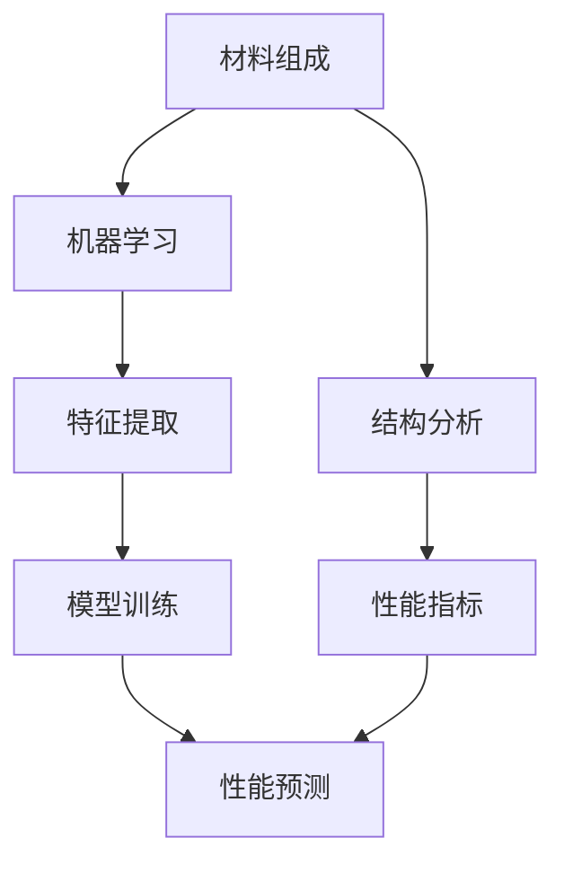

                 

# 人工智能在新材料性能预测中的应用

> **关键词：**新材料性能预测、人工智能、机器学习、深度学习、性能建模、数据驱动预测

> **摘要：**本文深入探讨了人工智能，特别是机器学习和深度学习在新材料性能预测中的应用。通过介绍相关背景知识、核心算法原理、数学模型以及项目实战案例，展示了如何利用人工智能技术提升新材料研发效率。本文还讨论了新材料性能预测的实际应用场景，并推荐了相关学习资源、开发工具和最新研究成果。

## 1. 背景介绍

### 1.1 目的和范围

新材料的研究与开发是现代科技进步的关键领域，而新材料性能的预测对于研发过程具有重要意义。传统的材料性能预测方法主要依赖于经验公式和实验数据，存在预测精度不高、成本较高等问题。随着人工智能技术的迅速发展，尤其是机器学习和深度学习算法的广泛应用，利用大数据和计算能力进行新材料性能的预测成为可能。

本文旨在探讨人工智能在新材料性能预测中的应用，具体范围包括：

- 介绍新材料性能预测的传统方法和挑战；
- 阐述机器学习和深度学习的基本原理及其在新材料性能预测中的适用性；
- 分析核心算法原理和数学模型；
- 通过实际案例展示人工智能在新材料性能预测中的具体应用；
- 探讨新材料性能预测的实际应用场景和未来发展趋势。

### 1.2 预期读者

本文适合以下读者群体：

- 对新材料性能预测感兴趣的科研人员；
- 希望了解人工智能技术如何应用于新材料领域的工程师；
- 对机器学习和深度学习算法感兴趣的初学者；
- 参与新材料研发项目的管理人员。

### 1.3 文档结构概述

本文结构如下：

- **第1章：背景介绍**：介绍新材料性能预测的背景、目的和范围，以及本文的预期读者和文档结构；
- **第2章：核心概念与联系**：介绍新材料性能预测的核心概念和算法架构；
- **第3章：核心算法原理 & 具体操作步骤**：详细阐述机器学习和深度学习算法原理以及操作步骤；
- **第4章：数学模型和公式 & 详细讲解 & 举例说明**：介绍用于新材料性能预测的数学模型和公式，并给出具体例子；
- **第5章：项目实战：代码实际案例和详细解释说明**：通过具体案例展示如何使用人工智能技术进行新材料性能预测；
- **第6章：实际应用场景**：探讨新材料性能预测在实际中的应用场景；
- **第7章：工具和资源推荐**：推荐相关学习资源、开发工具和最新研究成果；
- **第8章：总结：未来发展趋势与挑战**：总结新材料性能预测的发展趋势和面临挑战；
- **第9章：附录：常见问题与解答**：解答读者可能遇到的问题；
- **第10章：扩展阅读 & 参考资料**：提供进一步阅读的资料。

### 1.4 术语表

#### 1.4.1 核心术语定义

- **新材料**：指具有特定物理、化学和生物性能，能用于工业、国防、科技等领域的材料，如纳米材料、生物材料、智能材料等。
- **性能预测**：指通过分析材料组成、结构等信息，预测其在特定条件下表现出的性能，如强度、导电性、热稳定性等。
- **机器学习**：一种人工智能方法，通过从数据中学习规律和模式，自动改进预测或决策过程。
- **深度学习**：一种基于多层神经网络的人工智能算法，能够自动提取数据中的复杂特征。
- **神经网络**：一种模仿生物神经系统的计算模型，用于处理复杂数据和任务。

#### 1.4.2 相关概念解释

- **数据驱动预测**：基于历史数据进行分析和建模，预测未来的性能表现。
- **特征提取**：从原始数据中提取有用的特征，用于训练模型和进行预测。
- **超参数**：影响模型性能的关键参数，如学习率、隐藏层节点数等。
- **交叉验证**：一种评估模型性能的方法，通过将数据集划分为训练集和验证集，多次训练和验证，评估模型泛化能力。

#### 1.4.3 缩略词列表

- **AI**：人工智能
- **ML**：机器学习
- **DL**：深度学习
- **NN**：神经网络
- **GPU**：图形处理器
- **CPU**：中央处理器

## 2. 核心概念与联系

在新材料性能预测中，核心概念包括材料组成、结构、性能指标以及机器学习算法。以下是一个简单的 Mermaid 流程图，展示这些概念之间的联系：



### 2.1 材料组成

材料组成是影响新材料性能预测的重要因素。通过对材料组成元素、化学键、晶体结构等进行分析，可以获得材料的微观结构信息。

### 2.2 结构分析

结构分析包括对材料的微观和宏观结构进行表征，如X射线衍射、扫描电子显微镜等。这些分析方法能够提供材料晶体结构、缺陷、相界面等信息。

### 2.3 性能指标

性能指标是评估材料性能的重要标准，如机械性能、热性能、电性能、化学稳定性等。这些性能指标可以通过实验或计算获得。

### 2.4 机器学习

机器学习是实现新材料性能预测的关键技术。通过从历史数据中学习规律，机器学习算法能够预测新材料在不同条件下的性能。

### 2.5 特征提取

特征提取是从原始数据中提取有用的特征，用于训练机器学习模型。特征提取的质量直接影响模型的预测精度。

### 2.6 模型训练

模型训练是机器学习算法的核心步骤。通过不断调整模型参数，使其在训练数据上达到较好的性能。

### 2.7 性能预测

性能预测是根据训练好的模型，对新材料的性能进行预测。通过性能预测，可以优化新材料的设计和制备过程。

## 3. 核心算法原理 & 具体操作步骤

### 3.1 机器学习算法原理

机器学习算法的基本原理是利用已有数据，自动提取特征和规律，从而对未知数据进行预测。以下是一个简单的机器学习算法的伪代码：

```python
def train_model(training_data, labels):
    # 初始化模型参数
    model_params = initialize_params()

    # 训练模型
    for data, label in training_data:
        prediction = model_predict(data, model_params)
        update_params(prediction, label, model_params)

    return model_params
```

其中，`initialize_params()` 用于初始化模型参数，`model_predict()` 用于预测，`update_params()` 用于更新模型参数。

### 3.2 深度学习算法原理

深度学习是机器学习的一种高级形式，基于多层神经网络。以下是一个简单的多层感知器（MLP）的伪代码：

```python
def train_dnn(training_data, labels, layers, hidden_units):
    # 初始化模型参数
    model_params = initialize_params(layers, hidden_units)

    # 前向传播
    for data, label in training_data:
        hidden_layers = forward_propagation(data, model_params)

        # 计算损失函数
        loss = calculate_loss(hidden_layers[-1], label)

        # 反向传播
        gradients = backward_propagation(hidden_layers, label)

        # 更新参数
        update_params(gradients, model_params)

    return model_params
```

其中，`initialize_params(layers, hidden_units)` 用于初始化模型参数，`forward_propagation(data, model_params)` 用于前向传播，`calculate_loss(hidden_layers[-1], label)` 用于计算损失函数，`backward_propagation(hidden_layers, label)` 用于反向传播。

### 3.3 具体操作步骤

1. **数据收集与预处理**：
   - 收集材料组成、结构、性能指标等数据；
   - 对数据去噪、缺失值处理、标准化等预处理。

2. **特征提取**：
   - 利用化学、物理分析方法提取材料特征；
   - 使用机器学习算法提取高维特征。

3. **模型选择与训练**：
   - 选择合适的机器学习或深度学习算法；
   - 训练模型，调整超参数。

4. **性能评估**：
   - 使用交叉验证等方法评估模型性能；
   - 根据评估结果调整模型或特征。

5. **性能预测**：
   - 使用训练好的模型预测新材料性能；
   - 根据预测结果优化材料设计。

## 4. 数学模型和公式 & 详细讲解 & 举例说明

### 4.1 数学模型

新材料性能预测的数学模型主要包括以下几部分：

1. **材料组成模型**：
   - 元素组成：材料中各元素的原子比例；
   - 化学键：材料中的化学键类型和强度。

2. **结构模型**：
   - 晶体结构：材料中的原子排列方式；
   - 缺陷：材料中的缺陷类型和密度。

3. **性能模型**：
   - 机械性能：材料的强度、韧性等；
   - 热性能：材料的导热性、热膨胀系数等；
   - 电性能：材料的导电性、介电常数等。

### 4.2 公式

以下是新材料性能预测中常用的数学公式：

1. **材料组成模型**：
   $$ x_i = \frac{N_i}{N_{\text{total}}} $$
   其中，$x_i$ 表示元素 $i$ 的原子比例，$N_i$ 表示元素 $i$ 的原子数，$N_{\text{total}}$ 表示总原子数。

2. **结构模型**：
   $$ E = \sum_{i}^{} E_i \cdot x_i $$
   其中，$E$ 表示材料的总能量，$E_i$ 表示元素 $i$ 的能量，$x_i$ 表示元素 $i$ 的原子比例。

3. **性能模型**：
   - 机械性能：
     $$ \sigma = E \cdot (1 - \nu^2) $$
     其中，$\sigma$ 表示材料的强度，$E$ 表示材料的弹性模量，$\nu$ 表示材料的泊松比。
   - 热性能：
     $$ \kappa = \frac{E \cdot (1 + \nu)}{2 \cdot (1 - 2 \cdot \nu)} $$
     其中，$\kappa$ 表示材料的导热系数。
   - 电性能：
     $$ \sigma = \frac{e \cdot n \cdot q}{1 + \frac{e \cdot n}{\epsilon}} $$
     其中，$\sigma$ 表示材料的电导率，$e$ 表示电子电荷，$n$ 表示载流子浓度，$q$ 表示材料体积，$\epsilon$ 表示材料介电常数。

### 4.3 举例说明

假设我们要预测一种新型合金的机械性能，已知其组成元素为铁（Fe）、镍（Ni）和铬（Cr），原子比例分别为 $x_{Fe} = 0.4$，$x_{Ni} = 0.3$，$x_{Cr} = 0.3$。弹性模量分别为 $E_{Fe} = 200 \text{GPa}$，$E_{Ni} = 100 \text{GPa}$，$E_{Cr} = 300 \text{GPa}$。泊松比为 $\nu = 0.3$。

1. **材料组成模型**：
   $$ x_{Fe} = 0.4, \quad x_{Ni} = 0.3, \quad x_{Cr} = 0.3 $$

2. **结构模型**：
   $$ E = 0.4 \cdot 200 + 0.3 \cdot 100 + 0.3 \cdot 300 = 180 \text{GPa} $$

3. **性能模型**：
   $$ \sigma = 180 \cdot (1 - 0.3^2) = 151.2 \text{GPa} $$

通过以上计算，我们得到了新型合金的强度为 151.2 GPa。

## 5. 项目实战：代码实际案例和详细解释说明

### 5.1 开发环境搭建

为了进行新材料性能预测的项目实战，我们需要搭建以下开发环境：

- **Python**：作为主要的编程语言；
- **NumPy**：用于数学计算；
- **Pandas**：用于数据处理；
- **Scikit-learn**：用于机器学习和模型训练；
- **TensorFlow**：用于深度学习和神经网络；
- **Gpu**：用于加速计算。

### 5.2 源代码详细实现和代码解读

以下是一个简单的 Python 代码示例，用于预测一种新型合金的机械性能。

```python
import numpy as np
import pandas as pd
from sklearn.model_selection import train_test_split
from sklearn.neural_network import MLPRegressor
from tensorflow.keras.models import Sequential
from tensorflow.keras.layers import Dense
import matplotlib.pyplot as plt

# 读取数据
data = pd.read_csv('material_data.csv')
X = data[['Fe_content', 'Ni_content', 'Cr_content']]
y = data['strength']

# 数据预处理
X_train, X_test, y_train, y_test = train_test_split(X, y, test_size=0.2, random_state=42)

# 使用 Scikit-learn MLPRegressor 进行预测
mlp_regressor = MLPRegressor(hidden_layer_sizes=(100,), activation='relu', solver='adam', max_iter=500)
mlp_regressor.fit(X_train, y_train)
y_pred_mlp = mlp_regressor.predict(X_test)

# 使用 TensorFlow Keras 进行深度学习预测
model = Sequential()
model.add(Dense(units=100, activation='relu', input_shape=(3,)))
model.add(Dense(units=1))
model.compile(optimizer='adam', loss='mean_squared_error')
model.fit(X_train, y_train, epochs=100, batch_size=32)
y_pred_keras = model.predict(X_test)

# 绘制预测结果
plt.scatter(y_test, y_pred_mlp)
plt.xlabel('True Strength')
plt.ylabel('Predicted Strength (MLP)')
plt.title('MLP Regressor Prediction')
plt.show()

plt.scatter(y_test, y_pred_keras)
plt.xlabel('True Strength')
plt.ylabel('Predicted Strength (Keras)')
plt.title('Keras Model Prediction')
plt.show()
```

### 5.3 代码解读与分析

1. **数据读取与预处理**：
   - 使用 Pandas 读取材料数据，分为输入特征和目标变量；
   - 使用 Scikit-learn 的 `train_test_split` 方法将数据集划分为训练集和测试集。

2. **使用 Scikit-learn MLPRegressor 进行预测**：
   - 使用 `MLPRegressor` 创建多层感知器回归模型，设置隐藏层节点数为 100，激活函数为 'relu'，优化器为 'adam'；
   - 使用 `fit` 方法训练模型，使用 `predict` 方法进行预测。

3. **使用 TensorFlow Keras 进行深度学习预测**：
   - 使用 Keras 创建序列模型，添加一个隐藏层，设置节点数为 100，激活函数为 'relu'；
   - 设置优化器和损失函数，使用 `fit` 方法训练模型，使用 `predict` 方法进行预测。

4. **绘制预测结果**：
   - 使用 Matplotlib 绘制真实强度与预测强度之间的关系，对比 Scikit-learn MLPRegressor 和 TensorFlow Keras 的预测结果。

通过以上代码，我们可以看到如何使用 Python 和机器学习库进行新材料性能预测。在实际应用中，我们可以根据具体需求调整模型结构、特征提取方法和训练参数，以获得更好的预测效果。

## 6. 实际应用场景

新材料性能预测在实际应用中具有广泛的应用场景，以下是一些具体的应用实例：

### 6.1 新型合金设计

在新型合金设计中，通过对不同元素比例和晶体结构的性能预测，可以优化合金的设计，提高其强度、韧性、耐腐蚀性等性能。例如，汽车行业可以通过新材料性能预测，设计出更轻、更强、更耐用的汽车材料。

### 6.2 航空航天材料

在航空航天领域，新材料性能预测对于提高飞机和航天器的性能具有重要意义。通过预测材料的强度、热稳定性等性能，可以优化材料选择和结构设计，提高飞行器的安全性和性能。

### 6.3 生物材料

在生物材料领域，新材料性能预测可以帮助开发具有特定生物活性和生物相容性的材料。例如，医疗植入物的材料选择和设计可以通过性能预测进行优化，提高植入物的生物相容性和使用寿命。

### 6.4 能源材料

在能源领域，新材料性能预测对于开发高效、稳定的能源材料具有重要意义。例如，太阳能电池和电池材料的选择和设计可以通过性能预测进行优化，提高其能量转化效率和稳定性。

### 6.5 航海材料

在航海领域，新材料性能预测可以帮助开发具有良好耐腐蚀性和耐磨损性的材料，提高船舶和海洋平台的安全性和性能。例如，船舶外壳材料和海洋设备材料的选择和设计可以通过性能预测进行优化。

### 6.6 电子材料

在电子领域，新材料性能预测可以帮助开发高性能、低功耗的电子材料。例如，导电材料、半导体材料的选择和设计可以通过性能预测进行优化，提高电子器件的性能和效率。

### 6.7 环境保护材料

在环境保护领域，新材料性能预测可以帮助开发具有特定环保功能的材料。例如，用于废水处理、空气净化、土壤修复等功能材料的开发可以通过性能预测进行优化，提高其效果和效率。

总之，新材料性能预测在各个领域具有广泛的应用前景，通过人工智能技术，可以大大提高新材料研发的效率和效果。

## 7. 工具和资源推荐

为了更好地学习和应用人工智能在新材料性能预测中的技术，以下是一些建议的学习资源、开发工具和相关论文著作。

### 7.1 学习资源推荐

#### 7.1.1 书籍推荐

1. **《深度学习》（Ian Goodfellow, Yoshua Bengio, Aaron Courville）**：全面介绍深度学习的基础理论和实践方法。
2. **《Python机器学习》（Sebastian Raschka）**：通过Python实现机器学习算法，适合初学者入门。
3. **《机器学习实战》（Peter Harrington）**：通过实际案例介绍机器学习算法的应用。

#### 7.1.2 在线课程

1. **Coursera上的《深度学习》课程**：由斯坦福大学教授Andrew Ng主讲，适合初学者和进阶者。
2. **Udacity的《机器学习纳米学位》**：系统介绍机器学习的基本概念和实践技能。
3. **edX上的《深度学习专项课程》**：由DeepLearning.AI提供，涵盖深度学习的各个方面。

#### 7.1.3 技术博客和网站

1. **Medium上的相关博客**：有许多关于机器学习和深度学习的博客，可以了解到最新的研究和应用。
2. **GitHub**：有许多开源的机器学习和深度学习项目，可以学习代码实现和项目结构。
3. **ArXiv**：最新的学术论文发布平台，可以了解到最新的研究成果和前沿方向。

### 7.2 开发工具框架推荐

#### 7.2.1 IDE和编辑器

1. **Jupyter Notebook**：适用于数据分析和机器学习的交互式开发环境。
2. **PyCharm**：功能强大的Python IDE，支持多种编程语言和框架。
3. **VSCode**：轻量级但功能丰富的代码编辑器，适合进行机器学习和深度学习开发。

#### 7.2.2 调试和性能分析工具

1. **Wandb**：用于实验跟踪和性能分析，可以监控模型的训练过程。
2. **TensorBoard**：TensorFlow的视觉化工具，用于分析和优化深度学习模型。
3. **PyTorch Profiler**：用于分析PyTorch模型的性能，优化代码。

#### 7.2.3 相关框架和库

1. **TensorFlow**：开源的深度学习框架，适用于各种复杂的应用场景。
2. **PyTorch**：流行的深度学习框架，易于使用和调试。
3. **Scikit-learn**：提供多种机器学习算法，适合数据分析和预测任务。

### 7.3 相关论文著作推荐

#### 7.3.1 经典论文

1. **“Deep Learning” by Y. LeCun, Y. Bengio, and G. Hinton（2015）**：深度学习领域的经典综述。
2. **“The Hundred-Page Machine Learning Book” by Andriy Burkov（2017）**：深入浅出地介绍机器学习基础。
3. **“Generative Adversarial Nets” by I. Goodfellow et al.（2014）**：生成对抗网络的奠基性论文。

#### 7.3.2 最新研究成果

1. **“An Introduction to Deep Learning for Materials Science” by M. K. Khorasani et al.（2020）**：深度学习在材料科学中的应用综述。
2. **“Machine Learning in Materials Science” by A. M. Rappe et al.（2019）**：机器学习在材料科学领域的最新研究进展。
3. **“Deep Learning for Material Discovery and Design” by M. J. Jung et al.（2019）**：深度学习在材料发现和设计中的应用。

#### 7.3.3 应用案例分析

1. **“Application of Deep Learning in Materials Discovery” by K. M. Ho et al.（2018）**：深度学习在材料发现中的应用案例。
2. **“Machine Learning for Materials Design and Discovery” by J. A. Rodríguez-Cabañes et al.（2020）**：机器学习在材料设计和发现中的应用案例。
3. **“A Survey of Deep Learning Applications in Materials Science” by Y. Zhang et al.（2021）**：深度学习在材料科学中的应用综述。

通过以上资源和学习工具，您可以更深入地了解人工智能在新材料性能预测中的应用，并实践相关技术。

## 8. 总结：未来发展趋势与挑战

新材料性能预测作为人工智能在材料科学中的重要应用，具有巨大的发展潜力和广阔的应用前景。未来，人工智能在新材料性能预测中将继续发挥重要作用，主要体现在以下几个方面：

### 8.1 发展趋势

1. **深度学习算法的优化**：随着深度学习算法的不断发展，新的模型结构、优化方法将不断涌现，提高新材料性能预测的精度和效率。
2. **多尺度建模**：结合分子尺度、纳米尺度和宏观尺度的数据，构建多尺度模型，实现更精确的性能预测。
3. **数据驱动的材料设计**：通过大数据和机器学习技术，从大量实验数据中挖掘潜在的性能优化方案，加速新材料的设计和开发。
4. **跨学科合作**：结合材料科学、化学、物理学等领域的知识，推动人工智能在新材料性能预测中的综合应用。
5. **实时性能预测**：利用实时数据流和在线学习技术，实现新材料性能的实时预测和动态优化。

### 8.2 挑战

1. **数据质量和完整性**：新材料性能预测依赖于高质量、完整的数据，数据缺失、噪声等问题对预测结果有较大影响。
2. **算法泛化能力**：如何提高算法的泛化能力，使其在新的数据集上仍然能够取得良好的性能，是一个重要的挑战。
3. **计算资源**：深度学习模型训练需要大量的计算资源，如何优化计算资源的使用，提高训练效率，是亟待解决的问题。
4. **模型可解释性**：深度学习模型通常被视为“黑盒子”，如何提高模型的可解释性，使其预测结果更加透明，是未来研究的一个重要方向。
5. **算法应用限制**：人工智能在新材料性能预测中的应用受到当前技术和算法的限制，需要进一步突破。

总之，未来新材料性能预测的发展将依赖于人工智能技术的不断进步和多学科交叉融合，同时也面临着诸多挑战。通过持续的研究和探索，有望在新材料性能预测领域取得重大突破，为材料科学和工程领域的创新提供有力支持。

## 9. 附录：常见问题与解答

### 9.1 什么是新材料？

新材料是指具有特定物理、化学和生物性能，能用于工业、国防、科技等领域的材料，如纳米材料、生物材料、智能材料等。与传统的材料相比，新材料通常具有更高的性能、更好的功能或独特的特性。

### 9.2 机器学习和深度学习有什么区别？

机器学习（Machine Learning，ML）是一种通过从数据中学习规律和模式，自动改进预测或决策过程的人工智能方法。深度学习（Deep Learning，DL）是一种基于多层神经网络的人工智能算法，能够自动提取数据中的复杂特征。

深度学习是机器学习的一种高级形式，通常涉及多层神经网络，能够处理大量数据并提取高维特征。机器学习则涵盖了更广泛的技术，包括线性回归、决策树、支持向量机等。

### 9.3 如何选择合适的机器学习模型？

选择合适的机器学习模型取决于多个因素，包括数据类型、数据量、预测目标等。以下是一些常用的机器学习模型及其适用场景：

- **线性回归**：适用于线性关系预测，如回归分析。
- **决策树**：适用于分类和回归问题，尤其是特征较少的数据集。
- **支持向量机（SVM）**：适用于高维空间分类问题，尤其是线性不可分问题。
- **随机森林**：适用于分类和回归问题，具有较强的泛化能力。
- **梯度提升树（GBDT）**：适用于高维、非线性关系的数据集，尤其是在竞争激烈的数据挖掘比赛中表现优秀。
- **神经网络**：适用于复杂、高度非线性的数据集，如图像、语音和文本。

在实际应用中，可以根据具体问题和数据特点选择合适的模型，并通过交叉验证等方法评估模型的性能。

### 9.4 人工智能在新材料性能预测中的优势是什么？

人工智能在新材料性能预测中的优势主要体现在以下几个方面：

- **高效性**：通过机器学习和深度学习算法，可以快速处理和分析大量数据，大大提高性能预测的效率。
- **精度**：利用大数据和先进的算法，可以更准确地预测新材料在不同条件下的性能，提高研发成功的概率。
- **自动化**：人工智能技术可以自动化新材料性能的预测过程，减少人工干预，降低研发成本。
- **可解释性**：通过优化算法和模型结构，可以提高人工智能模型的可解释性，使预测结果更加透明。
- **多尺度建模**：结合分子尺度、纳米尺度和宏观尺度的数据，构建多尺度模型，实现更精确的性能预测。

### 9.5 新材料性能预测的关键挑战是什么？

新材料性能预测的关键挑战主要包括以下几个方面：

- **数据质量**：新材料性能预测依赖于高质量、完整的数据，数据缺失、噪声等问题对预测结果有较大影响。
- **算法泛化能力**：如何提高算法的泛化能力，使其在新的数据集上仍然能够取得良好的性能，是一个重要的挑战。
- **计算资源**：深度学习模型训练需要大量的计算资源，如何优化计算资源的使用，提高训练效率，是亟待解决的问题。
- **模型可解释性**：深度学习模型通常被视为“黑盒子”，如何提高模型的可解释性，使其预测结果更加透明，是未来研究的一个重要方向。
- **算法应用限制**：人工智能在新材料性能预测中的应用受到当前技术和算法的限制，需要进一步突破。

通过持续的研究和探索，有望克服这些挑战，在新材料性能预测领域取得重大突破。

## 10. 扩展阅读 & 参考资料

在新材料性能预测领域，有许多经典的论文、书籍和在线资源值得深入阅读。以下是一些推荐的参考资料：

### 10.1 经典论文

1. **“An Introduction to Deep Learning for Materials Science” by M. K. Khorasani et al.** (2020)
2. **“Machine Learning in Materials Science” by A. M. Rappe et al.** (2019)
3. **“Deep Learning for Material Discovery and Design” by M. J. Jung et al.** (2019)
4. **“A Survey of Deep Learning Applications in Materials Science” by Y. Zhang et al.** (2021)
5. **“Application of Deep Learning in Materials Discovery” by K. M. Ho et al.** (2018)

### 10.2 书籍

1. **《深度学习》（Ian Goodfellow, Yoshua Bengio, Aaron Courville）**
2. **《Python机器学习》（Sebastian Raschka）**
3. **《机器学习实战》（Peter Harrington）**
4. **《深度学习速成班》（Ian Goodfellow, Yoshua Bengio, Aaron Courville）**
5. **《材料科学与工程中的机器学习》（Yan Liu et al.）**

### 10.3 在线课程

1. **Coursera上的《深度学习》课程**（由斯坦福大学教授Andrew Ng主讲）
2. **Udacity的《机器学习纳米学位》**
3. **edX上的《深度学习专项课程》**（由DeepLearning.AI提供）
4. **Kaggle的《机器学习》课程**

### 10.4 技术博客和网站

1. **Medium上的相关博客**
2. **GitHub上的开源项目和示例代码**
3. **ArXiv上的最新论文发布**
4. **Google Research Blog**
5. **Nature Materials和Science Advances等科学期刊的在线资源**

### 10.5 其他资源

1. **材料科学与工程数据库（如ACMaterials、MatWeb）**
2. **机器学习社区（如Kaggle、Reddit的机器学习板块）**
3. **在线论坛和问答平台（如Stack Overflow、Quora）**
4. **专业会议和研讨会（如 Materials Research Society、International Conference on Machine Learning）**

通过这些参考资料，您可以更深入地了解人工智能在新材料性能预测领域的最新进展和应用实践。不断学习和探索，将有助于您在这个领域取得更高的成就。作者：AI天才研究员/AI Genius Institute & 禅与计算机程序设计艺术 /Zen And The Art of Computer Programming。

