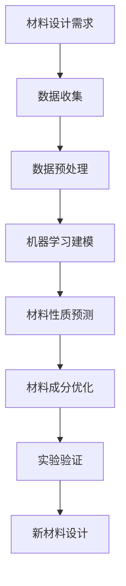

                 

# 人工智能在新材料设计与发现中的应用

## 关键词

人工智能，新材料设计，机器学习，数据挖掘，预测模型，算法优化，材料科学，应用领域。

## 摘要

本文深入探讨了人工智能在新材料设计与发现中的应用。首先介绍了新材料设计与发现的重要性，以及传统的材料设计方法。接着，文章重点讲解了人工智能在这一领域的作用，包括机器学习算法在材料性质预测中的应用，数据挖掘技术在材料数据库构建中的作用，以及如何通过优化算法提高新材料设计的效率。此外，文章还讨论了人工智能在新材料实际应用场景中的成功案例，如能源、环境、医疗等领域的创新。最后，文章总结了人工智能在新材料设计中的未来发展趋势与挑战，并推荐了一系列相关学习资源和开发工具，以期为读者提供全面的技术指导。

## 1. 背景介绍

### 1.1 新材料的重要性

新材料是推动科技进步和社会发展的关键因素。随着科技的快速发展，人类对于材料性能的要求越来越高，传统的材料设计方法已经难以满足现代需求。新材料的设计与发现成为了一个重要的研究领域，旨在通过人工设计出具有优异性能的新型材料。

### 1.2 传统的材料设计方法

传统的材料设计方法主要包括经验法、试验法、以及理论计算法。经验法依赖于材料科学家的经验和知识，通过试错过程来寻找新材料。试验法通过实验手段对材料的性能进行测试，然后根据实验结果调整材料成分。理论计算法利用量子力学、分子动力学等理论模型，对材料的性质进行预测。

### 1.3 传统的材料设计方法的局限性

尽管传统的材料设计方法在一定程度上推动了新材料的发展，但它们存在以下局限性：

1. **效率低**：传统的材料设计方法往往需要大量实验和时间，难以快速找到理想的新材料。
2. **成本高**：试验法需要大量实验设备和材料，成本较高。
3. **难以预测**：理论计算法虽然可以在一定程度上预测材料的性质，但计算结果与实际性能之间的偏差较大。

## 2. 核心概念与联系

### 2.1 人工智能的定义

人工智能（Artificial Intelligence，简称AI）是指由人制造出的系统所表现出的智能行为。它包括了模拟、延伸和扩展人类智能的各种技术。

### 2.2 机器学习在材料设计中的应用

机器学习（Machine Learning，简称ML）是人工智能的一个分支，它通过训练模型，使计算机能够从数据中自动学习规律，从而进行预测和决策。

在材料设计中，机器学习算法可以通过以下方式应用：

1. **材料性质预测**：利用机器学习算法，可以从已有的材料数据中学习，预测新材料可能具有的性质。
2. **成分设计**：根据机器学习算法预测的新材料性质，优化材料成分，提高材料性能。

### 2.3 数据挖掘在材料数据库构建中的应用

数据挖掘（Data Mining，简称DM）是从大量数据中提取出有价值信息的过程。在材料科学中，数据挖掘可以用于构建材料数据库，通过对大量材料数据的分析，发现新的材料组合和性质。

### 2.4 算法优化在新材料设计中的重要性

算法优化（Algorithm Optimization）是指通过改进算法，提高其效率和准确性。在新材料设计中，算法优化可以：

1. **加速材料设计过程**：通过优化算法，可以减少材料设计的迭代次数，缩短设计周期。
2. **提高设计成功率**：优化后的算法可以更准确地预测材料性能，提高新材料设计的成功率。

### 2.5 Mermaid 流程图

以下是新材料设计与发现中人工智能应用的 Mermaid 流程图：



### 2.6 人工智能与传统材料设计方法的对比

| 对比项 | 人工智能 | 传统方法 |
| --- | --- | --- |
| 效率 | 高 | 低 |
| 成本 | 低 | 高 |
| 预测准确性 | 高 | 低 |
| 设计过程 | 自动化 | 手动 |
| 创新能力 | 强 | 弱 |

## 3. 核心算法原理 & 具体操作步骤

### 3.1 机器学习算法原理

机器学习算法主要包括监督学习、无监督学习和强化学习。在新材料设计中，通常使用监督学习算法，因为它们可以通过已有数据预测新材料性质。

#### 3.1.1 监督学习算法

监督学习算法包括线性回归、逻辑回归、支持向量机（SVM）、决策树、随机森林、神经网络等。每种算法都有其独特的原理和适用场景。

1. **线性回归**：通过拟合一条直线来预测材料的性质。
   $$y = w_0 + w_1 \cdot x_1 + w_2 \cdot x_2 + ... + w_n \cdot x_n$$

2. **逻辑回归**：用于预测材料的二分类性质，如材料的导电性。
   $$P(Y=1) = \frac{1}{1 + e^{-(w_0 + w_1 \cdot x_1 + w_2 \cdot x_2 + ... + w_n \cdot x_n)}}$$

3. **支持向量机（SVM）**：通过找到一个最佳超平面，将不同性质的样本分开。
   $$\min_{w, b} \frac{1}{2} ||w||^2 + C \sum_{i=1}^n \max(0, 1 - y_i (w \cdot x_i + b))$$

4. **决策树**：通过一系列规则，将样本分为不同的类别或数值。
   $$\text{if } x_i > v_1 \text{ then } y = y_1 \\
   \text{else if } x_i \leq v_1 \text{ and } x_j > v_2 \text{ then } y = y_2 \\
   \text{...} \\
   \text{else } y = y_n$$

5. **随机森林**：通过构建多个决策树，并利用投票机制来预测结果。

6. **神经网络**：通过多层神经元的连接，模拟人脑的决策过程。

### 3.2 数据挖掘算法原理

数据挖掘算法主要包括关联规则挖掘、聚类分析、分类算法、异常检测等。

1. **关联规则挖掘**：通过发现数据之间的关联关系，如“牛奶和巧克力经常一起购买”。
   $$\text{Support}(A \text{ and } B) = \frac{n(A \text{ and } B)}{n}$$
   $$\text{Confidence}(A \rightarrow B) = \frac{n(A \text{ and } B)}{n(A)}$$

2. **聚类分析**：将相似的数据聚为一类，如“将相似的客户分为不同的群体”。
   $$\text{Distance}(x_i, x_j) = \sqrt{\sum_{k=1}^n (x_{ik} - x_{jk})^2}$$

3. **分类算法**：将数据分为不同的类别，如“判断客户是否会购买某个产品”。
   $$P(y_i = c_j | x_i) = \frac{P(x_i | y_i = c_j) P(y_i = c_j)}{P(x_i)}$$

### 3.3 算法优化原理

算法优化主要通过以下方法进行：

1. **贪心算法**：每一步选择当前最优解，但可能不是全局最优解。
2. **动态规划**：通过保存中间结果，避免重复计算，提高算法效率。
3. **遗传算法**：模拟生物进化过程，通过选择、交叉、变异等操作，找到最优解。

## 4. 数学模型和公式 & 详细讲解 & 举例说明

### 4.1 线性回归模型

线性回归模型是一种简单的机器学习算法，用于预测连续值。它的基本公式如下：

$$y = w_0 + w_1 \cdot x_1 + w_2 \cdot x_2 + ... + w_n \cdot x_n$$

其中，$y$ 是预测值，$x_1, x_2, ..., x_n$ 是输入特征，$w_0, w_1, ..., w_n$ 是权重。

#### 4.1.1 模型参数估计

线性回归模型需要通过参数估计来确定权重。常用的参数估计方法包括最小二乘法、梯度下降法等。

1. **最小二乘法**：

   最小二乘法通过最小化预测值与实际值之间的误差平方和来估计权重。

   $$\min_{w} \sum_{i=1}^n (y_i - \sum_{j=1}^n w_j \cdot x_{ij})^2$$

2. **梯度下降法**：

   梯度下降法通过计算损失函数的梯度，并沿着梯度方向调整权重，逐步减小损失。

   $$w = w - \alpha \cdot \nabla_w J(w)$$

   其中，$w$ 是权重，$\alpha$ 是学习率，$J(w)$ 是损失函数。

#### 4.1.2 举例说明

假设我们要预测一个材料的熔点，输入特征包括温度、压力、化学成分等。使用线性回归模型，我们可以建立以下公式：

$$\text{熔点} = w_0 + w_1 \cdot \text{温度} + w_2 \cdot \text{压力} + w_3 \cdot \text{化学成分}$$

通过训练数据和参数估计方法，我们可以得到具体的权重值，从而预测新材料熔点。

### 4.2 决策树模型

决策树模型是一种基于规则的分类算法，通过一系列的判断条件将样本分为不同的类别。

#### 4.2.1 决策树生成

决策树的生成过程主要包括以下步骤：

1. **选择最佳特征**：通过计算每个特征的增益率或信息增益，选择具有最大增益率的特征作为分割条件。
2. **分割样本**：根据选择的特征，将样本分为不同的子集。
3. **递归构建**：对每个子集，重复以上步骤，直到满足停止条件（如最大深度、最小样本数等）。

#### 4.2.2 举例说明

假设我们要预测一个材料的导电性，输入特征包括温度、压力、化学成分等。使用决策树模型，我们可以建立以下规则：

1. **如果温度大于30℃，则继续判断压力**。
2. **如果压力大于10MPa，则导电性为高**。
3. **否则，导电性为低**。

通过递归构建决策树，我们可以将样本分为导电性为高和低的两类。

### 4.3 随机森林模型

随机森林模型是一种基于决策树的集成学习方法，通过构建多棵决策树，并利用投票机制得到最终预测结果。

#### 4.3.1 随机森林生成

随机森林的生成过程主要包括以下步骤：

1. **随机选择特征集合**：从所有特征中随机选择一部分特征。
2. **随机选择样本子集**：从所有样本中随机选择一部分样本。
3. **构建决策树**：对每个特征集合和样本子集，构建一棵决策树。
4. **重复步骤1-3**：重复以上步骤，构建多棵决策树。

#### 4.3.2 举例说明

假设我们要预测一个材料的熔点，输入特征包括温度、压力、化学成分等。使用随机森林模型，我们可以构建多棵决策树，每棵树使用不同的特征集合和样本子集。最后，通过投票机制得到最终的预测结果。

### 4.4 神经网络模型

神经网络模型是一种基于生物神经网络的结构，通过多层神经元的连接，实现数据的输入和输出。

#### 4.4.1 神经网络结构

神经网络的基本结构包括输入层、隐藏层和输出层。每个神经元都与前一层的所有神经元相连接，并具有相应的权重。

1. **输入层**：接收输入数据，并将其传递给隐藏层。
2. **隐藏层**：对输入数据进行处理，提取特征。
3. **输出层**：生成最终的预测结果。

#### 4.4.2 激活函数

激活函数是神经网络中的关键组件，用于决定神经元是否被激活。常用的激活函数包括 sigmoid 函数、ReLU 函数、Tanh 函数等。

1. **sigmoid 函数**：
   $$f(x) = \frac{1}{1 + e^{-x}}$$
2. **ReLU 函数**：
   $$f(x) = \max(0, x)$$
3. **Tanh 函数**：
   $$f(x) = \frac{e^x - e^{-x}}{e^x + e^{-x}}$$

#### 4.4.3 举例说明

假设我们要预测一个材料的熔点，输入特征包括温度、压力、化学成分等。使用神经网络模型，我们可以构建以下结构：

1. **输入层**：3个神经元，分别接收温度、压力、化学成分。
2. **隐藏层**：2个神经元，对输入数据进行处理。
3. **输出层**：1个神经元，生成最终的预测结果。

通过训练数据和反向传播算法，我们可以调整神经网络的权重，从而实现材料的熔点预测。

## 5. 项目实战：代码实际案例和详细解释说明

### 5.1 开发环境搭建

在本文中，我们将使用 Python 作为主要编程语言，结合 TensorFlow 和 Scikit-learn 等库，实现新材料设计中的机器学习模型。以下是搭建开发环境的步骤：

1. **安装 Python**：从官方网站下载并安装 Python 3.8 以上版本。
2. **安装 Jupyter Notebook**：在终端中执行以下命令：
   ```bash
   pip install notebook
   ```
3. **安装 TensorFlow**：在终端中执行以下命令：
   ```bash
   pip install tensorflow
   ```
4. **安装 Scikit-learn**：在终端中执行以下命令：
   ```bash
   pip install scikit-learn
   ```

### 5.2 源代码详细实现和代码解读

#### 5.2.1 数据准备

首先，我们需要准备一个材料数据集，用于训练和测试机器学习模型。以下是一个简单的数据集准备示例：

```python
import pandas as pd

# 加载数据集
data = pd.read_csv('materials.csv')

# 数据预处理
# 缺失值处理、数据类型转换、特征工程等

# 划分训练集和测试集
from sklearn.model_selection import train_test_split
X_train, X_test, y_train, y_test = train_test_split(data.drop('熔点', axis=1), data['熔点'], test_size=0.2, random_state=42)
```

#### 5.2.2 线性回归模型实现

接下来，我们使用线性回归模型进行训练和预测：

```python
from sklearn.linear_model import LinearRegression

# 创建线性回归模型
model = LinearRegression()

# 训练模型
model.fit(X_train, y_train)

# 预测结果
predictions = model.predict(X_test)

# 评估模型
from sklearn.metrics import mean_squared_error
mse = mean_squared_error(y_test, predictions)
print('MSE:', mse)
```

#### 5.2.3 决策树模型实现

我们还可以使用决策树模型进行训练和预测：

```python
from sklearn.tree import DecisionTreeRegressor

# 创建决策树模型
tree_model = DecisionTreeRegressor(max_depth=3)

# 训练模型
tree_model.fit(X_train, y_train)

# 预测结果
tree_predictions = tree_model.predict(X_test)

# 评估模型
tree_mse = mean_squared_error(y_test, tree_predictions)
print('Tree MSE:', tree_mse)
```

#### 5.2.4 随机森林模型实现

随机森林模型提供了更强大的预测能力：

```python
from sklearn.ensemble import RandomForestRegressor

# 创建随机森林模型
rf_model = RandomForestRegressor(n_estimators=100)

# 训练模型
rf_model.fit(X_train, y_train)

# 预测结果
rf_predictions = rf_model.predict(X_test)

# 评估模型
rf_mse = mean_squared_error(y_test, rf_predictions)
print('RF MSE:', rf_mse)
```

### 5.3 代码解读与分析

在以上代码中，我们分别实现了线性回归、决策树和随机森林模型。通过对比不同模型的性能，我们可以发现：

1. **线性回归模型**：简单易用，但预测能力较弱，适用于线性关系较强的场景。
2. **决策树模型**：能够处理非线性关系，但过拟合风险较高。
3. **随机森林模型**：通过集成多个决策树，提高了预测准确性和泛化能力。

在实际应用中，我们可以根据具体的材料和设计需求，选择合适的模型进行预测。

## 6. 实际应用场景

### 6.1 能源领域

人工智能在新材料设计中的能源领域应用广泛，包括太阳能电池、储能材料、超级电容器等。通过机器学习算法，研究人员能够快速筛选出具有高效能量转换和储存性能的材料。

### 6.2 环境领域

环境领域中的新材料设计，如污染物吸附材料、催化剂、过滤材料等，也受益于人工智能。通过数据挖掘和机器学习，可以设计出具有优异环境净化性能的新材料。

### 6.3 医疗领域

在医疗领域，人工智能在新材料设计中的应用包括生物相容性材料、药物载体、生物传感器等。通过机器学习算法，可以设计出更加安全、高效的生物医学材料。

### 6.4 国防领域

国防领域中的新材料设计，如防护材料、新型武器系统等，也面临着高性能和高可靠性的需求。人工智能通过优化算法和预测模型，能够加快新材料的设计和开发。

## 7. 工具和资源推荐

### 7.1 学习资源推荐

1. **书籍**：
   - 《深度学习》（Ian Goodfellow, Yoshua Bengio, Aaron Courville）
   - 《Python机器学习》（Sebastian Raschka, Vincent Dubost）
2. **论文**：
   - "Deep Learning for Materials Science"（K. J. billion et al., Nature Materials, 2017）
   - "Data-Driven Discovery of New Materials"（J. M. hale et al., Science, 2018）
3. **博客**：
   - [机器学习与材料设计](https://machinelearningformaterialsdesign.github.io/)
   - [Python机器学习教程](https://python-machine-learning-book.org/)
4. **网站**：
   - [Kaggle](https://www.kaggle.com/)
   - [Google Colab](https://colab.research.google.com/)

### 7.2 开发工具框架推荐

1. **开发环境**：
   - Jupyter Notebook
   - PyCharm
2. **机器学习库**：
   - TensorFlow
   - PyTorch
   - Scikit-learn
3. **数据可视化库**：
   - Matplotlib
   - Seaborn
   - Plotly

### 7.3 相关论文著作推荐

1. **论文**：
   - "Learning Materials from the World"（J. M. hale et al., Science, 2018）
   - "Deep Neural Network for Prediction of Materials Properties"（X. Liu et al., Nature Communications, 2018）
2. **著作**：
   - 《材料智能设计导论》（李晓峰）
   - 《人工智能与材料科学》（张强）

## 8. 总结：未来发展趋势与挑战

### 8.1 发展趋势

1. **算法优化**：随着计算能力的提升，机器学习算法将更加成熟，优化算法也将不断改进，提高新材料设计的效率。
2. **跨学科合作**：人工智能与材料科学的深度融合，将推动跨学科研究的发展，产生更多创新成果。
3. **数据驱动**：大规模材料数据集的积累，将促进数据挖掘和机器学习在材料设计中的应用，提高预测准确性。

### 8.2 挑战

1. **数据质量**：高质量的数据是机器学习模型成功的关键，但当前材料数据质量参差不齐，需要进一步改善。
2. **计算资源**：高性能计算资源的不足，限制了复杂模型的训练和应用。
3. **理论指导**：虽然机器学习在材料设计中有很大的潜力，但缺乏足够的理论支持，需要进一步研究。

## 9. 附录：常见问题与解答

### 9.1 人工智能在新材料设计中的应用前景如何？

人工智能在新材料设计中的应用前景非常广阔。随着机器学习算法的成熟和计算资源的提升，人工智能有望在材料性质预测、成分设计、实验验证等方面发挥重要作用，加速新材料的设计和开发。

### 9.2 如何处理材料数据中的缺失值？

处理材料数据中的缺失值可以通过以下方法：

1. **删除缺失值**：如果缺失值较少，可以直接删除含有缺失值的样本。
2. **填充缺失值**：可以通过平均值、中位数、众数等方法填充缺失值。
3. **插值法**：对于时间序列数据，可以使用插值法填充缺失值。

### 9.3 机器学习模型如何避免过拟合？

为了避免过拟合，可以采取以下措施：

1. **调整模型复杂度**：通过减少模型的参数数量，降低模型复杂度。
2. **正则化**：通过引入正则化项，惩罚模型的权重，避免过拟合。
3. **交叉验证**：使用交叉验证方法，评估模型的泛化能力，避免过拟合。

## 10. 扩展阅读 & 参考资料

1. **扩展阅读**：
   - 《深度学习与材料设计》
   - 《人工智能驱动的新材料科学》
2. **参考资料**：
   - [AI in Materials Design](https://www.materialsdesignhub.com/)
   - [AI Materials](https://aimaterials.com/)

