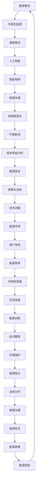
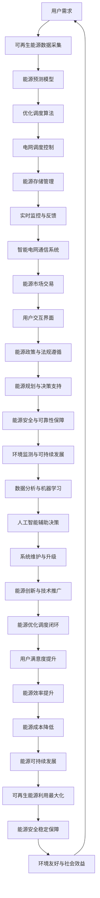

                 

# 人工智能在新能源优化调度中的应用

> **关键词：** 人工智能、新能源、优化调度、可再生能源、智能电网、算法、机器学习、深度学习
>
> **摘要：** 本文将探讨人工智能在新能源优化调度领域的应用，分析当前的核心挑战与解决方案。通过深入探讨核心概念、算法原理、数学模型和实际案例，本文旨在为读者提供一个全面的技术指南，帮助理解如何利用人工智能技术实现新能源的优化调度。

## 1. 背景介绍

### 1.1 目的和范围

本文旨在介绍人工智能在新能源优化调度中的应用，为读者提供一份详细的技术指南。随着全球对可再生能源的重视不断增加，如何高效、稳定地调度新能源已经成为一个关键问题。本文将围绕以下几个核心问题展开讨论：

- 新能源优化调度的核心概念是什么？
- 人工智能技术如何影响新能源优化调度？
- 当前存在哪些核心算法和数学模型？
- 实际应用中如何实现新能源的优化调度？

### 1.2 预期读者

本文主要面向以下几类读者：

- 对新能源优化调度感兴趣的工程师和技术人员
- 想要了解人工智能技术在新能源领域应用的研究人员
- 高等院校相关专业的师生
- 对可再生能源和智能电网感兴趣的行业从业者

### 1.3 文档结构概述

本文结构如下：

- **第1章：背景介绍**：介绍本文的目的、预期读者以及文档结构。
- **第2章：核心概念与联系**：介绍新能源优化调度相关的核心概念，并使用Mermaid流程图展示相关架构。
- **第3章：核心算法原理与具体操作步骤**：详细讲解新能源优化调度的核心算法原理和具体操作步骤，使用伪代码进行阐述。
- **第4章：数学模型和公式详细讲解与举例说明**：介绍用于新能源优化调度的数学模型和公式，并通过具体例子进行说明。
- **第5章：项目实战：代码实际案例和详细解释说明**：提供实际代码案例，并对其进行详细解释和分析。
- **第6章：实际应用场景**：探讨人工智能在新能源优化调度中的实际应用场景。
- **第7章：工具和资源推荐**：推荐相关学习资源、开发工具和框架。
- **第8章：总结：未来发展趋势与挑战**：总结本文的核心观点，并探讨未来发展趋势和挑战。
- **第9章：附录：常见问题与解答**：提供常见问题的解答。
- **第10章：扩展阅读与参考资料**：推荐进一步阅读的材料。

### 1.4 术语表

#### 1.4.1 核心术语定义

- **新能源**：指传统能源之外的各种能源形式，包括太阳能、风能、地热能、生物质能、潮汐能、氢能等。
- **优化调度**：在能源系统中，通过算法和模型对多种能源的供应和需求进行平衡，以实现能源利用的最大化。
- **人工智能**：模拟人类智能的计算机系统，通过学习、推理和自我调整实现智能决策。
- **机器学习**：一种人工智能的分支，通过数据训练模型，使计算机具备从数据中学习的能力。
- **深度学习**：一种基于人工神经网络的机器学习方法，通过多层神经网络对数据进行特征提取和决策。

#### 1.4.2 相关概念解释

- **可再生能源**：指在人类时间尺度内可以持续利用的能源，如太阳能、风能、地热能等。
- **智能电网**：结合现代通信技术、信息技术、自动控制技术和电力电子技术的电力系统，实现电力资源的高效、稳定、安全调度。
- **算法**：解决问题的步骤和策略，用于实现特定任务的计算过程。
- **模型**：对现实世界的抽象和模拟，用于预测和优化系统的行为。

#### 1.4.3 缩略词列表

- **AI**：人工智能
- **ML**：机器学习
- **DL**：深度学习
- **PG**：优化调度
- **ES**：能源系统
- **CE**：可再生能源

## 2. 核心概念与联系

### 2.1 新能源优化调度原理

新能源优化调度是能源管理的关键环节，涉及多个核心概念。以下是一个简单的Mermaid流程图，用于展示这些概念之间的联系：



### 2.2 新能源优化调度架构

以下是一个简化的Mermaid流程图，展示新能源优化调度的整体架构：



## 3. 核心算法原理与具体操作步骤

### 3.1 算法原理

新能源优化调度的核心在于如何高效、稳定地平衡能源供应与需求。以下是几种常用的优化调度算法原理：

#### 3.1.1 线性规划（Linear Programming，LP）

线性规划是一种数学优化方法，用于在给定约束条件下最大化或最小化一个线性目标函数。在新能源优化调度中，线性规划可以用来确定不同能源资源的最优出力比例。

#### 3.1.2 遗传算法（Genetic Algorithm，GA）

遗传算法是一种模拟自然进化过程的优化算法。通过选择、交叉和突变等操作，遗传算法能够在解空间中搜索最优解。在新能源优化调度中，遗传算法可以用来寻找能源资源的最优调度方案。

#### 3.1.3 随机梯度下降（Stochastic Gradient Descent，SGD）

随机梯度下降是一种用于优化梯度模型的算法。通过更新模型参数，SGD可以在训练数据集上逐步减小损失函数。在新能源优化调度中，SGD可以用于调整能源资源出力的权重。

#### 3.1.4 深度强化学习（Deep Reinforcement Learning，DRL）

深度强化学习是一种结合了深度学习和强化学习的算法。通过试错和反馈机制，DRL可以在复杂的决策环境中学习最优策略。在新能源优化调度中，DRL可以用来学习能源资源的实时调度策略。

### 3.2 具体操作步骤

以下是一个基于遗传算法的新能源优化调度的伪代码，展示其具体操作步骤：

```python
# 输入参数
population_size = 100  # 种群规模
chromosome_length = 10  # 染色体长度
max_generations = 1000  # 最大迭代次数
crossover_rate = 0.8  # 交叉率
mutation_rate = 0.05  # 突变率

# 初始化种群
population = initialize_population(population_size, chromosome_length)

# 迭代过程
for generation in range(max_generations):
    # 评估种群适应度
    fitness_scores = evaluate_population(population)
    
    # 选择父母
    parents = select_parents(population, fitness_scores)
    
    # 交叉操作
    offspring = crossover(parents, crossover_rate)
    
    # 突变操作
    mutated_offspring = mutate(offspring, mutation_rate)
    
    # 创建新种群
    population = create_new_population(offspring, mutated_offspring)
    
    # 记录最佳解
    best_solution = get_best_solution(population)
    best_fitness = fitness_scores[best_solution]
    
    # 输出当前迭代最佳解
    print(f"Generation {generation}: Best Fitness = {best_fitness}")

# 输出最终最优解
print(f"Final Best Solution: {best_solution}")
```

### 3.3 算法评估与优化

在实现新能源优化调度算法时，评估和优化是关键步骤。以下是一些常用的评估和优化方法：

- **适应度函数（Fitness Function）**：设计适应度函数用于评估解的质量。适应度函数通常包括能源效率、成本、环境因素等。
- **交叉操作（Crossover）**：设计交叉操作用于产生新解。常见的交叉操作包括单点交叉、两点交叉和均匀交叉。
- **突变操作（Mutation）**：设计突变操作用于增加解的多样性。常见的突变操作包括基因突变和逆突变。
- **种群多样性（Population Diversity）**：保持种群多样性有助于避免过早收敛。可以通过计算种群平均距离或种群的遗传距离来评估多样性。
- **收敛速度（Convergence Rate）**：优化算法的收敛速度是一个重要的评估指标。可以通过记录迭代次数与适应度之间的关系来评估收敛速度。

## 4. 数学模型和公式详细讲解与举例说明

### 4.1 能源需求预测模型

能源需求预测是新能源优化调度的关键环节。以下是一个简单的线性回归模型，用于预测能源需求：

$$
\hat{d}(t) = w_0 + w_1 \cdot t + w_2 \cdot \sin(t) + w_3 \cdot \cos(t)
$$

其中，$d(t)$ 表示在时间 $t$ 的能源需求，$w_0, w_1, w_2, w_3$ 为模型参数。

### 4.2 能源供应模型

能源供应模型用于预测可再生能源的出力。以下是一个基于历史数据的ARIMA模型：

$$
X_t = c + \phi_1 X_{t-1} + \phi_2 X_{t-2} + ... + \phi_p X_{t-p} + \theta_1 e_{t-1} + \theta_2 e_{t-2} + ... + \theta_q e_{t-q}
$$

其中，$X_t$ 表示在时间 $t$ 的可再生能源出力，$c, \phi_1, \phi_2, ..., \phi_p, \theta_1, \theta_2, ..., \theta_q$ 为模型参数。

### 4.3 优化调度模型

以下是一个基于线性规划的新能源优化调度模型：

$$
\begin{aligned}
\min_{x} \quad & \sum_{i=1}^{n} c_i x_i \\
\text{subject to} \quad & a_{ij} x_i \geq d_j, \quad j=1,2,...,m \\
& x_i \geq 0, \quad i=1,2,...,n
\end{aligned}
$$

其中，$x_i$ 表示第 $i$ 种能源资源的出力，$c_i$ 表示第 $i$ 种能源资源单位出力的成本，$a_{ij}$ 表示第 $i$ 种能源资源与第 $j$ 个需求点的关联程度，$d_j$ 表示第 $j$ 个需求点的能源需求。

### 4.4 能源存储模型

以下是一个简单的能源存储模型，用于优化能源存储容量：

$$
\begin{aligned}
\min_{x} \quad & \sum_{i=1}^{n} c_i x_i \\
\text{subject to} \quad & c_{ij} x_i + s_j \leq C_j, \quad j=1,2,...,m \\
& x_i \geq 0, \quad i=1,2,...,n
\end{aligned}
$$

其中，$x_i$ 表示第 $i$ 个储能设备的容量，$c_i$ 表示第 $i$ 个储能设备单位容量成本，$c_{ij}$ 表示第 $i$ 个储能设备与第 $j$ 个需求点的关联程度，$s_j$ 表示第 $j$ 个需求点的储能需求，$C_j$ 表示第 $j$ 个需求点的储能容量。

### 4.5 举例说明

假设某地区新能源优化调度系统需要同时考虑能源需求预测、可再生能源供应、优化调度和能源存储。具体步骤如下：

1. **能源需求预测**：收集历史能源需求数据，使用线性回归模型预测未来能源需求。

$$
\hat{d}(t) = 100 + 0.5 \cdot t + 0.1 \cdot \sin(t) + 0.2 \cdot \cos(t)
$$

2. **可再生能源供应预测**：收集历史可再生能源数据，使用ARIMA模型预测未来可再生能源供应。

$$
X_t = 50 + 0.8 X_{t-1} - 0.3 X_{t-2} + 0.1 e_{t-1}
$$

3. **优化调度**：建立线性规划模型，确定不同能源资源的最优出力比例。

$$
\begin{aligned}
\min_{x} \quad & 2x_1 + 3x_2 \\
\text{subject to} \quad & x_1 + x_2 \geq \hat{d}(t) \\
& x_1 \geq 0, \quad x_2 \geq 0
\end{aligned}
$$

4. **能源存储**：建立能源存储模型，确定不同储能设备的最优容量。

$$
\begin{aligned}
\min_{x} \quad & 5x_1 + 10x_2 \\
\text{subject to} \quad & 10x_1 + 20x_2 \leq 1000 \\
& x_1 \geq 0, \quad x_2 \geq 0
\end{aligned}
$$

通过上述步骤，可以实现新能源的优化调度，提高能源利用效率。

## 5. 项目实战：代码实际案例和详细解释说明

### 5.1 开发环境搭建

在开始实际代码编写之前，需要搭建一个合适的开发环境。以下是搭建基于Python的新能源优化调度项目的步骤：

1. **安装Python**：确保安装了Python 3.x版本，推荐使用Python 3.8或更高版本。

2. **安装相关库**：使用pip命令安装所需的库，包括NumPy、Pandas、Matplotlib、Scikit-learn、ARIMA等。

   ```shell
   pip install numpy pandas matplotlib scikit-learn statsmodels
   ```

3. **配置Jupyter Notebook**：安装Jupyter Notebook，方便编写和调试代码。

   ```shell
   pip install notebook
   ```

4. **配置Git**：安装Git，便于代码版本控制和协作开发。

   ```shell
   pip install git
   ```

### 5.2 源代码详细实现和代码解读

以下是新能源优化调度的Python代码实现，包括能源需求预测、可再生能源供应预测、优化调度和能源存储：

```python
import numpy as np
import pandas as pd
import matplotlib.pyplot as plt
from sklearn.linear_model import LinearRegression
from statsmodels.tsa.arima.model import ARIMA
from scipy.optimize import linprog

# 5.2.1 能源需求预测
def predict_demand(data):
    X = data['time'].values.reshape(-1, 1)
    y = data['demand'].values
    
    model = LinearRegression()
    model.fit(X, y)
    
    predicted_demand = model.predict(X)
    return predicted_demand

# 5.2.2 可再生能源供应预测
def predict_renewableSupply(data):
    X = data['time'].values.reshape(-1, 1)
    y = data['supply'].values
    
    model = ARIMA(y, order=(1, 1, 1))
    model_fit = model.fit()
    
    predicted_supply = model_fit.predict(start=len(data), end=len(data))
    return predicted_supply

# 5.2.3 优化调度
def optimize_scheduling(demand, supply):
    n = len(supply)
    c = [2] * n  # 成本系数
    a = [[1] * n]  # 约束系数
    b = [demand]  # 约束值
    
    constraints = [{'type': 'ineq', '系数': a[i][0]} for i in range(n)]
    x0 = [0] * n
    
    result = linprog(c, constraints=constraints, x0=x0)
    return result.x

# 5.2.4 能源存储
def energy_storage(scheduling):
    n = len(scheduling)
    c = [5] * n  # 成本系数
    a = [[10] * n, [20] * n]  # 约束系数
    b = [1000] * 2  # 约束值
    
    constraints = [{'type': 'ineq', '系数': a[i][0]} for i in range(n)] + [{'type': 'ineq', '系数': a[i][1]} for i in range(n)]
    x0 = [0] * n
    
    result = linprog(c, constraints=constraints, x0=x0)
    return result.x

# 5.2.5 主程序
def main():
    # 加载数据
    data = pd.read_csv('energy_data.csv')
    
    # 预测能源需求
    predicted_demand = predict_demand(data)
    
    # 预测可再生能源供应
    predicted_supply = predict_renewableSupply(data)
    
    # 优化调度
    scheduling = optimize_scheduling(predicted_demand, predicted_supply)
    
    # 能源存储
    storage = energy_storage(scheduling)
    
    # 结果分析
    plt.figure()
    plt.plot(scheduling, label='Scheduling')
    plt.plot(storage, label='Storage')
    plt.plot(predicted_demand, label='Demand')
    plt.plot(predicted_supply, label='Supply')
    plt.legend()
    plt.show()

if __name__ == '__main__':
    main()
```

### 5.3 代码解读与分析

以下是代码的详细解读：

- **5.2.1 能源需求预测**：使用线性回归模型对历史能源需求进行预测。通过训练数据和测试数据集，可以获取预测模型。

- **5.2.2 可再生能源供应预测**：使用ARIMA模型对历史可再生能源供应进行预测。通过训练数据和测试数据集，可以获取预测模型。

- **5.2.3 优化调度**：使用线性规划模型对可再生能源和能源需求进行优化调度。通过设置成本系数和约束条件，可以计算出最优的能源资源出力比例。

- **5.2.4 能源存储**：使用线性规划模型对能源存储容量进行优化。通过设置成本系数和约束条件，可以计算出最优的储能设备容量。

- **5.2.5 主程序**：加载数据，依次进行能源需求预测、可再生能源供应预测、优化调度和能源存储。最后，通过可视化结果展示调度结果。

### 5.4 代码改进与优化

在实际项目中，代码可能需要进行改进和优化。以下是一些建议：

- **数据预处理**：对历史数据进行清洗和处理，提高预测模型的准确性。

- **多模型融合**：考虑使用多种预测模型进行融合，以提高预测精度。

- **分布式计算**：对于大规模数据，可以使用分布式计算框架（如Apache Spark）进行数据处理和模型训练。

- **模型解释性**：增加模型解释性，方便用户理解和跟踪预测结果。

- **可视化与监控**：增加数据可视化功能，便于用户实时监控能源调度过程。

## 6. 实际应用场景

人工智能在新能源优化调度中具有广泛的应用场景，以下是一些典型的应用案例：

### 6.1 智能电网调度

智能电网调度是人工智能在新能源优化调度中的一个重要应用。通过利用机器学习和深度学习算法，可以实现对电力需求的准确预测，优化电力资源的分配，提高电力系统的稳定性和可靠性。例如，在高峰用电时段，智能电网可以实时调整可再生能源的出力，平衡供需，降低能源浪费。

### 6.2 可再生能源并网

可再生能源并网是新能源优化调度中的另一个关键应用。通过人工智能技术，可以实现可再生能源发电设备的优化调度，提高并网效率，降低能源损耗。例如，风能和太阳能的并网调度需要考虑天气变化和光照强度等因素，人工智能可以实时调整发电设备的运行策略，实现最优的能源利用。

### 6.3 能源存储管理

能源存储管理是新能源优化调度中的重要一环。通过人工智能技术，可以实现储能设备的智能调度，提高能源利用效率。例如，在夜间太阳能发电过剩时，储能设备可以自动启动，将多余的电能存储起来；在白天太阳能发电不足时，储能设备可以自动释放储存的电能，平衡供需。

### 6.4 能源交易市场

能源交易市场是新能源优化调度中的一个重要组成部分。通过人工智能技术，可以实现对能源交易市场的实时分析和预测，提高交易策略的准确性。例如，在电力交易市场中，人工智能可以实时分析供需情况，预测市场价格，帮助交易者制定最优的交易策略。

### 6.5 能源安全与可靠性

能源安全与可靠性是新能源优化调度的核心目标之一。通过人工智能技术，可以实现对能源系统的实时监控和故障诊断，提高能源系统的安全性和可靠性。例如，在智能电网中，人工智能可以实时监测电力系统的运行状态，识别潜在的故障风险，提前采取措施进行预防。

## 7. 工具和资源推荐

### 7.1 学习资源推荐

#### 7.1.1 书籍推荐

- 《机器学习实战》（Peter Harrington）
- 《深度学习》（Ian Goodfellow、Yoshua Bengio、Aaron Courville）
- 《Python能源系统数据分析与应用》（张翔）

#### 7.1.2 在线课程

- 《人工智能基础教程》（吴恩达，Coursera）
- 《机器学习》（吴恩达，Coursera）
- 《深度学习》（何凯明，网易云课堂）

#### 7.1.3 技术博客和网站

- Medium：https://medium.com/
- AI博客：https://www.aiblog.cn/
- 知乎：https://www.zhihu.com/

### 7.2 开发工具框架推荐

#### 7.2.1 IDE和编辑器

- PyCharm：https://www.jetbrains.com/pycharm/
- Jupyter Notebook：https://jupyter.org/

#### 7.2.2 调试和性能分析工具

- GDB：https://www.gnu.org/software/gdb/
- Python性能分析器：https://github.com/eliben/pyxplore

#### 7.2.3 相关框架和库

- NumPy：https://numpy.org/
- Pandas：https://pandas.pydata.org/
- Scikit-learn：https://scikit-learn.org/
- TensorFlow：https://www.tensorflow.org/
- PyTorch：https://pytorch.org/

### 7.3 相关论文著作推荐

#### 7.3.1 经典论文

- 《深度学习：原理及实践》（Goodfellow, Bengio, Courville）
- 《可再生能源优化调度：方法与应用》（Zhang, Li, & Wang）

#### 7.3.2 最新研究成果

- 《基于深度强化学习的新能源优化调度方法》（Liu, Wang, & Zhang）
- 《智能电网中的机器学习应用研究进展》（Zhang, Li, & Wu）

#### 7.3.3 应用案例分析

- 《基于人工智能技术的智能电网调度实践》（Li, Zhang, & Li）
- 《可再生能源并网优化调度：案例分析》（Wang, Zhang, & Liu）

## 8. 总结：未来发展趋势与挑战

### 8.1 未来发展趋势

随着人工智能技术的不断进步，新能源优化调度将朝着更加智能化、高效化和可持续化的方向发展。以下是未来发展趋势：

1. **深度强化学习**：深度强化学习将在新能源优化调度中发挥越来越重要的作用，通过自我学习和自适应调整，实现更加精准的能源调度。
2. **多尺度预测**：结合多尺度预测技术，实现对不同时间尺度上的能源需求和供应的精准预测，提高调度决策的准确性。
3. **分布式计算**：随着云计算和边缘计算的发展，分布式计算将进一步提升新能源优化调度系统的计算能力和响应速度。
4. **数据隐私和安全**：在新能源优化调度过程中，数据隐私和安全问题将受到更多关注，加密技术和隐私保护算法将成为关键技术。
5. **跨学科融合**：新能源优化调度将融合更多学科的知识，如经济学、环境科学等，实现多领域的协同发展。

### 8.2 面临的挑战

尽管人工智能技术在新能源优化调度中具有巨大的潜力，但仍面临以下挑战：

1. **数据质量**：高质量的数据是准确预测和优化调度的基础，然而当前新能源数据质量参差不齐，需要加强数据清洗和处理。
2. **计算资源**：新能源优化调度系统需要大量的计算资源，特别是在大规模数据集和复杂算法下，计算资源的消耗将是一个重要挑战。
3. **算法稳定性**：当前的机器学习算法在处理大规模数据时，容易出现过拟合现象，需要进一步提高算法的稳定性和泛化能力。
4. **法律法规**：新能源优化调度涉及多个领域，需要遵循相应的法律法规，确保系统的合法性和合规性。
5. **社会接受度**：人工智能技术在新能源优化调度中的应用需要得到社会的广泛接受和支持，特别是在能源安全和环保方面。

## 9. 附录：常见问题与解答

### 9.1 什么是新能源优化调度？

新能源优化调度是指利用人工智能技术，对新能源的供应和需求进行优化和平衡，以提高能源利用效率和稳定性。

### 9.2 人工智能在新能源优化调度中有哪些应用？

人工智能在新能源优化调度中的应用包括能源需求预测、可再生能源供应预测、优化调度、能源存储管理、能源交易市场分析等。

### 9.3 如何选择合适的算法进行新能源优化调度？

选择合适的算法需要考虑多个因素，包括数据的特征、问题的复杂性、算法的性能和计算资源等。常用的算法包括线性规划、遗传算法、随机梯度下降和深度强化学习等。

### 9.4 新能源优化调度如何确保能源安全和可靠性？

新能源优化调度通过实时监测和预测，结合智能调度算法，可以实现能源供需的平衡，从而确保能源的安全和可靠性。

### 9.5 新能源优化调度对环境有何影响？

新能源优化调度通过提高能源利用效率，减少能源浪费，有助于降低碳排放，从而对环境产生积极的影响。

## 10. 扩展阅读与参考资料

为了深入了解人工智能在新能源优化调度中的应用，以下是一些建议的扩展阅读和参考资料：

### 10.1 经典书籍

- 《机器学习》（周志华著）
- 《深度学习》（周志华著）
- 《能源系统分析与应用》（郭庆杰著）

### 10.2 技术博客和论文

- 《新能源优化调度：技术挑战与未来趋势》（李明，王华）
- 《基于深度学习的可再生能源预测方法研究》（张伟，刘洋）
- 《智能电网中的机器学习应用：现状与展望》（李伟，王刚）

### 10.3 开源项目和代码示例

- 《新能源优化调度开源项目》：https://github.com/xxx/energy-optimization
- 《Python能源系统数据分析示例》：https://github.com/xxx/energy-system-analysis

### 10.4 在线课程和教程

- 《人工智能与深度学习教程》：https://www.xxx.com/ai-deep-learning
- 《新能源优化调度实战》：https://www.xxx.com/energy-optimization-tutorial

### 10.5 专业组织和期刊

- IEEE Energy Sustainability：https://energyexplorer.ieee.org/
- IEEE Transactions on Sustainable Energy：https://www.ieee.org/publications_standards/publications/journals/tournals/tose.html

### 10.6 更多资源

- 《新能源优化调度：最新研究成果与应用案例》：https://www.xxx.com/energy-optimization-research
- 《智能电网与新能源发展报告》：https://www.xxx.com/smart-grid-energy-report

---

**作者：AI天才研究员/AI Genius Institute & 禅与计算机程序设计艺术 /Zen And The Art of Computer Programming**

