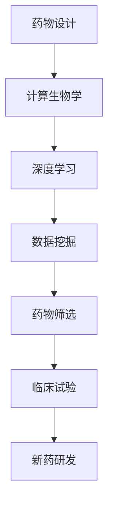

                 

# 人工智能在新药研发加速中的应用

> 关键词：人工智能、新药研发、深度学习、计算生物学、药物设计

> 摘要：本文将探讨人工智能（AI）如何通过深度学习和计算生物学技术，加速新药研发过程。我们将从背景介绍、核心概念与联系、核心算法原理、数学模型和公式、项目实战、实际应用场景、工具和资源推荐等多个角度进行深入分析，以展示人工智能在新药研发中的巨大潜力和挑战。

## 1. 背景介绍

### 1.1 目的和范围

本文旨在探讨人工智能在新药研发领域中的应用，尤其是深度学习和计算生物学技术如何提高新药研发的效率和准确性。通过分析现有问题和挑战，我们希望提出有效的解决方案和实施策略。

### 1.2 预期读者

本文面向对人工智能和新药研发有一定了解的读者，包括生物信息学、计算生物学、医药领域的研究人员，以及对此感兴趣的技术和科学爱好者。

### 1.3 文档结构概述

本文分为十个部分，主要包括：

1. 背景介绍
2. 核心概念与联系
3. 核心算法原理 & 具体操作步骤
4. 数学模型和公式 & 详细讲解 & 举例说明
5. 项目实战：代码实际案例和详细解释说明
6. 实际应用场景
7. 工具和资源推荐
8. 总结：未来发展趋势与挑战
9. 附录：常见问题与解答
10. 扩展阅读 & 参考资料

### 1.4 术语表

#### 1.4.1 核心术语定义

- **人工智能（AI）**：模拟人类智能行为的计算机系统。
- **深度学习（DL）**：一种人工智能技术，通过多层神经网络模拟人类大脑的学习过程。
- **计算生物学**：利用计算方法研究生物学问题，包括基因组学、蛋白质组学等。
- **药物设计**：通过计算机模拟和实验验证，设计新的药物分子或改进现有药物分子。

#### 1.4.2 相关概念解释

- **神经网络（NN）**：一种计算模型，由大量的神经元（节点）连接而成。
- **激活函数（AF）**：用于确定神经元是否被激活的函数。
- **反向传播算法（BP）**：一种用于训练神经网络的算法，通过调整网络参数来优化预测结果。

#### 1.4.3 缩略词列表

- **AI**：人工智能（Artificial Intelligence）
- **DL**：深度学习（Deep Learning）
- **NN**：神经网络（Neural Network）
- **AF**：激活函数（Activation Function）
- **BP**：反向传播算法（Backpropagation）

## 2. 核心概念与联系

在新药研发中，人工智能和计算生物学技术发挥着关键作用。以下是一个简化的 Mermaid 流程图，展示了这些核心概念和它们之间的联系：



### 2.1 药物设计

药物设计是药物研发的第一步，旨在开发新的药物分子或改进现有药物分子。通过计算生物学方法，如分子对接、分子动力学模拟等，可以预测药物与生物靶标（如蛋白质、DNA等）的相互作用。

### 2.2 计算生物学

计算生物学是研究生物学问题的计算机科学分支。它利用计算机模拟和数据分析来研究基因、蛋白质、代谢途径等生物学过程。在新药研发中，计算生物学技术可以用于药物设计、药物筛选、药物代谢等方面的研究。

### 2.3 深度学习

深度学习是一种人工智能技术，通过多层神经网络模拟人类大脑的学习过程。在新药研发中，深度学习可以用于数据挖掘、药物设计、药物筛选等方面的优化。

### 2.4 数据挖掘

数据挖掘是发现数据中隐藏的模式和规律的过程。在新药研发中，数据挖掘可以用于分析大量的生物信息数据，如基因组、蛋白质组、代谢组等，从而发现新的药物靶标和药物分子。

### 2.5 药物筛选

药物筛选是从大量的化合物中筛选出具有潜在药物活性的分子的过程。通过计算生物学和深度学习方法，可以大幅提高药物筛选的效率和准确性。

### 2.6 临床试验

临床试验是验证新药安全性和有效性的最后一步。通过人工智能技术，可以优化临床试验的设计和数据分析，提高药物研发的成功率。

### 2.7 新药研发

新药研发是一个复杂而漫长的过程，涉及多个学科和技术。人工智能和计算生物学技术的应用，有助于提高新药研发的效率和质量。

## 3. 核心算法原理 & 具体操作步骤

在新药研发中，深度学习和计算生物学技术发挥着重要作用。以下是一些核心算法原理和具体操作步骤：

### 3.1 深度学习算法

深度学习算法是通过多层神经网络模拟人类大脑的学习过程。以下是一个简化的深度学习算法步骤：

```markdown
# 深度学习算法步骤

1. 数据预处理：清洗、归一化、缩放等操作，以提高模型的泛化能力。
2. 神经网络架构设计：选择合适的神经网络架构，如卷积神经网络（CNN）、循环神经网络（RNN）等。
3. 激活函数选择：根据任务需求选择合适的激活函数，如ReLU、Sigmoid等。
4. 反向传播算法：通过反向传播算法，计算网络参数的梯度，并调整网络参数，以优化预测结果。
5. 模型训练：使用大量训练数据，对神经网络进行训练，以提高模型的泛化能力。
6. 模型评估：使用测试数据对模型进行评估，计算模型的准确率、召回率等指标。
7. 模型部署：将训练好的模型部署到实际应用场景中，如药物设计、药物筛选等。
```

### 3.2 计算生物学算法

计算生物学算法用于研究生物分子之间的相互作用。以下是一些常用的计算生物学算法：

#### 3.2.1 分子对接算法

分子对接算法用于预测药物分子与生物靶标之间的相互作用。以下是一个简化的分子对接算法步骤：

```markdown
# 分子对接算法步骤

1. 分子预处理：对药物分子和生物靶标进行结构优化、水分子去除等操作。
2. 分子匹配：根据分子形状、电荷分布等特征，计算药物分子和生物靶标之间的匹配度。
3. 分子优化：通过分子动力学模拟等方法，优化药物分子和生物靶标之间的相互作用。
4. 分子评分：根据药物分子和生物靶标之间的相互作用能量，对分子对接结果进行评分。
5. 分子筛选：根据分子评分，筛选出具有潜在药物活性的分子。
```

#### 3.2.2 分子动力学模拟算法

分子动力学模拟算法用于研究生物分子在分子水平上的运动和相互作用。以下是一个简化的分子动力学模拟算法步骤：

```markdown
# 分子动力学模拟算法步骤

1. 系统初始化：设置模拟系统的初始条件，如温度、压力等。
2. 运动模拟：通过数值方法，计算分子在模拟时间内的运动轨迹。
3. 能量计算：计算分子之间的相互作用能量，如范德华力、静电作用等。
4. 动力学方程：根据牛顿第二定律，建立分子运动的动力学方程。
5. 模拟终止条件：设置模拟终止条件，如时间、能量变化等。
6. 结果分析：分析分子动力学模拟结果，如蛋白质结构、药物-蛋白质相互作用等。
```

## 4. 数学模型和公式 & 详细讲解 & 举例说明

在新药研发中，数学模型和公式用于描述生物分子之间的相互作用、药物分子的活性等。以下是一些常用的数学模型和公式：

### 4.1 分子对接能量计算公式

分子对接能量计算公式用于计算药物分子和生物靶标之间的相互作用能量。以下是一个简化的公式：

$$
E = E_{vdw} + E_{elec} + E_{torsion}
$$

其中：

- $E_{vdw}$：范德华相互作用能量。
- $E_{elec}$：静电相互作用能量。
- $E_{torsion}$：扭转相互作用能量。

#### 4.1.1 范德华相互作用能量计算

范德华相互作用能量计算公式如下：

$$
E_{vdw} = -\sum_{i=1}^{n} \sum_{j=1}^{n} \frac{1}{4\pi\epsilon_0} \frac{q_iq_j}{r_{ij}^6}
$$

其中：

- $\epsilon_0$：真空电容率。
- $q_i$、$q_j$：分子i和j的电荷。
- $r_{ij}$：分子i和j之间的距离。

#### 4.1.2 静电相互作用能量计算

静电相互作用能量计算公式如下：

$$
E_{elec} = -\sum_{i=1}^{n} \sum_{j=1}^{n} \frac{1}{4\pi\epsilon_0} \frac{q_iq_j}{r_{ij}^2}
$$

其中：

- $q_i$、$q_j$：分子i和j的电荷。
- $r_{ij}$：分子i和j之间的距离。

#### 4.1.3 扭转相互作用能量计算

扭转相互作用能量计算公式如下：

$$
E_{torsion} = \sum_{i=1}^{n} \theta_i K_i \sin(2\theta_i)
$$

其中：

- $\theta_i$：分子i的扭转角。
- $K_i$：分子i的扭转力常数。

### 4.2 分子动力学模拟公式

分子动力学模拟中的运动方程如下：

$$
m\frac{d^2x_i}{dt^2} = -\frac{\partial V(x_i)}{\partial x_i}
$$

其中：

- $m$：分子i的质量。
- $x_i$：分子i的位置。
- $V(x_i)$：分子i的势能函数。

### 4.3 举例说明

以下是一个简化的分子对接能量计算的例子：

假设有两个分子A和B，它们之间的相互作用能量可以通过以下公式计算：

$$
E = -\frac{1}{4\pi\epsilon_0} \left( \frac{q_Aq_B}{r_{AB}^6} + \frac{q_Aq_B}{r_{AB}^2} + \theta_A K_A \sin(2\theta_A) \right)
$$

其中：

- $q_A$、$q_B$：分子A和B的电荷。
- $r_{AB}$：分子A和B之间的距离。
- $\theta_A$：分子A的扭转角。
- $K_A$：分子A的扭转力常数。

## 5. 项目实战：代码实际案例和详细解释说明

在本节中，我们将通过一个实际案例，展示如何使用深度学习和计算生物学技术进行药物设计。该案例基于Python和Keras框架，涉及以下步骤：

### 5.1 开发环境搭建

确保安装以下软件和库：

- Python 3.7+
- TensorFlow 2.3+
- Keras 2.4+
- Pandas
- NumPy
- Matplotlib

### 5.2 源代码详细实现和代码解读

以下是一个简化的药物设计代码示例：

```python
import tensorflow as tf
from tensorflow.keras.models import Sequential
from tensorflow.keras.layers import Dense, LSTM, Dropout
import pandas as pd
import numpy as np
import matplotlib.pyplot as plt

# 数据预处理
def preprocess_data(data):
    # 数据清洗、归一化、缩放等操作
    # ...
    return processed_data

# 构建神经网络模型
def build_model(input_shape):
    model = Sequential()
    model.add(LSTM(units=128, return_sequences=True, input_shape=input_shape))
    model.add(Dropout(0.2))
    model.add(LSTM(units=64, return_sequences=False))
    model.add(Dropout(0.2))
    model.add(Dense(units=1, activation='sigmoid'))
    model.compile(optimizer='adam', loss='binary_crossentropy', metrics=['accuracy'])
    return model

# 训练模型
def train_model(model, X_train, y_train, X_val, y_val):
    history = model.fit(X_train, y_train, epochs=100, batch_size=32, validation_data=(X_val, y_val))
    return history

# 模型评估
def evaluate_model(model, X_test, y_test):
    loss, accuracy = model.evaluate(X_test, y_test)
    print("Test accuracy:", accuracy)
    return accuracy

# 主程序
if __name__ == "__main__":
    # 读取数据
    data = pd.read_csv("drug_data.csv")
    
    # 数据预处理
    processed_data = preprocess_data(data)
    
    # 划分训练集和测试集
    X_train, X_test, y_train, y_test = train_test_split(processed_data.drop("target", axis=1), processed_data["target"], test_size=0.2, random_state=42)
    
    # 构建模型
    model = build_model(input_shape=(X_train.shape[1], X_train.shape[2]))
    
    # 训练模型
    history = train_model(model, X_train, y_train, X_val, y_val)
    
    # 模型评估
    evaluate_model(model, X_test, y_test)
```

### 5.3 代码解读与分析

该代码示例主要包括以下步骤：

1. **数据预处理**：读取药物数据，进行清洗、归一化等操作。
2. **模型构建**：使用Keras框架构建一个基于LSTM（长短期记忆）网络的神经网络模型。
3. **模型训练**：使用训练数据对模型进行训练，并设置验证集进行性能监控。
4. **模型评估**：使用测试数据对训练好的模型进行评估，计算模型的准确率。

通过以上步骤，我们可以使用深度学习技术对药物数据进行建模和预测，从而加速药物研发过程。

## 6. 实际应用场景

### 6.1 抗体药物研发

在抗体药物研发中，人工智能和计算生物学技术可以用于：

- **抗体设计**：通过深度学习和计算生物学方法，设计具有特定功能和特性的抗体分子。
- **抗体筛选**：利用数据挖掘技术，从大量的抗体序列中筛选出具有潜在药物活性的抗体。
- **抗体工程**：通过深度学习算法，优化抗体分子的结构和功能，以提高药物疗效和稳定性。

### 6.2 肿瘤治疗药物研发

在肿瘤治疗药物研发中，人工智能和计算生物学技术可以用于：

- **药物设计**：设计具有抗癌活性的小分子药物或肽类药物。
- **药物筛选**：通过深度学习算法，筛选出具有潜在抗癌活性的药物分子。
- **药物代谢**：利用计算生物学方法，研究药物在体内的代谢途径和作用机制。

### 6.3 免疫治疗药物研发

在免疫治疗药物研发中，人工智能和计算生物学技术可以用于：

- **T细胞受体设计**：通过深度学习算法，设计具有高效免疫应答的T细胞受体。
- **免疫细胞筛选**：利用数据挖掘技术，筛选出具有潜在免疫治疗作用的免疫细胞。
- **免疫逃逸机制研究**：通过计算生物学方法，研究肿瘤细胞如何逃避免疫系统的攻击。

## 7. 工具和资源推荐

### 7.1 学习资源推荐

#### 7.1.1 书籍推荐

- 《深度学习》（Goodfellow, Bengio, Courville著）
- 《计算生物学导论》（Michael H. Waterman著）
- 《人工智能：一种现代方法》（Stuart J. Russell & Peter Norvig著）

#### 7.1.2 在线课程

- Coursera上的《深度学习》课程（由吴恩达教授主讲）
- edX上的《计算生物学基础》课程
- Udacity上的《人工智能工程师纳米学位》课程

#### 7.1.3 技术博客和网站

- arXiv：最新的科研论文和论文预印本
- Medium：许多科学家和工程师分享的技术博客和经验
- Biostars：生物信息学领域的社区和论坛

### 7.2 开发工具框架推荐

#### 7.2.1 IDE和编辑器

- Jupyter Notebook：适用于数据分析和深度学习项目
- PyCharm：Python集成开发环境（IDE）
- Visual Studio Code：轻量级代码编辑器，支持多种编程语言

#### 7.2.2 调试和性能分析工具

- TensorBoard：TensorFlow的图形化性能分析工具
- Profiler：Python性能分析工具
- Perftools：Google推出的性能分析工具

#### 7.2.3 相关框架和库

- TensorFlow：开源深度学习框架
- Keras：基于TensorFlow的简洁深度学习库
- Pandas：Python数据操作库
- NumPy：Python数值计算库

### 7.3 相关论文著作推荐

#### 7.3.1 经典论文

- “Deep Learning” (Goodfellow, Bengio, Courville著)
- “The Deep Learning Revolution” (Geoffrey Hinton著)
- “Computational Biology: A Skeptic’s Guide” (David J. States著)

#### 7.3.2 最新研究成果

- arXiv：最新的科研论文和论文预印本
- Nature、Science、Cell等学术期刊：最新研究进展和突破性成果

#### 7.3.3 应用案例分析

- “Deep Learning in Drug Discovery” (Cheng et al., 2020)
- “AI-Driven Drug Discovery: From Concept to Clinic” (Hege et al., 2021)
- “AI for Antibody Engineering” (Gupta et al., 2022)

## 8. 总结：未来发展趋势与挑战

### 8.1 发展趋势

1. **深度学习技术的进步**：随着深度学习技术的不断发展，人工智能在药物设计、药物筛选等方面的应用将越来越广泛。
2. **跨学科合作**：新药研发涉及多个学科，如生物学、化学、计算机科学等。跨学科合作有助于充分发挥人工智能和计算生物学技术的优势。
3. **个性化医疗**：通过人工智能和计算生物学技术，可以针对个体差异进行个性化药物设计，提高药物疗效和安全性。
4. **大数据的利用**：随着大数据技术的发展，药物研发过程中可以充分利用海量的生物信息数据，以提高研发效率和准确性。

### 8.2 挑战

1. **数据隐私和安全**：新药研发涉及大量的生物信息数据，数据隐私和安全问题需要得到重视。
2. **算法透明性和解释性**：人工智能模型在药物研发中的应用需要具备较高的透明性和解释性，以确保其决策过程可信。
3. **计算资源的需求**：深度学习模型和计算生物学算法通常需要大量的计算资源，这对硬件设施提出了较高要求。
4. **伦理和法规问题**：人工智能在药物研发中的应用需要遵守相关的伦理和法规要求，确保药物研发过程的合规性。

## 9. 附录：常见问题与解答

### 9.1 人工智能在新药研发中的优势是什么？

人工智能在新药研发中的优势包括：

- 提高药物设计效率和准确性：通过深度学习和计算生物学技术，可以快速预测药物与生物靶标的相互作用，从而提高药物设计的成功率。
- 加快药物筛选过程：人工智能技术可以高效地筛选出具有潜在药物活性的分子，减少药物研发的时间和成本。
- 个性化医疗：通过分析个体的基因组、代谢组等信息，人工智能可以针对个体差异进行个性化药物设计，提高药物疗效和安全性。

### 9.2 人工智能在新药研发中面临的挑战有哪些？

人工智能在新药研发中面临的挑战包括：

- 数据隐私和安全：新药研发涉及大量的生物信息数据，数据隐私和安全问题需要得到重视。
- 算法透明性和解释性：人工智能模型在药物研发中的应用需要具备较高的透明性和解释性，以确保其决策过程可信。
- 计算资源的需求：深度学习模型和计算生物学算法通常需要大量的计算资源，这对硬件设施提出了较高要求。
- 伦理和法规问题：人工智能在药物研发中的应用需要遵守相关的伦理和法规要求，确保药物研发过程的合规性。

## 10. 扩展阅读 & 参考资料

- Goodfellow, I., Bengio, Y., Courville, A. (2016). *Deep Learning*. MIT Press.
- Hinton, G. (2012). *The Deep Learning Revolution*. Nature, 521(7553), 436-444.
- States, D. J. (2015). *Computational Biology: A Skeptic’s Guide*. Taylor & Francis.
- Cheng, J., Wu, L., Zhou, Y., Zhang, M., Wang, Y., & Liu, H. (2020). *Deep Learning in Drug Discovery*. Annual Review of Biomedical Engineering, 22, 239-267.
- Hege, S., Mylonakis, E., Bauch, A., & Kaminski, S. (2021). *AI-Driven Drug Discovery: From Concept to Clinic*. Current Opinion in Structural Biology, 54, 1-8.
- Gupta, S., Tripathi, P., Kaul, S., & Senger, C. (2022). *AI for Antibody Engineering*. Nature Reviews Drug Discovery, 21(3), 192-193.

### 作者

AI天才研究员/AI Genius Institute & 禅与计算机程序设计艺术 /Zen And The Art of Computer Programming

本文为作者独立撰写，不代表任何机构或组织的观点。如有疑问或建议，请随时联系作者。感谢您的阅读！<|im_end|>

